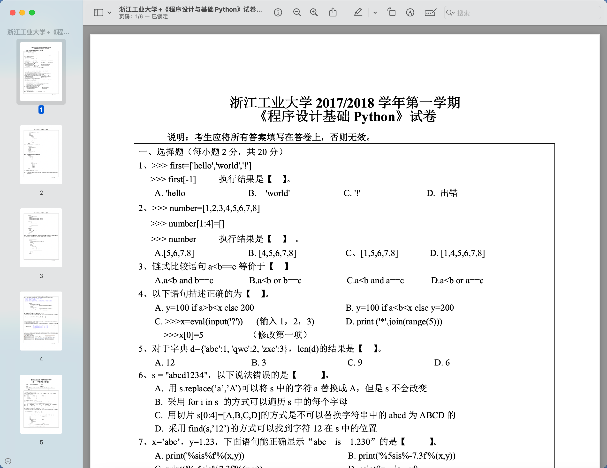
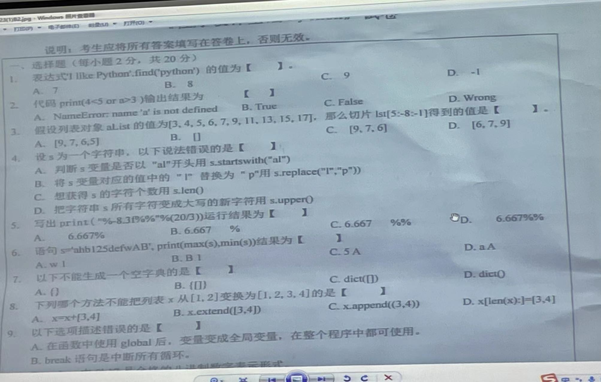

## 浙江工业大学 **2017/2018** 学年第一学期

《程序设计基础 **Python**》试卷



## 一、选择题(每小题 2 分，共 20 分)

1. 如下代码执行结果是什么？

```python
>>> first=['hello','world','!']
>>> first[-1]
```

A. `'hello`

B. `'world'`

C. `'!'`

D. 出错

2. 如下代码执行结果是什么？

```python
>>> number=[1, 2, 3, 4, 5, 6, 7, 8]
>>> number[1:4] = []
>>> number
```

A. `[5,6,7,8]`

B. `[4,5,6,7,8]`

C. `[1,5,6,7,8]`

D. `[1,4,5,6,7,8]`

3. 链式比较语句 `a<b==c` 等价于

A. `a<b and b==c`

B. `a<b or b==c`

C. `a<b and a==c`

D. `a<b or a==c`

1 < x < 10：`x > 1 and x < 10`

4. 以下语句描述正确的为：

A. `y = 100 if a > b < x else 200`

B. `y=100 if a<b<x else y=200`

C. `>>>x=eval(input('?'))` (输入 1，2，3)

`>>>x[0]=5`(修改第一项)

D. `print ('*'.join(range(5)))`

5. 对于字典 `d={'abc':1, 'qwe':2, 'zxc':3}`，`len(d)`的结果是

A. 12

B. 3

C. 9

D. 6

6. `s = "abcd1234"`，以下说法错误的是

A. 用 `s.replace('a','A')`可以将 s 中的字符 a 替换成 A，但是 s 不会改变

B. 采用 `for i in s` 的方式可以遍历 s 中的每个字母

C. 用切片 `s[0:4]=[A,B,C,D]` 的方式是不可以替换字符串中的 abcd 为 ABCD 的

D. 采用 `find(s,'12')`的方式可以找到字符 12 在 s 中的位置

7. `x='abc'`，`y=1.23`，下面语句能正确显示“`abc is 1.230`”的是

A. `print('%sis%f' % (x, y))`

B. `print('%5sis%-7.3f' % (x, y))`

C. `print('%-5sis%7.3f' % (x, y))`

D. `print('x is y')`

在这个格式化字符串中，`%-5s` 是一个格式说明符，用于指定字符串的格式。

`%` 符号表示这是一个格式说明符的开始。接下来的 `-5` 有两个作用：

1. `-` 符号表示左对齐。在默认情况下，字符串会右对齐。使用 `-` 符号会使字符串左对齐。
2. `5` 表示字符串的最小宽度。这里，最小宽度为 5 个字符。如果字符串的长度小于 5 个字符，那么将在字符串的右侧添加空格，直到达到指定的宽度。

因此，`%-5s` 表示一个左对齐的字符串，其最小宽度为 5 个字符。

在你给出的例子中，`% (x, y)` 将被替换为提供的变量 `x` 和 `y` 的值。注意，此处的 `x` 应该是一个字符串，而 `y` 应该是一个浮点数。

8. 下列哪项不是 Python 中对文件的读取操作:

A. read

B. readall

C. readlines

D. readline

```python
f = open("demo.txt", "r")
content = f.readline()
print(content)
f.close()
```

9. 关于类的概念，以下说法错误的是

A. 对象是由类创建的，类的实例是对象

B. 面向对象程序设计语言有三个基本特征:封装型、继承性、多态性 

C. self 必须是方法的第一个形参，代表要创建的对象本身

D. 类的私有属性不可以在类的外部被访问

10. 使用 with 语句打开文件的好处是

A. 文件可以在完成处理后自动关闭

B. 文件可以采用别名

C. 不利用缓存直接打开文件

D. 打开速度快

```python
with open("demo.txt", "r") as f:
    content = f.readlines()
    print(content)
```




## 程序题

---

## 级数求和

级数求和 `e=1+1/1!+1/2!+...`,精确到第 7 位小数

### 什么是级数求和？

级数求和是数学中一种基本的计算方法，用于求解一系列数值的和。在这个过程中，通常会对一个数列（序列）中的项进行求和。数列是按照一定规律排列的数的集合，而级数则是这些数的和。级数可以表示为：

$S = a_1 + a_2 + a_3 + ... + a_n$

其中，$a_i$ 表示数列中的第 i 项，S 表示级数的和。

级数求和有很多种方法，根据数列的性质和级数的形式，可以分为以下几类：

1. 等差级数：等差数列中相邻两项的差相等，即 $a_{i+1} - a_i = d$ ，其中 d 为公差。等差级数求和公式为：

    $S = n * (a_1 + a_n) / 2$ 或者 $S = n * [2 * a_1 + (n - 1) * d] / 2$

2. 等比级数：等比数列中相邻两项的比相等，即 $a_{i+1} / a_i = r$，其中 r 为公比。等比级数求和公式分为有限等比级数和无限等比级数两种：

    有限等比级数：$S = a_1 * (1 - r^n) / (1 - r)$

    无限等比级数：当 $|r| < 1$ 时，$S = a_1 / (1 - r)$

3. 幂级数：幂级数是形如 $S = a_0 + a_1 * x + a_2 * x^2 + a_3 * x^3 + ...$ 的级数，其中 x 为变量。幂级数的求和方法取决于级数的收敛性。常见的幂级数求和方法有泰勒级数、洛朗级数等。

4. 其他级数：还有其他类型的级数求和方法，如交错级数、收敛级数、发散级数等。求和方法因级数的性质而异。

级数求和在许多数学领域中都有应用，例如微积分、实分析、复分析等。通过级数求和，我们可以得到一些重要的数学结论和公式。

要计算 e 的近似值，我们可以使用这个级数求和公式：$e ≈ 1 + 1/1! + 1/2! + 1/3! + ...$。为了计算 e 的值，精确到小数点后第 7 位，我们需要计算数列的前若干项，直到第 n 项使得：

$|e - (1 + 1/1! + 1/2! + ... + 1/n!)| < 10^(-7)$

下面是计算的过程：

1. $n = 0$，$S_0 = 1$
2. $n = 1$，$S_1 = 1 + 1/1! = 2$
3. $n = 2$，$S_2 = 1 + 1/1! + 1/2! = 2.5$
4. $n = 3$，$S_3 = 1 + 1/1! + 1/2! + 1/3! ≈ 2.666667$
5. $n = 4$，$S_4 = 1 + 1/1! + 1/2! + 1/3! + 1/4! ≈ 2.708333$
6. $n = 5$，$S_5 = 1 + 1/1! + 1/2! + 1/3! + 1/4! + 1/5! ≈ 2.716667$
7. $n = 6$，$S_6 = 1 + 1/1! + 1/2! + 1/3! + 1/4! + 1/5! + 1/6! ≈ 2.718056$
8. $n = 7$，$S_7 = 1 + 1/1! + 1/2! + 1/3! + 1/4! + 1/5! + 1/6! + 1/7! ≈ 2.718254$
9. $n = 8$，$S_8 = 1 + 1/1! + 1/2! + 1/3! + 1/4! + 1/5! + 1/6! + 1/7! + 1/8! ≈ 2.718279$

计算到第 8 项时，级数和已经精确到了小数点后第 7 位。因此，e 的近似值为：

$e ≈ 2.7182790$

```python
def calculate_e(precision):
    e = 0       # 初始化 e 的值为 0
    n = 0       # 初始化 n 的值为 0，表示当前项的下标
    term = 1    # 初始化 term 的值为 1，表示当前项的值
    
    # 当 term 的值大于等于指定的精度时，继续循环
    while term >= precision:
        e += term     # 将当前项的值累加到 e 上
        n += 1        # 更新 n 的值，即移动到下一项
        term /= n     # 更新 term 的值，计算下一项的值（当前项的值除以 n）

    return e    # 返回计算得到的 e 的近似值

precision = 1e-7   # 设置精度为 10^(-7)
e_approx = calculate_e(precision)   # 调用函数计算 e 的近似值
print("e 的近似值（精确到小数点后第 7 位）：{:.7f}".format(e_approx))   # 打印计算结果，保留 7 位小数
```

## 程序设计题

某水果店各类水果零售价格保存在字典中 d 中，以水果名称为键，售价（单位元/斤）为值，如 `{'苹果': 5, '山竹': 55, '西瓜': 10}`。每种水果如果购买超过 5 斤则有优惠，在 5 （含）到10 斤（不含）打九九折，10 斤及以上打九五折。请编写程序对用户输入的水果及重量（逗号分隔），计算总价，精确到小数点后 1 位。（此题字典 d 已知，可以直接使用）

| 输入示例 | `"苹果"`,2,`"西瓜"`,9 | 输出示例 | 总费用:99.1元 |
| -------- | --------------------- | -------- | ------------- |

```python
d = {'苹果': 5, '山竹': 55, '西瓜': 10}  # 从这里接着往下写
```

```python
d = {'苹果': 5, '山竹': 55, '西瓜': 10}  # 从这里接着往下写

total = 0
user_input = input("请输入购买的水果及重量，如'苹果,2,西瓜,9': ")
input_list = user_input.split(",")
# print(input_list)

for i in range(0, len(input_list), 2):
    fruit = input_list[i]
    weight = float(input_list[i + 1])
    price = d[fruit]
    if 5 <= weight < 10:
        total += price * weight * 0.99  # 九折
    elif weight >= 10:
        total += price * weight * 0.95  # 九五折
    else:
        total += price * weight
print(f"总费用:{round(total, 1)}元")
print(f"总费用:{total:.1f}元")
```

```python
d = {"苹果": 5, "山竹": 55, "西瓜": 10}
total = 0
user_input = input("请输入购买水果及重量，如'苹果,2,西瓜,9':")
input_list = user_input.split(",")  # split会得到列表
print(input_list)

for i in range(0, len(input_list), 2):
    fruit = input_list[i]
    discount = 1
    weight = float(input_list[i + 1])
    if weight < 5:
        discount = 1
    elif weight < 10:
        discount = 0.99
    else:
        discount = 0.95
    price = d[fruit] * weight * discount
    total = total + price
print(round(total, 1))
```


表达式 `sum([n // 2 + 1 if n % 2 else n + 3 for n in range(10) if n % 3 == 0])` 的值为：

A. 16

B. 19

C. 22

D. 23

```python
r = sum([n // 2 + 1 if n % 2 else n + 3 for n in range(10) if n % 3 == 0])
print(r)
total = 0
for n in range(10):
    if n % 3 == 0:
        if n % 2:
            total += n // 2 + 1
        else:
            total += n + 3
print(total)
```


::: details 公众号：AI悦创【二维码】


:::

::: info AI悦创·编程一对一

AI悦创·推出辅导班啦，包括「Python 语言辅导班、C++ 辅导班、java 辅导班、算法/数据结构辅导班、少儿编程、pygame 游戏开发、Web、Linux」，全部都是一对一教学：一对一辅导 + 一对一答疑 + 布置作业 + 项目实践等。当然，还有线下线上摄影课程、Photoshop、Premiere 一对一教学、QQ、微信在线，随时响应！微信：Jiabcdefh

C++ 信息奥赛题解，长期更新！长期招收一对一中小学信息奥赛集训，莆田、厦门地区有机会线下上门，其他地区线上。微信：Jiabcdefh

方法一：[QQ](http://wpa.qq.com/msgrd?v=3&uin=1432803776&site=qq&menu=yes)

方法二：微信：Jiabcdefh

:::


