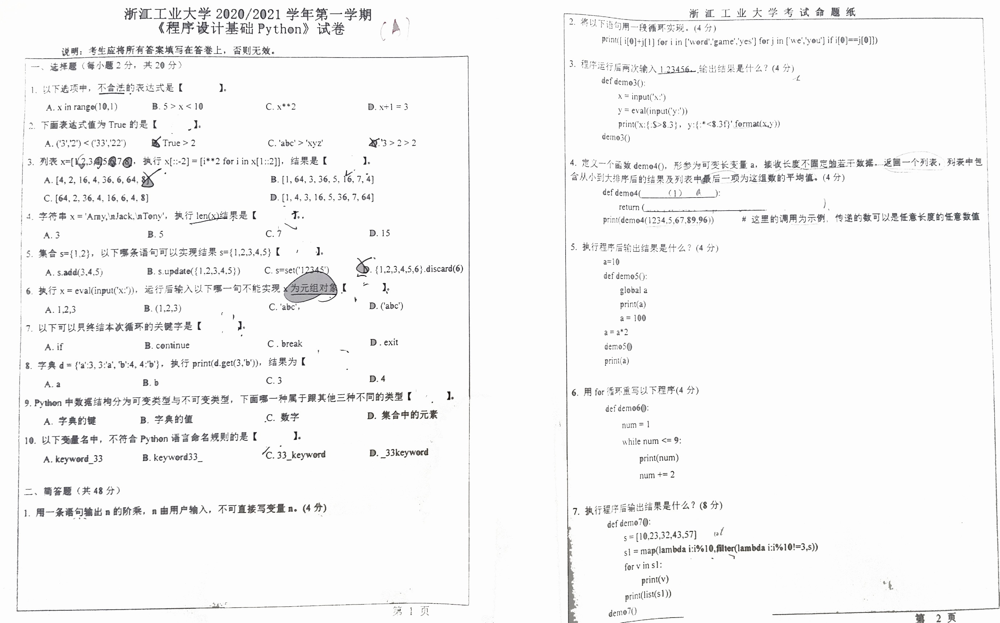
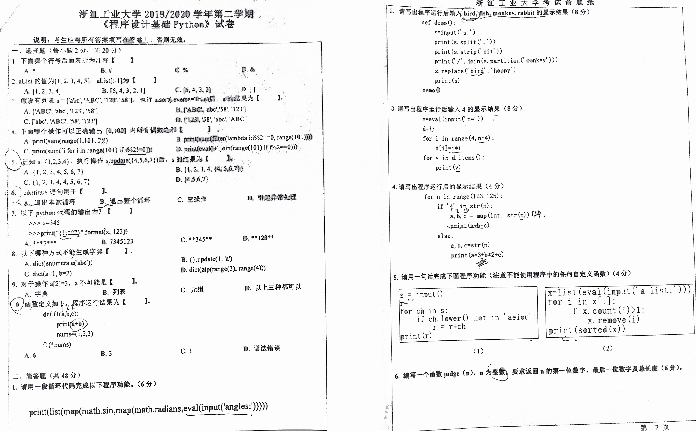
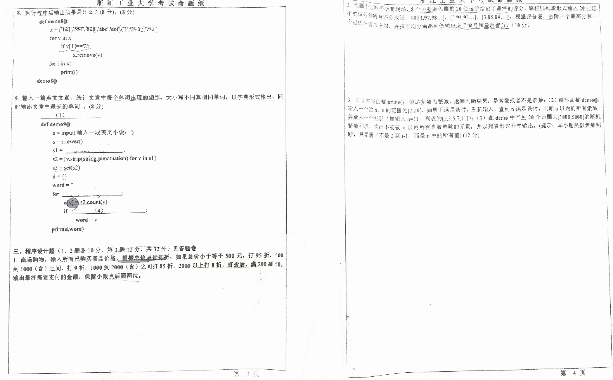
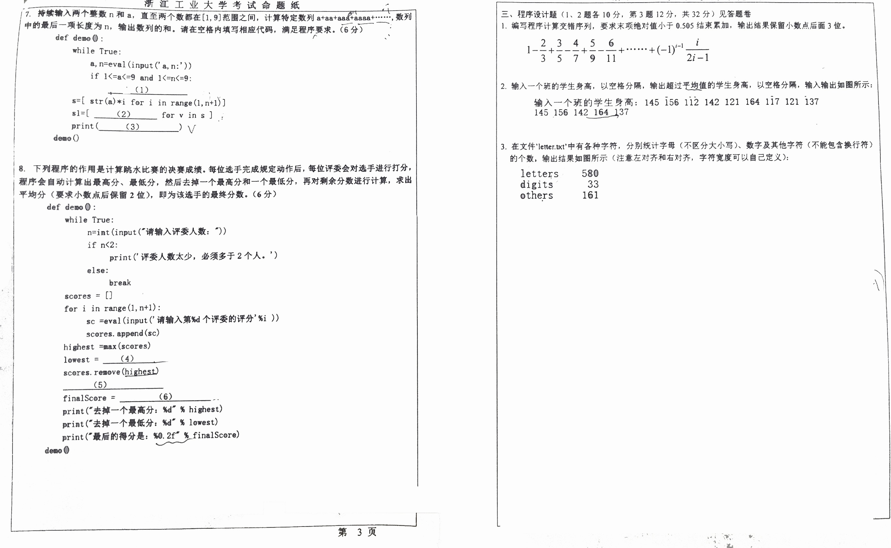

::: tabs

@tab 1



@tab 2



@tab 3



@tab 4



:::


## 编程题

1. 商场购物，输入所有已购买商品价格，根据总价进行打折：如果总价小于等于 500 元，打 95 折，500 到 1000 （含）之间，打 9折，1000 到 2000（含）之间打 85 折，2000 以上打 8 折，打折后，满 200 减 50，输出最终需要支付的金额，保留小数点后面两位。

```python
def calculate_price(prices):
    total_price = sum(prices)

    if total_price <= 500:
        discount_price = total_price * 0.95
    elif total_price <= 1000:
        discount_price = total_price * 0.9
    elif total_price <= 2000:
        discount_price = total_price * 0.85
    else:
        discount_price = total_price * 0.8

    if discount_price >= 200:
        final_price = discount_price - 50
    else:
        final_price = discount_price

    return round(final_price, 2)


# 例如，商品价格分别为 300 元，200 元，500 元，和 1000 元
prices = [300, 200, 500, 1000]
print(calculate_price(prices))
```

2. 校园十佳歌手决赛现场，8 个评委对入围的 20 位选手给出了最终的评分，编程以列表形式输入 20 位选手的编号和所有评分成绩，如 `[[1, 97, 98...], [2, 94, 92...], [3, 85, 84...]`，根据评分表，去除一个最高分和一个最低分后求平均，并按平均分由高到低输出选手编号和最后得分。

```python
def calculate_scores(players):
    results = []

    for player in players:
        scores = sorted(player[1:])  # 对成绩进行排序
        scores = scores[1:-1]  # 去除最高和最低分
        avg_score = sum(scores) / len(scores)  # 计算平均分
        results.append([player[0], round(avg_score, 2)])  # 保存选手编号和平均分

    results.sort(key=lambda x: x[1], reverse=True)  # 根据平均分进行排序

    return results


# 例如，以下是三位选手的编号和评分：
players = [[1, 97, 98, 95, 92, 96, 94, 90, 93, 95],
           [2, 94, 92, 93, 95, 96, 94, 90, 91, 93],
           [3, 85, 84, 87, 88, 86, 85, 86, 88, 89]]
print(calculate_scores(players))
```

3. （1）编写函数 `prime()` ，传递参数为整数，返回判断结果：是素数或者不是素数；

    （2）编写函数 `demo()` ，输入一个数 n，n 的范围为 `[2, 20]`，如果不满足条件，重新输入，直到 n 满足条件，判断 n 以内的所有素数，并放入一个列表（如输入 n=11，列表为 `[2, 3, 5, 7, 11]`；

    （3）在 demo 中产生 20 个范围为 `[1000, 5000]` 的随机整数列表，找出不能被 n 以内所有素数整除的元素，并以列表形式升序输出。「提示：本小题类似素数判断，只是因子不是 2 到 i-1，而是 n 中的所有值」

```python
import random

def prime(n):
    if n <= 1:
        return False
    for i in range(2, int(n**0.5) + 1):
        if n % i == 0:
            return False
    return True

def demo():
    while True:
        n = int(input("请输入一个在 [2, 20] 范围内的数："))
        if 2 <= n <= 20:
            break
        print("输入不满足条件，请重新输入！")

    primes = [i for i in range(2, n+1) if prime(i)]
    print("n以内的所有素数列表：", primes)

    random_numbers = [random.randint(1000, 5000) for _ in range(20)]
    result = sorted([num for num in random_numbers if any(num % p == 0 for p in primes)])
    
    print("不能被 n 以内所有素数整除的元素列表：", result)

demo()
```

::: tabs

@tab 题解

（1）编写函数 `prime()` ，用于判断一个数是否为素数：

```python
def prime(n):
    if n < 2:
        return False
    for i in range(2, int(n**0.5) + 1):
        if n % i == 0:
            return False
    return True
```
在这个函数中，我们首先检查数字是否小于2，因为2是最小的素数。然后，我们迭代从2到n的平方根的所有数字，检查n是否可以被这些数字整除。如果n能被任何一个这样的数字整除，那么n就不是素数。如果没有找到这样的因子，那么n就是素数。

（2）编写函数 `demo()` ，用于判断 n 以内的所有素数：

```python
import random

def demo():
    n = int(input("请输入一个在 [2, 20] 之间的整数："))
    while n < 2 or n > 20:
        n = int(input("请输入一个在 [2, 20] 之间的整数："))
    primes = [i for i in range(2, n + 1) if prime(i)]
    print(f"n 以内的所有素数为: {primes}")

    random_numbers = [random.randint(1000, 5000) for _ in range(20)]
    non_divisible = [num for num in random_numbers if any(num % p != 0 for p in primes)]
    non_divisible.sort()
    print(f"不能被 n 以内所有素数整除的元素为: {non_divisible}")
```
在这个函数中，我们首先提示用户输入一个在[2, 20]之间的整数。如果输入的数不在这个范围内，我们会继续提示用户，直到他们输入一个符合条件的数。然后，我们使用列表推导式找到这个范围内的所有素数，并将这些素数打印出来。

然后，我们生成20个在[1000, 5000]范围内的随机整数。我们再次使用列表推导式，找到那些不能被n以内所有素数整除的数，将这些数排序，并将它们打印出来。

需要注意的是，`random.randint(a, b)` 函数返回一个在[a, b]范围内的随机整数，其中包括a和b。`any()` 函数返回一个布尔值，表示是否有任何元素在其内部为 `True`。

@tab 代码注释

```python
# 导入random模块，后面生成随机数时会使用到
import random

# 定义一个判断素数的函数，参数为整数n
def prime(n):
    # 如果n小于2，直接返回False，因为最小的素数是2
    if n < 2:
        return False
    # 对于每一个在2到sqrt(n)的数字i，尝试用n去除以i
    for i in range(2, int(n**0.5) + 1):
        # 如果n能被i整除，那么n就不是素数，返回False
        if n % i == 0:
            return False
    # 如果n不能被2到sqrt(n)范围内的任何数字整除，那么n就是素数，返回True
    return True

# 定义主函数，用于实现题目要求的功能
def demo():
    # 提示用户输入一个在[2, 20]范围内的整数，将输入的字符串转换为整数
    n = int(input("请输入一个在 [2, 20] 之间的整数："))
    # 如果用户输入的数不在[2, 20]范围内，就一直提示用户重新输入
    while n < 2 or n > 20:
        n = int(input("请输入一个在 [2, 20] 之间的整数："))
    # 使用列表推导式找出n以内的所有素数，并将这些素数赋值给变量primes
    primes = [i for i in range(2, n + 1) if prime(i)]
    # 打印出n以内的所有素数
    print(f"n 以内的所有素数为: {primes}")

    # 生成一个包含20个在[1000, 5000]范围内的随机整数的列表
    random_numbers = [random.randint(1000, 5000) for _ in range(20)]
    # 对于这个随机数列表中的每一个数，检查它是否能被primes中的任何一个素数整除
    # 如果不能，就将这个数添加到新的列表non_divisible中
    non_divisible = [num for num in random_numbers if any(num % p != 0 for p in primes)]
    # 对新的列表进行升序排序
    non_divisible.sort()
    # 打印出不能被n以内所有素数整除的数
    print(f"不能被 n 以内所有素数整除的元素为: {non_divisible}")
```

@tab` range(2, int(n**0.5) + 1)`

在解释这一点之前，我们首先要理解素数的定义：素数是只有两个正因子（即 1 和本身）的自然数，且必须大于1。

现在，让我们解释一下为什么检查范围是从 2 到 `sqrt(n) + 1`。

1. **为什么从 2 开始检查**：因为所有数都可以被 1 整除，所以检查是否能被 1 整除并不能帮助我们确定一个数是否是素数。同样地，因为所有数都能被自己整除，所以检查一个数是否能被自己整除也没有意义。因此，我们从 2 开始检查。

2. **为什么检查到 sqrt(n) + 1**：这个策略是为了减少不必要的计算。让我们想一下，如果 n 不是一个素数，那么它至少有一个因子在2和n之间。如果n的所有因子都大于sqrt(n)，那么当这些因子相乘时，结果将会大于n，这与它们是n的因子的事实相矛盾。因此，如果n有大于1且小于n的因子，那么至少有一个因子不会大于sqrt(n)。因此，我们只需要检查2到sqrt(n)范围内的数就可以了。

3. **为什么是到sqrt(n) + 1，而不仅仅是到sqrt(n)**：这是因为在Python中，`range(a, b)`函数会包含a，但不包含b，所以我们要确保sqrt(n)被包含在检查的范围内。当n是一个完全平方数（如4, 9, 16...）时，sqrt(n)是一个整数，我们需要包含这个整数在内，所以我们使用 `sqrt(n) + 1` 作为上界。

:::


4. 在文件 `'letter.txt'` 中有各种字符，分别统计字母（不区分大小写）、数字及其他字符（不能包含换行符）的个数，输出结果如下所示（注意左对齐和右对齐，字符宽度可以自己定义）；

```
letters    580
digits     33
others     161
```

```python
from collections import defaultdict

# 初始化一个默认字典用于计数
counts = defaultdict(int)

# 读取文件
with open('letter.txt', 'r') as f:
    for line in f:
        for ch in line.rstrip('\n'):  # 排除换行符
            if ch.isalpha():  # 判断字符是否为字母
                counts['letters'] += 1
            elif ch.isdigit():  # 判断字符是否为数字
                counts['digits'] += 1
            else:
                counts['others'] += 1  # 其他字符

# 输出结果
for key, count in counts.items():
    print(f'{key:<10} {count:>3}')  # 注意左对齐（<）和右对齐（>），这里字符宽度设定为 10 和 3
```


## 知识点补充

在Python中，`%5d`是一个旧式的字符串格式化指令，用于格式化整数（decimal）。

这个格式化指令的组成是一个`%`符号，后面跟着一个整数和一个字母`d`。这个整数定义了该字段的最小宽度。如果要格式化的数字的位数少于这个宽度，那么输出的字符串前面将会用空格填充至指定的宽度。

`%5d`表示一个占位符，表示在这个位置将被一个整数取代，整数将以至少5个字符的宽度显示。如果整数的数字少于5位，那么结果会在左边用空格填充以达到5个字符的宽度。例如：

```python
print("%5d" % 123)
print("%5d" % 45)
print("%5d" % 7)
```

以上面的代码为例，输出将会是：

```
  123
   45
    7
```

注意每行数字前面的空格。第一行前面有两个空格，因为123是一个三位数，需要两个额外的空格来达到5个字符的宽度。第二行前面有三个空格，因为45是一个两位数，需要三个额外的空格来达到5个字符的宽度。第三行前面有四个空格，因为7是一个一位数，需要四个额外的空格来达到5个字符的宽度。

因此，在你的代码中，`print("letters%5d" % a)`，`print("digits%5d" % b)`和`print("others%5d" % c)`将分别输出"a的值、b的值和c的值"，并且每个值都将至少以5个字符的宽度显示。


::: details 公众号：AI悦创【二维码】


:::

::: info AI悦创·编程一对一

AI悦创·推出辅导班啦，包括「Python 语言辅导班、C++ 辅导班、java 辅导班、算法/数据结构辅导班、少儿编程、pygame 游戏开发、Web、Linux」，全部都是一对一教学：一对一辅导 + 一对一答疑 + 布置作业 + 项目实践等。当然，还有线下线上摄影课程、Photoshop、Premiere 一对一教学、QQ、微信在线，随时响应！微信：Jiabcdefh

C++ 信息奥赛题解，长期更新！长期招收一对一中小学信息奥赛集训，莆田、厦门地区有机会线下上门，其他地区线上。微信：Jiabcdefh

方法一：[QQ](http://wpa.qq.com/msgrd?v=3&uin=1432803776&site=qq&menu=yes)

方法二：微信：Jiabcdefh

:::


