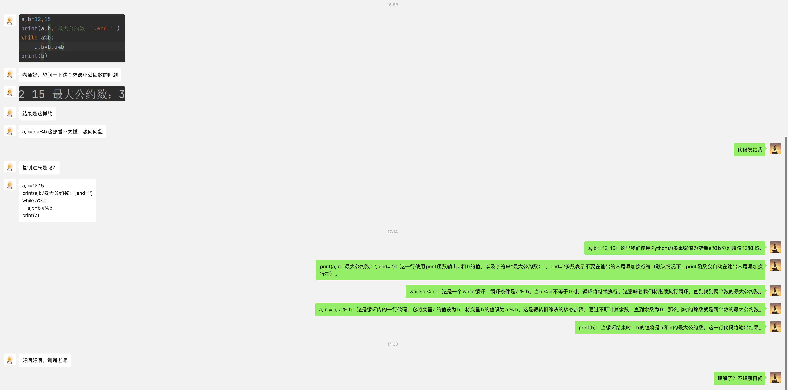
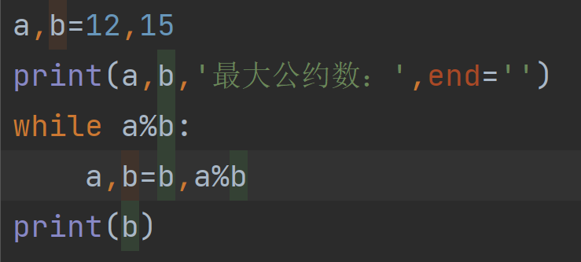
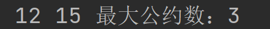

::: details 详细

老师好，想问一下这个求最小公因数的问题

结果是这样的

a,b=b,a%b 这部看不太懂，想问问您

:::

## Ansewr

这是一个使用辗转相除法（也称为欧几里得算法）计算两个数的最大公约数（GCD）的 Python 代码。现在我们逐行解释代码：

1. `a, b = 12, 15`：这里我们使用 Python 的多重赋值为变量 a 和 b 分别赋值 12 和 15。
2. `print(a, b, '最大公约数：', end='')`：这一行使用print函数输出a和b的值，以及字符串"最大公约数："。`end='' ` 参数表示不要在输出的末尾添加换行符（默认情况下，print 函数会自动在输出末尾添加换行符）。
3. `while a % b:`：这是一个while循环，循环条件是 `a % b`。当 `a % b` 不等于 0 时，循环将继续执行。这意味着我们将继续执行循环，直到找到两个数的最大公约数。
4. `a, b = b, a % b`：这是循环内的一行代码，它将变量a的值设为b，将变量b的值设为 `a % b`。这是辗转相除法的核心步骤，通过不断计算余数，直到余数为 0，那么此时的除数就是两个数的最大公约数。
5. `print(b)`：当循环结束时，b 的值将是 a 和 b 的最大公约数。这一行代码将输出结果。

总结：这段代码使用辗转相除法计算两个整数的最大公约数，并将结果输出到控制台。

::: details 公众号：AI悦创【二维码】

:::

::: info AI悦创·编程一对一

AI悦创·推出辅导班啦，包括「Python 语言辅导班、C++ 辅导班、java 辅导班、算法/数据结构辅导班、少儿编程、pygame 游戏开发、Web、Linux」，全部都是一对一教学：一对一辅导 + 一对一答疑 + 布置作业 + 项目实践等。当然，还有线下线上摄影课程、Photoshop、Premiere 一对一教学、QQ、微信在线，随时响应！微信：Jiabcdefh

C++ 信息奥赛题解，长期更新！长期招收一对一中小学信息奥赛集训，莆田、厦门地区有机会线下上门，其他地区线上。微信：Jiabcdefh

方法一：[QQ](http://wpa.qq.com/msgrd?v=3&uin=1432803776&site=qq&menu=yes)

方法二：微信：Jiabcdefh

:::

