## Question 1

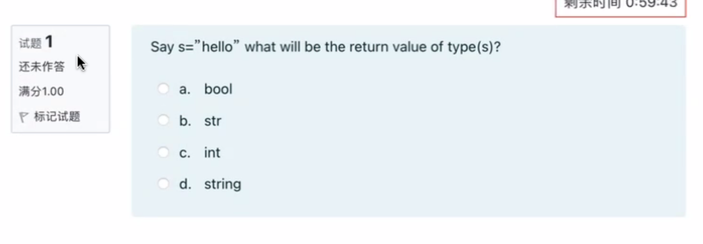

## Question 2

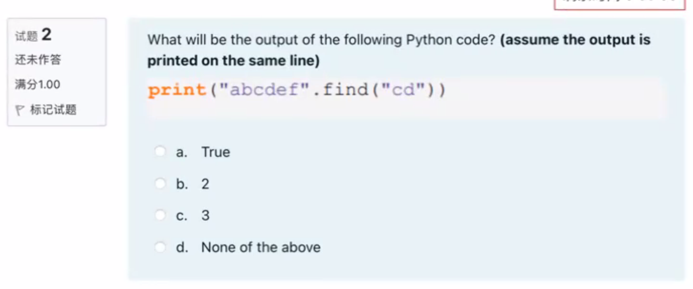

## Question 3

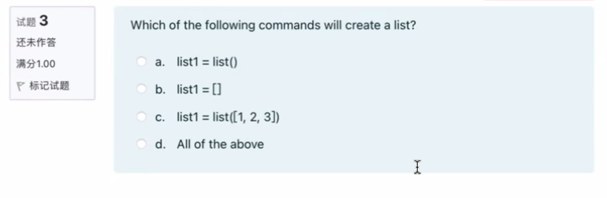

## Question 4

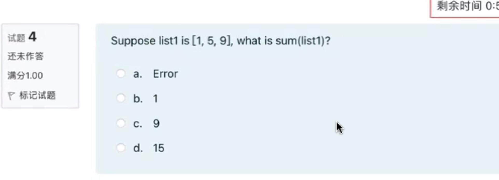

## Question 5

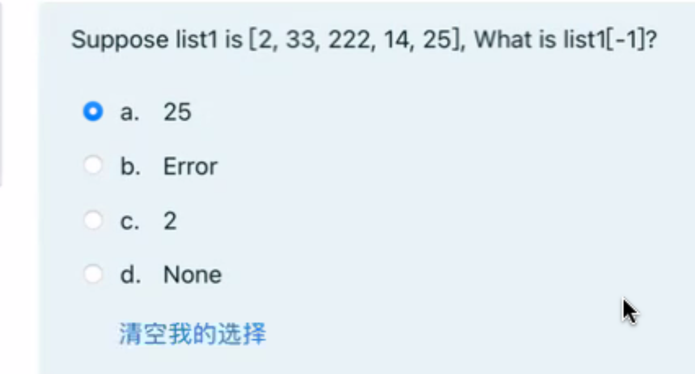

## Question 6

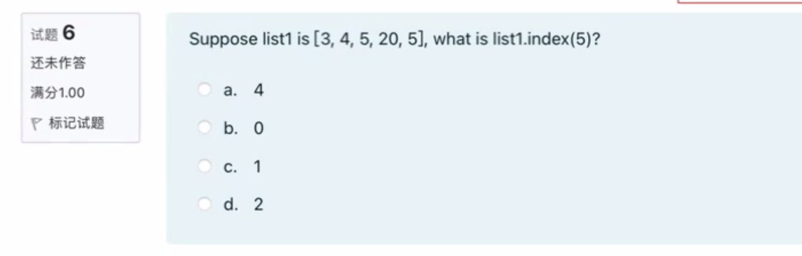

## Question 7

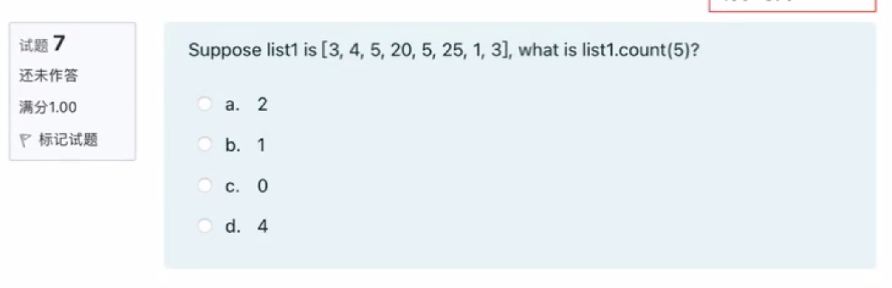

## Question 8

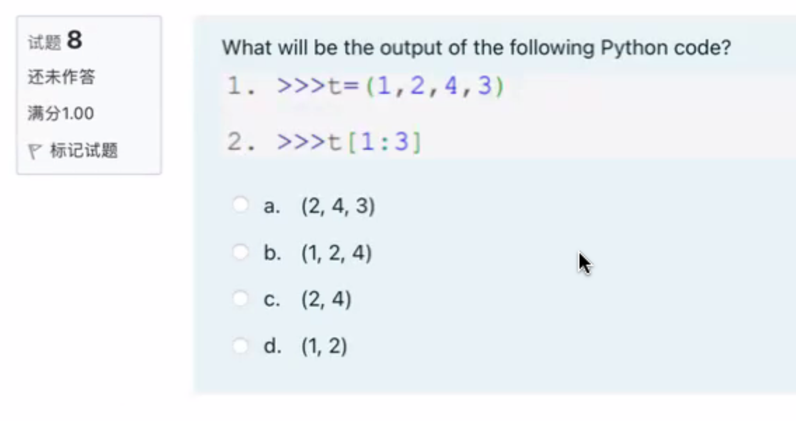

## Question 9

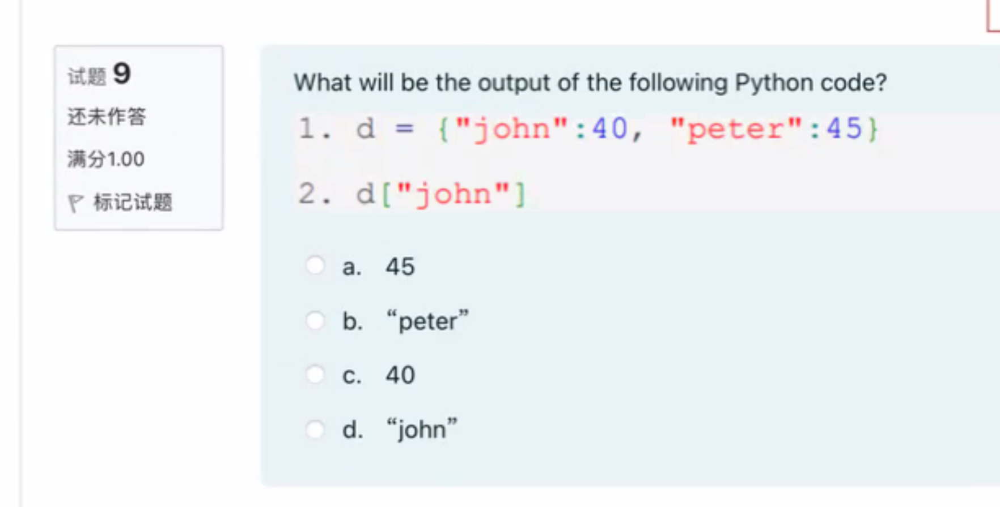


## Question 10

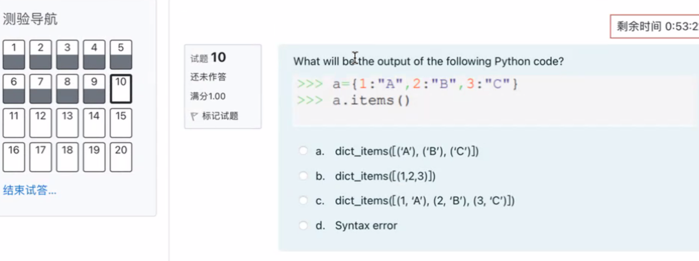

## Question 11

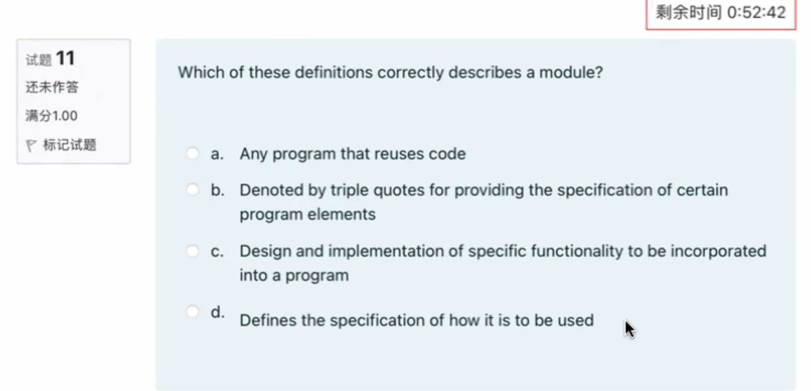

Which of these definitions correctly describes a module? 

a. Any program that reuses code 

b. Denoted by triple quotes for providing the specification of certain program elements 

c. Design and implementation of specific functionality to be incorporated into a program 

d. Defines the specification of how it is to be used

这些定义中哪个正确地描述了模块？

a. 任何重用代码的程序

b. 用三引号表示以提供某些程序元素的规范

c. 设计和实现要纳入程序的特定功能

d. 定义如何使用它的规范

## Question 12

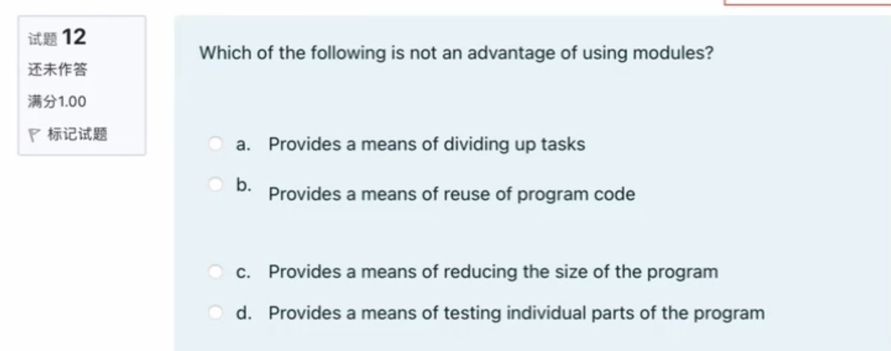

Which of the following is not an advantage of using modules? 

a. Provides a means of dividing up tasks 

b. Provides a means of reuse of program code 

c. Provides a means of reducing the size of the program 

d. Provides a means of testing individual parts of the program

以下哪项不是使用模块的优势？

a. 提供划分任务的方法

b. 提供重用程序代码的方法

c. 提供减小程序大小的方法

d. 提供测试程序各个部分的方法

---

以下哪项不是使用模块的优势？ 

a. 提供划分任务的方法 

b. 提供重用程序代码的方法 

c. 提供减小程序大小的方法 

d. 提供测试程序各个部分的方法

正确答案是 c. 提供减小程序大小的方法。使用模块并不能保证程序大小的减小，但它确实有助于组织和管理代码。

## Question 13

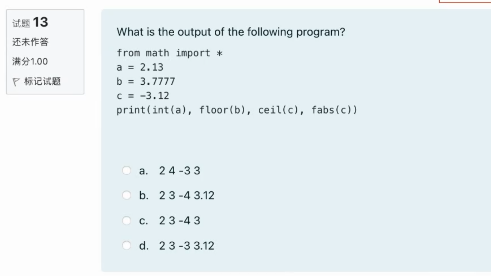

## Question 14

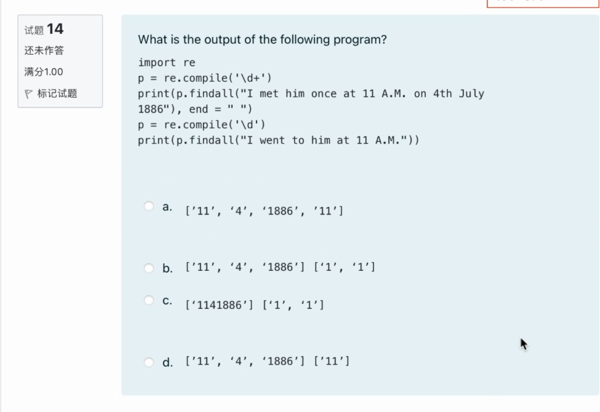


```python
In [17]: import re

In [18]: p = re.compile('\d+')

In [19]: print(p.findall("I met him once at 11 A.M on 4th July 1886"), end=" ")
['11', '4', '1886']
In [20]: p = re.compile("\d")

In [21]: print(p.findall("I went to him at 11 A.M."))
['1', '1']
```

## Question 15

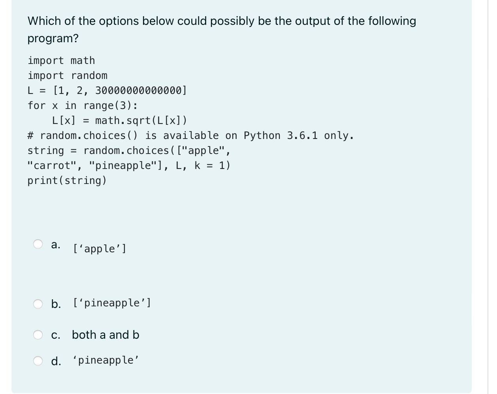

```python
In [22]: import math

In [23]: import random

In [24]: L = [1, 2, 30000000000000]

In [25]: for x in range(3):
    ...:     L[x] = math.sqrt(L[x])
    ...:

In [26]: string = random.choices(["apple", "carrot", "pineapple"], L, k = 1)

In [27]: print(string)
['pineapple']
```


## Question 16

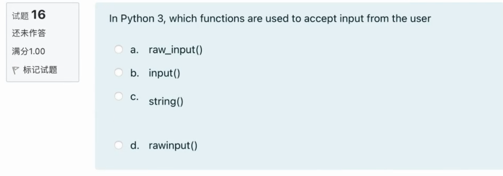


## Question 17

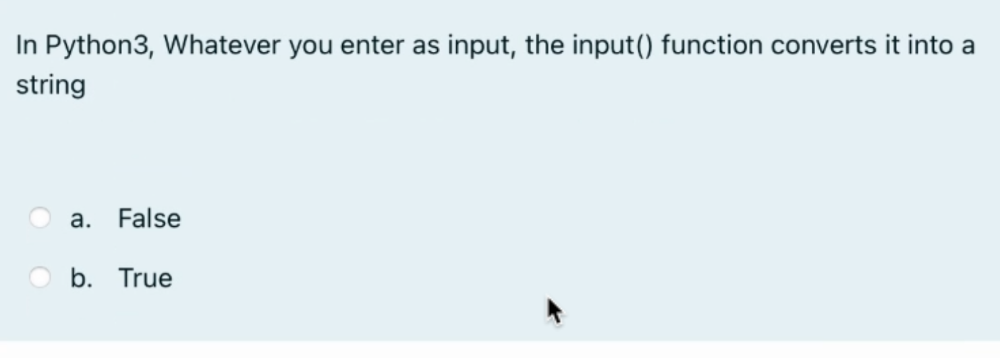

## Question 18

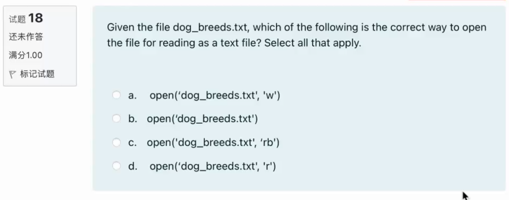


## Question 19

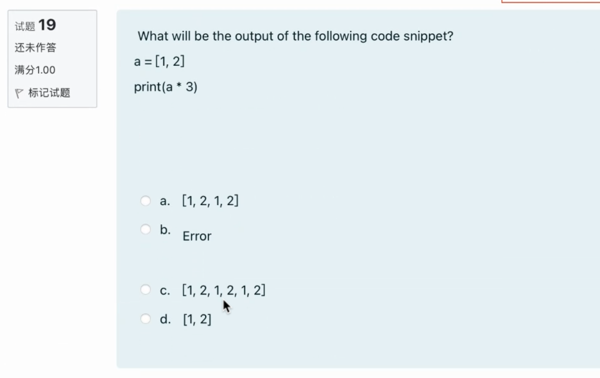


## Question 20

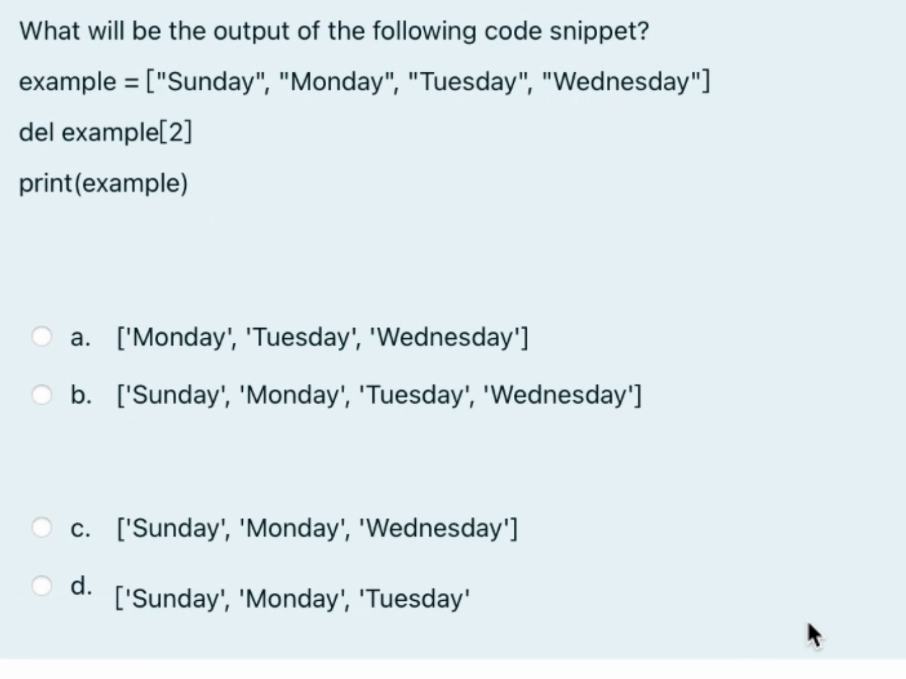


::: details 公众号：AI悦创【二维码】


:::

::: info AI悦创·编程一对一

AI悦创·推出辅导班啦，包括「Python 语言辅导班、C++ 辅导班、java 辅导班、算法/数据结构辅导班、少儿编程、pygame 游戏开发、Web、Linux」，全部都是一对一教学：一对一辅导 + 一对一答疑 + 布置作业 + 项目实践等。当然，还有线下线上摄影课程、Photoshop、Premiere 一对一教学、QQ、微信在线，随时响应！微信：Jiabcdefh

C++ 信息奥赛题解，长期更新！长期招收一对一中小学信息奥赛集训，莆田、厦门地区有机会线下上门，其他地区线上。微信：Jiabcdefh

方法一：[QQ](http://wpa.qq.com/msgrd?v=3&uin=1432803776&site=qq&menu=yes)

方法二：微信：Jiabcdefh

:::


