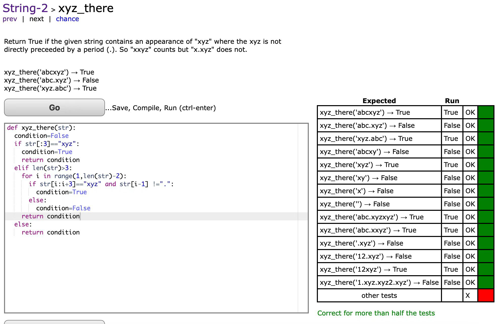

## 1. xyz_there

link: [https://codingbat.com/prob/p149391](https://codingbat.com/prob/p149391)

[String-2](https://codingbat.com/python/String-2) > xyz_there

[prev](https://codingbat.com/prob/p174314) | next  | [chance](https://codingbat.com/python/String-2?chance=1)

Return True if the given string contains an appearance of `"xyz"` where the xyz is not directly preceeded by a period (`.`). So `"xxyz" `counts but `"x.xyz"` does not.

```python
xyz_there('abcxyz') → True
xyz_there('abc.xyz') → False
xyz_there('xyz.abc') → True
```

```python
def xyz_there(str):
    pass
```

:::: tabs

@tab 问题



```python
def xyz_there(str):
    condition = False
    if str[:3] == "xyz":
        condition = True
        return condition
    elif len(str) > 3:
        for i in range(1, len(str) - 2):
            if str[i: i + 3] == "xyz" and str[i - 1] != ".":
                condition = True
            else:
                condition = False
        return condition
    else:
        return condition


r = xyz_there("axyz.zp")
print(r)
```

::: info 问题在于

您的代码逻辑存在一个错误。在循环中，您在每次循环时都更新了 `condition` 的值，这意味着您的代码只会检查字符串的最后一个“xyz”子字符串。如果这最后一个子字符串满足条件，则函数返回 True，否则返回 False。为了解决这个问题，您需要在找到满足条件的子字符串后立即返回 True，而不是在循环结束后返回结果。

:::

@tab 答案

```python
def xyz_there(s):
    if s.startswith('xyz'):
        return True

    for i in range(1, len(s) - 2):
        if s[i:i + 3] == 'xyz' and s[i - 1] != '.':
            return True

    return False

# Test cases
print(xyz_there('abcxyz'))  # Output: True
print(xyz_there('abc.xyz'))  # Output: False
print(xyz_there('xyz.abc'))  # Output: True
```

| Expected                              | Run   |      |      |
| ------------------------------------- | ----- | ---- | ---- |
| `xyz_there('abcxyz')` → True          | True  | OK   |      |
| `xyz_there('abc.xyz')` → False        | False | OK   |      |
| `xyz_there('xyz.abc')` → True         | True  | OK   |      |
| `xyz_there('abcxy')` → False          | False | OK   |      |
| `xyz_there('xyz')` → True             | True  | OK   |      |
| `xyz_there('xy')` → False             | False | OK   |      |
| `xyz_there('x')` → False              | False | OK   |      |
| `xyz_there('')` → False               | False | OK   |      |
| `xyz_there('abc.xyzxyz')` → True      | True  | OK   |      |
| `xyz_there('abc.xxyz')` → True        | True  | OK   |      |
| `xyz_there('.xyz')` → False           | False | OK   |      |
| `xyz_there('12.xyz')` → False         | False | OK   |      |
| `xyz_there('12xyz')` → True           | True  | OK   |      |
| `xyz_there('1.xyz.xyz2.xyz')` → False | False | OK   |      |
| other tests                           |       | OK   |      |

@tab 代码修正

```python
def xyz_there(str):
    condition = False
    if str[:3] == "xyz":
        condition = True
        return condition
    elif len(str) > 3:
        for i in range(1, len(str) - 2):
            if str[i: i + 3] == "xyz" and str[i - 1] != ".":
                condition = True
        return condition
    else:
        return condition
```

::::

## 2. sum67

Link: [https://codingbat.com/prob/p108886](https://codingbat.com/prob/p108886)

[List-2](https://codingbat.com/python/List-2) > sum67
[prev](https://codingbat.com/prob/p167025) | [next](https://codingbat.com/prob/p119308) | [chance](https://codingbat.com/python/List-2?chance=1)

Return the sum of the numbers in the array, except ignore sections of numbers starting with a 6 and extending to the next 7 (every 6 will be followed by at least one 7). Return 0 for no numbers.

```python
sum67([1, 2, 2]) → 5
sum67([1, 2, 2, 6, 99, 99, 7]) → 5
sum67([1, 1, 6, 7, 2]) → 4
```

::: tabs

@tab Answer

```python
# 定义一个名为 sum67 的函数，接受一个名为 numbers 的列表作为参数
def sum67(numbers):
    # 初始化 total 变量，用于存储和
    total = 0
    # 初始化 ignore 变量，用于记录是否忽略当前数字
    ignore = False

    # 遍历 numbers 列表中的每个数字
    for number in numbers:
        # 如果当前数字是 6
        if number == 6:
            # 设置 ignore 变量为 True，开始忽略数字
            ignore = True
        # 否则，如果当前数字是 7 且 ignore 变量为 True
        elif number == 7 and ignore:
            # 设置 ignore 变量为 False，结束忽略数字
            ignore = False
        # 否则，如果不需要忽略当前数字
        elif not ignore:
            # 将当前数字添加到 total 变量中
            total += number

    # 返回 total 变量的值
    return total

# 测试用例
print(sum67([1, 2, 2]))  # 输出: 5
print(sum67([1, 2, 2, 6, 99, 99, 7]))  # 输出: 5
print(sum67([1, 1, 6, 7, 2]))  # 输出: 4
```

@tab Tester

| Expected                                         | Run  |      |      |
| ------------------------------------------------ | ---- | ---- | ---- |
| `sum67([1, 2, 2]) `→ 5                           | 5    | OK   |      |
| `sum67([1, 2, 2, 6, 99, 99, 7])` → 5             | 5    | OK   |      |
| `sum67([1, 1, 6, 7, 2])` → 4                     | 4    | OK   |      |
| `sum67([1, 6, 2, 2, 7, 1, 6, 99, 99, 7])` → 2    | 2    | OK   |      |
| `sum67([1, 6, 2, 6, 2, 7, 1, 6, 99, 99, 7]) `→ 2 | 2    | OK   |      |
| `sum67([2, 7, 6, 2, 6, 7, 2, 7]) `→ 18           | 18   | OK   |      |
| `sum67([2, 7, 6, 2, 6, 2, 7]) `→ 9               | 9    | OK   |      |
| `sum67([1, 6, 7, 7])` → 8                        | 8    | OK   |      |
| `sum67([6, 7, 1, 6, 7, 7])` → 8                  | 8    | OK   |      |
| `sum67([6, 8, 1, 6, 7])` → 0                     | 0    | OK   |      |
| `sum67([]`) → 0                                  | 0    | OK   |      |
| `sum67([6, 7, 11])` → 11                         | 11   | OK   |      |
| `sum67([11, 6, 7, 11])` → 22                     | 22   | OK   |      |
| `sum67([2, 2, 6, 7, 7])` → 11                    | 11   | OK   |      |
| `other tests`                                    |      | OK   |      |

@tab while

```python
# 定义一个名为 sum67 的函数，接受一个名为 nums 的列表作为参数
def sum67(nums):
    # 初始化 sum（和），i（索引），n（列表长度）
    sum, i, n = 0, 0, len(nums)

    # 使用 while 循环遍历列表
    while i < n:
        # 如果当前数字是 6
        if nums[i] == 6:
            # 将索引 i 加 1
            i += 1

            # 进入一个内部 while 循环，直到找到下一个数字 7
            while nums[i] != 7:
                i += 1

            # 当找到数字 7 时，将索引 i 加 1 以跳过 7 并继续循环
            i += 1
        else:
            # 如果当前数字不是 6，将其累加到 sum 中
            sum += nums[i]

            # 将索引 i 加 1 以继续循环
            i += 1

    # 当遍历完整个列表后，返回累加和 sum
    return sum
```

:::


::: details 公众号：AI悦创【二维码】


:::

::: info AI悦创·编程一对一

AI悦创·推出辅导班啦，包括「Python 语言辅导班、C++ 辅导班、java 辅导班、算法/数据结构辅导班、少儿编程、pygame 游戏开发、Web、Linux」，全部都是一对一教学：一对一辅导 + 一对一答疑 + 布置作业 + 项目实践等。当然，还有线下线上摄影课程、Photoshop、Premiere 一对一教学、QQ、微信在线，随时响应！微信：Jiabcdefh

C++ 信息奥赛题解，长期更新！长期招收一对一中小学信息奥赛集训，莆田、厦门地区有机会线下上门，其他地区线上。微信：Jiabcdefh

方法一：[QQ](http://wpa.qq.com/msgrd?v=3&uin=1432803776&site=qq&menu=yes)

方法二：微信：Jiabcdefh

:::


