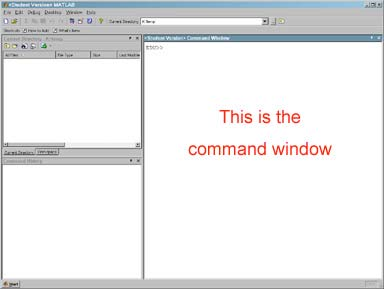
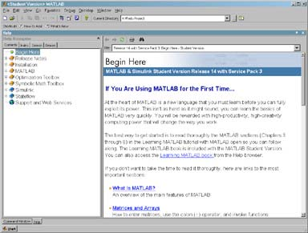
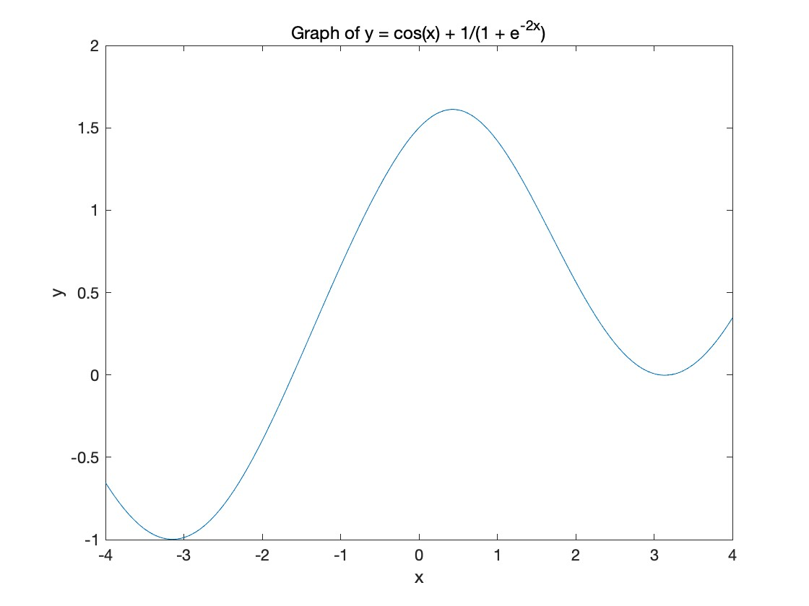
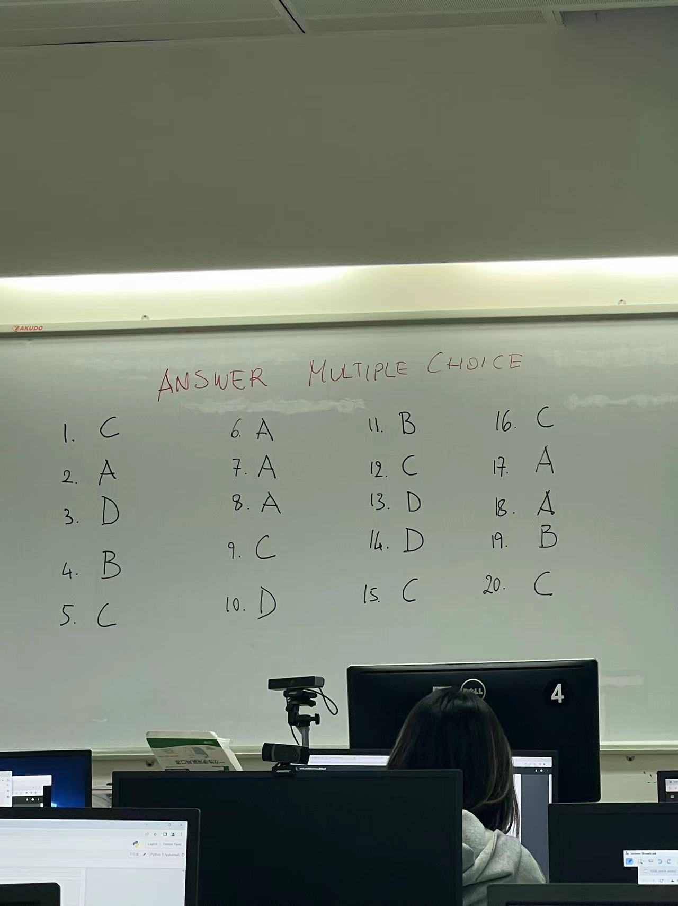

## 1. Introduction to MATLAB

MATLAB is a powerful computer algebra system that can perform many mathematical calculations. It can also be used as a programming language. This lab is intended to introduce both of these capabilities. The MATLAB program is available to UCCS students in the computer lab in EAS 136.

> MATLAB 是一款强大的计算机代数系统，能够执行许多数学计算。它也可以用作编程语言。本实验室旨在介绍这两种能力。MATLAB程序可在 EAS 136 计算机实验室提供给 UCCS 学生使用。

### 1.1 Logging into the system

> 1.1 登录系统

On the log-in screen, you will see a prompt for your username and password. Type in your username first. This will be the first letter of your first name followed by the first seven letters (or less) of your last name. For example, if your name is John Williams, then your username will be JWilliam.

> 在登录界面上，您将看到输入用户名和密码的提示。首先输入您的用户名。用户名应该是您的名字的第一个字母，后面跟着您姓的前七个字母（或更少）。例如，如果您的名字是John Williams，那么您的用户名将是JWilliam。

If you have not previously logged in, you will need the initial password. The initial password is MmmssssL where:

> 如果您之前没有登录过，您将需要初始密码。初始密码为MmmssssL，其中：
>
> - M代表您的名字的第一个大写字母（如果您的名字只有一个字母，则使用该字母的小写形式）。
> - m代表您的姓氏的前三个小写字母（如果您的姓氏少于三个字母，则使用所有字母的小写形式）。
> - s代表您的出生日期的月份和日期，不包括任何前导零（例如，如果您的出生日期是5月3日，则使用Mmm03的形式）。
> - L代表您的出生日期的年份的最后一位数字。

- `Mmm = first 3 letters of your birthmonth`

    > "Mmm = first 3 letters of your birthmonth" 的翻译为：Mmm = 你出生月份的前三个字母。

- `ssss = last 4 digits of your student ID number`

    > ssss = 您的学生ID号码的最后4位数字

- `L = first letter of last name`

    > L = 姓氏的第一个字母

- (The first and last letters are capitalized.)

    > （第一个和最后一个字母都要大写。）

After you log in you will be asked to change this password, make sure you remember it!

> 在您登录后，系统会要求您更改此密码，请确保您记住它！

Note: If for some reason either your username or your password does not work, first check that the DOMAIN is set to UFP. If it still doesn’t work, ask someone for help.

> 注意：如果由于某种原因，您的用户名或密码无法使用，请首先检查域设置是否为UFP。如果仍然无法使用，请寻求他人的帮助。

### 1.2 Starting out with MATLAB

Double click the MATLAB icon on your screen. This will start the MATLAB program, and the MATLAB desktop appears.

> 在您的屏幕上双击MATLAB图标。这将启动MATLAB程序，MATLAB桌面将出现。



The MATLAB desktop is divided into three smaller windows. On the upper left you will see the ”Current Directory” subwindow. We will not be using this, so remove it by clicking the small ”x” in the upper right corner of the subwindow. Now the ”Workspace” subwindow appears; remove this also. Then remove the ”Command History” subwindow. Now the only subwindow that is left is the ”Command” subwindow. You should see a prompt in the Command window that looks like this: ”*>>*”.

> MATLAB桌面分为三个较小的窗口。在左上角，您将看到"当前目录"子窗口。由于我们不会使用它，请通过单击子窗口右上角的小"x"来移除它。现在出现了"工作空间"子窗口；也将其移除。然后移除"命令历史"子窗口。现在，唯一剩下的子窗口是"命令"子窗口。您应该在命令窗口中看到一个类似于这样的提示："*>>*"。

## 2. MATLAB as scientifific calculator

### 2.1 Introduction to calculations

The prompt is where you enter commands in MATLAB. Now we will look at a few of the functions MATLAB can perform. First, notice that MATLAB can function as an expensive calculator. Try typing the following:

> 提示是您在MATLAB中输入命令的位置。现在我们将看一下MATLAB可以执行的一些函数。首先，请注意MATLAB可以作为一个昂贵的计算器。尝试输入以下内容：

```matlab
>> 2+2
ans = 4
```

If you did this correctly, you should get the answer displayed underneath.

> 如果你做得正确，你应该看到答案显示在下方。

Note: You may end commands in MATLAB with a semicolon. If you end a line with a semicolon, the command will be executed, but the solution will not be displayed. If you don’t end a line with a semicolon (as above), the solution will be displayed below the line.

> 注意：你可以在MATLAB中使用分号来结束命令。如果你在一行末尾加上分号，命令将会被执行，但是解决方案不会被显示。如果你不在一行末尾加上分号（如上所示），解决方案将在该行下方显示。

We can continue with multiplication. The asterisk symbol ”*” is used to indicate multiplication. You cannot leave it out. Try typing the following line:

> 我们可以继续进行乘法运算。星号符号 "*" 用于表示乘法。你不能忽略它。请尝试输入以下行：

```matlab
>> 2*2
ans = 4
```

If you instead typed ”(2)(2)” you would get an error message (try it!).

> 如果您输入“(2)(2)”，您将收到一个错误消息（试试看！）。

Subtraction should be written as follows:

> 减法应该写成如下形式：

```matlab
>> 5-3
ans = 2
```

Division is indicated by the ”/” character:

> 分割由字符"/"表示：

```matlab
>> 5/3
ans = 1.6667
```

You can can use several operators in one line and group expressions using parenthesis. For example:

> 你可以在一行中使用多个运算符，并使用括号来分组表达式。例如：

```matlab
>> (1+7-3)*2
ans = 10
```

Now try a few of your own calculations!

> 现在试试做几个你自己的计算吧！

### 2.2 Assigning variables in MATLAB

It is often convenient to name a long expression for later use. That way, you don’t have to repeatedly type in the long expression. Assignment in MATLAB is done with the operator ”=”. For example, the following line assigns the letter ”a” to the approximate value of pi:

> 将一个长表达式命名以供后续使用通常很方便。这样，您就不必反复输入那个长表达式。在MATLAB中，使用运算符"="来进行赋值操作。例如，下面这行代码将字母"a"赋值为pi的近似值：

```matlab
>> a = 3.14
ans = 3.1400
```

Now every time the letter ”a” is used in an expression, it will actually refer to the value for pi. Try typing the following:

> 现在，每次在表达式中使用字母 "a"，它实际上将指代圆周率的值。尝试输入以下内容：

```matlab
>> a
a = 3.1400
>> 2*a
ans = 6.2800
```

### 2.3  Help in MATLAB

In the example above, the value for pi was assigned to a variable to save it. Does the value for pi have to be entered everytime it is used? Maybe MATLAB has a better choice.

> 在上面的例子中，pi 的值被赋值给一个变量来保存它。是否每次使用 pi 时都要输入它的值?也许MATLAB有更好的选择。

To fifind help in MATLAB, click the HELP icon:

> 要在MATLAB中寻找帮助，请点击帮助图标：

The Help window now appears on the MATLAB desktop.

> 帮助窗口现在出现在MATLAB桌面上。



You can browse the table of contents by clicking on the ”Contents” tab in the ”Help Navigator” window. This is very similar to the help used in other programs. Simply use the mouse to click on the topic of your choice.

> 您可以通过在“帮助导航器”窗口中点击“目录”选项卡来浏览目录。这与其他程序中使用的帮助非常相似。只需使用鼠标点击您选择的主题即可。

You can also select the ”Index” tab and then search the index for a given word or phrase by typing it in the ”search index for” text box. Try searching the index for ”pi”. You will fifind three entries for ”pi” in the index, labeled [1], [2], and [3]. Click on ”[3]” and you will see a list of special values you can use in expressions, one of which is ”pi”. So you have learned that there is no need to type the value of pi everytime it is used. Instead, substitute the constant, ”pi”. For example:

> 您还可以选择“索引”选项卡，然后在“搜索索引”文本框中键入给定的单词或短语来搜索索引。尝试在索引中搜索“pi”。您将在索引中找到三个标记为[1]、[2]和[3]的“pi”条目。点击“[3]”，您将看到一个可以在表达式中使用的特殊值列表，其中之一是“pi”。因此，您已经了解到每次使用pi时无需输入其值，而是可以使用常量“pi”来代替。例如：

```matlab
>> pi/2
ans = 1.5708
```

### 2.4  Exponents in MATLAB

If you wish to fifind, for example, 13 to the fififth power, then you can easily do so in MATLAB. The caret ”^” (or ”hat”) is used in exponentiation. Try typing:

> 如果你想计算13的五次方，你可以在MATLAB中轻松实现。乘方运算使用符号“^”（或者“hat”）。尝试输入以下内容：

```matlab
>> 13^5
ans = 371293
```

Remember that you can also use the exponent operator to compute the roots of numbers. If you want to fifind the cube root of 876, simply type:

> 请记住，您还可以使用指数运算符来计算数字的根。如果您想找到876的立方根，只需输入：

```matlab
>> 876^(1/3)
ans = 9.5683
```

### 2.5 Built-in MATLAB functions

MATLAB has the same built in functions that you see in scientifific calculators. A few examples are, sin(x), cos(x), tan(x), log(x), sqrt(x), and exp(x). Try typing the following:

> MATLAB拥有与科学计算器中相同的内置函数。一些示例包括sin(x)，cos(x)，tan(x)，log(x)，sqrt(x)和exp(x)。请尝试输入以下内容：

```matlab
>> log(10)
ans = 2.3026
```

This answer tells you that log(x) does not mean the base 10 logarithm, but the natural logarithm. If you need the base 10 logarithm, use the log10(x) function.

> 这个答案告诉你，log(x)并不表示以10为底的对数，而是自然对数。如果你需要以10为底的对数，可以使用log10(x)函数。

The trigonometric functions should be entered in the same way, for example, sin(pi/2) should be as below:

> 三角函数应以相同的方式输入，例如，sin(pi/2) 应输入如下：

```matlab
>> sin(pi/2)
ans = 1
```

Now try typing sinpi/2, omitting the parentheses. What is the result?

> 现在尝试键入sinpi/2，省略括号。结果是什么？

MATLAB also recognizes the inverse trigonometric functions. For instance, the inverse tangent is ”atan”. Recalling that the inverse tangent of 1 is pi/4, we can enter it as below to see that the arctan function works as expected:

> MATLAB也能识别反三角函数。例如，反正切函数是"atan"。回想一下，1的反正切是π/4，我们可以按以下方式输入，以验证反正切函数的预期效果：

```matlab
>> 4*atan(1)
ans = 3.1416
```

Notice that by default MATLAB displays numeric results to 4 decimal places. For example:

> 请注意，默认情况下，MATLAB会将数值结果显示到小数点后4位。例如：

```matlab
>> 4/3
ans = 1.3333
```

You can get 14 decimal places by typing ”format long”:

> 你可以通过输入“format long”来获得14位小数。

```matlab
>> format long
>> 4/3
ans = 1.33333333333333
```

To change back to 4 decimal places, type ”format short”:

> 要将小数位数更改为四位小数，请输入"format short"。

```matlab
>> format short
>> 4/3
ans = 1.3333
```

Now, let’s look at e. Try computing e to the tenth power by typing ”e^10”

> 现在，让我们来看看e。通过输入"e^10"来计算e的十次方。

Well, that doesn’t work. In MATLAB, e^x is not a valid command. MATLAB is treating the letter ”e” as an undefifined variable, just like it would ”x”. To fifind e^x, use the function, exp(x):

> 好的，那个方法行不通。在MATLAB中，e^x不是一个有效的命令。MATLAB将字母"e"视为未定义变量，就像它对待"x"一样。要计算e^x，请使用函数exp(x)：

```matlab
>> exp(10)
ans = 2.2026e+004
```

### 2.6 Exercises

1. Compare and explain the following expressions:

> 比较并解释以下表达方式：

(a) 2+4/2

(b) (2+4)/2

(c) 2+(4/2)

(d) 2(3+5)

---

Graph the function:

$y(x) = cos(x) + \frac{1}{1 + e^{-2x}}$

How many zeros of this function exist between x = -4 and x = 4?

```matlab
% 定义 x 的范围
x = linspace(-4, 4, 1000);

% 定义函数
y = cos(x) + 1 ./ (1 + exp(-2 * x));

% 绘制函数图像
figure
plot(x, y)
title('Graph of y = cos(x) + 1/(1 + e^{-2x})')
xlabel('x')
ylabel('y')

% 寻找零点
tol = 1e-5; % 设定容差
zero_indices = find(abs(y) < tol); % 寻找y值接近零的索引
zero_x_values = x(zero_indices); % 获取对应的x值

% 显示零点的数量
disp(['Number of zeros between x = -4 and x = 4: ', num2str(length(zero_x_values))])
```



```matlab
% 定义 x 的范围
x = linspace(-4, 4, 1000);

% 定义函数
y = cos(x) + 1 ./ (1 + exp(-2 * x));

% 绘制函数图像
figure
plot(x, y)
hold on % 保持当前图像
title('Graph of y = cos(x) + 1/(1 + e^{-2x})')
xlabel('x')
ylabel('y')

% 寻找零点
f = @(x) cos(x) + 1 ./ (1 + exp(-2 * x));
options = optimset('Display','off'); % 不显示迭代信息
zeros_x = []; % 保存零点的x值

for i = 1 : length(x) - 1
    % 检查相邻两点的函数值是否异号
    if f(x(i)) * f(x(i+1)) < 0
        % 使用 fzero 寻找零点
        zero_x = fzero(f, [x(i), x(i+1)], options);
        zeros_x = [zeros_x, zero_x]; % 添加到零点数组中
        % 在图上标记零点
        plot(zero_x, 0, 'ro')
    end
end

hold off % 释放当前图像

% 显示零点的数量
disp(['Number of zeros between x = -4 and x = 4: ', num2str(length(zeros_x))])
```

---

Make a graph of the function:

$y(x) = \frac{2 + 2x}{5sin(x) - 6}$

From x = -16 to x = 10. On the same plot, draw the tangent line to y(x) at x=-6.

::: code-tabs

@tab 1

```matlab
syms x;
y = (2 + 2*x) / (5 * sin(x) - 6);
dy = diff(y, x);
slope = double(subs(dy, x, -6));

y_at_minus6 = double(subs(y, x, -6))

syms x_tangent y_tangent;
eqn = y_tangent == slope * (x_tangent + 6) + y_at_minus6
fplot(y, [-16, 10])
hold on
```

@tab 2

```matlab
syms x;
y = (2 + 2*x)/(5*sin(x) - 6);
dy = diff(y, x);  % 求导数
slope = double(subs(dy, x, -6));  % 在x=-6处求斜率

% 求得在x=-6处的y的值
y_at_minus6 = double(subs(y, x, -6));

% 利用斜率和点(-6, y_at_minus6)求得切线方程
syms x_tangent;
y_tangent = slope * (x_tangent + 6) + y_at_minus6;

% 绘图
fplot(y, [-16, 10])  % 绘制y(x)函数图像
hold on  % 保持当前图像，以便在同一图像上绘制更多内容
fplot(y_tangent, [-16, 10])  % 在同一图像上绘制切线
hold off  % 不再保持当前图像

legend('y(x)', 'tangent at x=-6')  % 添加图例
```

:::

---

On the same plot, graph $y = sin(x)$  and the first there Taylor approximations to sin(x) at $x_0 = 0.$

For the question 3, you cannot use the function taylor from MATLAB.

$y(x) = x - \frac{x^3}{3!} + \frac{x^5}{5!}$

```matlab
% 设定x的取值范围
x = linspace(-10,10,1000);

% 计算y的值
y = x - x.^3/factorial(3) + x.^5/factorial(5);

% 画图
figure
plot(x,y)
title('Plot of the function y = x - x^3/3! + x^5/5!')
xlabel('x')
ylabel('y')
grid on
```

```matlab
% 设定x的取值范围
x = linspace(-10,10,1000);

% 计算y的值
y1 = x - x.^3/factorial(3) + x.^5/factorial(5);
y2 = sin(x);

% 画图
figure
hold on
plot(x,y1)
plot(x,y2)
title('Plot of the functions y = x - x^3/3! + x^5/5! and y = sin(x)')
xlabel('x')
ylabel('y')
legend('y = x - x^3/3! + x^5/5!', 'y = sin(x)')
grid on
hold off

```


---

Advanced problems (25 points, 1 question, 25 points per each)

1. Make a graph of the sphere $𝑥^2 + 𝑦^2 + 𝑧^2 = 1$

Move the sphere along its normal direction to increase the sphere volume. Repeat it three times with different moving distances.Make sure that the sphere is represented by some 3D points, so you only need to move these 3D points along their normal direction.

For each question, your lab reports should contain three parts:

1. Introduction to the basic concepts of the question from the knowledge of our course.
2. Displaying and explaining your code.
3. Showing the graph results.

高级问题（25分，1个问题，每个问题25分）

1. 绘制球体的图形 $𝑥^2 + 𝑦^2 + 𝑧^2 = 1$

沿着球体的法线方向移动球体以增加其体积。重复这个过程三次，使用不同的移动距离。确保球体由一些三维点表示，因此您只需要沿着它们的法线方向移动这些三维点。

对于每个问题，您的实验报告应包含三个部分：

1. 从我们课程的知识中介绍问题的基本概念。
2. 显示和解释您的代码。
3. 展示图形结果。

```matlab
% Part 1: 生成球体的3D点
[phi,theta] = meshgrid(linspace(0,2*pi,50),linspace(0,pi,50));
x = sin(theta).*cos(phi);
y = sin(theta).*sin(phi);
z = cos(theta);

% Part 2: 计算每个点的法线方向并移动这些点
moving_distances = [0.1, 0.2, 0.3]; % 设置移动距离

figure;
for i = 1:3
    % 沿法线方向移动点
    x_moved = x + moving_distances(i).*x;
    y_moved = y + moving_distances(i).*y;
    z_moved = z + moving_distances(i).*z;
    
    % 绘制移动后的球体
    subplot(1, 3, i);
    surf(x_moved, y_moved, z_moved);
    title(['Moving Distance: ', num2str(moving_distances(i))]);
    axis equal;
end
```

```matlab
% Part 1: 生成球体的3D点
[phi,theta] = meshgrid(linspace(0,2*pi,50),linspace(0,pi,50));

% Part 2: 计算每个点的法线方向并移动这些点
moving_distances = [0, 0.1, 0.2, 0.3]; % 设置半径

figure;
for i = 1:4
    % 沿法线方向移动点，即增大半径
    r = 1 + moving_distances(i);
    x = r * sin(theta).*cos(phi);
    y = r * sin(theta).*sin(phi);
    z = r * cos(theta);
    
    % 绘制移动后的球体
    subplot(2, 2, i);
    surf(x, y, z);
    title(['Radius: ', num2str(r)]);
    axis equal;
end
```




---

```matlab
syms x;
y = x - x.^3/factorial(3) + x.^5/factorial(5);
dy = diff(y, x);  
slope = double(subs(dy, x, -6));  % 在x=-6处求斜率


y_at_minus6 = double(subs(y, x, -6));


syms x_tangent;
y_tangent = sin(x);

% 绘图
fplot(y, [-5, 5])  
hold on  
fplot(y_tangent, [-5, 5])  
hold off

legend('y(x)', 'tangent at x=-6')
```


::: details 公众号：AI悦创【二维码】


:::

::: info AI悦创·编程一对一

AI悦创·推出辅导班啦，包括「Python 语言辅导班、C++ 辅导班、java 辅导班、算法/数据结构辅导班、少儿编程、pygame 游戏开发、Web、Linux」，全部都是一对一教学：一对一辅导 + 一对一答疑 + 布置作业 + 项目实践等。当然，还有线下线上摄影课程、Photoshop、Premiere 一对一教学、QQ、微信在线，随时响应！微信：Jiabcdefh

C++ 信息奥赛题解，长期更新！长期招收一对一中小学信息奥赛集训，莆田、厦门地区有机会线下上门，其他地区线上。微信：Jiabcdefh

方法一：[QQ](http://wpa.qq.com/msgrd?v=3&uin=1432803776&site=qq&menu=yes)

方法二：微信：Jiabcdefh

:::


