## Chapter 2 - Quiz

This is the in-class quiz for Chapter 2. Your solution can account for maximum 2.5% of your final grade.

> 这是第2章的课堂测验。你的答案最多可以占你最终成绩的2.5%。

**Note**

* Write your code after you see `# YOUR CODE HERE` 

    > 在看到 `# YOUR CODE HERE` 后编写你的代码。

* Read the instruction of each question. You have a **limited time to submit: Tue March 7, h. 17:00**. Only your last submission counts.

    > 请阅读每个问题的说明。你有**有限时间提交：3月7日星期二，下午17:00**。只有你的最后一次提交有效。

* Copying the solution of other students is forbidden.

    > 禁止抄袭其他学生的解答。

* This quiz will be **auto-graded**. The auto-grading will check that your answers to the question is correct (or close to be correct). **If your submission fails the auto-grade, you will get 0.** 

    > 本次测验将采用**自动评分**方式。自动评分将检查您对问题的回答是否正确（或接近正确）。**如果您的提交未通过自动评分，您将得零分。**

### Exercise 1

**Exercise 1**. Create a two-variable addition calculator `cal_sum(a, b)` that **returns** the sum of the two variables.

> Exercise 1: 创建一个双变量加法计算器 `cal_sum(a, b)`，它会**返回**这两个变量的和。

```python
def cal_sum(a, b):
    # YOUR CODE HERE
```

::: code-tabs

@tab 题目

```python
# In order to make sure your program works, testcases are written and executed.
# Here is an example testcase that you might write for testing.

# In python assert keyword helps in debugging. 
# This statement simply takes input a boolean condition, which doesn’t return anything when it's true,
# but if it is computed to be false, then it raises an AssertionError along with the optional message provided. 

assert cal_sum(1, 2) == 3
```

@tab ZH

```python
# 为了确保您的程序正常工作，编写并执行测试用例是必要的。
# 下面是一个您可能为测试编写的示例测试用例。

# 在 Python 中，assert 关键字有助于调试。这个语句只接受一个布尔条件作为输入，当条件为真时不返回任何内容，但如果计算结果为假，则引发一个 AssertionError，同时附带可选的消息。

assert cal_sum(1, 2) == 3
```

@tab Answer

```python
def cal_sum(a, b):
    return a + b
```

:::

### Exercise 2

::: tabs

@tab EN

**Exercise 2**. In a function ``FullName(name, capital=True)``,

- a. Create a string variable `str1` that stores the string `"Full Name: "`

- b. `if capital == True`, use `upper()` function to convert `name` into Uppercase letters and assign this to a variable `NewName`

- c. `if capital == False`, use `title()` function to convert the first character of each word in `name` to Uppercase letter and the other characters in lower case and assign this to a variable `NewName`

- **return** the string "Full Name: " + NewName 

**Example**

```python
FullName("guido vAn rossum", capital = True)
Expected output: 'Full Name: GUIDO VAN ROSSUM'


FullName("guido vAn rossum", capital = False), 
Expected output: 'Full Name: Guido Van Rossum'
```

```python
def FullName(name, capital=True):
    str1 = "Full Name: "
    # YOUR CODE HERE
```

@tab ZH

Exercise 2. 在一个函数中 `FullName(name, capital=True)`，

- a. 创建一个字符串变量 `str1`，存储字符串 `"Full Name: "`

- b. 如果 `capital == True`，使用 `upper()` 函数将 `name` 转换为大写字母，并将其赋值给变量 `NewName`

- c. 如果 `capital == False`，使用 `title()` 函数将 `name` 中每个单词的首字母转换为大写字母，其他字符转换为小写字母，并将其赋值给变量 `NewName`

- **返回**字符串 "Full Name: " + NewName 

**示例**

```python
FullName("guido vAn rossum", capital=True)
预期输出：'Full Name: GUIDO VAN ROSSUM'


FullName("guido vAn rossum", capital=False)
预期输出：'Full Name: Guido Van Rossum'
```

@tab Answer

首先，我们需要定义函数 ``FullName(name, capital=True)``。在这个函数中，我们需要完成以下步骤：

- a. 创建一个字符串变量 `str1`，存储字符串 `"Full Name: "`
- b. 如果 `capital == True`，使用 `upper()` 函数将 `name` 转换为大写字母，并将其赋值给变量 `NewName`
- c. 如果 `capital == False`，使用 `title()` 函数将 `name` 中每个单词的首字母转换为大写字母，其余字母转换为小写，并将其赋值给变量 `NewName`
- 返回字符串 "Full Name: " + NewName

下面是完成这个任务的 Python 代码：

```python
def FullName(name, capital=True):
    # a. 创建一个字符串变量 str1，存储字符串 "Full Name: "
    str1 = "Full Name: "
    
    # b. 如果 capital == True，使用 upper() 函数将 name 转换为大写字母，并将其赋值给变量 NewName
    if capital == True:
        NewName = name.upper()
    
    # c. 如果 capital == False，使用 title() 函数将 name 中每个单词的首字母转换为大写字母，其余字母转换为小写，并将其赋值给变量 NewName
    elif capital == False:
        NewName = name.title()
    
    # 返回字符串 "Full Name: " + NewName
    return str1 + NewName

# 示例
print(FullName("guido vAn rossum", capital=True))  # 输出：'Full Name: GUIDO VAN ROSSUM'
print(FullName("guido vAn rossum", capital=False))  # 输出：'Full Name: Guido Van Rossum'
```

运行以上代码，你可以得到与示例中相同的预期输出。

@tab LYR

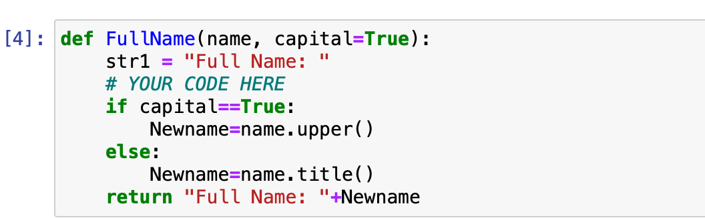

:::


### Exercise 3

::: tabs

@tab EN

**Exercise 3**. In a function ``first_word(arg1)``, use ``split()`` function to separate the argument `arg1` by `","` and **return** the first word.    

**Example**

```python
first_word('Hello, world!')

Expected output:

'Hello'
```

```python
def first_word(arg1):
    # YOUR CODE HERE
```

@tab ZH

**Exercise 3**. 在函数 ``first_word(arg1)`` 中，使用 ``split()`` 函数以 `","` 作为分隔符，将参数 `arg1` 分割，并 **返回** 第一个单词。

**示例**

```py
first_word('Hello, world!')

预期输出：

'Hello'
```

@tab Answer

**练习3**. 在一个名为 ``first_word(arg1)`` 的函数中，使用 ``split()`` 函数根据 `","` 分割参数 `arg1`，并**返回**第一个单词。

**示例**

```py
def first_word(arg1):
    # 使用split()函数根据","分割arg1
    words = arg1.split(',')
    # 返回第一个单词
    return words[0]

# 测试代码
print(first_word('Hello, world!'))
# 预期输出:
# 'Hello'
```

@tab LYR

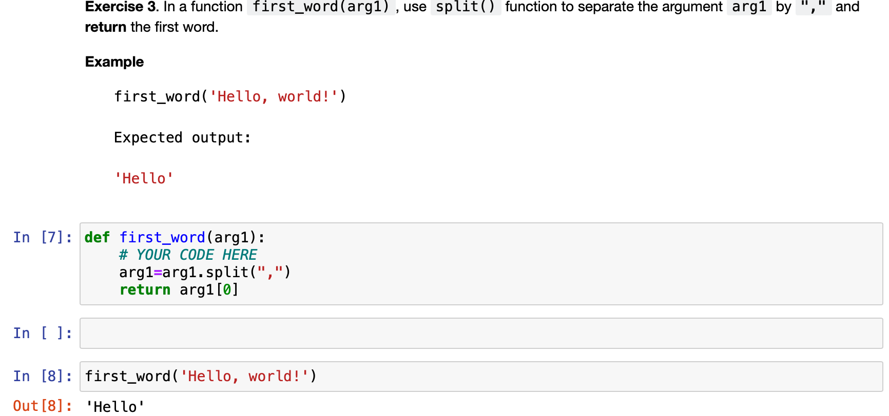

:::

### Exercise 4

::: tabs

@tab EN

**Exercise 4**. In a function ``clean_string(arg1)``, 

* use ``strip()`` function to remove trailing and ending white spaces from `"arg1"`, and 
* capitalize the first character. 
* **return** the output.

**Example**

```python
clean_string("   having fun in Python   ")

Expected output:

"Having fun in Python"
```

```python
def clean_string(arg1):
    # YOUR CODE HERE
```


@tab ZH

**Exercise 4**. 在一个名为`clean_string(arg1)`的函数中，

* 使用`strip()`函数从`"arg1"`中去除前后空格，并
* 将首字母大写。
* **返回**输出结果。

**示例**

```python
clean_string("   having fun in Python   ")

预期输出：

"Having fun in Python"
```

@tab Answer

**题目解析**

这是一个编程练习题，要求你编写一个名为`clean_string`的函数，该函数接收一个参数`arg1`。具体要求如下：

1. 使用`strip()`函数去除`arg1`开头和结尾的空白字符。
2. 将`arg1`首个字符大写。
3. 返回处理后的字符串。

**示例**

```py
clean_string("   having fun in Python   ")

预期输出:

"Having fun in Python"
```

**解答**

```python
def clean_string(arg1):
    # 使用strip()函数去除字符串开头和结尾的空白字符
    cleaned_string = arg1.strip()

    # 将首个字符大写
    capitalized_string = cleaned_string.capitalize()

    # 返回处理后的字符串
    return capitalized_string

# 测试示例
print(clean_string("   having fun in Python   "))  # 预期输出: "Having fun in Python"
```

上面的代码定义了一个名为`clean_string`的函数，该函数接受一个参数`arg1`，并根据题目要求进行处理。首先，我们使用`strip()`函数去除字符串`arg1`开头和结尾的空白字符，然后使用`capitalize()`函数将字符串首个字符大写。最后返回处理后的字符串。测试示例的输出与预期一致。

@tab LYR

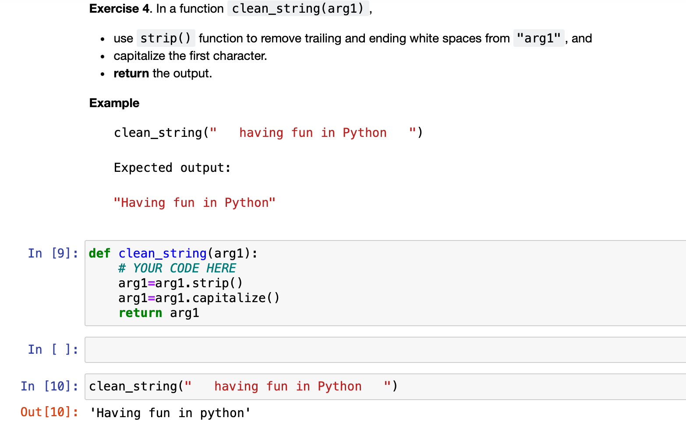


:::

### Exercise 5

::: tabs

@tab EN

**Exercise 5**. In a function ``first_last(arg1)``, **return** the `a+b`, where `a` is the first character and `b` is the last character of `arg1`.

**Example**

```py
clean_string("My Name is Andrew")

Expected output:
"Mw"
```

**Hint** 
- The function `len()` gives you the length of the list. For example, ``len('abcd')`` returns 4. So, the last element of `arg1` is therefore indexed at `len(arg1) - 1`. 

```python
def first_last(arg1):  
    # YOUR CODE HERE
```


@tab ZH

Exercise 5. 在一个名为 `first_last(arg1)` 的函数中，**返回** `a+b`，其中 `a` 是 `arg1` 的第一个字符，而 `b` 是 `arg1` 的最后一个字符。

**例子**

```py
clean_string("My Name is Andrew")

期望输出：
"Mw"
```

**提示**
- 函数 `len()` 可以给出列表的长度。例如，`len('abcd')` 返回 4。因此，`arg1` 的最后一个元素的索引为 `len(arg1) - 1`。

@tab Answer

这是一个Python编程问题。我们需要编写一个名为 `first_last(arg1)` 的函数。此函数需要将输入字符串 `arg1` 的第一个字符（即 `a` ）与最后一个字符（即 `b` ）相加，并返回新字符串 `a+b`。

以下是解决此问题的详细步骤：

1. 首先，我们需要定义一个名为 `first_last` 的函数，它接受一个参数`arg1`。
2. 获取 `arg1` 的第一个字符，可以通过 `arg1[0]` 实现。这将赋值给变量`a`。
3. 获取 `arg1 `的最后一个字符，可以通过 `arg1[len(arg1) - 1]` 实现。这将赋值给变量`b`。
4. 将变量 `a` 和 `b` 相加以得到结果字符串。
5. 返回结果字符串。

参考代码如下：

```python
def first_last(arg1):
    a = arg1[0]  # 获取第一个字符
    b = arg1[len(arg1) - 1]  # 获取最后一个字符
    result = a + b  # 将两个字符相加得到结果字符串
    return result  # 返回结果字符串
```

示例：

```python
print(first_last("My Name is Andrew"))  # 输出结果为："Mw"
```

提示：

- 使用`len()`函数可以获取列表的长度。例如，`len('abcd')`将返回4。因此，`arg1`的最后一个元素的索引为`len(arg1) - 1`。

@tab LYR

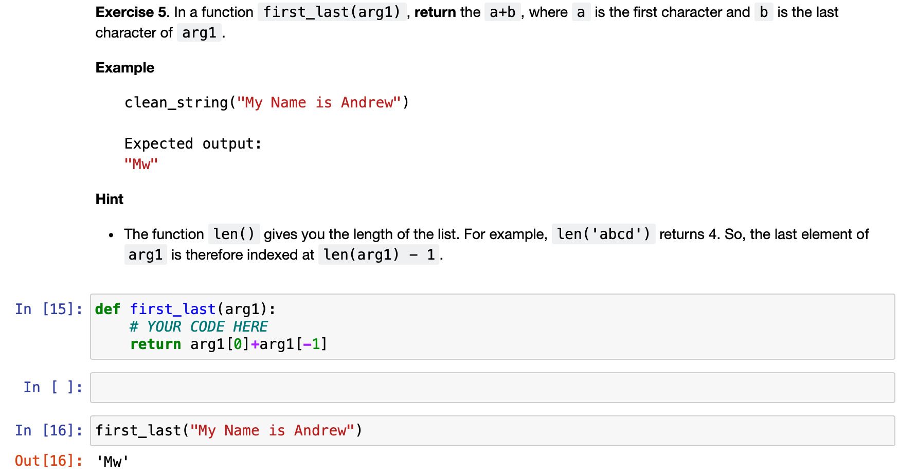


:::


### Exercise 6

::: tabs

@tab EN

**Exercise 6**. In a function ``volume_c(radius, height)``,

- Create a variable `vol` to calculate the volume of cone, assuming `pi` is equal to 3.14.  Given the formula for volume of cone is: $ volume = \frac{1}{3}\, \pi r^{2}h $, where `r` is the radius and `h` is the height.

- **return** `vol` 

```python
def volume_c(radius, height):
    # YOUR CODE HERE
```


@tab ZH

**练习 6**. 在一个名为 ``volume_c(radius, height)`` 的函数中，

- 创建一个变量 `vol` 来计算圆锥的体积，假设 `pi` 等于 3.14。给定圆锥体积的公式为：$ volume = \frac{1}{3}\, \pi r^{2}h $，其中 `r` 为半径，`h` 为高度。

- **返回** `vol`

@tab Answer

为了解答这个问题，我们将创建一个名为`volume_c`的函数，接受两个参数`radius`和`height`。接下来，我们将计算圆锥体的体积并将结果存储在变量`vol`中。最后，我们将返回`vol`。

函数定义如下：

```python
def volume_c(radius, height):
    pi = 3.14
    vol = (1 / 3) * pi * (radius ** 2) * height
    return vol
```

这个函数首先定义了圆周率`pi`为3.14。然后，它使用给定的公式$ volume = \frac{1}{3}\, \pi r^{2}h $计算圆锥体的体积，并将结果存储在变量`vol`中。最后，函数返回`vol`。

@tab LYR

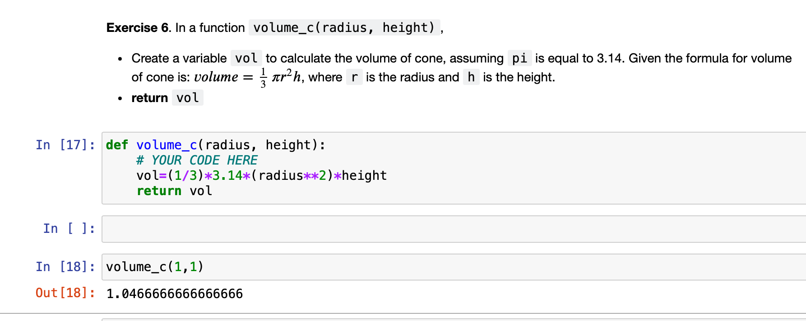

:::


## Chapter 3 - Quiz 3

This is the in-class quiz for Chapter 3. Your solution can account for maximum 2.5% of your final grade.

**Note**
* Write your code after you see `# YOUR CODE HERE` 
* Read the instruction of each question. You have a **limited time to submit: Tuesday, Mar 14, h. 17:00**. Only your last submission counts.
* Copying the solution of other students is forbidden.
* This quiz will be **auto-graded**. The auto-grading will check that your answers to the question is correct (or close to be correct). **If your submission fails the auto-grade, you will get 0.** 


### Question 1

::: tabs

@tab EN

Define a function `divisible_by_2(num)`. The function checks if a number is divisible by 2 and **returns** `True` if it is and `False` otherwise.

**Example**

```python
divisible_by_2(10) -> True
divisible_by_2(15) -> False
```

**Hint** 

* `if a%2 == 0` is `True`, then the variable `a` is divisible by 2.

```python
def divisible_by_2(num):
    # YOUR CODE HERE
```

@tab ZH

**问题 1**
定义一个函数 `divisible_by_2(num)`。该函数检查一个数是否可被2整除，如果可以，则**返回** `True`，否则返回 `False`。

**示例**

```py
divisible_by_2(10) -> True
divisible_by_2(15) -> False
```

**提示**
* 如果 `a%2 == 0` 为 `True`，则变量 `a` 可被2整除。

@tab Answer

**问题1**
定义一个函数 `divisible_by_2(num)`。该函数检查一个数字是否可以被2整除，如果可以则**返回**`True`，否则返回`False`。

**示例**

```py
divisible_by_2(10) -> True
divisible_by_2(15) -> False
```

**提示**
* 如果 `a%2 == 0` 为 `True`，那么变量 `a` 可以被2整除。

**答案**

```python
def divisible_by_2(num):
    if num % 2 == 0:
        return True
    else:
        return False

# 示例
print(divisible_by_2(10))  # 输出：True
print(divisible_by_2(15))  # 输出：False
```

在这个函数中，我们接受一个参数 `num`，并使用模运算符 `%` 检查其是否可以被2整除。如果 `num % 2` 等于 0，说明 `num` 可以被 2 整除，返回 `True`。否则，返回 `False`。

@tab LYR

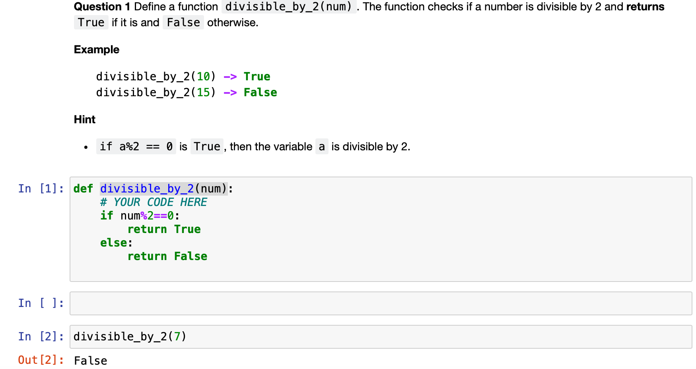

:::


### Question 2

::: tabs

@tab EN

Question 2. Define a function ``isAdult(age)``. The function checks if a person is an adult or not (`age` >= 18 is adult). It **returns** `True` if a person is an adult and `False` otherwise.

**Example** 
```py
isAdult(10) -> False
isAdult(18) -> True
```

```python
def isAdult(age):
    # YOUR CODE HERE
```


@tab ZH

定义一个函数``isAdult(age)``。该函数检查一个人是否是成年人（`age` >= 18 表示成年）。如果一个人是成年人，则**返回**`True`，否则返回`False`。

**示例**
```python
isAdult(10) -> False
isAdult(18) -> True
```

@tab Answer

首先，让我们来定义一个名为 `isAdult` 的函数，它将接受一个参数 `age`，用于表示一个人的年龄。根据问题描述，我们需要检查年龄是否大于等于18。如果是成年人，则返回 `True`，否则返回 `False`。

请参考以下代码：

```python
def isAdult(age):
    if age >= 18:
        return True
    else:
        return False
```

现在让我们用例子测试这个函数：

```python
print(isAdult(10))  # 输出：False
print(isAdult(18))  # 输出：True
```

这个函数会根据输入的年龄判断是否成年，并返回相应的布尔值。

@tab LYR

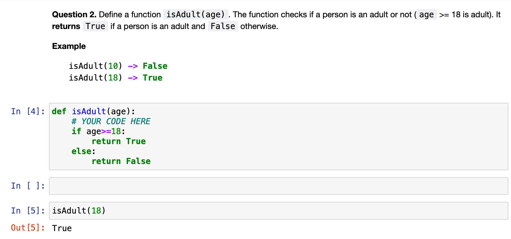

:::

### Question 3

::: tabs

@tab EN

**Question 3.** Define a function ``letter_grade(grade)``, where ``grade`` is a float argument.

* If `grade` is above or equal to 85, assign `"A"` to the variable `lettergrade`
* If `grade` is between 65 (included) and 85 (excluded), assign `"B"` to the variable `lettergrade`
* If `grade` is between 45 (included) and 65 (excluded), assign `"C"` to the variable `lettergrade`
* If `grade` is between 25 (included) and 45 (excluded), assign `"D"` to the variable `lettergrade`
* If `grade` is below 25, assign `"F"` to the variable `lettergrade`
* **Returns** the variable `lettergrade`

```python
def letter_grade(grade):
    lettergrade = ''
    # YOUR CODE HERE
```


@tab ZH

定义一个函数`letter_grade(grade)`，其中`grade`是一个浮点数参数。

* 如果`grade`大于或等于85，则将变量`lettergrade`赋值为`"A"`
* 如果`grade`在65（包含）和85（不包含）之间，则将变量`lettergrade`赋值为`"B"`
* 如果`grade`在45（包含）和65（不包含）之间，则将变量`lettergrade`赋值为`"C"`
* 如果`grade`在25（包含）和45（不包含）之间，则将变量`lettergrade`赋值为`"D"`
* 如果`grade`小于25，则将变量`lettergrade`赋值为`"F"`
* **返回**变量`lettergrade`

@tab Answer

题目要求你定义一个名为`letter_grade(grade)`的函数，其中`grade`是一个浮点数参数。根据`grade`的值，为变量`lettergrade`分配一个相应的字母等级，然后返回这个字母等级。

具体要求如下：

* 如果`grade`大于等于85，将`lettergrade`设为`"A"`
* 如果`grade`在65（包括）和85（不包括）之间，将`lettergrade`设为`"B"`
* 如果`grade`在45（包括）和65（不包括）之间，将`lettergrade`设为`"C"`
* 如果`grade`在25（包括）和45（不包括）之间，将`lettergrade`设为`"D"`
* 如果`grade`小于25，将`lettergrade`设为`"F"`

根据以上要求，这个函数可以定义如下：

```python
def letter_grade(grade):
    if grade >= 85:
        lettergrade = "A"
    elif grade >= 65 and grade < 85:
        lettergrade = "B"
    elif grade >= 45 and grade < 65:
        lettergrade = "C"
    elif grade >= 25 and grade < 45:
        lettergrade = "D"
    else:
        lettergrade = "F"
    
    return lettergrade
```

这个函数首先通过一系列的条件判断为变量`lettergrade`分配一个相应的字母等级，然后返回这个字母等级。

@tab LYR

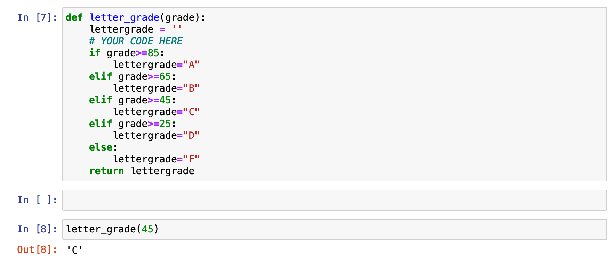

:::

### Question 4

::: tabs

@tab EN

**Question 4**. Define a function ``cumsum(num)``. The function **returns** the sum of all positive integers smaller or equal to `num`.  

**Example** 
```py
cumsum(4) -> 1 + 2 + 3 + 4 = 10
cumsum(5.5) -> 1 + 2 + 3 + 4 + 5 = 15
```

**Hint**
* `int()` converts a float type value into an interger.

```python
def cumsum(num):
    # YOUR CODE HERE
```

@tab ZH

定义一个函数 `cumsum(num)`。该函数**返回**小于或等于 `num` 的所有正整数的和。

**示例**
```py
cumsum(4) -> 1 + 2 + 3 + 4 = 10
cumsum(5.5) -> 1 + 2 + 3 + 4 + 5 = 15
```

**提示**
* `int()` 将浮点数转换为整数类型。

@tab Answer

首先，根据题目要求，我们需要定义一个名为``cumsum(num)``的函数，该函数需要计算并返回小于或等于``num``的所有正整数之和。

示例：
```py
cumsum(4) -> 1 + 2 + 3 + 4 = 10
cumsum(5.5) -> 1 + 2 + 3 + 4 + 5 = 15
```

提示：
* 可以使用 `int()` 函数将一个浮点数类型的值转换为整数。

接下来，我将为您提供一个详细的解答：

```python
def cumsum(num):
    # 首先，我们将输入值转换为整数，以确保我们只处理整数
    num = int(num)

    # 初始化一个变量，用于存储累加的和
    sum = 0

    # 使用一个循环遍历1到num（包含）之间的所有整数
    for i in range(1, num + 1):
        # 将当前整数添加到累加和变量中
        sum += i

    # 返回最终计算的累加和
    return sum
```

现在，您可以使用这个函数来计算任何给定数值（包括浮点数）小于或等于该数值的所有正整数之和。例如：

```python
print(cumsum(4))   # 输出: 10
print(cumsum(5.5)) # 输出: 15
```

@tab LYR

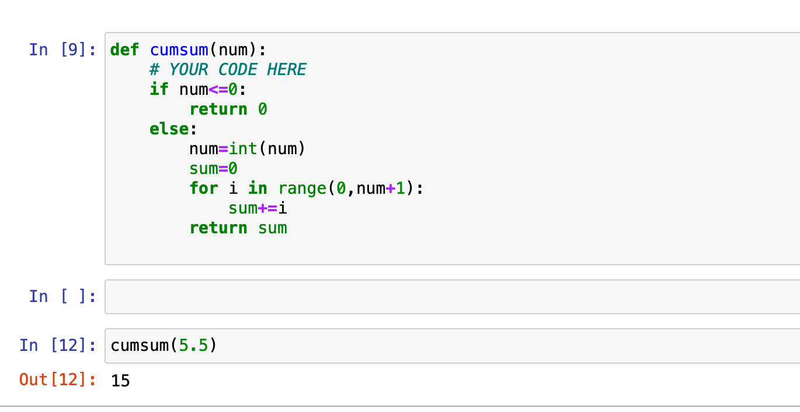


:::

### Question 5

::: tabs

@tab EN

**Question 5.** Define a function ``even_sum(num)``, where `num` is a positive number. The function iterates all the integers numbers from 0 to `num`, sums them up if they are even numbers, and **returns** the sum.

**Example** 
```py
even_sum(4) -> 2 + 4 = 6
even_sum(8.5) -> 2 + 4 + 6 + 8 = 20
```

```python
def even_sum(num):
    # YOUR CODE HERE
```

@tab ZH

定义一个函数``even_sum(num)``，其中`num`是一个正数。该函数从0到`num`迭代所有整数，如果它们是偶数，则将它们求和，并**返回**这个和。

**示例**
```py
even_sum(4) -> 2 + 4 = 6
even_sum(8.5) -> 2 + 4 + 6 + 8 = 20
```

@tab Answer

在这个问题中，你需要定义一个名为 ``even_sum(num)`` 的函数，其中 `num` 是一个正数。函数会遍历从 0 到 `num` 的所有整数，如果它们是偶数就将它们相加，最后**返回**和。

**示例** 
```py
even_sum(4) -> 2 + 4 = 6
even_sum(8.5) -> 2 + 4 + 6 + 8 = 20
```

要实现这个函数，你可以使用以下代码：

```python
def even_sum(num):
    # 初始化和为 0
    total_sum = 0

    # 遍历从 0 到 num 的整数
    for i in range(0, int(num) + 1):
        # 判断当前数字是否为偶数
        if i % 2 == 0:
            # 如果是偶数，将其加到总和上
            total_sum += i

    # 返回总和
    return total_sum
```

使用这个函数，你可以像示例中那样计算偶数和：

```python
print(even_sum(4))    # 输出：6
print(even_sum(8.5))  # 输出：20
```

@tab LYR

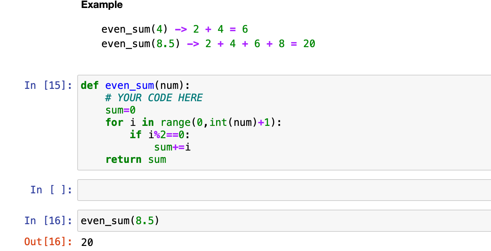


:::

### Question 6

::: tabs

@tab EN

**Question 6.** Define a function ``num_char_before_period(sentence)``. The function **returns** the number of characters in a given string before encountering the symbol ".", using **while loop**. Assume the argument `sentence` always include a period "."
**Example**

```py
num_char_before_period('I love python.') -> 13
num_char_before_period('I hate you. I love python.') -> 10
num_char_before_period('...') -> 0
```

**Hint**
* `!=` denotes not equal.
* the element on index i can be accessed by using `sentence[i]`.
* len(sentence) gives the number of characters in a the sentence

```python
def num_char_before_period(sentence):
    # YOUR CODE HERE
```


@tab ZH

定义一个函数``num_char_before_period(sentence)``。该函数使用**while循环**，返回给定字符串中遇到符号"."之前的字符数。假设参数`sentence`始终包含一个句号"。"

**示例**
```py
num_char_before_period('I love python.') -> 13
num_char_before_period('I hate you. I love python.') -> 10
num_char_before_period('...') -> 0
```

**提示**
* `!=`表示不等于。
* 可以使用`sentence[i]`访问索引i上的元素。
* len(sentence)可以获取句子中的字符数。

@tab Answer

根据题目要求，我们需要定义一个函数 `num_char_before_period(sentence)`，该函数使用 **while 循环** 计算给定字符串在遇到符号"."之前的字符数量。假设参数 `sentence` 总是包含一个句号"."。下面是详细的解答：

```python
def num_char_before_period(sentence):
    # 初始化计数器和索引
    count = 0
    index = 0

    # 当索引小于字符串长度且字符不等于句号时，执行循环
    while index < len(sentence) and sentence[index] != '.':
        # 计数器加1
        count += 1
        # 索引加1
        index += 1

    # 返回计数器的值
    return count

# 示例测试
print(num_char_before_period('I love python.'))  # -> 13
print(num_char_before_period('I hate you. I love python.'))  # -> 10
print(num_char_before_period('...'))  # -> 0
```

提示：
* `!=`表示不等于。
* 可以使用`sentence[i]`来访问索引为i的元素。
* `len(sentence)`可以获得句子中的字符数量。

@tab LYR

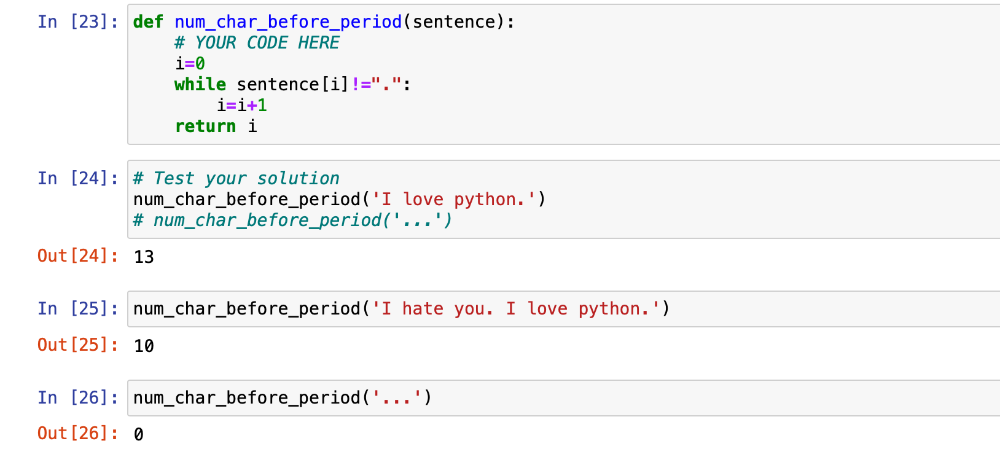

:::


### Question 7

::: tabs

@tab EN

**Question 7.** Define a function ``remove_vowel(string1)``. The function **returns** a new string with all vowels removed. Vowels are any of `a, e, i, o, u` and `A, E, I, O, U`. 

**Example**
```py
remove_vowel('python') -> 'pythn'
remove_vowel('I love ice cream') -> ' lv c crm'
```

**Hint**
* you can check if a character or an element (not) in a string or a list by using `in`, or `not in`.

```python
def remove_vowel(string1):
    vowels = ["a", "e", "i", "o", "u", "A", "E", "I", "O", "U"]
    output = ""
    # YOUR CODE HERE
```


@tab ZH

问题 7. 定义一个函数 ``remove_vowel(string1)``。该函数返回一个新字符串，其中所有元音字母被删除。元音字母包括 `a, e, i, o, u` 和 `A, E, I, O, U`。

示例：
```py
remove_vowel('python') -> 'pythn'
remove_vowel('I love ice cream') -> ' lv c crm'
```

提示：
* 你可以使用 `in` 或 `not in` 来检查一个字符或元素是否在字符串或列表中。

@tab Answer

在 Python 中，你可以这样定义一个名为 `remove_vowel` 的函数，该函数将接收一个字符串 `string1` 作为输入，并返回一个删除了所有元音字母（`a, e, i, o, u, A, E, I, O, U`）的新字符串。

```python
def remove_vowel(string1):
    vowels = "aeiouAEIOU"
    result = ""

    for char in string1:
        if char not in vowels:
            result += char

    return result
```

我们来分析一下这个函数的工作原理：

1. 定义一个名为 `remove_vowel` 的函数，该函数接受一个名为 `string1` 的参数。
2. 定义一个名为 `vowels` 的字符串，其中包含所有元音字母。
3. 定义一个名为 `result` 的空字符串，用于存储删除元音后的字符串。
4. 使用 `for` 循环遍历 `string1` 中的每个字符。
5. 使用 `if` 语句检查字符是否不在 `vowels` 字符串中。如果字符不是元音字母，将其添加到 `result` 字符串中。
6. 循环结束后，返回 `result` 字符串。

使用这个函数，你可以删除输入字符串中的所有元音字母，如下所示：

```python
print(remove_vowel('python'))  # 输出：'pythn'
print(remove_vowel('I love ice cream'))  # 输出：' lv c crm'
```

@tab LYR

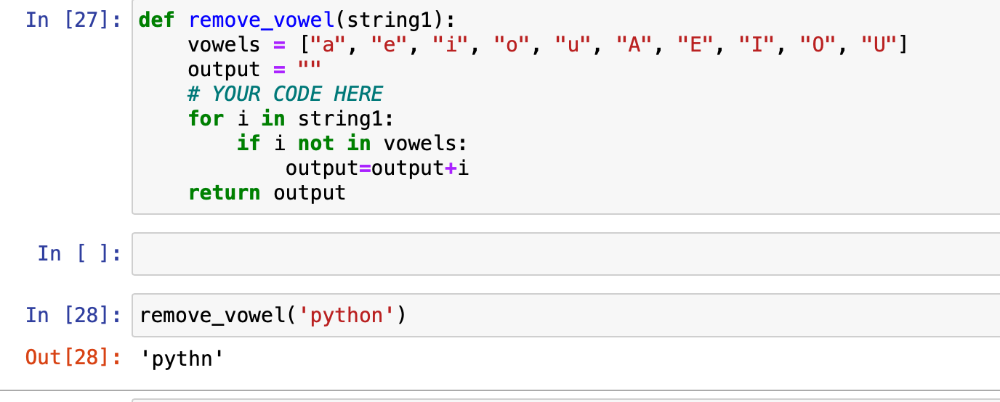

:::

## Chapter 4 - Quiz 4

This is the in-class quiz for Chapter 4 (Data Structures Part 1) for students of **session 1004**. Your solution can account for maximum 2.5% of your final grade.

**Note**
* Write your code after you see `# YOUR CODE HERE` 
* Read the instruction of each question. You have a **limited time to submit: Tue 21 Mar, h.17:00**. Only your last submission counts.
* Copying the solution of other students is forbidden.
* This quiz will be **auto-graded**. The auto-grading will check that your answers to the question is correct (or close to be correct). **If your submission fails the auto-grade, you will get 0.** 

### Question1

::: tabs

@tab EN

**Question1**. Define a function ``first_last(listA)`` that **returns** a list with the first and last element of ``listA`` interchanged.

**Example** 
```py
first_last([1, 2, 3]) -> [3, 2, 1]
first_last(["a", "b", "c", "d"]) -> ["d", "b", "c", "a"]
```

**Hint** 
* To create a list with the same dimension of list1
```python
n = len(listA)
list0 = [0]*n
```

```python
def first_last(listA):
    n = len(listA)
    list0 = [0]*n
    # YOUR CODE HERE
```

@tab ZH

定义一个函数``first_last(listA)``，该函数**返回**将``listA``的第一个和最后一个元素互换位置后的列表。

**示例**
```py
first_last([1, 2, 3]) -> [3, 2, 1]
first_last(["a", "b", "c", "d"]) -> ["d", "b", "c", "a"]
```

**提示**
* 要创建与 listA 具有相同维度的列表：
```py
n = len(listA)
list0 = [0]*n
```

@tab Answer

```python
def first_last(listA):
    n = len(listA)
    list0 = [0]*n
    # YOUR CODE HERE
    listA[0], listA[-1] = listA[-1], listA[0]
    return listA
first_last([1, 2, 3])
```

首先，理解题目要求：定义一个函数`first_last(listA)`，将 `listA` 的第一个和最后一个元素互换，并返回新的列表。

**解答**：

```python
def first_last(listA):
    # 获取列表长度
    n = len(listA)
    
    # 根据列表长度创建一个新列表，用0填充
    list0 = [0] * n

    # 遍历listA，将元素复制到新列表list0中
    for i in range(n):
        if i == 0:
            list0[i] = listA[n - 1]
        elif i == n - 1:
            list0[i] = listA[0]
        else:
            list0[i] = listA[i]

    # 返回新列表list0
    return list0

# 示例
print(first_last([1, 2, 3]))  # 输出：[3, 2, 1]
print(first_last(["a", "b", "c", "d"]))  # 输出：["d", "b", "c", "a"]
```

**提示解释**：
创建一个与list1相同维度的列表：
```py
n = len(listA)
list0 = [0]*n
```
在这个示例中，我们首先获取列表`listA`的长度，并用0填充创建一个新列表`list0`。然后我们遍历`listA`，将其元素复制到新列表`list0`中，同时将第一个元素与最后一个元素互换。最后，返回新的列表`list0`。

---

```python
def first_last(listA):
    if len(listA) <= 1:
        return listA
    else:
        listA[0], listA[-1] = listA[-1], listA[0]
        return listA

# 示例
print(first_last([1, 2, 3]))  # 输出：[3, 2, 1]
print(first_last(["a", "b", "c", "d"]))  # 输出：["d", "b", "c", "a"]
```


@tab LYR

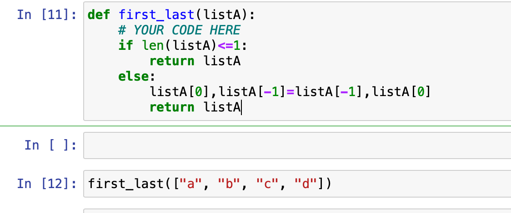

```python
def first_last(listA):
    # YOUR CODE HERE
    if len(listA)<=1:
        return listA
    else:
        listA[0],listA[-1]=listA[-1],listA[0]
        return listA
```


:::

### Question2

::: tabs

@tab EN

**Question2**. Define a function ``odd_numbers()``. The function iterates all the numbers from 0 to 20 using a **for loop** and **returns** all the odd numbers in a list. 

**Hint** 
* ``list.append()`` is a built-in method in Python to store items into a list.

```python
def odd_numbers():
    res = []
    # YOUR CODE HERE
```

@tab ZH

定义一个函数``odd_numbers()``。该函数使用**for循环**迭代从0到20的所有数字，并将所有奇数以列表形式**返回**。

**提示**
* ``list.append()``是Python中用于将项目存储到列表中的内置方法。

@tab Answer

在 Python 中，要定义一个名为``odd_numbers()``的函数，这个函数使用**for循环**遍历0到20之间的所有数字，并将所有奇数放入一个列表中并返回。以下是该函数的定义：

```python
def odd_numbers():
    odd_numbers_list = []  # 创建一个空列表用于存放奇数
    for number in range(21):  # 使用for循环遍历0到20的数字
        if number % 2 != 0:  # 判断数字是否为奇数
            odd_numbers_list.append(number)  # 将奇数添加到列表中
    return odd_numbers_list  # 返回包含所有奇数的列表
```

**提示**：
* Python中内置的``list.append()``方法用于将项目添加到列表中。

以下是如何调用这个函数并输出结果的示例：

```python
result = odd_numbers()
print(result)
```

输出结果：

```
[1, 3, 5, 7, 9, 11, 13, 15, 17, 19]
```

这个示例演示了如何使用定义的 ``odd_numbers()`` 函数获取 0 到 20 之间的所有奇数并将其输出。

@tab LYR

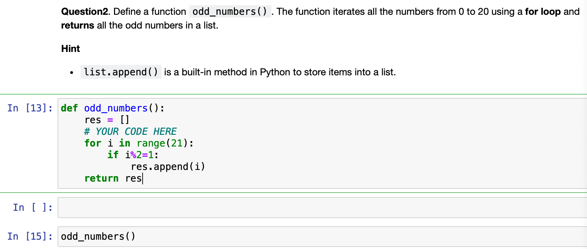

注意双等号才是判断是否相等。

:::

### Question3

::: tabs

@tab EN

**Question3**. Define a function ``group_student(set1, set2, left = True)``. The function **returns** a set:    

    1. Students who are in `set1` but not in `set2`, if `left=True` 
    2. Students who are in both `set1` and `set2` at the same time, if `left=False` 

**Hint** 
* Use `set1 = {...}` to create a set. 
* a - b returns items in a but not in b
* a & b returns items in both a and b

**Example** 

```py
python = {"Alice", "Bob", "Fiona", "Luke", "Tom"}
econ = {"Alice", "Blaire", "Courtney", "David", "Luke"}
group_student(python, econ) -> {'Bob', 'Fiona', 'Tom'}
```

```python
def group_student(set1={"Alice","Bob","Fiona","Luke","Tom"}, set2={"Alice","Blaire","Courtney","David","Luke"}, left = True):
    # YOUR CODE HERE
```


@tab ZH

定义一个函数`group_student(set1, set2, left=True)`，该函数返回一个集合：

1. 如果`left=True`，则返回在`set1`中但不在`set2`中的学生。
2. 如果`left=False`，则返回同时在`set1`和`set2`中的学生。

提示：
- 使用`set1 = {...}`创建一个集合。
- `a - b` 返回在a中但不在b中的项。
- `a & b` 返回同时在a和b中的项。

示例：

```py
python = {"Alice", "Bob", "Fiona", "Luke", "Tom"}
econ = {"Alice", "Blaire", "Courtney", "David", "Luke"}
group_student(python, econ) -> {'Bob', 'Fiona', 'Tom'}
```

@tab Answer

定义一个名为 `group_student(set1, set2, left=True)` 的函数。这个函数返回一个集合：

1. 如果 `left=True`，则返回在 `set1` 中但不在 `set2` 中的学生。
2. 如果 `left=False`，则返回同时在 `set1` 和 `set2` 中的学生。

提示：

- 使用 `set1 = {...}` 创建一个集合。
- a - b 返回在 a 中但不在 b 中的项
- a & b 返回同时在 a 和 b 中的项

示例：

```py
def group_student(set1, set2, left=True):
    if left:
        return set1 - set2
    else:
        return set1 & set2

python = {"Alice", "Bob", "Fiona", "Luke", "Tom"}
econ = {"Alice", "Blaire", "Courtney", "David", "Luke"}

print(group_student(python, econ))  # 输出：{'Bob', 'Fiona', 'Tom'}
```

在这个示例中，我们定义了一个名为 `group_student` 的函数，该函数接受两个集合 `set1` 和 `set2` 以及一个布尔参数 `left`。根据 `left` 参数的值，函数将返回 `set1` 和 `set2` 的差集或交集。在这个示例中，我们使用两个集合 `python` 和 `econ` 分别表示学习 Python 和经济学的学生，调用 `group_student(python, econ)` 返回在 `python` 中但不在 `econ` 中的学生。

@tab LYR

```python {5}
def group_student(set1={"Alice","Bob","Fiona","Luke","Tom"}, set2={"Alice","Blaire","Courtney","David","Luke"}, left = True):
    # YOUR CODE HERE
    # set1={"Alice","Bob","Fiona","Luke","Tom"}
    # set2={"Alice","Blaire","Courtney","David","Luke"}
    if left=="True":
        return set1-set2
    else:
        return set1&set2
python = {"Alice", "Bob", "Fiona", "Luke", "Tom"}
econ = {"Alice", "Blaire", "Courtney", "David", "Luke"}
group_student(python, econ)
```

:::


### Question4

::: tabs

@tab EN

Write a function called `tuple_stats` that takes in a tuple of integers as input and returns a tuple containing the following statistics:

1. The minimum value in the tuple.
2. The maximum value in the tuple.
3. The sum of all the values in the tuple.
4. The mean of all the values in the tuple.

**Example**
```py
tup1 = (3, 5, 1, 8, 2)
tuple_stats(tup1) -> (1, 8, 19, 3.8)
```

**Hint** 
* To find the minimum and maximum values in a tuple, you can use the built-in min and max functions in Python. For example, min((3, 5, 1, 8, 2)) will return 1.

* To find the sum of all the values in a tuple, you can use a loop to iterate through each element in the tuple and add it to a running total. You can start the total at 0 and update it with each iteration of the loop.

* To find the mean of all the values in a tuple, you can divide the sum of all the values by the length of the tuple. You can use the len function to find the length of the tuple.

```python
def tuple_stats(tup):
    # YOUR CODE HERE
```

@tab ZH

编写一个名为`tuple_stats`的函数，该函数接受一个整数元组作为输入，并返回一个包含以下统计信息的元组：
1. 元组中的最小值。
2. 元组中的最大值。
3. 元组中所有值的总和。
4. 元组中所有值的平均值。

**示例**
```py
tup1 = (3, 5, 1, 8, 2)
tuple_stats(tup1) -> (1, 8, 19, 3.8)
```

**提示**
* 要在元组中找到最小值和最大值，可以使用 Python 中内置的 min 和 max 函数。例如，`min((3, 5, 1, 8, 2))` 将返回1。

* 要计算元组中所有值的总和，可以使用循环遍历元组中的每个元素，并将其添加到一个运行总和中。可以将总和初始化为0，并在循环的每次迭代中更新它。

* 要计算元组中所有值的平均值，可以将所有值的总和除以元组的长度。可以使用 len 函数来获取元组的长度。

@tab Answer

根据要求，提供一个名为 `tuple_stats` 的函数，该函数接受一个整数元组作为输入，并返回一个包含以下统计信息的元组：

1. 元组中的最小值。
2. 元组中的最大值。
3. 元组中所有值的和。
4. 元组中所有值的平均值。

示例和提示已经提供，现在我将提供函数的完整实现：

```python
def tuple_stats(tup):
    # 获取元组的最小值
    min_value = min(tup)
    
    # 获取元组的最大值
    max_value = max(tup)
    
    # 计算元组中所有值的和
    total = sum(tup)

    # 计算元组中所有值的平均值
    mean = total / len(tup)

    # 返回一个包含上述统计信息的元组
    return (min_value, max_value, total, mean)

# 测试示例
tup1 = (3, 5, 1, 8, 2)
print(tuple_stats(tup1))  # 输出：(1, 8, 19, 3.8)
```

这个 `tuple_stats` 函数实现了计算元组中最小值、最大值、总和和平均值的功能。您可以根据需要使用和修改这个函数。

@tab LYR

```python
def tuple_stats(tup):
    # YOUR CODE HERE
    minimum=min(tup)
    maximum=max(tup)
    summ=sum(tup)
    mean=summ/len(tup)
    return (minimum,maximum,summ,mean)
```

:::

### Question5

::: tabs

@tab EN

**Question5**. Write a function called count_vowel that takes in a string and return the number of **unique** vowels forming the string. This function is case sensitive, such that the maximum number of vowel is 10.


**Example**
```py
count_vowel("Hello World") -> 2
count_vowel("AAA nsn") -> 1
count_vowel("ll cnsnt") -> 0
count_vowel("aAeE") -> 4
```

**Hint**

```py
vowel = ["a","e","i","o","u", "A","E","I","O","U"]
`set()` # convert a list to set, where element are unique 
```

```python
def count_vowel(str_arg):
    # YOUR CODE HERE
```

@tab ZH

**问题5**. 编写一个名为 count_vowel 的函数，该函数接收一个字符串并返回构成该字符串的**唯一**元音字母的数量。此函数区分大小写，因此元音字母的最大数量是 10。

**示例**
```py
count_vowel("Hello World") -> 2
count_vowel("AAA nsn") -> 1
count_vowel("ll cnsnt") -> 0
count_vowel("aAeE") -> 4
```

**提示**

```py
vowel = ["a","e","i","o","u", "A","E","I","O","U"]
`set()` # 将列表转换为集合，其中元素是唯一的
```

@tab Answer

函数定义：创建一个名为count_vowel的函数，输入一个字符串，返回组成该字符串的**唯一**元音字母的数量。此函数区分大小写，因此最多有10个元音字母。

示例代码：

```py
def count_vowel(s):
    vowel = ["a", "e", "i", "o", "u", "A", "E", "I", "O", "U"]
    unique_vowels = set(s) & set(vowel)  # 取输入字符串集合与元音字母集合的交集
    return len(unique_vowels)

print(count_vowel("Hello World"))  # 输出结果：2
print(count_vowel("AAA nsn"))  # 输出结果：1
print(count_vowel("ll cnsnt"))  # 输出结果：0
print(count_vowel("aAeE"))  # 输出结果：4
```

提示：

1. 定义一个包含所有大小写元音字母的列表：`vowel = ["a", "e", "i", "o", "u", "A", "E", "I", "O", "U"]`。
2. 使用`set()`函数将输入字符串和元音列表转换为集合，元素是唯一的。
3. 计算输入字符串集合与元音字母集合的交集，得到唯一元音字母的集合。
4. 返回唯一元音字母集合的长度作为结果。

@tab LYR

```python
def count_vowel(str_arg):
    # YOUR CODE HERE
    set_arg=set(str_arg)
    vowel = ["a","e","i","o","u", "A","E","I","O","U"]
    count=0
    for i in set_arg:
        if i in vowel:
            count+=1
    return count
```

:::

## Chapter Quiz 5

This is the in-class quiz for Chapter 5 (Data Structures Part 2) for students of **session 1004**. Your solution can account for maximum 2.5% of your final grade.

**Note**
* Write your code after you see `# YOUR CODE HERE` 
* Read the instruction of each question. You have a **limited time to submit: Tue 28 Mar, h.17:00**. Only your last submission counts.
* Copying the solution of other students is forbidden.
* This quiz will be **auto-graded**. The auto-grading will check that your answers to the question is correct (or close to be correct). **If your submission fails the auto-grade, you will get 0.** 

### Question 1

::: tabs

@tab EN

**Question 1**. Define a function ``manipulate_list(list1)`` that **returns** a new list with 1 added to every element using **list comprehension**.

**Example**
```python
list1 = [1, 3, 2, 5, 8, 7]

Expected output:
[2, 4, 3, 6, 9, 8]
```

**Hint** 
* List comprehension syntax: 
```python
[expression for variable in list]
[expression for variable in list if test_expression]
```

@tab ZH

**问题 1**. 定义一个名为 ``manipulate_list(list1)`` 的函数，使用**列表推导式**将每个元素加1后返回一个新列表。

**示例**
```py
list1 = [1, 3, 2, 5, 8, 7]

期望的输出:
[2, 4, 3, 6, 9, 8]
```

**提示**
* 列表推导式语法:
```py
[表达式 for 变量 in 列表]
[表达式 for 变量 in 列表 if 测试表达式]
```

:::


::: details 公众号：AI悦创【二维码】


:::

::: info AI悦创·编程一对一

AI悦创·推出辅导班啦，包括「Python 语言辅导班、C++ 辅导班、java 辅导班、算法/数据结构辅导班、少儿编程、pygame 游戏开发、Web、Linux」，全部都是一对一教学：一对一辅导 + 一对一答疑 + 布置作业 + 项目实践等。当然，还有线下线上摄影课程、Photoshop、Premiere 一对一教学、QQ、微信在线，随时响应！微信：Jiabcdefh

C++ 信息奥赛题解，长期更新！长期招收一对一中小学信息奥赛集训，莆田、厦门地区有机会线下上门，其他地区线上。微信：Jiabcdefh

方法一：[QQ](http://wpa.qq.com/msgrd?v=3&uin=1432803776&site=qq&menu=yes)

方法二：微信：Jiabcdefh

:::


