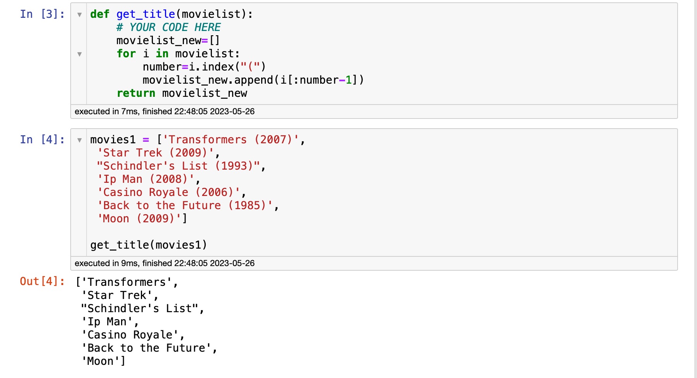
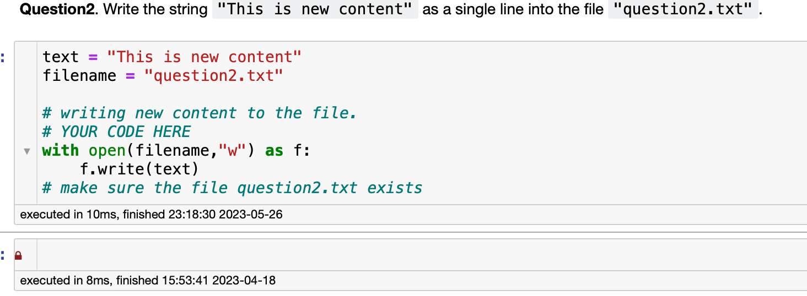

## Question 7

**Question1 Warm-up** . Define a function ``get_title(movielist)`` that **returns** a new list of movies with (year) removed. `movielist` contains titles of movie as string and year is always written as 4 digits within parathesis at the end of the title. For example 'Transformers (2007)'

> **问题1热身**。定义一个函数``get_title(movielist)``，它**返回**一个删除了年份的电影列表。`movielist`以字符串形式包含电影的标题，并且年份总是以4位数字的形式写入标题的末尾。例如` Transformers (2007) `

**Example**

```python
get_title(['Transformers (2007)']) -> ['Transformers']

movies1 = ['Transformers (2007)',
 'Star Trek (2009)',
 "Schindler's List (1993)",
 'Ip Man (2008)',
 'Casino Royale (2006)',
 'Back to the Future (1985)',
 'Moon (2009)']
 
get_title(movies1) -> 
['Transformers',
 'Star Trek',
 "Schindler's List",
 'Ip Man',
 'Casino Royale',
 'Back to the Future',
 'Moon']
```




你可以使用 Python 的字符串操作和列表解析来实现这个功能。代码如下：

```python
def get_title(movielist):
    return [title[:-7].strip() for title in movielist]

movies1 = ['Transformers (2007)',
 'Star Trek (2009)',
 "Schindler's List (1993)",
 'Ip Man (2008)',
 'Casino Royale (2006)',
 'Back to the Future (1985)',
 'Moon (2009)']

print(get_title(movies1))
```

这段代码中，我们使用了列表解析（list comprehension）来遍历输入的电影列表。对每一个电影名字，我们使用切片操作`title[:-7]`来去除名字最后的7个字符（包括空格、左右括号和4位年份），然后使用`strip()`方法去除可能存在的额外空格。最后这个操作会返回一个新的电影名字列表，其中的名字都已经去除了年份。

执行这个代码会返回：

```python
['Transformers',
 'Star Trek',
 "Schindler's List",
 'Ip Man',
 'Casino Royale',
 'Back to the Future',
 'Moon']
```

## Question 2

Question2. Write the string ``"This is new content"`` as a single line into the file ``"question2.txt"``. 

```python
with open('question2.txt', 'w') as file:
    file.write("This is new content")
```




## Question 4

**Question4. Points 1-3**. 

The file `grades.csv` contains the partial grades of about 300 students from a previous course. Answer all the questions below:
1. Use `pandas` to read the file as data frame named `grade_dataframe`. 
2. Convert the each of the columns "assignments", "project", "participation", and "exam" in respective lists named `assignments_list`, `project_list`, `participation_list`, and `exam_list`
3. Write each of the list as a pickle file named `grades.pkl` in the same order above

**Hint**
* You can use the following syntax to convert a data frame column to list: 
```python
list_name = list(data_frame[column_name])
```

```python
import pandas as pd
import pickle

# 1. 使用 pandas 读取文件，创建 DataFrame
grade_dataframe = pd.read_csv('grades.csv')

# 2. 将每一列转换成相应的列表
assignments_list = list(grade_dataframe['assignments'])
project_list = list(grade_dataframe['project'])
participation_list = list(grade_dataframe['participation'])
exam_list = list(grade_dataframe['exam'])

# 3. 将列表写入 pickle 文件
with open('grades.pkl', 'wb') as f:
    pickle.dump(assignments_list, f)
    pickle.dump(project_list, f)
    pickle.dump(participation_list, f)
    pickle.dump(exam_list, f)
```

题目需要你完成以下三个步骤：

1. 使用 `pandas` 读取名为 `grades.csv` 的文件，并将其存储为名为 `grade_dataframe` 的 DataFrame。

2. 将 `grade_dataframe` 中的 "assignments"、"project"、"participation" 和 "exam" 四列分别转换为列表，命名为 `assignments_list`、`project_list`、`participation_list` 和 `exam_list`。

3. 将这四个列表按照上述顺序写入一个名为 `grades.pkl` 的 pickle 文件。

其中，`grades.csv` 文件包含了约300名学生的部分成绩，而 pickle 是一种常用的 Python 对象序列化方法，可以将对象以二进制形式保存到文件中，方便之后再次加载和使用。


::: details 公众号：AI悦创【二维码】


:::

::: info AI悦创·编程一对一

AI悦创·推出辅导班啦，包括「Python 语言辅导班、C++ 辅导班、java 辅导班、算法/数据结构辅导班、少儿编程、pygame 游戏开发、Web、Linux」，全部都是一对一教学：一对一辅导 + 一对一答疑 + 布置作业 + 项目实践等。当然，还有线下线上摄影课程、Photoshop、Premiere 一对一教学、QQ、微信在线，随时响应！微信：Jiabcdefh

C++ 信息奥赛题解，长期更新！长期招收一对一中小学信息奥赛集训，莆田、厦门地区有机会线下上门，其他地区线上。微信：Jiabcdefh

方法一：[QQ](http://wpa.qq.com/msgrd?v=3&uin=1432803776&site=qq&menu=yes)

方法二：微信：Jiabcdefh

:::


