## 1. 选择题

### 1. 「C」

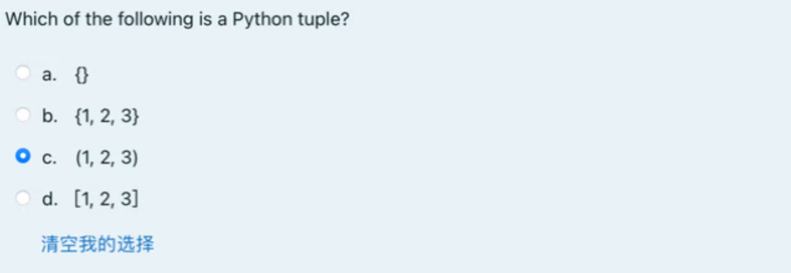


### 2. 「B」

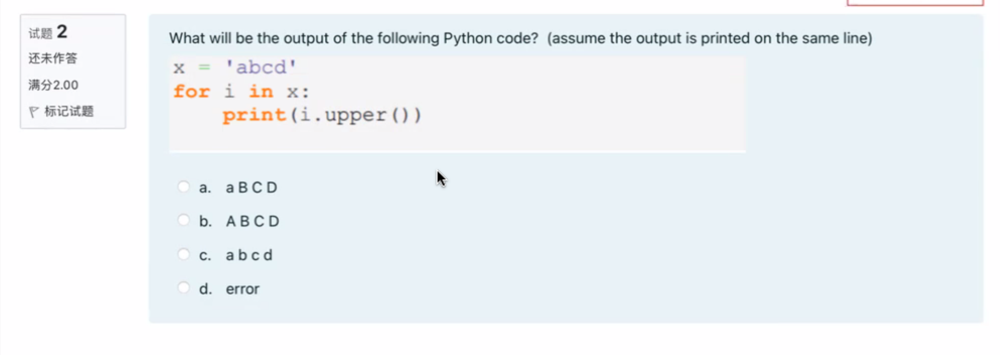

### 3. 「D」

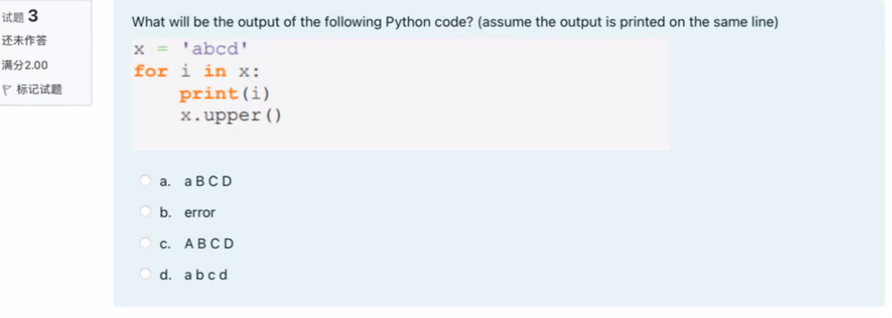

### 4.「C」

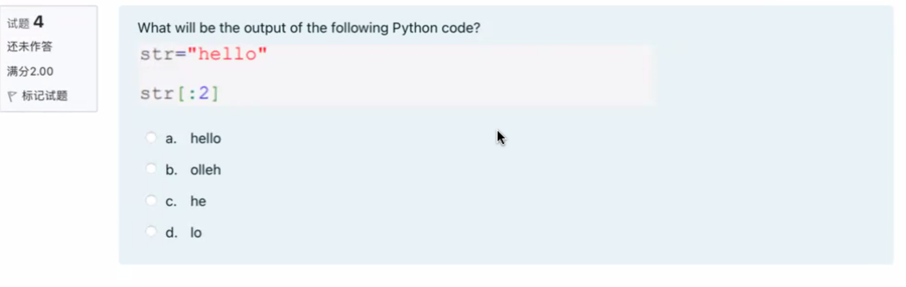

### 5.「D」

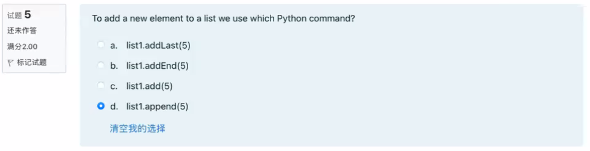

### 6.「B 」

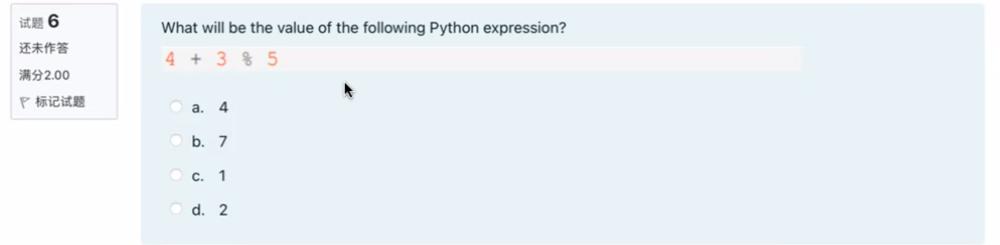


### 7. 「C」

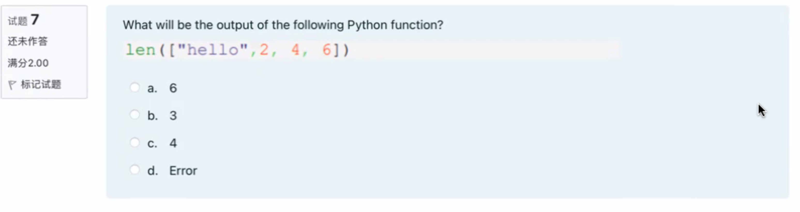

### 8. 「A」

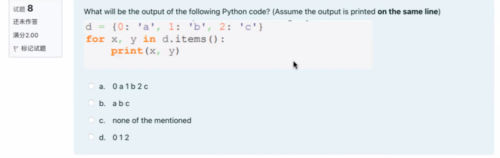


### 9. 「A」

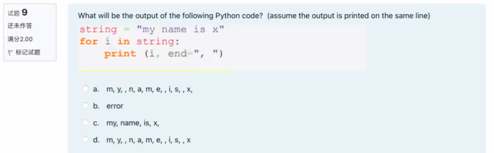


### 10. 「B」

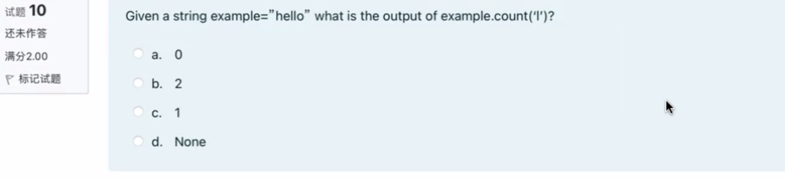


### 11. 「A」

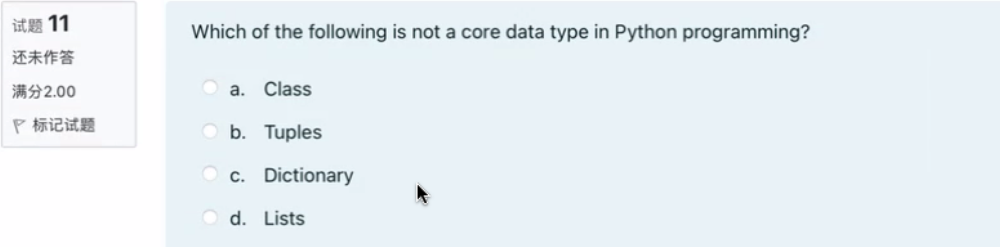

### 12. 「C」

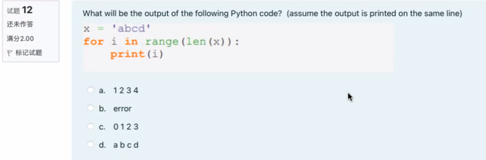

### 13. 「D」

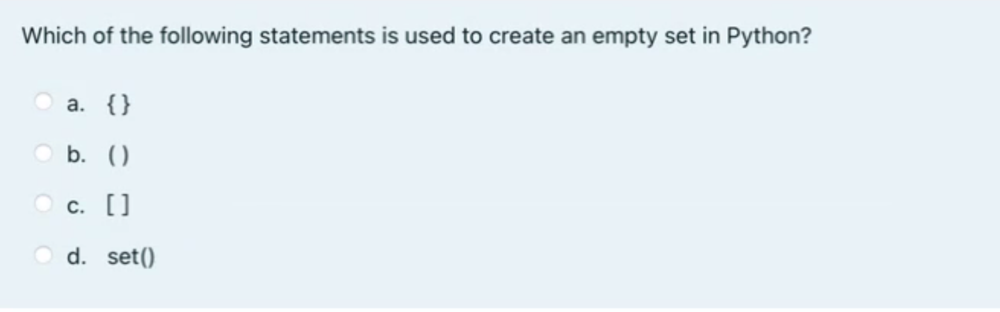

### 14. 「D」

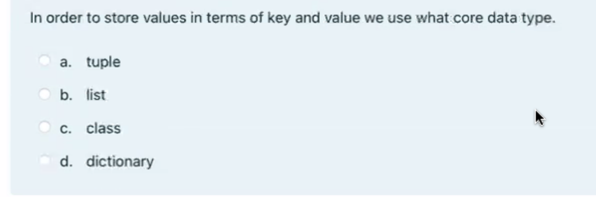

### 15. 「C」

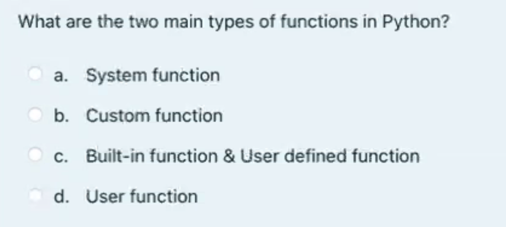

### 16.「A」

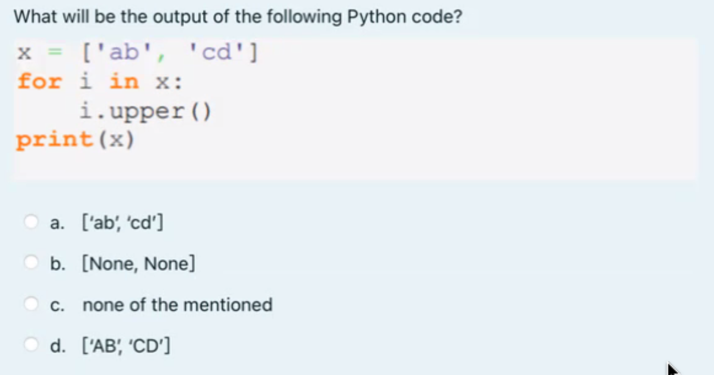

### 17. 「B」

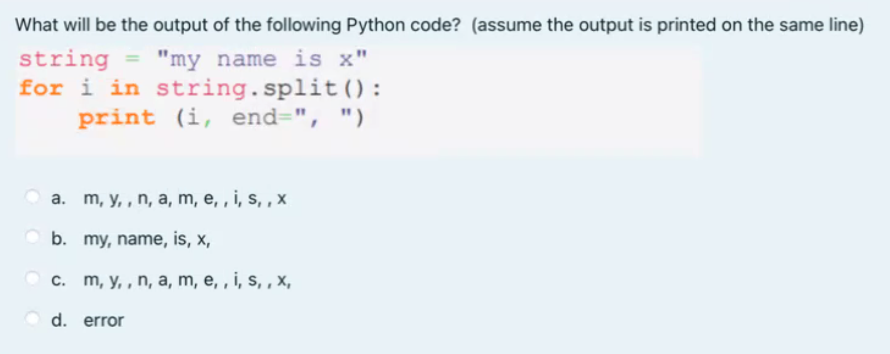

```python
In [13]: for i in s.split():
    ...:     print(i, end=", ")
    ...:
my, name, is, x,
```


### 18. 「C」

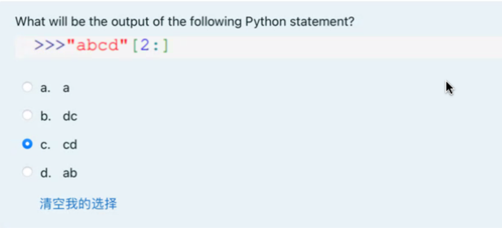

```python
In [14]: "abcd"[2:]
Out[14]: 'cd'
```


### 19. 「B」

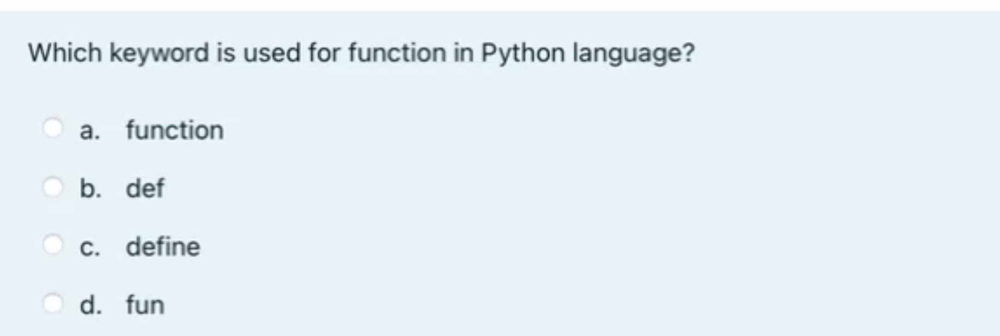

### 20. 「D」

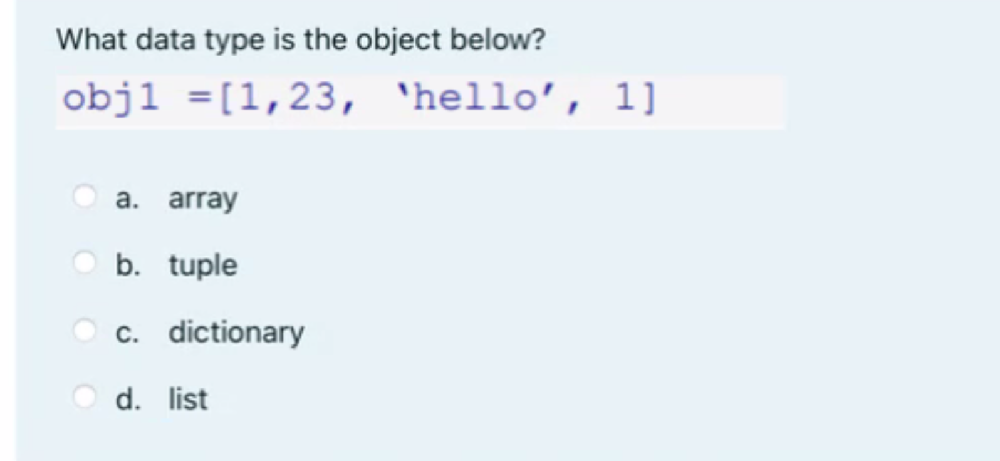


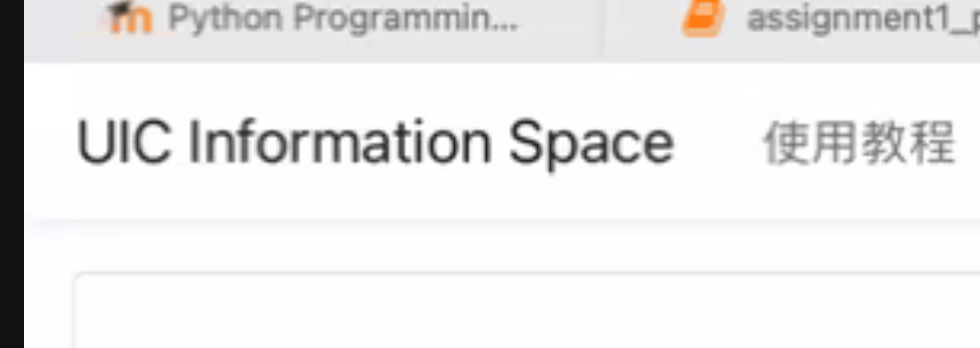


## 2. Code

This is the Part 2 of your Assignment 1. Together with the Part 1 multiple choice questions on iSpace, it accounts for maximum 10% of the final grade.

> 这是作业1的第二部分。与iSpace上的第一部分多项选择题一起，它们最多占据期末成绩的10%。

**Note**
* Write your code after you see `# YOUR CODE HERE` 「在看到`# YOUR CODE HERE`后编写你的代码。」
* Read the instruction of each question. You have a **limited time to submit: Monday 10 April, 11:00am**. Only your last submission counts.「阅读每个问题的说明。你有一个**截止提交的有限时间：4月10日星期一上午11:00**。只有你最后一次提交的答案会被计入成绩。」
* You should be able to complete the questions within 1 hour (but this is not required now)「你应该能够在1小时内完成这些问题（但现在并非必须）。」
* Copying the solution of other students is forbidden.「禁止抄袭其他学生的答案。」
* For each exercise example, the symbol `->` indicates the value the function should return.「对于每个练习示例，符号`->`表示函数应该返回的值。」
* After the deadline, submission is only possible by email attachment (.ipynb file) to yujiahu@uic.edu.cn. Late submission will be penalized (up to 100%, if late > 48h ).「截止日期后，只能通过电子邮件附件（.ipynb文件）提交给[yujiahu@uic.edu.cn](mailto:yujiahu@uic.edu.cn)。逾期提交将被罚分（如果逾期超过48小时，最高可罚100％）。」
* This assignment will be **auto-graded**. The auto-grading will check that your answers to the question is correct (or close to be correct). **If your submission fails the auto-grade, you will get 0.** 「本次作业将进行**自动评分**。自动评分将检查您对问题的回答是否正确（或接近正确）。**如果您的提交未通过自动评分，则将获得0分。**」

## Question 1

Define the function `remove_special(string1)` that **returns** the `string1` with the characters `['?', '!']` removed.

> 定义函数`remove_special(string1)`，该函数**返回**删除字符`['?', '!']`后的`string1`。

**Examples** 

```py
remove_special("python is such a fun!") -> "python is such a fun"
remove_special("?18?? UIC!") -> "18 UIC"
```

```python
def remove_special(string1):
    # YOUR CODE HERE
```

### Answer

```python
def remove_special(string1):
    # YOUR CODE HERE
    return string1.replace("?", "").replace("!", "")
```

```python
def remove_special(string1):
    # YOUR CODE HERE
    return string1.replace("?", "").replace("!", "")


print(remove_special("python is such a fun!"))
print(remove_special("?18?? UIC!"))
```

## Question 2

Given `day` of the week encoded as 0 = Sun, 1 = Mon, 2 = Tue, ... 6 = Sat, and a boolean `vacation` indicating if we are on vacation, write the function `alarm_clock(day, vacation)`.

> 给定一周的某个`day`，其中0 = 周日，1 = 周一，2 = 周二，... 6 = 周六，以及一个布尔值`vacation`，表示我们是否在度假，编写函数`alarm_clock(day, vacation)`。

* If we are not on vacation, 「如果我们不在度假，」
    * on weekdays (Mon-Fri), the function should **return** a string of the form "7:00"「在工作日（周一至周五），该函数应该**返回**一个形如"7:00"的字符串。」
    * on weekends (Sat and Sun), the function should **return** a string of the form "10:00"「在周末（周六和周日），该函数应该**返回**一个形如"10:00"的字符串。」

* If we are on vacation,「如果我们在度假，」
    * on weekdays (Mon-Fri), the function should **return** a string of the form "10:00"「在工作日（周一至周五），如果我们在度假，该函数应该**返回**一个形如"10:00"的字符串。」
    * on weekends (Sat and Sun), the function should **return** a string of the form "off"「在周末（周六和周日），如果我们在度假，该函数应该**返回**一个形如"off"的字符串。」

**Examples**

```py
alarm_clock(3, False) -> "7:00"
alarm_clock(6, False) -> "10:00"
alarm_clock(1, True) -> "10:00"
alarm_clock(6, True) -> "off"
```

### Answer

```python
def alarm_clock(day, vacation):
    # YOUR CODE HERE
    if vacation:
        if 1 <= day <= 5:
            return "10:00"
        else:
            return "off"
    else:
        if 1 <= day <= 5:
            return "7:00"
        else:
            return "10:00"


print(alarm_clock(3, False))
print(alarm_clock(6, False))
print(alarm_clock(1, True))
print(alarm_clock(6, True))
```


### Question 3

Define the function `is_prime(num)` to check if given positive integer is a prime number or not. The function **returns** a boolean `True` if a number is divisible only by 1 and itself, and **returns** a boolean `False` if it is divisible by any other number than 1 or itself. 1 is considered as a prime number. 2 is also a prime number.

> 定义函数`is_prime(num)`，用于检查给定的正整数是否是质数。如果一个数仅能被1和它本身整除，该函数**返回**布尔值`True`，否则，如果它可以被1或它本身以外的其他数整除，该函数**返回**布尔值`False`。1被认为是质数，2也是质数。

**Examples**

```py
is_prime(7) -> True
is_prime(100) -> False
is_prime(1) -> True
is_prime(2) -> True
```

### Answer

```python
def is_prime(num):
    # YOUR CODE HERE
    if num < 1:
        return False
    for i in range(2, num):
        if num % i == 0:
            return False
    return True


print(is_prime(7))
print(is_prime(100))
print(is_prime(1))
print(is_prime(2))
```


## Question 4

Define the function `second_highest(list_arg)` that **returns** the second highest number in the list argument `list_arg`. The input list has at least two unique numbers. 

> 定义函数`second_highest(list_arg)`，该函数接受一个列表参数`list_arg`，并**返回**该列表中第二大的数字。输入列表至少包含两个不同的数字。

**Examples**
```py
second_highest([1,2,3,4,5]) -> 4
second_highest([1,2,3,5,5]) -> 3
```

### Answer

```python
def second_highest(list_arg):
    # YOUR CODE HERE
    s = set(list_arg)
    numbers = sorted(s, reverse=True)
    return numbers[1]


def second_highest(list_arg):
    unique_numbers = sorted(set(list_arg), reverse=True)
    return unique_numbers[1]


# 测试用例
print(second_highest([1, 2, 3, 4, 5]))  # 输出: 4
print(second_highest([1, 2, 3, 5, 5]))  # 输出: 3
```


## Question 5

Define the function `intersect_list(list1, list2)` that **returns** a list whose element are common elements between `list1` and `list2` without duplicates. You may want to convert `list1` and `list2` to set first.

> 定义一个函数 `intersect_list(list1, list2)`，返回一个列表，其中的元素是 `list1` 和 `list2` 之间的公共元素，且不包含重复元素。你可能需要先将 `list1` 和 `list2` 转换为集合。

**Examples**

```py
list1 = [1, 2, 3, 4, 5]
list2 = [5, 6, 7, 8, 9]
intersect_list(list1, list2) -> [5]

list3 = [1, 2, 3, 4, 5, 5, 6, 7]
list4 = [5, 5, 6, 7, 8, 9]
intersect_list(list3, list4) -> [5, 6, 7]
```

### Answer

```python
def intersect_list(list1, list2):
    # YOUR CODE HERE
    set1 = set(list1)
    set2 = set(list2)
    intersection = set1.intersection(set2)
    return list(intersection)


def intersect_list(list1, list2):
    # YOUR CODE HERE
    set1 = set(list1)
    set2 = set(list2)
    intersection = set1 & set2
    return list(intersection)


# Test cases
list1 = [1, 2, 3, 4, 5]
list2 = [5, 6, 7, 8, 9]
print(intersect_list(list1, list2))  # Output: [5]

list3 = [1, 2, 3, 4, 5, 5, 6, 7]
list4 = [5, 5, 6, 7, 8, 9]
print(intersect_list(list3, list4))  # Output: [5, 6, 7]
```


::: details 公众号：AI悦创【二维码】


:::

::: info AI悦创·编程一对一

AI悦创·推出辅导班啦，包括「Python 语言辅导班、C++ 辅导班、java 辅导班、算法/数据结构辅导班、少儿编程、pygame 游戏开发、Web、Linux」，全部都是一对一教学：一对一辅导 + 一对一答疑 + 布置作业 + 项目实践等。当然，还有线下线上摄影课程、Photoshop、Premiere 一对一教学、QQ、微信在线，随时响应！微信：Jiabcdefh

C++ 信息奥赛题解，长期更新！长期招收一对一中小学信息奥赛集训，莆田、厦门地区有机会线下上门，其他地区线上。微信：Jiabcdefh

方法一：[QQ](http://wpa.qq.com/msgrd?v=3&uin=1432803776&site=qq&menu=yes)

方法二：微信：Jiabcdefh

:::


