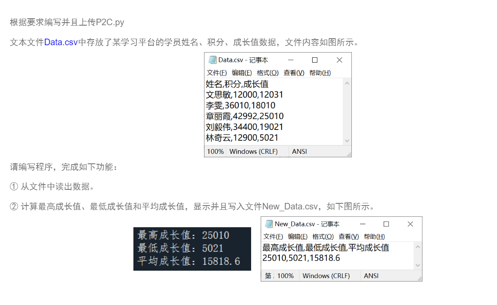

## Question1

编写一个职工奖金处理程序。要求如下：

① 输入不超过 10 个职工的工号、姓名和奖金，保存在文件 `JJ.txt`。文件中的数据格式：90813,张大海,1080.50元

② 从 `JJ.txt` 中读出数据，然后按奖金从低到高排序，保存在文件 `NewJJ.txt` 。

::: code-tabs

@tab open()

```python
with open("JJ.txt", "w", encoding="utf-8") as f:
    writer = csv.writer(f)
    for i in range(10):
        id = input("请输入第{}位职工的工号：".format(i + 1))
        name = input("请输入第{}位职工的姓名：".format(i + 1))
        bonus = input("请输入第{}位职工的奖金：".format(i + 1))
        writer.writerow([id, name, str(bonus) + "元"])
```

@tab 2

```python
lst = []
with open("JJ.txt", "r", encoding="utf-8") as f:
    # print(f.read().split(","))
    lines = f.readlines()
    for line in lines:
        target = line.strip().split(",")
        # print(target)
        lst.append(target)
```

@tab 3

```python
import csv

# 定义一个职工类，用来存储职工的工号、姓名和奖金
class Employee:
    def __init__(self, id, name, bonus):
        self.id = id
        self.name = name
        self.bonus = float(bonus.replace('元', ''))

# ① 输入不超过10个职工的工号、姓名和奖金，保存在文件JJ.txt
def input_employee():
    with open('JJ.txt', 'w', newline='', encoding='utf-8') as file:
        writer = csv.writer(file)
        for i in range(10):
            id = input("请输入第{}位职工的工号：".format(i+1))
            name = input("请输入第{}位职工的姓名：".format(i+1))
            bonus = input("请输入第{}位职工的奖金：".format(i+1))
            writer.writerow([id, name, bonus])

# ② 从JJ.txt中读出数据，然后按奖金从低到高排序，保存在文件NewJJ.txt
def sort_and_save():
    employees = []
    with open('JJ.txt', 'r', newline='', encoding='utf-8') as file:
        reader = csv.reader(file)
        for row in reader:
            employees.append(Employee(row[0], row[1], row[2]))

    # 按照奖金排序
    employees.sort(key=lambda e: e.bonus)

    with open('NewJJ.txt', 'w', newline='', encoding='utf-8') as file:
        writer = csv.writer(file)
        for e in employees:
            writer.writerow([e.id, e.name, '{}元'.format(e.bonus)])

# 执行输入和排序保存的函数
input_employee()
sort_and_save()
```

@tab 4

```python
import csv

# ① 输入不超过10个职工的工号、姓名和奖金，保存在文件JJ.txt
with open('JJ.txt', 'w', newline='', encoding='utf-8') as file:
    writer = csv.writer(file)
    for i in range(10):
        id = input("请输入第{}位职工的工号：".format(i+1))
        name = input("请输入第{}位职工的姓名：".format(i+1))
        bonus = input("请输入第{}位职工的奖金：".format(i+1))
        writer.writerow([id, name, bonus])

# ② 从JJ.txt中读出数据，然后按奖金从低到高排序，保存在文件NewJJ.txt
employees = []
with open('JJ.txt', 'r', newline='', encoding='utf-8') as file:
    reader = csv.reader(file)
    for row in reader:
        id, name, bonus = row
        bonus = float(bonus.replace('元', ''))
        employees.append((id, name, bonus))

# 按照奖金排序
employees.sort(key=lambda e: e[2])

with open('NewJJ.txt', 'w', newline='', encoding='utf-8') as file:
    writer = csv.writer(file)
    for e in employees:
        writer.writerow([e[0], e[1], '{}元'.format(e[2])])
```

@tab 不使用 csv

```python
# ① 输入不超过10个职工的工号、姓名和奖金，保存在文件JJ.txt
with open('JJ.txt', 'w', encoding='utf-8') as file:
    for i in range(10):
        id = input("请输入第{}位职工的工号：".format(i+1))
        name = input("请输入第{}位职工的姓名：".format(i+1))
        bonus = input("请输入第{}位职工的奖金：".format(i+1))
        file.write(f'{id},{name},{bonus}\n')

# ② 从JJ.txt中读出数据，然后按奖金从低到高排序，保存在文件NewJJ.txt
employees = []
with open('JJ.txt', 'r', encoding='utf-8') as file:
    lines = file.readlines()
    for line in lines:
        id, name, bonus = line.strip().split(',')
        bonus = float(bonus.replace('元', ''))
        employees.append((id, name, bonus))

# 按照奖金排序
employees.sort(key=lambda e: e[2])

with open('NewJJ.txt', 'w', encoding='utf-8') as file:
    for e in employees:
        file.write(f'{e[0]},{e[1]},{e[2]}元\n')
```


:::

## Question 2



文本文件 `Data.csv` 中存放了某学习平台的学员姓名、积分、成长值数据，文件内容如图所示：

```csv
姓名,积分,成长值
文思敏,12000,12031
李雯,36010,18010
章丽霞,42992,25010
刘毅伟,34400,19021
林奇云,12900,5021
```

请编写程序，完成如下功能:

1. 从文件中读出数据
2. 计算最高成长值、最低成长值和平均成长值，显示并且写入文件 `New_Data.csv`，如下图所示。

```python
import csv
import numpy as np

# 1. 从文件中读出数据
growth_values = []
with open('Data.csv', 'r', encoding='utf-8') as file:
    reader = csv.reader(file)
    next(reader)  # Skip the header
    for row in reader:
        growth_values.append(int(row[2]))  # Append the growth value

# 2. 计算最高成长值、最低成长值和平均成长值
max_growth = max(growth_values)
min_growth = min(growth_values)
avg_growth = np.mean(growth_values)  # Use numpy to calculate the mean

# 打印结果
print(f"最高成长值: {max_growth}")
print(f"最低成长值: {min_growth}")
print(f"平均成长值: {avg_growth}")

# 写入 New_Data.csv 文件
with open('New_Data.csv', 'w', newline='', encoding='utf-8') as file:
    writer = csv.writer(file)
    writer.writerow(['最高成长值', '最低成长值', '平均成长值'])
    writer.writerow([max_growth, min_growth, avg_growth])

```

## Question 3

从互联网上下载《红楼梦》的某一回组成文本文件 `hlm.txt`，然后设计一程序统计林黛玉和贾宝玉两个人名在文件中出现的次数。

```python
# 首先打开文件并读取内容
with open('hlm.txt', 'r', encoding='utf-8') as file:
    content = file.read()

# 然后使用 str.count() 函数统计林黛玉和贾宝玉的出现次数
daiyu_count = content.count('林黛玉')
baoyu_count = content.count('贾宝玉')

# 打印结果
print('林黛玉出现的次数:', daiyu_count)
print('贾宝玉出现的次数:', baoyu_count)
```

## 补充

在Python中，我们可以创建一个类来对列表进行操作。这个类可以包含各种方法，比如添加元素、删除元素、查找元素等等。下面是一个简单的示例：

```python
class ListOperator:
    def __init__(self):
        self.list = []

    def add_element(self, element):
        self.list.append(element)

    def remove_element(self, element):
        try:
            self.list.remove(element)
        except ValueError:
            print(f"元素{element}不存在于列表中")

    def find_element(self, element):
        if element in self.list:
            return True
        else:
            return False

    def display_list(self):
        return self.list
```

这个类`ListOperator`可以执行以下操作：

- `__init__`是一个特殊的方法，称为类的构造函数。当我们创建类的新对象时，这个方法会自动调用。在这个例子中，我们在构造函数中初始化了一个空列表。

- `add_element`方法接受一个元素作为参数，并将其添加到列表中。

- `remove_element`方法试图从列表中删除一个元素。如果元素不存在于列表中，它将打印一条消息。

- `find_element`方法检查一个元素是否在列表中。如果在列表中，它返回True，否则返回False。

- `display_list`方法返回当前列表的内容。

你可以像这样使用这个类：

```python
my_list = ListOperator()  # 创建一个新的 ListOperator 对象

my_list.add_element("苹果")  # 添加元素 "苹果"
my_list.add_element("香蕉")  # 添加元素 "香蕉"
my_list.add_element("橙子")  # 添加元素 "橙子"

print(my_list.display_list())  # 输出列表内容

my_list.remove_element("香蕉")  # 删除元素 "香蕉"
print(my_list.display_list())  # 输出列表内容

print(my_list.find_element("橙子"))  # 查找元素 "橙子"
```

在上述代码中，我们首先创建了一个新的`ListOperator`对象。然后我们使用`add_element`方法添加了一些元素。然后我们使用`display_list`方法来打印列表的内容。然后我们使用`remove_element`方法来删除一个元素。最后，我们使用`find_element`方法来检查一个元素是否在列表中。

::: details 公众号：AI悦创【二维码】


:::

::: info AI悦创·编程一对一

AI悦创·推出辅导班啦，包括「Python 语言辅导班、C++ 辅导班、java 辅导班、算法/数据结构辅导班、少儿编程、pygame 游戏开发、Web、Linux」，全部都是一对一教学：一对一辅导 + 一对一答疑 + 布置作业 + 项目实践等。当然，还有线下线上摄影课程、Photoshop、Premiere 一对一教学、QQ、微信在线，随时响应！微信：Jiabcdefh

C++ 信息奥赛题解，长期更新！长期招收一对一中小学信息奥赛集训，莆田、厦门地区有机会线下上门，其他地区线上。微信：Jiabcdefh

方法一：[QQ](http://wpa.qq.com/msgrd?v=3&uin=1432803776&site=qq&menu=yes)

方法二：微信：Jiabcdefh

:::


