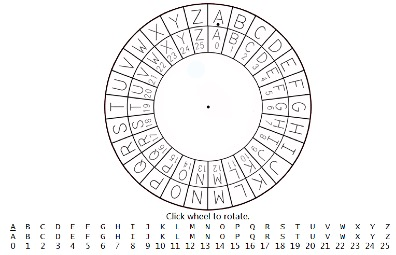
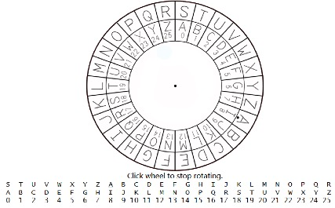

## 题目

**AP® Computer Science (P)**

> AP® 计算机科学（P）

**HW #12**

**Encryption/ Decryption  & NLP**  

> 加密/解密和自然语言处理（NLP）

**100 Points**

The purpose of this homework  is to “touch & feel” simple encryption and decryption algorithms and explore Python’s powerful capabilities of natural language processing（NLP）. 

> 这个作业的目的是让您“亲身体验”简单的加密和解密算法，并探索 Python 在自然语言处理（NLP）方面的强大功能。

::: center

**Virtual Cipher Wheel**

> 虚拟密码轮

:::

Two concentric wheels (shown below) are marked with sequential English letters and letter-numbers respectively. In the outer wheel, letter A is marked with a dotted pointer. Initially，two wheels lie in the same position as follows.

> 两个同心轮（如下所示）上标有顺序的英文字母和字母数字。在外部轮中，字母A标有一个点指针。最初，两个轮子处于以下相同的位置。




Rotate the outer wheel (keeping the inner wheel stationary) and (randomly) make it stop at somewhere such that the pointer happens to point to a corresponding letter-number slot in the inner wheel. The number pointed is called the private key to this algorithm. In the following diagram, we can see that the key is “8”.

> 旋转外轮（保持内轮不动），并（随机）使其停在某个位置，以便指针恰好指向内轮中的相应字母数字槽。所指的数字称为该算法的私钥。在下面的图中，我们可以看到密钥是“8”。




Let’s see a complete example.

> 让我们看一个完整的例子。

**Encryption** example: (In the diagram above, the “8” is the private key used to encode. )

> 加密示例：（在上面的图中，“8”是用于编码的私钥。）

Method: Each letter in the original text (corresponding to a slot in the outer wheel) is mapped to a corresponding letter-number slot in the inner wheel. So we have the following one-to-one mapping:

> 方法：原始文本中的每个字母（对应于外轮的一个槽）都映射到内轮中相应的字母数字槽。因此，我们有以下一对一映射：

- Original text:  `I love  you, honey!`
- Encrypted text: `q twdm gwc, pwvmg!`

**Decryption** example: (Using private key “8” to decode)

> 解密示例：（使用私钥“8”解码）

Method: This process is just the opposite. Each letter in the encrypted text (corresponding to a slot in the inner wheel) is mapped to a slot in the outer wheel. So we have:

> 方法：此过程与加密过程相反。加密文本中的每个字母（对应于内轮中的一个槽）都映射到外轮中的一个槽。所以我们有：

- Encrypted text: `q twdm gwc, pwvmg!`       
- Decrypted text:  `I love  you, honey !`

**Homework requirement:**

> 作业要求：

Write a Python program to simulate the above wheel encryption/decryption process. Specifically, your tasks are: 

> 编写一个Python程序来模拟上述的轮子加密/解密过程。具体而言，您的任务是：

(1) Defining a Python function using a randomly-chosen private key to encode a text (assuming that only English letters, spaces, and punctuation marks are used in the text!)

> (1) 定义一个 Python 函数，使用随机选择的私钥对文本进行编码（假设文本中仅使用英文字母、空格和标点符号！）

(2) Defining another Python function using the same private key to decode.

> (2) 定义另一个 Python 函数，使用相同的私钥进行解密。

(3) (**Optional**, **extra point!**) Defining a third function under such circumstances: If the private key is not given, the recipient would use **a brute force** **method** to decode the encoded text (assuming that the sender always sends grammatically-correct English in the original text). This brute force function tries each and every number (0-25) as a possible key to decode, and find out the most possible original text, which is usually the most meaningful, grammatically correct text. 

> (3) （可选，额外加分！）在这种情况下定义第三个函数：如果没有提供私钥，接收者将使用暴力方法解密编码的文本（假设发送者始终以原始文本发送语法正确的英文）。该暴力函数尝试使用每个数字（0-25）作为可能的密钥进行解码，并找出最可能的原始文本，通常是最有意义的、语法正确的文本。

**Hint**: Among all decrypted texts, you may import Python’s NLP(natural language processing toolkit) package named “**nltk”** to help analyze text syntax.

> 提示：在所有解密的文本中，您可以导入 Python 的 NLP（自然语言处理工具包）包，命名为“nltk”，以帮助分析文本语法。

**Note**: Although you are able to manually discard those seemingly unreasonable decrypted texts and sift out the right one after a number of tries, it is extremely tedious and time-consuming; therefore, human intervention is not a choice.

> 注意：尽管您可以手动丢弃那些看似不合理的解密文本，并在多次尝试后筛选出正确的文本，但这样做极其繁琐和耗时，因此人工干预不是一个选择。

---

## Answer

### 题目解析

这个题目要求实现一个基于字母轮盘的简单加密和解密算法。字母轮盘包括两个同心圆：外圈包含26个英文字母，内圈包含从 0 到 25 的数字。加密和解密过程依赖于一个称为私钥的数字，它决定了外圈字母与内圈数字的对应关系。

让我解释一下加密和解密过程，并举例说明。

**加密过程：**

假设我们的私钥是8，原始文本是 "I love you, honey!"。我们会根据私钥对原始文本中的每个字母进行移位。对于每个字母，我们将其向后移动8个位置。移位后的文本就是加密文本。

以下是加密过程的示例：

- 原始文本： "I love you, honey!"
- 加密文本： "q twdm gwc, pwvmg!"

**解密过程：**

解密过程与加密过程相反。我们使用相同的私钥（在这个例子中是8）对加密文本中的每个字母进行反向移位。对于每个字母，我们将其向前移动8个位置。移位后的文本就是解密文本。

以下是解密过程的示例：

- 加密文本： "q twdm gwc, pwvmg!"
- 解密文本： "I love you, honey!"

题目还要求实现一个暴力破解方法，该方法会尝试使用所有可能的私钥（0到25）对加密文本进行解密，并根据解密结果的语法和可读性来判断哪个结果是最可能的原始文本。在这个例子中，暴力破解方法会尝试使用所有的私钥对 "q twdm gwc, pwvmg!" 进行解密，并根据解密结果的语法和可读性判断 "I love you, honey!" 是最可能的原始文本。

### ASCII

文章链接：[https://bornforthis.cn/posts/29.html](https://bornforthis.cn/posts/29.html)

**获取字符或者说字母对应的 ASCII 值：**

```python
In [1]: char = "a"

In [2]: ord(char)
Out[2]: 97

In [3]: chr(97)
Out[3]: 'a'
```

### 判断是否是纯字母

```python
In [4]: s = "aisisisisisis"

In [5]: s.isalpha()
Out[5]: True

In [6]: s = "aisisisisisis "

In [7]: s.isalpha()
Out[7]: False

In [8]: s = "aisisisisisis1"

In [9]: s.isalpha()
Out[9]: False
```


### 编写加密🔐解密🔓

::: tabs

@tab 加密🔐

```python
import random


def generate_private_key():
    """
    description: 生成随机私钥的函数
    :return: int
    """
    return random.randint(0, 25)


def wheel_cipher_encrypt(text, private_key):
    """
    description: 使用私钥加密文本的函数
    :param text: 待加密的文本
    :param private_key: 加密私钥
    :return: str 加密内容
    """
    encrypted_text = ""
    for char in text:
        # 如果字符是字母，进行加密
        if char.isalpha():
            # 根据私钥计算新的字符
            shifted_char = chr(((ord(char.lower()) - ord('a') + private_key) % 26) + ord('a'))
            """
            ord(char.lower()) - ord('a') 目的是将字符的值标准化，使其在 0 到 25（共 26 个字母）的范围内。
            例如🌰: ord('a') - ord('a') = 0, ord('b') - ord('a') = 1
            """
            # 如果加密后的字符是小写，解密后的字符也应该是小写；否则，使用大写
            encrypted_text += shifted_char if char.islower() else shifted_char.upper()
            # if char.islower():
            #     encrypted_text += shifted_char
            # else:
            #     encrypted_text += shifted_char.upper()
        else:
            # 如果字符不是字母，保持原样
            encrypted_text += char
    return encrypted_text


# 示例用法
if __name__ == '__main__':
    private_key = generate_private_key()
    print("Private key:", private_key)
    original_text = "I love you, honey!"
    print("Original text:", original_text)
    encrypted_text = wheel_cipher_encrypt(original_text, private_key)
    print("Encrypted text:", encrypted_text)
```

## Why? 

### `chr(((ord(char.lower()) - ord('a') + private_key) % 26) + ord('a'))`

这个表达式用于计算一个字母在给定私钥（偏移量）的情况下加密后的字母。让我们一步一步地解释这个表达式：

1. `char.lower()`: 将字符转换为小写。这是因为我们在计算时需要统一字母的大小写，以便在字母表中找到正确的位置。请注意，在计算完成后，我们会根据原始字符的大小写来还原加密后的字符大小写。
2. `ord(char.lower())`: 将小写字符转换为其相应的 Unicode 码。`ord()` 函数返回一个表示 Unicode 字符的整数。这样我们可以对字母的 Unicode 值进行数学运算。
3. `ord(char.lower()) - ord('a')`: 将字符的 Unicode 值减去 `'a'` 的 Unicode 值。这样做的目的是将字符的值标准化，使其在 0 到 25（共 26 个字母）的范围内。例如，`ord('a') - ord('a') = 0`，`ord('b') - ord('a') = 1`，以此类推。
4. `(... + private_key) % 26`: 将私钥（偏移量）加到标准化的值上，然后对 26 取模。这样我们就可以在字母表中进行循环移位。例如，假设我们使用 3 作为私钥，那么 `'a'` 会变成 `'d'`，`'z'` 会变成 `'c'`。
5. `(... + ord('a'))`: 将结果加回 `ord('a')`，以便将标准化的值转换回原始的 Unicode 码。例如，如果在步骤 4 中计算出的值为 0，那么将其加回 `ord('a')` 后，结果就是 `ord('a')`；如果计算出的值为 1，结果就是 `ord('b')`。
6. `chr(...)`: 将结果的 Unicode 码转换回字符。这样我们就得到了加密后的字符。

通过这个表达式，我们可以实现字母表中字母的移位加密。这个表达式的核心思想是将字符转换为其在字母表中的位置（0 到 25），然后将其与私钥相加并对 26 取模，以实现循环移位。最后，将结果转换回字符形式。

### 详细解释 % 26

在我们的加密算法中，取模 `% 26` 是为了确保字符的移位操作在 26 个字母中循环。这是因为英文字母表只有 26 个字母（不区分大小写），我们需要确保加密后的字母仍然在这个范围内。这样做可以使加密后的字母依然是有效的英文字母。

取模 `% 26` 的作用是将计算结果限制在 0 到 25 之间。这意味着如果结果大于 25，它将回到字母表的开头，实现循环移位。例如，当我们将 25（即字母 'z'）与 3（偏移量）相加时，我们得到28。然后，我们对结果取模：`28 % 26 = 2`。这将字母 'z' 移位到字母 'c'（其索引为2）。

同样，当我们进行解密操作时，取模 `% 26` 也是必要的。这是因为我们需要确保在减去偏移量时，字母仍然在 0 到 25 的范围内。例如，当我们将字母 `'a'`（索引为 0）减去偏移量 3 时，我们得到 `-3`。然后，我们对结果取模：`(-3) % 26 = 23`。这将字母 `'a'` 向后移位 3 个位置，到字母 `'x'`（其索引为 23）。

总之，取模 `% 26` 的目的是确保加密和解密操作在26个字母的范围内进行循环，使加密后的字母仍然是有效的英文字母。


@tab 解密🔓

```python
# 使用私钥解密文本的函数
def wheel_cipher_decrypt(text, private_key):
    decrypted_text = ""
    for char in text:
        # 如果字符是字母，进行解密
        if char.isalpha():
            # 根据私钥计算原始字符
            shifted_char = chr(((ord(char.lower()) - ord('a') - private_key) % 26) + ord('a'))
            # 如果加密后的字符是小写，解密后的字符也应该是小写；否则，使用大写
            decrypted_text += shifted_char if char.islower() else shifted_char.upper()
        else:
            # 如果字符不是字母，保持原样
            decrypted_text += char
    return decrypted_text
```

:::

### 暴力破解

请注意，nltk 包用于文本分析，如果您还没有安装它并下载所需的数据文件，则需要安装它。

```python
pip install nltk
```

In Python, run:

```python
import nltk
nltk.download('punkt')
nltk.download('averaged_perceptron_tagger')
```

代码：

```python
import random
import string
from nltk.tokenize import word_tokenize
from nltk import pos_tag

# ---snip---

# 分析文本语法的函数
def analyze_syntax(text):
    # 使用 nltk 对文本进行分词
    tokenized_text = word_tokenize(text)
    # 使用 nltk 对分词后的文本进行词性标注
    tagged = pos_tag(tokenized_text)
    return tagged

# 通过暴力破解解密文本的函数
def brute_force_decrypt(text):
    possible_results = []

    # 尝试使用 0-25 之间的所有数字作为私钥进行解密
    for i in range(26):
        decrypted_text = wheel_cipher_decrypt(text, i)
        syntax_analysis = analyze_syntax(decrypted_text)
        possible_results.append((decrypted_text, syntax_analysis))

    # 在所有解密结果中选择最可能的一个
    # 你可以根据自己的标准选择最可能的结果
    # 例如，你可以统计名词、动词和形容词的数量，并选择数量最多的那个

    # 在此示例中，我们简单地将第一个结果作为最可能的结果返回
    return possible_results[0]

# 示例用法
private_key = generate_private_key()
print("Private key:", private_key)
original_text = "I love you, honey!"
print("Original text:", original_text)

encrypted_text = wheel_cipher_encrypt(original_text, private_key)
print("Encrypted text:", encrypted_text)

decrypted_text = wheel_cipher_decrypt(encrypted_text, private_key)
print("Decrypted text:", decrypted_text)

brute_force_result = brute_force_decrypt(encrypted_text)
print("Brute force result:", brute_force_result[0])

# 这个示例程序包含了前面讲解的所有函数，用于实现轮盘加密和解密过程。
# 示例用法部分展示了如何使用这些函数进行加密、解密和暴力破解。

# 首先，我们使用 generate_private_key 函数生成一个随机私钥。
# 接下来，我们使用 wheel_cipher_encrypt 函数对原始文本进行加密。
# 然后，我们使用 wheel_cipher_decrypt 函数对加密文本进行解密。
# 最后，我们使用 brute_force_decrypt 函数尝试暴力破解加密文本。

# 在这个示例中，我们没有实现一个复杂的文本分析算法来选择暴力破解结果。
# 实际上，您可以根据自己的需求和标准选择最可能的解密结果。例如，您可以
# 使用更先进的 NLP 技术或机器学习模型来评估解密结果的可读性和语法正确性。

# 这个程序的核心思路是，对于给定的原始文本，我们根据私钥将文本中的每个字母
# 替换为字母表中相应的字母。解密过程与加密过程相反，我们使用相同的私钥将加密
# 文本中的每个字母还原为原始字母。在暴力破解过程中，我们尝试使用所有可能的私钥
# 对加密文本进行解密，并根据文本分析的结果选择最可能的解密结果。
```


### Code

::: tabs

```python
import random
import string
from nltk.tokenize import word_tokenize
from nltk import pos_tag

def generate_private_key():
    return random.randint(0, 25)

def wheel_cipher_encrypt(text, private_key):
    encrypted_text = ""
    for char in text:
        if char.isalpha():
            shifted_char = chr(((ord(char.lower()) - ord('a') + private_key) % 26) + ord('a'))
            encrypted_text += shifted_char if char.islower() else shifted_char.upper()
        else:
            encrypted_text += char
    return encrypted_text

def wheel_cipher_decrypt(text, private_key):
    decrypted_text = ""
    for char in text:
        if char.isalpha():
            shifted_char = chr(((ord(char.lower()) - ord('a') - private_key) % 26) + ord('a'))
            decrypted_text += shifted_char if char.islower() else shifted_char.upper()
        else:
            decrypted_text += char
    return decrypted_text

def analyze_syntax(text):
    tokenized_text = word_tokenize(text)
    tagged = pos_tag(tokenized_text)
    return tagged

def brute_force_decrypt(text):
    possible_results = []

    for i in range(26):
        decrypted_text = wheel_cipher_decrypt(text, i)
        syntax_analysis = analyze_syntax(decrypted_text)
        possible_results.append((decrypted_text, syntax_analysis))

    # Choose the most probable result based on your own criteria
    # For example, you can count the number of nouns, verbs, and adjectives
    # and pick the one with the highest count.

    # In this example, I just return the first result as the most probable one.
    return possible_results[0]

# Example usage
private_key = generate_private_key()
print("Private key:", private_key)
original_text = "I love you, honey!"
print("Original text:", original_text)

encrypted_text = wheel_cipher_encrypt(original_text, private_key)
print("Encrypted text:", encrypted_text)

decrypted_text = wheel_cipher_decrypt(encrypted_text, private_key)
print("Decrypted text:", decrypted_text)

brute_force_result = brute_force_decrypt(encrypted_text)
print("Brute force result:", brute_force_result[0])
```


:::


::: details 公众号：AI悦创【二维码】


:::

::: info AI悦创·编程一对一

AI悦创·推出辅导班啦，包括「Python 语言辅导班、C++ 辅导班、java 辅导班、算法/数据结构辅导班、少儿编程、pygame 游戏开发、Web、Linux」，全部都是一对一教学：一对一辅导 + 一对一答疑 + 布置作业 + 项目实践等。当然，还有线下线上摄影课程、Photoshop、Premiere 一对一教学、QQ、微信在线，随时响应！微信：Jiabcdefh

C++ 信息奥赛题解，长期更新！长期招收一对一中小学信息奥赛集训，莆田、厦门地区有机会线下上门，其他地区线上。微信：Jiabcdefh

方法一：[QQ](http://wpa.qq.com/msgrd?v=3&uin=1432803776&site=qq&menu=yes)

方法二：微信：Jiabcdefh

:::


