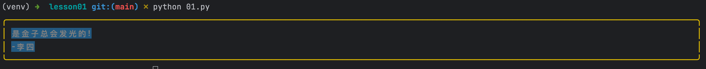

::: tabs

@tab 图1


@tab 图2


:::

编写程序输出自己的个性签名，必须加边框和背景色。见第一章课件拓展作业 a 例如: 是金子总会发光的! -李四

## 答案

### 方法一

为了实现这个要求，你可以使用 Python 和第三方库 `rich` 来实现。首先，确保您已经安装了 `rich` 库，如果没有，请通过运行以下命令安装：

```python
pip install rich
```

接下来，你可以使用以下代码来创建一个输出带边框和背景色的个性签名的程序：

::: code-tabs

@tab 精简

```python
from rich import print
from rich.panel import Panel
from rich.text import Text
from rich.console import Console

def create_signature(name, quote):
    signature_text = f"{quote}\n-{name}"
    text = Text(signature_text, style="bold white on blue")
    panel = Panel(text, border_style="bright_yellow", expand=True)
    return panel

if __name__ == "__main__":
    console = Console()
    quote = "是金子总会发光的!"
    name = "李四"
    signature_panel = create_signature(name, quote)
    console.print(signature_panel)
```

@tab 注释代码

```python
# 导入所需的 rich 库组件
from rich import print
from rich.panel import Panel
from rich.text import Text
from rich.console import Console

# 定义创建个性签名的函数
def create_signature(name, quote):
    # 使用引用和名字创建签名文本
    signature_text = f"{quote}\n-{name}"
    
    # 创建一个带有样式的 Text 对象，设置文本为粗体、白色，背景色为蓝色
    text = Text(signature_text, style="bold white on blue")
    
    # 创建一个 Panel 对象，将 Text 对象放入其中，设置边框样式为亮黄色
    panel = Panel(text, border_style="bright_yellow", expand=True)
    
    # 返回创建的 Panel 对象
    return panel

# 程序主入口
if __name__ == "__main__":
    # 创建一个 Console 对象，用于输出结果
    console = Console()
    
    # 设置引用和名字
    quote = "是金子总会发光的!"
    name = "李四"
    
    # 调用 create_signature 函数，传入名字和引用，得到带边框和背景色的签名
    signature_panel = create_signature(name, quote)
    
    # 使用 console.print 输出最终的个性签名
    console.print(signature_panel)
```

:::

在这段代码中，我们首先从 `rich` 库中导入了所需的类。然后，我们定义了一个名为 `create_signature` 的函数，该函数接收姓名和引用，并创建带有边框和背景色的个性签名。最后，我们在 `__main__` 中调用该函数，并使用 `console.print()` 输出结果。

将此代码保存到名为 `signature.py` 的文件中，然后运行此文件，你将看到输出的个性签名，类似于这样：



你可以根据需要更改姓名、引用以及边框和背景颜色。

::: tip 没有颜色，是要在命令行运行才可以？

在命令行环境下运行这个 Python 脚本才能看到颜色效果。这是因为 `rich` 库依赖于命令行/终端的颜色和格式支持来显示这些效果。

如果您在像 IDLE 或 Jupyter Notebook 这样的环境中运行此代码，那么颜色和格式可能不会正确显示。为了看到预期的输出效果，请在命令行或终端中运行此 Python 脚本。

在 Windows 上，您可以使用 `cmd.exe` 或 `PowerShell` 作为命令行。在 macOS 或 Linux 上，您可以使用 `Terminal` 应用程序。使用命令行或终端导航到包含 `signature.py` 的文件夹，然后运行 `python signature.py` 命令。这样您应该能看到带有边框和背景颜色的个性签名。

:::

---

### 方法二

可以使用 `colorama` 库。首先安装 `colorama` 库：

```python
pip install colorama
```

接下来，使用以下代码创建一个输出带有简单边框和颜色的个性签名的程序：

```python
from colorama import init, Fore, Back, Style

def create_signature(name, quote):
    init(autoreset=True)
    border_line = '-' * (len(quote) + len(name) + 3)
    signature = f"{Fore.YELLOW}{border_line}\n{Back.BLUE}{Style.BRIGHT}{quote}\n-{name}\n{Fore.YELLOW}{border_line}"
    return signature

if __name__ == "__main__":
    quote = "是金子总会发光的!"
    name = "李四"
    signature = create_signature(name, quote)
    print(signature)
```

在这个代码示例中，我们首先从 `colorama` 库中导入了所需的类。然后，我们在 `create_signature` 函数中使用这些类添加了颜色和背景。最后，在 `__main__` 中调用该函数并输出结果。

此代码将在控制台输出带有简单边框和颜色的个性签名，例如：

```python
-------------------
是金子总会发光的!
-李四
-------------------
```


::: details 公众号：AI悦创【二维码】


:::

::: info AI悦创·编程一对一

AI悦创·推出辅导班啦，包括「Python 语言辅导班、C++ 辅导班、java 辅导班、算法/数据结构辅导班、少儿编程、pygame 游戏开发、Web、Linux」，全部都是一对一教学：一对一辅导 + 一对一答疑 + 布置作业 + 项目实践等。当然，还有线下线上摄影课程、Photoshop、Premiere 一对一教学、QQ、微信在线，随时响应！微信：Jiabcdefh

C++ 信息奥赛题解，长期更新！长期招收一对一中小学信息奥赛集训，莆田、厦门地区有机会线下上门，其他地区线上。微信：Jiabcdefh

方法一：[QQ](http://wpa.qq.com/msgrd?v=3&uin=1432803776&site=qq&menu=yes)

方法二：微信：Jiabcdefh

:::


