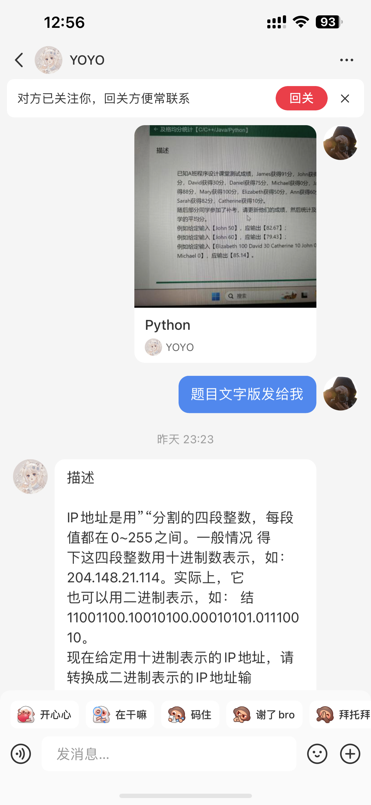
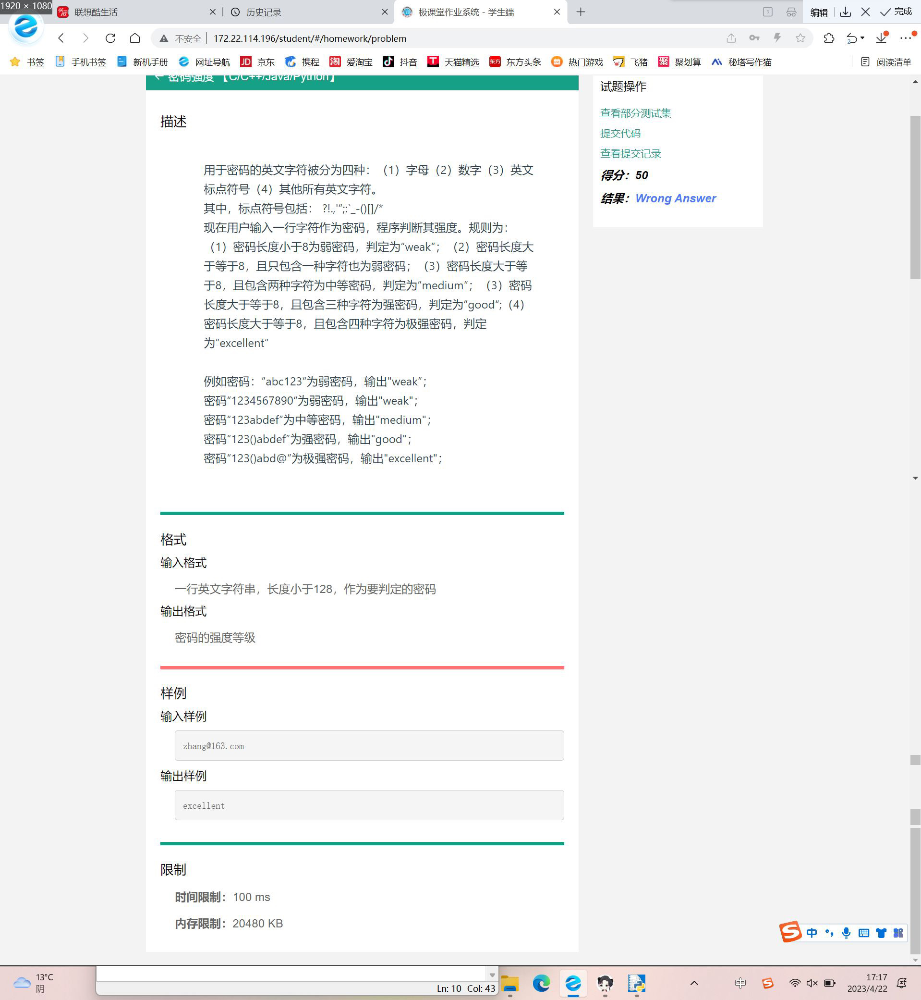

## Question 1

### 描述

IP 地址是用 `.` 分割的四段整数，每段值都在 0~255 之间。一般情况下，这四段整数用十进制数表示，如：`204.148.21.114`。

实际上，它也可以用二进制表示，如： `11001100.10010100.00010101.01110010`。

现在给定用十进制表示的 IP 地址，请转换成二进制表示的 IP 地址输出。每个二进制数都应占 8 位，不足的高位补零。

例如给定一个 IP 地址: `91.45.81.235` ，

对应的二进制 IP 地址为: `01011011.00101101.01010001.11101011` 。

### 格式

#### 输入格式

一个十进制 IP 地址值

#### 输出格式

对应的二进制 IP 地址值

### 示例

#### 示例 1

输入:

```python
91.45.81.235
```

输出:

```python
01011011.00101101.01010001.11101011
```

#### 示例 2

输入:

```
192.168.0.1
```

输出：

```python
11000000.10101000.00000000.00000001
```


### Answer 1

::: code-tabs

@tab 1

```python
def decimal_to_binary(ip_address):
    # 分割 IP 地址为四段
    ip_segments = ip_address.split('.')
    
    # 转换为二进制并补齐 8 位
    binary_segments = [format(int(segment), '08b') for segment in ip_segments]
    
    # 连接二进制段
    binary_ip_address = '.'.join(binary_segments)
    
    return binary_ip_address


# 测试
ip_address = '91.45.81.235'
print(decimal_to_binary(ip_address))
```

@tab 2

```python
def decimal_to_binary(ip_address):
    # 将十进制 IP 地址字符串用 '.' 分割成一个包含四个元素的列表
    ip_segments = ip_address.split('.')
    
    # 创建一个空列表，用于存储转换后的二进制 IP 段
    binary_segments = []
    
    # 遍历列表中的每个十进制 IP 段
    for segment in ip_segments:
        # 将十进制 IP 段转换为整数
        decimal_number = int(segment)
        
        # 将整数转换为二进制字符串，并用 '0' 填充高位至 8 位
        binary_string = format(decimal_number, '08b')
        
        # 将二进制字符串添加到 binary_segments 列表中
        binary_segments.append(binary_string)
    
    # 使用 '.' 连接 binary_segments 列表中的元素，得到二进制 IP 地址字符串
    binary_ip_address = '.'.join(binary_segments)
    
    # 返回二进制 IP 地址字符串
    return binary_ip_address


# 测试
ip_address = '91.45.81.235'
print(decimal_to_binary(ip_address))
```

:::


## Question 2

### 描述

IP 地址是用 `.` 分割的四段整数，每段值都在 0~255 之间。一般情况下这四段整数用十进制数表示，如：`204.148.21.114`。实际上，它也可以用二进制表示，如：`11001100.10010100.00010101.01110010`。

现在给定用二进制表示的 IP 地址，请转换成十进制表示的 IP 地址输出。

例如给定一个IP地址：`11000000.10101000.00000000.00000010`，

对应的十进制IP值为：`192.168.0.2`

### 格式

#### 输入格式

一行数据，由圆点分隔的四段二进制 IP 地址

#### 输出格式

对应的十进制 IP 地址

### 示例

#### 示例 1

输入:

```python
11000000.10101000.00000000.00000010
```

输出:

```python
192.168.0.2
```

### 示例 2

输入:

```python
01011011.00101101.01010001.11101011
```

输出:

```python
91.45.81.235
```

### Answer 2

```python
def binary_to_decimal(binary_ip_address):
    # 将二进制 IP 地址字符串用 '.' 分割成一个包含四个元素的列表
    binary_segments = binary_ip_address.split('.')
    
    # 创建一个空列表，用于存储转换后的十进制 IP 段
    decimal_segments = []
    
    # 遍历列表中的每个二进制 IP 段
    for segment in binary_segments:
        # 将二进制 IP 段转换为整数
        decimal_number = int(segment, 2)
        
        # 将整数添加到 decimal_segments 列表中
        decimal_segments.append(decimal_number)
    
    # 使用 '.' 连接 decimal_segments 列表中的元素，得到十进制 IP 地址字符串
    decimal_ip_address = '.'.join(map(str, decimal_segments))
    
    # 返回十进制 IP 地址字符串
    return decimal_ip_address


# 测试
binary_ip_address = '11000000.10101000.00000000.00000010'
print(binary_to_decimal(binary_ip_address))
```


## Question 3



### 描述

用于密码的英文字符被分为四种： 

（1）字母

（2）数字

（3）英文标点符号

（4）其他所有英文字符。

其中，标点符号包括：```?!,'";:`_-()[]/*``` 

现在用户输入一行字符作为密码，程序判断其强度。规则为：

1. 密码长度小于 8 为弱密码，判定为 “weak”；
2. 密码长度大于等于8，且只包含一种字符也为弱密码；
3. 密码长度大于等于8，且包含两种字符为中等密码，判定为“medium”；
4. 密码长度大于等于8，且包含三种字符为强密码，判定为“good”；
5. 密码长度大于等于8，且包含四种字符为极强密码，判定为"excellent“

例如:

- 密码：`abc123` 为弱密码，输出 "weak";

- 密码 `1234567890` 为弱密码，输出 "weak"；

- 密码 `123abdef` 为中等密码，输出 "medium"；

- 密码 `123()abdef` 为强密码，输出 "good"；

- 密码 `123()abd@` 为极强密码，输出 "excellent"
- 密码 `zhang@163.com` 为极强密码，输出 "excellent"

```python
def password_strength(password):
    if len(password) < 8:
        return "weak"

    has_digit = False
    has_alpha = False
    has_punctuation = False
    has_other = False

    punctuation_list = "?!,'\";:`_-()[]/*"

    for char in password:
        if char.isdigit():
            has_digit = True
        elif char.isalpha():
            has_alpha = True
        elif char in punctuation_list:
            has_punctuation = True
        else:
            has_other = True

    strength_counter = sum([has_digit, has_alpha, has_punctuation, has_other])

    if strength_counter == 1:
        return "weak"
    elif strength_counter == 2:
        return "medium"
    elif strength_counter == 3:
        return "good"
    else:
        return "excellent"


def main():
    user_password = input("请输入密码：")
    result = password_strength(user_password)
    print(f"密码强度：{result}")


if __name__ == "__main__":
    main()
```


::: details 公众号：AI悦创【二维码】


:::

::: info AI悦创·编程一对一

AI悦创·推出辅导班啦，包括「Python 语言辅导班、C++ 辅导班、java 辅导班、算法/数据结构辅导班、少儿编程、pygame 游戏开发、Web、Linux」，全部都是一对一教学：一对一辅导 + 一对一答疑 + 布置作业 + 项目实践等。当然，还有线下线上摄影课程、Photoshop、Premiere 一对一教学、QQ、微信在线，随时响应！微信：Jiabcdefh

C++ 信息奥赛题解，长期更新！长期招收一对一中小学信息奥赛集训，莆田、厦门地区有机会线下上门，其他地区线上。微信：Jiabcdefh

方法一：[QQ](http://wpa.qq.com/msgrd?v=3&uin=1432803776&site=qq&menu=yes)

方法二：微信：Jiabcdefh

:::


