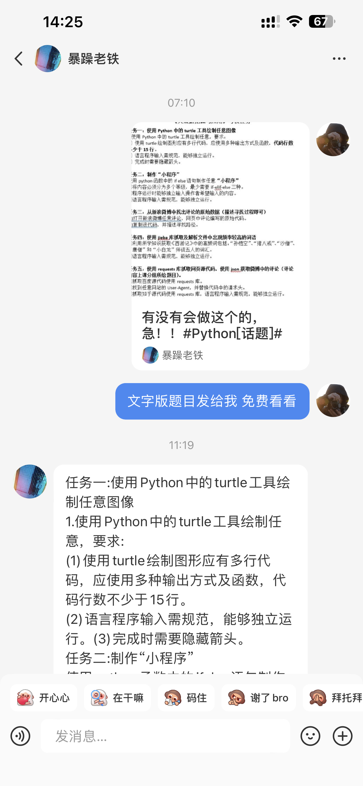
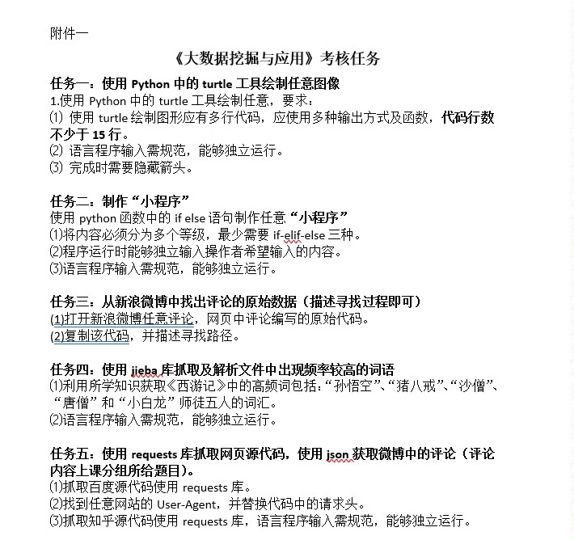
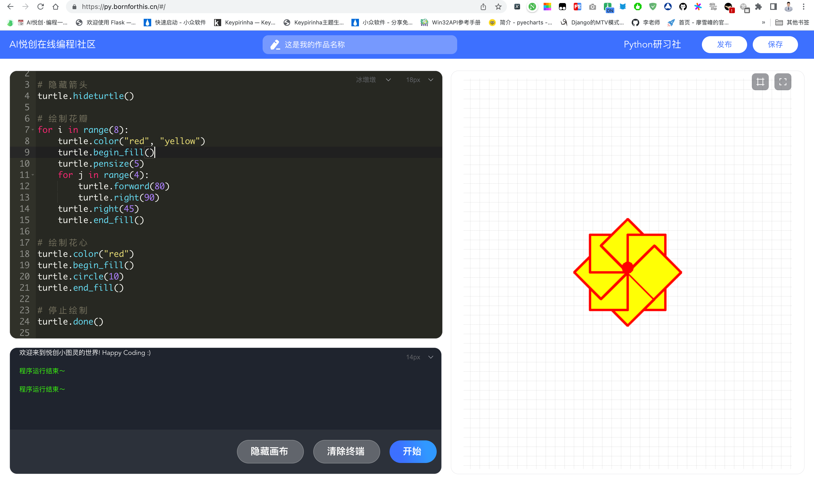

## 私信






## Question 1

任务一: 使用 Python 中的 turtle 工具绘制任意图像

1. 使用 Python 中的 turtle 工具绘制任意，要求:
    1. 使用 turtle 绘制图形应有多行代码，应使用多种输出方式及函数，代码行数不少于 15 行。
    2. 语言程序输入需规范，能够独立运行。
    3. 完成时需要隐藏箭头。

### Answer 1

```python
import turtle

# 隐藏箭头
turtle.hideturtle()

# 绘制花瓣
for i in range(8):
    turtle.color("red", "yellow")
    turtle.begin_fill()
    turtle.pensize(5)
    for j in range(4):
        turtle.forward(80)
        turtle.right(90)
    turtle.right(45)
    turtle.end_fill()

# 绘制花心
turtle.color("red")
turtle.begin_fill()
turtle.circle(10)
turtle.end_fill()

# 停止绘制
turtle.done()
```



可以在线运行：[https://py.bornforthis.cn/#/](https://py.bornforthis.cn/#/)

## Question 2

任务二: 制作“小程序”

使用 Python 函数中的 if else 语句制作任意“小程序”

1. 将内容必须分为多个等级，最少需要 if-elif-else 三种。
2. 程序运行时能够独立输入操作者希望输入的内容。
3. 语言程序输入需规范，能够独立运行。

### Answer 2

```python
try:
    user_age = int(input("请输入您的年龄："))

    if user_age < 0:
        print("输入错误，请输入一个有效的年龄。")
    elif user_age < 18:
        print("您属于：儿童")
    elif user_age < 60:
        print("您属于：成年人")
    else:
        print("您属于：老年人")

except ValueError:
    print("输入错误，请输入一个整数。")
```

## Question 3

任务三: 从新浪微博中找出评论的原始数据(描述寻找过程即可)

1. 打开新浪微博任意评论，网页中评论编写的原始代码。
2. 复制该代码，并描述寻找路径。

## Question 4

任务四: 使用 jieba 库抓取及解析文件中出现频率较高的词语

1. 利用所学知识获取《西游记》中的高频词包括:“孙悟空”、“猪八戒”“沙僧”“唐僧”和“小白龙”师徒五人的词汇。
2. 语言程序输入需规范，能够独立运行。

### Answer 4

为了完成这个任务，我们需要先安装 jieba 库。在你的 Python 环境中使用以下命令安装：

```python
pip install jieba
```

接下来，我们编写一个 Python 程序来读取《西游记》的文本文件，并使用 jieba 库对其进行分词处理，最后统计高频词的出现次数。

请确保《西游记》的文本文件（如：`xiyouji.txt`）与程序在同一目录下。

```python
import jieba
from collections import Counter

def count_characters(file_path, characters):
    with open(file_path, 'r', encoding='utf-8') as f:
        content = f.read()

    words = jieba.cut(content)
    counter = Counter(words)

    character_count = {}
    for character in characters:
        character_count[character] = counter[character]

    return character_count

def main():
    file_path = 'xiyouji.txt'
    characters = ['孙悟空', '猪八戒', '沙僧', '唐僧', '小白龙']
    character_count = count_characters(file_path, characters)

    print("《西游记》中师徒五人的词汇出现次数：")
    for character, count in character_count.items():
        print(f"{character}: {count}次")

if __name__ == '__main__':
    main()
```

这个程序实现了以下功能：

1. `count_characters` 函数读取给定文件路径的文本文件，使用 jieba 对其进行分词处理，并统计指定字符列表的出现次数。
2. `main` 函数中，我们指定《西游记》的文本文件路径以及需要统计的师徒五人角色名，然后调用 `count_characters` 函数获取结果并输出。

## Question 5

任务五: 使用 requests 库抓取网页源代码，使用 json 获取微博中的评论(评论内容上课分组所给题目)。

1. 抓取百度源代码使用 requests 库
2. 找到任意网站的 User-Agent，并替换代码中的请求头。
3. 抓取知乎源代码使用 requests 库，语言程序输入需规范，能够独立运行

### Answer 5

请确保已安装 requests 库：

```python
pip install requests
```

1. 使用 requests 库抓取百度源代码：

```python
import requests

url_baidu = 'https://www.baidu.com'
headers = {
    'User-Agent': 'Mozilla/5.0 (Windows NT 10.0; Win64; x64) AppleWebKit/537.36 (KHTML, like Gecko) Chrome/93.0.4577.63 Safari/537.36'
}

response_baidu = requests.get(url_baidu, headers=headers)

if response_baidu.status_code == 200:
    with open('baidu.html', 'w', encoding='utf-8') as f:
        f.write(response_baidu.text)
else:
    print('请求百度网页失败。')
```

2. 使用 requests 库抓取知乎源代码：

```python
url_zhihu = 'https://www.zhihu.com'
headers = {
    'User-Agent': 'Mozilla/5.0 (Windows NT 10.0; Win64; x64) AppleWebKit/537.36 (KHTML, like Gecko) Chrome/93.0.4577.63 Safari/537.36'
}

response_zhihu = requests.get(url_zhihu, headers=headers)

if response_zhihu.status_code == 200:
    with open('zhihu.html', 'w', encoding='utf-8') as f:
        f.write(response_zhihu.text)
else:
    print('请求知乎网页失败。')
```

请注意，由于微博需要登录才能获取评论内容，因此无法直接使用 requests 库抓取评论。同时，由于涉及到微博登录验证和反爬虫机制，我无法在这里提供抓取微博评论的示例。您可以查阅相关资料或使用第三方库（如 Selenium）尝试登录并抓取评论内容。

另外，您可以将上述两段代码整合到一个 Python 文件中，并确保已安装 requests 库，然后在本地 Python 环境运行。


::: details 公众号：AI悦创【二维码】


:::

::: info AI悦创·编程一对一

AI悦创·推出辅导班啦，包括「Python 语言辅导班、C++ 辅导班、java 辅导班、算法/数据结构辅导班、少儿编程、pygame 游戏开发、Web、Linux」，全部都是一对一教学：一对一辅导 + 一对一答疑 + 布置作业 + 项目实践等。当然，还有线下线上摄影课程、Photoshop、Premiere 一对一教学、QQ、微信在线，随时响应！微信：Jiabcdefh

C++ 信息奥赛题解，长期更新！长期招收一对一中小学信息奥赛集训，莆田、厦门地区有机会线下上门，其他地区线上。微信：Jiabcdefh

方法一：[QQ](http://wpa.qq.com/msgrd?v=3&uin=1432803776&site=qq&menu=yes)

方法二：微信：Jiabcdefh

:::


