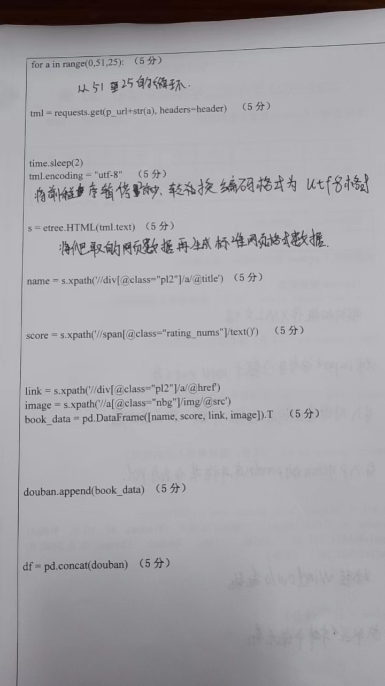

## Question 1

Python 数据采集

```python
from lxml import etree # (5 分，需解释导入库的作用)
import requests  # (5 分，需解释导入库的作用)
import time  # (5 分，需解释导入库的作用)
import pandas as pd  # (5 分，需解释导入库的作用)

p_url ='https://book.douban.com/top250?start='
header = {'User-Agent':'Mozilla/5.0 (Windows NT 10.0; WOW64) AppleWebKit/537.36 (KHTML，likeGecko)Chrome/46.0.2490.80 Safari/537.36'}  # (5 分)
douban = []  # (5 分)
for a in range(0, 51, 25): # (5分)
    tml = requests.get(p_url + str(a), headers=header)  # (5 分)
    time.sleep(2)
    tml.encoding ="utf-8"  # (5分)
    s = etree.HTML(tml.text)  # (5分)
    name = s.xpath('//div[@class="pl2"]/a/@title')  # (5分)
    score = s.xpath('//span[@class="rating nums"]/text()') # (5 分)
    link = s.xpath('//div[@class="p12"]/a/@href')
    image = s.xpath('//a@class="nbg"]/img/@src')
    book_data = pd.DataFrame([name, score, link, image]).T
    douban.append(book_data) # (5 分)
    df= pd.concat(douban) # (5 分)
```


### Answer 1

这段 Python 代码用于数据采集，其主要目的是从豆瓣书籍的 top250 列表中抓取数据。我们可以逐行解释代码的功能及其作用。

1. **导入库**
```python
from lxml import etree # (5 分，需解释导入库的作用)
```
`lxml` 库提供了一个名为 `etree` 的模块，用于解析 HTML 或 XML 内容，常用于 web 数据抓取。

得分解释：**5分**，因为这是一个常用于解析 HTML 和 XML 的强大库。

```python
import requests  # (5 分，需解释导入库的作用)
```
`requests` 库允许用户发送 HTTP 请求，并返回 HTTP 响应。这是 web 数据采集中的一个关键库。

得分解释：**5分**，用于发送 HTTP 请求和获取网页内容。

```python
import time  # (5 分，需解释导入库的作用)
```
`time` 库提供了多种与时间相关的功能。在本代码中，它被用来暂停程序执行。

得分解释：**5分**，用于在请求之间制造间隔，以避免因请求太快而被目标网站限制。

```python
import pandas as pd  # (5 分，需解释导入库的作用)
```
`pandas` 是一个数据分析库，提供了 DataFrame 结构来存储和操作表格数据。

得分解释：**5分**，用于数据整理和存储。

2. **设置请求头和基础URL**
```python
p_url ='https://book.douban.com/top250?start='
header = {'User-Agent':'Mozilla/5.0 (Windows NT 10.0; WOW64) AppleWebKit/537.36 (KHTML，likeGecko)Chrome/46.0.2490.80 Safari/537.36'}  # (5 分)
```
这部分设置了基础的 URL 和请求头信息。设置 User-Agent 可以帮助模拟浏览器访问，避免被网站拦截。

得分解释：**5分**，因为设置合适的请求头是成功抓取数据的关键。

3. **初始化数据存储列表**
```python
douban = []  # (5 分)
```

得分解释：**5分**，初始化一个空列表来存储抓取到的数据。

4. **循环抓取数据**
```python
for a in range(0, 51, 25): # (5分)
```
使用 `range` 函数来循环遍历豆瓣的页面，每次增加 25，因为每一页有 25 本书。

得分解释：**5分**，通过调整范围可以控制抓取的页数。

5. **发送请求并解析数据**

以下部分代码发送 HTTP 请求，暂停 2 秒以避免过于频繁的请求，然后解析返回的HTML内容，并从中提取书籍的名称、评分、链接和图片。

```python
time.sleep(2)
tml.encoding ="utf-8"  # (5分)
s = etree.HTML(tml.text)  # (5分)
name = s.xpath('//div[@class="pl2"]/a/@title')  # (5分)
score = s.xpath('//span[@class="rating nums"]/text()') # (5 分)
link = s.xpath('//div[@class="p12"]/a/@href')
image = s.xpath('//a@class="nbg"]/img/@src')
```

::: details 补充

让我们详细解释这部分：

1. **暂停程序**
```python
time.sleep(2)
```
这行代码使程序暂停 2 秒。这通常是为了避免在短时间内发送过多的请求到目标网站，因为这可能会导致被封禁。

2. **设置响应的编码**
```python
tml.encoding ="utf-8"  # (5分)
```
这行代码设置 HTTP 响应的字符编码为"utf-8"，确保我们可以正确解析返回的内容，特别是中文字符。

得分解释：**5分**，因为正确的字符编码是确保数据完整性的关键。

3. **解析HTML内容**
```python
s = etree.HTML(tml.text)  # (5分)
```
这里使用 `lxml` 库中的 `etree.HTML()` 函数来解析HTTP响应的文本内容（HTML 内容），并将其转化为一个可以进行 XPath 查询的对象。

得分解释：**5分**，因为这是从 HTML 内容中提取数据的关键步骤。

4. **使用 XPath 提取数据**
```python
name = s.xpath('//div[@class="pl2"]/a/@title')  # (5分)
```
这行代码使用 XPath 查询从 HTML 内容中提取书籍名称。

得分解释：**5分**，因为提取书名是数据采集的主要部分之一。

```python
score = s.xpath('//span[@class="rating nums"]/text()') # (5 分)
```
这行代码使用 XPath 查询从 HTML 内容中提取书籍的评分。

得分解释：**5分**，评分是书籍信息的重要组成部分。

```python
link = s.xpath('//div[@class="p12"]/a/@href')
```
这行代码应该从 HTML 内容中提取书籍的链接，但请注意，`//div[@class="p12"]/a/@href`可能不是正确的 XPath 路径，你可能需要检查 HTML 结构以确定正确的路径。

```python
image = s.xpath('//a@class="nbg"]/img/@src')
```
这行代码意在从 HTML 内容中提取书籍的封面图片链接，但 XPath 中的 `//a@class="nbg"` 是无效的。正确的语法应该是 `//a[@class="nbg"]` 。需要对此行代码进行修正。

总结：这部分代码的主要目的是从 HTML 页面中提取书籍的名称、评分、链接和图片，然后存储这些数据以供进一步处理。

:::

得分解释：每个与数据抓取和解析相关的代码行均得**5分**。

6. **整合和存储数据**
```python
    book_data = pd.DataFrame([name, score, link, image]).T
    douban.append(book_data) # (5 分)
    df= pd.concat(douban) # (5 分)
```
这部分代码首先创建了一个新的DataFrame来存储当前页面上抓取到的数据，并将其添加到`douban`列表中。之后使用`pd.concat()`将所有页面的数据合并为一个DataFrame。

得分解释：每行得**5分**，因为这部分代码负责整理和存储数据。

总结：这段代码为用户提供了一个简单的方法来从豆瓣网站抓取 top250 书籍的数据，并使用 pandas 库来整理和存储这些数据。


## Question 2

Python文本分析：

```python
import jieba  # (5 分，需解释导入库的作用)

with open('stopwords.txt', 'r+', encoding = 'utf-8')as fp:
    stopwords = fp.read().split('\n')  # (5分)
word_list = [] 
text ='商务部 4 月 23 日发布的数据显示，一季度，全国农产品网络零售额达936.8 亿元，增长 31.0%;电商直播超过 400 万场。电商给农民带来了新的机遇。'
list = jieba.cut(text)  # (5 分)

for seg in list:
    if seg not in stopwords:
        word_list.append(seg)  # (10 分)
```

::: tip

告诉我是哪个学校的，我免费给你在学校考试的给你答案。我想知道下面题目的真实学校，原因：好奇。

:::

::: details 真题


:::

### Answer 2

该 Python 代码进行了基本的中文文本处理。我们一步步地解析上述代码：

1. **导入库**
```python
import jieba  # (5 分，需解释导入库的作用)
```
`jieba` 是一个中文分词库。在中文文本处理中，由于中文没有明显的词与词之间的分隔（例如空格），因此需要专门的算法来进行分词。`jieba`库提供了这样的功能。

得分解释：**5分**，因为 `jieba` 是一个在中文分词中非常重要的库。

2. **读取停用词**
```python
with open('stopwords.txt', 'r+', encoding = 'utf-8')as fp:
    stopwords = fp.read().split('\n')  # (5分)
```
这部分代码读取一个名为 `stopwords.txt` 的文件，该文件中包含了许多不想在后续分析中包括的“停用词”（例如“的”、“和”等常用词）。文件中的每一行包含一个停用词，所以使用 `.split('\n')` 可以得到一个包含所有停用词的列表。

得分解释：**5分**，因为读取并处理停用词是文本处理中的一个重要步骤。

3. **分词**
```python
text ='商务部 4 月 23 日发布的数据显示，一季度，全国农产品网络零售额达936.8 亿元，增长 31.0%;电商直播超过 400 万场。电商给农民带来了新的机遇。'
list = jieba.cut(text)  # (5 分)
```
这里使用 `jieba.cut()` 方法对给定的 `text` 进行分词，返回一个生成器，其中包含文本中的词。

得分解释：**5分**，因为这是实际进行文本分词的步骤。

4. **去除停用词**
```python
for seg in list:
    if seg not in stopwords:
        word_list.append(seg)  # (10 分)
```
对于 `jieba.cut()` 的输出中的每一个词，如果该词不在停用词列表 `stopwords` 中，则将其添加到 `word_list` 列表中。

得分解释：**10分**，因为这个步骤确保了分析中只包含有意义的词，而不是那些常见的但没有太大意义的词。

总结：该代码片段对中文文本进行了初步的处理，主要是分词和去除停用词，为进一步的文本分析做了准备。


::: details 真题





:::


::: details 公众号：AI悦创【二维码】


:::

::: info AI悦创·编程一对一

AI悦创·推出辅导班啦，包括「Python 语言辅导班、C++ 辅导班、java 辅导班、算法/数据结构辅导班、少儿编程、pygame 游戏开发、Web、Linux」，全部都是一对一教学：一对一辅导 + 一对一答疑 + 布置作业 + 项目实践等。当然，还有线下线上摄影课程、Photoshop、Premiere 一对一教学、QQ、微信在线，随时响应！微信：Jiabcdefh

C++ 信息奥赛题解，长期更新！长期招收一对一中小学信息奥赛集训，莆田、厦门地区有机会线下上门，其他地区线上。微信：Jiabcdefh

方法一：[QQ](http://wpa.qq.com/msgrd?v=3&uin=1432803776&site=qq&menu=yes)

方法二：微信：Jiabcdefh

:::


