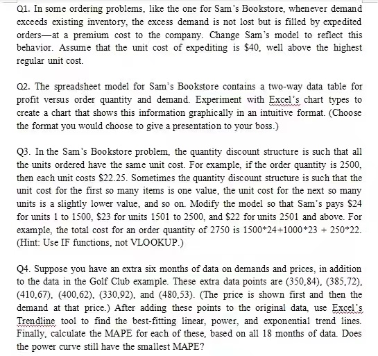

## Question 1

1. **定义变量和参数**

首先，你需要定义一些变量和参数：

$( D ) $= 需求量

$( I )$ = 现有库存量

$( E )$ = 超出库存的需求量，也即需要通过加急订单满足的数量

$( C_e )$ = 单位加急费用（在这里，( $C_e = $40$)）

2. **计算超出库存的需求量**

这一步，你需要计算需求超出库存的部分：

如果 $( D > I )$ ，那么 $( E = D - I )$ 否则  $( E = 0 )$

3. **计算加急订单的成本**

这一步，你需要计算因为超出库存而产生的加急订单成本：

$( Cost_{expedite} = E \times C_e )$

4. **更新目标函数**

原来的目标函数可能是最小化订购成本、持有成本等的总和。现在，你需要加入加急订单的成本：

新的目标函数 = 原目标函数 + $( Cost_{expedite} )$

5. **求解**

使用你的优化工具或方法来求解更新后的模型。

::: details 公众号：AI悦创【二维码】

:::

::: info AI悦创·编程一对一

AI悦创·推出辅导班啦，包括「Python 语言辅导班、C++ 辅导班、java 辅导班、算法/数据结构辅导班、少儿编程、pygame 游戏开发、Web、Linux」，全部都是一对一教学：一对一辅导 + 一对一答疑 + 布置作业 + 项目实践等。当然，还有线下线上摄影课程、Photoshop、Premiere 一对一教学、QQ、微信在线，随时响应！微信：Jiabcdefh

C++ 信息奥赛题解，长期更新！长期招收一对一中小学信息奥赛集训，莆田、厦门地区有机会线下上门，其他地区线上。微信：Jiabcdefh

方法一：[QQ](http://wpa.qq.com/msgrd?v=3&uin=1432803776&site=qq&menu=yes)

方法二：微信：Jiabcdefh

:::

