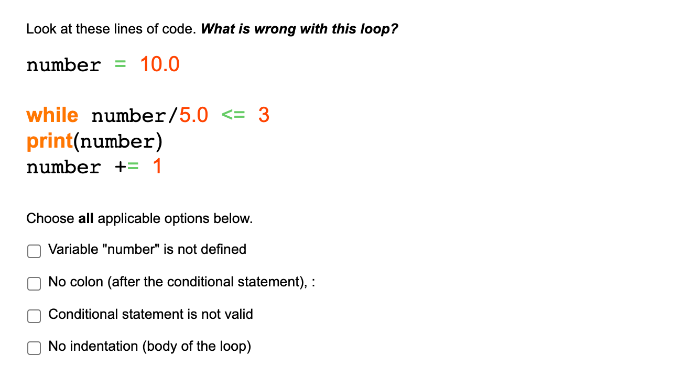

## [Check your learning: topics so far (quiz)](https://www.ole.bris.ac.uk/webapps/blackboard/content/launchAssessment.jsp?course_id=_249924_1&content_id=_6562408_1&mode=view)

1. In Python, what is a **string** and how is it defined? Choose from the options below.

A. A collection of characters within quotation marks

B. A decimal number

C. An ordered collection of other objects between square brackets

D. A whole number

E. A collection of key:value pairs between curly brackets

2. Look at these lines of code:

```python
b = 3

a = b*2

b = 4
```

What would "a" be evaluate to?

3. Look at this expression:

```python
list2 = [3, 10]

list2.append(23)
```

What will "list2" look like after these lines have been executed?

```python
[23, 3, 10]
[3, 10]
[3, 10, [23]]
[3, 10, 23]
```

4. Look at the different statements below and determine which are correct (Answer: True or False).

- [ ] An element within a list can be updated after it has been created
- [ ] A value within a dictionary can be updated after it has been created
- [ ] A character within a string can be updated after it has been created

 A.False

B. True (a list can be updated)

C. True

5. Look at these lines of code:

```python
a = 2.0 + 2.0*5.0 - 6.0

b = a/2.0
```

What would the variable "b" evaluate to?

## [Check your learning: While loops (quiz)](https://www.ole.bris.ac.uk/webapps/blackboard/content/launchAssessment.jsp?course_id=_249924_1&content_id=_6562410_1&mode=view)

1. What is a **while loop**? Choose from the options below.

A. A whole number

B. **A collection of key:value pairs between curly brackets**

C. A loop which continues to run as long as a condition is met.

D.  A loop which iterates over a sequence (e.g. a list or a range of numbers)

E. A statement which tests a condition (or a set of conditions) to decide which lines of code to execute

2. Look at these lines of code. ***What is wrong with this loop?***

```python
number = 10.0

while number/5.0 <= 3
print(number)
number += 1
```



Choose **all** applicable options below.

A.  Variable "number" is not defined

B. No colon (after the conditional statement), :

C. Conditional statement is not valid

D. No indentation (body of the loop)

3. Look at the lines of code below.

```python
number = 30
 
while number >= 30:
    print(number)
    number += 1
```

***Will this result in an infinite loop?***

A. True

B. False

4. Look at these lines of code below.

```python
b = 5
while b < 11:
    print(b)
    b += 2

How many times would this loop run?
```

5. **More challenging question**

**More challenging question**

```python
list1 = ["a", "b", "c"]
# Testing the length of the list
while len(list1) > 0:
    print(list1)
    # Cutting off the last element in each loop
    list1 = list1[0:-1]
```

*Tips:*

- *The len() counts how many entries there are within the list. len(['a','b','c']) would be 3*
- Using the slice list[0:-1] selects all but the last element of a list
- *An empty list [ ] has a length of 0*

A.  Loops 3 times and prints out:

```python
['a', 'b', 'c']
['a', 'b']
['a']
```

B. Loops 3 times and prints out:

```python
['a', 'b', 'c']
['a', 'b', 'c']
['a', 'b', 'c']
```

C. Loops 4 times and prints out:

```python
['a', 'b', 'c']
['a', 'b']
['a']
[]
```

D. Loops infinite times and prints out:

```python
['a', 'b', 'c']
['a', 'b', 'c']
['a', 'b', 'c']

[...]
```

[Asynchronous Activity 2: For versus While](http://www.differencebetween.net/technology/difference-between-for-and-while-loop/)

[Asynchronous Activity 2: For versus While](https://www.ole.bris.ac.uk/webapps/blackboard/content/listContent.jsp?course_id=_249924_1&content_id=_7325728_1#)

## [Check your learning: loops and branches (quiz)](https://www.ole.bris.ac.uk/webapps/blackboard/content/launchAssessment.jsp?course_id=_249924_1&content_id=_6562411_1&mode=view)

1. What is an **if statement**? Choose from the options below.

A. A statement which tests a condition (or a set of conditions) to decide which lines of code to execute

B. A decimal number

C. A loop which iterates over a sequence (e.g. a list or a range of numbers)

D. A collection of characters within quotation marks

E. A loop which continues to run as long as a condition is met.

2. What is a **for loop**? Choose from the options below.

A. A whole number

B. A loop which continues to run as long as a condition is met.

C. A statement which tests a condition (or a set of conditions) to decide which lines of code to execute

D. A collection of key:value pairs between curly brackets

E. A loop which iterates over a sequence (e.g. a list or a range of numbers)

3. Look at the lines of code below.

```python
for number in range(2, 6):
    print("Executing loop")
```

***How many times will this for loop run?***

4. Look at these lines of code below.

```python
for range(1,5):
    print(item)
```

***What is wrong with this for loop?***

A. Scaffolding for a `for` loop requires the word `in` as well

B. `item` is not defined

C. For loops should include a conditional statement

D. Too much indentation

E. The colon symbol : is not needed

5. Look at these lines of code below.

```python
count = 100
if count/10 = 10
    print(count)
```

***What's wrong with this if statement?***

A. `count` variable should be a float rather than an integer

B. Too much indentation

C. The conditional statement is incorrect

D. This will result in an infinite loop

E. Missing a colon, :

6. Look at these lines of code .

```python
number = 12
if number/2 == 4:
    print("if condition is True")
elif number/3 == 4:
    print("elif condition (1) is True")
else:
    print("else block executed")
```

***What will be printed (if anything)?***

- [ ] if condition is True
- [ ] elif condition (1) is True
- [ ] else block executed
- [ ] Nothing

7. **More challenging**

Look at these lines of code below.

```python
nested_list = [[1],[2,2],[3,3,3]]
 
for sublist in nested_list:
    while len(sublist) < 4:
        copy_first_entry = sublist[0]
        sublist.append(copy_first_entry)
 
print(nested_list)
```

***What will `nested_list` look like after this code is completed?***

*Hints:*

- Consider what is being passed to the while loop and what condition the while loop is checking
- *What is the while loop doing?*

A. `[[1, 1], [2, 2, 2], [3, 3, 3, 3]]`

B. `[]`

C. `[[1], [2, 2], [3, 3, 3]]`

D. `[[1, 1, 1, 1], [2, 2, 2, 2], [3, 3, 3, 3]]`

## [Check your learning - the numpy module](https://www.ole.bris.ac.uk/webapps/blackboard/content/launchAssessment.jsp?course_id=_249924_1&content_id=_7395229_1&mode=view)

1. In Python, what is a **numpy array** and how is it defined? Choose from the options below.

A. An ordered collection of other objects, all of the same type. Provided by the numpy external library.

B. An ordered collection of other objects between square brackets. A built-in Python object.

C. A whole number

D. A collection of key:value pairs between curly brackets

2. Look at the different statements below and determine which are correct (Answer: True/False).

A. All values within a given numpy array must be the same type

B. Numpy arrays have shape and dimensionality

C. Elements of a numpy array cannot be updated once they have been created

True

False

3. How would you access the **last** element of an array e.g. `array1` defined below:

```python
import numpy as np

array1 = np.array([103, 54, 91, 23])
```

```
array1[-1]
np.array1[-1]
array1[4]
array1[3]
```

4. Which of these functions can be used to calculate the **average (mean)** for a numpy array (for example `array1` from Question 3)? You can assume numpy has been imported using the import statement below.

```python
import numpy as np

array1 = np.array([103, 54, 91, 23])
```

```
np.mean(array1)
mean(array1)
average(array1)
np.array(array1)
```

5. Will the statement below create a valid numpy array (array2)?

```python
import numpy as np

array2 = np.array(["dog", 5, "cat", 9], dtype=int)
```

**Answer True/False for this.**

True

 False

6. Look at these arrays created below (array3, array4 and array5)

***Note:*** when printed, numpy arrays often displayed without the commas - this is a stylistic choice and does not change how numpy arrays are defined.

```python
import numpy as np

array3 = np.array([1, 2, 3, 4])
array4 = np.ones(4)

array5 = array3 + array4
print(array5)
```

**What will the output (array5) look like when printed?**

```python
[2 3 4 5]
[5 6 7 8]
[1 2 3 4]
[1 1 1 1]
```

## [Check your learning - multi-dimensional arrays](https://www.ole.bris.ac.uk/webapps/blackboard/content/launchAssessment.jsp?course_id=_249924_1&content_id=_6562415_1&mode=view)

1. A numpy ndarray is an *immutable* object which cannot be updated (in-place) once it has been created.

A. True

B. False

2. How would you select a **range** from the second element to the end of the array, for *array1*?

```python
array1 = np.array([1., 2., -1., 1., 0., 1.])
```

A. `array1[0:-1]`

B. `array1[1:]`

C. `array1[3:]`

D. `array1[1:-1]`

3. For *array2* defined below, how many **dimensions** does this numpy array have?

```python
import numpy as np
shape = (2, 3, 4)
array2 = np.ones(shape)
```

4. For *array3* defined below, what would the value of *element* be?

```python
array3 = np.array([[1, 2, 3, 4],
                   [5, 6, 7, 8]])

element = array3[0, 0]
```

A. 5

B. 8

C. [1, 2, 3, 4]

D. 1

5. For *array4*, created below, evaluate the following statements (Answer: True/False)

```python
from numpy import random
rng = random.default_rng()
shape = (3, 3)
array4 = rng.random(shape)
```

- [ ] array4[0]To select the first column we would use
- [ ] array4[0],To select the first row we would use
- [ ] array4[0, 0],To select the first element (row and column) we would use

True

False

6. Look at *array5* created below

```python
array5 = np.array([[10, 8, 6], 
                   [12, 11, 10], 
                   [13, 10, 7]])
```

If we apply a boolean condition to filter this array to find all elements equal to 10 to create a new array called *filtered_array*, which of these properties for this array are correct?

```python
filtered_array = array5[array5 == 10]
```

Shape would be 3 x 2 x 3

This would find 3 elements

This is not a valid statement


::: details 公众号：AI悦创【二维码】


:::

::: info AI悦创·编程一对一

AI悦创·推出辅导班啦，包括「Python 语言辅导班、C++ 辅导班、java 辅导班、算法/数据结构辅导班、少儿编程、pygame 游戏开发、Web、Linux」，全部都是一对一教学：一对一辅导 + 一对一答疑 + 布置作业 + 项目实践等。当然，还有线下线上摄影课程、Photoshop、Premiere 一对一教学、QQ、微信在线，随时响应！微信：Jiabcdefh

C++ 信息奥赛题解，长期更新！长期招收一对一中小学信息奥赛集训，莆田、厦门地区有机会线下上门，其他地区线上。微信：Jiabcdefh

方法一：[QQ](http://wpa.qq.com/msgrd?v=3&uin=1432803776&site=qq&menu=yes)

方法二：微信：Jiabcdefh

:::


