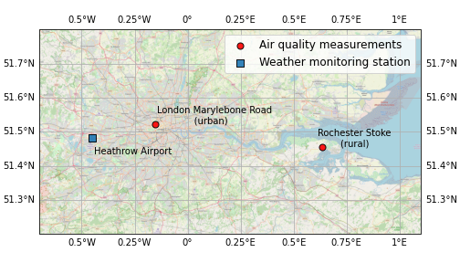

For your fourth and final programming project for Introductory Scientific Computing you will write code to either create a model or analyse scientific data, presenting your results as a report using a modified report structure as detailed below. There are two options provided of which you should **only complete and submit one.**

> 你的入门科学计算的第四个也是最后一个编程项目，你将编写代码来创建一个模型或分析科学数据，并使用下面详细说明的修改后的报告结构呈现你的结果。提供了两个选项，你应该只完成并提交其中一个。

This will involve creating multiple documents: one (or more) containing your code and one con- taining your report. This will be worth 30% of your total unit mark with 15% attributed to your code and 15% to the associated report. The deadline for this work is **Wednesday, 3rd May (10am).**

> 这将涉及创建多个文档：一个（或多个）包含您的代码，另一个包含您的报告。这项任务将占您本单元总分的30％，其中15％归属于您的代码，15％归属于相关报告。此工作的截止日期是**5月3日（上午10点）星期三。**

To use Noteable to complete the coding part of your assessment, you should create a new Jupyter Notebook. If applicable to the option chosen you should also unzip and upload any associated data files (detailed within sections 1 and 2). After completion, your Jupyter Notebook should be downloaded from Noteable and uploaded to the submission point. For a short demo, see the video available on the Blackboard “Access Python” page entitled “Create new notebooks and download files”. You can use an alternative tool, if you prefer, as long as your file contains Python code only and can be run using a Python interpreter (“`.ipynb`” or “`.py`” file or files). Please ensure that your code is submitted in one of these two formats (“`.ipynb`” or “.py” file or files) otherwise the submission will not be accepted.

> 使用Noteable完成编码评估的部分，您应该创建一个新的Jupyter Notebook。如果适用于所选选项，则还应该解压缩并上传任何相关的数据文件（在第1和第2节中详细说明）。完成后，应从Noteable下载您的Jupyter Notebook，并将其上传到提交点。有关简短演示，请参见Blackboard“Access Python”页面上名为“Create new notebooks and download files”的视频。如果您愿意，也可以使用其他工具，只要您的文件仅包含Python代码并且可以使用Python解释器运行（“.ipynb”或“.py”文件或文件）。请确保您的代码以这两种格式之一（“.ipynb”或“.py”文件或文件）提交，否则提交将不被接受。

The two options for this assessment are as follows:

> 这项评估有两个选项，如下所示：

1. **Traffic model** - build a basic traffic model incorporating both cars and buses and investigate trends in average speed and passenger throughout.

> 交通模型 - 建立一个包含汽车和公交车的基本交通模型，并调查平均速度和乘客流量的趋势。

2. **Urban air quality** - compare air quality measurements inside and outside the city of London, investigating trends and considering correlation with meteorological data.

> 交通模型 - 建立一个包含汽车和公交车的基本交通模型，并调查平均速度和乘客流量的趋势。

For the code document produced, this should include all the Python code used to perform the coding task including plots (either within the Jupyter notebook or referenced as external files and also submitted). The code document should be self-contained, and it should be made clear which parts of the analysis are being performed at each stage. The code should be well commented and additional details can also be added using separate markdown cells (available within Jupyter notebooks). The code document should be able to run as a whole (from top to bottom).

> 为了生成代码文档，其中应包括用于执行编码任务的所有Python代码，包括图表（可以在Jupyter笔记本内部或作为外部文件引用，并一并提交）。代码文档应是自包含的，并且应明确指出在每个阶段执行了哪些分析部分。代码应进行良好的注释，也可以使用单独的Markdown单元格（在Jupyter笔记本内部可用）添加附加细节。代码文档应该能够整体运行（从顶部到底部）。

For your report, you should write this using a word processor of your choice and submit this alongside your code as a Word document (.doc or .docx) or as a PDF document (.pdf). The report should include background details of any scientific context, your approach and hypotheses as well as a description of your analysis, discussion and conclusions. You should also include an abstract to summarise your key results and include details of any references used. See Section 3 for these details laid out as bullet points. The report itself does not need to include explicit details of the code produced, just your overall approach and any relevant outputs but should be related to the code document submitted. The separate code submission document can be referred to if needed.

> 为了您的报告，您应该使用自己选择的文字处理软件撰写，并将其作为Word文档(.doc或.docx)或PDF文档(.pdf)与代码一起提交。报告应包括任何科学背景的背景细节、您的方法和假设以及您的分析、讨论和结论的描述。您还应该包括一个摘要来总结您的关键结果，并包括任何引用的详细信息。请参见第3节，其中这些细节列出为项目符号。报告本身不需要包括代码的明确细节，只需要涉及到您的总体方法和任何相关输出，但应与提交的代码文档相关。如有需要，可以参考单独的代码提交文档。

When completed, use the “Programming project 4” Blackboard submission point to upload all documents related to the code and report (on the “Assessment, submission and feedback” course content area for the unit).

> 完成后，请使用“编程项目 4” Blackboard 提交点上传所有与代码和报告相关的文档（在本单元的“评估、提交和反馈”课程内容区域）。

## 1. Option: Traffic model

> 选项：交通模型

For this option, we would like you to build a basic model to simulate traffic flow. You will be provided with an outline for the conditions for this model and asked your model to examine relevant properties. You will not be expected to read any external data to complete this option. The outline is comprised of two parts detailed below in sections 1.1 and 1.2.

> 对于这个选项，我们希望您构建一个基本模型来模拟交通流量。您将获得该模型的条件概述，并被要求让您的模型检查相关属性。您不需要阅读任何外部数据来完成此选项。该概述由以下两个部分组成，分别在1.1和1.2节中详细说明。

### 1.1 Average speed

> 1.1 平均速度

Traffic models are an area of active research used to make decisions around planning (for example see this [traffic model research introduction page](https://liu.se/en/research/traffic-modelling-and-simulation) from Link ̈oping University in Sweden). They are used to consider implications for air quality and pollution, often related to throughput and congestion. To quantify levels of congestion we can consider how the numbers of vehicles on the road impacts the average speed.

> 交通模型是一个活跃研究领域，用于制定规划决策（例如，可以查看瑞典林雪平大学的这个[交通模型研究介绍页面](https://liu.se/en/research/traffic-modelling-and-simulation)）。它们被用于考虑空气质量和污染的影响，通常与吞吐量和拥堵有关。为了量化拥堵程度，我们可以考虑车辆数量对平均速度的影响。

## 2. Option: Urban Air Quality

> 2个选项：城市空气质量

For this option we would like you to consider the impact that location and weather properties can have on air quality. Levels of air quality can be determined through measurements of various gases and particles present within the air at a given location. This analysis focuses on the measurements of extremely small airborne particles, known as particulate matter (PM), which affect air quality.

> 对于此选项，我们希望您考虑位置和天气条件对空气质量的影响。通过对给定位置空气中存在的各种气体和颗粒物的测量，可以确定空气质量水平。该分析聚焦于极小的空气颗粒物的测量，即颗粒物（PM），这些颗粒物会影响空气质量。

For this analysis you have been provided with three data files: two files containing air quality measurements from different locations (one within a city, referred to as urban, and one in the countryside, referred to as rural) and one file containing representative weather data for an over- lapping time period. The analysis is split into two parts outlined below in sections 2.1 and 2.2.

> 针对这项分析，您已经提供了三个数据文件：两个文件包含来自不同位置的空气质量测量数据（一个位于城市内，称为城市，另一个位于乡村，称为乡村），以及一个包含重叠时间段的代表性天气数据的文件。该分析分为两个部分，如2.1和2.2节所述。

### 2.1 Air quality data

> 2.1 空气质量数据

The “`Marylebone AirQualityDataHourly 2018-2021 clean.csv`” and  “`Rochester AirQualityDataHourly 2018-2021 clean.csv`” files contain measurements related to air quality taken at two sites: an urban traffic site within [London](https://uk-air.defra.gov.uk/networks/site-info?uka_id=UKA00315&search=View+Site+Information&action=site&provider=archive) and a rural background site within [Rochester](https://uk-air.defra.gov.uk/networks/site-info?uka_id=UKA00251&provider=) to the East of London (for more details of the site location type, see [this description](https://uk-air.defra.gov.uk/networks/site-types)). This covers the time period from January, 2018 to February, 2021. This data has been taken (and cleaned) from the Defra (Department for Environment, Food and Rural Affairs) [UK Air Data Archive](https://uk-air.defra.gov.uk/data/data_selector_service#mid) ([interactive map of sites](https://uk-air.defra.gov.uk/interactive-map)).

> “Marylebone AirQualityDataHourly 2018-2021 clean.csv”和“Rochester AirQualityDataHourly 2018-2021 clean.csv”文件包含两个站点所采集到的与空气质量相关的测量数据：一个是位于[伦敦](https://uk-air.defra.gov.uk/networks/site-info?uka_id=UKA00315&search=View+Site+Information&action=site&provider=archive)市区交通繁忙地段的城市站点，另一个是位于[罗切斯特](https://uk-air.defra.gov.uk/networks/site-info?uka_id=UKA00251&provider=)（位于伦敦东部）的农村背景站点（有关站点位置类型的更多细节，请参见[此描述](https://uk-air.defra.gov.uk/networks/site-types)）。此数据覆盖了2018年1月至2021年2月的时间段。这些数据是从英国环境、食品和乡村事务部（Defra）[英国空气数据档案](https://uk-air.defra.gov.uk/data/data_selector_service#mid)（[站点的交互式地图](https://uk-air.defra.gov.uk/interactive-map)）中获取并清理而来。

Figure 4 shows the locations of these air quality measurements, as well as the location of the weather measurements discussed in section 2.2.

> 图4显示了这些空气质量测量点的位置，以及第2.2节中讨论的天气测量点的位置。

Among other properties, the data provided includes measurements of two sizes of the airborne par- ticulate matter $(PM): < 10μm (PM_{10}) and < 2.5μm (PM_{2.5})$. $PM_{2.5}$ pollution is mainly produced due to combustion of fuel and wood whereas PM10 pollution includes dust from construction sites, industrial sources and burning. Both $PM_{2.5}$ and PM10 contribute to air pollution (e.g. see the [Defra indicator](https://uk-air.defra.gov.uk/air-pollution/daqi?view=more-info&pollutant=pm10#pollutant) of what constitutes high levels for each particle).

> 除其他特性外，提供的数据包括对空气颗粒物的两种尺寸的测量：粒径小于10微米的$(PM_{10})$和粒径小于2.5微米的$(PM_{2.5})$。$PM_{2.5}$污染主要是由于燃料和木材的燃烧产生，而$PM_{10}$污染则包括建筑工地、工业源和燃烧产生的粉尘。$PM_{2.5}$和$PM_{10}$都对空气污染有贡献（例如，参见[Defra指标](https://uk-air.defra.gov.uk/air-pollution/daqi?view=more-info&pollutant=pm10#pollutant)，了解每种颗粒物的高浓度指标是什么）。

**Assessment (Option 2, Part 1)**: Using the two data sets provided, investigate the measurements of the PM10 particulate matter comparing data between the urban and rural sites. Consider:

> 评估（选项2，部分1）：使用提供的两个数据集，调查PM10颗粒物的测量结果，比较城市和农村地点之间的数据。请考虑以下因素：

1. Are there any longer term average differences in the $PM_{10}$ measurements between the two locations? For example you could investigate one (or more) of :

    > 这句话的中文翻译是：“这两个地点的$PM_{10}$测量值是否存在较长期的平均差异？例如，您可以调查以下一个或多个方面：”。

    1. Average differences across the entire time period

        > 平均差异跨越整个时间段。

    2. Average difference per month for one (or more) years

        > 一年（或多年）每月的平均差异

2. What is the impact on the $PM_{10}$ measurements, on average, across the hours of the day? For example you could investigate one of :

    > “$PM_{10}$测量结果在一天中的不同时间段内平均值的影响是什么？例如，你可以研究其中之一：”

    1. Morning (e.g. 6am) vs the evening (e.g. 6pm)

        > 早上（例如上午6点）与晚上（例如下午6点）

    2. Differences between each hour of the day

        > 每个小时之间的差异

For each of these questions formulate your own hypothesis and use Python, along with any other library modules (such as numpy, pandas and matplotlib), to perform your analysis. Consider how you can present results from your analysis within your report.

> 针对这些问题，制定你自己的假设，并使用Python以及任何其他库模块（例如numpy、pandas和matplotlib）进行分析。考虑如何在报告中展示你分析的结果。

#### 2.1.1 Data details

Provided data:

> 提供的数据：




Figure 4: Positions of the air quality measurements taken (red circles) as well as the representative weather station at Heathrow airport (blue square). The London Marylebone Road site is in an urban traffic location within central London and the Rochester Stoke site is in a rural background location near the East coast. The map shows the area around London.

> 图4：所采取的空气质量测量位置（红圆圈）以及希思罗机场的代表性天气站（蓝色方块）。伦敦玛丽波恩路位于伦敦市中心的城市交通位置，罗切斯特斯托克站位于东海岸附近的农村背景位置。地图显示了伦敦周围的地区。

- Hourly measurements for 01/2018 - 02/2021

> 每小时的测量数据，覆盖时间为 2018 年 1 月至 2021 年 2 月。

- London Marylebone Road (urban traffic site)

    > 伦敦玛丽波恩路（城市交通场所）

    - Filename: “`Marylebone AirQualityDataHourly 2018-2021 clean.csv`”

        > 文件名：“`Marylebone AirQualityDataHourly 2018-2021 clean.csv`”。

- Rochester Stoke (rural site)

    > Rochester Stoke（乡村地区）

    - Filename: “`Rochester AirQualityDataHourly 2018-2021 clean.csv`”

        > 文件名：“`Rochester AirQualityDataHourly 2018-2021 clean.csv`”

- Key columns:

    > 关键列：

    - “Date Time” contains the date and time of the observation

        > "Date Time"包含观测的日期和时间。

    - “Hour of Day” contains the hour value for each day (between 0 and 23)

        > “Hour of Day”包含每天的小时值（介于0和23之间）。

    - “Day of Week” contains the day of the week value (0-6 where 0 is Monday and 6 is Sunday)

        > "Day of Week" 包含一周中的日期值（0-6，其中0表示星期一，6表示星期日）

    - “$PM_{10}$ particulate matter (Hourly measured)” contains the $PM_{10}$ measurement data

        > "$PM_{10}$颗粒物（每小时测量）"包含$PM_{10}$测量数据。

    - “Status $PM_{10}$” contains both the status and unit for the $PM_{10}$ measurement data (see header within file for more details)

        > “Status $PM_{10}$” 包含 $PM_{10}$ 测量数据的状态和单位（有关更多详细信息，请参见文件头）。

    - “$PM_{2.5}$ particulate matter (Hourly measured)” contains the $PM_{2.5}$ measurement data

        > "$PM_{2.5}$颗粒物（每小时测量）"包含$PM_{2.5}$测量数据。

    - “Status $PM_{2.5}$” contains both the status and unit for the $PM_{2.5}$ measurement data (see header within file for more details)

        > “Status $PM_{2.5}$” 包含了 $PM_{2.5}$ 测量数据的状态和单位（更多细节请参见文件头部）。

- Make sure to open the file and read the header information

    > 请确保打开文件并阅读头部信息。

```python
## 2. Option: Urban Air Quality
For this option we would like you to consider the impact that location and weather properties can have on air quality. Levels of air quality can be determined through measurements of various gases and particles present within the air at a given location. This analysis focuses on the measurements of extremely small airborne particles, known as particulate matter (PM), which affect air quality.
For this analysis you have been provided with three data files: two files containing air quality measurements from different locations (one within a city, referred to as urban, and one in the countryside, referred to as rural) and one file containing representative weather data for an over- lapping time period. The analysis is split into two parts outlined below in sections 2.1 and 2.2.
### 2.1 Air quality data
The “`Marylebone AirQualityDataHourly 2018-2021 clean.csv`” and  “`Rochester AirQualityDataHourly 2018-2021 clean.csv`” files contain measurements related to air quality taken at two sites: an urban traffic site within [London](https://uk-air.defra.gov.uk/networks/site-info?uka_id=UKA00315&search=View+Site+Information&action=site&provider=archive) and a rural background site within [Rochester](https://uk-air.defra.gov.uk/networks/site-info?uka_id=UKA00251&provider=) to the East of London (for more details of the site location type, see [this description](https://uk-air.defra.gov.uk/networks/site-types)). This covers the time period from January, 2018 to February, 2021. This data has been taken (and cleaned) from the Defra (Department for Environment, Food and Rural Affairs) [UK Air Data Archive](https://uk-air.defra.gov.uk/data/data_selector_service#mid) ([interactive map of sites](https://uk-air.defra.gov.uk/interactive-map)).
Figure 4 shows the locations of these air quality measurements, as well as the location of the weather measurements discussed in section 2.2.
Among other properties, the data provided includes measurements of two sizes of the airborne par- ticulate matter $(PM): < 10μm (PM_{10}) and < 2.5μm (PM_{2.5})$. $PM_{2.5}$ pollution is mainly produced due to combustion of fuel and wood whereas PM10 pollution includes dust from construction sites, industrial sources and burning. Both $PM_{2.5}$ and PM10 contribute to air pollution (e.g. see the [Defra indicator](https://uk-air.defra.gov.uk/air-pollution/daqi?view=more-info&pollutant=pm10#pollutant) of what constitutes high levels for each particle).
**Assessment (Option 2, Part 1)**: Using the two data sets provided, investigate the measurements of the PM10 particulate matter comparing data between the urban and rural sites. Consider:
1. Are there any longer term average differences in the $PM_{10}$ measurements between the two locations? For example you could investigate one (or more) of :
1.1 Average differences across the entire time period
1.2 Average difference per month for one (or more) years
2. What is the impact on the $PM_{10}$ measurements, on average, across the hours of the day? For example you could investigate one of :
2.1 Morning (e.g. 6am) vs the evening (e.g. 6pm)
2.2 Differences between each hour of the day
For each of these questions formulate your own hypothesis and use Python, along with any other library modules (such as numpy, pandas and matplotlib), to perform your analysis. Consider how you can present results from your analysis within your report.
#### 2.1.1 Data details
Provided data:
Figure 4: Positions of the air quality measurements taken (red circles) as well as the representative weather station at Heathrow airport (blue square). The London Marylebone Road site is in an urban traffic location within central London and the Rochester Stoke site is in a rural background location near the East coast. The map shows the area around London.
- Hourly measurements for 01/2018 - 02/2021
- London Marylebone Road (urban traffic site)
- - Filename: “`Marylebone AirQualityDataHourly 2018-2021 clean.csv`”
- Rochester Stoke (rural site)
- - Filename: “`Rochester AirQualityDataHourly 2018-2021 clean.csv`”
- Key columns:
- - “Date Time” contains the date and time of the observation
- - “Hour of Day” contains the hour value for each day (between 0 and 23)
- - “Day of Week” contains the day of the week value (0-6 where 0 is Monday and 6 is Sunday)
- - “$PM_{10}$ particulate matter (Hourly measured)” contains the $PM_{10}$ measurement data
- - “Status $PM_{10}$” contains both the status and unit for the $PM_{10}$ measurement data (see header within file for more details)
- - “$PM_{2.5}$ particulate matter (Hourly measured)” contains the $PM_{2.5}$ measurement data
- - “Status $PM_{2.5}$” contains both the status and unit for the $PM_{2.5}$ measurement data (see header within file for more details)
Make sure to open the file and read the header information                                                   
```

## 2.2 Comparison to weather data

> 与气象数据比较

In a separate file, we have also provided data for measurements of weather (meteorological) param- eters for an overlapping time period. This includes temperature, wind speed, wind direction and rainfall near London (Heathrow airport) from taken from the Meteostat web pages. The location for these measurements are also shown in Figure 4 but this has been chosen as a set of represen- tative weather measurements for the whole region and so can be compared to the air quality data provided.

> 在另一个文件中，我们还提供了与此重叠的时间段内的天气（气象）参数测量数据。这些数据包括伦敦（希思罗机场）附近从Meteostat网页获取的温度、风速、风向和降雨量。这些测量的位置也显示在图4中，但这已被选择为整个区域的代表性天气测量数据，因此可以与提供的空气质量数据进行比较。

**Assessment (Option 2, Part 2):** Investigate the impact of meteorological conditions on the measurements of particulate matter at one location (urban or rural). Use the represen- tative weather data provided (from London Heathrow airport) which contains data from an overlapping time period. Consider:

> 评估（选项2，第2部分）：研究气象条件对一个地点（城市或农村）颗粒物测量的影响。使用提供的代表性天气数据（来自伦敦希思罗机场），其中包含重叠时间段的数据。考虑：

1. Which weather drivers could have an impact on the PM10 measurements made at your chosen site and what this impact is? (e.g. does higher precipitation generally mean a higher PM10 measurement?)

    > 在您选择的测量点，哪些天气因素可能对PM10测量产生影响，以及这种影响是什么？（例如，降雨量较大是否通常意味着PM10测量值较高？）

2. Is this impact similar for both PM10 and PM2.5 measurements?

    > 这种影响对PM10和PM2.5测量结果是否相似？

For each of these questions formulate your own hypothesis and use Python, along with any other library modules (such as numpy, pandas and matplotlib), to perform your analysis. Consider how you can present results from your analysis within your report.

> 针对这些问题，提出你自己的假设，并使用 Python 以及其他库模块（如 numpy、pandas 和 matplotlib）来进行分析。思考如何在报告中呈现分析结果。

### 2.2.1 Data details

> 2.2.1 数据详情

Provided data:

- Hourly weather measurements for 12/1948 - 02/2021 (London Heathrow Airport)
- Filename: “Weather data hourly Heathrow-Airport.csv”
- Key columns
    - “Date Hour” contains the date and time of the observation
    - “Temperature (degrees C)” contains the temperature measurement data in degrees Centigrade (◦C)
    - “Precipitation (mm)” contains the rainfall measurement data in millimetres (mm)
    - “Wind direction (degrees)” contains the wind direction data in degrees (◦). Wind di- rection is defined in degrees between 0 and 360◦ such that wind coming from the North (northerly wind) will be registered as 0◦ (or 360◦), from the East (easterly) as 90◦, from the South (southerly) as 180◦ and from the West (westerly) as 270◦ with other values in between these points.
    - “Wind speed (km/h)” contains the wind speed data in kilometres per hour (kmh−1)

## 3. Report

For the option you have chosen, use the analysis performed in both sections as the basis for your associated report. This should be a substantial piece of work, so you should aim for your report to be approximately 1000-2000 words or 3-6 sides of A4 (including plots). Though this is not a hard limit, where possible you should aim to provide adequate detail but to also be concise and directed.

- The report itself should be clearly split into sections containing at least:
    - Abstract – quick overview and summary of the key results of your analysis.
    -  Introduction–overallformulationofthequestionsbeingaskedandanynecessarybackground.
    - Analysis and discussion – the hypotheses you are testing followed by the details of the ap- proach and analysis performed for the different parts. Should include plots or summary tables as appropriate.
    - Conclusions – any overall conclusions that can be drawn from your analysis.
    - References – full details of references used in the construction of this report.

```python
## 2.2 Comparison to weather data
In a separate file, we have also provided data for measurements of weather (meteorological) param- eters for an overlapping time period. This includes temperature, wind speed, wind direction and rainfall near London (Heathrow airport) from taken from the Meteostat web pages. The location for these measurements are also shown in Figure 4 but this has been chosen as a set of represen- tative weather measurements for the whole region and so can be compared to the air quality data provided.
**Assessment (Option 2, Part 2):** Investigate the impact of meteorological conditions on the measurements of particulate matter at one location (urban or rural). Use the represen- tative weather data provided (from London Heathrow airport) which contains data from an overlapping time period. Consider:
1. Which weather drivers could have an impact on the PM10 measurements made at your chosen site and what this impact is? (e.g. does higher precipitation generally mean a higher PM10 measurement?)
2. Is this impact similar for both PM10 and PM2.5 measurements?
For each of these questions formulate your own hypothesis and use Python, along with any other library modules (such as numpy, pandas and matplotlib), to perform your analysis. Consider how you can present results from your analysis within your report.
2.2.1 Data details
- Hourly weather measurements for 12/1948 - 02/2021 (London Heathrow Airport)
- Filename: “Weather data hourly Heathrow-Airport.csv”
Key columns
- - “Date Hour” contains the date and time of the observation
- - “Temperature (degrees C)” contains the temperature measurement data in degrees Centigrade (◦C)
- - “Precipitation (mm)” contains the rainfall measurement data in millimetres (mm)
- - “Wind direction (degrees)” contains the wind direction data in degrees (◦). Wind di- rection is defined in degrees between 0 and 360◦ such that wind coming from the North (northerly wind) will be registered as 0◦ (or 360◦), from the East (easterly) as 90◦, from the South (southerly) as 180◦ and from the West (westerly) as 270◦ with other values in between these points.
- “Wind speed (km/h)” contains the wind speed data in kilometres per hour (kmh−1)

文件名称：Weather_data_hourly_Heathrow-Airport.csv
文件部分内容：
Date_Hour,Temperature (degrees C),Precipitation (mm),Wind direction (degrees),Wind speed (km/h),Wind gust (km/h),Pressure (hPa)
1948-12-01 00:00:00,1.9,,,0.0,,
1948-12-01 01:00:00,1.9,,,0.0,,
1948-12-01 02:00:00,1.9,,,0.0,,
1948-12-01 03:00:00,0.8,,,0.0,,
1948-12-01 04:00:00,1.3,,,0.0,,
1948-12-01 05:00:00,1.9,,,0.0,,
1948-12-01 06:00:00,1.9,,,0.0,,
1948-12-01 07:00:00,1.9,,,0.0,,
1948-12-01 08:00:00,1.9,,,0.0,,
1948-12-01 09:00:00,1.3,,,0.0,,
1948-12-01 10:00:00,2.4,,68.0,9.4,,
1948-12-01 11:00:00,3.0,,68.0,5.4,,
1948-12-01 12:00:00,3.0,,,0.0,,
1948-12-01 13:00:00,3.5,,68.0,5.4,,
1948-12-01 14:00:00,3.5,,135.0,9.4,,
1948-12-01 15:00:00,6.9,,158.0,11.2,,
1948-12-01 16:00:00,5.8,,113.0,14.8,,
1948-12-01 17:00:00,5.2,,113.0,16.6,,
1948-12-01 18:00:00,4.1,,113.0,11.2,,
1948-12-01 19:00:00,3.5,,113.0,16.6,,
1948-12-01 20:00:00,4.1,,113.0,16.6,,
1948-12-01 21:00:00,3.0,,135.0,9.4,,
1948-12-01 22:00:00,5.2,,135.0,16.6,,
1948-12-01 23:00:00,5.2,,135.0,11.2,,
```


## Answer

题目内容：这个分析需要研究城市和农村地区的空气质量。重点是测量空气中非常小的颗粒物，称为颗粒物（PM）。您将获得三个数据文件：两个包含来自不同位置的空气质量测量数据（一个在城市，称为城市，一个在乡村，称为农村）以及一个包含重叠时间段的代表性天气数据。分析分为两部分，分别在第2.1和第2.2部分。

### 1. 空气质量数据

文件“`Marylebone AirQualityDataHourly 2018-2021 clean.csv`”和“`Rochester AirQualityDataHourly 2018-2021 clean.csv`”包含了伦敦城市交通站点和伦敦东部罗切斯特农村背景站点的空气质量测量数据。

数据覆盖了2018年1月至2021年2月的时间段。提供的数据包括两种尺寸的空气颗粒物（PM）测量值：小于10μm（PM10）和小于2.5μm（PM2.5）。

### 2. 分析任务

1. 请比较城市和农村站点的 PM10 颗粒物测量数据，分析两个位置在长期平均值方面是否存在差异？例如，您可以研究： 1.1 整个时间段的平均差异 1.2 一个或多个年份的每月平均差异
2. 平均而言，一天中不同时间对 PM10 测量结果有何影响？例如，您可以研究： 2.1 早晨（例如 6 点）与晚上（例如 18 点）的对比 2.2 一天中每个小时的差异

使用 Python 以及其他库模块（如 numpy、pandas 和 matplotlib）对提供的两个数据集进行分析。在报告中展示您的分析结果。

### 3. 数据详情

提供的数据：

- 文件名：“`Marylebone AirQualityDataHourly 2018-2021 clean.csv`”（伦敦马里波恩路，城市交通站点）
- 文件名：“`Rochester AirQualityDataHourly 2018-2021 clean.csv`”（罗切斯特斯托克，农村站点）

关键列：

- “Date Time”：观测的日期和时间
- “Hour of Day”：每天的小时值（0 到 23 之间）
- “Day of Week”：一周中的天数值（0-6，0 代表周一，6 代表周日）
- “PM10 particulate matter (Hourly measured)”：PM10

测量数据

- “Status PM10”：包含 PM10 测量数据的状态和单位（详见文件内的标题）
- “PM2.5 particulate matter (Hourly measured)”：PM2.5 测量数据
- “Status PM2.5”：包含 PM2.5 测量数据的状态和单位（详见文件内的标题）

请确保打开文件并阅读标题信息。


::: details 公众号：AI悦创【二维码】


:::

::: info AI悦创·编程一对一

AI悦创·推出辅导班啦，包括「Python 语言辅导班、C++ 辅导班、java 辅导班、算法/数据结构辅导班、少儿编程、pygame 游戏开发、Web、Linux」，全部都是一对一教学：一对一辅导 + 一对一答疑 + 布置作业 + 项目实践等。当然，还有线下线上摄影课程、Photoshop、Premiere 一对一教学、QQ、微信在线，随时响应！微信：Jiabcdefh

C++ 信息奥赛题解，长期更新！长期招收一对一中小学信息奥赛集训，莆田、厦门地区有机会线下上门，其他地区线上。微信：Jiabcdefh

方法一：[QQ](http://wpa.qq.com/msgrd?v=3&uin=1432803776&site=qq&menu=yes)

方法二：微信：Jiabcdefh

:::

