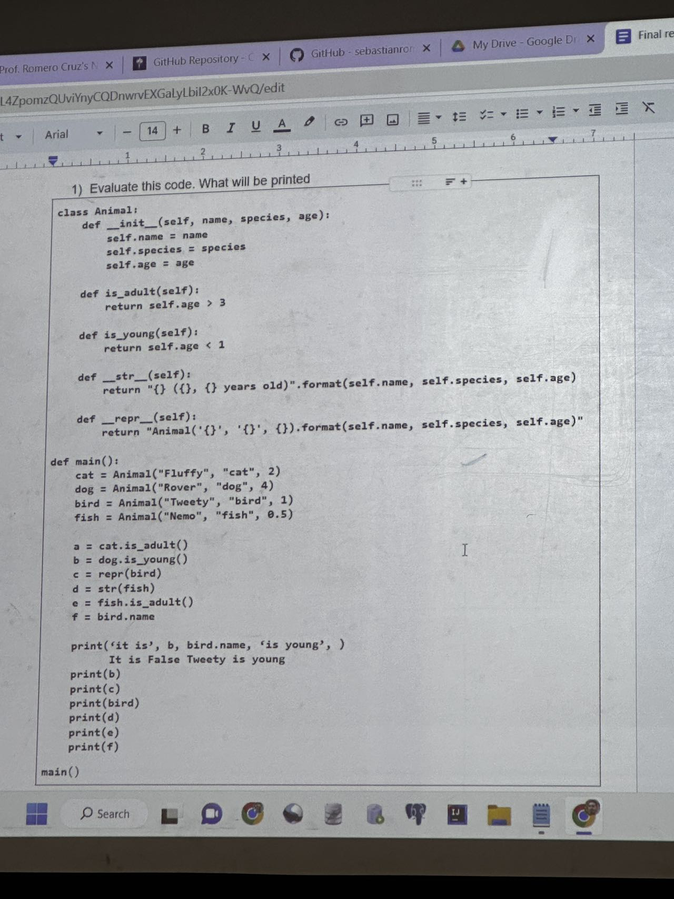
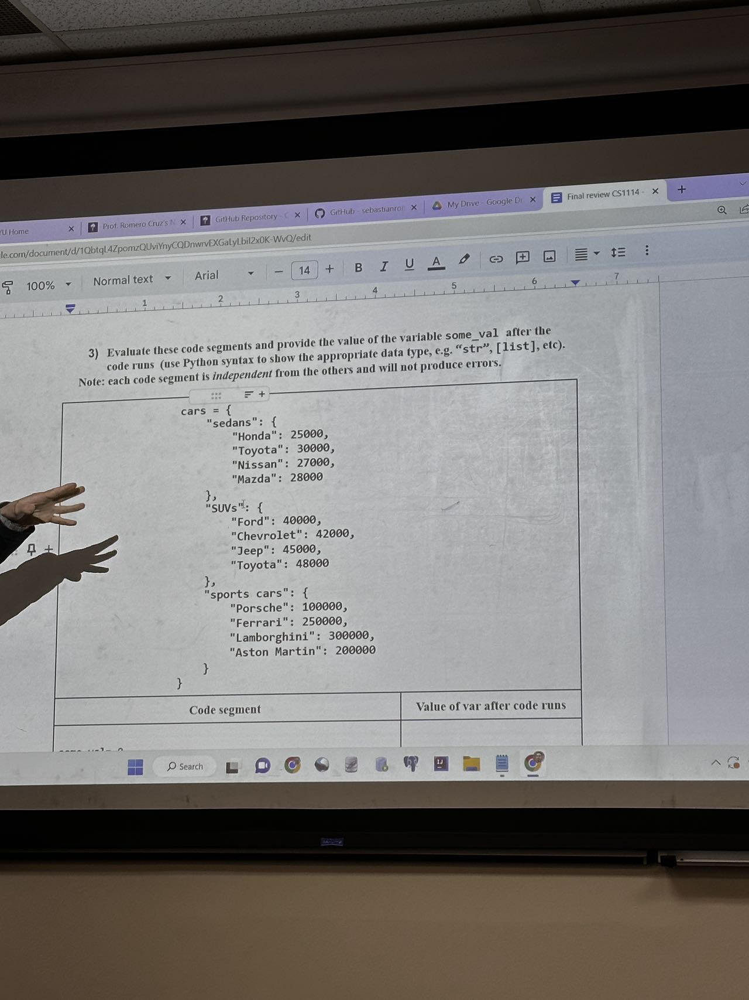
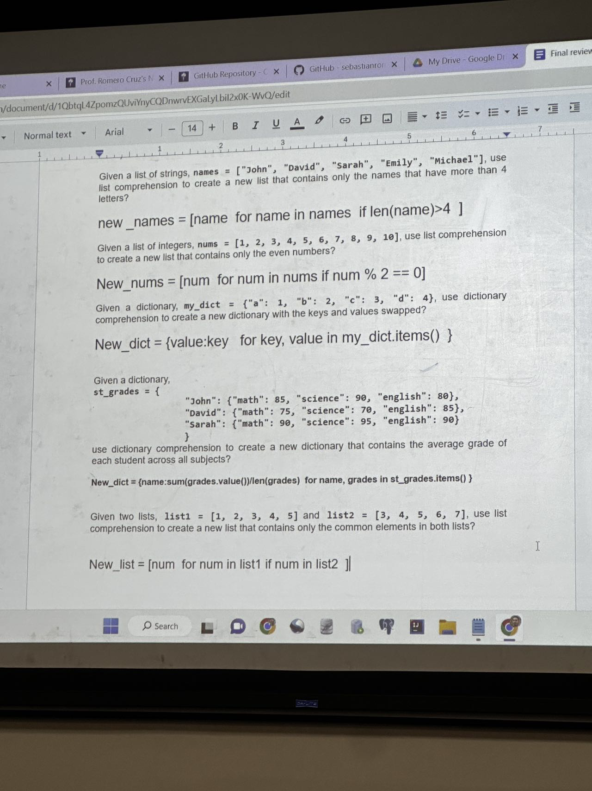
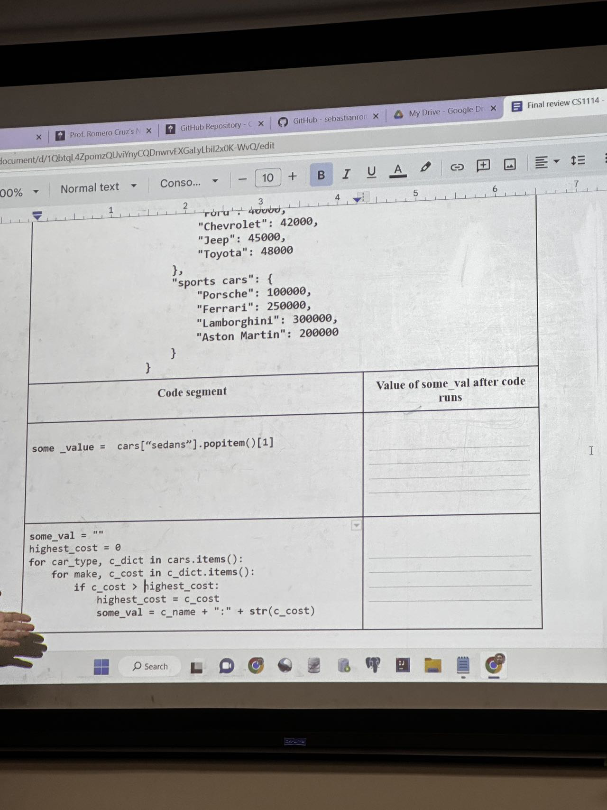
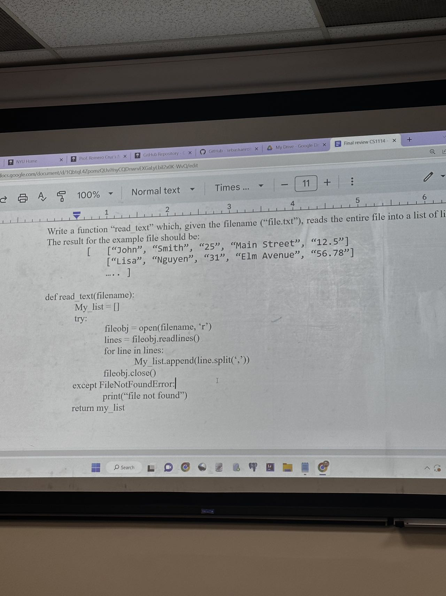
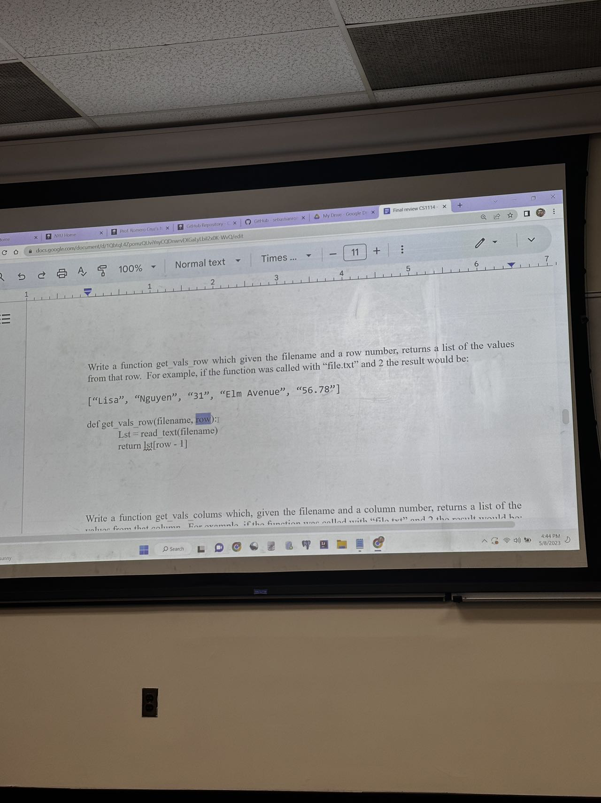
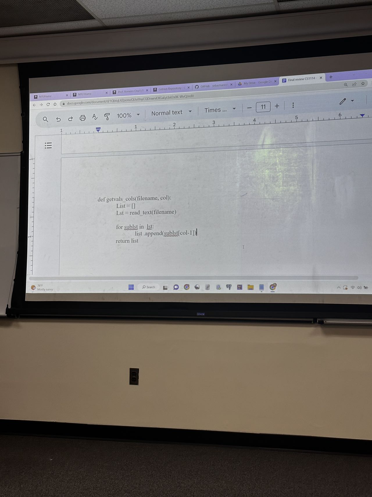

::: tabs

@tab 图1





@tab 图片2





@tab 图片3 







:::

1) Evaluate this code. What will be printed

```python
class Animal:
    def __init__(self, name, species, age):
        self.name = name
        self.species = species
        self.age = age

    def is_adult(self):
        return self.age > 3

    def is_young(self):
        return self.age < 1

    def __str__(self):
        return "{} ({}, {} years old)".format(self.name, self.species, self.age)

    def __repr__(self):
        return "Animal('{}', '{}', {})".format(self.name, self.species, self.age)

def main():
    cat = Animal("Fluffy", "cat", 2)
    dog = Animal("Rover", "dog", 4)
    bird = Animal("Tweety", "bird", 1)
    fish = Animal("Nemo", "fish", 0.5)

    a = cat.is_adult()
    b = dog.is_young()
    c = repr(bird)
    d = str(fish)
    e = fish.is_adult()
    f = bird.name

    print('It is', b, bird.name, "is young")
    print(b)
    print(c)
    print(bird)
    print(d)
    print(e)
    print(f)
```


Give a list of strings, `name = ["John", "David", "Sarah", "Emily", "Michael"]`，use list comprehension to create a new list that contains only the names that have more than 4 letters?

```python
new_names = [name for name in names if len(name) > 4]
```

Given a list of integers, `nums = [1, 2, 3, 4, 5, 6, 7, 8, 9, 10]` , use list comprehension to create a new list that contains only the even numbers?

```python
New_nums = [num for num in nums if num % 2 == 0]
```

Given a dictionary, `my_dict = {"a": 1, "b": 2, "c": 3, "d": 4}`, use dictionary comprehension to create a new dictionary with the keys and values swapped?

```python
New_dict = {value:key for key, value in my_dict.items()}
```

```python
my_dict = {"a": 1, "b": 2, "c": 3, "d": 4}
new_dict = {}
for k, v in my_dict.items():
    # print(k, v)
    new_dict[v] = k
print(new_dict)
```

Given a dictionary,

```python
st_grades = {
    "John": {"math": 85, "science": 90, "english": 80},
    "David": {"math": 75, "science": 70, "english": 85},
    "Sarah": {"math": 90, "science": 95, "english": 90}
}
```

use dictionary comprehension to create a new dictionary that contains the average grade of each student across all subjects?


```python
with open("file.csv", "r") as f:
    line = f.readline()
    while line:
        print(line.strip().split(","))
        line = f.readline()
```


```python
# 定义一个名为 get_row_values 的函数，它接受文件名和行号作为参数。
def get_row_values(filename, row_number):
    try:
        # 使用 'r'（读取）模式打开文件。
        with open(filename, 'r') as file:
            # 使用 readlines() 方法读取文件中的所有行，并将它们存储为一个名为 lines 的列表。
            lines = file.readlines()
            # 0123456
            # 检查给定的行号是否在文件的行数范围内。
            if 0 < row_number <= len(lines):
                # 获取指定行号的数据，注意行号从 1 开始，因此要减去 1。
                row_data = lines[row_number - 1]

                # 使用 strip() 方法删除行首和行尾的空白字符（包括换行符）。
                row_data = row_data.strip()

                # 使用 split(',') 方法将行数据分割成一个列表，假设文件是 CSV 格式，用逗号分隔字段。
                row_data = row_data.split(',')

                # 返回分割后的数据列表。
                return row_data
            else:
                # 如果行号超出范围，则输出错误信息并返回一个空列表。
                print("Error: Row number is out of range.")
                return []
    except FileNotFoundError:
        # 如果文件未找到，则输出错误信息并返回一个空列表。
        print(f"Error: File '{filename}' not found.")
        return []
    except Exception as e:
        # 如果遇到任何其他错误，输出错误信息并返回一个空列表。
        print(f"Error: {e}")
        return []


# 示例使用：
filename = "file.txt"
row_number = 2
result = get_row_values(filename, row_number)
print(result)

```


::: details 公众号：AI悦创【二维码】


:::

::: info AI悦创·编程一对一

AI悦创·推出辅导班啦，包括「Python 语言辅导班、C++ 辅导班、java 辅导班、算法/数据结构辅导班、少儿编程、pygame 游戏开发、Web、Linux」，全部都是一对一教学：一对一辅导 + 一对一答疑 + 布置作业 + 项目实践等。当然，还有线下线上摄影课程、Photoshop、Premiere 一对一教学、QQ、微信在线，随时响应！微信：Jiabcdefh

C++ 信息奥赛题解，长期更新！长期招收一对一中小学信息奥赛集训，莆田、厦门地区有机会线下上门，其他地区线上。微信：Jiabcdefh

方法一：[QQ](http://wpa.qq.com/msgrd?v=3&uin=1432803776&site=qq&menu=yes)

方法二：微信：Jiabcdefh

:::


