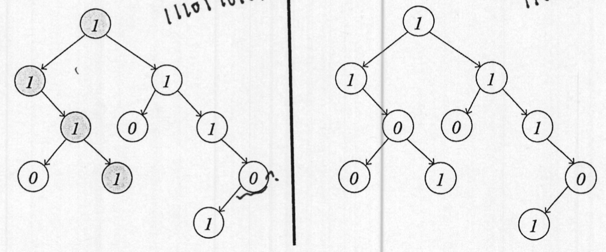

::: code-tabs

@tab code1


```python
class ArrayStack:
    def __init__(self):
        """initializes an empty ArrayStack object. A stack object has:
        data -- an ArrayList, storing the elements currently in the stack in the
        stack in the order they entered the stack"""
    def __len__(self):
        """returns the number of elements stored in the stack"""
    def is_empty(self):
        """returns True if and only if the stack is empty"""
    def push(self, elem):
        """inserts elem to the stack"""
    def pop(self):
        """removes and returns the item that entered the stack last
        (out of all the items currently in the stack),
        or raises an Exception, if the stack is empty"""

    def top(self):
        """returns (without removing) the item that entered the stack
        last (out of all the items currently in the stack),
        or raises an Exception, if the stack is empty"""
```

@tab code2

```python
class ArrayQueue:
    def __init__(self):
        """initializes an empty ArrayQueue object.
        A queue object has the following data members:
        1. data - an array, holding the elements currently in the
        queue in the order they entered the queue. The elements
        are stored in the array in a "circular" way (not necessarily
        starting at index 0)
        2. capacity - holds the physical size of the data array
        3. n - holds the number of elements that are
        currently stored in the queue
        4. front_ind - holds the index, where the (cyclic) sequence
        starts, or None if the queue is empty"""

    def __len__(self):
        """returns the number of elements stored in the queue"""

    def is_empty(self):
        """returns True if and only if the queue is empty"""

    def enqueue(self, elem):
        """inserts elem to the queue"""

    def dequeue(self):
        """removes and returns the item that entered the queue first
        (out of all the items currently in the queue),
        or raises an Exception, if the queue is empty"""

    def first(self):
        """returns (without removing) the item that entered the queue
        first (out of all the items currently in the queue),
        or raises an Exception, if the queue is empty"""

    def resize(self, new_cap):
        """resizes the capacity of the self.data array to be new_cap,
        while preserving the current contents of the queue"""
```

@tab code3


```python
class DoublyLinkedList:
    class Node:
        def __init__(self, data=None):
            """initializes a new Node object containing the
            following attributes:
            1. data - to store the current element
            2. next - a reference to None
            3. prev - a reference to None """
        def disconnect(self):
            """detaches the node by setting all its attributes to None"""

    def __init__(self):
        """initializes an empty DoublyLinkedList object.
        A list object holds references to two "dummy" nodes:
        1. header - a node before the primary sequence
        2. trailer - a node after the primary sequence
        also a size count attribute is maintained
        3. n - the number of elements in the list"""

    def __len__(self):
        """returns the number of elements stored in the list"""

    def is_empty(self):
        """returns True if and only if the list is empty"""

    def add_after(self, node, data):
        """adds data to the list, after the element stored in node.
        returns a reference to the new node (containing data)"""

    def add_first(self, data):
        """adds data as the first element of the list. returns a reference to the
        new (first) node """

    def add_last(self, data):
        """adds data as the last element of the list. returns a reference to the new
        (last) node """

    def add_before(self, node, data):
        """adds data to the list, before the element stored in node.
        returns a reference to the new node (containing data)"""

    def delete_node(self, node):
        """removes node from the list, and returns the data stored in it"""

    def delete_first(self):
        """removes the first element from the list, and returns its value"""

    def delete_last(self):
        """removes the last element from the list, and returns its value"""

    def __iter__(self):
        """an iterator that allows iteration over the
        elements of the list from start to end"""

    def __repr__(self):
        """returns a string reoresentation of the list, showing
        data values separated by <--> """
```

@tab code4


```python
class LinkedBinaryTree:
    class Node:
        def __init__(self, data, left=None, right=None, parent=None):
            """initialies a new Node object with the following attributes:
            1. data - to store the current element
            2. left - a reference to the left child of the node
            3. right - a reference to the right child of the node
            4. parent - a reference to the parent of the node"""
            
        def __init__(self, root=None):
            """initializes a LinkedBinaryTree object with the sturcture
            given in root (or empty if root is None). A tree object holds:
            1. root - a reference to the root node or None if tree is empty
            2. n - a node count"""
            
        def __len__(self):
            """returns the number of nodes in the tree"""
            
        def is_empty(self):
            """returns True if"f the tree is empty"""
            
        def count_nodes(self):
            """returns the number of nodes in the tree"""
            
        def sum(self):
            """returns the sum of all values stored in the tree"""
            
        def height(self):
            """returns the height of the tree"""
            
        def preorder(self):
            """generator allowing to iterate over the nodes of the (entire)
            tree in a preorder order"""
            
        def postorder(self):
            """generator allowing to iterate over the nodes of
            the (entire) tree in a postorder order"""
            
        def inorder(self):
            """generator allowing to iterate over the nodes of
            the (entire) tree in a inorder order"""
            
        def breadth_first(self):
            """generator allowing to ietrate over the nodes of the
            (entire) tree level by level, each level from left to right"""
            
        def __iter__(self):
            """generator allowing to ietrate over the data stored in the
            tree level by level, each level from left to right"""
```

:::

## Question 1

Consider the following definition of the **left circular-shift** operation:
lf seq is the sequence $<a_1, a_2,...a_{n-1}, a_n>$ , the **left circular-shift** of seq is $<a_2, a_3,…,a_n, a_1>$ ,that is the sequence we get when moving the first entry to the last position, while shifting all other entries to the previous position. For example, the left circular-shift of: $<2, 4, 6, 8, 10>$, is: $<4, 6, 8, 10, 2>$.

Add the following method to the DoublyLinkedList class:

```python
def left_circular_shift(self)
```

When called, the method should apply a left circular-shift operation in place. That is, it should mutate the calling object, so that after the execution, it would contain the resulted sequence.

For example, if `lnk_lst` is `[2<—>4<—>6<—>8<—>10]`,

After calling `lnk_lst`. `left_circular_shift()`,

`lnk_lst` should be: `[4<—>6<—>8<—>10<—>2]`

**Implementation requirements:**

1. Your implementation must run in worst-case CONSTANT time.

2. In this implementation, you are not allowed to use the `delete_node`, `delete_first`, `delete_last` `add_after`, `add_before`, `add_first` and/or the `add_last` methods of the DoublyLinkedList class.

    You **are expected** to change the values of prev and/or next attributes for some node(s) to reflect the left circular-shift operation.

```python
def left_circular_shift(self):
    if (len(self) <= 1):
        return
    else:
```

## Solution 1

:::: details

::: code-tabs

@tab Code1

```python
class DoublyLinkedList:
    class Node:
        def __init__(self, data=None, next=None, prev=None):
            """初始化一个新的节点。
            data: 节点存储的数据。
            next: 指向下一个节点的引用。
            prev: 指向前一个节点的引用。"""
            self.data = data
            self.next = next
            self.prev = prev

        def disconnect(self):
            """断开节点的连接，清除数据和指针。"""
            self.data = None
            self.next = None
            self.prev = None

    def __init__(self):
        """初始化一个空的双向链表。
        包含两个哨兵节点：头节点和尾节点，以及一个元素计数器 n。"""
        self.header = self.Node()  # 哨兵头节点
        self.trailer = self.Node()  # 哨兵尾节点
        self.header.next = self.trailer  # 头尾相连
        self.trailer.prev = self.header
        self.n = 0  # 元素计数

    def __len__(self):
        """返回链表中元素的数量。"""
        return self.n

    def is_empty(self):
        """判断链表是否为空。"""
        return self.n == 0

    def add_between(self, data, predecessor, successor):
        """在两个给定节点之间添加一个新节点。
        data: 要添加的数据。
        predecessor: 新节点的前一个节点。
        successor: 新节点的后一个节点。
        返回新添加的节点。"""
        new_node = self.Node(data, successor, predecessor)
        predecessor.next = new_node
        successor.prev = new_node
        self.n += 1
        return new_node

    def add_first(self, data):
        """在链表的开始处添加一个新元素。
        data: 要添加的数据。
        返回新添加的节点。"""
        return self.add_between(data, self.header, self.header.next)

    def add_last(self, data):
        """在链表的末尾处添加一个新元素。
        data: 要添加的数据。
        返回新添加的节点。"""
        return self.add_between(data, self.trailer.prev, self.trailer)

    def delete_node(self, node):
        """从链表中删除一个节点。
        node: 要删除的节点。
        返回被删除节点的数据。"""
        predecessor = node.prev
        successor = node.next
        predecessor.next = successor
        successor.prev = predecessor
        self.n -= 1
        data = node.data
        node.disconnect()
        return data

    def __iter__(self):
        """提供链表的迭代器，允许遍历链表中的元素。"""
        current = self.header.next
        while current != self.trailer:
            yield current.data
            current = current.next

    def __repr__(self):
        """返回链表的字符串表示，展示其中的数据值。"""
        data = [str(node.data) for node in self]
        return "<-->".join(data)

    def left_circular_shift(self):
        """执行一个左循环移位操作。
        将第一个元素移动到链表的末尾。"""
        if self.n <= 1:
            return

        first_node = self.header.next  # 找到第一个元素节点
        last_node = self.trailer.prev  # 找到最后一个元素节点

        # 重新连接节点以完成左循环移位
        self.header.next = first_node.next
        first_node.next.prev = self.header

        first_node.next = self.trailer
        first_node.prev = last_node
        last_node.next = first_node
        self.trailer.prev = first_node
```

:::

::::

## Question 2

Implement the following function:

```python
def remove_all(q, val)
```

This function is called with:

1. q - an ArrayQueue object containing integers
2. val - an integer

When called, it should remove all occurrences of val from q, so that when the function is done, val would no longer be in q, and all the other numbers will remain there, **keeping the relative order they had before** the function was called.

For example, if q contains the elements: $<4, 2, 15, 2, 5, 1, 10, -2, 3>$ (4 is first in line, and 3 is last in line), after calling `remove_all(q, 2)`, q should be: $<4, 15, 5, 1, 10, -2, 3>$.

Implementation requirement:

1. Your function should **run in linear time**. That is, if there are n items in q, calling `remove_all(q, val)` will run in $\theta(n)$.

2. For the memory: In addition to q (the ArrayQueue that was given as input), your function may use:

    - one ArrayStack object
    - $\theta(1)$ additional memory.

    That is, in addition to q and the ArrayStack, you may not use another data structure (such as a list, another stack, another queue, etc.) to store non-constant number of elements.

3. You should use the interfaces of ArrayStack and of ArrayQueue as a black box. That is, you may not assume anything about their implementation.

```python
def remove_all(q, vat):
```

## Solution 2

:::: details

::: code-tabs

@tab Code1-参考1

```python
class ArrayStack:
    # 假设这是一个栈的实现，具有常规的 push, pop, is_empty 等方法

def remove_all(q, val):
    stack = ArrayStack()

    # 遍历队列中的所有元素
    initial_size = len(q)
    for _ in range(initial_size):
        elem = q.dequeue()
        if elem != val:
            stack.push(elem)

    # 将栈中的元素重新放入队列，恢复原始顺序
    while not stack.is_empty():
        q.enqueue(stack.pop())

# 注意：这里假设 ArrayQueue 和 ArrayStack 已经提供了相应的接口，
# 包括 enqueue, dequeue, push, pop, is_empty 等方法。
```

@tab 参考2

```python
def remove_all(q, val):
    stack = ArrayStack()  # 创建一个栈用于暂存元素

    # 遍历队列中的所有元素
    while not q.is_empty():
        current = q.dequeue()  # 从队列中移除当前元素
        if current != val:
            stack.push(current)  # 如果当前元素不是目标值，则将其压入栈中

    # 将栈中的元素重新放回队列
    while not stack.is_empty():
        q.enqueue(stack.pop())  # 将栈顶元素放回队列中

    # 这样操作后，所有的 val 元素都被移除，其他元素的顺序保持不变
```


@tab ArrayStack

```python
class ArrayStack:
    def __init__(self):
        self.data = []  # 初始化一个空列表来存储栈元素

    def __len__(self):
        return len(self.data)  # 返回栈中元素的数量

    def is_empty(self):
        return len(self.data) == 0  # 判断栈是否为空

    def push(self, elem):
        self.data.append(elem)  # 将元素添加到栈顶

    def pop(self):
        if self.is_empty():
            raise Exception("Stack is empty")
        return self.data.pop()  # 移除并返回栈顶元素

    def top(self):
        if self.is_empty():
            raise Exception("Stack is empty")
        return self.data[-1]  # 返回栈顶元素，但不移除

```

@tab ArrayQueue

```python
class ArrayQueue:
    DEFAULT_CAPACITY = 10  # 默认队列容量

    def __init__(self):
        self.data = [None] * ArrayQueue.DEFAULT_CAPACITY
        self.front_ind = 0  # 队首元素的索引
        self.n = 0  # 队列中的元素数量
        self.capacity = ArrayQueue.DEFAULT_CAPACITY

    def __len__(self):
        return self.n

    def is_empty(self):
        return self.n == 0

    def first(self):
        if self.is_empty():
            raise Exception("Queue is empty")
        return self.data[self.front_ind]

    def dequeue(self):
        if self.is_empty():
            raise Exception("Queue is empty")
        answer = self.data[self.front_ind]
        self.data[self.front_ind] = None  # 帮助垃圾回收
        self.front_ind = (self.front_ind + 1) % self.capacity
        self.n -= 1
        return answer

    def enqueue(self, elem):
        if self.n == self.capacity:
            self.resize(2 * self.capacity)
        avail = (self.front_ind + self.n) % self.capacity
        self.data[avail] = elem
        self.n += 1

    def resize(self, new_cap):
        old_data = self.data
        self.data = [None] * new_cap
        walk = self.front_ind
        for k in range(self.n):  # 只考虑非空位置
            self.data[k] = old_data[walk]
            walk = (1 + walk) % len(old_data)
        self.front_ind = 0
        self.capacity = new_cap
```

:::

::::

## Question3

Give a recursive implementation of the following function:

```python
def has_full_path_of_ones(root)
```

This function is given root, a reference to a LinkedBinaryTree.Node that is the root of a non-empty binary tree containing only 0s and 1s as data (in each node).

When calling `has_path_of_ones(root)`, it should return True if the tree rooted by root has a path that starts at the root and ends at a leaf, and that the data in all the nodes along it is 1.

For example, if we call the function on the trees below, then, for the tree on the left, the function should return True. However, for the tree on the right, the function should return False.



Implementation requirements:

1. Your function has to run in worst case linear time. That is, if there are n nodes in the tree, your function should run in $\theta(n)$ worst-case.
2. You must give a recursive implementation.
3. You are not allowed to:
    1. Define a helper function.
    2. Add parameters to the function's header line
    3. Set default values to any parameter.
    4. Use global variables.

```python
def has_full_path_of_ones(root):
```

## Solution 3

::: code-tabs

@tab Code1

```python
def has_full_path_of_ones(root):
    # 如果节点为空，说明没有找到全为1的路径，返回False
    if root is None:
        return False
    # 如果节点的值不是1，也返回False
    if root.data != 1:
        return False
    # 如果节点没有子节点，且节点的值为1，说明找到一条全为1的路径
    if root.left is None and root.right is None:
        return True
    # 递归检查左子树或右子树中是否有全为1的路径
    return has_full_path_of_ones(root.left) or has_full_path_of_ones(root.right)

```

@tab Code2

```python
class LinkedBinaryTree:
    # 定义节点类
    class Node:
        def __init__(self, data, left=None, right=None, parent=None):
            self.data = data  # 存储当前节点的数据
            self.left = left  # 左子节点引用
            self.right = right  # 右子节点引用
            self.parent = parent  # 父节点引用

    # 初始化二叉树
    def __init__(self, root=None):
        self.root = root  # 根节点引用
        self.n = 0 if root is None else self.count_nodes(self.root)  # 节点计数

    # 返回树中节点的数量
    def __len__(self):
        return self.n

    # 判断树是否为空
    def is_empty(self):
        return self.n == 0

    # 递归计算树中节点的数量
    def count_nodes(self, node):
        if node is None:
            return 0
        else:
            return 1 + self.count_nodes(node.left) + self.count_nodes(node.right)

    # 递归计算树中所有节点数据之和
    def sum(self, node=None):
        if node is None:
            node = self.root  # 如果没有指定节点，则从根节点开始
        if node is None:
            return 0
        else:
            return node.data + self.sum(node.left) + self.sum(node.right)

    # 递归计算树的高度
    def height(self, node=None):
        if node is None:
            node = self.root  # 如果没有指定节点，则从根节点开始
        if node is None:
            return -1  # 空树的高度定义为-1
        else:
            return 1 + max(self.height(node.left), self.height(node.right))

    # 前序遍历生成器
    def preorder(self, node=None):
        if node is None:
            node = self.root  # 如果没有指定节点，则从根节点开始
        if node is not None:
            yield node.data  # 首先访问当前节点
            yield from self.preorder(node.left)  # 递归遍历左子树
            yield from self.preorder(node.right)  # 递归遍历右子树

    # 后序遍历生成器
    def postorder(self, node=None):
        if node is None:
            node = self.root  # 如果没有指定节点，则从根节点开始
        if node is not None:
            yield from self.postorder(node.left)  # 递归遍历左子树
            yield from self.postorder(node.right)  # 递归遍历右子树
            yield node.data  # 最后访问当前节点

    # 中序遍历生成器
    def inorder(self, node=None):
        if node is None:
            node = self.root  # 如果没有指定节点，则从根节点开始
        if node is not None:
            yield from self.inorder(node.left)  # 递归遍历左子树
            yield node.data  # 访问当前节点
            yield from self.inorder(node.right)  # 递归遍历右子树

    # 广度优先遍历生成器
    def breadth_first(self):
        if self.root is not None:
            queue = [self.root]  # 使用队列支持广度优先遍历
            while queue:
                node = queue.pop(0)  # 弹出队列的第一个节点
                yield node.data  # 返回当前节点的数据
                if node.left is not None:
                    queue.append(node.left)  # 如果存在左子节点，加入队列
                if node.right is not None:
                    queue.append(node.right)  # 如果存在右子节点，加入队列

    # 实现迭代器，允许迭代整棵树中存储的数据
    def __iter__(self):
        return self.breadth_first()  # 使用广度优先遍历的方式迭代
```


:::

## Question 4

A Urgents_Queue is a variation of a Queue. Each item in the Queue could either be an 'Urgent' item or a 'Standard' item. The Queue would normally apply a first-in-first-out order, but urgent items could also be taken out earlier than their original place in line.

A Urgents_Queue supports the following operations:
- `q = Urgents_Queue()`: creates an empty Urgents_Queue object.
- `len(q)`: returns the number of items in q.
- `q.is_empty()`: returns false if there are one or more items in q; true if there are no items in it.

- `q.enqueue(item, status)`: inserts item as a status item (status could either be 'Urgent' or 'Standard') to the end of the line.
- `q.dequeue()`: removes and returns the first item that entered q, out of ALL the items currently in q (regardless if it’s a standard or an urgent item). An Exception should be raised if q is empty.
- `q.urgent_dequeue()`: removes and returns the first urgent item that entered q. If there are no urgent items in q but there are still standard items, the first standard item to enter should be taken out. An Exception should be raised if q is empty.

For example, you should expect the following interaction. For clarity, we commented, to the side of each instruction, the content of the queue after executing it (urgent items are highlighted in gray):

```python
>>> q = Urgents_Queue()
>>> q.enqueue(1, "Standard")       # <1>
>>> q.enqueue(2, "Standard")       # <1, 2>
>>> q.enqueue(3, "Urgent")         # <1, 2, 3>
>>> q.enqueue(4, "Urgent")         # <1, 2, 3, 4>
>>> q.enqueue(5, "Standard")       # <1, 2, 3, 4, 5>
>>> q.enqueue(6, "Urgent")         # <1, 2, 3, 4, 5, 6>
>>> q.dequeue()                    # <2, 3, 4, 5, 6>
1
>>> q.urgent_dequeue()             # <2, 4, 5, 6>
3
>>> q.urgent_dequeue()             # <2, 5, 6>
4
>>> q.dequeue()                    # <5, 6>
2
```

Give a Python implementation for the Urgents_Queue class.

Runtime requirement: Each Urgents_Queue operation has to run in $\theta(1)$ worst-case.

Note: You may use any data structure shown in class, with the interface detailed at pages: 2-5.


::: details 公众号：AI悦创【二维码】


:::

::: info AI悦创·编程一对一

AI悦创·推出辅导班啦，包括「Python 语言辅导班、C++ 辅导班、java 辅导班、算法/数据结构辅导班、少儿编程、pygame 游戏开发、Web、Linux」，全部都是一对一教学：一对一辅导 + 一对一答疑 + 布置作业 + 项目实践等。当然，还有线下线上摄影课程、Photoshop、Premiere 一对一教学、QQ、微信在线，随时响应！微信：Jiabcdefh

C++ 信息奥赛题解，长期更新！长期招收一对一中小学信息奥赛集训，莆田、厦门地区有机会线下上门，其他地区线上。微信：Jiabcdefh

方法一：[QQ](http://wpa.qq.com/msgrd?v=3&uin=1432803776&site=qq&menu=yes)

方法二：微信：Jiabcdefh

:::


