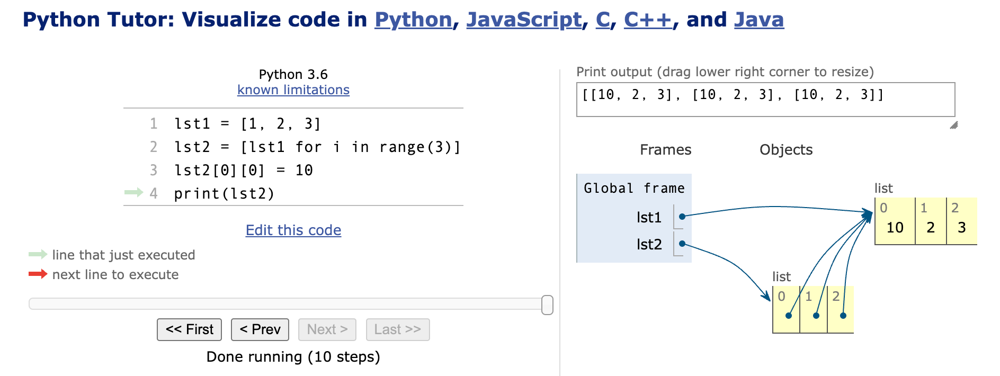

## Question 1

Draw the memory image for evaluating the following code:

> 为以下代码绘制内存图像：

```python
>>> lst1 = [1, 2, 3]
>>> lst2 = [lst1 for i in range(3)]
>>> lst2[0][0] = 10
>>> print(lst2)
```

### Solution 1

这段 Python 代码首先创建了一个列表 `lst1`，之后又创建了另一个列表 `lst2`，它包含 3 个指向 `lst1` 的引用。这意味着 `lst2` 中的三个子列表实际上是指向同一个对象的引用。




当我们修改 `lst2[0][0]` 时，我们实际上是在修改 `lst1`，因此 `lst2` 中的所有子列表都会受到影响。

为了展示这一点，我们可以画一个内存图。

假设我们的内存地址是假象的，我们只是为了说明：

```text
Address     Value     Variable
--------    ------    --------
0x100       [1, 2, 3] lst1
0x200       [0x100,  0x100,  0x100]  lst2
```

上面的内存图描述了以下情况：

1. `lst1` 的地址是 `0x100`，它存储的值是 `[1, 2, 3]`。
2. `lst2` 的地址是 `0x200`，它存储的值是三个指向 `lst1` 的引用。因此，你看到的是 `lst1` 的地址 `0x100` 重复了三次。

当执行 `lst2[0][0] = 10` 时，`lst1` 变为：

```
Address     Value     
--------    ------    
0x100       [10, 2, 3]
```

因此，当你执行 `print(lst2)` 时，输出将是：`[[10, 2, 3], [10, 2, 3], [10, 2, 3]]`，因为所有的子列表都引用了同一个列表 `lst1`。

这就是为什么修改了 `lst2` 中的一个子列表后，其他子列表也会受到影响的原因。


## Question 2

a. Write a function **def** `shift(lst, k)` that is given a list of *N* numbers, and some positive integer k (where k*<N*). The function should shift the numbers circularly k steps to the left.

The shift has to be done **in-place**. That is, the numbers in the parameter list should reorder to form the correct output (you **shouldn’t** create and return a new list with the shifted result).

For example, if `lst = [1, 2, 3, 4, 5, 6]` after calling `shift(lst, 2)`, lstwill be `[3, 4, 5, 6, 1, 2]`

b. Modify your implementation, so we could optionally pass to the function a third argument that indicates the direction of the shift (either ‘left’ or ‘right’).
 Note: if only two parameters are passed, the function should shift, by default, to the left.

Hint: Use the syntax for default parameter values.

### Solution 2

假设你有一个列表 `lst = [1, 2, 3, 4, 5, 6]`，它的长度为6。

现在，如果我们想向左移动6步，结果仍然是 `[1, 2, 3, 4, 5, 6]` ，这是因为移动整个列表长度后，列表的内容又回到了原始位置。所以移动 6 步、12 步、18 步（或任何 6 的倍数的步数）都会得到相同的结果。

为了处理这种情况，我们使用模运算（`%`），这样我们可以得到一个等效但更小的移动步数。例如，移动 7 步与移动 1 步是等效的，移动 8 步与移动 2 步是等效的，依此类推。

因此，`k %= n` 这一步的作用是将 `k` 转化为一个等效的、但小于 `n` 的值。这样我们就可以确保我们总是在有效范围内进行移动，避免了不必要的移动。

例如：
- 如果 `k=7`，`n=6`，那么 `k%=n` 会将 k 改为 1（因为 `7 % 6 = `1）。
- 如果 `k=13`，`n=6`，那么 `k%=n` 会将 k 改为 1（因为 `13 % 6 = 1`）。
- 如果 `k=12`，`n=6`，那么 `k%=n` 会将 k 改为 0（因为 `12 % 6 = 0`）。

::: tabs

@tab 方法一

以下是 `shift` 函数的实现，这个函数根据上述需求完成了列表中的元素循环移位。

a. 对于左移位的实现：
```python
def shift(lst, k):
    n = len(lst)
    k %= n  # 为了处理 k 大于 n 的情况
    lst[:] = lst[k:] + lst[:k] 
```

b. 对于左右移位的选择，我们可以为方向设置一个默认值为`left`的参数。根据此参数的值，我们可以确定是向左还是向右移位。

```python
def shift(lst, k, direction='left'):
    n = len(lst)
    k %= n  # 为了处理k大于n的情况
    
    if direction == 'left':
        lst[:] = lst[k:] + lst[:k]
    elif direction == 'right':
        lst[:] = lst[-k:] + lst[:-k]
    else:
        raise ValueError("Direction should be either 'left' or 'right'")
```

使用方法：
```python
lst = [1, 2, 3, 4, 5, 6]
shift(lst, 2)
print(lst)  # 输出：[3, 4, 5, 6, 1, 2]

lst = [1, 2, 3, 4, 5, 6]
shift(lst, 2, 'right')
print(lst)  # 输出：[5, 6, 1, 2, 3, 4]
```

注意：在上述实现中，使用了 `lst[:]` 来直接修改输入列表的内容，从而达到了原地移位的效果。

@tab 方法二

另一种常见的实现方法是通过三次数组翻转来达到循环移位的效果。下面是使用这种方法的具体步骤：

1. 如果我们想要将数组左移k个位置，首先翻转整个数组；
2. 接着翻转前 `n-k` 个元素；
3. 最后翻转剩下的 k 个元素。

这种方法的优点是不需要额外的内存空间，同时操作也非常直观。以下是基于这种方法的具体实现：

```python
def reverse(lst, start, end):
    """辅助函数，用于翻转列表中的部分元素"""
    while start < end:
        lst[start], lst[end] = lst[end], lst[start]
        start += 1
        end -= 1

def shift(lst, k, direction='left'):
    n = len(lst)
    k %= n  # 为了处理k大于n的情况
    if direction == 'right':
        k = n - k  # 转化右移为左移

    # 以下是基于三次翻转的移位操作
    reverse(lst, 0, n-1)
    reverse(lst, 0, n-k-1)
    reverse(lst, n-k, n-1)

# 测试
lst = [1, 2, 3, 4, 5, 6]
shift(lst, 2)
print(lst)  # 输出：[3, 4, 5, 6, 1, 2]

lst = [1, 2, 3, 4, 5, 6]
shift(lst, 2, 'right')
print(lst)  # 输出：[5, 6, 1, 2, 3, 4]
```

这种方法同样保证了原地移位，不需要使用额外的内存空间。

@tab 方法三

郑皓元赞助第三种方法，非常不错。值得肯定和借鉴～

```python
def shift(lst,k,direction):
    """思路是将列表的K位置的数字先去掉，再全部放到列表的后面"""
    """这个注释不是给我看的"""
    if direction == "left":
        select = lst[:k]
        for num in select:
            lst.remove(num)
        lst.extend(select)
        return lst

    elif direction == "right":
        #这里的思路是
        selected = lst[-k:][::-1]
        r = lst[::-1]
        for num in selected:
            r.remove(num)
        lst = r[::-1]
        
        #print("lst",lst)
        for num in selected:
            lst.insert(0,num)
        return lst

    else:
        return "Just left or right available"
print(shift([1,2,3,4,5,6],2,"right"))
```

```python
# def add_number(lst: list):
#     lst.append("aiyc")
#
#
# lst = [1, 2, 3]
# print(f"lst: >>> {lst}")
# add_number(lst)
# print(f"lst: >>> {lst}")
def shift(lst, k, direction="left"):
    """思路是将列表的K位置的数字先去掉，再全部放到列表的后面"""
    """这个注释不是给我看的"""
    if direction == "left":
        select = lst[:k]
        for num in select:
            lst.remove(num)
        lst.extend(select)
        # print(f"内: {id(lst)}")
        # return lst

    elif direction == "right":
        # 这里的思路是
        selected = lst[-k:][::-1]
        r = lst[::-1]  # 提取数据，
        # print(f"内: {id(lst)}")
        for num in selected:
            r.remove(num)
        # lst = r[::-1]  # 覆盖
        lst.clear()
        lst.extend(r[::-1])
        # print("lst",lst)
        for num in selected:
            lst.insert(0, num)
        print(f"内: {id(lst)}")
        # return lst

    else:
        raise "Just left or right available"  # 主动报错


lst = [1, 2, 3, 4, 5, 6]
print(lst)
shift(lst, 2, "right")
# print(lst)
# print(shift(lst, 2))
# print(f"外: {id(lst)}")
print(lst)
# print(shift(lst, 2, "right"))
```

:::

## Question 3

a. Write a short Python function that takes a positive integer *n* and returns the sum of the squares of all the positive integers smaller than *n*.

> a. 编写一个简短的 Python 函数，该函数接收一个正整数 *n* 并返回小于 *n* 的所有正整数的平方和。

b. Give a single command that computes the sum from section (a), relying on Python’s list comprehension syntax and the built-in sum function. 


> b. 提供一个单一命令来计算部分(a)中的和，依赖于 Python 的列表解析语法和内置的sum函数。

c. Write a short Python function that takes a positive integer *n* and returns the sum of the squares of all the odd positive integers smaller than *n*.

> c. 编写一个简短的Python函数，该函数接收一个正整数 *n* 并返回小于 *n* 的所有奇数正整数的平方和。

d. Give a single command that computes the sum from section(c),relying on Python’s list comprehension syntax and the built-in sum function. 


> d. 提供一个单一命令来计算部分(c)中的和，依赖于Python的列表解析语法和内置的sum函数。

### Solution

::: tabs

@tab 1

a. Here's a function that takes a positive integer `n` and returns the sum of the squares of all the positive integers smaller than `n`:

```python
def sum_of_squares(n):
    return sum([i**2 for i in range(n)])
```

b. Using Python’s list comprehension syntax and the built-in `sum` function:

```python
sum(i**2 for i in range(n))
```

c. Here's a function that takes a positive integer `n` and returns the sum of the squares of all the odd positive integers smaller than `n`:

```python
def sum_of_squares_odd(n):
    return sum([i**2 for i in range(n) if i % 2 == 1])
```

d. Using Python’s list comprehension syntax and the built-in `sum` function:

```python
sum(i**2 for i in range(n) if i % 2 == 1)
```

Remember, in all the above solutions, you'll need to define or input the value of `n` for the computations to work.

@tab 2

```python
In [1]: sum(i for i in range(10))
Out[1]: 45
```

---

我们可以用其它的内建函数或者表达式来完成这些计算，而不仅仅是列表解析。以下是完全不同的方法来实现同样的功能：

a. 使用`map`函数：

```python
sum(map(lambda x: x**2, range(n)))
```

b. 使用`filter`和`map`函数结合：

```python
sum(map(lambda x: x**2, filter(lambda x: x % 2 == 1, range(n))))
```

这些方法也是单行实现，并且避免了使用列表解析。不过它们在功能上与之前提供的列表解析的解决方案是等效的。

@tab 3

a. 使用传统的 for 循环计算小于 `n` 的正整数的平方和：

```python
def sum_of_squares(n):
    total = 0
    for i in range(n):
        total += i**2
    return total
```

c. 使用传统的 for 循环计算小于 `n` 的奇数正整数的平方和：

```python
def sum_of_squares_odd(n):
    total = 0
    for i in range(n):
        if i % 2 == 1:
            total += i**2
    return total
```

d. 尽管该部分要求使用列表推导式，但为了提供一个不同的方法，我们可以使用 `filter` 函数：

```python
sum(map(lambda x: x**2, filter(lambda x: x % 2 == 1, range(n))))
```

这里，我们使用 `filter` 函数筛选出小于 `n` 的奇数，然后使用 `map` 函数计算这些数字的平方，最后用 `sum` 函数将它们加在一起。

:::


## Question 4

1. Demonstrate how to use Python’s list comprehension syntax to produce the list `[1, 10, 100, 1000, 10000, 100000]`.

> 演示如何使用 Python 的列表解析语法来生成列表 `[1, 10, 100, 1000, 10000, 100000]`。

2. Demonstrate how to use Python’s list comprehension syntax to produce the list `[0, 2, 6, 12, 20, 30, 42, 56, 72, 90]`.

> 演示如何使用 Python 的列表解析语法来生成列表 `[0, 2, 6, 12, 20, 30, 42, 56, 72, 90]`。

3. Demonstrate how to use Python’s list comprehension syntax to produce the list `[‘a’, ‘b’, ‘c’, ... , ‘z’]`, but without having to type all 26 such characters literally.

>  演示如何使用 Python 的列表解析语法来生成列表`['a', 'b', 'c', ... , 'z']`，但是不需要实际输入所有26个字符。

### Solution 4

::: tabs

@tab 1

1. 使用 Python 的列表推导式产生列表`[1, 10, 100, 1000, 10000, 100000]`:
```python
[10**i for i in range(6)]
```

2. 使用Python的列表推导式产生列表`[0, 2, 6, 12, 20, 30, 42, 56, 72, 90]`:
```python
[i*(i+1) for i in range(10)]
```

3. 使用Python的列表推导式产生列表`['a', 'b', 'c', ... , 'z']`，但不直接键入所有26个字符:
```python
[chr(i) for i in range(97, 123)]
```

@tab 2

1. 使用 `pow` 函数来计算10的幂次方：
```python
[pow(10, i) for i in range(6)]
```

2. 使用公式 \( n^2 + n \) 再除以2来得到结果：
```python
[(i**2 + i) // 2 for i in range(10)]
```

3. 使用 `ord` 函数获取字母 'a' 的ASCII值，然后遍历26次并使用 `chr` 函数转回字母：
```python
[chr(ord('a') + i) for i in range(26)]
```

虽然这些实现方法与之前的不同，但它们都能满足题目的要求。

:::


## Question 5

The *Fibonacci Numbers Sequence*, $F_n$, is defined as follows:

$F_{0}$ is 1, $F_{1}$ is 1, and $F_{n} = F_{n-1} + F_{n-2}$ for n = 2,  3, 4,...

In other words, each number is the sum of the previous two numbers.

The first 10 numbers in Fibonacci sequence are: 1, 1, 2, 3, 5, 8, 13, 21, 34, 55

Note:

Background of Fibonacci sequence: [https://en.wikipedia.org/wiki/Fibonacci_number](https://en.wikipedia.org/wiki/Fibonacci_number)

Implement a function **def** fibs(n) . This function is given a positive integer n,and returns a generator, that when iterated over, it will have the first n elements in the Fibonacci sequence.

For Example, if we execute the following code:

```python
for curr in fibs(8):
    print(curr)
```

The expected output is:

```python
1 1 2 3 5 8 13 21
```

::: details

*斐波那契数列*，记为 $F_n$，定义如下：

$F_{0}$ 是 1，$F_{1}$ 是 1，当 n = 2, 3, 4,... 时，$F_{n} = F_{n-1} + F_{n-2}$。

换句话说，每一个数字是前两个数字之和。

斐波那契数列的前10个数字是：1, 1, 2, 3, 5, 8, 13, 21, 34, 55

注：

斐波那契数列的背景：[https://en.wikipedia.org/wiki/Fibonacci_number](https://en.wikipedia.org/wiki/Fibonacci_number)

实现一个函数 **def** fibs(n) 。这个函数接受一个正整数 n，然后返回一个生成器，当遍历这个生成器时，它会返回斐波那契数列的前n个元素。

例如，如果我们执行以下代码：

```python
for curr in fibs(8):
    print(curr)
```

预期输出是：

```python
1 1 2 3 5 8 13 21
```

:::

::: tabs

@tab 1

这是一个关于生成器的问题，您需要创建一个生成器函数来产生 Fibonacci 数列。以下是如何实现该功能的代码：

```python
def fibs(n):
    a, b = 1, 1
    count = 0
    while count < n:
        yield a
        a, b = b, a + b
        count += 1

# 测试函数
for curr in fibs(8):
    print(curr, end=' ')
```

运行上述测试代码后，输出结果为：

```
1 1 2 3 5 8 13 21 
```

这样，你就成功实现了一个生成器函数，可以用于产生 Fibonacci 数列的前 n 个数。

@tab 2

使用 `for` 循环是另一种常见的方法来实现此功能。以下是如何使用 `for` 循环实现这个生成器的示例：

```python
def fibs(n):
    a, b = 1, 1
    for _ in range(n):
        yield a
        a, b = b, a + b

# 测试函数
for curr in fibs(8):
    print(curr, end=' ')
```

运行上述代码，输出结果同样为：

```
1 1 2 3 5 8 13 21 
```

`while` 循环和 `for` 循环在这个例子中都能达到相同的效果。

:::

## Question 6

You are given an implementation of a Vector class, representing the coordinates of a vector in a multidimensional space. For example, in a three-dimensional space, we might wish to represent a vector with coordinates *<5,**−**2, 3>*.

> 你得到了一个向量类的实现，代表在多维空间中的向量坐标。例如，在三维空间中，我们可能希望表示一个坐标为 *`<5,−2,3>`* 的向量。

For a detailed explanation of this implementation as well as of the syntax of operator overloading that is used here, please read sections 2.3.2 and 2.3.3 in the textbook (pages 74-78).

> 对于这个实现的详细解释，以及这里使用的操作符重载的语法，请阅读教材中的2.3.2和2.3.3节（第74-78页）。

```python
class Vector:
    def __init__(self, d):
        self.coords = [0] * d

    def __len__(self):
        return len(self.coords)

    def __getitem__(self, j):
        return self.coords[j]

    def __setitem__(self, j, val):
        self.coords[j] = val

    def __add__(self, other):
        if len(self) != len(other):
            raise ValueError("dimensions must agree")
        result = Vector(len(self))
        for j in range(len(self)):
            result[j] = self[j] + other[j]
        return result

    def __eq__(self, other):
        return self.coords == other.coords

    def __ne__(self, other):
        return not (self == other)

    def __str__(self):
        return "<" + str(self.coords)[1:-1] + ">"

    def __repr__(self):
        return str(self)
```

a. The Vector class provides a constructor that takes an integer *d*, and produces a *d*-dimensional vector with all coordinates equal to 0. Another convenient form for creating a new vector would be to send the constructor a parameter that is some iterable object representing a sequence of numbers, and to create a vector with dimension equal to the length of that sequence and coordinates equal to the sequence values. For example, `Vector([4, 7, 5])` would produce a three- dimensional vector with coordinates `<4, 7, 5>`.

> a. Vector 类提供了一个构造函数，它接受一个整数*d*，并生成一个所有坐标都为0的*d*-维向量。创建新向量的另一种便捷方式是向构造函数发送一个参数，该参数是代表数字序列的可迭代对象，并创建一个维度等于该序列长度的向量，坐标等于序列值。例如，`Vector([4, 7, 5])` 会产生一个三维向量，坐标为`<4, 7, 5>`。

Modify the constructor so that either of these forms is acceptable; that is, if a single integer is sent, it produces a vector of that dimension with all zeros, but if a sequence of numbers is provided, it produces a vector with coordinates based on that sequence.

> 修改构造函数，使其可以接受以下两种形式：也就是说，如果传入一个整数，它会生成一个所有元素为零的指定维度的向量；但如果提供了一个数字序列，它会根据该序列生成一个坐标向量。

Hint: use run-time type checking (the isinstance function) to support both syntaxes.

> 提示：使用运行时类型检查（`isinstance` 函数）来支持这两种语法。

::: code-tabs

@tab 1

```python
class Vector:
    def __init__(self, d):
        if isinstance(d, int):  # 如果是整数
            self.coords = [0] * d
        elif hasattr(d, "__iter__"):  # 如果是可迭代对象
            # type([1, 2, 3]) in [int, float, list]
            self.coords = list(d)
```

:::

b. Implement the `__sub__` method for the Vector class, so that the expression *u—v* returns a new vector instance representing the difference between two  vectors.

> b. 为 Vector 类实现 `__sub__` 方法，这样表达式 *u-v* 可以返回一个新的向量实例，代表两个向量之间的差值。

::: code-tabs

@tab 1

```python
def __sub__(self, other):
    if len(self) != len(other):
        raise ValueError("dimensions must agree")
    result = Vector(len(self))
    for j in range(len(self)):
        result[j] = self[j] - other[j]
    return result
```

:::

c. Implement the `__neg__` method for the Vector class, so that the expression *-v* returns a new vector instance whose coordinates are all the negated values of the respective coordinates of *v*. 

> c. 为 Vector 类实现 `__neg__` 方法，以便表达式 *-v* 返回一个新的向量实例，其坐标都是 *v* 的相应坐标的负值。

::: code-tabs

@tab 1

```python
def __neg__(self):
    result = Vector(len(self))
    for j in range(len(self)):
        result[j] = -self[j]
    return result
```

@tab 2

```python
def __neg__(self):
    result = Vector(len(self))
    j = 0
    while j < len(self):
        result[j] = -self[j]
        j += 1
    return result
```

:::

d. Implement the `__mul__` method for the Vector class, so that the expression `v*3` returns a new vector with coordinates that are *3*times the respective coordinates of *v*.

> d. 为 Vector 类实现 `__mul__` 方法，使得表达式 `v*3` 返回一个新的向量，其坐标是 *v* 的相应坐标的 *3* 倍。

::: code-tabs

@tab 1

```python
def __mul__(self, scalar):
    if not isinstance(scalar, (int, float)):
        raise ValueError("Scalar multiplication only supports numbers")
    result = Vector(len(self))
    for j in range(len(self)):
        result[j] = self[j] * scalar
    return result
```

@tab 2

```python
def __mul__(self, scalar):
    if not isinstance(scalar, (int, float)):
        raise ValueError("Scalar multiplication only supports numbers")
    result = Vector(len(self))
    j = 0
    while j < len(self):
        result[j] = self[j] * scalar
        j += 1
    return result
```

:::

e.Section (d) asks for an implementation of `__mul__`, for the Vectorclass, to provide support for the syntax *`v*3`*.Implement the `__rmul__` method, to provide additional support for syntax $3*v$.

> 第(e)节要求为Vector类实现`__mul__`方法，以支持`v*3`这种语法。请实现`__rmul__`方法，以进一步支持`3*v`这种语法。

::: code-tabs

@tab 1

```python
def __rmul__(self, other):
    # 直接利用已定义的__mul__方法，因为标量乘法是可交换的
    return self * other
```

:::

f.There two kinds of multiplication related to vectors:

> f. 与向量相关的有两种乘法：

1. Scalar product – multiplying a vector by a number (a scalar), as described and implemented in section (d).For example, `if v = <1, 2, 3>`, then `v*5` would be `<5, 10, 15>`.

    > 标量乘法 - 乘以一个数字（标量），如第(d)部分所描述和实现的那样。例如，如果 `v = <1, 2, 3>`，那么 `v*5` 将是 `<5, 10, 15>`。

2. Dot product – multiplying a vector by another vector. In this kind of multiplication if $v = <v1, v2, ..., v_n>$ and $u = <u_1, u_2, ..., u_n>$ then $v*u$ would be $v_1*u_1 + v_2*u_2+ ... + v_n*u_n$.For example, if  $v = <1, 2, 3>$ and $u = <4, 5, 6>$, then $v*u$  would be 32 ($1*4+2*5+3*6=32$).

    > 点积 – 一个向量与另一个向量的乘法。在这种乘法中，如果 \(v = <v1, v2, ..., v_n>\) 和 \(u = <u_1, u_2, ..., u_n>\)，那么 \(v*u\) 就是 \(v_1*u_1 + v_2*u_2 + ... + v_n*u_n\)。例如，如果 \(v = <1, 2, 3>\) 和 \(u = <4, 5, 6>\)，那么 \(v*u\) 就是32 ( \(1*4+2*5+3*6=32\) )。

Modify your implementation of the `__mul__` method so it will support both kinds of multiplication. That is, when the user will multiply a vector by a number it will calculate the scalar product and when the user multiplies a vector by another vector, their dot product will be calculated.

> 修改您对 `__mul__` 方法的实现，使其支持两种乘法。也就是说，当用户用一个数字乘以一个向量时，它将计算标量积；当用户将一个向量与另一个向量相乘时，将计算它们的点积。

::: code-tabs

@tab 1

```python
def __mul__(self, other):
    # 如果 "other" 是一个整数或浮点数（即标量）
    if isinstance(other, (int, float)):
        # 创建一个新的 Vector 实例
        result = Vector(len(self))
        
        # 遍历向量的每个坐标
        for j in range(len(self)):
            # 为新向量的每个坐标赋值，值为当前向量的坐标与标量的乘积
            result[j] = self[j] * other
        
        # 返回标量乘法的结果
        return result
    
    # 如果 "other" 是一个 Vector 实例（进行点乘）
    elif isinstance(other, Vector):
        # 确保两个向量的维度相同
        if len(self) != len(other):
            raise ValueError("dimensions must agree for dot product")
        
        # 初始化点乘的和为 0
        product_sum = 0
        
        # 遍历向量的每个坐标
        for j in range(len(self)):
            # 将当前向量的坐标与另一个向量的对应坐标的乘积累加到总和
            product_sum += self[j] * other[j]
        
        # 返回点乘的结果
        return product_sum
    
    # 如果 "other" 既不是数字也不是 Vector 实例
    else:
        raise ValueError("Invalid operand for multiplication")
```

@tab 2

```python
def __mul__(self, other):
    # Scalar product
    if isinstance(other, (int, float)):
        result = Vector(len(self))
        for j in range(len(self)):
            result[j] = self[j] * other
        return result
    # Dot product
    elif isinstance(other, Vector):
        if len(self) != len(other):
            raise ValueError("dimensions must agree for dot product")
        product_sum = 0
        for j in range(len(self)):
            product_sum += self[j] * other[j]
        return product_sum
    else:
        raise ValueError("Invalid operand for multiplication")
```

@tab 3

```python
def __mul__(self, other):
    # 判断是否为点乘法
    if isinstance(other, Vector):
        # 如果两个向量长度不同，则无法进行点乘
        if len(self) != len(other):
            raise ValueError("dimensions must agree for dot product")
        # 使用zip将两向量对应元素组合，再用列表推导式计算每对元素的乘积，最后用sum求和
        return sum(a*b for a, b in zip(self, other))
    # 判断是否为左乘标量（向量在右，标量在左）
    elif isinstance(other, (int, float)):
        result = Vector(len(self))
        for j in range(len(self)):
            result[j] = self[j] * other  # 乘以标量
        return result
    else:
        raise ValueError("Invalid operand for multiplication")

def __rmul__(self, scalar):
    # 判断是否为右乘标量（向量在左，标量在右）
    if isinstance(scalar, (int, float)):
        return self * scalar  # 重用左乘的逻辑
    else:
        raise ValueError("Invalid operand for multiplication")
```

:::

After implementing sections (a)-(f), you should expect the following behavior:

> 在实施第(a)-(f)部分之后，你应该预期以下行为：

```python
>>> v1 = Vector(5)
>>> v1[1] = 10
>>> v1[-1] = 10
>>> print(v1)
<0, 10, 0, 0, 10>

>>> v2 = Vector([2, 4, 6, 8, 10])
>>> print(v2)
<2, 4, 6, 8, 10>

>>> u1 = v1 + v2
>>> print(u1)
<2, 14, 6, 8, 20>

>>> u2 = -v2
>>> print(u2)
<-2, -4, -6, -8, -10>

>>> u3 = 3 * v2
>>> print(u3)
<6, 12, 18, 24, 30>

>>> u4 = v2 * 3
>>> print(u4)
<6, 12, 18, 24, 30>

>>> u5 = v1 * v2
>>> print(u5)
140
```


::: details 公众号：AI悦创【二维码】


:::

::: info AI悦创·编程一对一

AI悦创·推出辅导班啦，包括「Python 语言辅导班、C++ 辅导班、java 辅导班、算法/数据结构辅导班、少儿编程、pygame 游戏开发、Web、Linux」，全部都是一对一教学：一对一辅导 + 一对一答疑 + 布置作业 + 项目实践等。当然，还有线下线上摄影课程、Photoshop、Premiere 一对一教学、QQ、微信在线，随时响应！微信：Jiabcdefh

C++ 信息奥赛题解，长期更新！长期招收一对一中小学信息奥赛集训，莆田、厦门地区有机会线下上门，其他地区线上。微信：Jiabcdefh

方法一：[QQ](http://wpa.qq.com/msgrd?v=3&uin=1432803776&site=qq&menu=yes)

方法二：微信：Jiabcdefh

:::


::: details

1. **类名首字母应大写**：按照 Python 的命名惯例，类名应使用驼峰命名法，首字母应大写。

2. **不要在类定义中直接打印**：您在 `pet` 类中直接打印了 `__name__`。这不是一个好的做法。

3. **价格和年龄数据类型**：您给宠物的年龄设置为了固定的字符串 "10"，但更好的做法是将其作为参数传递，并确保年龄和价格都是整数。

4. **逻辑判断有误**：在 `(dog_price) or (cat_price) >= 300` 中，您可能希望判断两者的价格是否大于等于 300。但这种写法是错误的。

5. **格式化字符串空格**：在 `__repr__` 方法中，字符串的格式可能会导致输出不自然。可以添加一些空格。

以下是优化后的代码：

```python
class Pet:
    def __init__(self, name, age, price):
        self.name = name
        self.age = age
        self.price = price

    def __repr__(self):
        return f"the price of the {self.name} is {self.price}, and it's {self.age} years old"

if __name__ == '__main__':
    try:
        dog_name = input("Enter a name for dog: ")
        cat_name = input("Enter a name for cat: ")
        dog_price = int(input("Enter a price for dog: "))
        cat_price = int(input("Enter a price for cat: "))

        if dog_price >= 300 or cat_price >= 300:
            print("One of them is too expensive.")
        else:
            print("There we go, I suggest you purchase this pet.")

        dog_age = int(input("Enter the age for dog: "))
        cat_age = int(input("Enter the age for cat: "))

        dog = Pet(dog_name, dog_age, dog_price)
        cat = Pet(cat_name, cat_age, cat_price)

        print(dog)
        print(cat)

    except ValueError:
        print("Error value, please enter again.")
```

该代码相对简洁，但还是有几个地方可以优化或改进：

1. **输入验证**：您没有验证用户输入的数据类型。例如，`fish_age` 和 `fish_price` 可能都应该是整数或浮点数，但用户可能输入了一个字符串。

2. **提示文本优化**：提示文本末尾可以加上冒号，使提示更加明确。

3. **模块名**：虽然这在您给出的代码段中不是一个问题，但建议避免以数字开头的模块名（如 `practice01`）。这可能会导致某些情况下的导入问题。

4. **更好地组织代码**：为了使代码更清晰，可以在变量定义、操作和输出之间添加空行。

优化后的代码：

```python
from practice01 import pet

# 输入
fish_name = input("Enter a name of fish: ")

# 对于年龄和价格，增加输入验证
try:
    fish_age = int(input("Enter an age of fish: "))
    fish_price = float(input("Enter price of fish: "))
except ValueError:
    print("Please enter a valid number.")
    exit()

# 创建对象并打印
fish = pet(fish_name, fish_age, fish_price)
print(fish)
```

这些优化使得代码更加健壮，对用户输入进行了处理，并提高了代码的可读性。

:::


