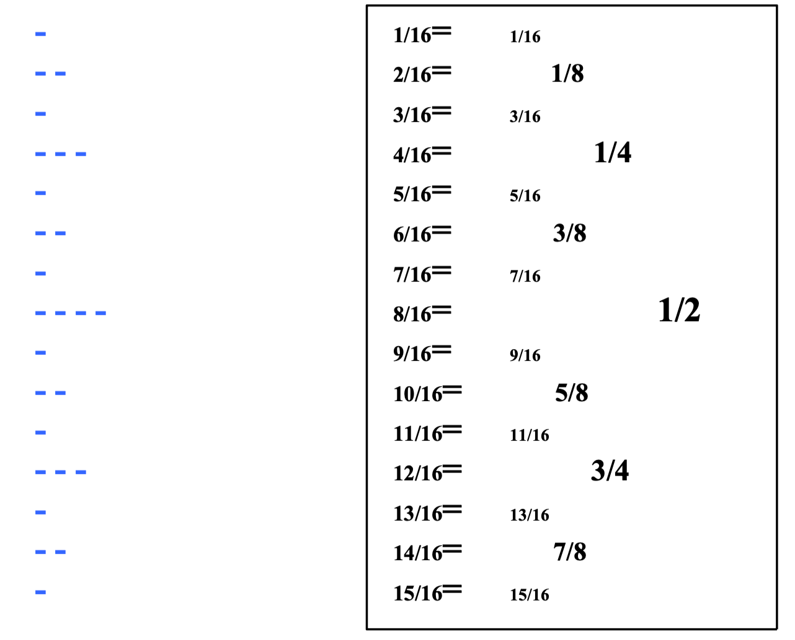

## Question 1

::: tabs

@tab EN

You are given 2 implementations for a recursive algorithm that calculates the sum of all the elements in a list (of integers):

```python
def sum_lst1(lst):
    if len(lst) == 1:
        return lst[0]
    else:
        rest = sum_lst1(lst[1:])
        sum = lst[0] + rest
        return sum


def sum_lst2(lst, low, high):
    if low == high:
        return lst[low]
    else:
        rest = sum_lst2(lst, low + 1, high)
        sum = lst[low] + rest
        return sum
```

Note: The implementations differ in the parameters we pass to these functions:

- In the first version we pass only the list (all the elements in the list have to be taken in to account for the result).
- In the second version, in addition to the list, we pass two indices:low and high (low ≤ high), which indicate the range of indices of the elements that should to be considered. The initial values (for the first call) passed to low and high would represent the range of the entire list.

1. Makesureyouunderstandtherecursiveideaofeachimplementation.
2. Analyze the running time of the implementations above.For each version:
    1. Draw the recursion tree that represents the execution process of the function, and the local-cost of each call.
    2. Concludethetotal(asymptotic)runningtimeofthefunction.
3. Whichversionisasymptoticallyfaster?

@tab dh-2

```python
        sum([a,b,c,d])
      /      |      \
   a      sum([b,c,d])  
            /     |     \
         b       sum([c,d])
                  /    |    \
               c       sum([d])
                         |
                         d
```

@tab shy-3

考虑的列表是`[a, b, c, d]`。

1. `sum_lst1`的递归树：

```scss
sum_lst1([a, b, c, d])
|
|-- lst[0]: a
|
+---> sum_lst1([b, c, d])
|       |
|       |-- lst[0]: b
|       |
|       +---> sum_lst1([c, d])
|       |       |
|       |       |-- lst[0]: c
|       |       |
|       |       +---> sum_lst1([d])
|       |       |       |
|       |       |       |-- lst[0]: d
|       |       |       |
|       |       |       +---> return d
|       |       |
|       |       +---> return c + d
|       |
|       +---> return b + (c + d)
|
+---> return a + (b + (c + d))
```

2. `sum_lst2`的递归树：

```scss
sum_lst2([a, b, c, d], 0, 3)
|
|-- lst[low]: a
|
+---> sum_lst2([a, b, c, d], 1, 3)
|       |
|       |-- lst[low]: b
|       |
|       +---> sum_lst2([a, b, c, d], 2, 3)
|       |       |
|       |       |-- lst[low]: c
|       |       |
|       |       +---> sum_lst2([a, b, c, d], 3, 3)
|       |       |       |
|       |       |       |-- lst[low]: d
|       |       |       |
|       |       |       +---> return d
|       |       |
|       |       +---> return c + d
|       |
|       +---> return b + (c + d)
|
+---> return a + (b + (c + d))
```

:::

## Question 2

::: tabs

@tab EN

Analyze the running time of each of the following functions. For each function:

1. Draw the recursion tree that represents the execution process, and the cost of each call.
2. Conclude the total (asymptotic) running time.

Note: For the simplicity of the analysis of sections (b) and (c), you may assume that n is a power of 2, therefore it can always be divided evenly by 2.

a.

```python
def fun1(n):
    if n == 0:
        return 1
    else:
        part1 = fun1(n - 1)
        part2 = fun1(n - 1)
        res = part1 + part2
        return res
```

b. 

```python
def fun2(n):
    if n == 0:
        return 1
    else:
        res = fun2(n // 2)
        res += n
        return res
```

c.

```python
def fun3(n):
    if n == 0:
        return 1
    else:
        res = fun3(n // 2)
        for i in range(1, n + 1):
            res += i
        return res
```

@tab DH

a. 

```python
                 fun1(n)
               /         \
        fun1(n-1)       fun1(n-1)
         /    \           /     \
 fun1(n-2) fun1(n-2)  fun1(n-2) fun1(n-2)
 ...       ...        ...       ...
```

$$
T(n) = 2^0 + 2^1 + 2^2 + ... + 2^n
$$

b. 

```python
          fun2(n)
          /   
    fun2(n/2)   
```

$$
O(n + \frac{n}{2} + \frac{n}{4} + ... + 1) = O(n)
$$

```python
            fun2(n)
              |
           fun2(n/2)
              |
           fun2(n/4)
              |
            ...
              |
           fun2(0)
```

c.

```python
            fun3(n)       <= costs O(n)
              |
           fun3(n/2)      <= costs O(n/2)
              |
           fun3(n/4)      <= costs O(n/4)
              |
            ...
              |
           fun3(0)        <= costs O(1)
```

$$
T(n) = T(\frac{n}{2}) + n
$$


:::

## Question 3

::: tabs

@tab EN

Give a **recursive** implement to the following functions:

a. `def print_triangle(n)`

This function is given a positive integer n, and prints a textual image of a right triangle (aligned to the left) made of *n* lines with asterisks.

For example, `print_triangle(4)`, should print:

```python
*
** 
*** 
****
```

b. `def print_oposite_triangles(n)`

This function is given a positive integer n, and prints a textual image of a two opposite right triangles (aligned to the left) with asterisks, each containing *n* lines.

For example, `print_oposite_triangles(4)`, should print:

```python
****
***
**
*
*
** 
*** 
****
```

c. `def print_ruler(n)`

This function is given a positive integer n, and prints a vertical ruler of $2^n − 1$ lines. Each line contains ‘-‘ marks as follows:

- The line in the middle $(\frac{1}{n})$ of the ruler contains *n* ‘-‘ marks
- The lines at the middle of each half $(\frac{1}{4})$ and $(\frac{3}{4})$ of the ruler contains ($n-1$) ‘-‘ marks
- The lines at the $\frac{1}{8},\frac{3}{8},\frac{5}{8}$ and $\frac{7}{8}$ of the ruler contains $(n - 2)$ ‘-‘ marks
- Andsoon...
- The lines at the $\frac{1}{2^k},\frac{3}{2^k},...,\frac{2^k - 1}{2^k}$ of the ruler contains *1* ‘-‘mark

For example, `print_ruler(4)`, should print (only the blue marks):



Hints:

1. Take for n=4: when finding `print_ruler(4)`, try to think first **what** `print_ruler(3)` does, and how you can use it to print a ruler of size 4.Then, generally identify what `print_ruler(n-1)` is **supposed** to print, and use that in order to define how to print the ruler of size n.
2. You may want to have more than one recursive call
3. It looks much scarier than it actually is

@tab DH

a.

```python
def print_triangle(n):
    if n == 0:
        return
    print_triangle(n - 1)
    print('*' * n)
```

b.

```python
def print_oposite_triangles(n):
    if n > 0:
        print("*" * n)
        print_oposite_triangles(n - 1)
    if n < 4:
        print("*" * (n + 1))


print_oposite_triangles(4)
```

c.

```python
def print_ruler(n):
    if n == 1:
        print('-')
        return
    # 递归地打印前一半
    print_ruler(n-1)
    # 打印中间的'-'
    print('-' * n)
    # 递归地打印后一半
    print_ruler(n-1)

# 测试
print_ruler(4)
```


:::

## Question 4

Give a **recursive** implement to the following function:

`def list_min(lst, low, high)`

The function is given `lst`, a list of integers, and two indices: `low` and `high` ($low \leq high$), which indicate the range of indices that need to be considered.

The function should find and return the minimum value out of all the elements at the position *low, low+1, ..., high* in lst.

```python
def list_min(lst, low, high):
    # 如果 low 等于 high，那么我们只有一个元素需要考虑，直接返回它。
    if low == high:
        return lst[low]
    
    # 把问题分为两部分：左半部分和右半部分。
    mid = (low + high) // 2

    # 找出左半部分的最小值和右半部分的最小值。
    left_min = list_min(lst, low, mid)
    right_min = list_min(lst, mid + 1, high)
    
    # 返回两部分中的较小值。
    return min(left_min, right_min)
```

## Question 5

Give a **recursive** implement to the following functions:

a. `def count_lowercase(s, low, high):`

The function is given a string `s`, and two indices: `low` and `high` ($low \leq high$),which indicate the range of indices that need to be considered.

The function should return the number of lowercase letters at the positions low,low+1,...,high in `s`.

b. `def is_number_of_lowercase_even(s, low, high):`

The function is given a string s, and two indices: `low` and `high` ($low \leq high$), which indicate the range of indices that need to be considered.

The function should return `True` if there are even number of lowercase letters at the positions *low, low+1, ..., high* in s, or False otherwise.

a. `count_lowercase` 函数：

```python
def count_lowercase(s, low, high):
    # 基本情况：如果low和high相同，只检查这一个字符是否为小写字母
    if low == high:
        return 1 if s[low].islower() else 0
    
    # 分解：将问题分解为两个较小的部分
    mid = (low + high) // 2
    left_count = count_lowercase(s, low, mid)     # 左半部分的小写字母数量
    right_count = count_lowercase(s, mid + 1, high)  # 右半部分的小写字母数量
    
    # 合并：合并两个部分的结果
    return left_count + right_count
```

b. `is_number_of_lowercase_even` 函数：

```python
def is_number_of_lowercase_even(s, low, high):
    # 使用上面的count_lowercase函数来获取小写字母的数量
    count = count_lowercase(s, low, high)
    
    # 检查数量是否为偶数
    return count % 2 == 0
```


## Question 6

Give a **recursive** implement to the following function:

`def appearances(s, low, high)`


::: details 公众号：AI悦创【二维码】


:::

::: info AI悦创·编程一对一

AI悦创·推出辅导班啦，包括「Python 语言辅导班、C++ 辅导班、java 辅导班、算法/数据结构辅导班、少儿编程、pygame 游戏开发、Web、Linux」，全部都是一对一教学：一对一辅导 + 一对一答疑 + 布置作业 + 项目实践等。当然，还有线下线上摄影课程、Photoshop、Premiere 一对一教学、QQ、微信在线，随时响应！微信：Jiabcdefh

C++ 信息奥赛题解，长期更新！长期招收一对一中小学信息奥赛集训，莆田、厦门地区有机会线下上门，其他地区线上。微信：Jiabcdefh

方法一：[QQ](http://wpa.qq.com/msgrd?v=3&uin=1432803776&site=qq&menu=yes)

方法二：微信：Jiabcdefh

:::


