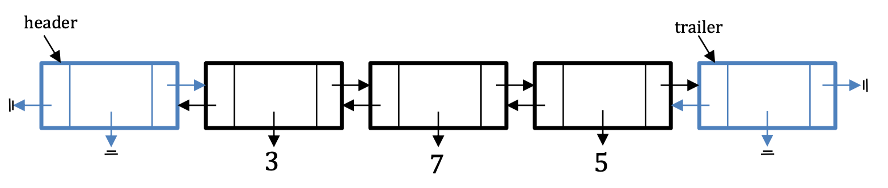
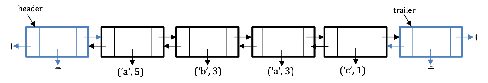

## Question 1

Define a LinkedQueue class that implements the *Queue* ADT.

**Implementation Requirement**: All queue operations should run in $\theta(1)$ **worst-case**.

**Hint:** You would want to use a doubly linked list as a data member.

::: code-tabs

@tab Code1

```python
from DoublyLinkedList import DoublyLinkedList
class LinkedQueue:
    def __init__(self):
        # 初始化一个空的双向链表
        # 这个链表用来存储队列中的元素
        self._data = DoublyLinkedList()
        self._size = 0  # 队列的大小初始化为 0

    def __len__(self):
        # 返回队列的长度
        return self._size

    def is_empty(self):
        # 检查队列是否为空
        return self._size == 0

    def first(self):
        # 返回队列的第一个元素，但不移除它
        if self.is_empty():
            raise Exception('Queue is empty')  # 如果队列为空，则抛出异常
        # 访问头部哨兵节点的下一个节点即第一个元素的节点，并返回其存储的数据
        return self._data.header.next.data

    def enqueue(self, element):
        # 将一个元素加入队列的末尾
        new_node = DoublyLinkedList.Node(element)  # 创建一个新节点
        # 将新节点插入尾部哨兵节点前面
        new_node.prev = self._data.trailer.prev
        new_node.next = self._data.trailer
        self._data.trailer.prev.next = new_node
        self._data.trailer.prev = new_node
        self._size += 1  # 更新队列大小

    def dequeue(self):
        # 移除并返回队列的第一个元素
        if self.is_empty():
            raise Exception('Queue is empty')  # 如果队列为空，则抛出异常
        old_head = self._data.header.next  # 获取头部哨兵节点的下一个节点，即队列的第一个元素
        # 重新链接头部哨兵节点和第一个元素的下一个节点
        self._data.header.next = old_head.next
        old_head.next.prev = self._data.header
        self._size -= 1  # 更新队列大小
        return old_head.data  # 返回移除的元素
```

@tab Code2

```python
class LinkedQueue:
    def __init__(self):
        # 初始化一个空的双向链表
        self._data = DoublyLinkedList()

    def __len__(self):
        # 返回队列的长度
        return self._data.size

    def is_empty(self):
        # 检查队列是否为空
        return self._data.is_empty()

    def first(self):
        # 返回队列的第一个元素，但不移除它
        if self.is_empty():
            raise Exception('Queue is empty')
        # 访问头部哨兵节点的下一个节点即第一个元素的节点，并返回其存储的数据
        return self._data.header.next.data

    def enqueue(self, element):
        # 使用双向链表的 add_last 方法在链表尾部添加一个新元素
        self._data.add_last(element)

    def dequeue(self):
        # 移除并返回队列的第一个元素
        if self.is_empty():
            raise Exception('Queue is empty')
        # 使用双向链表的 delete_first 方法移除并返回第一个元素
        return self._data.delete_first()
```

@tab Code3

```python
from DoublyLinkedList import DoublyLinkedList

class LinkedQueue:
    def __init__(self):
        self.item = DoublyLinkedList()

    def is_empty(self):
        return self.item.is_empty()

    def __len__(self):
        return len(self.item)

    def enqueue(self,x):
        self.item.add_last(x)

    def dequeue(self):
        if self.is_empty():
            raise IndexError("Empty")

        return self.item.delete_first()

    def first(self):
        if self.is_empty():
            raise IndexError("Empty")

        # 返回队列的第一个元素的值
        return self.item.header.next.data
```


:::

## Question 2

Many programming languages represent integers in a **fixed** number of bytes (a common size for an integer is 4 bytes). This, on one hand, bounds the range of integers that can be represented as an `int` data (in 4 bytes, only $2^{32}$ different values could be represented), but, on the other hand, it allows fast execution for basic arithmetic expressions (such as `+`, `-`, `*` and `/`) typically done in hardware.

Python and some other programming languages, do not follow that kind of representation for integers, and allows to represent arbitrary large integers as `int` variables (as a result the performance of basic arithmetic is slower).

In this question, we will suggest a data structure for positive integer numbers, that can be arbitrary large.

We will represent an integer value, as a linked list of its digits.

For example, the number 375 will be represented by a 3-length list, with 3, 7 and 5 as its elements.



Note: this is not the representation Python uses. Complete the definition of the following `Integer` class:

```python
class Integer:
    def __init__(self, num_str):
        """Initializes an Integer object representing
        the value given in the string num_str
        """
    def __add__(self, other):
        """Creates and returns an Integer object that
        represent the sum of self and other, also of
        type Integer
        """
    def __repr__(self):
        """Creates and returns the string representation
        of self
        """
```

For example, after implementing the Integer class, you should expect the following behavior:

```python
>>> n1 = Integer('375')
>>> n2 = Integer('4029')
>>> n3 = n1 + n2
>>> n3
4404
```

Note: When adding two `Integer` objects, implement the “Elementary School” addition technique. DO NOT convert the `Integer` objects to ints, add these ints by using Python + operator, and then convert the result back to an `Integer` object. This approach misses the point of this question.

**Extra Credit:**

Support also the multiplication of two Integer objects (by implementing the “Elementary School” multiplication technique):

```python
def __mul__(self, other):
    """Creates and returns an Integer object that
    represent the multiplication of self and other,
    also of type Integer
    """
```

::: code-tabs

@tab Code1

```python
class Node:
    def __init__(self, value):
        self.value = value
        self.next = None

class Integer:
    def __init__(self, num_str):
        self.head = None
        for digit in num_str:
            if not self.head:
                self.head = Node(int(digit))
            else:
                new_node = Node(int(digit))
                new_node.next = self.head
                self.head = new_node

    def __add__(self, other):
        result_head = Node(0)
        current = result_head
        carry = 0
        p1, p2 = self.head, other.head

        while p1 or p2 or carry:
            val1 = (p1.value if p1 else 0)
            val2 = (p2.value if p2 else 0)
            sum_val = val1 + val2 + carry

            carry = sum_val // 10
            current.next = Node(sum_val % 10)
            current = current.next

            if p1:
                p1 = p1.next
            if p2:
                p2 = p2.next

        return Integer(self._to_string(result_head.next))

    def __mul__(self, other):
        result = [0] * (self._length() + other._length())

        p1, p2 = self.head, other.head
        i = 0
        while p1:
            carry = 0
            j = i
            p2 = other.head
            while p2:
                result[j] += carry + p1.value * p2.value
                carry = result[j] // 10
                result[j] %= 10
                p2 = p2.next
                j += 1
            if carry > 0:
                result[j] += carry
            p1 = p1.next
            i += 1

        # 移除前导零
        while len(result) > 1 and result[-1] == 0:
            result.pop()

        return Integer(''.join(map(str, result[::-1])))

    def __repr__(self):
        return self._to_string(self.head)

    # def _to_string(self, node):
    #     digits = []
    #     while node:
    #         digits.append(str(node.value))
    #         node = node.next
    #     return ''.join(reversed(digits))
    def _to_string(self, node):
        """ 从链表生成字符串表示的帮助函数 """
        digits = []
        leading_zero = True
        while node:
            if node.value != 0 or not leading_zero:
                digits.append(str(node.value))
                leading_zero = False
            node = node.next
        return ''.join(reversed(digits)) if digits else '0'

    def _length(self):
        length = 0
        current = self.head
        while current:
            length += 1
            current = current.next
        return length
```

@tab Code2

```python
class Node:
    """链表节点类，用于存储数字的单个位"""
    def __init__(self, value):
        self.value = value  # 节点存储的值
        self.next = None  # 指向下一个节点的指针

class Integer:
    def __init__(self, num_str):
        """初始化表示整数的链表"""
        self.head = None  # 链表的头节点
        for digit in reversed(num_str):  # 反向遍历字符串，确保链表顺序正确
            new_node = Node(int(digit))  # 创建一个新节点
            new_node.next = self.head  # 新节点指向当前头节点
            self.head = new_node  # 更新头节点为新节点

    def __add__(self, other):
        """实现两个 Integer 对象的加法"""
        result_head = Node(0)  # 创建一个哨兵节点作为结果的头节点
        current = result_head  # 当前处理的节点
        carry = 0  # 进位
        p1, p2 = self.head, other.head  # 分别指向两个数的头节点

        # 遍历两个链表，同时处理进位
        while p1 or p2 or carry:
            val1 = (p1.value if p1 else 0)
            val2 = (p2.value if p2 else 0)
            sum_val = val1 + val2 + carry

            carry = sum_val // 10  # 计算新的进位
            current.next = Node(sum_val % 10)  # 创建新节点存储求和结果的个位
            current = current.next

            # 移动指针
            if p1:
                p1 = p1.next
            if p2:
                p2 = p2.next

        # 转换结果链表为 Integer 对象
        return Integer(self._to_string(result_head.next))

    def __repr__(self):
        """返回字符串形式的整数表示"""
        return self._to_string(self.head)

    def _to_string(self, node):
        """从链表生成字符串表示的帮助函数"""
        digits = []
        leading_zero = True  # 标志位，用于检测前导零
        while node:
            if node.value != 0 or not leading_zero:
                digits.append(str(node.value))
                leading_zero = False
            node = node.next
        return ''.join(reversed(digits)) if digits else '0'  # 处理完全为零的情况

    def _length(self):
        """计算链表的长度"""
        length = 0
        current = self.head
        while current:
            length += 1
            current = current.next
        return length
```

@tab Code3

```python
class Node:
    """ 链表节点，用于存储数字的单个位 """
    def __init__(self, value):
        self.value = value  # 存储单个数字
        self.next = None  # 指向下一个节点的指针

class Integer:
    def __init__(self, num_str):
        """ 初始化表示整数的链表 """
        self.head = None  # 链表的头节点
        for digit in reversed(num_str):
            # 逆序处理数字字符串，以便链表的头部是最低位
            new_node = Node(int(digit))
            new_node.next = self.head
            self.head = new_node

    def __add__(self, other):
        """ 实现两个 Integer 对象的加法 """
        result_head = Node(0)  # 创建结果链表的头节点
        current = result_head  # 当前处理的节点
        carry = 0  # 进位
        p1, p2 = self.head, other.head  # 两个加数的当前位

        while p1 or p2 or carry:
            # 当两个加数或进位有剩余时继续处理
            val1 = (p1.value if p1 else 0)
            val2 = (p2.value if p2 else 0)
            sum_val = val1 + val2 + carry  # 计算当前位的和

            carry = sum_val // 10  # 更新进位
            current.next = Node(sum_val % 10)  # 创建新节点存储当前位的结果
            current = current.next  # 移动到下一个节点

            # 移动到下一个位
            if p1:
                p1 = p1.next
            if p2:
                p2 = p2.next

        return Integer(self._to_string(result_head.next))  # 将结果链表转换为 Integer 对象

    def __mul__(self, other):
        """ 实现两个 Integer 对象的乘法 """
        result = [0] * (self._length() + other._length())  # 初始化乘法结果的存储空间

        p1, p2 = self.head, other.head
        i = 0
        while p1:
            carry = 0
            j = i
            p2 = other.head
            while p2:
                # 对每一位相乘并处理进位
                result[j] += carry + p1.value * p2.value
                carry = result[j] // 10
                result[j] %= 10
                p2 = p2.next
                j += 1
            if carry > 0:
                result[j] += carry
            p1 = p1.next
            i += 1

        # 移除前导零
        while len(result) > 1 and result[-1] == 0:
            result.pop()

        return Integer(''.join(map(str, result[::-1])))  # 将结果列表转换为 Integer 对象

    def __repr__(self):
        """ 返回字符串形式的整数表示 """
        return self._to_string(self.head)

    def _to_string(self, node):
        """ 从链表生成字符串表示的帮助函数 """
        digits = []
        while node:
            digits.append(str(node.value))
            node = node.next
        return ''.join(reversed(digits))  # 将链表中的数字转换为字符串

    def _length(self):
        """ 计算链表的长度 """
        length = 0
        current = self.head
        while current:
            length += 1
            current = current.next
        return length
```

@tab Code4

```python
class Node:
    def __init__(self, value):
        self.value = value
        self.next = None

class Integer:
    def __init__(self, num_str):
        self.head = None
        for digit in num_str:
            if not self.head:
                self.head = Node(int(digit))
            else:
                new_node = Node(int(digit))
                new_node.next = self.head
                self.head = new_node

    def __add__(self, other):
        result_head = Node(0)
        current = result_head
        carry = 0
        p1, p2 = self.head, other.head

        while p1 or p2 or carry:
            val1 = (p1.value if p1 else 0)
            val2 = (p2.value if p2 else 0)
            sum_val = val1 + val2 + carry

            carry = sum_val // 10
            current.next = Node(sum_val % 10)
            current = current.next

            if p1:
                p1 = p1.next
            if p2:
                p2 = p2.next

        return Integer(self._to_string(result_head.next))

    def __mul__(self, other):
        result = [0] * (self._length() + other._length())

        p1, p2 = self.head, other.head
        i = 0
        while p1:
            carry = 0
            j = i
            p2 = other.head
            while p2:
                result[j] += carry + p1.value * p2.value
                carry = result[j] // 10
                result[j] %= 10
                p2 = p2.next
                j += 1
            if carry > 0:
                result[j] += carry
            p1 = p1.next
            i += 1

        # 移除前导零
        while len(result) > 1 and result[-1] == 0:
            result.pop()

        return Integer(''.join(map(str, result[::-1])))

    def __repr__(self):
        return self._to_string(self.head)

    def _to_string(self, node):
        digits = []
        while node:
            digits.append(str(node.value))
            node = node.next
        return ''.join(reversed(digits))

    def _length(self):
        length = 0
        current = self.head
        while current:
            length += 1
            current = current.next
        return length
```

@tab DH1

```python
class Node:
    def __init__(self, value):
        self.value = value
        self.next = None

class Integer:
    def __init__(self, num_str):
        """Initializes an Integer object representing
        the value given in the string num_str
        """
        self.head = None
        for char in num_str:
            if self.head is None:
                self.head = Node(int(char))
                current = self.head
            else:
                current.next = Node(int(char))
                current = current.next

    def __add__(self, other):
        """Creates and returns an Integer object that
        represent the sum of self and other, also of
        type Integer
        """
        self_current = self._get_last()
        other_current = other._get_last()
        carry = 0
        result_head = None

        while self_current or other_current or carry:
            self_value = self_current.value if self_current else 0
            other_value = other_current.value if other_current else 0
            total = self_value + other_value + carry
            carry = total // 10
            if result_head is None:
                result_head = Node(total % 10)
                result_current = result_head
            else:
                result_current.next = Node(total % 10)
                result_current = result_current.next

            if self_current:
                self_current = self._get_previous(self_current)
            if other_current:
                other_current = other._get_previous(other_current)

        return Integer(self._list_to_string(result_head))

    def __mul__(self, other):
        """Creates and returns an Integer object that
        represent the multiplication of self and other,
        also of type Integer
        """
        self_digits = self._to_list()
        other_digits = other._to_list()
        result = [0] * (len(self_digits) + len(other_digits))

        for i in range(len(self_digits) - 1, -1, -1):
            for j in range(len(other_digits) - 1, -1, -1):
                result[i + j + 1] += self_digits[i] * other_digits[j]
                result[i + j] += result[i + j + 1] // 10
                result[i + j + 1] %= 10

        # Remove leading zeros
        while len(result) > 1 and result[0] == 0:
            result.pop(0)

        return Integer(''.join(map(str, result)))

    def __repr__(self):
        """Creates and returns the string representation
        of self
        """
        return self._list_to_string(self.head)

    def _get_last(self):
        """Gets the last node of the linked list"""
        current = self.head
        while current.next is not None:
            current = current.next
        return current

    def _get_previous(self, node):
        """Finds the previous node given a node"""
        current = self.head
        prev = None
        while current.next and current is not node:
            prev = current
            current = current.next
        return prev

    def _list_to_string(self, node):
        """Converts the linked list to string"""
        values = []
        while node:
            values.append(str(node.value))
            node = node.next
        return ''.join(values[::-1])  # reverse the list to get the correct order

    def _to_list(self):
        """Converts the linked list to a list of digits"""
        result = []
        current = self.head
        while current:
            result.append(current.value)
            current = current.next
        return result[::-1]  # reverse the list to get the correct order

# Example usage:
n1 = Integer('375')
n2 = Integer('4029')
n3 = n1 + n2

# n4 will be the result of multiplication
n4 = n1 * n2

n3, n4.__repr__()

```

@tab DH2

```python
class Node:
    def __init__(self, value):
        self.value = value  # Node value
        self.next = None  # Next node in the linked list

class Integer:
    def __init__(self, num_str):
        """ 初始化一个代表给定字符串 num_str 值的 Integer 对象 """
        self.head = None  # 链表的起始节点
        # 遍历字符串中的每个字符
        for char in num_str:
            if self.head is None:
                # 如果链表为空，我们创建头节点
                self.head = Node(int(char))
                current = self.head
            else:
                # 否则，我们在链表中添加一个新节点
                current.next = Node(int(char))
                current = current.next

    def __add__(self, other):
        """ 创建并返回一个 Integer 对象，代表 self 和 other 的和，other 也是 Integer 类型 """
        # 从最低有效位开始
        self_current = self._get_last()
        other_current = other._get_last()
        carry = 0  # 加法的进位
        result_head = None  # 结果链表的头节点

        # 只要有数字或进位，就进行迭代
        while self_current or other_current or carry:
            self_value = self_current.value if self_current else 0
            other_value = other_current.value if other_current else 0
            # 计算两个数字和进位的和
            total = self_value + other_value + carry
            carry = total // 10  # 更新进位
            if result_head is None:
                # 如果结果头节点不存在，则创建它
                result_head = Node(total % 10)
                result_current = result_head
            else:
                # 将结果数字添加到链表中
                result_current.next = Node(total % 10)
                result_current = result_current.next

            # 移动到下一个更高位的数字
            if self_current:
                self_current = self._get_previous(self_current)
            if other_current:
                other_current = other._get_previous(other_current)

        # 将链表转换回 Integer 对象
        return Integer(self._list_to_string(result_head))

    def __mul__(self, other):
        """ 创建并返回一个 Integer 对象，代表 self 和 other 的乘积，other 也是 Integer 类型 """
        # 将链表转换为反向数字列表
        self_digits = self._to_list()
        other_digits = other._to_list()
        # 准备结果数组并填充零
        result = [0] * (len(self_digits) + len(other_digits))

        # 用 self 的每个数字乘以 other 的每个数字
        for i in range(len(self_digits) - 1, -1, -1):
            for j in range(len(other_digits) - 1, -1, -1):
                result[i + j + 1] += self_digits[i] * other_digits[j]
                # 处理进位
                result[i + j] += result[i + j + 1] // 10
                result[i + j + 1] %= 10

        # 从结果中移除前导零
        while len(result) > 1 and result[0] == 0:
            result.pop(0)

        # 将数字列表转换回 Integer 对象
        return Integer(''.join(map(str, result)))

    def __repr__(self):
        """ 创建并返回 self 的字符串表示形式 """
        # 将链表转换为字符串
        return self._list_to_string(self.head)

    def _get_last(self):
        """ 获取链表的最后一个节点 """
        current = self.head
        # 遍历到链表的末尾
        while current.next is not None:
            current = current.next
        return current

    def _get_previous(self, node):
        """ 给定一个节点，找到它的前一个节点 """
        current = self.head
        prev = None
        while current.next and current is not node:
            prev = current
            current = current.next
        return prev

    def _list_to_string(self, node):
        """ 将链表转换为字符串 """
        values = []
        while node:
            values.append(str(node.value))
            node = node.next
        return ''.join(values[::-1])  # 反转列表以获得正确的顺序

    def _to_list(self):
        """ 将链表转换为数字列表 """
        result = []
        current = self.head
        while current:
            result.append(current.value)
            current = current.next
        return result[::-1]  # 反转列表以获得正确的顺序
```

@tab DH3

```python
# Correcting the __mul__ method of the Integer class to fix the issue with multiplication

class Integer:
    def __init__(self, num_str):
        """Initializes an Integer object representing
        the value given in the string num_str
        """
        # Creating the linked list in reverse order to ease addition and multiplication operations
        self.head = None
        for char in reversed(num_str):
            if self.head is None:
                self.head = Node(int(char))
                current = self.head
            else:
                current.next = Node(int(char))
                current = current.next

    def __add__(self, other):
        """Creates and returns an Integer object that
        represent the sum of self and other, also of
        type Integer
        """
        self_current = self.head
        other_current = other.head
        carry = 0
        result_head = None

        while self_current or other_current or carry:
            self_value = self_current.value if self_current else 0
            other_value = other_current.value if other_current else 0
            total = self_value + other_value + carry
            carry = total // 10
            if result_head is None:
                result_head = Node(total % 10)
                result_current = result_head
            else:
                result_current.next = Node(total % 10)
                result_current = result_current.next

            if self_current:
                self_current = self_current.next
            if other_current:
                other_current = other_current.next

        return Integer(self._list_to_string(result_head))

    def __mul__(self, other):
        """Creates and returns an Integer object that
        represent the multiplication of self and other,
        also of type Integer
        """
        # Convert the linked list to a list of digits (in reverse order)
        self_digits = self._to_list()
        other_digits = other._to_list()
        result = [0] * (len(self_digits) + len(other_digits))

        # Perform multiplication digit by digit
        for i in range(len(self_digits)):
            carry = 0
            for j in range(len(other_digits)):
                result[i + j] += self_digits[i] * other_digits[j] + carry
                carry = result[i + j] // 10
                result[i + j] %= 10
            result[i + len(other_digits)] += carry

        # Remove leading zeros from the result
        while len(result) > 1 and result[-1] == 0:
            result.pop()

        # Convert the result list to a string, reversing it to get the correct order
        result_str = ''.join(map(str, result[::-1]))
        return Integer(result_str)

    def __repr__(self):
        """Creates and returns the string representation
        of self
        """
        return self._list_to_string(self.head)

    def _list_to_string(self, node):
        """Converts the linked list to string"""
        values = []
        while node:
            values.append(str(node.value))
            node = node.next
        return ''.join(values[::-1])  # reverse the list to get the correct order

    def _to_list(self):
        """Converts the linked list to a list of digits"""
        result = []
        current = self.head
        while current:
            result.append(current.value)
            current = current.next
        return result  # no need to reverse since the list is stored in reverse

# Testing the corrected multiplication
n1 = Integer('3')
n2 = Integer('6')
n3 = n1 * n2

n3.__repr__()  # Should output '18'

```

@tab DH4-全部正确

```python
class Node:
    def __init__(self, value):
        self.value = value
        self.next = None

class Integer:
    def __init__(self, num_str):
        """初始化一个表示字符串 num_str 给出的值的 Integer 对象"""
        num_str = num_str.lstrip('0') or '0'  # 去除前导零
        self.head = None
        for char in reversed(num_str):  # 链表中的数字逆序存储，以便于操作
            if self.head is None:
                self.head = Node(int(char))
                current = self.head
            else:
                current.next = Node(int(char))
                current = current.next

    def __add__(self, other):
        """返回一个表示 self 与 other 之和的 Integer 对象"""
        self_current = self.head
        other_current = other.head
        carry = 0
        result_head = None
        result_current = None

        while self_current or other_current or carry:
            self_value = self_current.value if self_current else 0
            other_value = other_current.value if other_current else 0
            total = self_value + other_value + carry
            carry = total // 10
            new_node = Node(total % 10)

            if result_head is None:
                result_head = new_node
            else:
                result_current.next = new_node

            result_current = new_node

            if self_current:
                self_current = self_current.next
            if other_current:
                other_current = other_current.next

        return Integer(self._list_to_string(result_head))

    def __mul__(self, other):
        """返回一个表示 self 与 other 乘积的 Integer 对象"""
        self_digits = self._to_list()
        other_digits = other._to_list()
        result = [0] * (len(self_digits) + len(other_digits))

        for i in range(len(self_digits)):
            carry = 0
            for j in range(len(other_digits)):
                result[i + j] += self_digits[i] * other_digits[j] + carry
                carry = result[i + j] // 10
                result[i + j] %= 10
            result[i + len(other_digits)] += carry

        while len(result) > 1 and result[-1] == 0:
            result.pop()

        result_str = ''.join(map(str, result[::-1]))
        return Integer(result_str)

    def __repr__(self):
        """返回 self 的字符串表示形式"""
        return self._list_to_string(self.head)

    def _list_to_string(self, node):
        """将链表转换为字符串"""
        values = []
        while node:
            values.append(str(node.value))
            node = node.next
        return ''.join(values[::-1]).lstrip('0') or '0'

    def _to_list(self):
        """将链表转换为数字列表"""
        result = []
        current = self.head
        while current:
            result.append(current.value)
            current = current.next
        return result

# 示例用法：
n1 = Integer('375')
n2 = Integer('4029')
n3 = n1 + n2  # 加法
n4 = n1 * n2  # 乘法

# __repr__ 方法的输出
n3_repr = n3.__repr__()
n4_repr = n4.__repr__()

n3_repr, n4_repr  # 预期的 n3 和 n4 操作后的输出

```


:::

## Question 3

In this question, we will suggest a data structure for storing strings with a lot of repetitions of successive characters.

We will represent such strings as a linked list, where each maximal sequence of the same character in consecutive positions, will be stored as a single tuple containing the character and its count.

For example, the string “aaaaabbbaaac” will be represented as the following list:



Complete the definition of the following `CompactString` class:

```python
class CompactString:
    def __init__(self, orig_str):
        """Initializes a CompactString object
        representing the string given in orig_str"""
        
    def __add__(self, other):
        """Creates and returns a CompactString object that
        represent the concatenation of self and other,
        also of type CompactString
        """
        
    def __lt__(self, other):
        """returns True if”f self is lexicographically
        less than other, also of type CompactString
        """
        
    def __le__(self, other):
        """returns True if”f self is lexicographically
        less than or equal to other, also of type CompactString
        """
        
    def __gt__(self, other):
        """returns True if”f self is lexicographically
        greater than other, also of type CompactString
        """
        
    def __ge__(self, other):
        """returns True if”f self is lexicographically
        greater than or equal to other, also of type CompactString
        """
        
    def __repr__(self):
        """Creates and returns the string representation
        (of type str) of self
        """
```

For example, after implementing the CompactString class, you should expect the following behavior:

```python
>>> s1 = CompactString('aaaaabbbaaac')
>>> s2 = CompactString('aaaaaaacccaaaa')
>>> s3 = s2 + s1 #in s3’s linked list there will be 6 ’real’ nodes
>>> s1 < s2
False
```

Note: Here too, when adding and comparing two `CompactString` objects, DO NOT convert the `CompactString` objects to `str`s, do the operation on strs (by using Python `+`, `<`,` >`, `<=`, `>=` operators), and then convert the result back to a CompactString object. This approach misses the point of this question.

::: code-tabs

@tab Code1

```python
class CompactString:
    def __init__(self, orig_str):
        """Initializes a CompactString object"""
        self.compact_str = self._compact(orig_str)

    def _compact(self, orig_str):
        """Converts a string into its compact form"""
        if not orig_str:
            return []

        compact_list = []
        count = 1
        prev_char = orig_str[0]

        for char in orig_str[1:]:
            if char == prev_char:
                count += 1
            else:
                compact_list.append((prev_char, count))
                prev_char = char
                count = 1
        compact_list.append((prev_char, count))

        return compact_list

    # def __add__(self, other):
    #     """Adds two CompactString objects"""
    #     result_list = []
    #     index_self, index_other = 0, 0
    #
    #     while index_self < len(self.compact_str) and index_other < len(other.compact_str):
    #         char_self, count_self = self.compact_str[index_self]
    #         char_other, count_other = other.compact_str[index_other]
    #
    #         if char_self == char_other:
    #             result_list.append((char_self, count_self + count_other))
    #             index_self += 1
    #             index_other += 1
    #         elif char_self < char_other:
    #             result_list.append((char_self, count_self))
    #             index_self += 1
    #         else:
    #             result_list.append((char_other, count_other))
    #             index_other += 1
    #
    #     result_list.extend(self.compact_str[index_self:])
    #     result_list.extend(other.compact_str[index_other:])
    #
    #     result_str = ''.join([char * count for char, count in result_list])
    #     return CompactString(result_str)
    def __add__(self, other):
        """Adds two CompactString objects"""
        result_list = self.compact_str[:]
        other_list = other.compact_str[:]

        # Check if the last char of self and first char of other are the same
        if result_list and other_list and result_list[-1][0] == other_list[0][0]:
            last_char, last_count = result_list.pop()
            first_char_other, first_count_other = other_list.pop(0)
            merged_count = last_count + first_count_other
            result_list.append((last_char, merged_count))

        result_list.extend(other_list)
        result_str = ''.join([char * count for char, count in result_list])
        return CompactString(result_str)

    def __lt__(self, other):
        """Checks if self is less than other"""
        return str(self) < str(other)

    def __le__(self, other):
        """Checks if self is less than or equal to other"""
        return str(self) <= str(other)

    def __gt__(self, other):
        """Checks if self is greater than other"""
        return str(self) > str(other)

    def __ge__(self, other):
        """Checks if self is greater than or equal to other"""
        return str(self) >= str(other)

    def __repr__(self):
        """String representation of CompactString"""
        return ''.join([char * count for char, count in self.compact_str])

# s1 = CompactString('aaaaabbbaaac')
# s2 = CompactString('aaaaaaacccaaaa')
#
# test_results = {
#     "s1 + s2": str(s1 + s2),  # Expected: 'aaaaabbbaaacaaaaaaacccaaaa'
#     "s2 + s1": str(s2 + s1),  # Expected: 'aaaaaaacccaaaaaaaabbbaaac'
#     "s1 < s2": s1 < s2,       # Expected: False
#     "s2 < s1": s2 < s1,       # Expected: True
#     "s1 <= s2": s1 <= s2,     # Expected: False
#     "s2 <= s1": s2 <= s1,     # Expected: True
#     "s1 > s2": s1 > s2,       # Expected: True
#     "s2 > s1": s2 > s1,       # Expected: False
#     "s1 >= s2": s1 >= s2,     # Expected: True
#     "s2 >= s1": s2 >= s1,     # Expected: False
#     "__repr__ s1": repr(s1)   # Expected: 'aaaaabbbaaac'
# }
# #
# # test_results
s1 = CompactString('aaaaabbbaaac')
s2 = CompactString('aaaaaaacccaaaa')
print(s1 + s2)   # aaaaabbbaaacaaaaaaacccaaaa
print(s2 + s1)   # aaaaaaacccaaaaaaaaabbbaaac
print(s1 < s2)   # False
print(s2 < s1)   # True
print(s1 <= s2)  # False
print(s2 <= s1)  # True
print(s1 > s2)   # True
print(s2 > s1)   # False
print(s1 >= s2)  # True
print(s2 >= s1)  # False
print(str(s1 + s2) == "aaaaabbbaaacaaaaaaacccaaaa")
print(str(s2 + s1) == "aaaaaaacccaaaaaaaaabbbaaac")
```

@tab Code2

```python
class CompactString:
    def __init__(self, orig_str):
        # 类构造器：初始化CompactString对象
        # 调用_compact方法将原始字符串转换成紧凑形式
        self.compact_str = self._compact(orig_str)

    def _compact(self, orig_str):
        # 将字符串转换成紧凑形式
        # 紧凑形式是一个列表，每个元素是一个元组(char, count)
        if not orig_str:
            # 如果原始字符串为空，返回空列表
            return []

        compact_list = []  # 用于存储紧凑形式的列表
        count = 1  # 初始化计数器
        prev_char = orig_str[0]  # 记录第一个字符

        for char in orig_str[1:]:
            # 遍历原始字符串中的每个字符
            if char == prev_char:
                # 如果当前字符与前一个字符相同，增加计数
                count += 1
            else:
                # 如果字符改变，将前一个字符和计数添加到列表中
                compact_list.append((prev_char, count))
                prev_char = char  # 更新当前字符
                count = 1  # 重置计数器
        compact_list.append((prev_char, count))  # 添加最后一个字符和其计数

        return compact_list

    def __add__(self, other):
        # 实现两个CompactString对象的加法操作
        result_list = self.compact_str[:]  # 复制self的紧凑列表
        other_list = other.compact_str[:]  # 复制other的紧凑列表

        # 检查self的最后一个字符和other的第一个字符是否相同
        if result_list and other_list and result_list[-1][0] == other_list[0][0]:
            last_char, last_count = result_list.pop()  # 移除并获取self的最后一个元组
            first_char_other, first_count_other = other_list.pop(0)  # 移除并获取other的第一个元组
            merged_count = last_count + first_count_other  # 合并计数
            result_list.append((last_char, merged_count))  # 添加合并后的元组

        result_list.extend(other_list)  # 将other的剩余部分添加到结果列表中
        # 将紧凑列表转换成字符串
        result_str = ''.join([char * count for char, count in result_list])
        return CompactString(result_str)  # 返回新的CompactString对象

    def __lt__(self, other):
        # 实现小于比较
        # 比较两个CompactString对象的字符串表示是否self小于other
        return str(self) < str(other)

    def __le__(self, other):
        # 实现小于等于比较
        # 比较两个CompactString对象的字符串表示是否self小于等于other
        return str(self) <= str(other)

    def __gt__(self, other):
        # 实现大于比较
        # 比较两个CompactString对象的字符串表示是否self大于other
        return str(self) > str(other)

    def __ge__(self, other):
        # 实现大于等于比较
        # 比较两个CompactString对象的字符串表示是否self大于等于other
        return str(self) >= str(other)

    def __repr__(self):
        # 实现对象的“官方”字符串表示
        # 将紧凑列表转换成原始字符串形式
        return ''.join([char * count for char, count in self.compact_str])

# 示例用法
s1 = CompactString('aaaaabbbaaac')
s2 = CompactString('aaaaaaacccaaaa')
s3 = s1 + s2
print(s3)  # 预期输出: 'aaaaabbbaaacaaaaaaacccaaaa'
```

@tab Code3-DH✅

```python
class Node:
    def __init__(self, char, count):
        self.char = char
        self.count = count
        self.next = None

class CompactString:
    def __init__(self, orig_str):
        self.head = None
        self._create_compact_string(orig_str)
        
    def _create_compact_string(self, orig_str):
        current = None
        for char in orig_str:
            if current is None or char != current.char:
                new_node = Node(char, 1)
                if self.head is None:
                    self.head = new_node
                else:
                    current.next = new_node
                current = new_node
            else:
                current.count += 1

    def __add__(self, other):
        if self.head is None:
            return CompactString(str(other))
        
        if other.head is None:
            return CompactString(str(self))

        result_str = str(self) + str(other)
        return CompactString(result_str)

    def __lt__(self, other):
        return str(self) < str(other)

    def __le__(self, other):
        return str(self) <= str(other)

    def __gt__(self, other):
        return str(self) > str(other)

    def __ge__(self, other):
        return str(self) >= str(other)

    def __eq__(self, other):
        return str(self) == str(other)

    def __repr__(self):
        current = self.head
        result = []
        while current:
            result.append(f"('{current.char}', {current.count})")
            current = current.next
        return ' -> '.join(result)

    def __str__(self):
        current = self.head
        result = []
        while current:
            result.append(current.char * current.count)
            current = current.next
        return ''.join(result)

# Test the code
s1 = CompactString('aaaaabbbaaac')
s2 = CompactString('aaaaaaacccaaaa')
s3 = s1 + s2  # in s3’s linked list there will be 6 ’real’ nodes
s4 = s2 + s1  # in s4’s linked list there will be 6 ’real’ nodes

# Expected results
expected_results = {
    "s1 + s2": 'aaaaabbbaaacaaaaaaacccaaaa',
    "s2 + s1": 'aaaaaaacccaaaaaaaaabbbaaac',
    "s1 < s2": False,
    "s2 < s1": True,
    "s1 <= s2": False,
    "s2 <= s1": True,
    "s1 > s2": True,
    "s2 > s1": False,
    "s1 >= s2": True,
    "s2 >= s1": False,
    "__repr__ s1": "('a', 5) -> ('b', 3) -> ('a', 3) -> ('c', 1)"
}

# Actual results
test_results = {
    "s1 + s2": str(s3) == expected_results["s1 + s2"],
    "s2 + s1": str(s4) == expected_results["s2 + s1"],
    "s1 < s2": (s1 < s2) == expected_results["s1 < s2"],
    "s2 < s1": (s2 < s1) == expected_results["s2 < s1"],
    "s1 <= s2": (s1 <= s2) == expected_results["s1 <= s2"],
    "s2 <= s1": (s2 <= s1) == expected_results["s2 <= s1"],
    "s1 > s2": (s1 > s2) == expected_results["s1 > s2"],
    "s2 > s1": (s2 > s1) == expected_results["s2 > s1"],
    "s1 >= s2": (s1 >= s2) == expected_results["s1 >= s2"],
    "s2 >= s1": (s2 >= s1) == expected_results["s2 >= s1"],
    "__repr__ s1": repr(s1) == expected_results["__repr__ s1"]
}

test_results
```

@tab Code4-DH-注释

```python
class Node:
    # 构造链表的节点，每个节点存储一个字符和该字符连续出现的次数
    def __init__(self, char, count):
        self.char = char
        self.count = count
        self.next = None

class CompactString:
    # 初始化函数，将传入的字符串转换为压缩字符串形式的链表
    def __init__(self, orig_str):
        self.head = None
        self._create_compact_string(orig_str)
        
    def _create_compact_string(self, orig_str):
        # 从原始字符串创建压缩字符串链表
        current = None
        for char in orig_str:
            if current is None or char != current.char:
                # 如果是新字符或者链表尚未开始，则创建新节点
                new_node = Node(char, 1)
                if self.head is None:
                    self.head = new_node
                else:
                    current.next = new_node
                current = new_node
            else:
                # 如果字符与当前节点字符相同，则计数加一
                current.count += 1

    def __add__(self, other):
        # 添加两个压缩字符串，返回结果也是压缩字符串
        if self.head is None:
            return CompactString(str(other))
        
        if other.head is None:
            return CompactString(str(self))

        # 将两个压缩字符串转换为普通字符串，相加后再压缩
        result_str = str(self) + str(other)
        return CompactString(result_str)

    def __lt__(self, other):
        # 比较两个压缩字符串是否小于，按照字典序比较
        return str(self) < str(other)

    def __le__(self, other):
        # 比较两个压缩字符串是否小于等于
        return str(self) <= str(other)

    def __gt__(self, other):
        # 比较两个压缩字符串是否大于
        return str(self) > str(other)

    def __ge__(self, other):
        # 比较两个压缩字符串是否大于等于
        return str(self) >= str(other)

    def __eq__(self, other):
        # 比较两个压缩字符串是否相等
        return str(self) == str(other)

    def __repr__(self):
        # 返回压缩字符串的链表表示形式
        current = self.head
        result = []
        while current:
            result.append(f"('{current.char}', {current.count})")
            current = current.next
        return ' -> '.join(result)

    def __str__(self):
        # 返回压缩字符串的普通字符串表示形式
        current = self.head
        result = []
        while current:
            result.append(current.char * current.count)
            current = current.next
        return ''.join(result)

# 测试代码
s1 = CompactString('aaaaabbbaaac')
s2 = CompactString('aaaaaaacccaaaa')
s3 = s1 + s2  # 在 s3 的链表中将有 6 个“真实”的节点
s4 = s2 + s1  # 在 s4 的链表中将有 6 个“真实”的节点

# 预期结果
expected_results = {
    "s1 + s2": 'aaaaabbbaaacaaaaaaacccaaaa',
    "s2 + s1": 'aaaaaaacccaaaaaaaaabbbaaac',
    "s1 < s2": False,
    "s2 < s1": True,
    "s1 <= s2": False,
    "s2 <= s1": True,
    "s1 > s2": True,
    "s2 > s1": False,
    "s1 >= s2": True,
    "s2 >= s1": False,
    "__repr__ s1": "('a', 5) -> ('b', 3) -> ('a', 3) -> ('c', 1)"
}

# 实际结果
test_results = {
    "s1 + s2": str(s3) == expected_results["s1 + s2"],
    "s2 + s1": str(s4) == expected_results["s2 + s1"],
    "s1 < s2": (s1 < s2) == expected_results["s1 < s2"],
    "s2 < s1": (s2 < s1) == expected_results["s2 < s1"],
    "s1 <= s2": (s1 <= s2) == expected_results["s1 <= s2"],
    "s2 <= s1": (s2 <= s1) == expected_results["s2 <= s1"],
    "s1 > s2": (s1 > s2) == expected_results["s1 > s2"],
    "s2 > s1": (s2 > s1) == expected_results["s2 > s1"],
    "s1 >= s2": (s1 >= s2) == expected_results["s1 >= s2"],
    "s2 >= s1": (s2 >= s1) == expected_results["s2 >= s1"],
    "__repr__ s1": repr(s1) == expected_results["__repr__ s1"]
}

```


:::

## Question 4

In this question, we will demonstrate the difference between shallow and deep copy.

For that, we will work with *nested doubly linked lists of integers*. That is, each element is an integer or a `DoublyLinkedList`, which in turn can contain integers or `DoublyLinkedList`s , and so on.

a. Implement the following function:

```python
def copy_linked_list(lnk_lst)
```

The function is given a nested doubly linked lists of integers `link_lst`,and returns a **shallow copy** of `lnk_lst`. That is, a new linked list where its elements reference the same items in `lnk_lst`

For example, after implementing `copy_linked_list`, you should expect the following behavior:

```python
>>> lnk_lst1 = DoublyLinkedList()
>>> elem1 = DoublyLinkedList()
>>> elem1.add_last(1)
>>> elem1.add_last(2)
>>> lnk_lst1.add_last(elem1)
>>> elem2 = 3
>>> lnk_lst1.add_last(elem2)
>>> lnk_lst2 = copy_linked_list(lnk_lst1)
>>> e1 = lnk_lst1.header.next
>>> e1_1 = e1.data.header.next
>>> e1_1.data = 10
>>> e2 = lnk_lst2.header.next
>>> e2_1 = e2.data.header.next
>>> print(e2_1.data)
10
```

b. Now, implement:

```python
def deep_copy_linked_list(lnk_lst)
```

The function is given a nested doubly linked lists of integers `lnk_lst`, and returns a **deep copy** of `lnk_lst`.

For example, after implementing `deep_copy_linked_list`, you should expect the following behavior:

```python
>>> lnk_lst1 = DoublyLinkedList()
>>> elem1 = DoublyLinkedList()
>>> elem1.add_last(1)
>>> elem1.add_last(2)
>>> lnk_lst1.add_last(elem1)
>>> elem2 = 3
>>> lnk_lst1.add_last(elem2)
>>> lnk_lst2 = deep_copy_linked_list(lnk_lst1)
>>> e1 = lnk_lst1.header.next
>>> e1_1 = e1.data.header.next
>>> e1_1.data = 10
>>> e2 = lnk_lst2.header.next
>>> e2_1 = e2.data.header.next
>>> print(e2_1.data)
1
```

**Note:** `lnk_lst` could have **multiple levels** of nesting.

::: code-tabs

@tab Code-DH1

```python
from DoublyLinkedList import DoublyLinkedList

def copy_linked_list(lnk_lst):
    # 创建一个新的双向链表
    new_list = DoublyLinkedList()

    # 遍历原始链表
    current = lnk_lst.header.next
    while current is not lnk_lst.trailer:
        # 将原始链表中的元素（整数或子链表的引用）添加到新链表
        new_list.add_last(current.data)
        current = current.next

    return new_list

def deep_copy_linked_list(lnk_lst):
    # 创建一个新的双向链表
    new_list = DoublyLinkedList()

    # 遍历原始链表
    current = lnk_lst.header.next
    while current is not lnk_lst.trailer:
        # 检查当前元素是否为双向链表
        if isinstance(current.data, DoublyLinkedList):
            # 如果是，递归调用此函数以深拷贝子链表
            new_list.add_last(deep_copy_linked_list(current.data))
        else:
            # 如果不是，直接添加元素
            new_list.add_last(current.data)
        current = current.next

    return new_list


lnk_lst1 = DoublyLinkedList()
elem1 = DoublyLinkedList()
elem1.add_last(1)
elem1.add_last(2)
lnk_lst1.add_last(elem1)
elem2 = 3
lnk_lst1.add_last(elem2)
lnk_lst2 = copy_linked_list(lnk_lst1)
e1 = lnk_lst1.header.next
e1_1 = e1.data.header.next
e1_1.data = 10
e2 = lnk_lst2.header.next
e2_1 = e2.data.header.next
print(e2_1.data)
```

:::

在这个问题中，我们将展示浅拷贝和深拷贝之间的区别。这里，我们将处理嵌套的双向链表，其中每个元素可以是一个整数或者是一个可以包含整数或更多双向链表的`DoublyLinkedList`。

a. 首先，我们需要实现一个函数来进行浅拷贝：

```python
def copy_linked_list(lnk_lst):
    # 创建一个新的双向链表
    new_list = DoublyLinkedList()

    # 遍历原始链表
    current = lnk_lst.header.next
    while current is not lnk_lst.trailer:
        # 将原始链表中的元素（整数或子链表的引用）添加到新链表
        new_list.add_last(current.data)
        current = current.next

    return new_list
```

这个函数创建了一个新的链表，其中的元素引用与原始链表`lnk_lst`中的元素相同。因此，如果原始链表的元素被修改，那么这些修改也会反映在新链表中。

b. 接下来，实现深拷贝：

```python
def deep_copy_linked_list(lnk_lst):
    # 创建一个新的双向链表
    new_list = DoublyLinkedList()

    # 遍历原始链表
    current = lnk_lst.header.next
    while current is not lnk_lst.trailer:
        # 检查当前元素是否为双向链表
        if isinstance(current.data, DoublyLinkedList):
            # 如果是，递归调用此函数以深拷贝子链表
            new_list.add_last(deep_copy_linked_list(current.data))
        else:
            # 如果不是，直接添加元素
            new_list.add_last(current.data)
        current = current.next

    return new_list
```

这个函数创建了一个新的链表，其中的每个元素都是从原始链表中深拷贝得到的。这意味着，即使原始链表的元素被修改，新链表中的对应元素也不会受到影响。

注意：这两个函数的实现假设`DoublyLinkedList`类有`header`, `trailer`属性以及`add_last`方法，用于添加元素到链表尾部。同时，对于深拷贝，我们使用了递归方法来处理多层嵌套的情况。


## Question 5

In this question, we will implement a function that merges two sorted linked lists:

```python
def merge_linked_lists(srt_lnk_lst1, srt_lnk_lst2)
```

This function is given two doubly linked lists of integers `srt_lnk_lst1` and `srt_lnk_lst2`. The elements in `srt_lnk_lst1` and `srt_lnk_lst2` are sorted.

That is, they are ordered in the lists, in an ascending order.

When the function is called, it will **create and return a new** doubly linked list, that contains all the elements that appear in the input lists in a sorted order.

For example:

- if `srt_lnk_lst1= [1 <--> 3 <--> 5 <--> 6 <--> 8]`, and `srt_lnk_lst2=[2 <--> 3 <--> 5 <--> 10 <--> 15 <--> 18]`, calling: `merge_linked_lists(srt_lnk_lst1, srt_lnk_lst2)`, should create and return a doubly linked list that contains: `[1 <--> 2 <--> 3 <--> 3 <--> 5 <--> 5 <--> 6 <--> 8 <--> 10 <--> 15 <--> 18]`.

The `merge_linked_lists` function is not recursive, but it defines and calls `merge_sublists` - a nested helper **recursive** function.

Complete the implementation given below for the `merge_linked_lists` function:

```python
def merge_linked_lists(srt_lnk_lst1, srt_lnk_lst2):
    def merge_sublists(_____________):
        ##
        ## your code here
        ##
    return merge_sublists()
```

**Notes:**

1. You need to decide on the signature of `merge_sublists`.
2. `merge_sublists` has to be **recursive**.
3. An efficient implementation of `merge_sublists` would allow `merge_linked_lists` to run in linear time.That is, if $n_1$ and $n_2$ are the sizes of the inputs, lists,the runtime would be $\theta(b_1 + n_2)$ .

::: code-tabs

@tab Code1

```python
class ListNode:
    def __init__(self, value=0, prev=None, next=None):
        self.value = value
        self.prev = prev
        self.next = next

def merge_linked_lists(srt_lnk_lst1, srt_lnk_lst2):
    # Helper function to merge two sorted sublists
    def merge_sublists(head1, head2):
        # Base cases
        if not head1:
            return head2
        if not head2:
            return head1
        
        # Choose the smaller value and proceed recursively
        if head1.value < head2.value:
            head1.next = merge_sublists(head1.next, head2)
            head1.next.prev = head1
            head1.prev = None
            return head1
        else:
            head2.next = merge_sublists(head1, head2.next)
            head2.next.prev = head2
            head2.prev = None
            return head2
    
    # Call the helper function with the heads of both lists
    return merge_sublists(srt_lnk_lst1, srt_lnk_lst2)

# Usage example
# Assuming srt_lnk_lst1 and srt_lnk_lst2 are already created and populated
# merged_list = merge_linked_lists(srt_lnk_lst1, srt_lnk_lst2)
```

@tab Code2

```python
# Reimplementing the merge_linked_lists function according to the provided description

def merge_linked_lists(srt_lnk_lst1, srt_lnk_lst2):
    # Define the recursive helper function merge_sublists
    def merge_sublists(node1, node2, merged_list):
        if node1 == srt_lnk_lst1.trailer:
            while node2 != srt_lnk_lst2.trailer:
                merged_list.add_last(node2.data)
                node2 = node2.next
            return
        if node2 == srt_lnk_lst2.trailer:
            while node1 != srt_lnk_lst1.trailer:
                merged_list.add_last(node1.data)
                node1 = node1.next
            return

        if node1.data <= node2.data:
            merged_list.add_last(node1.data)
            merge_sublists(node1.next, node2, merged_list)
        else:
            merged_list.add_last(node2.data)
            merge_sublists(node1, node2.next, merged_list)

    # Initialize a new DoublyLinkedList for the merged list
    merged = DoublyLinkedList()
    merge_sublists(srt_lnk_lst1.header.next, srt_lnk_lst2.header.next, merged)
    return merged

# Assuming the DoublyLinkedList class has an add_last method similar to add_after and add_first
# If it doesn't, we would need to modify the DoublyLinkedList class to include it

# Testing the reimplementation
merged_list = merge_linked_lists(srt_lnk_lst1, srt_lnk_lst2)
list(merged_list)  # Converting the merged linked list to a list for easy viewing


```

@tab Code3

```python
# 根据提供的描述，重新实现合并两个排序的双向链表的函数
def merge_linked_lists(srt_lnk_lst1, srt_lnk_lst2):
    # 定义一个递归辅助函数 merge_sublists 来合并两个链表的子列表
    def merge_sublists(node1, node2, merged_list):
        # 如果 srt_lnk_lst1 已经遍历完毕，则将 srt_lnk_lst2 的剩余部分添加到合并后的链表中
        if node1 == srt_lnk_lst1.trailer:
            while node2 != srt_lnk_lst2.trailer:
                merged_list.add_last(node2.data)
                node2 = node2.next
            return
        # 如果 srt_lnk_lst2 已经遍历完毕，则将 srt_lnk_lst1 的剩余部分添加到合并后的链表中
        if node2 == srt_lnk_lst2.trailer:
            while node1 != srt_lnk_lst1.trailer:
                merged_list.add_last(node1.data)
                node1 = node1.next
            return

        # 比较两个链表当前节点的数据，将较小的数据添加到合并后的链表中
        if node1.data <= node2.data:
            merged_list.add_last(node1.data)
            merge_sublists(node1.next, node2, merged_list)
        else:
            merged_list.add_last(node2.data)
            merge_sublists(node1, node2.next, merged_list)

    # 初始化一个新的双向链表用于存放合并后的元素
    merged = DoublyLinkedList()
    # 调用 merge_sublists 函数开始合并过程
    merge_sublists(srt_lnk_lst1.header.next, srt_lnk_lst2.header.next, merged)
    # 返回合并后的新链表
    return merged

# 假设 DoublyLinkedList 类中有一个类似于 add_after 和 add_first 的 add_last 方法
# 如果没有这个方法，我们需要修改 DoublyLinkedList 类来包含它

# 测试重新实现的函数
merged_list = merge_linked_lists(srt_lnk_lst1, srt_lnk_lst2)
# 将合并后的双向链表转换为列表以便于查看
list(merged_list)
```

@tab DH

```python
def merge_linked_lists(srt_lnk_lst1, srt_lnk_lst2):
    # 定义一个嵌套的辅助递归函数来合并两个链表
    def merge_sublists(node1, node2):
        # 基本情况：如果其中一个链表为空，则直接返回另一个链表的当前节点
        if node1 is None:
            return node2
        if node2 is None:
            return node1

        # 比较两个节点的数据，选择较小的节点作为合并后链表的下一个节点
        if node1.data <= node2.data:
            # 递归合并剩余的链表部分，并将结果设置为当前节点的下一个节点
            node1.next = merge_sublists(node1.next, node2)
            # 更新下一个节点的前指针，以维护双向链表的结构
            node1.next.prev = node1
            # 返回当前较小的节点
            return node1
        else:
            # 同上，但在node2的数据较小时应用
            node2.next = merge_sublists(node1, node2.next)
            node2.next.prev = node2
            return node2

    # 使用两个链表的头部节点开始合并过程
    return merge_sublists(srt_lnk_lst1.header.next, srt_lnk_lst2.header.next)

# 注意：这里假设链表的头部节点(header)和尾部节点(trailer)是伪节点，实际数据从header.next开始。

```

@tab DH2

```python
def merge_linked_lists(srt_lnk_lst1, srt_lnk_lst2):
    # merge_sublists 是一个嵌套的辅助递归函数，用于合并两个链表的一部分。
    def merge_sublists(node1, node2):
        # 基本情况：如果其中一个链表为空，则直接返回另一个链表的当前节点。
        if node1 is None:
            return node2
        if node2 is None:
            return node1

        # 比较两个节点的数据，选择较小的那个作为合并后链表的下一个节点。
        if node1.data <= node2.data:
            # 如果 node1 的数据小于或等于 node2，则将 node1 的下一个节点设置为
            # merge_sublists 的下一次递归调用的结果。
            node1.next = merge_sublists(node1.next, node2)
            # 更新 node1.next 的 prev 指针，以维护双向链表的性质。
            node1.next.prev = node1
            return node1
        else:
            # 如果 node2 的数据小于 node1，则将 node2 的下一个节点设置为
            # merge_sublists 的下一次递归调用的结果。
            node2.next = merge_sublists(node1, node2.next)
            # 更新 node2.next 的 prev 指针。
            node2.next.prev = node2
            return node2

    # 调用 merge_sublists 函数，开始合并两个链表，从它们的第一个实际节点开始
    # （即跳过 header 节点）。
    return merge_sublists(srt_lnk_lst1.header.next, srt_lnk_lst2.header.next)

```

@tab DH通过

```python
def merge_linked_lists(srt_lnk_lst1, srt_lnk_lst2):
    def merge_sublists(node1, node2, last_merged):
        # Handle the case when we reach the end of either list
        if node1 is srt_lnk_lst1.trailer:
            last_merged.next = node2
            if node2 is not srt_lnk_lst2.trailer:
                node2.prev = last_merged
            return
        if node2 is srt_lnk_lst2.trailer:
            last_merged.next = node1
            if node1 is not srt_lnk_lst1.trailer:
                node1.prev = last_merged
            return

        # Compare the data in the nodes and create a new node for the merged list
        if node1.data <= node2.data:
            new_node = DoublyLinkedList.Node(node1.data)
            last_merged.next = new_node
            new_node.prev = last_merged
            merge_sublists(node1.next, node2, new_node)
        else:
            new_node = DoublyLinkedList.Node(node2.data)
            last_merged.next = new_node
            new_node.prev = last_merged
            merge_sublists(node1, node2.next, new_node)

    # Create a new doubly linked list to store the merged result
    merged_list = DoublyLinkedList()
    dummy_start = DoublyLinkedList.Node()  # A dummy start node for ease of merging
    merge_sublists(srt_lnk_lst1.header.next, srt_lnk_lst2.header.next, dummy_start)

    # Setting up the header and trailer of the new merged list
    merged_list.header.next = dummy_start.next
    if dummy_start.next:
        dummy_start.next.prev = merged_list.header

    # Setting the trailer
    current = merged_list.header
    while current.next is not None:
        current = current.next
    merged_list.trailer = current

    # Return the merged list
    return merged_list

```

@tab DH

```python
def merge_linked_lists(srt_lnk_lst1, srt_lnk_lst2):
    # 定义一个递归辅助函数来合并两个链表的节点
    def merge_sublists(node1, node2, last_merged):
        # 检查是否已经到达链表1的末尾
        if node1 is srt_lnk_lst1.trailer:
            last_merged.next = node2  # 将链表2的剩余部分直接连接到合并链表上
            if node2 is not srt_lnk_lst2.trailer:  # 如果链表2的当前节点不是trailer节点
                node2.prev = last_merged  # 更新node2的prev指针
            return

        # 检查是否已经到达链表2的末尾
        if node2 is srt_lnk_lst2.trailer:
            last_merged.next = node1  # 将链表1的剩余部分直接连接到合并链表上
            if node1 is not srt_lnk_lst1.trailer:  # 如果链表1的当前节点不是trailer节点
                node1.prev = last_merged  # 更新node1的prev指针
            return

        # 比较两个链表当前节点的数据并合并
        if node1.data <= node2.data:
            new_node = DoublyLinkedList.Node(node1.data)  # 创建一个新节点，数据为node1的数据
            last_merged.next = new_node  # 将新节点连接到合并链表上
            new_node.prev = last_merged  # 更新新节点的prev指针
            merge_sublists(node1.next, node2, new_node)  # 递归地合并剩余部分
        else:
            new_node = DoublyLinkedList.Node(node2.data)  # 创建一个新节点，数据为node2的数据
            last_merged.next = new_node  # 将新节点连接到合并链表上
            new_node.prev = last_merged  # 更新新节点的prev指针
            merge_sublists(node1, node2.next, new_node)  # 递归地合并剩余部分

    # 创建一个新的双向链表来存储合并后的结果
    merged_list = DoublyLinkedList()
    dummy_start = DoublyLinkedList.Node()  # 创建一个哑节点，以便于开始合并过程
    merge_sublists(srt_lnk_lst1.header.next, srt_lnk_lst2.header.next, dummy_start)  # 开始合并两个链表

    # 设置合并后链表的header
    merged_list.header.next = dummy_start.next
    if dummy_start.next:  # 如果合并后的链表不为空
        dummy_start.next.prev = merged_list.header  # 更新第一个节点的prev指针

    # 设置合并后链表的trailer
    current = merged_list.header
    while current.next is not None:  # 遍历链表直到尾部
        current = current.next
    merged_list.trailer = current  # 将当前节点设置为trailer

    # 返回合并后的链表
    return merged_list

```


:::


::: details 公众号：AI悦创【二维码】


:::

::: info AI悦创·编程一对一

AI悦创·推出辅导班啦，包括「Python 语言辅导班、C++ 辅导班、java 辅导班、算法/数据结构辅导班、少儿编程、pygame 游戏开发、Web、Linux」，全部都是一对一教学：一对一辅导 + 一对一答疑 + 布置作业 + 项目实践等。当然，还有线下线上摄影课程、Photoshop、Premiere 一对一教学、QQ、微信在线，随时响应！微信：Jiabcdefh

C++ 信息奥赛题解，长期更新！长期招收一对一中小学信息奥赛集训，莆田、厦门地区有机会线下上门，其他地区线上。微信：Jiabcdefh

方法一：[QQ](http://wpa.qq.com/msgrd?v=3&uin=1432803776&site=qq&menu=yes)

方法二：微信：Jiabcdefh

:::


