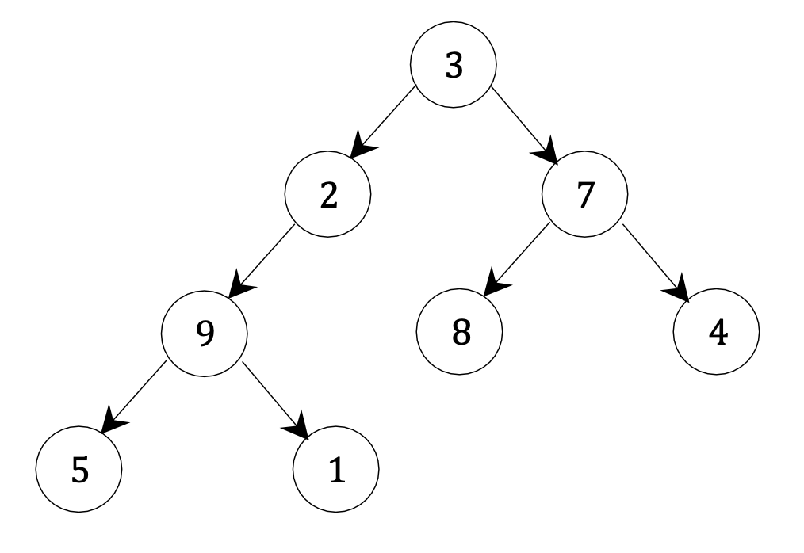
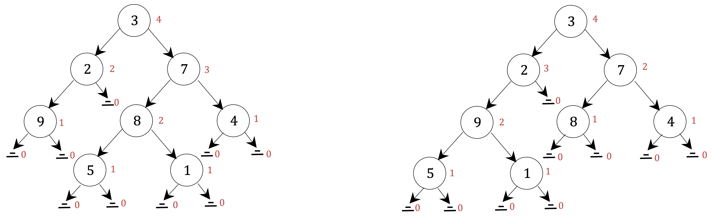
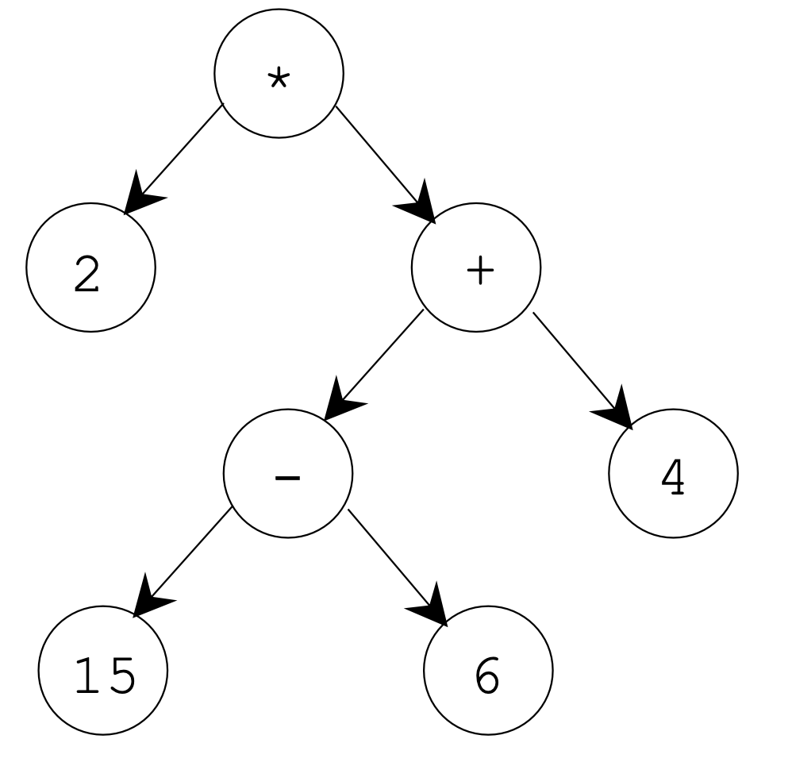

## Submission instructions:

1. For this assignment, you should turn in four files:

    a. A file containing the definition of the LinkedBinaryTree class, including all the additional methods implemented in this assignment (questions 2 and 4).

    b. 3 ‘.py’ files: each one includes the functions you wrote for questions 1, 3 and 5.Name your files: ‘YourNetID_hw7_q1.py’, ‘YourNetID_hw7_q3.py’, and ‘YourNetID_hw7_q5.py’.Note: your netID follows an abc123 pattern, not N12345678.

2. In this assignment, we provided ‘LinkedBinaryTree.py’ file (with the implementation of a binary tree).

3. You should submit your homework via Gradescope. For Gradescope’s autograding feature to work:autograding feature to work:

    a. Name all functions and methods exactly as they are in the assignment specifications.

    b. Make sure there are no print statements in your code. If you have tester code, please put it in a “main” function and do not call it.

## Question 1

Define the following function:

```python
def min_and_max(bin_tree)
```

When called on a `LinkedBinaryTree`, containing numerical data in all its nodes,it will **return a tuple**, containing the maximum and minimum values in the tree.For example, given the following tree:



Calling `min_and_max` on the tree above, should return (1, 9).

**Implementation requirements:**

1. Define one additional, **recursive**, helper function:

```python
 def subtree_min_and_max(root)
```

That is given root, a reference to a node in a `LinkedBinaryTree` tree. When called, it should return the minimum and maximum tuple for the subtree rooted by root.

2. In your implementations, you are not allowed to use any method from the `LinkedBinaryTree` class. Specifically, you are not allowed to iterate over the tree, using any of the traversals.
3. Your function should run in **linear time**.
4. Since the maximum and minimum are not defined on an empty set of elements, if the function is called on an empty tree you should raise an exception.

::: code-tabs

@tab Code1

```python
# 定义节点类，每个节点包含数据和指向左右子节点的引用
class Node:
    def __init__(self, data, left=None, right=None):
        self.data = data  # 节点的数值
        self.left = left  # 节点的左子节点
        self.right = right  # 节点的右子节点

# 定义链接二叉树类，它包含一个根节点
class LinkedBinaryTree:
    def __init__(self, root=None):
        self.root = root  # 树的根节点

# 这是一个递归辅助函数，用于找到以某个节点为根的子树的最小值和最大值
def subtree_min_and_max(node):
    # 如果节点为空，则返回最大的最小值和最小的最大值
    # 这是因为递归的基本情况，我们需要返回这样的值以便能够进行比较
    if node is None:
        return float('inf'), float('-inf')
    
    # 递归地找到左子树的最小值和最大值
    left_min, left_max = subtree_min_and_max(node.left)
    # 递归地找到右子树的最小值和最大值
    right_min, right_max = subtree_min_and_max(node.right)
    
    # 计算当前节点的最小值和最大值
    # 当前节点的值与左右子树的最小值和最大值比较，找到真正的最小值和最大值
    current_min = min(node.data, left_min, right_min)
    current_max = max(node.data, left_max, right_max)
    
    # 返回当前节点的最小值和最大值
    return current_min, current_max

# 这是主要的函数，它调用递归辅助函数并处理空树的情况
def min_and_max(bin_tree):
    # 如果树是空的，抛出异常
    if bin_tree.root is None:
        raise Exception("The tree is empty")
    
    # 对树的根节点调用辅助函数，获取整棵树的最小值和最大值
    return subtree_min_and_max(bin_tree.root)

# 构建一个示例树，用于测试函数
root = Node(9, Node(2, Node(5), Node(1)), Node(7, Node(3), Node(8, None, Node(4))))
tree = LinkedBinaryTree(root)

# 调用 min_and_max 函数，并打印结果
# 应该输出 (1, 9)，因为这是示例树中的最小值和最大值
min_value, max_value = min_and_max(tree)
print(min_value, max_value)
```

@tab code2

```python
class Node:
    # 假设节点使用 'data' 属性来存储数值
    def __init__(self, data, left=None, right=None):
        self.data = data
        self.left = left
        self.right = right

class LinkedBinaryTree:
    def __init__(self, root=None):
        self.root = root

def subtree_min_and_max(node):
    # 如果节点为空，返回一个元组表示无穷大和无穷小
    if node is None:
        return float('inf'), float('-inf')
    
    # 如果是叶子节点，最小值和最大值都是节点的值
    if node.left is None and node.right is None:
        return node.data, node.data
    
    # 递归计算左子树的最小值和最大值
    left_min, left_max = subtree_min_and_max(node.left)
    # 递归计算右子树的最小值和最大值
    right_min, right_max = subtree_min_and_max(node.right)
    
    # 计算当前节点的最小值和最大值
    current_min = min(node.data, left_min, right_min)
    current_max = max(node.data, left_max, right_max)
    
    return current_min, current_max

def min_and_max(bin_tree):
    if bin_tree.root is None:
        raise Exception("The tree is empty")
    
    # 对整棵树调用辅助函数
    return subtree_min_and_max(bin_tree.root)

# 构建一个示例树
root = Node(9, Node(2, Node(5), Node(1)), Node(7, Node(3), Node(8, None, Node(4))))
tree = LinkedBinaryTree(root)

# 调用函数并打印结果
min_value, max_value = min_and_max(tree)
print(min_value, max_value)  # 应该输出 (1, 9)
```


:::


## Question 2

Add the following method to the `LinkedBinaryTree` class:

```python
def leaves_list(self)
```

When called on a tree, it will create and return a list, containing the values stored at the leaves of the tree, ordered from left to right.

For example, if called on the tree from question 1, it should return: `[5, 1, 8, 4]`

**Implementation requirement:**

1. Your method should run in linear time.

    Hint: To meet this requirement you may want to define a generator that yields the desired values. You could then turn it to a list, using the list constructor.

2. In your implementations, you are not allowed to use any method from the `LinkedBinaryTree` class. Specifically, you are not allowed to iterate over the tree, using any of the traversals.

::: code-tabs

@tab code1

```python {26-35}
from ArrayQueue import ArrayQueue

class LinkedBinaryTree:

    class Node:
        def __init__(self, data, left=None, right=None):
            self.data = data
            self.parent = None
            self.left = left
            if (self.left is not None):
                self.left.parent = self
            self.right = right
            if (self.right is not None):
                self.right.parent = self

    def __init__(self, root=None):
        self.root = root
        self.size = self.count_nodes()

    def __len__(self):
        return self.size

    def is_empty(self):
        return len(self) == 0

    def leaves_list(self):
        def leaves_generator(node):
            if node is not None:
                if node.left is None and node.right is None:  # 叶子节点
                    yield node.data
                else:
                    yield from leaves_generator(node.left)
                    yield from leaves_generator(node.right)

        return list(leaves_generator(self.root))  # 使用列表构造器将生成器转换为列表


    def count_nodes(self):
        def subtree_count(root):
            if (root is None):
                return 0
            else:
                left_count = subtree_count(root.left)
                right_count = subtree_count(root.right)
                return 1 + left_count + right_count

        return subtree_count(self.root)


    def sum(self):
        def subtree_sum(root):
            if (root is None):
                return 0
            else:
                left_sum = subtree_sum(root.left)
                right_sum = subtree_sum(root.right)
                return root.data + left_sum + right_sum

        return subtree_sum(self.root)


    def height(self):
        def subtree_height(root):
            if (root.left is None and root.right is None):
                return 0
            elif (root.left is None):
                return 1 + subtree_height(root.right)
            elif (root.right is None):
                return 1 + subtree_height(root.left)
            else:
                left_height = subtree_height(root.left)
                right_height = subtree_height(root.right)
                return 1 + max(left_height, right_height)

        if(self.is_empty()):
            raise Exception("Tree is empty")
        return subtree_height(self.root)


    def preorder(self):
        def subtree_preorder(root):
            if (root is None):
                pass
            else:
                yield root
                yield from subtree_preorder(root.left)
                yield from subtree_preorder(root.right)

        yield from subtree_preorder(self.root)


    def postorder(self):
        def subtree_postorder(root):
            if (root is None):
                pass
            else:
                yield from subtree_postorder(root.left)
                yield from subtree_postorder(root.right)
                yield root

        yield from subtree_postorder(self.root)


    def inorder(self):
        def subtree_inorder(root):
            if (root is None):
                pass
            else:
                yield from subtree_inorder(root.left)
                yield root
                yield from subtree_inorder(root.right)

        yield from subtree_inorder(self.root)


    def breadth_first(self):
        if (self.is_empty()):
            return
        line = ArrayQueue()
        line.enqueue(self.root)
        while (line.is_empty() == False):
            curr_node = line.dequeue()
            yield curr_node
            if (curr_node.left is not None):
                line.enqueue(curr_node.left)
            if (curr_node.right is not None):
                line.enqueue(curr_node.right)

    def __iter__(self):
        for node in self.breadth_first():
            yield node.data
```

@tab code2

```python
# 继承原有的LinkedBinaryTree类，以便添加新的方法
class LinkedBinaryTree(LinkedBinaryTree):  

    # 定义 leaves_list 方法
    def leaves_list(self):
        # 定义一个内部生成器函数，用于递归地找到所有叶子节点
        def leaves_generator(node):
            # 如果当前节点不为空，则进入判断
            if node is not None:
                # 如果当前节点既没有左子树也没有右子树，则它是一个叶子节点
                if node.left is None and node.right is None:
                    yield node.data  # 生成叶子节点的数据
                else:
                    # 如果当前节点不是叶子节点，则递归调用左子树和右子树
                    yield from leaves_generator(node.left)
                    yield from leaves_generator(node.right)

        # 使用列表构造器将生成器返回的所有值收集到一个列表中并返回
        return list(leaves_generator(self.root))  

# 现在我们可以在树上调用新添加的方法来获取叶子节点的值列表
# 创建一个树节点的实例
root = LinkedBinaryTree.Node(9, 
        LinkedBinaryTree.Node(2, 
            LinkedBinaryTree.Node(5),  # 左叶子节点
            LinkedBinaryTree.Node(1)),  # 右叶子节点
        LinkedBinaryTree.Node(7, 
            LinkedBinaryTree.Node(3),  # 左内部节点
            LinkedBinaryTree.Node(8, None, LinkedBinaryTree.Node(4))))  # 右内部节点，有一个叶子节点
# 实例化LinkedBinaryTree类
tree = LinkedBinaryTree(root)

# 调用 leaves_list 方法并打印结果
leaves_values = tree.leaves_list()
print(leaves_values)  # 应该输出 [5, 1, 8, 4]，这是从左到右的叶子节点的值

```

@tab code3-DH

```python
class LinkedBinaryTree(LinkedBinaryTree):  # 继承原有的LinkedBinaryTree类

    def leaves_list(self):
        # 辅助函数，递归地找到叶子节点并将它们的值添加到列表中
        def find_leaves(node, leaves):
            if node is not None:
                if node.left is None and node.right is None:  # 叶子节点
                    leaves.append(node.data)
                else:
                    find_leaves(node.left, leaves)
                    find_leaves(node.right, leaves)
            return leaves

        # 调用辅助函数并传入空列表
        return find_leaves(self.root, [])

# 现在我们可以在树上调用新添加的方法来获取叶子节点的值列表
# 假设我们有一个之前题目中相同结构的树
root = LinkedBinaryTree.Node(9, 
        LinkedBinaryTree.Node(2, 
            LinkedBinaryTree.Node(5), 
            LinkedBinaryTree.Node(1)), 
        LinkedBinaryTree.Node(7, 
            LinkedBinaryTree.Node(3), 
            LinkedBinaryTree.Node(8, None, LinkedBinaryTree.Node(4))))
tree = LinkedBinaryTree(root)

# 调用 leaves_list 方法并打印结果
leaves_values = tree.leaves_list()
print(leaves_values)  # 应该输出 [5, 1, 8, 4]
```


:::


## Question 3

Although we originally defined the height of a subtree rooted at *r* to be the number of *edges* on the longest path from *r* to a leaf, for the simplicity of the definitions in this question, we will modify this definition so the height of a subtree rooted at *r* will be the number of **nodes** on such a longest path.

By this definition, a leaf node has height 1, while we trivially define the height of a “*None*” child to be 0.

We give the following definition, for what is considered to be a balanced tree:

We say that a binary tree *T* satisfies the **Height-Balance Property** if for every node *p* of *T*, the heights of the children of *p* differ by at most 1.

For example, consider the following two trees. Note that in these figures we showed the height of each subtree to the right of each such root, in a (small) red font:



The tree on the left satisfies the height-balance property, while the tree on the right does not (since the subtree rooted by the node containing 2 has one child with height 2 and the second child with height 0).

Implement the following function:

```python
def is_height_balanced(bin_tree)
```

Given `bin_tree`, a `LinkedBinaryTree` object, it will return True if the tree satisfies the height-balance property, or False otherwise.

**Implementation requirement:** Your function should run in **linear time**.

Hint: To meet the runtime requirement, you may want to define an additional, recursive, helper function, that returns more than one value (multiple return values could be collected as a tuple).

::: code-tabs

@tab Code1

```python
class LinkedBinaryTree:
    """链接式二叉树的实现"""

    class _Node:
        """非公开类，用于存储节点"""
        __slots__ = '_element', '_parent', '_left', '_right'

        def __init__(self, element, parent=None, left=None, right=None):
            self._element = element
            self._parent = parent
            self._left = left
            self._right = right

    class Position:
        """表示单个元素位置的抽象"""
        def __init__(self, container, node):
            self._container = container
            self._node = node

        def element(self):
            return self._node._element

        def __eq__(self, other):
            return type(other) is type(self) and other._node is self._node

    def _validate(self, p):
        if not isinstance(p, self.Position):
            raise ValueError('p必须是正确的Position类型')
        if p._container is not self:
            raise ValueError('p不属于这个容器')
        if p._node._parent is p._node:
            raise ValueError('p不再有效')
        return p._node

    def _make_position(self, node):
        return self.Position(self, node) if node is not None else None

    def __init__(self):
        self._root = None
        self._size = 0

    def __len__(self):
        return self._size

    def root(self):
        return self._make_position(self._root)

    def parent(self, p):
        node = self._validate(p)
        return self._make_position(node._parent)

    def left(self, p):
        node = self._validate(p)
        return self._make_position(node._left)

    def right(self, p):
        node = self._validate(p)
        return self._make_position(node._right)

    def is_root(self, p):
        return self.root() == p

    def is_leaf(self, p):
        node = self._validate(p)
        return not (node._left or node._right)

    def is_empty(self):
        return len(self) == 0

    def is_height_balanced(self):

        def _is_balanced_and_height(p):
            if p is None:
                return True, 0

            left_balanced, left_height = _is_balanced_and_height(self.left(p))
            right_balanced, right_height = _is_balanced_and_height(self.right(p))

            is_balanced = left_balanced and right_balanced and abs(left_height - right_height) <= 1
            height = 1 + max(left_height, right_height) 

            return is_balanced, height

        balanced, _ = _is_balanced_and_height(self.root())
        return balanced

tree = LinkedBinaryTree()

print(tree.is_height_balanced())
```

@tab Code2

```python
class LinkedBinaryTree:
    # Binary tree class provided
    ...

def is_height_balanced(bin_tree):
    def check_balance(node):
        # 基本情况: 如果节点是None，返回True和高度0
        if node is None:
            return True, 0

        # 递归检查左子树和右子树
        left_balanced, left_height = check_balance(node.left)
        right_balanced, right_height = check_balance(node.right)

        # 当前节点的平衡性取决于左右子树的平衡性和高度差
        balanced = left_balanced and right_balanced and abs(left_height - right_height) <= 1
        # 当前节点的高度是左右子树高度的最大值加1
        height = max(left_height, right_height) + 1

        return balanced, height

    # 调用辅助函数并返回树的平衡性
    balanced, _ = check_balance(bin_tree.root)
    return balanced

# 假设你已经有了一个LinkedBinaryTree实例叫做bin_tree
# 你可以这样调用函数:
# is_balanced = is_height_balanced(bin_tree)
```

@tab Code3-ZHY

```python
from LinkedBinaryTree import LinkedBinaryTree

def is_height_balanced(bin_tree):
    # check_balance 是一个递归辅助函数，它将检查以 node 为根的子树是否平衡，并返回子树的高度。
    def check_balance(node):
        # 基本情况: 如果当前节点是None，即它是一个空子树，根据定义其高度是0，并且它是平衡的。
        if node is None:
            return True, 0

        # 递归地检查左子树是否平衡，并得到左子树的高度。
        left_balanced, left_height = check_balance(node.left)
        # 同样地，递归地检查右子树是否平衡，并得到右子树的高度。
        right_balanced, right_height = check_balance(node.right)

        # 一个节点的子树是平衡的，当且仅当以下条件都满足：
        # 1. 左子树是平衡的。
        # 2. 右子树是平衡的。
        # 3. 左子树和右子树的高度差不超过1。
        balanced = left_balanced and right_balanced and abs(left_height - right_height) <= 1
        
        # 该节点的高度是其左子树和右子树的高度中的较大者加1（因为高度定义为节点的数量，所以要包括当前节点）。
        height = max(left_height, right_height) + 1

        # 返回当前节点的平衡状态和高度。
        return balanced, height

    # 调用辅助函数check_balance并传入二叉树的根节点，只关心返回的平衡状态。
    balanced, _ = check_balance(bin_tree.root)
    # 返回整个树的平衡状态。
    return balanced

# 可以使用如下代码来调用这个函数：
# 假设已经有了一个 LinkedBinaryTree 类的实例命名为 bin_tree。
# is_balanced = is_height_balanced(bin_tree)
# 这行代码将会告诉你 bin_tree 是否是一个高度平衡的二叉树。
```

@tab Code4

```python
from LinkedBinaryTree import LinkedBinaryTree

def is_height_balanced(bin_tree):
    # 使用栈来进行后序遍历
    stack = []
    node = bin_tree.root
    last_visited_node = None
    heights = {}

    while stack or node:
        if node:
            stack.append(node)
            node = node.left
        else:
            peek_node = stack[-1]
            if peek_node.right and last_visited_node != peek_node.right:
                node = peek_node.right
            else:
                stack.pop()
                left_height = heights.get(peek_node.left, 0)
                right_height = heights.get(peek_node.right, 0)
                if abs(left_height - right_height) > 1:
                    return False
                heights[peek_node] = max(left_height, right_height) + 1
                last_visited_node = peek_node

    return True

# 假设你已经有了一个LinkedBinaryTree实例叫做bin_tree
# 你可以这样调用函数:
# is_balanced = is_height_balanced(bin_tree)
```

@tab Code5 DH

```python
class LinkedBinaryTree:
    # LinkedBinaryTree的定义，这个类应该包含节点的定义，
    # 以及构建树所需的方法和属性。
    ...

def is_height_balanced(bin_tree):
    # 初始化一个空栈，用来执行后序遍历
    stack = []
    # 从树的根节点开始
    node = bin_tree.root
    # 初始化一个变量来记录最近访问过的节点
    last_visited_node = None
    # 使用字典来存储每个节点的高度
    heights = {}

    # 当栈不为空或节点不为None时进行遍历
    while stack or node:
        if node:
            # 如果当前节点不为空，将其压入栈中，并移至左子节点
            stack.append(node)
            node = node.left
        else:
            # 如果当前节点为空，说明已到达叶节点或子树的末端，
            # 查看栈顶元素但不弹出，即当前要处理的节点
            peek_node = stack[-1]
            # 如果栈顶元素有右子节点，并且该右子节点不是最后访问过的节点，
            # 则移至右子节点
            if peek_node.right and last_visited_node != peek_node.right:
                node = peek_node.right
            else:
                # 如果没有右子节点或者右子节点已经被访问过，
                # 则处理当前节点
                stack.pop()
                # 获取当前节点左右子节点的高度
                left_height = heights.get(peek_node.left, 0)
                right_height = heights.get(peek_node.right, 0)
                # 检查当前节点的左右子树的高度是否平衡
                if abs(left_height - right_height) > 1:
                    # 如果不平衡，返回False
                    return False
                # 更新当前节点的高度
                heights[peek_node] = max(left_height, right_height) + 1
                # 将当前节点设置为最后访问过的节点
                last_visited_node = peek_node

    # 如果所有节点都被遍历且平衡，返回True
    return True

# 假设你已经有了一个LinkedBinaryTree实例叫做bin_tree
# 你可以这样调用函数:
# is_balanced = is_height_balanced(bin_tree)
```


:::


## Question 4: (extra credit)

Add the following method to the `LinkedBinaryTree` class:

`def iterative_inorder(self)`

When called on a tree, it will create a generator, allowing to iterate over the values of the tree in an in-order order.

For example, if `t` is the tree from question 1,when running the following code:

```bash
 for item in t.iterative_inorder():
```


## Question 5

a. Implement the following function:

```python
def create_expression_tree(prefix_exp_str)
```

The function is given a string `prefix_exp_str`, which contains an arithmetic expression in a prefix notation.

When called, it creates and returns a `LinkedBinaryTree` object, that is the expression tree representing `prefix_exp_str` .

For example, the call: `create_expression_tree('* 2 + - 15 6 4')` will create and return the following tree:




Note:

Assume that prefix expression will come in the following format:

1. All operators in the expression will be taken from the four basic arithmetic operations (+, -, * and /).
2. All operands will be positive integers.
3. The tokens in the expression will be separated by a space.

**Implementation requirements:**

1. The nodes containing operators, should have the operator as a `string`, and nodes containing numerals, should have the number as an `int`.
2. The runtime for creating the expression tree should be **linear**.
3. You are **not allowed to use a stack** in your implementation.

Hint: There is more than one way to solve this problem. One way is to start by creating a list with the expression’s tokens (by using the split method), and then calling a helper function:

```python
def create_expression_tree_helper(prefix_exp, start_pos)
```

This helper function would be recursive, and in order to efficiently pass the subexpression that the call should consider, besides the list with the entire expression, it also gets `start_pos`, which is the index where the subexpression starts (we don’t know how long the subexpression will be, so we can’t pass the ending position too).

The call to the helper function would return two values (as a tuple): the first would be the subtree it created (that represent the subexpression starting at `start_pos`), and the second would be the size of that subtree (so you can know where the next subexpression would start...).

b. Use the function you implemented in section (a), to implement the following function: 

```python
def prefix_to_postfix(prefix_exp_str)
```

The function is given a string `prefix_exp_str`, which contains an arithmetic expression in a prefix notation (in the format described in section (a)).

When called, it returns the string representation of the postfix equivalent of `prefix_exp_str`.

For example, the call: `prefix_to_postfix('* 2 + - 15 6 4'),` will return: `'2 15 6 – 4 + *'`

**Implementation requirement:** The runtime of this function should be **linear**.

::: code-tabs

@tab Code1

```python
from LinkedBinaryTree import LinkedBinaryTree


def create_expression_tree(prefix_exp_str):

    tokens = prefix_exp_str.split()

    def create_expression_tree_helper(start_pos):

        token = tokens[start_pos]
        if token.isdigit():
            return LinkedBinaryTree.Node(int(token)), start_pos + 1
        else:
            node = LinkedBinaryTree.Node(token)
            node.left, next_pos = create_expression_tree_helper(start_pos + 1)
            node.right, next_pos = create_expression_tree_helper(next_pos)
            return node, next_pos


    root, _ = create_expression_tree_helper(0)
    return LinkedBinaryTree(root)


def prefix_to_postfix(prefix_exp_str):
    expression_tree = create_expression_tree(prefix_exp_str)

    def postorder_to_postfix(node):
        if node is None:
            return []
        left_postfix = postorder_to_postfix(node.left)
        right_postfix = postorder_to_postfix(node.right)
        return left_postfix + right_postfix + [str(node.data)]

    postorder_exp = postorder_to_postfix(expression_tree.root)
    return ' '.join(postorder_exp)


prefix_expression = '* 2 + - 15 6 4'
expression_tree = create_expression_tree(prefix_expression)
```

@tab Code2

```python
# 定义一个简单的队列类，用于二叉树的层次遍历
class Queue:
    def __init__(self):
        self.items = []
    
    def is_empty(self):
        # 检查队列是否为空
        return len(self.items) == 0
    
    def enqueue(self, item):
        # 将元素加入队列末尾
        self.items.append(item)
    
    def dequeue(self):
        # 从队列头部移除元素
        if self.is_empty():
            raise IndexError("Queue is empty")
        return self.items.pop(0)

# 实现链接二叉树类
class LinkedBinaryTree:

    # 定义节点类
    class Node:
        def __init__(self, data, left=None, right=None):
            self.data = data
            self.left = left
            self.right = right
            self.parent = None
            # 设置左右子节点的父节点
            if self.left is not None:
                self.left.parent = self
            if self.right is not None:
                self.right.parent = self

    def __init__(self, root=None):
        # 初始化二叉树，root为树的根节点
        self.root = root
        self.size = self.count_nodes()  # 计算树的大小

    def __len__(self):
        # 返回树的节点数
        return self.size

    def is_empty(self):
        # 检查树是否为空
        return len(self) == 0

    def count_nodes(self):
        # 递归计算树的节点数
        def subtree_count(root):
            if root is None:
                return 0
            else:
                left_count = subtree_count(root.left)
                right_count = subtree_count(root.right)
                return 1 + left_count + right_count

        return subtree_count(self.root)

    def breadth_first(self):
        # 层次遍历
        if self.is_empty():
            return
        line = Queue()
        line.enqueue(self.root)
        while not line.is_empty():
            curr_node = line.dequeue()
            yield curr_node
            if curr_node.left is not None:
                line.enqueue(curr_node.left)
            if curr_node.right is not None:
                line.enqueue(curr_node.right)

# 创建表达式树的辅助函数
def create_expression_tree_helper(prefix_exp, start_pos):
    if start_pos >= len(prefix_exp):
        return None, 0
    
    current = prefix_exp[start_pos]
    if current in '+-*/':
        # 如果当前元素是操作符，递归创建左右子树
        left_subtree, left_size = create_expression_tree_helper(prefix_exp, start_pos + 1)
        right_subtree, right_size = create_expression_tree_helper(prefix_exp, start_pos + 1 + left_size)
        root = LinkedBinaryTree.Node(current, left_subtree, right_subtree)
        return root, 1 + left_size + right_size
    else:
        # 如果当前元素是操作数，创建叶节点
        return LinkedBinaryTree.Node(int(current)), 1

# 根据前缀表达式字符串创建表达式树
def create_expression_tree(prefix_exp_str):
    prefix_exp = prefix_exp_str.split()
    tree, _ = create_expression_tree_helper(prefix_exp, 0)
    return LinkedBinaryTree(tree)

# 将前缀表达式转换为后缀表达式的函数
def prefix_to_postfix(prefix_exp_str):
    expression_tree = create_expression_tree(prefix_exp_str)
    
    # 辅助函数，后序遍历表达式树来构造后缀表达式
    def postorder_to_postfix(node):
        if node is None:
            return []
        left_postfix = postorder_to_postfix(node.left)
        right_postfix = postorder_to_postfix(node.right)
        return left_postfix + right_postfix + [str(node.data)]
    
    # 获取表达式树的后序遍历结果
    postorder_exp = postorder_to_postfix(expression_tree.root)
    # 将后序遍历结果连接成字符串
    return ' '.join(postorder_exp)

```

@tab Code3

```python
class LinkedBinaryTree:
    class Node:
        def __init__(self, data, left=None, right=None):
            self.data = data
            self.parent = None
            self.left = left
            if self.left is not None:
                self.left.parent = self
            self.right = right
            if self.right is not None:
                self.right.parent = self

    def __init__(self, root=None):
        self.root = root
        self.size = self.count_nodes()

    def count_nodes(self):
        def subtree_count(node):
            if node is None:
                return 0
            else:
                return 1 + subtree_count(node.left) + subtree_count(node.right)
        return subtree_count(self.root)

# Helper function for creating the expression tree.
def create_tree(tokens):
    token = next(tokens)
    if token.isdigit():
        return LinkedBinaryTree.Node(int(token))
    else:
        left = create_tree(tokens)
        right = create_tree(tokens)
        return LinkedBinaryTree.Node(token, left, right)

# Main function to create an expression tree from a prefix expression.
def create_expression_tree(prefix_exp_str):
    tokens = iter(prefix_exp_str.split())
    root = create_tree(tokens)
    return LinkedBinaryTree(root)

# Helper function for converting the expression tree to postfix notation.
def to_postfix(node):
    if node is not None:
        yield from to_postfix(node.left)
        yield from to_postfix(node.right)
        yield str(node.data)

# Main function to convert a prefix expression to a postfix expression.
def prefix_to_postfix(prefix_exp_str):
    tree = create_expression_tree(prefix_exp_str)
    return ' '.join(to_postfix(tree.root))

# Testing the new implementation.
test_expression = '* 2 + - 15 6 4'
postfix_expression = prefix_to_postfix(test_expression)
print(postfix_expression)
```

@tab Code4

```python
class LinkedBinaryTree:
    # 定义二叉树节点类
    class Node:
        def __init__(self, data, left=None, right=None):
            self.data = data  # 节点存储的数据
            self.parent = None  # 父节点的引用
            self.left = left  # 左子节点的引用
            if self.left is not None:
                self.left.parent = self
            self.right = right  # 右子节点的引用
            if self.right is not None:
                self.right.parent = self

    # 二叉树类的构造函数
    def __init__(self, root=None):
        self.root = root  # 树的根节点
        self.size = self.count_nodes()  # 树的节点总数

    # 计算树中节点的数量
    def count_nodes(self):
        def subtree_count(node):
            if node is None:
                return 0
            else:
                # 递归计算左右子树的节点数，并加上当前节点
                return 1 + subtree_count(node.left) + subtree_count(node.right)
        return subtree_count(self.root)

# 递归创建表达式树的辅助函数
def create_tree(tokens):
    token = next(tokens)  # 获取下一个token
    if token.isdigit():  # 如果是数字，就创建一个节点并返回
        return LinkedBinaryTree.Node(int(token))
    else:
        # 如果是运算符，递归创建左右子树
        left = create_tree(tokens)
        right = create_tree(tokens)
        # 创建当前运算符节点，并将左右子树连接起来
        return LinkedBinaryTree.Node(token, left, right)

# 主函数，创建一个表达式树
def create_expression_tree(prefix_exp_str):
    tokens = iter(prefix_exp_str.split())  # 将输入的前缀表达式分割成tokens，并创建一个迭代器
    root = create_tree(tokens)  # 从tokens创建表达式树
    return LinkedBinaryTree(root)  # 返回创建的树

# 将表达式树转换为后缀表达式的辅助函数
def to_postfix(node):
    if node is not None:
        # 后序遍历左子树
        yield from to_postfix(node.left)
        # 后序遍历右子树
        yield from to_postfix(node.right)
        # 输出节点数据
        yield str(node.data)

# 主函数，将前缀表达式转换为后缀表达式
def prefix_to_postfix(prefix_exp_str):
    tree = create_expression_tree(prefix_exp_str)  # 从前缀表达式创建表达式树
    return ' '.join(to_postfix(tree.root))  # 将后序遍历的结果连接成字符串

# 测试上述实现
test_expression = '* 2 + - 15 6 4'
postfix_expression = prefix_to_postfix(test_expression)
print(postfix_expression)  # 应该打印出: '2 15 6 - 4 + *'

```


:::


::: details 公众号：AI悦创【二维码】


:::

::: info AI悦创·编程一对一

AI悦创·推出辅导班啦，包括「Python 语言辅导班、C++ 辅导班、java 辅导班、算法/数据结构辅导班、少儿编程、pygame 游戏开发、Web、Linux」，全部都是一对一教学：一对一辅导 + 一对一答疑 + 布置作业 + 项目实践等。当然，还有线下线上摄影课程、Photoshop、Premiere 一对一教学、QQ、微信在线，随时响应！微信：Jiabcdefh

C++ 信息奥赛题解，长期更新！长期招收一对一中小学信息奥赛集训，莆田、厦门地区有机会线下上门，其他地区线上。微信：Jiabcdefh

方法一：[QQ](http://wpa.qq.com/msgrd?v=3&uin=1432803776&site=qq&menu=yes)

方法二：微信：Jiabcdefh

:::


