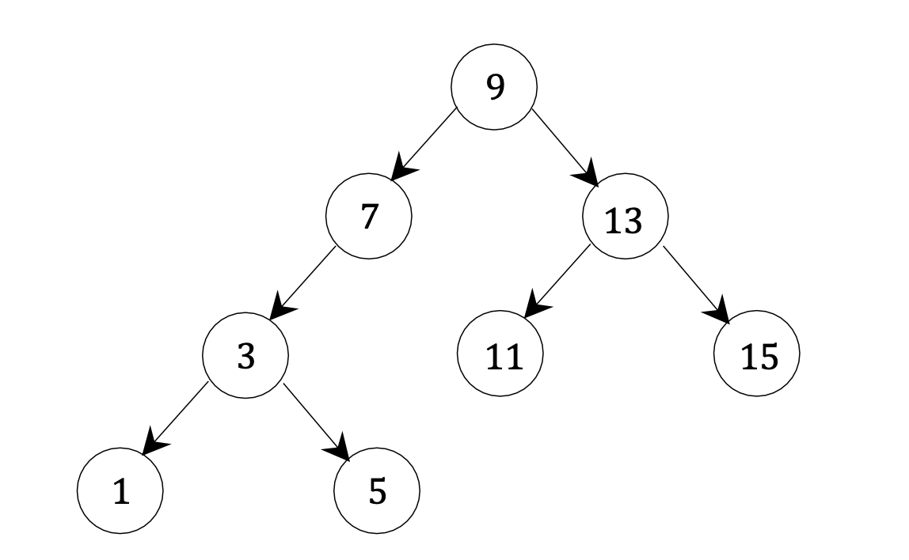
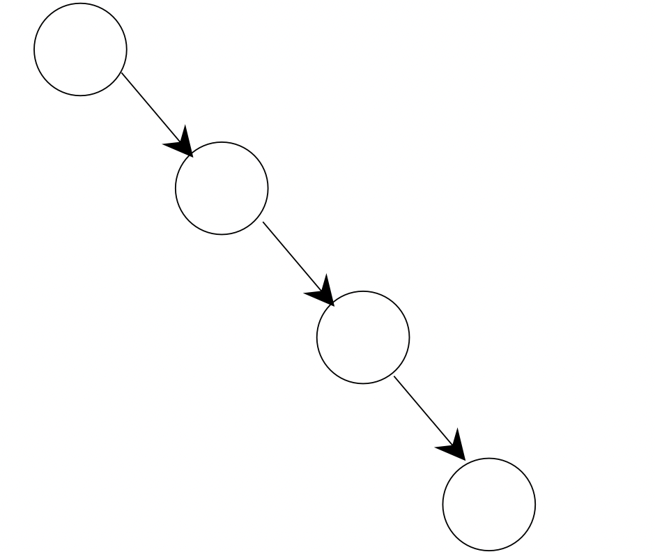
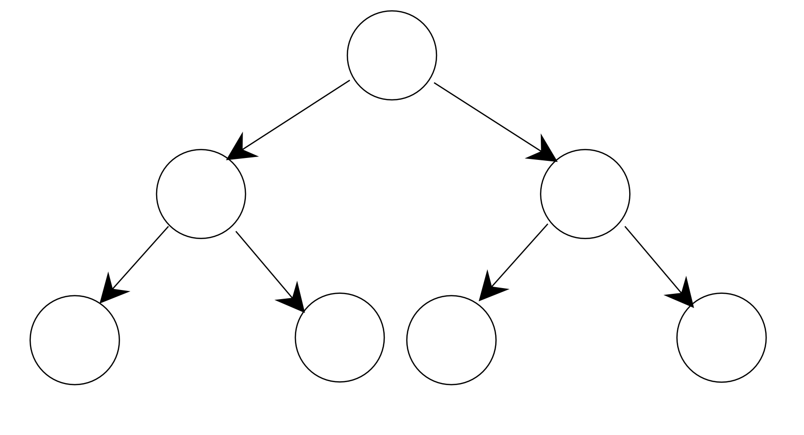
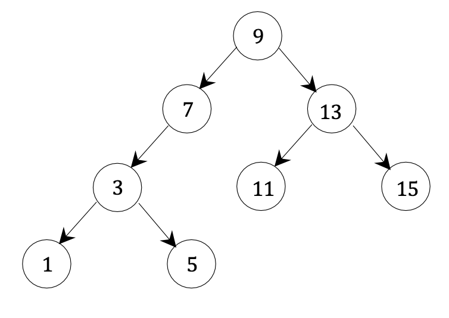
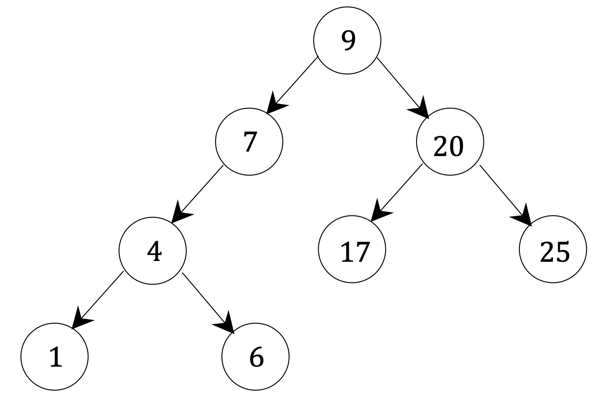

## Question 1

Given the following binary search tree bst:

```python
            9
           / \
          /   \
         7    13
        /     / \
       /     /   \
      3     11   15
     / \
    /   \
   1     5
```



We are executing the following sequence of operations (one after the other):

```python
bst[6] = None
bst[12] = None
bst[4] = None
bst[14] = None
del bst[7]
del bst[9]
del bst[13]
del bst[1]
del bst[3]
```

Draw the resulting tree after each one of the operations above.


## Question 2

a. Implement the following function:

```python
def create_chain_bst(n)
```

This function gets a positive integer $n$, and returns a binary search tree with $n$ nodes containing the keys *1, 2, 3, ..., n*. The structure of the tree should be one long chain of nodes leaning to the right.

For example, the call `create_chain_bst(4)` should create a tree of the following structure (with the values *1, 2, 3, 4* inside its nodes in a valid order):




**Implementation requirement:** In order to create the desired tree, your function has to construct an empty binary search tree, and can then only make repeated calls to the insert method, to add entries to this tree.

b. In this section, you will show an implementation of the following function:

```python
def create_complete_bst(n)
```

`create_complete_bst` gets a positive integer $n$, where $n$ is of the form $n=2^k-1$ for some non-negative integer *k*.

When called it returns a **binary search tree** with n nodes, containing the keys *1, 2, 3, ..., n*, structured as a **complete** binary tree.

Note: The number of nodes in a complete binary tree is $2^k-1$, for some non- negative integer *k*.

For example, the call `create_complete_bst(7)` should create a tree of the following structure (with the values *1, 2, 3, 4, 5, 6, 7* inside its nodes in a valid order):



You are given the implementation of `create_complete_bst`:

```python
def create_complete_bst(n):
    bst = BinarySearchTreeMap()
    add_items(bst, 1, n)
    return bst
```

You should implement the function:

```python
def add_items(bst, low, high)
```

This function is given a binary search tree `bst`, and two positive integers `low` and high(low $\leq$ high).

When called, it adds all the integers in the range low ... high into bst.

Note: Assume that when the function is called, none of the integers in the range low ... high are already in bst.

Hints:

- Before coding, try to draw the binary search trees (structure and entries) that `create_complete_bst(n)` creates for `n=7` and `n=15`.
- It would be easier to define `add_items` recursively.

c. Analyze the runtime of the functions you implemented in sections (a) and (b)

::: code-tabs

@tab Code1

```python
# -*- coding: utf-8 -*-
# @Time    : 2023/12/10 23:31
# @Author  : AI悦创
# @FileName: q1.py
# @Software: PyCharm
# @Blog    ：https://bornforthis.cn/
# Created by Bornforthis.
from BinarySearchTreeMap import BinartSearchTreeMap
# 创建链式二叉搜索树的函数
def create_chain_bst(n):
    bst = BinartSearchTreeMap()
    for i in range(1, n + 1):
        bst[i] = None  # 插入键，不关心值
    return bst


def add_items(bst, low, high):
    if low > high:
        return
    mid = (low + high) // 2  # 找到中间位置
    bst[mid] = None  # 插入中间键
    add_items(bst, low, mid - 1)  # 递归处理左半部分
    add_items(bst, mid + 1, high)  # 递归处理右半部分


def create_complete_bst(n):
    bst = BinartSearchTreeMap()
    add_items(bst, 1, n)
    return bst


chain_bst = create_chain_bst(4)
complete_bst = create_complete_bst(7)

# 打印二叉搜索树（前序遍历）
def print_bst_preorder(node):
    if node is not None:
        print(node.item.key, end=" -> ")
        print_bst_preorder(node.left)
        print_bst_preorder(node.right)

print("Chain BST (Pre-order):")
print_bst_preorder(chain_bst.root)
print("\nComplete BST (Pre-order):")
print_bst_preorder(complete_bst.root)
```

@tab Code2

```python
# 二叉搜索树的实现
class BinarySearchTreeMap:
    # Item类，用于存储键值对
    class Item:
        def __init__(self, key, value=None):
            self.key = key
            self.value = value

    # Node类，表示树的节点
    class Node:
        def __init__(self, item):
            self.item = item  # 节点存储的Item对象
            self.parent = None  # 父节点引用
            self.left = None  # 左子节点引用
            self.right = None  # 右子节点引用

        # 返回节点的子节点数量
        def num_children(self):
            count = 0
            if self.left is not None:
                count += 1
            if self.right is not None:
                count += 1
            return count

    # 初始化空的二叉搜索树
    def __init__(self):
        self.root = None

    # 检查树是否为空
    def is_empty(self):
        return self.root is None

    # 插入或更新键值对
    def __setitem__(self, key, value=None):
        if self.is_empty():
            self.root = self.Node(self.Item(key, value))  # 如果树为空，创建根节点
        else:
            self._subtree_insert(self.root, key, value)  # 否则，递归插入

    # 递归地在子树中插入节点
    def _subtree_insert(self, node, key, value):
        if key < node.item.key:
            if node.left is None:
                node.left = self.Node(self.Item(key, value))
                node.left.parent = node
            else:
                self._subtree_insert(node.left, key, value)
        else:
            if node.right is None:
                node.right = self.Node(self.Item(key, value))
                node.right.parent = node
            else:
                self._subtree_insert(node.right, key, value)

# 实现创建链式二叉搜索树的函数
def create_chain_bst(n):
    bst = BinarySearchTreeMap()  # 创建二叉搜索树实例
    for i in range(1, n + 1):
        bst[i] = None  # 将1到n的键依次插入，形成链式结构
    return bst

# 实现创建完整二叉搜索树的辅助函数
def add_items(bst, low, high):
    if low > high:
        return  # 递归终止条件
    mid = (low + high) // 2  # 找到中间位置
    bst[mid] = None  # 将中间位置的键插入树中
    add_items(bst, low, mid - 1)  # 递归处理左子树
    add_items(bst, mid + 1, high)  # 递归处理右子树

# 实现创建完整二叉搜索树的函数
def create_complete_bst(n):
    bst = BinarySearchTreeMap()  # 创建二叉搜索树实例
    add_items(bst, 1, n)  # 通过递归调用add_items函数填充树
    return bst

# 测试函数
# 创建链式和完整的二叉搜索树
chain_bst = create_chain_bst(4)
complete_bst = create_complete_bst(7)

# 定义一个简单的函数以前序遍历方式打印二叉搜索树
def print_bst_preorder(node):
    if node is not None:
        print(node.item.key, end=" -> ")  # 打印当前节点的键
        print_bst_preorder(node.left)  # 递归打印左子树
        print_bst_preorder(node.right)  # 递归打印右子树

# 打印测试结果
print("Chain BST (Pre-order):")
print_bst_preorder(chain_bst.root)
print("\nComplete BST (Pre-order):")
print_bst_preorder(complete_bst.root)

```

:::


c. 运行时间分析

a. `create_chain_bst(n)` 的运行时间

函数的主要运行时间在于逐个插入节点到二叉搜索树中。

在最坏情况下（即树呈线性结构，每个节点只有右子节点），每次插入的时间复杂度是 $O(h)$，其中 h 是树的当前高度。对于第 i 个节点，树的高度是 i。因此，总的运行时间是：

$T(n) = \sum_{i=1}^{n} O(i)$

这是一个等差数列求和，因此总的运行时间为 $O(n^2)$。

b. `create_complete_bst(n)` 和 `add_items(bst, low, high)` 的运行时间

在 `create_complete_bst` 函数中，通过递归调用 `add_items` 来构建一个完整的二叉搜索树。由于每次递归调用都会精确地把问题规模减半（选择中间元素作为根节点），所以总的递归深度是 $O(log n)$。在每一层递归中，我们进行常数时间的操作（不考虑递归开销）。因此，总的运行时间为 $O(log n)$。

综上所述，`create_chain_bst(n)` 的运行时间是 $O(n^2)$，而 `create_complete_bst(n)` 的运行时间是 $O(log n)$。这反映了在不同结构的二叉搜索树中插入节点的效率差异。

## Question 3

Implement the following function:

```python
def restore_bst(prefix_lst)
```

The function is given a list `prefix_lst`, which contains keys, given in an order that resulted from a prefix traversal of a **binary search tree**.

When called, it creates and returns the binary search tree that when scanned in prefix order, it would give `prefix_lst`.

For example, the call `restore_bst([9, 7, 3, 1, 5, 13, 11, 15])`,should create and return the following tree:



Notes:

1. The runtime of this function should be **linear**.
2. Assume that prefix_lst contains integers.
3. Assume that there are no duplicate values in `prefix_lst`.
4. You may want to define a helper function.

```python
from BinarySearchTreeMap import BinartSearchTreeMap
def restore_bst(prefix_lst):
    def _restore_range(low, high, iterator, bst):
        nonlocal next_item
        if next_item is None or not (low < next_item.key < high):
            return None

        node = bst.Node(next_item)
        bst.n += 1  # Updating the size of the tree
        next_item = next(iterator, None)
        node.left = _restore_range(low, node.item.key, iterator, bst)
        node.right = _restore_range(node.item.key, high, iterator, bst)
        return node

    bst = BinartSearchTreeMap()
    if not prefix_lst:
        return bst

    item_iterator = iter(BinartSearchTreeMap.Item(key) for key in prefix_lst)
    next_item = next(item_iterator, None)
    bst.root = _restore_range(float('-inf'), float('inf'), item_iterator, bst)
    return bst

# Testing the function again with the size check
test_input = [9, 7, 3, 1, 5, 13, 11, 15]
restored_bst = restore_bst(test_input)
type(restored_bst) == BinartSearchTreeMap and len(restored_bst) == len(test_input)  # Expecting True if both checks pass
```


## Question 4

Implement the following function:

```python
def find_min_abs_difference(bst)
```

The function is given a binary search tree bst, where all its keys are non-negative numbers.

When called, it returns the **minimum absolute difference** between keys of any two nodes in bst.

For example, if bst is the following tree:




The call `find_min_abs_difference(bst)` should return 1 (since the absolute difference between 6 and 7 is 1, and there are no other keys that their absolute difference is less than 1).

**Implementation requirement:** The runtime of this function should be **linear**. That is, if bst contains *n* nodes, this function should run in $\theta(𝑛)$.

Hint: To meet the runtime requirement, you may want to define an additional, recursive, helper function, that returns more than one value (multiple return values would be collected as a tuple).

```python
def find_min_abs_difference(bst):
    # 辅助函数用于进行中序遍历并找出最小绝对差异。
    def in_order_traverse(node, prev, min_diff):
        # 如果当前节点为空，返回之前的节点和当前最小差异
        if node is None:
            return prev, min_diff

        # 递归遍历左子树。这里将更新prev和min_diff
        prev, min_diff = in_order_traverse(node.left, prev, min_diff)

        # 处理当前节点：
        # 如果prev不为空（即不是第一个节点），更新最小差异
        if prev is not None:
            min_diff = min(min_diff, node.item.key - prev)
        # 更新prev为当前节点的键值，以便下一次比较
        prev = node.item.key

        # 递归遍历右子树
        return in_order_traverse(node.right, prev, min_diff)

    # 如果BST为空，返回无限大作为最小差异
    if bst.is_empty():
        return float('inf')

    # 从根节点开始中序遍历，初始化prev为None，min_diff为无限大
    _, min_diff = in_order_traverse(bst.root, None, float('inf'))
    return min_diff

# 使用示例
# 构建BST并调用find_min_abs_difference函数

```


## Question 5

Modify the implementation of the `BinarySearchTreeMap` class, so in addition to all the functionality it already allows, it will also support the following method:

```python
def get_ith_smallest(self, i)
```

This method should support indexing. That is, when called on a binary search tree, it will return the i-th smallest key in the tree (for `i=1` it should return the smallest key, for `i=2` it should return the second smallest key, etc.).

For example, your implementation should behave as follows:

```python
>>> bst = BinarySearchTreeMap()
>>> bst[7] = None
>>> bst[5] = None
>>> bst[1] = None
>>> bst[14] = None
>>> bst[10] = None
>>> bst[3] = None
>>> bst[9] = None
>>> bst[13] = None
>>> bst.get_ith_smallest(3)
5
>>> bst.get_ith_smallest(6)
10
>>> del bst[14]
>>> del bst[5]
>>> bst.get_ith_smallest(3)
7
>>> bst.get_ith_smallest(6)
13
```

**Implementation requirements:**

1. The runtime of the existing operations should remain as before (worst case of $\theta(height)$). The runtime of the `get_ith_smallest` method should also be worst case of $\theta(height)$.

2. You should raise an `IndexError` exception in case `i` is out of range.

Hints:

1. You may want to add attributes to the Node objects to help you search for the $i^{th}$ smallest element. To keep them updated, it could require you to modify the insert and delete methods as well.
2. You may want to define additional helper methods.

::: code-tabs

@tab Code1

```python
class BinarySearchTreeMap:
    class Item:
        def __init__(self, key, value=None):
            self.key = key
            self.value = value

    class Node:
        def __init__(self, item):
            self.item = item
            self.parent = None
            self.left = None
            self.right = None
            self.subtree_size = 1

        def num_children(self):
            count = 0
            if self.left is not None:
                count += 1
            if self.right is not None:
                count += 1
            return count

        def update_subtree_size(self):
            self.subtree_size = 1
            if self.left is not None:
                self.subtree_size += self.left.subtree_size
            if self.right is not None:
                self.subtree_size += self.right.subtree_size

    def __init__(self):
        self.root = None
        self.size = 0

    def __getitem__(self, key):
        # Retrieve a value by key
        node = self._find_node(self.root, key)
        if node is None:
            raise KeyError(f"Key not found: {key}")
        return node.item.value

    def __setitem__(self, key, value):
        if not self.root:
            self.root = self.Node(self.Item(key, value))
        else:
            self._insert_node(self.root, key, value)
        self.size += 1

    def _insert_node(self, current, key, value):
        if key < current.item.key:
            if current.left:
                self._insert_node(current.left, key, value)
            else:
                current.left = self.Node(self.Item(key, value))
                current.left.parent = current
        elif key > current.item.key:
            if current.right:
                self._insert_node(current.right, key, value)
            else:
                current.right = self.Node(self.Item(key, value))
                current.right.parent = current
        current.update_subtree_size()

    def __delitem__(self, key):
        node_to_remove = self._find_node(self.root, key)
        if node_to_remove is None:
            raise KeyError(f"Key not found: {key}")
        self._remove_node(node_to_remove)
        self.size -= 1

    def _remove_node(self, node):
        if node.num_children() == 0:
            self._reassign_parent(node, None)
        elif node.num_children() == 1:
            child = node.left if node.left else node.right
            self._reassign_parent(node, child)
        else:
            successor = self._find_min(node.right)
            node.item.key = successor.item.key
            node.item.value = successor.item.value
            self._remove_node(successor)
        if node.parent:
            node.parent.update_subtree_size()

    def _reassign_parent(self, node, child):
        if child:
            child.parent = node.parent
        if node.parent:
            if node is node.parent.left:
                node.parent.left = child
            else:
                node.parent.right = child
        else:
            self.root = child

    def _find_node(self, current, key):
        if current is None:
            return None
        elif key == current.item.key:
            return current
        elif key < current.item.key:
            return self._find_node(current.left, key)
        else:
            return self._find_node(current.right, key)

    def _find_min(self, current):
        while current.left:
            current = current.left
        return current

    def get_ith_smallest(self, i):
        if i < 1 or i > self.size:
            raise IndexError("Index out of range")
        return self._get_ith_smallest(self.root, i)

    def _get_ith_smallest(self, node, i):
        left_size = node.left.subtree_size if node.left is not None else 0
        if i == left_size + 1:
            return node.item.key
        elif i <= left_size:
            return self._get_ith_smallest(node.left, i)
        else:
            return self._get_ith_smallest(node.right, i - left_size - 1)
```

@tab Code2

```python
class BinarySearchTreeMap:
    # 定义二叉搜索树映射类

    class Item:
        # 内部类：用于存储键值对

        def __init__(self, key, value=None):
            # 初始化方法
            self.key = key    # 键
            self.value = value  # 值

    class Node:
        # 内部类：定义树的节点

        def __init__(self, item):
            # 节点初始化方法
            self.item = item  # 节点存储的Item对象
            self.parent = None  # 父节点引用
            self.left = None    # 左子节点引用
            self.right = None   # 右子节点引用
            self.subtree_size = 1  # 以该节点为根的子树大小

        def num_children(self):
            # 返回节点的子节点数量
            count = 0
            if self.left is not None:  # 如果有左子节点
                count += 1
            if self.right is not None:  # 如果有右子节点
                count += 1
            return count  # 返回子节点总数

        def update_subtree_size(self):
            # 更新节点的子树大小
            self.subtree_size = 1  # 初始化为1（包括自己）
            if self.left is not None:
                self.subtree_size += self.left.subtree_size
            if self.right is not None:
                self.subtree_size += self.right.subtree_size

    def __init__(self):
        # 初始化二叉搜索树映射
        self.root = None  # 根节点
        self.size = 0  # 树的总节点数

    def __getitem__(self, key):
        # 根据键获取值的方法
        node = self._find_node(self.root, key)  # 查找键对应的节点
        if node is None:
            raise KeyError(f"Key not found: {key}")  # 如果找不到，抛出异常
        return node.item.value  # 返回找到的节点的值

    def __setitem__(self, key, value):
        # 设置键值对的方法
        if not self.root:
            self.root = self.Node(self.Item(key, value))  # 如果树为空，设置根节点
        else:
            self._insert_node(self.root, key, value)  # 否则调用插入方法
        self.size += 1  # 增加树的大小

    def _insert_node(self, current, key, value):
        # 插入节点的辅助方法
        if key < current.item.key:
            if current.left:
                self._insert_node(current.left, key, value)  # 递归向左子树插入
            else:
                current.left = self.Node(self.Item(key, value))  # 创建新的左子节点
                current.left.parent = current  # 设置父节点引用
        elif key > current.item.key:
            if current.right:
                self._insert_node(current.right, key, value)  # 递归向右子树插入
            else:
                current.right = self.Node(self.Item(key, value))  # 创建新的右子节点
                current.right.parent = current  # 设置父节点引用
        current.update_subtree_size()  # 更新子树大小

    def __delitem__(self, key):
        # 删除键的方法
        node_to_remove = self._find_node(self.root, key)  # 查找要删除的节点
        if node_to_remove is None:
            raise KeyError(f"Key not found: {key}")  # 如果找不到，抛出异常
        self._remove_node(node_to_remove)  # 调用节点删除方法
        self.size -= 1  # 减少树的大小

    def _remove_node(self, node):
        # 删除节点的辅助方法
        if node.num_children() == 0:  # 如果是叶节点
            self._reassign_parent(node, None)  # 重新分配其父节点
        elif node.num_children() == 1:  # 如果节点只有一个子节点
            child = node.left if node.left else node.right  # 获取子节点
            self._reassign_parent(node, child)  # 重新分配其父节点
        else:  # 如果节点有两个子节点
            successor = self._find_min(node.right)  # 找到后继节点
            node.item.key = successor.item.key  # 替换键值
            node.item.value = successor.item.value  # 替换值
            self._remove_node(successor)  # 删除后继节点
        if node.parent:
            node.parent.update_subtree_size()  # 更新父节点的子树大小

    def _reassign_parent(self, node, child):
        # 重新分配父节点的辅助方法
        if child:
            child.parent = node.parent  # 设置子节点的父节点
        if node.parent:
            if node is node.parent.left:
                node.parent.left = child  # 如果是左子节点，更新父节点的左子节点
            else:
                node.parent.right = child  # 如果是右子节点，更新父节点的右子节点
        else:
            self.root = child  # 如果是根节点，更新根节点

    def _find_node(self, current, key):
        # 查找节点的辅助方法
        if current is None:
            return None  # 如果节点不存在，返回None
        elif key == current.item.key:
            return current  # 如果找到了键，返回节点
        elif key < current.item.key:
            return self._find_node(current.left, key)  # 向左子树递归查找
        else:
            return self._find_node(current.right, key)  # 向右子树递归查找

    def _find_min(self, current):
        # 找到最小键的节点
        while current.left:
            current = current.left  # 向左走到底
        return current  # 返回最小键的节点

    def get_ith_smallest(self, i):
        # 获取第i小的元素
        if i < 1 or i > self.size:
            raise IndexError("Index out of range")  # 如果索引越界，抛出异常
        return self._get_ith_smallest(self.root, i)  # 调用辅助方法

    def _get_ith_smallest(self, node, i):
        # 获取第i小元素的辅助方法
        left_size = node.left.subtree_size if node.left is not None else 0  # 左子树的大小
        if i == left_size + 1:
            return node.item.key  # 如果当前节点就是第i小的元素，返回其键
        elif i <= left_size:
            return self._get_ith_smallest(node.left, i)  # 如果第i小的元素在左子树，递归向左查找
        else:
            return self._get_ith_smallest(node.right, i - left_size - 1)  # 如果第i小的元素在右子树，递归向右查找

```


:::


::: details 公众号：AI悦创【二维码】


:::

::: info AI悦创·编程一对一

AI悦创·推出辅导班啦，包括「Python 语言辅导班、C++ 辅导班、java 辅导班、算法/数据结构辅导班、少儿编程、pygame 游戏开发、Web、Linux」，全部都是一对一教学：一对一辅导 + 一对一答疑 + 布置作业 + 项目实践等。当然，还有线下线上摄影课程、Photoshop、Premiere 一对一教学、QQ、微信在线，随时响应！微信：Jiabcdefh

C++ 信息奥赛题解，长期更新！长期招收一对一中小学信息奥赛集训，莆田、厦门地区有机会线下上门，其他地区线上。微信：Jiabcdefh

方法一：[QQ](http://wpa.qq.com/msgrd?v=3&uin=1432803776&site=qq&menu=yes)

方法二：微信：Jiabcdefh

:::


