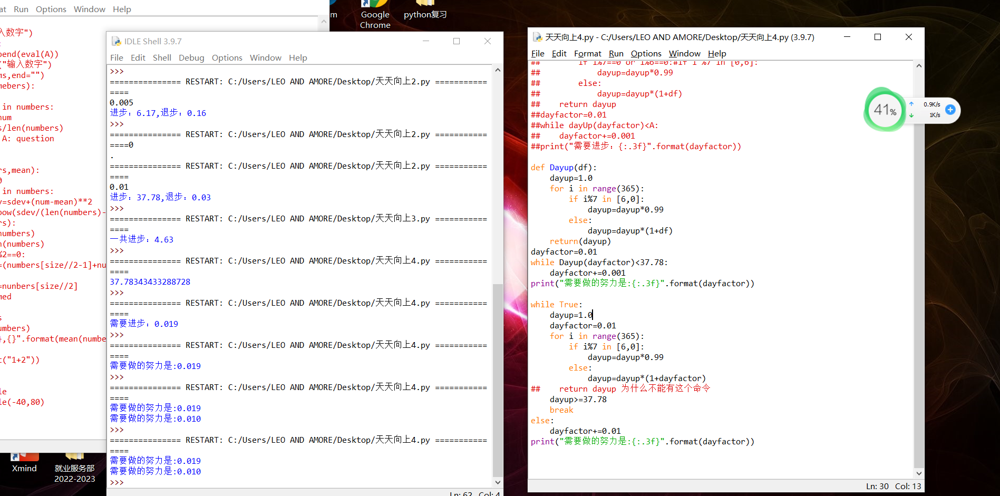

## Question 1



::: code-tabs

@tab for-loop

```python
def Dayup(df):
    dayup = 1.0
    for i in range(365):
        if i % 7 in [6, 0]:
            dayup = dayup * 0.99
        else:
            dayup = dayup * (1 + df)
    return (dayup)


dayfactor = 0.01
while Dayup(dayfactor) < 37.78:
    dayfactor += 0.001
print("需要做的努力是:{:.3f}".format(dayfactor))
```

@tab while-loop

```python
def Dayup(df):
    dayup = 1.0
    i = 0
    while i < 365:
        if i % 7 in [6, 0]:
            dayup = dayup * 0.99
        else:
            dayup = dayup * (1 + df)
        i += 1
    return (dayup)


dayfactor = 0.01
while Dayup(dayfactor) < 37.78:
    dayfactor += 0.001
print("需要做的努力是:{:.3f}".format(dayfactor))
```

@tab 3

```
# return 只能存在于函数里面，函数一遇到 return 就会 stop
# break 只能存在循环里面「while、for」
```

@tab 4

```python
dayfactor = 0.01
dayup = 1.0
while True:

    # dayfactor = 0.01
    for i in range(365):
        if i % 7 in [6, 0]:
            dayup = dayup * 0.99
        else:
            dayup = dayup * (1 + dayfactor)
    if dayup >= 37.78:
        break
    else:
        dayfactor += 0.001
print("需要做的努力是:{:.3f}".format(dayfactor))
```

:::


::: details 公众号：AI悦创【二维码】


:::

::: info AI悦创·编程一对一

AI悦创·推出辅导班啦，包括「Python 语言辅导班、C++ 辅导班、java 辅导班、算法/数据结构辅导班、少儿编程、pygame 游戏开发、Web、Linux」，全部都是一对一教学：一对一辅导 + 一对一答疑 + 布置作业 + 项目实践等。当然，还有线下线上摄影课程、Photoshop、Premiere 一对一教学、QQ、微信在线，随时响应！微信：Jiabcdefh

C++ 信息奥赛题解，长期更新！长期招收一对一中小学信息奥赛集训，莆田、厦门地区有机会线下上门，其他地区线上。微信：Jiabcdefh

方法一：[QQ](http://wpa.qq.com/msgrd?v=3&uin=1432803776&site=qq&menu=yes)

方法二：微信：Jiabcdefh

:::


