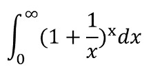

## Question 1

`s = "9e10"`是一个字符串，编写程序判断 s 是否是浮点数形式字符串，即包含小数点或采用科学计数法形式表示。如果是则输出 True，否则输出 False。

::: code-tabs

@tab try-except

```python
# 定义一个函数 is_float_string，接受一个字符串参数 s
def is_float_string(s):
    try:
        # 尝试将字符串 s 转换为浮点数。
        # Python 的 float() 函数能处理标准的十进制数值表示和科学计数法表示的字符串。
        float(s)
        # 如果字符串 s 可以被转换为浮点数，那么没有异常会被抛出，
        # 因此执行到这里并返回 True
        return True
    except ValueError:
        # 如果字符串 s 不能被转换为浮点数，float() 函数会抛出 ValueError 异常，
        # 执行到这里并返回 False
        return False

# 创建一个字符串 s，其值为 "9e10"，这是一个采用科学计数法形式表示的数值
s = "9e10"
# 调用 is_float_string 函数，检查 s 是否是浮点数形式的字符串
# 在这个例子中，s 是一个浮点数形式的字符串，因此输出 True
print(is_float_string(s))  # 输出: True
```

@tab all

```python
def is_float_string(s):
    # 如果字符串是空的，则返回 False
    if not s:
        return False

    # 判断字符串中是否含有科学记数法的'e'或'E'
    if 'e' in s or 'E' in s:
        base, _, exp = s.partition('e') if 'e' in s else s.partition('E')
    else:
        base, exp = s, ''

    # 检查基数和指数部分是否都是有效的
    return (all(c.isdigit() or c == '.' for c in base) and base.count('.') <= 1 and
            all(c.isdigit() for c in exp))

s = "9e10"
print(is_float_string(s))  # 输出: True
```

@tab 基础判断实现

```python
def is_float_string(s):
    # 首先，我们检查字符串是否为空。如果为空，返回False。
    if s == "":
        return False

    # 对于科学记数法，字符串中可能会有一个'e'或者'E'，我们需要分别处理。
    # 所以我们首先检查字符串中是否有'e'或者'E'。
    if 'e' in s:
        # 如果有'e'，我们把字符串分为两部分：'e'之前的部分和'e'之后的部分。
        parts = s.split('e')
    elif 'E' in s:
        # 如果有'E'，我们同样把字符串分为两部分：'E'之前的部分和'E'之后的部分。
        parts = s.split('E')
    else:
        # 如果没有'e'或者'E'，那么整个字符串就是一个部分。
        parts = [s]

    # 然后我们分别检查每个部分是否是一个有效的数字。
    for part in parts:
        # 首先，我们检查这个部分是否为空。如果为空，返回False。
        if part == "":
            return False

        # 然后，我们检查这个部分是否只包含数字和最多一个小数点。
        # 我们用一个变量来记录我们是否已经看到一个小数点。
        seen_dot = False
        for char in part:
            if char == '.':
                # 如果我们看到一个小数点，但是我们已经看到过一个小数点，返回False。
                if seen_dot:
                    return False
                else:
                    seen_dot = True
            elif not char.isdigit():
                # 如果我们看到的不是小数点也不是数字，返回False。
                return False

    # 如果所有的部分都是有效的数字，返回True。
    return True

s = "9e10"
print(is_float_string(s))  # 输出: True
```

:::

## Question 2

输入的一个字符串 s，以字符减号(-)分割 s，将其中首尾两段用加号(+)组合后输出。如：输入为：“`Alice-Bob-Charis-David-Eric-Flurry`”，则输出为：“`Alice+Flurry`”。

::: code-tabs

@tab 1

```python
def split_and_combine(s):
    # 使用split方法按照减号(-)分割字符串
    parts = s.split("-")
    
    # 使用加号(+)组合首尾两段
    result = parts[0] + "+" + parts[-1]
    
    return result

s = "Alice-Bob-Charis-David-Eric-Flurry"
print(split_and_combine(s))
```

:::

## Question 3

结合获取“星期字符串”实例，求获取月份字符串。要求：输入1-12的整数，用来表示几月份，输出为整数对应的月份字符串。如：输入为3，则输出为:三月。

::: code-tabs

@tab 1

```python
def get_month_string(month):
    month_dict = {
        1: "一月",
        2: "二月",
        3: "三月",
        4: "四月",
        5: "五月",
        6: "六月",
        7: "七月",
        8: "八月",
        9: "九月",
        10: "十月",
        11: "十一月",
        12: "十二月"
    }
    return month_dict.get(month, "输入错误，请输入1-12的整数")

# 测试函数
print(get_month_string(3))  # 输出: 三月
```

@tab 2

```python
def get_month_string(month):
    month_list = ["一月", "二月", "三月", "四月", "五月", "六月", "七月", "八月", "九月", "十月", "十一月", "十二月"]
    if 1 <= month <= 12:
        return month_list[month - 1]
    else:
        return "输入错误，请输入1-12的整数"

# 测试函数
print(get_month_string(3))  # 输出: 三月
```

@tab 3

```python
# 定义一个函数，输入为整数month
def get_month_string(month):
    # 声明一个字符串，包含1-12月的中文表示，注意这里"十一"和"十二"被表示为两个字符
    month_str = "一二三四五六七八九十十一十二"
    
    # 判断输入的月份是否在1-10之间，包括1和10
    if 1 <= month <= 10:
        # 如果是，我们直接从month_str中获取对应的字符，因为字符串的索引是从0开始的，所以我们要减1
        # 然后加上'月'，形成完整的月份表示
        return month_str[month - 1] + '月'
    # 判断输入的月份是否在11-12之间
    elif 11 <= month <= 12:
        # 如果是，我们需要使用切片操作从month_str中获取两个字符，形成"十一"或"十二"
        # 注意，切片操作的结束索引是不包含的，所以这里是month + 1
        return month_str[month - 1:month + 1] + '月'
    else:
        # 如果输入的月份既不在1-10之间，也不在11-12之间，那么我们返回一个错误消息
        return "输入错误，请输入1-12的整数"

# 测试函数
# 我们输入3，期望得到的输出是"三月"
print(get_month_string(3))  # 输出: 三月
```


:::


## Question 4

天天学习。以 7 天为周期，连续学习 3 天能力值不变，从第 4 天开始至第7天每天能力增长为前一天的 1%，如果 7 天中有 1 天间断学习，则周期从头计算。请编写程序回答，如果初始能力为 1，连续学习 365 天后能力值为多少？

```python
ability = 1
for i in range(365):
    if i % 7 >= 3:
        ability *= 1.01
print(ability)
```

## Question 5

回文数判断。设 n 是一个任意自然数，如果 n 的各位数字反向排列所得自然数与 n 相等，则 n 被称为回文数。编写程序，判断输入一个数是否为回文数。

```python
def is_palindrome(n):
    return str(n) == str(n)[::-1]

n = int(input("请输入一个自然数："))
if is_palindrome(n):
    print(f"{n} 是回文数。")
else:
    print(f"{n} 不是回文数。")
```

## Question 6

用 print 函数输出田字格，如下图所示：


```python
print("田字格：")
print("+---+---+")
print("|   |   |")
print("+---+---+")
print("|   |   |")
print("+---+---+")
```

## Question 7

以下积分公式求解特定计算问题：‪‪‪‪‪‫‫‪‪‪‪‪‫‫‪‪‪‪‪‫‪‪‪‪‪‫‫‪‪‪‪‪‫




`$\int$`


## Question 8

商店需要找钱给顾客，现在只有50元，5元和1元的人民币若干张。输入一个整数金额值，给出找钱的方案，假设人民币足够多，且优先使用面额大的钱币。

```python
# 定义一个函数，用于计算找零方案
def change_money(amount):
    # 定义一个列表，存放各种面额的人民币，从大到小排序
    denominations = [50, 5, 1]

    # 定义一个列表，用来存放各种面额的人民币的数量，初始都是0
    counts = [0, 0, 0]

    # 使用enumerate函数，对面额列表进行遍历，i是索引，denomination是面额
    for i, denomination in enumerate(denominations):
        # 如果需要找的金额大于等于当前面额
        if amount >= denomination:
            # 使用整除//，计算出最大数量的这种面额的人民币，存入counts列表对应位置
            counts[i] = amount // denomination
            # 使用取余%，计算出剩余的金额
            amount = amount % denomination

    # 返回找零方案，counts列表存放的是各种面额的人民币的数量，denominations列表存放的是对应的面额
    return counts, denominations

# 输入需要找零的金额
amount = int(input("请输入需要找零的金额："))
# 调用函数，获取找零方案
counts, denominations = change_money(amount)

# 输出找零方案
print("找零方案为：")
# 使用zip函数，同时遍历counts和denominations两个列表
for count, denomination in zip(counts, denominations):
    # 输出各种面额的人民币的数量
    print(f"{denomination}元的数量：{count}")
```

## Question 9

**已知变量 s="学而时习之,不亦说乎?有朋自远方来,不亦乐乎?人不知而不愠,不亦君子乎?"，编程统计并输出字符串 s 中汉字和标点符号的个数。**

试试用 string 库中 punctuation 来解决（注意标点符号必须是英文）

```python
import string
import unicodedata

s = "学而时习之,不亦说乎?有朋自远方来,不亦乐乎?人不知而不愠,不亦君子乎?"

# 扩展punctuation以包含中文的标点符号
all_punctuation = string.punctuation + '，。？！；：“”‘’《》【】—…'

# 初始化计数器
count = 0

for char in s:
    # 使用unicodedata.category函数判断字符是否为汉字或标点符号
    if unicodedata.category(char) == 'Lo' or char in all_punctuation:
        count += 1

print("汉字和标点符号的个数为: ", count)
```

`unicodedata.category(char)` 是Python中`unicodedata`模块的一个函数，该函数返回字符`char`的Unicode类别作为字符串。

Unicode类别是一个系统，用于对Unicode字符进行分类。例如，'L'是字母，'M'是标记，'N'是数字，'P'是标点，'Z'是分隔符，'S'是符号，以及'C'是其他类型。

这些类别还进一步细分。例如，'L'包括'Ll'（小写字母），'Lu'（大写字母）和'Lo'（其他字母）。'Lo'类别包括不区分大小写的字母，包括许多Unicode中的汉字。

所以，当我们在上面的代码中使用`unicodedata.category(char) == 'Lo'`，我们实际上是在检查字符`char`是否为'Lo'类别，即是否为汉字。


## Question 10

## 描述

编写一个算法来确定一个数字是否“快乐”。 快乐的数字按照如下方式确定：从一个正整数开始，用其每位数的平方之和取代该数，并重复这个过程，直到最后数字要么收敛等于1且一直等于1，要么将无休止地循环下去且最终不会收敛等于1。能够最终收敛等于1的数就是快乐的数字。‪‬‪‬‪‬‪‬‪‬‮‬‪‬‫‬‪‬‪‬‪‬‪‬‪‬‮‬‪‬‫‬‪‬‪‬‪‬‪‬‪‬‮‬‭‬‫‬‪‬‪‬‪‬‪‬‪‬‮‬‫‬‭‬‪‬‪‬‪‬‪‬‪‬‮‬‫‬‪‬‪‬‪‬‪‬‪‬‪‬‮‬‭‬‫‬‪‬‪‬‪‬‪‬‪‬‮‬‪‬‮‬

例如: 19 就是一个快乐的数字，计算过程如下：‪‬‪‬‪‬‪‬‪‬‮‬‪‬‫‬‪‬‪‬‪‬‪‬‪‬‮‬‪‬‫‬‪‬‪‬‪‬‪‬‪‬‮‬‭‬‫‬‪‬‪‬‪‬‪‬‪‬‮‬‫‬‭‬‪‬‪‬‪‬‪‬‪‬‮‬‫‬‪‬‪‬‪‬‪‬‪‬‪‬‮‬‭‬‫‬‪‬‪‬‪‬‪‬‪‬‮‬‪‬‮‬

- $1^2 + 9^2 = 82$
- $8^2 + 2^2 = 68$
- $6^2 + 8^2 = 100$
- $1^2 + 0^2 + 0^2 = 1$

当输入时快乐的数字时，输出 True，否则输出 False。 

```python
def isHappy(n: int) -> bool:
    # 创建一个集合来存储已经出现过的数字
    seen = set()

    # 使用while循环进行迭代，直到n为1或者n已经出现过
    while n != 1 and n not in seen:
        # 将n加入到已出现过的数字的集合中
        seen.add(n)
        # 计算n的各位数字的平方和
        n = sum(int(digit) ** 2 for digit in str(n))

    # 如果n为1，返回True，否则返回False
    return n == 1
```


```python
def isHappy(n):
    # 创建一个集合来处理存储已经出现过的数字
    seen = set()
    # 使用while循环进行迭代，直到n为1或者n已经出现过
    while n != 1 and n not in seen:
        # 将n加入到已出现过的数字的集合中
        seen.add(n)
        # 计算n的各位数字的平方和
        total = 0
        for digit in str(n):
            total += int(digit) ** 2
        n = total
    # 如果n为1，返回True，否则返回False
    return n == 1

print(isHappy(19))
```


::: details 公众号：AI悦创【二维码】


:::

::: info AI悦创·编程一对一

AI悦创·推出辅导班啦，包括「Python 语言辅导班、C++ 辅导班、java 辅导班、算法/数据结构辅导班、少儿编程、pygame 游戏开发、Web、Linux」，全部都是一对一教学：一对一辅导 + 一对一答疑 + 布置作业 + 项目实践等。当然，还有线下线上摄影课程、Photoshop、Premiere 一对一教学、QQ、微信在线，随时响应！微信：Jiabcdefh

C++ 信息奥赛题解，长期更新！长期招收一对一中小学信息奥赛集训，莆田、厦门地区有机会线下上门，其他地区线上。微信：Jiabcdefh

方法一：[QQ](http://wpa.qq.com/msgrd?v=3&uin=1432803776&site=qq&menu=yes)

方法二：微信：Jiabcdefh

:::


