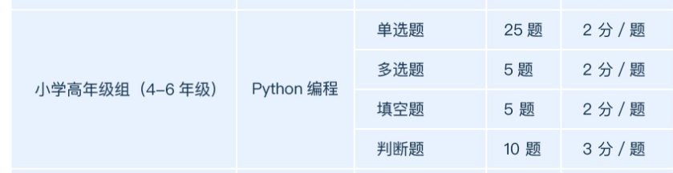

## 1. 单选题共40分

1. 已知变量 a = 20，变量 b = 8，下列描述错误的为:

A. c  =  a / b，变量 c 中存的是 2.5

B. c = b // a，变量 c 中存的是 0

C. c = a % b，变量 c 中存的是 4

D. c = b ** a，变量 c 中存的是 400

2. 如果用户输入 8，以下程序的运行会输出：

```python
n = input("请输入数字:")
n = int(n)
if n < 10:
    print("数字小于10")
if n < 20:
    print("数字小于20")
elif n < 30:
    print("数字小于30")
else:
    print("数字大于30")
```

3. 下列代码中，变量  result 中存储的值为:

```python
result = []
for i in range(9):
    if i % 2 == 0:
        continue
    if i % 5 == 0:
        break
    result.append(i)
print(result)
```

4. 以下关于数据结构说法错误的为:

A. 元组可以通过索引访问元素，但不可以修改元素

B. 字典的键不可重复，值可以重复

C. 字典中使用键访问元素

D. 列表中的数据只能是一种数据类型

5. 在 Python 中，以下变量名合法的为:

A. 23JD

B. sum@s

C. `_变量名`

D. for

## 2. 判断题共30分

1. continue 语句只能在 while 循环或 for 循环中使用
2. Python 中，变量名命名为 `abc_1` 是正确的。
3. python中，”1”和1是相同的数据类型
4. 关系运算符中 `==` 代表数学中的等号


::: details 公众号：AI悦创【二维码】


:::

::: info AI悦创·编程一对一

AI悦创·推出辅导班啦，包括「Python 语言辅导班、C++ 辅导班、java 辅导班、算法/数据结构辅导班、少儿编程、pygame 游戏开发、Web、Linux」，全部都是一对一教学：一对一辅导 + 一对一答疑 + 布置作业 + 项目实践等。当然，还有线下线上摄影课程、Photoshop、Premiere 一对一教学、QQ、微信在线，随时响应！微信：Jiabcdefh

C++ 信息奥赛题解，长期更新！长期招收一对一中小学信息奥赛集训，莆田、厦门地区有机会线下上门，其他地区线上。微信：Jiabcdefh

方法一：[QQ](http://wpa.qq.com/msgrd?v=3&uin=1432803776&site=qq&menu=yes)

方法二：微信：Jiabcdefh

:::


