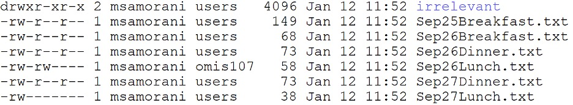
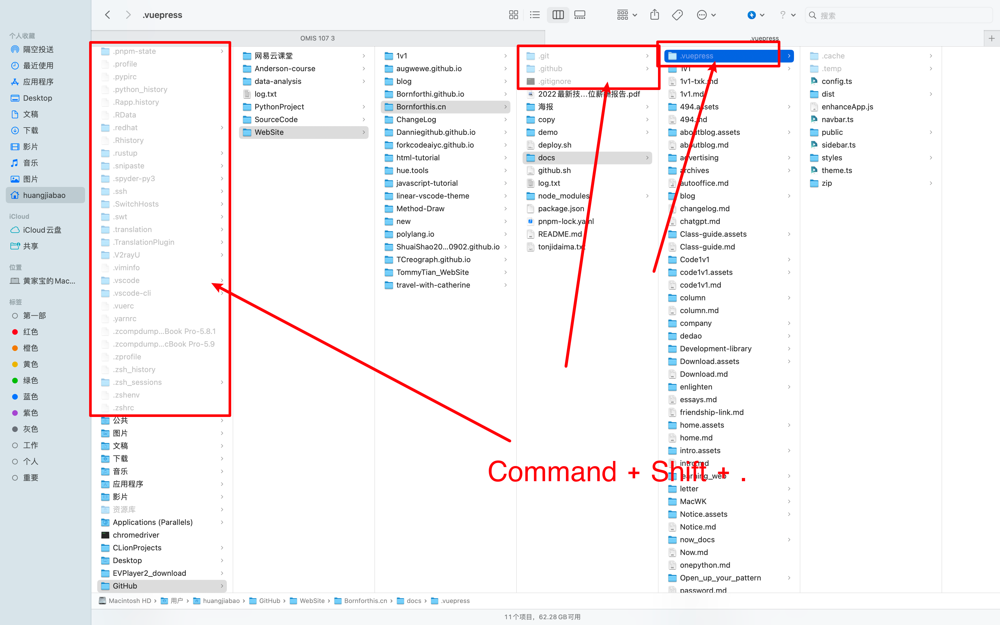

## Instructions:

Write the commands needed to solve the following problems on mis01.scu.edu. The first two problems are already solved to show you how to proceed.

Each problem will be marked with a 1 if correct, with a 0.5 if partially correct, and with a 0 otherwise.

## Problem -1 (solved for you as an example)

Before solving this problem, position yourself in your own directory. Move to `/home` using relative pathnames (write only one command).

### **Solution**:

```shell
cd..
```

## Problem 0 (solved for you as an example)

Before solving this problem, position yourself in your own directory. Move to `/home/OMIS107`  using relative pathnames and then move to `/home` using absolute pathnames (write two commands).

### **Solution**:

```shell
cd ../OMIS107 
cd /home
```

## Problem 1

Before solving this problem, position yourself in your own directory. Use relative pathnames to print the detailed list of files in `/home/OMIS107/HW1`  (one command).

```shell
ls -l ../OMIS107/HW1
```

## Problem 2

Before solving this problem, position yourself in your own directory. Use relative pathnames to go to `/home/OMIS107/HW1/irrelevant`  and, from there, use relative pathnames to show the content of file `/home/OMIS107/HW1/Sep26Lunch.txt`  (two commands).

### **Solution**:

```shell
cd ../OMIS107/HW1/irrelevant/
cat ../Sep26Lunch.txt
```

## Problem 3

Before solving this problem, position yourself in your own directory. Copy the directory `/home/OMIS107/HW1`  into your own directory using relative pathnames and making sure that you copy any existing subdirectory as well (one command). Make sure that neither your username nor tilde (~) appear in your solution.

### **Solution**:

```bash
cp -r ../OMIS107/HW1 .
```

## Problem 4

If the permissions were set as shown below, which files would you NOT be allowed to read?



### **Solution**:

```bash
Sep27Lunch.txt
```

::: tabs

@tab 题目

1. 给出以下 Linux 文件权限，你能解释每个权限的含义吗？
    - `-rwxr-x---`
    - `drwxrwxr-x`
    - `-rw-------`
    - `lrwxrwxrwx`
    - `drwxr-xr-x`

2. 如果你看到一个文件的权限是 `-rw-rw-r--`，那么以下哪个说法是正确的？
    - a) 所有用户都可以修改该文件。
    - b) 只有文件所有者可以读取和修改该文件。
    - c) 文件所有者和同一组的用户可以读取和修改该文件，其他用户只能读取。
    - d) 只有文件所有者可以读取该文件，其他用户无法访问。

3. 如果你想让一个文件的所有者有全部权限，同一组的用户有读取和执行权限，其他用户只有执行权限，你应该使用哪个 `chmod` 命令？
    - a) `chmod 741 filename`
    - b) `chmod 754 filename`
    - c) `chmod 647 filename`
    - d) `chmod 765 filename`

4. 以下哪个命令能够将文件的权限设置为 `-rwxr--r--`？
    - a) `chmod 644 filename`
    - b) `chmod 754 filename`
    - c) `chmod 744 filename`
    - d) `chmod 654 filename`

@tab Answer

当然，下面是这些问题的答案以及相关的解释：

1. 文件权限的解释：
    - `-rwxr-x---`：这是一个普通文件。所有者拥有读取、写入和执行权限；组拥有读取和执行权限；其他用户没有任何权限。
    - `drwxrwxr-x`：这是一个目录。所有者拥有读取、写入和执行权限；组也拥有读取、写入和执行权限；其他用户拥有读取和执行权限。
    - `-rw-------`：这是一个普通文件。所有者拥有读取和写入权限；组和其他用户没有任何权限。
    - `lrwxrwxrwx`：这是一个符号链接。所有者、组和其他用户都拥有读取、写入和执行权限。
    - `drwxr-xr-x`：这是一个目录。所有者拥有读取、写入和执行权限；组和其他用户拥有读取和执行权限。

2. `-rw-rw-r--` 的权限解释：正确答案是 c)。这个权限表示，文件所有者和同一组的用户可以读取和修改文件，其他用户只能读取。

3. 设定特定权限的 `chmod` 命令：正确答案是 b)。`chmod 754 filename` 会将文件的权限设置为 `-rwxr-xr--`，这表示文件所有者有全部权限（读取、写入和执行），同一组的用户有读取和执行权限，其他用户只有读取权限。

4. 设置权限为 `-rwxr--r--` 的 `chmod` 命令：正确答案是 c)。`chmod 744 filename` 会将文件的权限设置为 `-rwxr--r--`，这表示文件所有者有全部权限（读取、写入和执行），同一组的用户和其他用户只有读取权限。

:::

## 上课 log

### 1. 显示隐藏文件操作



### 2. `.` 和 `..`

在Linux或Unix系统中，`ls -a`命令用于列出目录中的所有文件，包括隐藏文件。`.`代表当前目录，`..`代表上级目录。当你在终端中使用`cd`命令进入一个目录时，`.`代表该目录本身，而`..`代表该目录的上一级目录。

## inventory 1

### 1. cd

<!-- @include: inventory.md{37-128} -->

### 2. ls

<!-- @include: inventory.md{132-240} -->

### 3. cat

<!-- @include: inventory.md{246-438} -->

### 4. echo

<!-- @include: inventory.md{442-482} -->

### 5. sort

<!-- @include: inventory.md{486-624} -->

### 6. |

<!-- @include: inventory.md{628-792} -->

### 7. grep

<!-- @include: inventory.md{796-880} -->

### 8. uniq

<!-- @include: inventory.md{886-994} -->

### 9. bc

<!-- @include: inventory.md{998-1034} -->

### 10. cp

<!-- @include: inventory.md{1038-1185} -->

### 11. 文件权限

<!-- @include: inventory.md{1189-1363} -->


::: details 公众号：AI悦创【二维码】


:::

::: info AI悦创·编程一对一

AI悦创·推出辅导班啦，包括「Python 语言辅导班、C++ 辅导班、java 辅导班、算法/数据结构辅导班、少儿编程、pygame 游戏开发、Web、Linux」，全部都是一对一教学：一对一辅导 + 一对一答疑 + 布置作业 + 项目实践等。当然，还有线下线上摄影课程、Photoshop、Premiere 一对一教学、QQ、微信在线，随时响应！微信：Jiabcdefh

C++ 信息奥赛题解，长期更新！长期招收一对一中小学信息奥赛集训，莆田、厦门地区有机会线下上门，其他地区线上。微信：Jiabcdefh

方法一：[QQ](http://wpa.qq.com/msgrd?v=3&uin=1432803776&site=qq&menu=yes)

方法二：微信：Jiabcdefh

:::


