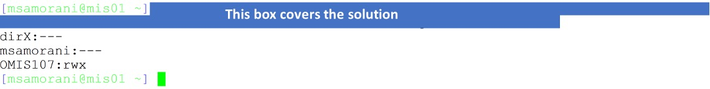

## Problem 1 (1 point)

Find the number of existing processes. Your output should be formatted as follows:

*On xxx, there were yyy processes*

xxx is the current timestamp (which you can retrieve with the command date)

yyy is the number of processes

For example: On Thu Feb 9 15:28:48 PST 2023, there were 264 processes


## Problem 2 (1 point)

The file /home/OMIS107/HW5/name contains one line of text. How much RAM is used in total by processes whose names contain that text? Your code should return just a decimal number from 0.0 to 100.0. For instance, if /home/OMIS107/HW5/name contains the text ps, then your code should total the % of RAM of any process that contain "ps" in the COMMAND column, and return the result (a decimal number from 0.0 to 100.0). Your code must work correctly even if the content of /home/OMIS107/HW5/name is changed.


在 UNIX 或者 Linux 系统中，`ps`是一个显示系统进程信息的命令。`aux`是`ps`命令的选项，它们的含义如下：

- `a`：显示所有终端机下的所有进程，包括其他用户的进程。
- `u`：以用户为主的格式来显示进程状态。
- `x`：显示没有控制终端的进程。

这三个选项联合使用（`aux`）就可以显示系统中所有用户的所有进程信息，无论这些进程是否关联了控制终端。

举个例子，`ps aux`命令的输出中，你可能会看到一行如下的内容：

```sh
root     27164  0.0  0.0  14756  960 pts/0    S+   10:15   0:00 grep --color=auto bash
```

在这一行中：

- `root`是用户（USER）名。
- `27164`是进程ID（PID）。
- `0.0`是CPU使用率（%CPU）。
- `0.0`是内存使用率（%MEM）。
- `14756`是虚拟内存使用量（VSZ）。
- `960`是物理内存使用量（RSS）。
- `pts/0`是控制终端（TTY）。
- `S+`是进程状态（STAT）。
- `10:15`是启动时间（START）。
- `0:00`是运行时间（TIME）。
- `grep --color=auto bash`是命令（COMMAND）。


## Problem 3 (1 point)

Position yourself in /home. Print only the file/directory name, followed by a colon, followed by the “group” permissions (the middle three permission bits) for all of the files/directory owned by the current user (whomever the user may be).

Example: the output of the command executed by msamorani is this:




这条命令实际上是一个命令管道，将多个命令的输出传递给下一个命令进行处理。我们来分段解释一下这个命令的每个部分：

1. `ls -l`：`ls`是Linux中列出目录内容的命令，`-l`选项表示使用长格式显示，这种格式会包含文件的详细信息，如权限、所有者、大小等。

2. `awk -v u="$(whoami)" '{if ($3==u) print $9 ":" $1}'`：这是一个awk命令，它处理`ls -l`的输出。`-v u="$(whoami)"`设置了一个awk变量u，它的值为当前用户的用户名（`whoami`的输出）。对每一行，如果第3个字段（文件所有者的用户名）等于u的值，就打印第9个字段（文件名）和第1个字段（文件权限）之间以冒号分隔的组合。

3. `sed -r "s/:....(...).*/:\1/g"`：这是一个sed命令，它处理awk的输出。这个命令使用了一个替换操作（`s/.../.../g`），将冒号后面的字符串改为只包含冒号后第4至第6个字符的字符串。其中`-r`选项允许使用扩展的正则表达式语法，`\1`代表匹配到的第一个分组的内容。这个命令的作用是将文件权限从完整的表示形式（如`-rw-r--r--`）缩减为只包含所有者权限（如`rw-`）。

所以整个命令的功能是，列出当前目录下所有当前用户拥有的文件，以及这些文件的所有者权限。注意，这个命令假设文件名中没有冒号。如果文件名中包含冒号，可能需要进行进一步的修改。

例如，如果当前用户为`john`，当前目录中有一个文件`test.txt`，它的所有者是`john`，权限为`-rw-r--r--`，那么这个命令的输出将为：

```sh
test.txt:rw-
```


## Problem 4 (1 point)

Read file hw5 inside your directory. Create one problem (text + solution) as indicated in that file and then upload your problem and solution on this shared document.

The goal is to help fellow students to prepare for the midterm; so, try to make the problem useful. The text of your problem should be as clear as possible and as short as possible. Avoid creating problems that are too trivial or too difficult; the difficulty of your problem should be similar to the problems in this and past assignments.

My intention is to give everyone full marks; the only way *not* to get full marks are the following:

- You do not perform this task
- You do not include a solution
- Your problem is clearly too trivial. For example, “print the current date” (solution: date), “print the list of existing processes” (solution: ps -efl).

If the solution you provide is incorrect, you will still receive full marks. But you must make an honest effort to get it right.


::: details 公众号：AI悦创【二维码】


:::

::: info AI悦创·编程一对一

AI悦创·推出辅导班啦，包括「Python 语言辅导班、C++ 辅导班、java 辅导班、算法/数据结构辅导班、少儿编程、pygame 游戏开发、Web、Linux」，全部都是一对一教学：一对一辅导 + 一对一答疑 + 布置作业 + 项目实践等。当然，还有线下线上摄影课程、Photoshop、Premiere 一对一教学、QQ、微信在线，随时响应！微信：Jiabcdefh

C++ 信息奥赛题解，长期更新！长期招收一对一中小学信息奥赛集训，莆田、厦门地区有机会线下上门，其他地区线上。微信：Jiabcdefh

方法一：[QQ](http://wpa.qq.com/msgrd?v=3&uin=1432803776&site=qq&menu=yes)

方法二：微信：Jiabcdefh

:::


