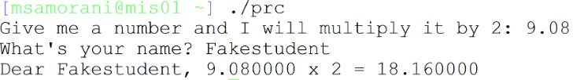
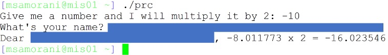
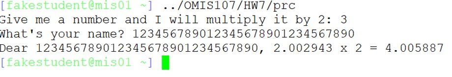

## 3 points

The folder `/home/OMIS107/HW7` contains an executable program, `prc`. It asks the user for `his/her` name and for a number, which the program multiplies it by two. 

> `/home/OMIS107/HW7`文件夹中包含一个可执行程序`prc`。它要求用户输入“他/她”的名字和一个数字，程序将其乘以2。

Run the program giving longer and longer names, and see what happens to the arithmetic operation.

> 使用越来越长的名字运行这个程序，看看算术运算会发生什么。

Your task: when prompted for your name, input something that makes the arithmetic operation look wrong but does not cause segmentation fault, as in the example below:

> 你的任务:当提示输入你的名字时，输入一些东西，使算术运算看起来不正确，但不会导致分割错误，如下面的例子所示:

Submit a document (pdf, docx, etc) containing two things:

> 提交一个包含两个内容的文档(pdf、docx等):

1) A snapshot of your solution, like the one above, but obviously without hiding anything😊

> 解决方案的快照，就像上面的那样，但显然没有隐藏任何东西😊

2. A brief explanation (at most 4 lines of text) of why the input you gave causes the numbers to be wrong.

>  一个简短的解释(最多4行文本)为什么你的输入会导致数字错误。

## Screenshot

## Explanation

The string passed as input (the name) “smashed” the area of the stack where the number 3 was stored, changing it to 2.002943. We did not get a segmentation fault because the string that we passed was not long enough to modify the return address.

> 作为input(名称)传递的字符串“粉碎”了堆栈中存储数字3的区域，将其更改为2.002943。我们没有得到分割错误，因为我们传递的字符串不够长，不足以修改返回地址。

---

这个现象的出现很可能是因为 "prc" 程序内存分配或者数据处理存在问题。当您输入一个较长的用户名时，用户名可能已经溢出了为其预设的内存空间，开始侵入了用于存储其它变量的内存区域，例如这里的数字变量。这种现象被称为缓冲区溢出。

因此，这里的数字结果“8.011773 x 2 = 16.023546”是错误的，可能是因为您输入的长用户名影响了存储数字的内存区域，导致原本的数字10被误读成了8.011773。 

这是一种常见的编程错误，也是一种潜在的安全隐患，因为恶意的用户或者攻击者可能会利用这种缓冲区溢出的漏洞，篡改程序的数据甚至执行非法的操作。

简单来说，你可以想象你有一个只能放10个苹果的篮子，但是你硬是往里面塞了12个，结果超出篮子的两个苹果就可能挤到了旁边的橙子篮子里，影响到了橙子篮子的空间，让原本的橙子数量变得不对了。

---

确实可以使用整数类型（例如 `int`）来帮助解释这个问题，尽管实际的问题可能涉及到更复杂的数据类型和内存管理问题。简单来说，你可以想象每种类型的数据（例如 `int`、`float` 或 `char`）都需要一定的内存空间来存储。如果你试图在一个为特定类型的数据分配的内存空间中存储超出该类型能够处理的数据，就可能会引发类似于这个问题的错误。

例如，一个 `int` 类型的变量在许多编程语言中通常会使用4个字节的内存空间。如果你试图在这4个字节的空间中存储一个需要更多空间的数据（例如一个很长的字符串），那么这个字符串可能就会溢出到相邻的内存区域，影响到那里的数据。

在你的例子中，当你输入一个很长的名字时，这个名字可能就会溢出到存储数字的内存区域，导致这个数字被误读。这就是为什么你会看到一个错误的乘法结果。所以，在设计程序时，我们需要确保为每个数据分配足够的内存空间，并正确处理输入，以防止这种缓冲区溢出的问题。

::: details 公众号：AI悦创【二维码】

:::

::: info AI悦创·编程一对一

AI悦创·推出辅导班啦，包括「Python 语言辅导班、C++ 辅导班、java 辅导班、算法/数据结构辅导班、少儿编程、pygame 游戏开发、Web、Linux」，全部都是一对一教学：一对一辅导 + 一对一答疑 + 布置作业 + 项目实践等。当然，还有线下线上摄影课程、Photoshop、Premiere 一对一教学、QQ、微信在线，随时响应！微信：Jiabcdefh

C++ 信息奥赛题解，长期更新！长期招收一对一中小学信息奥赛集训，莆田、厦门地区有机会线下上门，其他地区线上。微信：Jiabcdefh

方法一：[QQ](http://wpa.qq.com/msgrd?v=3&uin=1432803776&site=qq&menu=yes)

方法二：微信：Jiabcdefh

:::

