## 1. cd

::: tabs

@tab 快速🔜

`cd` 是一个 Linux 命令，全称 "change directory"。使用 `cd` 命令，你可以在 Linux 文件系统中的各个目录之间进行切换。

在实际使用中，你需要在 `cd` 命令后添加你希望切换到的目录路径。例如，如果你想切换到 `/home/user/documents`，你需要输入 `cd /home/user/documents`。

一些常用的 `cd` 命令参数包括：

- `cd ..`：这会让你返回到当前目录的上级目录。
- `cd -`：这会让你切换到之前的工作目录。
- `cd ~` 或 `cd`：这两个命令都会让你返回到当前用户的家目录。

请注意，Linux 系统是区分大小写的，所以在输入目录路径时需要注意大小写。此外，如果目录名称中包含空格，你需要使用引号将其包裹起来，或者使用反斜杠 `\` 对空格进行转义。例如，`cd "My Documents"` 或 `cd My\ Documents`。

@tab 详细🔎

`cd` 是一个基本的 Linux 命令，用于切换当前工作目录。它的基本语法是 `cd [options] [directory]`，其中 `directory` 是你希望切换到的目录。以下是一些常见的 `cd` 命令的用法和示例：

1. **切换到具体目录**：你可以通过提供目录的绝对路径或相对路径来切换到特定的目录。

    **绝对路径示例**：  

    ```bash
    cd /home/user/documents
    ```

    这个命令将你的当前工作目录切换到 `/home/user/documents`。

    **相对路径示例**：  
    假设当前工作目录是 `/home/user`，你可以使用以下命令切换到 `documents` 子目录：

    ```bash
    cd documents
    ```

2. **切换到上级目录**：你可以使用 `..` 来表示当前目录的父目录。

    **示例**：

    ```bash
    cd ..
    ```

    这个命令将你的当前工作目录切换到上级目录。

3. **切换到之前的工作目录**：你可以使用 `-` 来切换回你之前的工作目录。

    **示例**：

    ```bash
    cd -
    ```

    假设你最初在 `/home/user` 目录，然后你切换到 `/etc`，再运行 `cd -` 会把你带回到 `/home/user`。

4. **切换到用户的家目录**：你可以使用 `~` 或者不带任何参数的 `cd` 来切换到当前用户的家目录。

    **示例**：

    ```bash
    cd
    ```

    或

    ```bash
    cd ~
    ```

    这两个命令都会将你的当前工作目录切换到当前用户的家目录，通常是 `/home/username`。

5. **处理带有空格的目录名**：如果目录名中包含空格，你需要在整个目录名周围加上引号，或者使用反斜杠 `\` 来转义空格。

    **示例**：

    ```bash
    cd "directory with spaces"
    ```

    或

    ```bash
    cd directory\ with\ spaces
    ```

    这两个命令都将你的当前工作目录切换到名为 `directory with spaces` 的目录。

这就是 `cd` 命令的主要用法。它是 Linux 中最基本且常用的命令之一，学会有效地使用它可以提高你在命令行中的效率。

:::

## 2. ls

::: tabs

@tab 快速🔜

`ls` 是 Linux 中的一个基本命令，用于列出目录中的文件和子目录。基本语法是 `ls [options] [file|dir]`，你可以在命令后面添加参数和路径。如果没有指定路径，那么 `ls` 将列出当前目录的内容。以下是 `ls` 命令的一些常见用法和示例：

1. **基本用法**：无参数的 `ls` 会列出当前目录的文件和子目录。

    **示例**：
    ```bash
    ls
    ```
    
2. **列出其他目录的内容**：你可以在 `ls` 后添加目录路径，以查看该目录的内容。

    **示例**：

    ```bash
    ls /home/user/documents
    ```
    这个命令将列出 `/home/user/documents` 目录中的文件和子目录。

3. **长格式列表**：使用 `-l` 参数，你可以查看文件和目录的详细信息，如文件权限、所有者、大小、最后修改时间等。

    **示例**：
    ```bash
    ls -l
    ```
    这个命令将以长格式列出当前目录的内容。

4. **显示隐藏文件**：在 Linux 中，以点（`.`）开头的文件是隐藏文件。你可以使用 `-a` 或 `-A` 参数列出这些文件。其中，`-a` 显示所有文件（包括 `.` 和 `..`），而 `-A` 不显示 `.` 和 `..`。

    **示例**：
    ```bash
    ls -a
    ```
    这个命令将列出当前目录的所有文件，包括隐藏文件。

5. **显示目录本身，而不是其内容**：使用 `-d` 参数，你可以仅列出目录本身，而不是其内容。

    **示例**：
    ```bash
    ls -d */
    ```
    这个命令将列出当前目录的所有子目录（不包含其他文件和子目录的内容）。

6. **递归列出文件和目录**：使用 `-R` 参数，你可以递归地列出目录及其所有子目录的内容。

    **示例**：
    ```bash
    ls -R
    ```
    这个命令将递归地列出当前目录及其所有子目录的内容。

7. **按照文件大小排序**：使用 `-S` 参数，你可以按照文件大小排序。

    **示例**：
    ```bash
    ls -S
    ```
    这个命令将按照文件大小从大到小排序当前目录的内容。

8. **按照修改时间排序**：使用 `-t` 参数，你可以按照文件的修改时间排序。

    **示例**：
    ```bash
    ls -lt
    ```
    这个命令将按照文件的修改时间从新到旧排序，并以长格式显示。

这些就是 `ls` 命令的一些常见用法。记住，这些参数可以组合使用，例如 `ls

 -l -a` 或 `ls -la`。请注意，不同的 Linux 发行版可能提供了更多的 `ls` 参数选项，你可以通过 `man ls` 命令查看更多信息。


@tab ls -a 与 ls -A

让我补充一下这两个参数的示例：

`-a` 和 `-A` 都用于列出目录中的所有文件，包括以 `.`（点）开头的隐藏文件。在 Unix 和类 Unix 系统（如 Linux）中，文件名以 `.` 开头的文件被视为隐藏文件。

这两个参数的主要区别在于 `-a` 参数会列出 `.` 和 `..`，而 `-A` 参数则不会。在 Unix 和类 Unix 系统中，`.` 代表当前目录，`..` 代表父目录。

**`ls -a` 的使用示例**：
```bash
ls -a
```
这个命令会列出当前目录中的所有文件，包括隐藏文件和 `.` 和 `..`。

**`ls -A` 的使用示例**：
```bash
ls -A
```
这个命令会列出当前目录中的所有文件，包括隐藏文件，但不包括 `.` 和 `..`。

在大多数情况下，你可能会更倾向于使用 `ls -A`，因为 `.` 和 `..` 在列出目录内容时通常不太有用。

@tab . 和 .. 的故事

在 Unix 和 Unix-like 系统（如 Linux）中，`.` 和 `..` 是两个特殊的目录名。

- `.`：代表当前目录。例如，如果你在 `/home/user` 目录中，那么 `.` 就代表 `/home/user`。

- `..`：代表上一级（父）目录。如果你在 `/home/user` 目录中，那么 `..` 就代表 `/home`。

这两个特殊的目录名在一些命令中非常有用。例如，`cd ..` 命令可以让你从当前目录切换到上一级目录。`ls -a` 命令则会列出当前目录中的所有文件，包括隐藏文件和 `.` 和 `..`。

:::


## 3. cat

::: tabs

@tab 快速🔜

`cat` 是一个 Linux 命令，用于显示、复制、合并文件内容。它的名字源于 "concatenate"，意为连接，因为这个命令最初是用来连接文件的。

基本语法是 `cat [options] [file_names]`。如果没有指定文件名，`cat` 就会从标准输入（通常是键盘）读取数据。

以下是一些常用的 `cat` 命令的用法和示例：

1. **显示文件内容**：这是 `cat` 的最常见用法。例如，如果你想查看 `file.txt` 的内容，你可以运行以下命令：

    ```bash
    cat file.txt
    ```
    
    这个命令将在终端中打印出 `file.txt` 的全部内容。

2. **合并多个文件**：你可以在 `cat` 命令后指定多个文件名，以便将这些文件的内容合并并显示在终端中。例如：

    ```bash
    cat file1.txt file2.txt
    ```

    这个命令会先打印出 `file1.txt` 的内容，然后再打印出 `file2.txt` 的内容。

    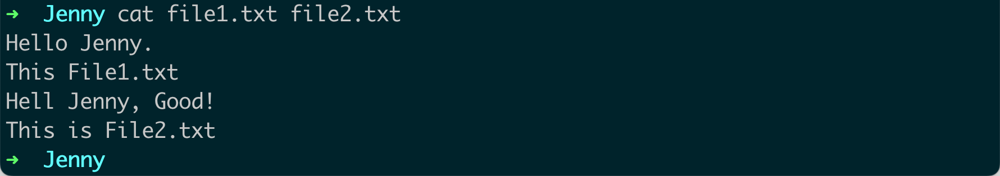

3. **创建新文件**：如果你想将多个文件的内容合并并保存到一个新文件中，你可以使用重定向操作符 `>`。例如：

    ```bash
    cat file1.txt file2.txt > newfile.txt
    ```

    这个命令会创建一个新文件 `newfile.txt`，其中包含 `file1.txt` 和 `file2.txt` 的内容。

    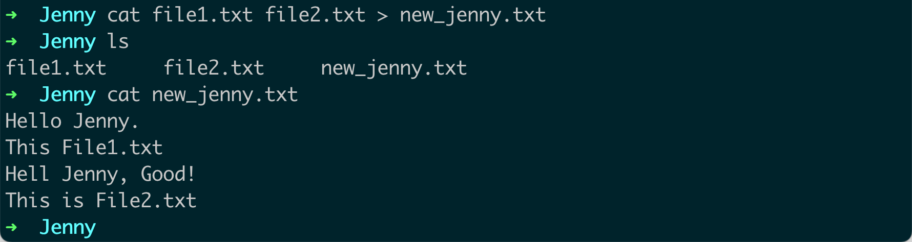

4. **添加到文件**：如果你想将文件的内容添加到现有文件的末尾，而不是覆盖现有文件，你可以使用重定向操作符 `>>`。例如：

    ```bash
    cat file1.txt >> file2.txt
    ```
    
    这个命令会将 `file1.txt` 的内容添加到 `file2.txt` 的末尾。

5. **显示行号**：如果你想在显示文件内容时显示行号，你可以使用 `-n` 或 `--number` 参数。例如：

    ```bash
    cat -n file.txt
    ```
    
    这个命令会在每行内容前显示行号。
    
    

这些是 `cat` 命令的主要用法。记住，尽管 `cat` 在显示小文件时非常有用，但如果你试图使用 `cat` 来查看非常大的文件，可能会导致终端被大量数据淹没。在这种情况下，你可能会更愿意使用 `less` 或 `more` 这样的命令。

@tab 补充 >、>>、<、<<

`>`, `>>`, `<`, 和 `<<` 是在 Unix 和 Unix-like 系统（如 Linux）中常见的 shell 命令行重定向操作符。他们分别具有以下的含义和用途：

1. `>`：这个操作符用于将命令的输出重定向到文件。如果文件已存在，它会被覆盖；如果文件不存在，它会被创建。例如：

    ```bash
    echo "Hello, World!" > file.txt
    ```
    
    这个命令会将字符串 "Hello, World!" 输出到 `file.txt`。如果 `file.txt` 已存在，其原有内容会被删除。

2. `>>`：这个操作符和 `>` 类似，但是它会将命令的输出添加到现有文件的末尾，而不是覆盖现有文件。如果文件不存在，它会被创建。例如：

    ```bash
    echo "Hello, World!" >> file.txt
    ```
    
    这个命令会将字符串 "Hello, World!" 添加到 `file.txt` 的末尾。

3. `<`：这个操作符用于将文件的内容作为命令的输入。例如：

    ```bash
    sort < file.txt
    ```
    
    这个命令会将 `file.txt` 的内容作为 `sort` 命令的输入，对文件的内容进行排序，并将排序结果输出到屏幕。

4. `<<`：这是一个“Here Document”的标识，用于将输入重定向到一个运行中的程序，或者将多行字符串作为输入传递给一个命令。例如：

    ```bash
    cat << EOF
    Hello, 
    This is a sample text.
    EOF
    ```
    
    这个命令会打印出两行字符串。`EOF`（End Of File）是一个标识，你可以用任何文本来代替它，只要这个文本在开始和结束标识中是一样的。在开始标识和结束标识之间的所有行都会作为输入传递给 `cat` 命令。

这就是重定向操作符的主要用法。它们是在 Unix 和 Unix-like 系统中进行文件和命令输入/输出操作的重要工具。

@tab less

`less` 是一个在 Unix-like 系统（如 Linux）中用于查看文件内容的命令。与 `more` 命令相比，`less` 提供了更多的功能和灵活性，它允许用户前后浏览文件，而 `more` 命令只允许向前浏览。这就是 "less is more" 这个短语的由来。

基本语法是 `less [options] file`。

以下是一些 `less` 命令的常见用法和示例：

1. **查看文件**：最基本的用法是使用 `less` 命令查看文件的内容。例如：

    ```bash
    less file.txt
    ```
    这个命令会打开 `file.txt` 以供查看。在查看文件时，你可以使用上下箭头键或 Page Up/Page Down 键进行导航。

`Page Up` 和 `Page Down` 是计算机键盘上的两个键。在大多数键盘布局中，这两个键通常位于键盘的右上角，可能会被标记为 `PgUp` 和 `PgDn`。

在使用文本浏览或编辑软件时，这两个键的功能通常是：

- `Page Up`：向上滚动一屏的内容。也就是说，按下这个键将使你看到上一屏的内容。

- `Page Down`：向下滚动一屏的内容。也就是说，按下这个键将使你看到下一屏的内容。

在 `less` 命令中，这两个键的功能和上述描述相同：`Page Up` 将向上滚动一屏的内容，`Page Down` 将向下滚动一屏的内容。

例如，如果你打开了一个很大的文件，使用 `less` 命令浏览它，你可能会发现屏幕上只能显示文件的一部分内容。在这种情况下，你可以使用 `Page Down` 键向下浏览文件，使用 `Page Up` 键向上浏览文件。

---

2. **在文件中搜索**：在查看文件时，你可以按 `/` 键然后输入一个搜索模式（可以是一个简单的字符串或一个正则表达式）进行搜索。例如，按 `/` 键然后输入 "hello" 会在文件中搜索 "hello"。按 `n` 键可以跳到下一个匹配项，按 `N` 键可以跳到上一个匹配项。

    ```bash
    less file.txt
    ```

3. **跳到文件的开头或末尾**：在查看文件时，按 `g` 键可以跳到文件的开头，按 `G` 键可以跳到文件的末尾。

4. **查看行号**：在查看文件时，按 `=` 键可以查看当前行的行号。

5. **退出 less**：在查看文件时，按 `q` 键可以退出 `less`。

这就是 `less` 命令的一些基本用法。它有很多其他的选项和特性，可以通过 `man less` 命令查看详细的帮助信息。

@tab cat 不支持 Page Up/Page Down吗？

`cat` 命令的设计是直接输出文件的全部内容到标准输出（通常是终端）。`cat` 不提供类似 `less` 或 `more` 的分页功能，也就是说，使用 `cat` 命令查看文件时，你不能使用 `Page Up` 或 `Page Down` 键向上或向下翻页。

这也是为什么在查看大型文件时，通常推荐使用 `less` 或 `more` 命令而不是 `cat` 命令。`less` 和 `more` 都提供分页功能，允许你使用 `Page Up` 或 `Page Down` 键（或它们的等价键盘操作，如 `less` 中的 `b` 和 `space`）在文件中向上或向下翻页。

如果你只是想快速查看或输出小文件的内容，`cat` 是一个非常好的工具。但是，如果你需要在大型文件中进行导航或搜索，那么 `less` 或 `more` 会是更好的选择。

@tab more

`more` 是一个在 Unix-like 系统（如 Linux）中用于查看文件内容的命令。它的特点是分页显示文件内容，特别适合查看大文件。

基本语法是 `more [options] file`。

以下是一些 `more` 命令的常见用法和示例：

1. **查看文件**：最基本的用法是使用 `more` 命令查看文件的内容。例如：

    ```bash
    more file.txt
    ```

    这个命令会打开 `file.txt` 以供查看。在查看文件时，你可以按空格键翻到下一页，按 `b` 键翻到上一页。

2. **在文件中搜索**：在查看文件时，你可以按 `/` 键然后输入一个搜索模式（可以是一个简单的字符串或一个正则表达式）进行搜索。例如，按 `/` 键然后输入 "hello" 会在文件中搜索 "hello"。按 `n` 键可以跳到下一个匹配项。

3. **查看文件的某部分**：如果你只想查看文件的某部分，可以使用 `+n` 参数，其中 `n` 是你想开始查看的行号。例如：

    ```bash
    more +10 file.txt
    ```

    这个命令会从 `file.txt` 的第 10 行开始显示文件内容。

这就是 `more` 命令的一些基本用法。虽然 `more` 命令的功能相对简单，但在查看大文件时它非常有用。然而，`less` 命令提供了更多的功能和灵活性，因此很多人更喜欢使用 `less` 命令。你可以通过 `man more` 命令查看 `more` 命令的详细帮助信息。

@tab less 与 more 的区别

`less` 和 `more` 都是 Unix-like 系统（如 Linux）中用于查看文件内容的命令。然而，它们之间有几个重要的区别：

1. **导航**：`more` 命令只允许你向前浏览文件，也就是从文件的开始到结束。相比之下，`less` 命令允许你向前向后浏览文件。你可以在 `less` 中使用上下箭头键或 Page Up/Page Down 键进行导航。

2. **搜索**：`less` 和 `more` 都可以在文件中进行搜索，但 `less` 提供了更多的搜索选项。在 `less` 中，你可以使用正则表达式进行搜索，可以向前向后搜索，还可以查看所有的匹配项。

3. **性能**：`less` 命令在处理大文件时比 `more` 更高效。`more` 命令需要一次性读取整个文件到内存中，而 `less` 只需要读取需要显示的部分。

4. **功能**：`less` 命令提供了更多的功能，包括显示行号、跳到文件的开头或末尾等。

因为 `less` 提供了更多的功能和灵活性，所以很多人更喜欢使用 `less` 命令。这就是 "less is more" 这个短语的由来。

:::

## 4. echo

`echo` 是一个在 Unix-like 系统（如 Linux）中非常常用的命令，它用于在命令行界面输出字符串或变量的值。基本语法是 `echo [options] [string, variables...]`。

以下是一些常见的 `echo` 命令的用法和示例：

1. **输出字符串**：你可以使用 `echo` 命令输出一个或多个字符串。例如：

    ```bash
    echo "Hello, World!"
    ```

    这个命令会在终端中打印出 "Hello, World!"。

2. **输出变量的值**：你可以使用 `echo` 命令输出环境变量的值。例如：

    ```bash
    echo $HOME
    ```
    
    这个命令会在终端中打印出 `HOME` 环境变量的值，通常是你的家目录的路径。

3. **使用转义字符**：`echo` 命令支持一些转义字符，比如 `\n`（新行），`\t`（制表符）等。要启用这些转义字符，你需要使用 `-e` 参数。例如：

    ```bash
    echo -e "Hello,\nWorld!"
    ```

    这个命令会打印出两行：第一行是 "Hello,"，第二行是 "World!"。

    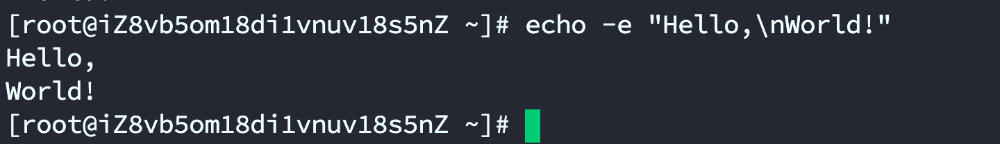

4. **不输出尾部的新行**：`echo` 命令默认会在输出的末尾添加一个新行。如果你不想输出这个新行，可以使用 `-n` 参数。例如：

    ```bash
    echo -n "Hello, World!"
    ```
    
    这个命令会打印出 "Hello, World!"，但不会在末尾添加新行。因此，下一个终端提示符会紧接在 "Hello, World!" 后面，而不是在新的一行。
    
    

这些是 `echo` 命令的主要用法。你可以通过 `man echo` 命令查看详细的帮助信息。

## 5. sort

::: tabs

@tab 快速🔜

`sort` 是一个在 Unix-like 系统（如 Linux）中常用的命令，用于对文本文件进行排序。基本语法是 `sort [options] [file...]`。

以下是 `sort` 命令的一些常见用法和示例：

1. **基本的排序**：最简单的 `sort` 命令用法就是对文件中的所有行进行排序。例如，假设我们有一个文件 `file.txt`，其内容如下：

    ```text
    banana
    apple
    cherry
    date
    ```

    我们可以使用 `sort` 命令对这个文件进行排序：

    ```bash
    sort file.txt
    ```

    这将输出：

    ```text
    apple
    banana
    cherry
    date
    ```

    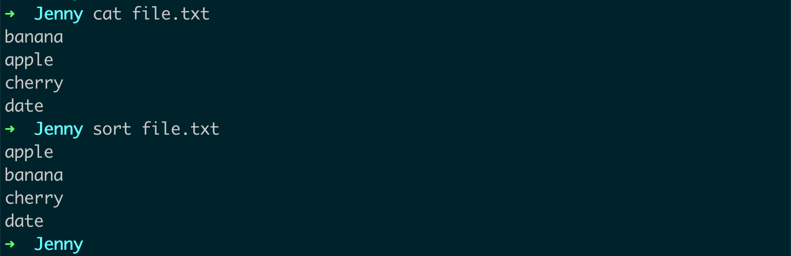

2. **数值排序**：默认情况下，`sort` 命令会按照字母顺序进行排序。如果你想按照数值进行排序，可以使用 `-n` 选项。例如：

    ```bash
    echo -e "10\n2\n100" | sort -n
    ```

    这将输出：

    ```text
    2
    10
    100
    ```

    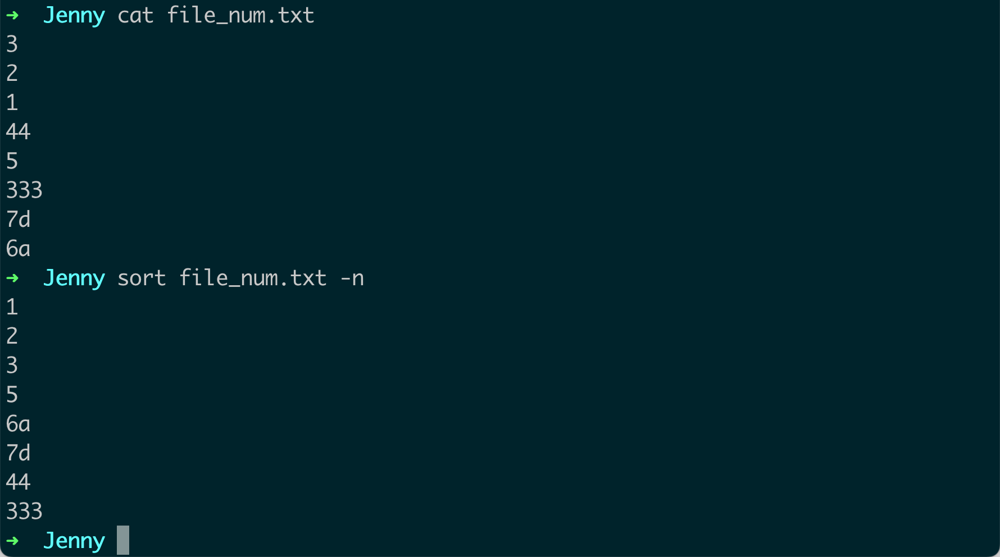

3. **反向排序**：如果你想按照反向顺序进行排序，可以使用 `-r` 选项。例如：

    ```bash
    echo -e "c\nb\na" | sort -r
    ```

    这将输出：

    ```text
    c
    b
    a
    ```

4. **根据列排序**：如果你有一个以某种分隔符（如空格或制表符）分隔的多列数据，你可以使用 `-k` 选项指定按照哪一列进行排序。例如：

    ```bash
    echo -e "1 z\n2 y\n3 x" | sort -k 2
    ```

    这将按照第二列进行排序，输出：

    ```text
    3 x
    2 y
    1 z
    ```

5. **检查是否已排序**：如果你想检查一个文件是否已经排序，你可以使用 `-c` 选项。如果文件已经排序，`sort -c` 命令将不输出任何内容并返回 0。如果文件没有排序，`sort -c` 命令将输出第一个未排序的行并返回非零值。

这些是 `sort` 命令的一些主要用法。你可以通过 `man sort` 命令查看详细的帮助信息。

@tab sort 降序排列

可以的，Linux的`sort`命令允许你降序（反向）排列文件中的行。具体来说，`-r`选项可以实现降序排列。

假设你有一个名为`file.txt`的文件，并且你希望根据每行的数值降序排列，你可以这样操作：

```bash
sort -rn file.txt
```

这里，`-r`选项表示“反向”（即降序），而`-n`选项表示“数值排序”。如果你不包含`-n`选项，`sort`命令将按照字符的字典顺序进行排序，这可能会导致数字10出现在数字2之前。

如果你想按字典顺序的反向排列，你可以省略`-n`选项，就像这样：

```bash
sort -r file.txt
```

在这两个命令中，排序结果会输出到控制台。如果你希望将结果保存到另一个文件中，你可以使用重定向操作，例如：

```bash
sort -rn file.txt > sorted_file.txt
```

@tab -k -n

在你提供的数据示例中，`sort -n -k 1,2 dem.txt` 已经按照你的期望对数据进行了排序。这是因为 `-k 1,2` 命令指定了排序应该基于第一和第二个字段，而 `-n` 指定了排序应该按照数值进行（这在这个特定的例子中并不重要，因为第一列的值都是唯一的）。

然而，如果你的实际数据与你提供的示例不同，可能会出现意外的结果。`sort -n -k 1,2` 将首先根据第一字段进行排序，然后在第一字段相同的行中根据第二字段进行排序。此外，第二字段的排序将是字典序，而不是数值排序，即使你使用了 `-n` 选项。

例如，如果你有以下数据：

```
1 z
1 y
1 x
2 a
2 b
2 c
```

`sort -n -k 1,2 dem.txt` 将产生以下结果：

```
1 x
1 y
1 z
2 a
2 b
2 c
```

这是因为，虽然第一字段相同（即都是1），但第二字段在字典序下是 `x < y < z`。

如果你需要第二字段以数值排序而非字典序，你可能需要使用更复杂的命令或不同的工具，例如 `awk`。如果你提供更具体的数据和你想要达到的结果，我可能可以给出更具体的建议。

:::

## 6. |

::: tabs

@tab 快速🔜

在 Unix-like 系统（如 Linux）中，竖线 `|` 被称为管道（pipe）。它用于将一个命令的输出作为另一个命令的输入。这是一种非常强大的功能，可以用来链接多个命令以执行复杂的操作。

以下是一些使用管道的示例：

1. **链接多个命令**：你可以使用管道链接多个命令。例如，你可以使用 `ls` 命令列出目录的内容，然后使用 `grep` 命令搜索特定的文件。例如：

    ```bash
    ls -l | grep ".txt"
    ```

    这个命令会在当前目录的文件列表中搜索所有 `.txt` 文件。

    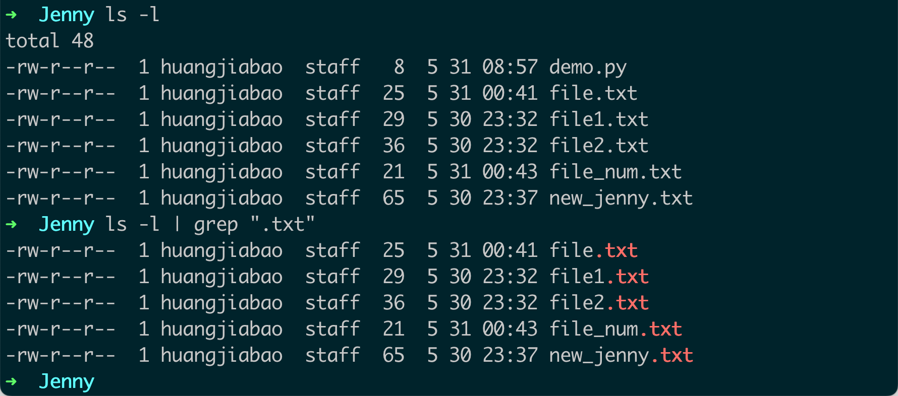

2. **使用 `sort` 和 `uniq` 命令删除重复的行**：你可以使用管道链接 `sort` 和 `uniq` 命令来删除文件中的重复行。例如：

    ```bash
    sort file.txt | uniq
    ```

    这个命令会先使用 `sort` 命令对 `file.txt` 文件进行排序，然后使用 `uniq` 命令删除重复的行。

    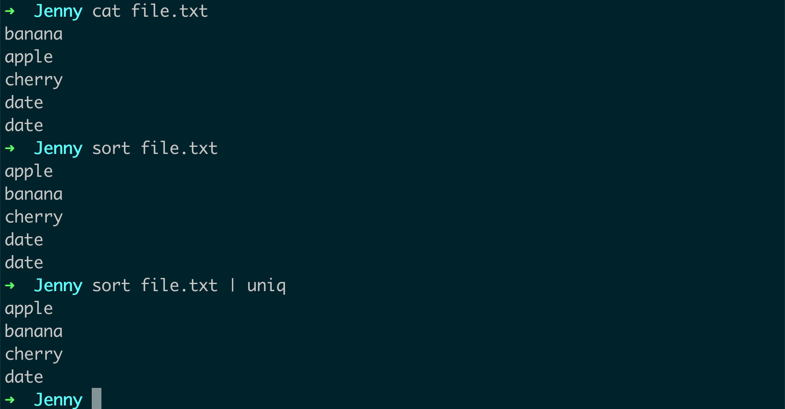

3. **使用 `echo` 和 `bc` 命令进行计算**：你可以使用管道链接 `echo` 和 `bc` 命令进行计算。例如：

    ```bash
    echo "5 + 2" | bc
    ```

    这个命令会计算 "5 + 2" 的结果并输出。

4. **使用 `curl` 和 `jq` 命令处理 JSON 数据**：如果你安装了 `curl` 和 `jq`，你可以使用它们处理 JSON 数据。例如：

    ```bash
    curl -s "https://api.github.com/users/octocat" | jq '.login'
    ```

    这个命令会获取 GitHub 用户 "octocat" 的信息，并使用 `jq` 命令输出其登录名。

这些都是管道的一些常见用法。通过使用管道，你可以将多个命令组合起来创建复杂的脚本和一次性命令。你可以在 bash 或其他 Unix-like shell 的文档中找到更多关于管道的信息。

@tab jq .

## base

在 `jq` 工具中，`.` 符号代表当前处理的 JSON 数据对象。当你要提取某个特定的属性时，需要使用 `.` 符号来指向当前对象，然后跟上你要提取的属性名。

例如，假设你有一个 JSON 对象如下：

```json
{
  "name": "John",
  "age": 30,
  "city": "New York"
}
```

如果你想提取 `name` 属性的值，你就需要使用 `.name` 作为 `jq` 的参数：

```bash
echo '{"name":"John", "age":30, "city":"New York"}' | jq '.name'
```

这将输出 `"John"`。这里的 `.` 符号代表当前的 JSON 对象，`name` 就是我们想要提取的属性。

同样的，如果你的 JSON 对象包含嵌套的对象或数组，你可以使用 `.` 符号来访问这些嵌套的元素。例如，`.person.name` 将提取 `person` 对象中的 `name` 属性，`.people[]` 将提取 `people` 数组中的所有元素。

在 `jq` 工具中，`.` 符号是非常重要的，它代表了当前处理的 JSON 对象。你几乎在所有的 `jq` 表达式中都会看到这个符号。

## 嵌套

首先，假设我们有如下的 JSON 数据：

```json
{
  "person": {
    "name": "John",
    "age": 30,
    "address": {
      "city": "New York",
      "country": "USA"
    }
  }
}
```

在这个 JSON 数据中，我们有一个 `person` 对象，这个对象中又包含了一个嵌套的 `address` 对象。我们可以使用 `jq` 提取这些嵌套的数据。

例如，如果我们想提取 `name` 属性，我们可以使用 `.person.name`：

```bash
echo '{"person":{"name":"John", "age":30, "address":{"city":"New York", "country":"USA"}}}' | jq '.person.name'
```

这将输出 `"John"`。

如果我们想提取 `city` 属性，我们可以使用 `.person.address.city`：

```bash
echo '{"person":{"name":"John", "age":30, "address":{"city":"New York", "country":"USA"}}}' | jq '.person.address.city'
```

这将输出 `"New York"`。

如果我们的 JSON 数据包含数组，我们可以使用 `[]` 符号来提取数组中的元素。例如，假设我们的 JSON 数据如下：

```json
{
  "people": [
    {"name": "John", "age": 30},
    {"name": "Jane", "age": 25}
  ]
}
```

我们可以使用 `.people[].name` 来提取所有人的名字：

```bash
echo '{"people":[{"name":"John", "age":30},{"name":"Jane", "age":25}]}' | jq '.people[].name'
```

这将输出：

```bash
"John"
"Jane"
```

在 `jq` 工具中，`.` 符号和 `[]` 符号可以帮助我们处理复杂的 JSON 数据结构。你可以在 `jq` 的文档中找到更多关于这个工具的信息。

```bash
echo '{"people":[{"name":"John", "age":30},{"name":"Jane", "age":25}]}' | jq '.people[0]'
```

输出：

```bash
{
  "name": "John",
  "age": 30
}
```

@tab 同时筛选多种文件后缀

可以，你可以使用管道（`|`）将 `ls -l` 的输出重定向到 `grep` 命令，并使用正则表达式来匹配多种文件后缀。具体来说，你可以使用竖线字符（`|`），在正则表达式中它表示“或”关系。

以下是一个例子，它匹配 `.txt` 或 `.csv` 文件：

```bash
ls -l | grep -E "\.(txt|csv)$"
```

在这个命令中，`-E` 选项告诉 `grep` 使用扩展的正则表达式。字符串 `"\.(txt|csv)$"` 是一个正则表达式，匹配以 `.txt` 或 `.csv` 结尾的行。

注意，正则表达式中的字符需要被适当地转义。例如，`.` 在正则表达式中表示任何字符，所以如果你想匹配实际的 `.` 字符，你需要写成 `\.`。同样，`$` 在正则表达式中表示行的结束，所以 `\.txt$` 只匹配以 `.txt` 结尾的行。

你可以添加更多的文件类型，只需在竖线字符后添加更多的后缀名即可，如：`"\.(txt|csv|jpg|png)$"`。

:::

## 7. grep

::: tabs

@tab 快速🔜

`grep` 是一个在 Unix-like 系统（如 Linux）中常用的命令，用于搜索文件中的文本。`grep` 命令可以接受正则表达式，这使得它非常灵活和强大。基本语法是 `grep [options] pattern [file...]`。

以下是 `grep` 命令的一些常见用法和示例：

1. **基本的搜索**：最基本的 `grep` 用法就是在一个或多个文件中搜索特定的文本。例如：

    ```bash
    grep 'Hello' file.txt
    ```

    这将在 `file.txt` 文件中搜索所有包含 `Hello` 的行。

    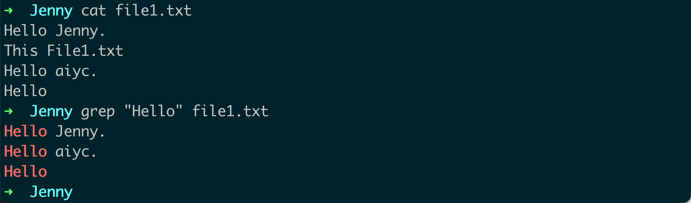

2. **忽略大小写**：如果你想在搜索时忽略大小写，可以使用 `-i` 选项。例如：

    ```bash
    grep -i 'hello' file.txt
    ```

    这将在 `file.txt` 文件中搜索所有包含 `hello`（无论大小写）的行。

3. **列出匹配文件**：如果你只想知道哪些文件包含匹配的文本，而不关心具体的行，你可以使用 `-l` 选项。例如：

    ```bash
    grep -l 'Hello' file1.txt file2.txt
    ```

    这将列出所有包含 `Hello` 的文件名。

4. **使用正则表达式**：`grep` 支持正则表达式，这使得它可以进行更复杂的搜索。例如：

    ```bash
    grep 'H.*o' file.txt
    ```

    这将在 `file.txt` 文件中搜索所有以 `H` 开始，以 `o` 结束的行。

5. **显示行号**：如果你想知道匹配的行在文件中的位置，你可以使用 `-n` 选项。例如：

    ```bash
    grep -n 'Hello' file.txt
    ```

    这将在 `file.txt` 文件中搜索所有包含 `Hello` 的行，并显示这些行的行号。

6. **递归搜索**：如果你想在一个目录及其所有子目录中搜索文件，你可以使用 `-r` 或 `-R` 选项。例如：

    ```bash
    grep -r 'Hello' /path/to/directory/
    ```

    这将在 `/path/to/directory/` 及其所有子目录中搜索所有包含 `Hello` 的行。

这些是 `grep` 命令的一些主要用法。你可以通过 `man grep` 命令查看详细的帮助信息。

@tab 筛选并保存到新文件中

可以的，你可以将 `grep` 的输出重定向到一个文件中。在 Linux 和 Unix 系统中，你可以使用 `>` 或 `>>` 这样的重定向运算符来实现。

下面是两个例子：

1. **使用 `>` 写入文件**：这将会覆盖文件中已有的内容。例如，你可以使用以下命令将 `grep` 的结果写入一个文件：

   ```bash
   grep 'pattern' file.txt > output.txt
   ```
   
   在这个命令中，`grep 'pattern' file.txt` 将输出包含指定模式的行，`> output.txt` 将把这些行写入 `output.txt` 文件中。如果 `output.txt` 文件已经存在，这个命令将会覆盖文件中的内容。

2. **使用 `>>` 写入文件**：这将会在文件的末尾添加内容，而不会覆盖已有的内容。例如：

   ```bash
   grep 'pattern' file.txt >> output.txt
   ```
   
   在这个命令中，`>> output.txt` 将把 `grep` 的结果追加到 `output.txt` 文件的末尾，而不是覆盖文件中的内容。

请注意，如果你没有写权限或者磁盘空间不足，这些命令可能会失败。在这种情况下，你需要检查你的权限或者磁盘空间，或者选择一个不同的目标文件。

:::


## 8. uniq

::: tabs

@tab 快速🔜

`uniq` 是 Unix 和 Linux 系统中的一个工具，用于从输入中过滤掉重复的行。它通常与 `sort` 命令一起使用，因为 `uniq` 只能识别相邻的重复行。

以下是 `uniq` 命令的一些常见用法和示例：

1. **基本用法**：最简单的 `uniq` 用法是直接使用它来过滤掉重复的行。例如：

    ```bash
    sort file.txt | uniq
    ```

    首先，`sort` 命令将 `file.txt` 文件的行排序，然后 `uniq` 命令删除相邻的重复行。

    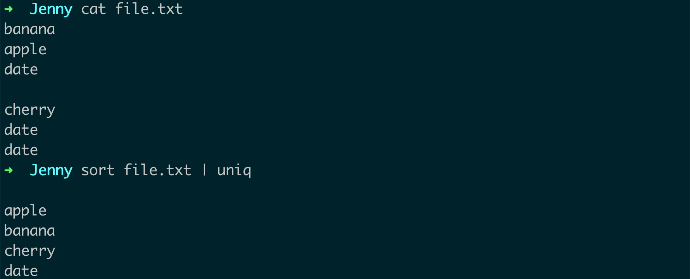

2. **显示每行出现的次数**：如果你想知道每行出现的次数，你可以使用 `-c` 选项。例如：

    ```bash
    sort file.txt | uniq -c
    ```

    这将显示 `file.txt` 文件中每行出现的次数。

    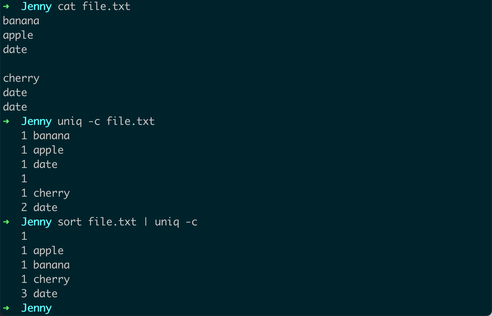

3. **只显示唯一的行**：如果你只想显示出现一次的行（即不重复的行），你可以使用 `-u` 选项。例如：

    ```bash
    sort file.txt | uniq -u
    ```

    这将只显示 `file.txt` 文件中不重复的行。

    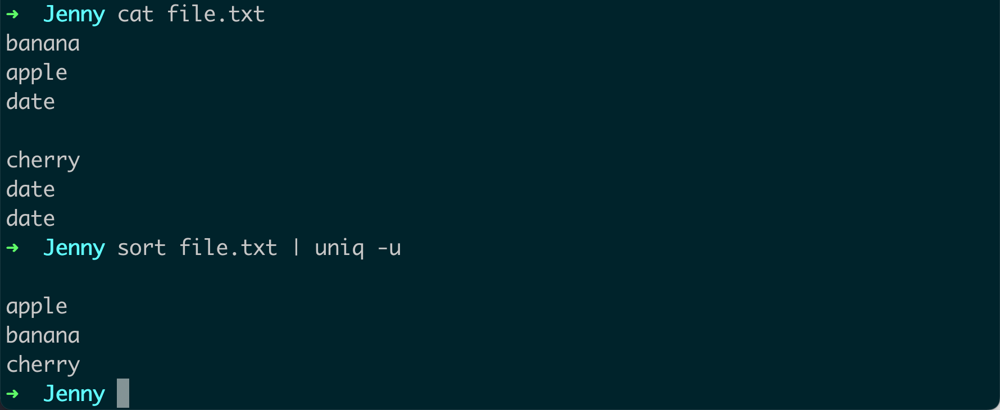

4. **只显示重复的行**：如果你只想显示至少出现两次的行（即重复的行），你可以使用 `-d` 选项。例如：

    ```bash
    sort file.txt | uniq -d
    ```

    这将只显示 `file.txt` 文件中重复的行。
    
    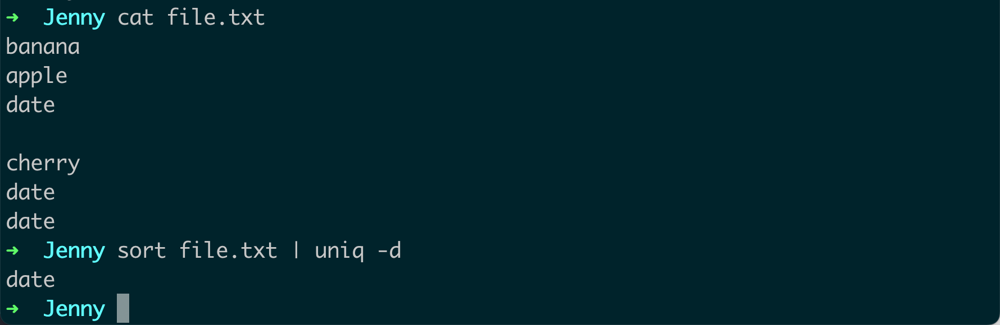

这些是 `uniq` 命令的主要用法。你可以通过 `man uniq` 命令查看详细的帮助信息。

@tab 删除相邻的重复行

让我通过一个例子来解释 "删除相邻的重复行" 这个概念。

假设我们有一个文件 `file.txt`，内容如下：

```
apple
banana
apple
banana
apple
pear
banana
pear
apple
```

如果我们直接使用 `uniq` 命令，结果将如下：

```bash
$ uniq file.txt
```

输出：

```
apple
banana
apple
banana
apple
pear
banana
pear
apple
```

你会发现，尽管 "apple" 和 "banana" 在文件中多次出现，但 `uniq` 命令并没有删除这些重复的行。这是因为 `uniq` 命令只删除**相邻**的重复行。

现在，如果我们先用 `sort` 命令将文件排序，再使用 `uniq` 命令，结果将如下：

```bash
$ sort file.txt | uniq
```

输出：

```
apple
banana
pear
```

在 `sort` 命令的作用下，所有相同的行（比如 `"apple"`、`"banana"`、`"pear"`）都被排列在一起，成为了相邻的行。然后 `uniq` 命令就能成功地删除这些重复的行。

这就是 "删除相邻的重复行" 的含义，也是为什么我们通常会在使用 `uniq` 命令之前先使用 `sort` 命令的原因。

:::

## 9. bc

`bc`（Binary Calculator）是 Unix-like 系统（如 Linux）中的一个任意精度计算器语言。你可以使用 `bc` 命令进行各种数学计算。

以下是 `bc` 命令的一些常见用法和示例：

1. **基本的计算**：你可以在命令行中使用 `bc` 进行基本的数学运算。例如，如果你想计算 `3 + 4`，你可以使用以下命令：

    ```bash
    echo '3 + 4' | bc
    ```

    这将输出 `7`。

2. **使用变量**：`bc` 支持使用变量进行计算。例如，以下命令将计算 `a * b`，其中 `a` 是 5，`b` 是 6：

    ```bash
    echo 'a=5; b=6; a*b' | bc
    ```

    这将输出 `30`。

3. **浮点数计算**：默认情况下，`bc` 命令执行的是整数运算。如果你想进行浮点数运算，你需要设置 `scale` 变量，这个变量决定了小数点后的位数。例如，以下命令将计算 `1 / 3`，并显示小数点后 3 位：

    ```bash
    echo 'scale=3; 1/3' | bc
    ```

    这将输出 `0.333`。

4. **高级数学函数**：`bc` 也支持一些高级的数学函数，比如平方根（sqrt）、指数（e）、自然对数（l）。为了使用这些高级函数，你需要使用 `-l` 选项启动 `bc`。例如，以下命令将计算平方根 `sqrt(4)`：

    ```bash
    echo 'sqrt(4)' | bc -l
    ```

    这将输出 `2`。

以上是 `bc` 命令的一些基本用法。你可以在 `bc` 的手册页（通过 `man bc` 命令查看）中找到更多详细的信息。

## 10.cp

::: tabs

@tab 快速🔜

`cp` 是 Unix 和 Linux 系统中的一个基本命令，用于复制文件和目录。`cp` 命令的基本语法是 `cp [options] source destination`，其中 `source` 是你想要复制的文件或目录，`destination` 是复制的目标位置。

以下是 `cp` 命令的一些常见用法和示例：

1. **复制文件**：最基本的 `cp` 用法是复制单个文件。例如：

    ```bash
    cp source.txt destination.txt
    ```

    这将复制 `source.txt` 文件到 `destination.txt`。如果 `destination.txt` 文件已存在，这个命令将覆盖它。

2. **复制目录**：如果你想复制整个目录及其内容，你需要使用 `-R` 或 `-r` 选项。例如：

    ```bash
    cp -R source_directory/ destination_directory/
    ```

    这将复制 `source_directory` 及其所有内容（包括子目录和文件）到 `destination_directory`。

3. **保留文件属性**：如果你想在复制文件或目录时保留其原有的属性（如所有权和权限），你可以使用 `-p` 选项。例如：

    ```bash
    cp -p source.txt destination.txt
    ```

    这将保留 `source.txt` 文件的所有权和权限。

4. **交互式复制**：如果你不希望 `cp` 命令在复制时覆盖已存在的文件，你可以使用 `-i` 选项。这将使 `cp` 命令在覆盖文件之前询问你的确认。例如：

    ```bash
    cp -i source.txt destination.txt
    ```

    如果 `destination.txt` 文件已存在，这个命令将询问你是否要覆盖它。

以上是 `cp` 命令的一些常见用法。你可以通过 `man cp` 命令查看更详细的帮助信息。

@tab cp 没有指定 `-p` 的时候，会怎么样？

当你使用 `cp` 命令复制文件或目录时，如果不指定 `-p` 选项，那么默认情况下，新复制的文件或目录将不会保留原始文件或目录的属性。

更具体地说：

- **所有权**：新复制的文件或目录将被赋予当前用户和用户组的所有权，而不是原始文件或目录的所有权。

- **权限**：新复制的文件或目录将根据当前用户的 umask 设置来确定权限，而不是保留原始文件或目录的权限。

- **时间戳**：新复制的文件或目录将具有当前的时间戳，而不是原始文件或目录的时间戳。

如果你想在复制文件或目录时保留这些属性，你应该使用 `-p` 选项。例如：

```bash
cp -p source.txt destination.txt
```

这将复制 `source.txt` 文件到 `destination.txt`，并保留文件的所有权、权限和时间戳。

@tab cp 后面的参数

在 Linux 中，`cp` 命令后面跟随的特殊字符（`*`、`[]`、`.` 等）被称为通配符（wildcards），它们在匹配文件和目录时有特殊的含义：

1. `*`：匹配任意数量的任意字符。例如，`*.txt` 匹配所有以 `.txt` 结尾的文件。

2. `?`：匹配任意一个字符。例如，`?.txt` 匹配所有单个字符的 `.txt` 文件，如 `a.txt`、`b.txt` 等。

3. `[]`：匹配括号内的任意一个字符。例如，`[abc].txt` 匹配 `a.txt`、`b.txt` 和 `c.txt`。

4. `{}`：匹配大括号中的任何一个字符串。例如，`{a,b,c}.txt` 会匹配 `a.txt`、`b.txt` 和 `c.txt`。

5. `.`：在文件或目录名中，`.` 表示当前目录。在隐藏文件或目录的名称前，`.` 也表示隐藏属性。例如，`.config` 是一个隐藏文件。

注意，使用这些通配符时，你应确保它们正确地匹配到你希望操作的文件和目录。

这就是 Linux 中 `cp` 命令后面跟随的特殊字符的含义。在实际使用时，你可能需要根据具体情况调整命令的参数。

@tab cp 通配符详细讲解

让我们通过一些具体的操作来更深入地理解这些通配符的作用。

首先，我们在当前目录下创建一个新的目录 `testdir`，然后在 `testdir` 下创建一些文件：

```bash
mkdir testdir
cd testdir
touch file123 file154 file180 apple180 banana130 cherry170 jenny239 jenny32
```

现在，我们已经创建了 `file123`、`file154`、`file180`、`apple180`、`banana130`、`cherry170` 这些文件。现在，我们可以尝试使用 `cp` 命令配合通配符来复制文件。

1. 复制以 `1` 后跟一个 2 到 7 之间的数字，再后跟一个任意数字结束的文件：

```bash
mkdir copy1
cp *1[2-7][0-9] copy1/  # 1 就是匹配数字开头，可以改成 2 自行测试
```

这条命令会将 `file123` 和 `file154` 复制到 `copy1/` 目录，因为这两个文件名都匹配 `*1[2-7][0-9]` 的模式。

2. 复制以 `180` 结束的文件：

```bash
mkdir copy2
cp *180 copy2/
```

这条命令会将 `file180` 和 `apple180` 复制到 `copy2/` 目录，因为这两个文件名都匹配 `*180` 的模式。

你可以通过 `ls` 命令来查看 `copy1/` 和 `copy2/` 目录，确认这些操作的结果：

```bash
ls copy1/
ls copy2/
```

@tab cp 覆盖？

`cp` 命令会覆盖目标目录中同名的文件。

如果你在命令行中使用 `cp` 命令复制文件，而目标目录中已经存在同名的文件，那么 `cp` 命令会直接覆盖目标目录中的同名文件，不会进行任何提示。

这是 `cp` 命令的默认行为。如果你希望在覆盖文件之前得到提示，可以使用 `-i`（interactive）选项，如：`cp -i sourcefile targetfile`。这样，在覆盖文件之前，系统会询问你是否确定要覆盖。

@tab cp 可以保留原本文件保存副本吗？

如果你想在复制文件的同时保留原始文件，你可以使用 `cp` 命令。`cp` 命令的基本操作就是在复制文件的同时保留源文件。换句话说，源文件在复制操作后仍然存在。示例如下：

```bash
cp source.txt destination.txt
```

这将创建 `destination.txt` 的一个副本，同时 `source.txt` 仍然保持不变。

但如果你的意思是在目标位置已有同名文件时，你想要保留那个原始的目标文件，那么你可以使用 `cp` 命令的 `-b`（或 `--backup`）选项。这将会在覆盖之前为目标文件创建一个备份。例如：

```bash
cp -b source.txt destination.txt
```

这将会在复制 `source.txt` 到 `destination.txt` 之前，为 `destination.txt` 创建一个备份文件，名为 `destination.txt~`。

注意，`-b` 选项可能并非所有系统的 `cp` 命令都支持。你可以通过 `man cp` 或 `cp --help` 来查看你的系统中的 `cp` 命令是否支持这个选项。

:::

## 11. 文件权限

Linux 系统是一种典型的多用户系统，不同的用户处于不同的地位，拥有不同的权限。

为了保护系统的安全性，Linux 系统对不同的用户访问同一文件（包括目录文件）的权限做了不同的规定。

::: tabs

@tab 快速🔜

在 Unix 和 Linux 系统中，文件和目录的权限是由三类用户和三种权限类型决定的。

三类用户包括文件的拥有者（user）、同一用户组的其他用户（group）和所有其他用户（others）。

三种权限类型包括读取（read）、写入（write）和执行（execute）。

以下是 Linux 文件权限的符号含义：

- **-**：表示这是一个普通文件。
- **d**：表示这是一个目录。
- **r**：表示拥有者、用户组或其他用户有读取权限。
- **w**：表示拥有者、用户组或其他用户有写入权限。
- **x**：表示拥有者、用户组或其他用户有执行权限。

例如，一个文件的权限可能如下所示：

```
-rwxr-xr--
```

这个权限字符串可以分成四个部分：

1. 第一个字符表示文件类型，`-` 表示这是一个普通文件，`d` 表示这是一个目录。
2. 接下来的三个字符 `rwx` 表示**文件拥有者**的权限。`r` 表示拥有者有读取权限，`w` 表示拥有者有写入权限，`x` 表示拥有者有执行权限。
3. 再接下来的三个字符 `r-x` 表示**用户组**的权限。`r` 表示用户组有读取权限，`-` 表示用户组没有写入权限，`x` 表示用户组有执行权限。
4. 最后三个字符 `r--` 表示所有**其他用户**的权限。`r` 表示其他用户有读取权限，`--` 表示其他用户没有写入和执行权限。

所以，这个权限字符串表示这是一个普通文件，文件拥有者有读、写和执行权限，用户组有读和执行权限，所有其他用户只有读取权限。

在 Linux 系统中，你可以使用 `chmod` 命令改变文件或目录的权限。例如，如果你想让文件拥有者、用户组和所有其他用户都有读、写和执行权限，你可以使用以下命令：

```bash
chmod 777 filename
```

在这个命令中，`777` 是一个八进制数字，表示所有用户都有读（4）、写（2）和执行（1）权限（4+2+1=7）。第一个 `7` 表示文件拥有者的权限，第二个 `7` 表示用户组的权限，第三个 `7` 表示所有其他用户的权限。

@tab 补充

在 Linux 系统中，文件或目录的权限可以通过 `ls -l` 命令查看。`ls -l` 命令的输出包含了很多信息，其中第一列就是文件或目录的权限字符串。权限字符串总共有 10 个字符，它们的含义如下：

1. **第一个字符表示文件类型**：
    - `-`：表示这是一个普通文件。
    - `d`：表示这是一个目录。
    - `l`：表示这是一个符号链接。
    - 其他的字符表示其他特殊类型的文件（如设备文件和管道文件）。

2. **接下来的三个字符表示文件拥有者的权限**：
    - `r`：表示拥有者有读取权限。
    - `w`：表示拥有者有写入权限。
    - `x`：表示拥有者有执行权限。
    - `-`：表示相应的权限不存在。

3. **再接下来的三个字符表示用户组的权限**：
    - 和文件拥有者的权限一样，这三个字符分别表示用户组的读取、写入和执行权限。

4. **最后三个字符表示所有其他用户的权限**：
    - 和文件拥有者的权限一样，这三个字符分别表示所有其他用户的读取、写入和执行权限。

现在，让我们通过一些例子来看看这些权限是如何工作的。

例如，假设你运行了 `ls -l` 命令，得到了以下的输出：

```bash
drwxr-xr-x 2 root root 4096 May 30 16:34 directory
-rw-r--r-- 1 root root 1024 May 30 16:34 file
```

在这个例子中，`directory` 是一个目录，`file` 是一个普通文件。我们可以从权限字符串中看出它们的权限：

- 对于 `directory`，权限字符串是 `drwxr-xr-x`：
    - `d` 表示这是一个目录。
    - 第一组的 `rwx` 表示文件拥有者（在这个例子中是 `root` 用户）有读取、写入和执行权限。对于目录，执行权限表示可以列出目录的内容。
    - 第二组的 `r-x` 表示用户组（在这个例子中也是 `root` 用户组）有读取和执行权限，但没有写入权限。
    - 第三组的 `r-x` 表示所有其他用户也有读取和执行权限，但没有写入权限。

- 对于 `file`，权限字符串是 `-rw-r--r--`：
    - `-` 表示这是一个普通文件。
    - 第一组的 `rw-` 表示文件拥有者有读取和写入权限，但没有执行权限。对于普通文件，执行权限表示可以运行这个

文件作为程序。
    - 第二组和第三组的 `r--` 表示用户组和所有其他用户只有读取权限，没有写入和执行权限。

这就是 Linux 文件权限的基本原理。如果你想改变文件或目录的权限，你可以使用 `chmod` 命令。例如，如果你想让所有用户都有 `file` 的读取和写入权限，你可以运行 `chmod 666 file` 命令。在这个命令中，`666` 是一个八进制数字，表示所有用户都有读（4）和写（2）权限（4+2=6）。

@tab 图解

在 Linux 中我们通常使用以下两个命令来修改文件或目录的所属用户与权限：

- chown (change owner) ： 修改所属用户与组。
- chmod (change mode) ： 修改用户的权限。

下图中通过 chown 来授权用户，通过 chmod 为用户设置可以开门的权限。


在 Linux 中我们可以使用 **ll** 或者 **ls –l** 命令来显示一个文件的属性以及文件所属的用户和组，如：

```bash
[root@www /]# ls -l
total 64
dr-xr-xr-x   2 root root 4096 Dec 14  2012 bin
dr-xr-xr-x   4 root root 4096 Apr 19  2012 boot
……
```

实例中，**bin** 文件的第一个属性用 **d** 表示。**d** 在 Linux 中代表该文件是一个目录文件。

在 Linux 中第一个字符代表这个文件是目录、文件或链接文件等等。

- 当为 **d** 则是目录
- 当为 **-** 则是文件；
- 若是 **l** 则表示为链接文档(link file)；
- 若是 **b** 则表示为装置文件里面的可供储存的接口设备(可随机存取装置)；
- 若是 **c** 则表示为装置文件里面的串行端口设备，例如键盘、鼠标(一次性读取装置)。

接下来的字符中，以三个为一组，且均为 **rwx** 的三个参数的组合。其中， **r** 代表可读(read)、 **w** 代表可写(write)、 **x** 代表可执行(execute)。 要注意的是，这三个权限的位置不会改变，如果没有权限，就会出现减号 **-** 而已。


每个文件的属性由左边第一部分的 10 个字符来确定（如下图）。


从左至右用 **0-9** 这些数字来表示。

第 **0** 位确定文件类型，第 **1-3** 位确定属主（该文件的所有者）拥有该文件的权限。

第4-6位确定属组（所有者的同组用户）拥有该文件的权限，第7-9位确定其他用户拥有该文件的权限。

其中，第 **1、4、7** 位表示读权限，如果用 **r** 字符表示，则有读权限，如果用 **-** 字符表示，则没有读权限；

第 **2、5、8** 位表示写权限，如果用 **w** 字符表示，则有写权限，如果用 **-** 字符表示没有写权限；第 **3、6、9** 位表示可执行权限，如果用 **x** 字符表示，则有执行权限，如果用 **-** 字符表示，则没有执行权限。

:::

### 11.1 Linux 连接数是什么意思？

在 Linux 中，"连接数"（也称为硬链接数或链接计数）通常指的是一个文件或目录的硬链接数量。

硬链接是文件系统中的一个引用或指向文件数据的指针。每当创建一个硬链接，文件的链接计数就会增加。每当删除一个硬链接，文件的链接计数就会减少。当链接计数达到0时，文件的数据块将被释放，该文件即被删除。

对于目录，链接数还包括子目录的数量。在 Unix 和 Linux 文件系统中，每个目录都包含两个特殊的条目：`.` 和 `..`。`.` 代表目录本身，`..` 代表父目录。这两个条目都被计入目录的链接数。因此，一个没有子目录的新目录的链接数为 2。

当你使用 `ls -l` 命令查看目录或文件的详细信息时，第二列就是链接数。例如：

```bash
drwxr-xr-x 2 user user 4096 May 30 16:34 directory
-rw-r--r-- 1 user user 1024 May 30 16:34 file
```

在这个例子中，`directory` 的链接数为 2，`file` 的链接数为 1。

### 1.3 Linux 显示的时间位置是代表的是最后修改的时间还是创建的时间？

在 Linux 系统中，当你使用 `ls -l` 命令查看文件或目录的详细信息时，时间戳字段默认显示的是最后一次修改的时间，也被称为修改时间 (`mtime`)。

不过在 Linux 中，还有两个其他的时间戳可以参考：

- 访问时间 (`atime`)：文件最后一次被读取的时间。
- 状态改变时间 (`ctime`)：文件状态最后一次改变的时间，比如权限或者所有者的改变。

注意，Linux 并不直接支持显示文件的创建时间，这是由于大多数 Linux 文件系统并不存储这个信息。这一点与一些其他的操作系统，如 Windows 和 Mac OS X，不同，这些系统会直接显示文件的创建时间。

如果你想查看这些额外的时间戳，可以使用 `stat` 命令。例如，`stat filename` 将会显示文件的访问时间、修改时间以及状态改变时间。

不过请注意，根据你的 Linux 发行版和文件系统，可用的信息可能会有所不同。

## 12. chown

`chown` 是 Linux 中用于更改文件或目录所有者和组的命令，全称是 "change owner"。以下是 `chown` 的一些常见用法和例子。

1. **更改文件或目录的所有者**：你可以使用 `chown` 命令 followed by the name of the new owner and the file or directory name to change the ownership. For example:

    ```bash
    chown newowner filename
    ```

    这个命令将会更改 `filename` 的所有者为 `newowner`。

    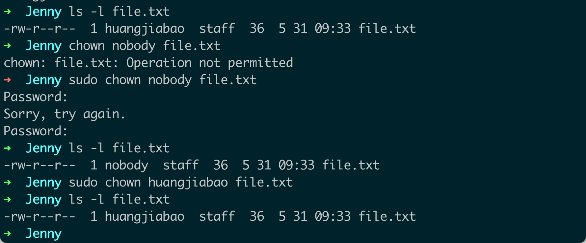

2. **更改文件或目录的所有者和组**：你可以在 `chown` 命令后加上新的所有者和组（用冒号分隔），然后是文件或目录的名称，以同时更改所有者和组。例如：

    ```bash
    chown newowner:newgroup filename
    ```

    这个命令将会更改 `filename` 的所有者为 `newowner`，并将其组更改为 `newgroup`。

3. **更改目录及其下所有文件和子目录的所有者和组**：你可以在 `chown` 命令后加上 `-R`（或 `--recursive`）选项，以递归地更改一个目录及其所有子目录和文件的所有者和组。例如：

    ```bash
    chown -R newowner:newgroup directoryname
    ```

    这个命令将会更改 `directoryname` 及其下所有子目录和文件的所有者为 `newowner`，并将其组更改为 `newgroup`。

在运行 `chown` 命令时，你需要有足够的权限。通常，只有 root 用户（或通过 sudo 命令的普通用户）才能更改文件或目录的所有者和组。

以上就是 `chown` 命令的一些常见用法。在实际使用时，你可能需要根据具体情况调整命令的参数。

## 13. chmod

`chmod` 是 Linux 中用于改变文件或目录权限的命令，全称为 "change mode"。以下是 `chmod` 的一些常见用法和例子。

1. **更改文件或目录的权限**：你可以使用 `chmod` 命令，后跟权限设定和文件或目录的名称，来更改其权限。例如：

    ```bash
    chmod 755 filename
    ```
    
    这个命令将会更改 `filename` 的权限为 `755`（所有者有读、写、执行权限；组和其他用户有读、执行权限）。

2. **使用字母设定权限**：除了数字，你还可以使用字母来设定文件或目录的权限。例如：

    ```bash
    chmod u=rwx,g=rx,o=rx filename
    ```

    这个命令将会更改 `filename` 的权限，使得所有者（user，`u`）有读、写、执行（`rwx`）权限，组（group，`g`）和其他用户（others，`o`）有读、执行（`rx`）权限。

3. **递归地更改目录及其所有文件和子目录的权限**：你可以在 `chmod` 命令后加上 `-R`（或 `--recursive`）选项，来递归地更改一个目录及其所有子目录和文件的权限。例如：

    ```bash
    chmod -R 755 directoryname
    ```
    
    这个命令将会更改 `directoryname` 及其所有子目录和文件的权限为 `755`。

在运行 `chmod` 命令时，你需要有足够的权限。通常，只有文件或目录的所有者（或 root 用户）才能更改其权限。

以上就是 `chmod` 命令的一些常见用法。在实际使用时，你可能需要根据具体情况调整命令的参数。

### 13.1 Linux 数字代表的含义

在 Linux 系统中，文件权限通常用数字表示，这些数字范围从 0 到 7。每个数字代表一组特定的权限：

- `0`：没有权限。
- `1`：执行权限。
- `2`：写入权限。
- `4`：读取权限。

你可以通过将这些数字相加来组合不同的权限。例如：

- `5`（即 4+1）：读取和执行权限。
- `6`（即 4+2）：读取和写入权限。
- `7`（即 4+2+1）：读取、写入和执行权限。

当设置文件权限时，通常需要提供三个数字，这三个数字分别代表所有者（owner）、组（group）和其他用户（others）的权限。例如，权限 `755` 表示：

- 所有者有读取、写入和执行权限（7 = 4+2+1）。
- 组有读取和执行权限（5 = 4+1）。
- 其他用户有读取和执行权限（5 = 4+1）。

同样，权限 `644` 表示：

- 所有者有读取和写入权限（6 = 4+2）。
- 组有读取权限（4）。
- 其他用户有读取权限（4）。

你可以使用 `chmod` 命令来更改文件的权限。例如，要将文件 `filename` 的权限设置为 `755`，你可以运行：

```bash
chmod 755 filename
```

这就是 Linux 系统中数字表示文件权限的方式。

## 14. vim

`vim`（Vi Improved）是 Linux 系统中一个很流行的文本编辑器，也是 vi 编辑器的一个改进版。它的功能非常强大，包括语法高亮、插件支持、多种模式等。

`vim`主要有三种模式：

1. **命令模式**：这是启动 vim 后默认进入的模式，可以使用键盘快捷键执行命令。

2. **插入模式**：在此模式下，可以插入或修改文本。

3. **命令行模式**：在此模式下，可以输入vim命令，并查看或修改文件。

下面是一些基本的 vim 命令示例：

- 打开或新建一个文件：
    ```bash
    vim filename
    ```

- 进入插入模式：在命令模式下，按`i`进入插入模式。

- 保存文件：在命令行模式下，输入`:w`保存文件。

- 退出 vim：在命令行模式下，输入`:q`退出vim。如果你修改了文件但不想保存，可以使用`:q!`强制退出。

- 同时保存文件并退出vim：在命令行模式下，输入`:wq`或者`:x`。

- 撤销上一步操作：在命令模式下，按`u`撤销上一步的修改。

- 重做上一步操作：在命令模式下，按`Ctrl + r`重做上一步的操作。

- 复制一行：在命令模式下，按`yy`复制当前行。

- 粘贴一行：在命令模式下，按`p`粘贴复制的内容。

这只是一些非常基本的 vim 命令。实际上，vim 有很多复杂的命令和功能，它们都可以帮助你更有效地编辑文件。你可能需要一段时间去熟悉和掌握这些命令。

上述示例中包含了 vim 中的两个主要模式：命令模式（Normal mode）和命令行模式（Command-line mode）。让我详细解释一下这些模式：

1. **命令模式（Normal mode）**：这是 vim 打开时的默认模式，也是 vim 的核心模式。在这种模式下，键盘按键被映射为命令，所以你可以用来移动光标、复制/粘贴文本、删除文本等。在上面的例子中，`i`（进入插入模式）、`u`（撤销）、`Ctrl + r`（重做）、`yy`（复制一行）、`p`（粘贴）都是在命令模式下执行的。

2. **命令行模式（Command-line mode）**：在这种模式下，你可以输入一些行命令来执行一些操作，比如保存文件、退出vim、搜索和替换等。你可以通过在命令模式下输入`:`来进入命令行模式。在上述例子中，`:w`（保存）、`:q`（退出）、`:wq`或`:x`（保存并退出）都是在命令行模式下输入的。

上面的示例中没有包含的模式是插入模式（Insert mode），这是你在输入文本时所处的模式。你可以通过在命令模式下输入`i`来进入插入模式。

这三种模式（命令模式、插入模式和命令行模式）是 vim 的基本操作模式，但还有其他一些模式，比如可视模式（Visual mode）、选择模式（Select mode）等，用于进行更高级的文本编辑操作。

## 15. grep

::: tabs

@tab 快速🔜

`grep` 是一个强大的文本搜索工具，它能够使用正则表达式来搜索文本文件中的特定模式。`grep` 命令的基本语法是：

```bash
grep [options] pattern [file...]
```

这里的 `pattern` 是你想要搜索的模式，`file` 是你想要搜索的文件。如果你不指定任何文件，`grep` 会从标准输入中读取数据。

以下是一些 `grep` 命令的基本示例：

1. 在一个文件中搜索文本：
    ```bash
    grep "search term" filename
    ```
   这会在 `filename` 中搜索"search term"，并打印出包含"search term"的所有行。

2. 在多个文件中搜索文本：
    ```bash
    grep "search term" file1 file2 file3
    ```
   这会在 `file1`、`file2` 和 `file3` 中搜索"search term"，并打印出包含"search term"的所有行。

3. 使用正则表达式进行搜索：
    ```bash
    grep "^[a-zA-Z]" filename
    ```
   这会在`filename`中搜索所有以字母开头的行。

以下是一些常用的 `grep` 选项：

- `-i`：忽略大小写。
- `-v`：反转搜索，只显示不匹配的行。
- `-r` 或 `-R`：递归搜索子目录中的所有文件。
- `-l`：只打印包含匹配行的文件名。
- `-n`：显示匹配行及其行号。
- `-c`：只显示匹配行的数量。
- `-w`：全词匹配，只显示完全匹配的行。

例如，如果你想在`file1`中搜索所有不包含"search term"的行，你可以使用：

```bash
grep -v "search term" file1
```

这就是`grep`命令的基本使用方法。通过组合不同的选项和正则表达式，你可以使用`grep`进行复杂的文本搜索操作。

@tab -Ein 讲解

- `-E`：这个选项告诉grep使用扩展正则表达式（Extended Regular Expressions）。扩展正则表达式提供了更多的功能，比如"(..|..)"用于匹配多个模式，"+"表示匹配一个或多个指定字符等。

- `-i`：这个选项使得grep搜索时忽略大小写。例如，如果你搜索"search"，则会匹配"search"，"Search"，"SEARCH"等。

- `-n`：这个选项让grep输出匹配行的行号。例如，如果一行匹配了你的搜索模式，grep不仅会输出这行内容，还会在前面输出这行的行号。

让我们看一个例子：

```bash
echo -e "Hello\nworld" | grep -Ei "HELLO|WORLD"
```

这个命令会输出：

```
Hello
world
```

这是因为`-E`选项让我们可以使用"|"符号来匹配"HELLO"或"WORLD"，`-i`选项让我们可以忽略大小写。

再看一个例子：

```bash
echo -e "Hello\nworld" | grep -Ein "HELLO|WORLD"
```

这个命令会输出：

```
1:Hello
2:world
```

这是因为我们添加了`-n`选项，所以grep在输出每行内容的前面加上了行号。

@tab 补充

这些都是使用`grep`命令和扩展正则表达式来搜索文本的例子。让我们一一解析：

1. `grep -Ein "\bAlice.?.?.?.?.?.?.?!" alice.txt`

    这条命令在文件`alice.txt`中查找所有包含"Alice"（注意大小写）后面紧跟着7个或更少任意字符并以感叹号"!"结束的行。"\b"表示单词边界，"."表示任意字符，而"?!"表示可选的一个感叹号。`-E`表示使用扩展正则表达式，`-i`表示忽略大小写，`-n`表示输出行号。

2. `grep -Ein "alice.?.?.?.?.?.?.?!" alice.txt`

    这条命令与第一条命令几乎相同，唯一的区别是它查找的是"alice"，而不是"Alice"。由于使用了`-i`选项，所以大小写不重要。

3. `grep -Ein "alice.{0,7}!" alice.txt`

    这条命令在文件`alice.txt`中查找所有包含"alice"后面紧跟着0到7个任意字符并以感叹号"!"结束的行。"{0,7}"表示匹配前面的元素0到7次，"."表示任意字符。

4. `grep -Ein "alice.{,7}!" alice.txt`

    这条命令与上一条命令相同，只是它使用了更简洁的语法。在扩展正则表达式中，如果你省略了花括号中的第一个数字，那么它默认为0。所以"{,7}"等价于"{0,7}"。

这四条命令都将匹配到"alice"后面跟有0到7个任意字符并以"!"结束的行，并且忽略大小写。这可能对于寻找"alice"的短句，例如"Alice!"或"Alice is here!"之类的句子非常有用。

---

在正则表达式中，`.`表示任意单个字符，而`?`表示前面的元素（在这里是`.`）是可选的，即它可能出现0次或1次。

所以，`.?`可以匹配0个或1个任意字符。

但是，如果你想要匹配0到7个任意字符，一个`.?`是不够的。因为它只能匹配0个或1个字符，无法达到匹配多个字符的效果。

在你的命令`grep -Ein "\bAlice.?.?.?.?.?.?.?!" alice.txt`中，`.?.?.?.?.?.?.?.?`就是为了匹配0到7个任意字符。每一个`.?`都可以匹配0个或1个字符，所以连续的7个`.?`可以匹配0到7个字符。

但是，这种写法确实有些冗余，你可以使用`{}`来指定匹配的次数，这样代码就会更简洁。所以，`grep -Ein "Alice.{0,7}!" alice.txt`和`grep -Ein "\bAlice.?.?.?.?.?.?.?!" alice.txt`是等效的，只是后者的写法更冗余一些。

:::


## 16. 正则表达式

| 模式| 描述|
|----|----|
| `\w`  | 匹配字母数字及下划线 |
| `\W`  | 匹配非字母数字下划线 |
| `\s`  | 匹配任意空白字符，等价于 [\t\n\r\f]. |
| `\S`  | 匹配任意非空字符 |
| `\d`  | 匹配任意数字，等价于 [0-9] |
| `\D`  | 匹配任意非数字 |
| `\A`  | 匹配字符串开始 |
| `\Z`  | 匹配字符串结束，如果是存在换行，只匹配到换行前的结束字符串 |
| `\z`  | 匹配字符串结束 |
| `\G`  | 匹配最后匹配完成的位置 |
| `\n` | 匹配一个换行符 |
| `\t` | 匹配一个制表符 |
| `^` | 匹配字符串的开头 |
| `$` | 匹配字符串的末尾。|
| `.` | 匹配任意字符，除了换行符，当 `re.DOTALL` 标记被指定时，则可以匹配包括换行符的任意字符。 |
| `[...]` | 用来表示一组字符,单独列出：`[amk]` 匹配 'a'，`'m'` 或 `'k'` |
| `[^...]`  | 不在[]中的字符：`[^abc]` 匹配除了a,b,c之外的字符。 |
| `*` | 匹配0个或多个的表达式。|
| `+` | 匹配1个或多个的表达式。|
| `?` | 匹配0个或1个由前面的正则表达式定义的片段，非贪婪方式|
| `{n}` | 精确匹配n个前面表达式。|
| `{n, m}` | 匹配 n 到 m 次由前面的正则表达式定义的片段，贪婪方式|
| `a|b` | 匹配 `a` 或 `b` |
| `( )` | 匹配括号内的表达式，也表示一个组 |

::: tabs

@tab Linux 正则表达式学习

正则表达式是一种在字符串中进行复杂搜索和替换操作的强大工具。在 Linux 中，它通常与各种命令一起使用，如 grep、sed、awk 等。下面是一些基本的正则表达式的元素：

1. `.` ：匹配任何单个字符。

2. `*`：匹配前面的元素零次或多次。例如，`a*` 可以匹配 `a`, `aa`, `aaa` 或是空字符串。

3. `+`：匹配前面的元素一次或多次。例如，`a+` 可以匹配 `a`, `aa`, `aaa`，但不匹配空字符串。

4. `?`：匹配前面的元素零次或一次。例如，`a?` 可以匹配 `a` 或是空字符串。

5. `^`：匹配输入字符串的开始位置。例如，`^a` 会匹配所有以 `a` 开头的字符串。

6. `$`：匹配输入字符串的结束位置。例如，`a$` 会匹配所有以 `a` 结束的字符串。

7. `[abc]`：匹配方括号内的任意一个字符，例如 `a`, `b` 或 `c`。

8. `[^abc]`：匹配任何不在方括号内的字符。

9. `(abc|def)`：匹配 `abc` 或 `def`。

10. `{n}`：精确匹配前面的元素 n 次。

11. `{n,}`：匹配前面的元素 n 次或更多次。

12. `{n,m}`：匹配前面的元素至少 n 次，但是不超过 m 次。

一些用于 Linux 命令行的正则表达式的例子：

1. `grep "^a" file.txt`：在 `file.txt` 文件中查找以 `a` 开头的所有行。

2. `sed 's/^abc/xyz/' file.txt`：在 `file.txt` 文件中，将所有以 `abc` 开头的行替换为以 `xyz` 开头。

3. `awk '/error/{print $0}' logfile`：在 `logfile` 文件中查找包含 "error" 的所有行并打印。

学习正则表达式需要时间和实践，但掌握这个工具后，你将能够更高效地处理文本数据。

@tab echo 使用正则表达式呢？

`echo` 命令本身并不直接使用正则表达式，它主要用于在终端上打印字符串或变量的内容。然而，你可以将 `echo` 命令的输出配合管道 (`|`) 和支持正则表达式的其他命令一起使用，例如 `grep`、`sed`、`awk` 等。这里有一些例子：

1. 使用 `grep` 和正则表达式搜索特定模式：

```bash
echo "Hello World" | grep -o "World"
```

这将打印 "World"，因为 `grep` 用 "-o" 参数将只打印匹配到的部分，这里的正则表达式是 "World"。

2. 使用 `sed` 和正则表达式替换文本：

```bash
echo "Hello World" | sed 's/World/Everyone/'
```

这将打印 "Hello Everyone"，因为 `sed` 用 's/World/Everyone/' 替换了 "World" 为 "Everyone"。

3. 使用 `awk` 和正则表达式进行更复杂的文本处理：

```bash
echo -e "Hello World\nGoodbye World" | awk '/Hello/ {print $0}'
```

这将只打印 "Hello World"，因为 `awk` 命令只打印匹配到 `/Hello/` 正则表达式的行。

请注意，这些例子都使用了管道操作符 `|`，这个操作符将前一个命令的输出作为下一个命令的输入。这是 Unix 和 Linux shell 中一个非常强大的特性，它允许你将多个命令组合在一起形成更复杂的操作。

@tab 在Linux 下有些正则表达式不起作用，是不是要使用 `-E` 还是其他？

在 Linux 中，正则表达式有两种形式：基础正则表达式 (BREs) 和扩展正则表达式 (EREs)。`grep` 和 `sed` 等工具默认使用的是基础正则表达式，而在这种模式下，一些特殊的元字符，例如 `+`、`?` 和 `|`，必须被转义（即前面加上 `\`）才能起作用。

例如，如果你想在 `grep` 中使用 `+` 字符来匹配一个或多个字符，你需要这样写：

```bash
echo "Hello" | grep 'l\+'
```

这将匹配所有包含一个或多个 'l' 的行。

如果你想使用扩展正则表达式，那么可以使用 `grep -E` 或 `egrep`，以及 `sed -E`。在这种模式下，`+`、`?` 和 `|` 等字符无需转义：

```bash
echo "Hello" | grep -E 'l+'
```

这同样会匹配所有包含一个或多个 'l' 的行，但是我们没有使用 `\` 来转义 `+`。

请注意，尽管扩展正则表达式提供了更多的特性，但并不是所有的工具都支持。例如，`awk` 默认就使用扩展正则表达式，无需任何特殊选项。你应该查阅具体工具的手册来确定如何使用正则表达式。

@tab 

:::

## 17. sed

::: tabs

@tab 快速🔜

`sed` 是 "stream editor" 的缩写，是一个在 Unix 和类 Unix 系统中用于处理文本流的工具。它基于文本模式的工作方式可以对输入数据进行各种操作。

最常用的 `sed` 命令是替换命令 `s`。下面是一个基础的替换示例：

```bash
echo "Hello, world!" | sed 's/world/earth/'
```

这个命令将 "Hello, world!" 替换为 "Hello, earth!"。

在 `s` 命令中，第一个斜杠 `/` 后的字符串是搜索模式，第二个斜杠后的字符串是替换模式。

这是替换命令的一般形式：

```
s/search/replace/
```

你也可以添加一个选项来修改替换的行为。例如，添加 `g` 选项可以全局替换一行中的所有匹配项：

```bash
echo "Hello, world! Hello, world!" | sed 's/world/earth/g'
```

这个命令将 "Hello, world! Hello, world!" 替换为 "Hello, earth! Hello, earth!"。

注意：在默认情况下，`sed` 只会替换每一行中的第一个匹配项。

`sed` 还有其他许多命令和选项，例如删除命令 `d`，打印命令 `p` 等。下面是一些更复杂的例子：

删除空白行：

```bash
sed '/^$/d' filename
```

这个命令将删除文件中的所有空白行。`^$` 是一个正则表达式，匹配所有空白行。

打印文件的第 5 行：

```bash
sed -n '5p' filename
```

这个命令将只打印文件的第 5 行。`-n` 选项告诉 `sed` 只打印处理过的行。

`sed` 是一个非常强大的工具，以上只是很基础的介绍。要了解更多，你可以查阅 `sed` 的手册页（通过 `man sed` 命令）或者其他在线资源。

@tab -i 保存

当你使用 `sed` 对文件进行操作时，`sed` 默认的行为是将修改后的结果输出到标准输出（通常是你的终端或控制台），而不会改变原始的文件。这意味着你可以查看修改的结果，而不用担心会误改原始文件。

如果你想要保存 `sed` 的修改结果到原始文件中，你可以使用 `-i` 选项。例如：

```bash
sed -i 's/foo/bar/g' filename
```

这个命令将在文件 `filename` 中将所有的 "foo" 替换为 "bar"，并将修改的结果保存回 `filename`。

请注意，`-i` 选项会直接修改文件，这意味着原始的文件内容将会丢失。在使用 `-i` 选项之前，你应该确保你有备份，或者你确定你的 `sed` 命令是正确的。

另外，`-i` 选项在 GNU 版本的 `sed`（即在 Linux 上通常使用的版本）中是可用的，但在一些其他版本的 `sed` 中可能不可用，例如在 BSD 或 macOS 中的 `sed`。在那些系统中，你需要给 `-i` 选项提供一个扩展名，`sed` 将会创建一个带有该扩展名的备份文件。例如：

```bash
sed -i.bak 's/foo/bar/g' filename
```

这个命令会创建一个 `filename.bak` 的备份文件，然后将修改后的结果保存到 `filename` 中。

:::


## 18. awk

::: tabs

@tab 快速🔜

`awk` 是一个强大的文本处理命令，它在 Unix 和 Unix-like 系统（如 Linux）中被广泛使用。`awk` 命令非常适合处理结构化的文本数据，特别是 CSV 和 TSV 文件。

在其最简单的形式中，`awk` 命令接受一个或多个脚本或者 "动作"，然后对输入的每一行执行这些动作。

```bash
awk 'pattern { action }' filename
```

上述命令会读取文件 `filename` 的内容，对每一行进行处理。如果某行匹配 `pattern`，则执行 `action`。

如果不提供 `pattern`，`awk` 将会对所有行执行 `action`。

例如，我们可以使用 `awk` 打印文件的第一列：

```bash
awk '{ print $1 }' filename
```

在这个例子中，`$1` 表示第一列。你可以用 `$2`、`$3` 等来引用其他列。`$0` 表示整行。

我们也可以使用 `awk` 计算输入的平均值。例如，如果我们有一个文件，它的每一行都是一个数字，我们可以这样计算平均值：

```bash
awk '{ sum += $1 } END { print sum / NR }' filename
```

这个脚本在读取每一行时都将第一列的值添加到变量 `sum` 中。`END` 是一个特殊的模式，它的动作会在 `awk` 读完所有的输入之后执行。`NR` 是一个特殊的变量，它表示当前的行号，也就是已经读取的行数。

你也可以用 `-F` 选项来指定字段的分隔符：

```bash
awk -F: '{ print $1 }' /etc/passwd
```

在这个例子中，我们使用 `:` 作为字段的分隔符，并打印 `/etc/passwd` 文件的第一列。

这只是 `awk` 的一些基础用法。`awk` 实际上是一种完整的编程语言，它有自己的语法和一套强大的函数库，可以处理复杂的文本处理任务。你可以查阅 `awk` 的手册页（使用 `man awk` 命令）或其他在线资源来了解更多信息。

@tab && 的作用？

在 `awk` 中，双符号 `&&` 用作逻辑 "AND" 运算符。也就是说，如果它左边和右边的表达式都为真，那么整个表达式就为真。

以下是一个 `awk` 使用 `&&` 的例子：

```bash
awk '$1 > 5 && $2 > 5' filename
```

这个命令会从文件 `filename` 中选出第一列和第二列的值都大于 5 的行。

例如，如果 `filename` 文件的内容是：

```
1 2
3 4
6 7
8 9
```

那么 `awk '$1 > 5 && $2 > 5' filename` 命令的输出就会是：

```
6 7
8 9
```

因为只有最后两行的第一列和第二列的值都大于 5。

总的来说，`&&` 运算符在 `awk` 中用于连接需要同时满足的条件。

@tab 详细解释 `awk '{ print $1 }' filename`

这个 `awk` 命令会打印 `filename` 文件中每一行的第一列。

在这个命令中，`awk` 是命令名，`'{ print $1 }'` 是传递给 `awk` 的脚本，而 `filename` 是输入文件的名字。

`awk` 命令读取输入文件（在这个例子中是 `filename`），一行一行地处理。对于每一行，它都会执行提供的脚本。

在脚本中，`print $1` 命令告诉 `awk` 打印每一行的第一列。在 `awk` 中，`$1`、`$2`、`$3` 等分别表示第一列、第二列、第三列，以此类推。`$0` 则表示整行。

默认情况下，`awk` 使用任何空格或者制表符作为字段的分隔符。这意味着，如果一行是 "Hello, world!"，那么 `$1` 就是 "Hello,"，而 `$2` 就是 "world!"。

因此，这个命令会打印 `filename` 文件中每一行的第一部分，部分之间由空格或制表符分隔。如果你想改变字段的分隔符，你可以使用 `-F` 选项。例如，`awk -F: '{ print $1 }' filename` 命令会使用冒号 `:` 作为字段的分隔符。

@tab awk 具体例子

通过一个具体的例子来解释 `awk '{ print $1 }' filename` 这个命令。

假设我们有一个文件叫做 `data.txt`，内容如下：

```
Tom 23 Engineer
Jerry 25 Designer
Spike 30 Developer
```

这个文件中，每一行代表一个人，第一列是名字，第二列是年龄，第三列是职业。

现在，如果我们运行命令 `awk '{ print $1 }' data.txt`，`awk` 会读取文件 `data.txt`，然后对文件中的每一行执行 `{ print $1 }` 这个脚本。

在这个脚本中，`$1` 指的是每一行的第一列，所以 `{ print $1 }` 会打印出每一行的第一列，也就是每个人的名字。

运行这个命令后，你会看到如下的输出：

```
Tom
Jerry
Spike
```

这就是 `awk '{ print $1 }' filename` 命令的作用。它从文件中提取出了每一行的第一列。

@tab 同时提取多个列

如果你想同时打印多列，只需要在 `print` 语句中用逗号分隔各个列编号就可以了。例如，如果你想打印出第一列和第三列，你可以这样做：

```bash
awk '{ print $1, $3 }' filename
```

假设我们还是用上面的 `data.txt` 文件作为例子：

```
Tom 23 Engineer
Jerry 25 Designer
Spike 30 Developer
```

那么 `awk '{ print $1, $3 }' data.txt` 命令的输出就会是：

```
Tom Engineer
Jerry Designer
Spike Developer
```

你可以看到，输出中只包含了每一行的第一列（名字）和第三列（职业）。第二列（年龄）被省略了。

你还可以使用 `$0` 来打印整行。例如，`awk '{ print $0 }' filename` 将会打印文件的全部内容，这和 `cat filename` 命令的效果相同。

@tab 扩展

如果你想要在 `awk` 脚本中包含多个命令，你可以将它们放在不同的花括号 `{}` 中。每个 `{}` 中的部分都被称为一个 "动作"，并且可以包含一个或多个 `awk` 命令。

例如，让我们假设你有一个文件 `numbers.txt`，它的内容如下：

```
1
2
3
4
5
```

你想要计算所有数字的和（`sum`）和平均值（`avg`）。你可以使用以下的 `awk` 命令：

```bash
awk '{ sum += $1 } { avg = sum / NR } END { print "Sum: " sum ", Average: " avg }' numbers.txt
```

这个命令有三个动作：

1. `{ sum += $1 }`：这个动作在每行执行时都会将第一列的值（也就是每一行的数字）加到 `sum` 中。

2. `{ avg = sum / NR }`：这个动作在每行执行时都会计算到目前为止的平均值。它将 `sum`（到目前为止的总和）除以 `NR`（到目前为止的行数）。

3. `END { print "Sum: " sum ", Average: " avg }`：这个动作在读完所有输入之后执行，它打印 `sum` 和 `avg` 的值。

所以，对于这个 `numbers.txt` 文件，命令的输出会是：

```
Sum: 15, Average: 3
```

这表示文件中所有数字的和是 15，平均值是 3。

@tab 杂物

## 详细讲解：awk '{ sum += $1 } END { print sum / NR }' filename

这个 `awk` 命令的作用是计算文件 `filename` 中第一列数值的平均值。现在让我们详细解释一下这个命令的各个部分。

首先，这是一个 `awk` 命令，它会读取输入文件（在这里是 `filename`），然后对文件中的每一行执行给定的脚本。

脚本有两个部分：

1. `{ sum += $1 }`：这部分在读取每一行时都会执行。`$1` 表示每一行的第一列，`sum += $1` 会将第一列的值添加到变量 `sum` 中。注意，`awk` 中的变量在使用之前不需要明确声明，并且如果没有赋值，它们的默认值是 0 或空字符串。

2. `END { print sum / NR }`：这部分在 `awk` 读完所有的输入之后执行。`END` 是一个特殊的模式，当 `awk` 结束输入时，会执行与其相关联的动作。在这个例子中，动作是 `print sum / NR`，其中 `NR` 是一个特殊的变量，它代表当前的行号，也就是已经读取的行数。所以，`sum / NR` 就计算了第一列值的平均数，然后 `print` 会将结果打印出来。

所以，整个命令的意思是：对于文件 `filename` 的每一行，将第一列的值加到 `sum` 中，然后在读完所有行之后，打印 `sum` 除以行数 `NR` 的结果，也就是第一列的平均值。

## 具体测试数据

假设我们有一个文件叫做 `numbers.txt`，其内容如下：

```
1
2
3
4
5
```

这个文件中的每一行都有一个数字。

现在，我们执行命令 `awk '{ sum += $1 } END { print sum / NR }' numbers.txt`。

这个命令首先会将文件 `numbers.txt` 中每一行的数字加到 `sum` 变量中。在这个例子中，`sum` 最终的值会是 `1 + 2 + 3 + 4 + 5 = 15`。

然后，当所有的行都被读取之后，命令会计算 `sum` 变量的值除以行数 `NR` 的结果。在这个例子中，因为文件有 5 行，所以 `NR` 的值是 5。所以，命令会打印出 `15 / 5 = 3`。

所以，这个命令的结果就是 `3`，这是文件 `numbers.txt` 中所有数字的平均值。

你可以在 Linux 命令行中使用以下命令来创建 `numbers.txt` 文件：

```bash
echo -e "1\n2\n3\n4\n5" > numbers.txt
```

然后，你就可以使用 `awk '{ sum += $1 } END { print sum / NR }' numbers.txt` 命令来测试了。

## 怎么输出 sum

如果你只想输出 `sum` 的值，你可以将输出的动作放在 `END` 块中。`END` 块中的代码会在 `awk` 读完所有输入后执行。例如：

```bash
awk '{ sum += $1 } END { print sum }' numbers.txt
```

这个命令会首先计算 `numbers.txt` 文件中所有数的和（就像之前的命令一样），然后在读完所有输入之后，打印 `sum` 的值。所以，这个命令的结果就是 `numbers.txt` 文件中所有数的和。

在我们之前的例子中，`numbers.txt` 文件的内容是：

```
1
2
3
4
5
```

所以，`awk '{ sum += $1 } END { print sum }' numbers.txt` 命令的结果会是 `1 + 2 + 3 + 4 + 5 = 15`。

:::


## 19. grep 和 sed 、awk 的区别

`grep`、`sed` 和 `awk` 都是 Unix 和 Unix-like 系统（如 Linux）中常见的文本处理工具，但它们之间有一些重要的区别。

1. `grep`：`grep` 是一个基于行的搜索工具，可以使用正则表达式来搜索文件中的行。它的主要用途是找到包含（或不包含）特定模式的行。

例如，以下命令会找到文件 `filename` 中包含 "hello" 的所有行：

```bash
grep "hello" filename
```

2. `sed`：`sed`（流编辑器）是一个用来对文本文件进行编辑的工具。它可以基于行或者基于模式进行处理，并且可以执行复杂的编辑操作，如添加、删除、替换等。

例如，以下命令会将文件 `filename` 中的所有 "hello" 替换为 "world"：

```bash
sed 's/hello/world/g' filename
```

3. `awk`：`awk` 是一个完整的文本处理编程语言，特别适合处理结构化的文本数据，如 CSV 或 TSV 文件。`awk` 可以根据列处理数据，它提供了复杂的数据操作功能，包括条件语句、循环和函数。

例如，以下命令会打印文件 `filename` 中第一列大于5的所有行：

```bash
awk '$1 > 5' filename
```

总的来说，虽然 `grep`、`sed` 和 `awk` 都可以处理文本数据，但它们各有优势：`grep` 适合进行基于行的搜索，`sed` 是一个强大的流编辑器，而 `awk` 是一个面向列的数据处理语言。选择使用哪一个取决于你的具体需求。

**速查表：**

以下是一些可能的考虑因素，可以帮助你决定何时使用 `grep`、`sed` 或 `awk`：

| 工具   | 优势                                                         | 最佳使用场景                                                 |
| ------ | ------------------------------------------------------------ | ------------------------------------------------------------ |
| `grep` | 快速查找包含或不包含特定模式的行。可以使用基本和扩展的正则表达式。 | 当你只需要查找文本或查找特定模式的行时，或者需要统计模式出现的次数时，`grep` 是最好的选择。 |
| `sed`  | 强大的文本编辑器，可以进行添加、删除、替换等多种操作。基于行或模式处理。 | 当你需要编辑文本文件，例如替换文本，删除行，或者基于模式修改文本时，`sed` 是一个非常好的选择。 |
| `awk`  | 完整的编程语言，可以进行复杂的数据操作。面向列的处理，非常适合处理结构化的文本数据。 | 当你处理的是结构化的文本数据，例如 CSV 或 TSV 文件，需要对列进行操作，或者需要进行条件语句、循环和函数操作时，`awk` 是最好的选择。 |

这些只是一些基本的指导原则，实际上，`grep`、`sed` 和 `awk` 都是非常灵活的，可以应对各种各样的文本处理需求。有时候，你可能会发现组合使用这些工具可以更好地解决问题。


## 20.ps

`ps` 是 Linux 系统中的一个命令，用于查看系统中的运行中进程的状态。`ps` 命令可以显示每个进程的进程 ID，用户 ID，CPU 使用时间，进程启动时的命令等信息。

`ps` 命令的常见选项包括：

- `-e`：显示所有进程。
- `-f`：显示完全格式的输出，包括更多的详细信息。
- `-l`：显示长格式的输出，包括更多的详细信息。
- `-u` 用户名：只显示某个用户的进程。
- `-p` PID：只显示某个特定 PID（进程ID）的进程。

下面是一些使用 `ps` 命令的例子：

1. 查看所有进程：

```bash
ps -e
```

这个命令会显示系统中所有运行中的进程。

2. 查看所有进程的完全格式输出：

```bash
ps -ef
```

这个命令会显示更多的信息，如进程启动的时间，父进程 ID，进程使用的 CPU 和内存等。

3. 查看某个用户的进程：

```bash
ps -u root
```

这个命令只显示 `root` 用户的进程。

4. 查看某个特定 PID 的进程：

```bash
ps -p 1234
```

这个命令只显示 PID 为 `1234` 的进程。

5. 显示所有进程的长格式输出：

```bash
ps -el
```

这个命令会显示所有进程的更多信息，包括优先级、nice 值、进程大小等。

注意：`ps` 命令的选项可以组合使用，比如 `ps -efl` 会显示所有进程的完全格式长格式输出。

## 21. bash 比较运算符

在 Bash 脚本中，你可以使用比较运算符来比较两个值。以下是常用的比较运算符列表：

### 数值比较：

| 运算符 | 描述                                                  |
| ------ | ----------------------------------------------------- |
| -eq    | 等于。如果两个数相等，返回 true。                     |
| -ne    | 不等于。如果两个数不相等，返回 true。                 |
| -gt    | 大于。如果第一个数大于第二个数，返回 true。           |
| -ge    | 大于等于。如果第一个数大于或等于第二个数，返回 true。 |
| -lt    | 小于。如果第一个数小于第二个数，返回 true。           |
| -le    | 小于等于。如果第一个数小于或等于第二个数，返回 true。 |

### 字符串比较：

| 运算符 | 描述                                                         |
| ------ | ------------------------------------------------------------ |
| =      | 等于。如果两个字符串相等，返回 true。                        |
| !=     | 不等于。如果两个字符串不相等，返回 true。                    |
| \<     | 小于，按字典顺序。如果第一个字符串小于第二个字符串，返回 true。 |
| \>     | 大于，按字典顺序。如果第一个字符串大于第二个字符串，返回 true。 |
| -z     | 字符串的长度是否为零。如果是，返回 true。                    |
| -n     | 字符串的长度是否不为零。如果是，返回 true。                  |

### 文件比较：

| 运算符  | 描述                                                         |
| ------- | ------------------------------------------------------------ |
| -d file | 文件是否是一个目录。如果是，返回 true。                      |
| -e file | 文件是否存在。如果是，返回 true。                            |
| -f file | 文件是否是一个普通文件（非目录或设备文件）。如果是，返回 true。 |
| -r file | 文件是否可读。如果是，返回 true。                            |
| -s file | 文件是否非空（文件大小是否大于0）。如果是，返回 true。       |
| -w file | 文件是否可写。如果是，返回 true。                            |
| -x file | 文件是否可执行。如果是，返回 true。                          |
| -O file | 当前用户是否为文件的所有者。如果是，返回 true。              |
| -G file | 当前用户是否为文件所在组的用户。如果是，返回 true。          |

注意，Bash中所有的这些比较运算符都应该被包含在条件测试的方括号中，例如 `[ $a -eq $b ]`。

### 21.1实操

让我们使用各种比较运算符来创建一些 Bash `if`语句的示例。

1. 数值比较

```bash
#!/bin/bash

a=10
b=20

if [ $a -eq $b ]; then
    echo "a 等于 b"
fi

if [ $a -ne $b ]; then
    echo "a 不等于 b"
fi

if [ $a -gt $b ]; then
    echo "a 大于 b"
fi

if [ $a -ge $b ]; then
    echo "a 大于或等于 b"
fi

if [ $a -lt $b ]; then
    echo "a 小于 b"
fi

if [ $a -le $b ]; then
    echo "a 小于或等于 b"
fi
```

2. 字符串比较

```bash
#!/bin/bash

str1="apple"
str2="banana"

if [ $str1 = $str2 ]; then
    echo "str1 等于 str2"
fi

if [ $str1 != $str2 ]; then
    echo "str1 不等于 str2"
fi

if [ $str1 \< $str2 ]; then
    echo "str1 小于 str2"
fi

if [ $str1 \> $str2 ]; then
    echo "str1 大于 str2"
fi

if [ -z $str1 ]; then
    echo "str1 的长度为零"
fi

if [ -n $str1 ]; then
    echo "str1 的长度非零"
fi
```

3. 文件比较

```bash
#!/bin/bash

file="script.sh"

if [ -d $file ]; then
    echo "文件是一个目录"
fi

if [ -e $file ]; then
    echo "文件存在"
fi

if [ -f $file ]; then
    echo "文件是一个普通文件"
fi

if [ -r $file ]; then
    echo "文件可读"
fi

if [ -s $file ]; then
    echo "文件大小非零"
fi

if [ -w $file ]; then
    echo "文件可写"
fi

if [ -x $file ]; then
    echo "文件可执行"
fi

if [ -O $file ]; then
    echo "当前用户为文件的所有者"
fi

if [ -G $file ]; then
    echo "当前用户为文件所在组的用户"
fi
```

这些示例中，`then` 后的 `echo` 命令只有当 `if` 语句中的条件为真时才会被执行。每个 `if` 语句都以 `fi` 结束，这是 `if` 的反向拼写，表示 `if` 语句的结束。这是 Bash 语法的一部分。

### 21.2 bash if 比较语法

`if` 语句是 Bash 中的一种条件控制结构，它用来根据条件执行相应的代码块。下面是 `if` 语句的基本语法：

```bash
if [ condition ]
then
   # 运行此处的代码如果条件为真
fi
```

在这里，`condition` 是一个条件表达式，如果它的结果为真（返回值为0），那么 `then` 后面的代码块就会被执行。`fi` 用来结束 `if` 语句。

此外，`if` 语句还有一些更复杂的形式，包括 `else`、`elif` 和嵌套的 `if` 语句。

1. `if-else` 语句：

```bash
if [ condition ]
then
   # 运行此处的代码如果条件为真
else
   # 运行此处的代码如果条件为假
fi
```

如果 `condition` 的结果为假（返回值非0），那么 `else` 后面的代码块就会被执行。

2. `if-elif-else` 语句：

```bash
if [ condition1 ]
then
   # 运行此处的代码如果 condition1 为真
elif [ condition2 ]
then
   # 运行此处的代码如果 condition1 为假，且 condition2 为真
else
   # 运行此处的代码如果 condition1 和 condition2 都为假
fi
```

`elif` 是 "else if" 的缩写，用来检查多个条件。

3. 嵌套的 `if` 语句：

```bash
if [ condition1 ]
then
   if [ condition2 ]
   then
      # 运行此处的代码如果 condition1 和 condition2 都为真
   fi
fi
```

你可以在 `if` 语句中嵌套其他的 `if` 语句，以进行更复杂的条件判断。

在 Bash 中，条件表达式需要放在方括号 (`[]`) 中，并且方括号与条件表达式之间要有空格。你可以使用各种比较运算符（如 `-eq`、`-ne`、`-gt`、`-lt`、`-ge`、`-le` 等）来编写条件表达式。此外，你也可以使用逻辑运算符（如 `!`（非）、`-a`（与）、`-o`（或））来组合或取反条件表达式。

如果你想要检查一个命令的返回值，你可以直接把命令放在 `if` 语句中，例如：

```bash
if command
then
   # 运行此处的代码如果 command 成功执行（返回值为0）
fi
```

注意，Bash 中命令的返回值为0表示成功，非0表示失败。这与条件表达式的真假是一致的。

## 22. for

Bash 脚本中的 `for` 循环提供了一种重复执行一段代码的方法。你可以用它来遍历一系列的值，或者循环执行一段代码直到满足某个条件为止。

以下是 `for` 循环的几种常见形式：

1. 基本的 `for` 循环：

```bash
for variable in list
do
    # 在这里执行代码
    # 可以通过 $variable 引用当前的元素
done
```

在这个形式中，`list` 是一个空格分隔的值的列表，`for` 循环会遍历列表中的每一个值，每次循环都会将当前的值赋给 `variable`，然后执行 `do` 和 `done` 之间的代码。

例如，你可以使用以下的脚本打印出一系列的数字：

```bash
for i in 1 2 3 4 5
do
    echo "数字是 $i"
done
```

2. 利用命令的输出作为列表：

```bash
for variable in $(command)
do
    # 在这里执行代码
    # 可以通过 $variable 引用当前的元素
done
```

在这个形式中，`command` 是一个可以生成列表的命令，`for` 循环会遍历命令的输出中的每一行。

例如，你可以使用以下的脚本来列出一个目录中的所有文件：

```bash
for file in $(ls)
do
    echo "文件名是 $file"
done
```

3. C 风格的 `for` 循环：

```bash
for ((initialization; condition; increment))
do
    # 在这里执行代码
done
```

在这个形式中，`initialization` 是初始化变量的表达式，`condition` 是循环的结束条件，`increment` 是每次循环结束后更新变量的表达式。

例如，你可以使用以下的脚本来打印出一系列的数字：

```bash
for ((i = 1; i <= 5; i++))
do
    echo "数字是 $i"
done
```

在所有的 `for` 循环中，你都可以使用 `break` 和 `continue` 语句来控制循环的执行。`break` 语句可以立即结束循环，而 `continue` 语句可以跳过当前的循环迭代，直接进入下一次循环。

以上就是 Bash 中 `for` 循环的基本语法。需要注意的是，Bash 脚本对于空格和换行有严格的要求，所以在编写脚本时需要确保语法的正确性。

### 22.1 for 示例

1. 基本的 `for` 循环：

```bash
#!/bin/bash

# 打印数字1到5
for i in 1 2 3 4 5
do
    echo "数字是 $i"
done
```

在这个示例中，`for` 循环遍历了值列表 `1 2 3 4 5`，并打印出每一个数字。

2. 利用命令的输出作为列表：

```bash
#!/bin/bash

# 打印出当前目录下的所有文件名
for file in $(ls)
do
    echo "文件名是 $file"
done
```

在这个示例中，`ls` 命令的输出被用作 `for` 循环的值列表。`for` 循环遍历了目录中的每一个文件，然后打印出每一个文件名。

3. C 风格的 `for` 循环：

```bash
#!/bin/bash

# 打印数字1到5
for ((i = 1; i <= 5; i++))
do
    echo "数字是 $i"
done
```

在这个示例中，`for` 循环从 `i = 1` 开始，每次循环增加 `i` 的值，直到 `i` 大于 `5`。每次循环都会打印出 `i` 的值。

4. 使用 `break` 和 `continue` 语句：

```bash
#!/bin/bash

# 打印数字1到5，但跳过数字3
for i in 1 2 3 4 5
do
    if [ $i -eq 3 ]; then
        continue
    fi
    echo "数字是 $i"
done
```

在这个示例中，当 `i` 等于 `3` 时，`continue` 语句会被执行，导致 `for` 循环直接进入下一次迭代，因此不会打印出数字 `3`。

以上就是 `for` 循环的一些具体示例。希望这些示例能帮助你理解 `for` 循环的工作原理。

## 23. while

在 Bash 中，`while` 循环用于重复执行一段代码，直到指定的条件不满足为止。以下是 `while` 循环的基本语法：

```bash
while [ condition ]
do
   # 运行此处的代码如果条件为真
done
```

在这里，`condition` 是一个条件表达式，如果它的结果为真（返回值为0），那么 `do` 后面的代码块就会被执行。一旦代码块执行完毕，`while` 循环就会再次检查条件。如果条件仍然满足，代码块就会继续执行，如此反复，直到条件不再满足为止。`done` 用来结束 `while` 循环。

例如，以下的 `while` 循环会打印出数字1到5：

```bash
count=1
while [ $count -le 5 ]
do
   echo $count
   count=$((count + 1))
done
```

在这个例子中，循环会一直执行，直到 `count` 的值大于5为止。

`while` 循环还有另一种形式，叫做 `until` 循环，其工作方式与 `while` 循环恰好相反：它会一直执行循环，直到条件满足为止。以下是 `until` 循环的基本语法：

```bash
until [ condition ]
do
   # 运行此处的代码如果条件为假
done
```

与 `for` 循环一样，`while` 和 `until` 循环中也可以使用 `break` 和 `continue` 语句来控制循环的执行。`break` 语句可以立即结束循环，而 `continue` 语句可以跳过当前的循环迭代，直接进入下一次循环。

在 Bash 中，条件表达式需要放在方括号 (`[]`) 中，并且方括号与条件表达式之间要有空格。你可以使用各种比较运算符（如 `-eq`、`-ne`、`-gt`、`-lt`、`-ge`、`-le` 等）来编写条件表达式。此外，你也可以使用逻辑运算符（如 `!`（非）、`-a`（与）、`-o`（或））来组合或取反条件表达式。

如果你想要检查一个命令的返回值，你可以直接把命令放在 `while` 语句中，例如：

```bash
while command
do
   # 运行此处的代码如果 command 成功执行（返回值为0）
done
```

注意，Bash 中命令的返回值为0表示成功，非0表示失败。这与条件表达式的真假是一致的。

### 23.1 while 示例

1. 基本的 `while` 循环：

```bash
#!/bin/bash

count=1

while [ $count -le 5 ]
do
   echo "Count: $count"
   count=$((count + 1))
done
```

在这个例子中，当 `count` 的值小于等于5时，循环会继续执行，打印出 "Count: " 后面跟着当前的 `count` 值。每次循环，`count` 的值都会增加1。

2. 使用 `break` 结束 `while` 循环：

```bash
#!/bin/bash

count=1

while [ $count -le 10 ]
do
   echo "Count: $count"
   count=$((count + 1))

   if [ $count -eq 6 ]
   then
      break
   fi
done
```

在这个例子中，`while` 循环会在 `count` 的值达到6时停止，因为 `break` 语句会立即结束循环。

3. 使用 `continue` 跳过 `while` 循环的某个迭代：

```bash
#!/bin/bash

count=0

while [ $count -lt 10 ]
do
   count=$((count + 1))

   if [ $count -eq 5 ]
   then
      continue
   fi

   echo "Count: $count"
done
```

在这个例子中，当 `count` 的值为5时，`continue` 语句会跳过当前的迭代，所以 "Count: 5" 不会被打印出来。

4. `until` 循环：

```bash
#!/bin/bash

count=1

until [ $count -gt 5 ]
do
   echo "Count: $count"
   count=$((count + 1))
done
```

在这个例子中，`until` 循环会在 `count` 的值大于5时停止。所以，这个 `until` 循环的行为与前面的 `while` 循环是相同的。

5. `while` 循环读取文件中的行：

```bash
#!/bin/bash

while read line
do
   echo "$line"
done < file.txt
```

在这个例子中，`while` 循环会读取文件 `file.txt` 中的每一行，并打印出来。这是一种常见的用 `while` 循环处理文件的方法。


## 24. head

`head`是一个在Unix和类Unix的操作系统如Linux中常用的命令行工具，它用于输出文件的前n行内容到标准输出（默认为10行）。如果没有指定文件，或者文件名是`-`，则读取标准输入。

基本的使用方式是这样的：`head [选项] [文件...]`

`head`的常用选项包括：

- `-n`：指定输出的行数，例如`-n 20`会输出前20行。

- `-c`：指定输出的字节数，例如`-c 50`会输出前50个字节。

- `-q`：在处理多个文件时不输出文件名。

- `-v`：总是输出文件名。

下面我会给出一些示例来说明`head`的用法。

1. 输出文件的前10行。这是`head`的默认行为。

```bash
head filename
```

2. 输出文件的前20行。

```bash
head -n 20 filename
```

3. 输出文件的前50个字节。

```bash
head -c 50 filename
```

4. 输出多个文件的前10行，并在每个文件前面显示文件名。

```bash
head -v file1 file2 file3
```

5. 从标准输入读取数据并输出前10行。在这个示例中，我们使用管道将`ls -l`的输出传递给`head`。

```bash
ls -l | head
```

以上就是`head`命令的基本用法，你可以通过`man head`或者`head --help`查看更详细的信息和更多的选项。

## 25. `$(())`

在 bash 中，你可以用 `$((...))` 结构来进行许多基本的数学运算，包括加法、减法、乘法、除法和求余。下面是一些例子：

1. 加法：
    ```bash
    a=7
    b=3
    sum=$((a + b))  # 结果为10
    echo $sum
    ```

2. 减法：
    ```bash
    a=7
    b=3
    difference=$((a - b))  # 结果为4
    echo $difference
    ```

3. 乘法：
    ```bash
    a=7
    b=3
    product=$((a * b))  # 结果为21
    echo $product
    ```

4. 整除：
    ```bash
    a=7
    b=3
    quotient=$((a / b))  # 结果为2
    echo $quotient
    ```

5. 求余（取模）：
    ```bash
    a=7
    b=3
    remainder=$((a % b))  # 结果为1
    echo $remainder
    ```

6. 指数（幂）运算：
    ```bash
    a=2
    b=3
    power=$((a**b))  # 结果为8
    echo $power
    ```

注意，在进行除法运算时，如果操作数不是整数，bash 将执行整数除法，而不是浮点数除法。这意味着 bash 将忽略商的小数部分。例如，在上面的例子中，7除以3的结果是2.3333...，但 bash 返回的结果是2。如果你需要进行浮点数运算，需要使用其他工具，如 bc。


## 问答式

### 1. Linux 如何查看所有用户

在 Linux 中，您可以使用 `cat /etc/passwd` 命令来查看所有用户。该命令将显示系统中所有用户的列表，每个用户都有一个对应的用户名、用户 ID、组 ID、家目录、默认 shell 等信息。如果您想要查看当前登录用户的用户名，可以使用 `whoami` 命令。如果您想要查看当前登录用户的详细信息，可以使用 `id` 命令。

### 2. Linux 中命令或者正则表达式 `\b` 是做什么用的？

::: tabs

@tab 1

在Linux环境和正则表达式中，`\b` 是一个元字符，用来表示单词边界。它的使用主要用于精确匹配。

举例来说，如果你在一串文字中搜索 "bar"，你可能会得到 "bar"、"barcode"、"foobar"等等匹配结果，因为这些词语都包含 "bar"。

但如果你用 `\b` 来指定单词边界，像这样 `\bbar\b`，那么你将只匹配到独立的单词 "bar"，而不会匹配到 "barcode" 或 "foobar"。这是因为 `\b` 要求其前后不可以都是字母、数字或下划线，即它的前后至少有一个非字母、数字或下划线的字符，如空格、标点、换行等。这样可以保证 "bar" 是作为一个独立的单词出现，而不是其他单词的一部分。

需要注意的是，`\b` 本身并不匹配任何字符，它仅仅是一个位置描述符，标明位置处在一个单词的开始或结束。

@tab 2

首先，假设我们有一个名为 `test.txt` 的文本文件，其中包含以下内容：

```
bar
foobar
barbarian
barcode
arbitrary
```

我们想要找到所有含有 "bar" 的行。在这种情况下，我们可以使用 `grep` 命令，不带 `\b`：

```bash
grep 'bar' test.txt
```

这会返回以下结果：

```
bar
foobar
barbarian
barcode
```

如你所见，这返回了所有含有 "bar" 的行，无论 "bar" 是一个单独的单词还是其他词的一部分。

现在，假设我们只想找到那些 'bar' 作为独立单词出现的行。在这种情况下，我们可以使用 `\b` 来标识单词的边界：

```bash
grep '\bbar\b' test.txt
```

这会返回以下结果：

```
bar
```

只有 "bar" 这一行被返回，因为只有在这一行中，"bar" 是一个独立的单词。 "foobar"、"barbarian" 和 "barcode" 这些行没有被返回，因为在这些行中 "bar" 是其他词的一部分，而不是一个独立的单词。

:::


- Linux Awk编程入门: [https://blog.csdn.net/qq_33254766/article/details/131104985](https://blog.csdn.net/qq_33254766/article/details/131104985)
- Bash 编程基础：[https://blog.csdn.net/qq_33254766/article/details/131124274](https://blog.csdn.net/qq_33254766/article/details/131124274)


::: details 公众号：AI悦创【二维码】


:::

::: info AI悦创·编程一对一

AI悦创·推出辅导班啦，包括「Python 语言辅导班、C++ 辅导班、java 辅导班、算法/数据结构辅导班、少儿编程、pygame 游戏开发、Web、Linux」，全部都是一对一教学：一对一辅导 + 一对一答疑 + 布置作业 + 项目实践等。当然，还有线下线上摄影课程、Photoshop、Premiere 一对一教学、QQ、微信在线，随时响应！微信：Jiabcdefh

C++ 信息奥赛题解，长期更新！长期招收一对一中小学信息奥赛集训，莆田、厦门地区有机会线下上门，其他地区线上。微信：Jiabcdefh

方法一：[QQ](http://wpa.qq.com/msgrd?v=3&uin=1432803776&site=qq&menu=yes)

方法二：微信：Jiabcdefh

:::


