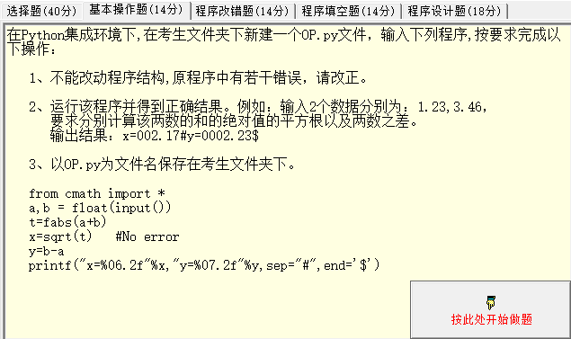

## Question 1



1. 不能改动程序结构，原程序中有若干错误，请改正。

2. 运行该程序并得到正确结果。例如：输入 2 个数据分别为：`1.23, 3.46`，要求分别计算该两数的和的绝对值的平方根以及两数之差。

    输出结果：`x = 002.17#y=0002.23$`

3. 以 OP.py 为文件名保存在考生文件夹下。

::: code-tabs

@tab 题目

```python
from cmath import *

a, b = float(input())
t = fabs(a + b)
x = sqrt(t)  # No error
y = b - a
printf("x=%06.2f" % x, "y=%07.2f" % y, sep="#", end="$")
```

@tab 答案

```python
from math import sqrt, fabs
a, b = input().split(",")
t = fabs(float(a) + float(b))
x = sqrt(t)  # No error
y = float(b) - float(a)
print("x=%06.2f" % x, "y=%07.2f" % y, sep="#", end="$")
```

:::


## Question 2


::: details 公众号：AI悦创【二维码】


:::

::: info AI悦创·编程一对一

AI悦创·推出辅导班啦，包括「Python 语言辅导班、C++ 辅导班、java 辅导班、算法/数据结构辅导班、少儿编程、pygame 游戏开发、Web、Linux」，全部都是一对一教学：一对一辅导 + 一对一答疑 + 布置作业 + 项目实践等。当然，还有线下线上摄影课程、Photoshop、Premiere 一对一教学、QQ、微信在线，随时响应！微信：Jiabcdefh

C++ 信息奥赛题解，长期更新！长期招收一对一中小学信息奥赛集训，莆田、厦门地区有机会线下上门，其他地区线上。微信：Jiabcdefh

方法一：[QQ](http://wpa.qq.com/msgrd?v=3&uin=1432803776&site=qq&menu=yes)

方法二：微信：Jiabcdefh

:::


