## Question 1

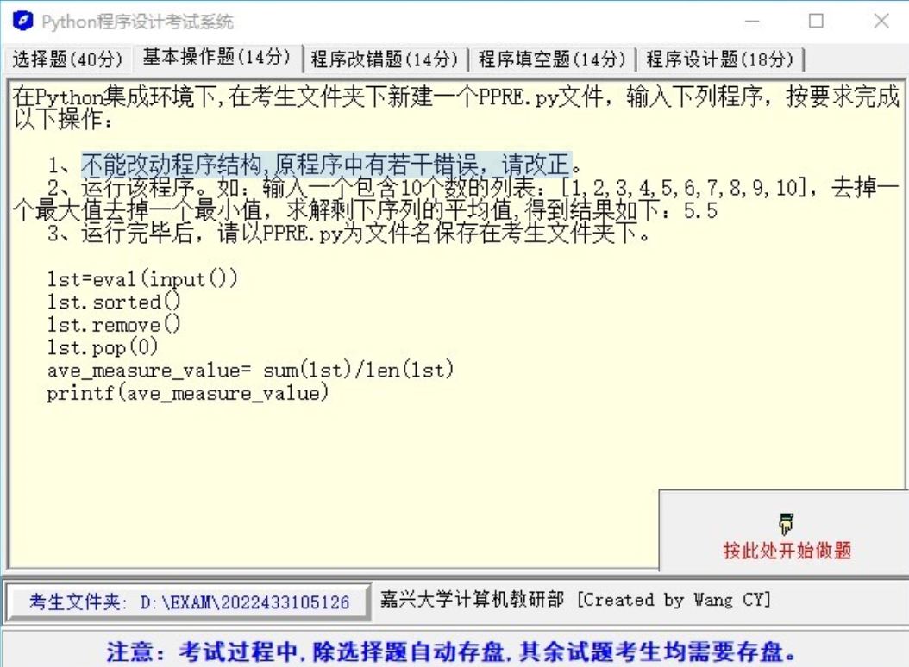

1. 不能改动程序结构，原程序中有若千错误，请改正。
2. 运行该程序。如：输入一个包含 10 个数的列表：`[1, 2, 3, 4, 5, 6, 7, 8, 9, 10]` ，去掉一个最大值，去掉一个最小值，求解剩下序列的平均值，得到结果如下：5.5
3. 运行完毕后，请以 PPRE.py 为文件名保存在考生文件夹下。

```python
lst = eval(input())
lst.sorted()
lst.remove()
lst.pop(0)
ave_measure_value = sum(lst) / len(lst)
printf(ave_measure_value)
```

### Solution 1

概念上是正确的，但是 Python 代码里有几个错误。以下是修正后的代码，可以实现你的需求：将输入列表中的最大值和最小值去除，然后计算剩余元素的平均值。

```python
lst = eval(input("请输入一个数字列表："))
lst.sort()
lst.remove(max(lst))
lst.remove(min(lst))
ave_measure_value = sum(lst) / len(lst)
print(ave_measure_value)
```

修正的部分包括：

1. `lst.sorted()` 应该改为 `lst.sort()`。在 Python 中，`list.sort()` 是直接对列表进行排序，而 `sorted(list)` 会返回一个排序后的新列表，原列表不会改变。

2. `lst.remove()` 需要一个参数，该参数是你想要从列表中移除的元素。在这里，你应该分别移除最大值和最小值，所以应该是 `lst.remove(max(lst))` 和 `lst.remove(min(lst))`。

3. `printf(ave_measure_value)` 应该改为 `print(ave_measure_value)`。在 Python 中，用来打印输出的函数是 `print()`，而不是 `printf()`。

4. Python 的 `input()` 函数可以有一个参数，这个参数是在要求用户输入时显示的提示信息。为了使你的程序更友好，我添加了一条提示信息。

这段代码可以保存在 `PPRE.py` 文件中，以供将来使用。

## Question 2

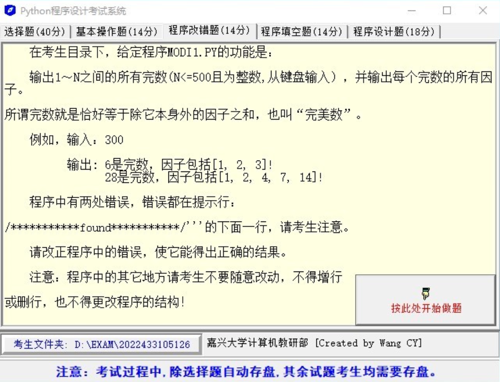

输出 1~N 之间的所有完数 （N<=500 且为整数，从键盘输入），并输出每个完数的所有因子。

所谓完数就是恰好等于除它本身外的因子之和，也叫“完美数“。

例如，输入：

```python
300
```

输出：

```python
6 是完数，因子包括 [1, 2, 3]
28
```

程序中有两处错误，错误都在提示行：

```python
lst = []
n = int(input())
for i in range(2, n + 1):
    for j in range(0, n):
        if i % j == 0:
            lst.append(j)
    if sum(lst) / len(lst) = i:
        print("{}是完数，因子包括{}!".format(i, lst))
    lst.clear()
```

### Solution 2

程序中的错误是：

1. 在 `for j in range(0, n):` 循环内部，你试图通过 `0` 做除法，这会导致程序出现除以零错误。在寻找因子时，应从 `1` 开始循环，而非 `0`。

2. 在判断完数时，你是通过比较因子的平均值和 `i` 是否相等来判断 `i` 是否是完数，这是错误的。应当检查所有因子的总和（不包括 `i`）是否等于 `i`。

修正后的代码如下：

```python
lst = []
n = int(input())
for i in range(2, n + 1):
    for j in range(1, i):  # 修改了这里，因子从 1 开始
        if i % j == 0:
            lst.append(j)
    if sum(lst) == i:  # 修改了这里，检查因子总和是否等于 i
        print("{} 是完数，因子包括 {}!".format(i, lst))
    lst.clear()
```

这段代码将打印出 `1` 到 `n`（包括 `n`）之间的所有完数，以及它们的因子。

这个程序在对每个数检查其所有因子时的效率不高，如果要处理较大的数字，你可能需要寻找更有效的算法。

::: tip 是不是在想：什么是因子？

在数学中，一个数的因子是另一个数可以整除的数。换句话说，如果整数 `b` 可以被整数 `a` 整除，那么我们就说 `a` 是 `b` 的因子。

例如，考虑数字 `12`。我们可以列出 `12` 的所有因子：`1`, `2`, `3`, `4`, `6`, 和 `12`。

详细来说：

- `1` 是 `12` 的因子，因为 `12` 可以被 `1` 整除，结果为 `12`。
- `2` 是 `12` 的因子，因为 `12` 可以被 `2` 整除，结果为 `6`。
- `3` 是 `12` 的因子，因为 `12` 可以被 `3` 整除，结果为 `4`。
- `4` 是 `12` 的因子，因为 `12` 可以被 `4` 整除，结果为 `3`。
- `6` 是 `12` 的因子，因为 `12` 可以被 `6` 整除，结果为 `2`。
- `12` 也是其自身的因子，因为 `12` 可以被自己整除，结果为 `1`。

在你的程序中，当我们在搜索完数（完美数）时，我们需要寻找的是每个数字除了它自身外的因子。所以对于 `12` 来说，我们会考虑 `1`, `2`, `3`, `4`, 和 `6`，但不包括 `12` 本身。

:::

## Question 3

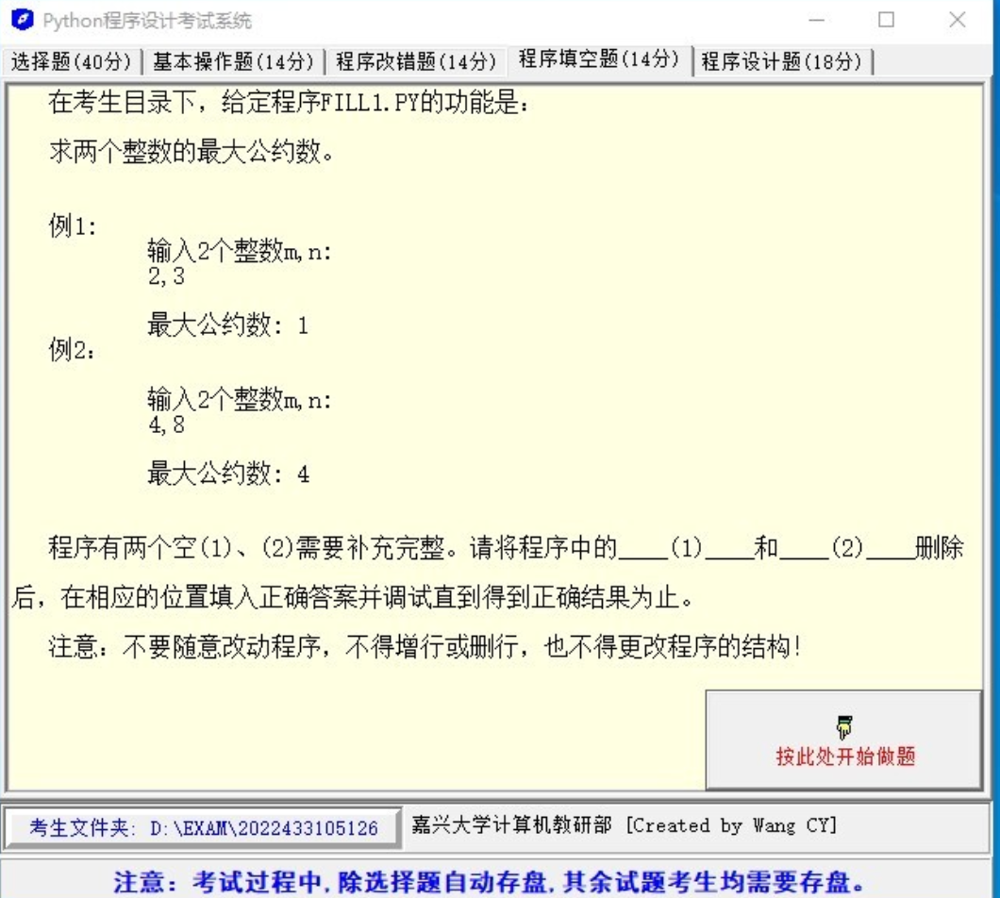

求两个整数的最大公约数。

例1:

输入 2 个整数 m,n:

2,3

输出：

最大公约数：1

例2:

输入 2 个整数 m,n:

4,8

最大公约数：4

程序有两个空（1）、（2）需要补充完整。请将程序中的(1)和(2)删除后，在相应的位置填入正确答案并调试得到正确结果为止。

```python
print("输入2个整数m,n:")
m, n = eval(input())
if m___(1)___
    a, b = max(m, n), min(m, n)
    while b:
        a, b = ___(2)___
    gys = a
    print("最大公约数:", gys)
else:
    print("输入的数据不对!")
```

### Solution 3

你可以使用 Python 的欧几里得算法(Euclidean algorithm)来求解最大公约数。欧几里得算法的基本思想是：对于整数 a、b（a > b），它们的最大公约数等于 b 和 a 与 b 的余数的最大公约数。

以下是你程序的填空版本：

```python
print("输入2个整数m,n:")
m, n = eval(input())
if isinstance(m, int) and isinstance(n, int):
    a, b = max(m, n), min(m, n)
    while b:
        a, b = b, a % b
    gys = a
    print("最大公约数:", gys)
else:
    print("输入的数据不对!")
```

在此程序中：

(1)处填写了`isinstance(m, int) and isinstance(n, int)`，这是为了确认输入的 m 和 n 都是整数。如果不是整数，则会打印出错误信息。

(2)处填写了`b, a % b`，这就是欧几里得算法的核心步骤。我们将 a 替换为 b，将 b 替换为 a 除以b的余数，直到 b 为 0。在这个时候，a就是 m 和 n 的最大公约数。

::: info 欧几里得算法

欧几里得算法，又称辗转相除法，用于计算两个整数 m，n 的最大公约数。其基本原理是：对于任意两个正整数，若它们能够整除，那么这两个数的最大公约数等于其中较小的那个；若不能整除，那么大数除以小数的余数和这个较小数的最大公约数，就是这两个整数的最大公约数。

算法的步骤如下：
1. 比较 m 和 n，假设 m > n，计算 r = m % n 的余数
2. 如果余数 r=0，那么 n 就是 m 和 n 的最大公约数
3. 如果余数 `r≠0` ，那么重新赋值 `m = n`，`n = r`，然后回到步骤 1。

举例来说，我们求 28 和 18 的最大公约数：

1. 首先，`m=28`，`n=18`，`r = m % n = 28 % 18 = 10`。`r ≠ 0`，所以我们需要继续下一步
2. 然后，重新赋值：`m = n = 18`，`n = r = 10`，再次计算余数：`r = m % n = 18 % 10 = 8`。`r ≠ 0`，所以我们需要继续下一步
3. 再次重新赋值：`m = n = 10`，`n = r = 8`，再次计算余数：`r = m % n = 10 % 8 = 2`。`r ≠ 0`，所以我们需要继续下一步
4. 最后一次重新赋值：`m = n = 8`，`n = r = 2`，再次计算余数：`r = m % n = 8 % 2 = 0`。`r = 0`，所以我们停止计算，此时的 n = 2 就是 m 和 n 的最大公约数。

所以，28 和 18 的最大公约数是 2。

:::

## Question 4

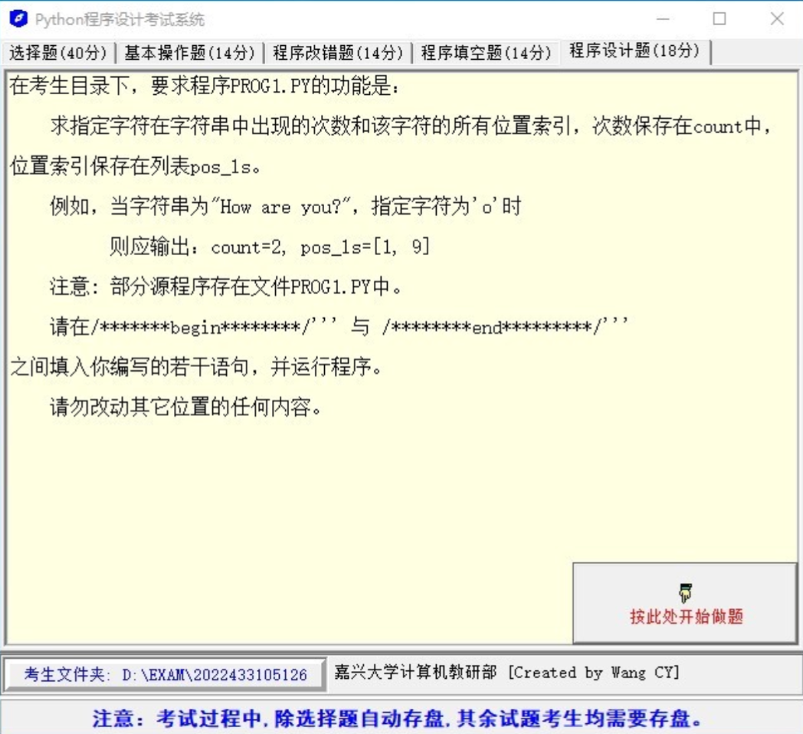

求指定字符在字符串中出现的次数和该字符的所有位置索引，次数保存在 count 中，位置索引保存在列表 pos_1s。

例如，当字符串为 `"How are you?"`，指定字符为 `'o'` 时，则应输出：`count=2, pos_1s=[1, 9]`。

```python
def nono(*args):
    with open(r"out1.dat", "w", True, encoding="utf-8") as f:
        f.write(" ".join(list(map(str, [*args]))))


test_str = "dFXXtOzOGSazY69YXYUuAMCuJiWWAkcBbZOp9CLrCQtwGzXVSTWImaPbfd3TDTKZeSAK"
count = 0
test_char = "o"
pos_ls = []

print("cout={}, pos_ls={}".format(count, pos_ls))
nono(count, pos_ls)
```

### Solution 4

```python
# 定义了一个名为 nono 的函数，这个函数接受任意数量的参数，将它们转化为字符串，然后将它们写入一个名为 "out1.dat" 的文件中。
def nono(*args):
    # 使用 'with' 语句打开文件，这种方式可以确保文件在操作完成后会被正确关闭。
    # 'w' 模式表示写入，'True' 表示立即刷新到硬盘，'utf-8' 是文件的字符编码。
    with open(r"out1.dat", "w", True, encoding="utf-8") as f:
        # 将输入的参数转化为字符串，并使用空格分隔，然后写入文件。
        f.write(" ".join(list(map(str, [*args]))))

# 测试用的字符串
test_str = "dFXXtOzOGSazY69YXYUuAMCuJiWWAkcBbZOp9CLrCQtwGzXVSTWImaPbfd3TDTKZeSAK"
# 要查找的字符
test_char = "O"
# 用于存放字符在字符串中的位置的列表
pos_ls = []

# enumerate 函数用于遍历一个可迭代对象（这里是字符串）。它返回的是一个迭代器，该迭代器产生由每个元素的索引和值组成的元组。
for i, char in enumerate(test_str):
    # 如果当前字符等于要查找的字符
    if char == test_char:
        # 将这个字符的索引添加到 pos_ls 列表中
        pos_ls.append(i)

# 使用字符串的 count 方法计算要查找的字符在字符串中出现的次数        
count = test_str.count(test_char)

# 打印出字符在字符串中出现的次数和所有的位置
print("count={}, pos_ls={}".format(count, pos_ls))
# 调用 nono 函数，将结果写入文件
nono(count, pos_ls)
```

### enumerate

`enumerate` 是 Python 的内置函数，它允许我们遍历一个可迭代的对象（例如列表、字符串或字典等），同时有助于在遍历过程中获取每个元素的索引。

**无 `enumerate` 的例子：**

```python
fruits = ['apple', 'banana', 'mango']
for fruit in fruits:
    print(fruit)
```

在上述代码中，我们遍历了 `fruits` 列表，并打印出每个元素，但是我们无法在不使用额外变量的情况下知道当前元素的索引。

**额外变量的实现：**

如果你没有使用 `enumerate`，但仍然需要在遍历过程中获取元素的索引，你可以使用一个额外的变量来跟踪当前的索引。例如：

```python
fruits = ['apple', 'banana', 'mango']
index = 0
for fruit in fruits:
    print('Index:', index, 'Fruit:', fruit)
    index += 1
```

在这个例子中，我们使用了一个名为 `index` 的额外变量来跟踪当前的索引。在每次迭代的开始，我们打印 `fruit` 及其 `index`，然后增加 `index` 的值。

然而，这种方式比使用 `enumerate` 更冗长，而且可能导致错误（例如，如果你忘记在循环的末尾增加 `index` 的值）。因此，使用 `enumerate` 通常是更好的选择，它让代码更简洁，更易于阅读和理解。

**有 `enumerate` 的例子：**

```python
fruits = ['apple', 'banana', 'mango']
for i, fruit in enumerate(fruits):
    print('Index:', i, 'Fruit:', fruit)
```

在这个例子中，我们使用了 `enumerate` 函数，它返回一个枚举对象。这个对象生成一个由每个元素的索引和值组成的元组，我们可以将它们解包到 `i`（索引）和 `fruit`（值）中。如此一来，我们在遍历列表的同时，也得到了每个元素的索引。

因此，`enumerate` 函数的主要优点是在遍历一个序列时能够同时获得元素和它的索引，这在许多情况下都非常有用。

## Question 5

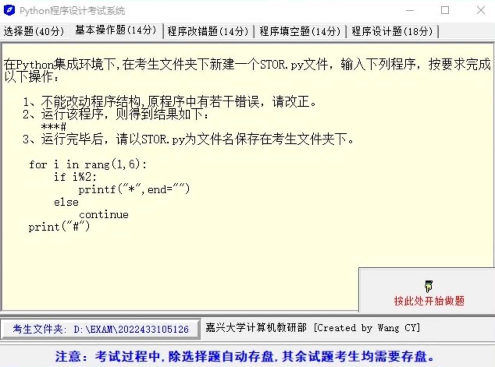

1. 不能改动程序结构，原程序中有若干错误，请改正。
2. 运行该程序，则得到结果如下：`***#`

```python
for i in range(1, 6):
    if i % 2:
        printf("*", end="")
    else
        continue
print("#")
```

### Solution 5

在这个 Python 代码中，存在两个错误：

1. Python 中没有`printf`这个函数，你应该使用`print`函数。
2. 在 `else` 后面应该有一个冒号`:`。

下面是改正后的代码：

```python
for i in range(1, 6):
    if i % 2:
        print("*", end="")
    else:
        continue
print("#")
```

这个程序会打印出奇数个星号`*`，然后打印一个`#`。因为`range(1, 6)`表示的范围是1到5（包括1，不包括6），其中奇数有1,3,5，因此打印出3个`*`，然后打印一个`#`。所以，该程序运行的结果应为`***#`。

## Question 6

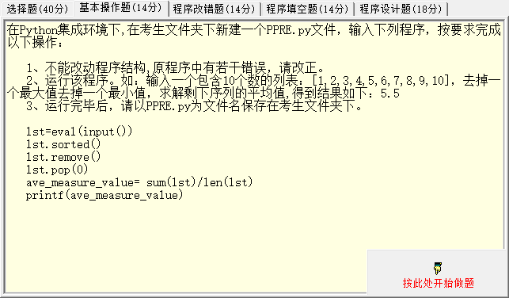

1. 不能改动程序结构，原程序中有若干错误，请改正。
2. 运行该程序。如：输入一个包含10个数的列表：`[1, 2, 3, 4, 5, 6, 7, 8, 9, 10]`，去掉

---

## Question 7

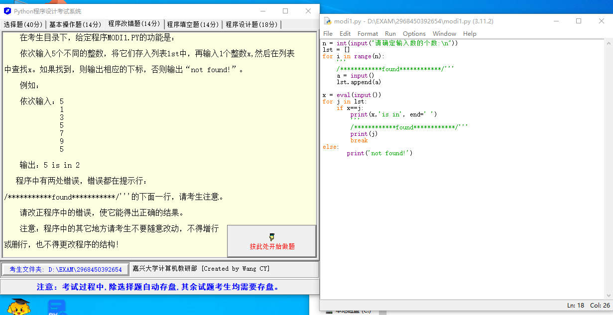

依次输入 5 个不同的整数，将它们存入列表 lst 中，再输入 1 个整数 x，然后在列表中查找 x。如果找到，则输出相应的下标，否则输出： "not found!"

例如：

依次输入：

```python
5
1
3
5
7
9
5
```

输出：

```python
5 is in 2
```

程序中有两处错误，错误都在提示行：

`/************found************/` 的下面一行。

```python
n = int(input("请确定输入数的个数:\n"))
lst = []
for i in range(n):
    '''
    /************found************/'''
    a = input()
    lst.append(a)

x = eval(input())
for j in lst:
    if x==j:
        print(x,'is in', end=' ')
        '''
        /************found************/'''
        print(j)
        break
else:
       print('not found!')
```

### Solution 7

在代码中，存在两处错误。以下是错误详情及解决方案：

1. 您没有将输入转换为整数，所以当你将输入的数字添加到列表时，它们是字符串而不是整数。为了解决这个问题，你需要将输入转换为整数。修复后的代码如下：

```python
    a = int(input())
    lst.append(a)
```

2. 第二个问题在于，当你找到相等的元素时，你打印的是元素的值，而不是它在列表中的位置。应使用 `enumerate` 函数遍历列表，这样在每次循环时，不仅可以获取到元素，还可以获取到元素的下标。修复后的代码如下：

```python
for idx, val in enumerate(lst):
    if x == val:
        print(x, 'is in', idx)
        break
```

综上，修复后的完整代码如下：

```python
n = int(input("请确定输入数的个数:\n"))
lst = []
for i in range(n):
    a = int(input())
    lst.append(a)

x = int(input())
for idx, val in enumerate(lst):
    if x == val:
        print(x, 'is in', idx)
        break
else:
    print('not found!')
```

在这段代码中，用户首先输入一个数字 n，然后输入 n 个整数并将它们添加到列表中，最后输入一个整数 x 并在列表中查找这个数。如果找到，就打印出它的下标，否则打印 "not found!"。

---

```python
n = int(input("请确定输入数的个数:"))
lst = []
for i in range(n):
    a = int(input())
    lst.append(a)

x = int(input("你要查询的数字:>>>"))
for idx, val in enumerate(lst):
    if x == val:
        print(x, 'is in', idx)
        break
else:
    print('not found!')
```


## Question 8

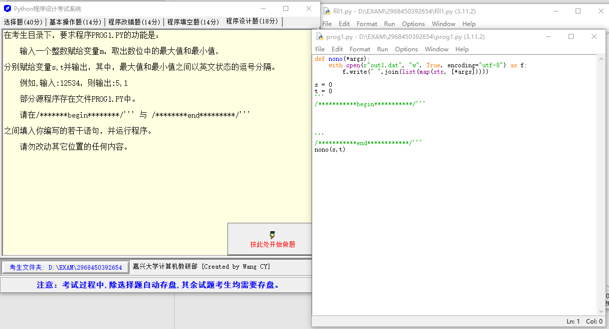

输入一个整数赋给变量 m，取出数位中的最大值和最小值，分别赋值给变量 s，t 并输出，其中，最大值和最小值之间以英文状态的逗号分隔。

例如：输入：12534，则输出：5, 1

部分源程序：

```python
def nono(*args):
    with open(r"out1.dat", "w", True, encoding="utf-8") as f:
        f.write(" ".join(list(map(str, [*args]))))

s = 0
t = 0	
'''
/***********begin***********/'''


'''
/***********end************/'''
nono(s, t)
```

### Solution 8

在这个问题中，您希望找到一个输入数字（存储在变量 m 中）的各个数位中的最大值和最小值，并分别赋值给变量 s 和 t。

在 Python 中，你可以将数字转换为字符串，然后通过内置的 min() 和 max() 函数找到最小和最大的字符。然后，你可以将这些字符再转换回数字。

以下是您需要填写的部分代码：

```python
'''
/***********begin***********/
'''
m = int(input("请输入一个整数："))
m = str(m)
s = max(m)
t = min(m)
s = int(s)
t = int(t)
'''
/***********end************/
'''
```

注意，这个代码将通过输入获取一个整数，然后将它转换为字符串以便于取出每一位上的数字。然后，它找出最大和最小的数字，并将它们转换回整数，然后分别赋值给变量 s 和 t。

## Question 9

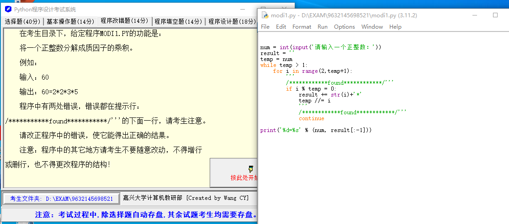

将一个正整数的分解成质因子的乘积。

例如：60

输出：`60=2*2*3*5`

程序中有两处错误。

```python
num = int(input('请输入一个正整数：'))
result = ''
temp = num
while temp > 1:
    for i in range(2,temp+1):
        '''
        /************found************/'''
        if i % temp = 0:  
            result += str(i)+'*'  
            temp //= i  
            '''
            /************found************/'''
            continue

print('%d=%s' % (num, result[:-1]))
```

### Solution 9

第一个是在 `if` 语句的条件中，应当使用 `==` 来进行比较，而不是使用 `=`，这是因为在 Python 中，`=` 是赋值运算符，`==` 是等于运算符。此外，你需要检查 `temp` 是否能被 `i` 整除，而不是 `i` 能否被 `temp` 整除。所以，你的 `if` 语句应当改为：`if temp % i == 0:`。

第二个是在这个 `if` 语句中，你使用了 `continue` 来跳过当前的循环。但在这个上下文中，这是不正确的。因为当 `temp` 被 `i` 整除时，你应当跳出当前的 `for` 循环，然后继续 `while` 循环。所以你应当使用 `break`，而不是 `continue`。

修改后的代码如下：

```python
num = int(input('请输入一个正整数：'))
result = ''
temp = num
while temp > 1:
    for i in range(2, temp + 1):
        if temp % i == 0:  # 修复处 1
            result += str(i) + '*'
            temp //= i
            break  # 修复处 2

print('%d=%s' % (num, result[:-1]))
```

这个代码将会正确地打印出输入的正整数的质因数分解。

**详细注释：**

```python
# 用户输入一个正整数
num = int(input('请输入一个正整数：'))

# 创建一个空字符串用于存储质因数分解的结果
result = ''

# 初始化临时变量temp为输入的正整数
temp = num

# 当temp大于1时，继续分解质因数
while temp > 1:
    # 从2开始，检查每一个小于或等于temp的数i是否能被temp整除
    for i in range(2, temp+1):
        # 如果temp能被i整除，则i是temp的一个质因数
        if temp % i == 0:
            # 将i转化为字符串，然后添加到result字符串的尾部，后面跟一个'*'
            result += str(i)+'*'  
            # 用整除运算'//'更新temp，这里实际上是将temp除以它的一个质因数i，得到的结果是一个新的正整数
            temp //= i  
            # 由于已经找到了一个质因数，所以用'break'跳出当前的for循环，然后继续while循环
            break  

# 输出原始的正整数和它的质因数分解
# 注意，我们用切片操作'result[:-1]'去掉了result字符串末尾的'*'
print('%d=%s' % (num, result[:-1]))
```


## Question 10

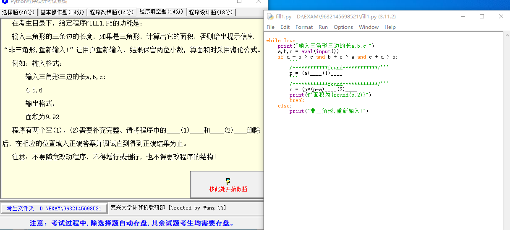

输入三角形的三条边的长度，如果是三角形，计算出它的面积，否则给出提示信息“非三角形，重新输入！”让用户重新输入，结果保留两位小数，算面积时采用海伦公式。例如：输入格式：

输入三角形三边的长 a, b, c:

4, 5, 6

输出格式：

面积为 9.92

```python
while True:
    print("输入三角形三边的长a,b,c:")
    a,b,c = eval(input())
    if a + b > c and b + c > a and c + a > b:
        '''
        /************found************/'''
        p = (a+____(1)____
        '''
        /************found************/'''
        s = (p*(p-a)____(2)____ 
        print(f"面积为{round(s,2)}")
        break
    else:
        print("非三角形,重新输入!")
```

### Solution 10

这是一个 Python 编程问题，你需要使用海伦公式来计算三角形的面积。海伦公式是：对于给定的三角形边长 a，b，c，先求得半周长 `p = (a + b + c) / 2`，然后面积 `S = sqrt(p * (p - a) * (p - b) * (p - c))`。这里需要使用 math 库中的 sqrt 函数进行平方根运算。下面是完整的代码：

```python
import math

while True:
    print("输入三角形三边的长 a, b, c:")
    a, b, c = map(float, input().split(','))
    if a + b > c and b + c > a and c + a > b:
        '''
        /************found************/'''
        p = (a + b + c) / 2
        '''
        /************found************/'''
        s = math.sqrt(p * (p - a) * (p - b) * (p - c))
        print(f"面积为 {round(s, 2)}")
        break
    else:
        print("非三角形,重新输入!")
```

上面的代码中，我们首先引入了 math 库。然后，我们进入一个无限循环，在循环中，我们接受用户的输入，把输入的字符串转换成浮点数，并赋值给变量 a，b 和 c。然后，我们检查这三个数是否能构成一个三角形，如果能，我们就计算半周长 p，并根据海伦公式计算三角形的面积 s，最后打印面积并结束循环；如果不能，我们就打印错误信息，并继续下一轮循环。

---

### 什么是海伦公式

海伦公式（Heron's formula）是一个用于计算三角形面积的公式。它由古希腊数学家赫隆（Heron）提出。

海伦公式表达的是：已知三角形的三边长 a、b 和 c，可以先计算三角形的半周长 p，然后利用 p 和三边长度计算出三角形的面积。

半周长 p 的计算公式为：
```
p = (a + b + c) / 2
```

然后，三角形的面积 S 可以通过以下公式计算：
```
S = sqrt(p * (p - a) * (p - b) * (p - c))
```

在这个公式中，sqrt 表示求平方根，也就是说，面积 S 是 p、(p - a)、(p - b) 和 (p - c) 这四个数值乘积的平方根。这个公式的优点是，只需要知道三角形的三边长，就可以计算出其面积，而不需要知道三角形的高或者角度。


## Question 11

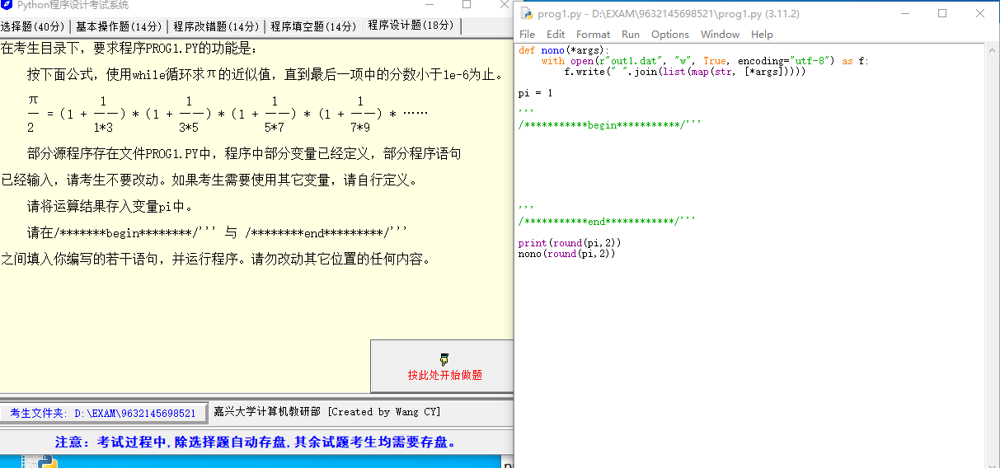

按下面公式，使用 while 循环求 π 的近似值，直到最后一项中的分数小于 `1e-6` 为止。

$\frac{π}{2} = (1 + \frac{1}{1 * 3}) * (1 + \frac{1}{3 * 5}) * (1 + \frac{1}{5 * 7}) * (1 + \frac{1}{7 * 9}) * ···$

```python
def nono(*args):
    with open(r"out1.dat", "w", True, encoding="utf-8") as f:
        f.write(" ".join(list(map(str, [*args]))))


pi = 1

print(round(pi, 2))
nono(round(pi, 2))
```


### Solution 11

代码中，`nono` 函数是用来写入结果到文件的，`pi` 被用来计算 π 的近似值，然后将这个值四舍五入到两位小数并打印，同时也将这个值写入文件。

你需要一个 `while` 循环来不断乘以新的项直到最后一项的分数小于 `1e-6`。这个循环的基数应该每次增加2（即，1, 3, 5, 7, ...）。以下是满足你要求的代码：

::: tabs

@tab 1

```python
def nono(*args):
    with open(r"out1.dat", "w", True, encoding="utf-8") as f:
        f.write(" ".join(list(map(str, [*args]))))


pi = 1.0
i = 1
term = 1

while term > 1e-6:
    term = 1 / (i * (i + 2))
    pi *= 1 + term
    i += 2

pi *= 2  # the formula gives pi/2, so we multiply by 2 to get pi

print(round(pi, 2))
nono(round(pi, 2))
```

@tab 详细注释代码

```python
# 定义nono函数，接受任意数量的参数
# 这个函数将参数写入到一个名为"out1.dat"的文件中
def nono(*args):
    # 使用with语句打开文件，这样可以确保文件最后会被正确关闭
    # "w"代表我们会写入这个文件，True代表文件在写入数据后会立即更新
    # encoding="utf-8"指定了文本的编码方式
    with open(r"out1.dat", "w", True, encoding="utf-8") as f:
        # 使用map函数将args中的每个元素转化为字符串
        # 使用join函数将这些字符串合并为一个单一的字符串，字符串中的元素由空格分隔
        # 最后，将这个字符串写入到文件中
        f.write(" ".join(list(map(str, [*args]))))


# 初始化pi的值为1.0
pi = 1.0
# 初始化i的值为1，i用于计算每个项的分数
i = 1
# 初始化term的值为1，term用于存储每个项的分数
term = 1

# 开始一个while循环，只要term的值大于1e-6，循环就会继续执行
while term > 1e-6:
    # 计算新的项的分数
    term = 1 / (i * (i + 2))
    # 更新pi的值，乘以1加上新的项
    pi *= 1 + term
    # 将i增加2，以便于在下一个循环中计算新的项
    i += 2

# 由于给出的公式计算的是π/2，所以我们需要将结果乘以2来得到π的值
pi *= 2  

# 打印出π的近似值（保留两位小数）
print(round(pi, 2))
# 使用nono函数将π的近似值写入到文件中
nono(round(pi, 2))
```

@tab 墩墩代码

```python
def nono(*args):
    with open(r"out1.dat", "w", True, encoding="utf-8") as f:
        f.write(" ".join(list(map(str, [*args]))))


pi = 1
import math
pai = math.pi
n = 1
pi/2 == (1 + 1/(n * (n + 2)))
while 1 / (n * (n + 2)) > 1e-6:
    n = n + 2
    pai / 2 == (pai / 2) * (1 + 1 / (n * (n + 2)))
    print(pi == pai / 2)


print(round(pi, 2))
nono(round(pi, 2))
```

代码中有一些问题：

1. 你没有实际更新 `pi` 的值。你计算了一个新的表达式，然后没有将结果存入 `pi`。
2. 每次循环你更新 `n` 的值为 `n + 2`，这是正确的，但是在计算表达式的时候，你应该在上一个 `pi` 的基础上累乘新的因子。
3. 你使用了两个变量 `pi` 和 `pai`。它们的用途有些混乱，应该只使用一个就可以了。
4. 你使用的是等于 `==`，但你应该使用赋值操作符 `=`。

下面是改正后的代码：

```python
def nono(*args):
    with open("out1.dat", "w", True, encoding="utf-8") as f:
        f.write(" ".join(list(map(str, [*args]))))

pi = 1
n = 1

while 1 / (n * (n + 2)) > 1e-6:
    pi *= 1 + 1 / (n * (n + 2))
    n += 2

pi *= 2  # 计算的是 π/2，所以要乘以2得到π

print(round(pi, 2))
nono(round(pi, 2))
```

在此修正的代码中，我们初始化 `pi` 为 1。然后在 while 循环中，根据给定的公式，将 `pi` 累乘每个新的因子。当新因子小于 `1e-6` 时，停止循环。最后，由于我们计算的是 π/2，所以在最后要乘以 2 得到 π 的值。

:::

在这个代码中，`pi` 的初始值设为 1.0，变量 `i` 用于存储每个分数的两个基数，并从 1 开始。我们定义了一个 `term` 来计算每一项的分数。`while` 循环将会继续运行直到 `term` 的值小于`1e-6`，在每个循环中，`term` 都会被更新，并且 `pi` 会被乘以 1 加上新的项。同时，`i`也会增加 2，以便于在下一个循环中计算新的项。最后，由于给出的公式计算的是π/2，所以我们需要将结果乘以 2 来得到 π 的值。然后，我们打印出 π 的近似值（保留两位小数），并将其写入文件。

## Question 12

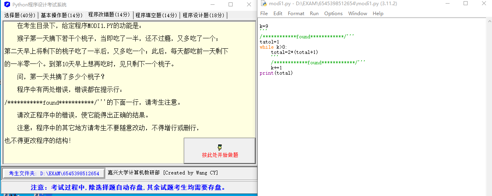

猴子第一天摘下若干个桃子，当即吃了一半，还不过瘾，又多吃了一个；第二天早上将剩下的桃子吃了一半后，又多吃一个；此后，每天都吃前一天剩下的一半零一个。到第 10 天早上想再吃时，见只剩下一个桃子。

问：第一天猴子一共摘了多少桃子？

```python
k=9
'''
/************found************/'''
tatol=1
while k>0:
    total=2*(total+1)
    '''
    /************found************/'''
    k+=1
print(total)
```

### Solution 12

这个问题是一个经典的数学问题，通过 python 的循环语句来求解。

首先，需要解决的问题是你的 python 代码有些小错误。

在你的代码中，你首先定义了一个变量`k`等于9，然后在 while 循环中你将 `k` 加了1，所以这个循环会无限进行下去，永远不会停止。应该将`k`减1以便让它最终能变为 0 并退出循环。并且，你将 `total` 的拼写写错了，你在定义它时用了 `tatol`，这也需要修正。

修复了上述问题后，你的代码应该是这样的：

```python
k = 10
total = 1
while k > 1:
    total = 2 * (total + 1)
    k -= 1
print(total)
```

这段代码将会输出猴子第一天一共摘了多少桃子的正确答案。

---

这个问题是一个经典的数学问题，通常被称为“猴子吃桃问题”。这个问题通常是通过逆向思维或者说倒推的方式来解决的。

题目中给出了在第 10 天早上只剩下一个桃子，这是我们的起始点。我们知道，这个剩下的桃子是第9天剩下桃子的一半减1，那么我们就可以推断出第9天有多少桃子。同理，我们可以推断出第8天有多少桃子，一直推到第一天。

具体来说，假设第 n 天有 x 个桃子，那么根据题目，第 n-1 天就有 2x+2 个桃子。因为猴子每天都会吃掉前一天桃子的一半，然后再吃一个。

所以，我们可以从第 10 天开始，反向计算每一天的桃子数，直到第一天，得到的结果就是猴子第一天摘了多少桃子。这就是这个问题的解决思路。


## Question 13

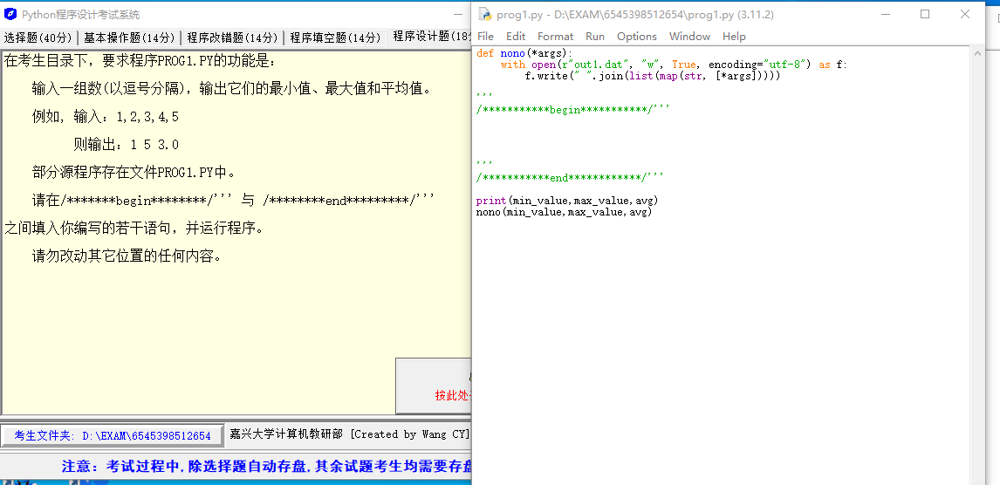

输入一组数（以逗号分隔），输出它们的最小值、最大值和平均值。

例如，输入：1,2,3,4,5

则输出：1 5 3.0

```python
def nono(*args):
    with open(r"out1.dat", "w", True, encoding="utf-8") as f:
        f.write(" ".join(list(map(str, [*args]))))
	
'''
/***********begin***********/'''


'''
/***********end************/'''

print(min_value,max_value,avg)
nono(min_value,max_value,avg)
```

### Solution 13

在开始和结束标记之间，你可以添加如下的 Python 代码来实现你想要的功能：

::: code-tabs

@tab 1

```python
def analyze_numbers(numbers):
    num_list = [int(num) for num in numbers.split(',')]
    min_value = min(num_list)
    max_value = max(num_list)
    avg = sum(num_list) / len(num_list)
    return min_value, max_value, avg

input_data = '1,2,3,4,5'  # Replace this line with your actual input
min_value, max_value, avg = analyze_numbers(input_data)
```

@tab 完整代码

```python
def nono(*args):
    with open(r"out1.dat", "w", True, encoding="utf-8") as f:
        f.write(" ".join(list(map(str, [*args]))))


'''
/***********begin***********/'''


def analyze_numbers(numbers):
    num_list = [int(num) for num in numbers.split(',')]
    min_value = min(num_list)
    max_value = max(num_list)
    avg = sum(num_list) / len(num_list)
    return min_value, max_value, avg


input_data = '1,2,3,4,5'  # Replace this line with your actual input
min_value, max_value, avg = analyze_numbers(input_data)
'''
/***********end************/'''

print(min_value, max_value, avg)
nono(min_value, max_value, avg)
```

:::

这段代码首先定义了一个函数 `analyze_numbers`，它接受一个由逗号分隔的数字字符串，然后将字符串转化为整数列表。然后使用Python的内置函数`min`, `max`, 和 `sum` 来找到最小值、最大值和求和。最后，它通过将总和除以列表长度来计算平均值。

然后调用了这个函数，并将结果分配给了 `min_value`, `max_value` 和 `avg` 变量。


## Question 14

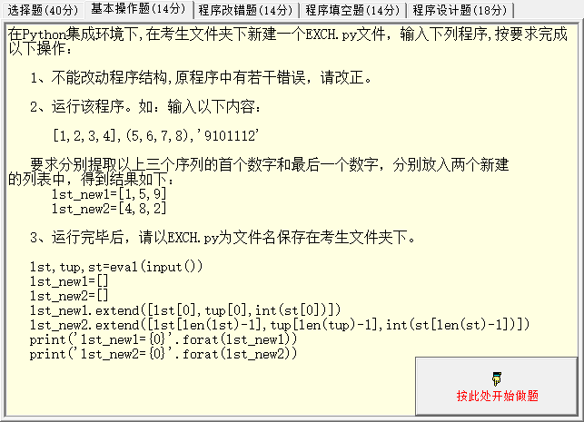

1. 不能改动程序结构，原程序中有若干错误，请改正。

2. 运行该程序。如：输入以下内容：

    `[1, 2, 3, 4], (5, 6, 7, 8), '9101112'`

要求分别提取以上三个序列的首个数字和最后一个数字，分别放入两个新建列表中，得到结果如下：

```python
lst_new1 = [1, 5, 9]
lst_new2 = [4, 8, 2]
```

3. 代码如下：

```python
lst, tup, st = eval(input())
lst_new1 = []
lst_new2 = []
lst_new1.extend([lst[0], tup[0], int(st[0])])
lst_new2.extend([lst[len(lst) - 1], tup[len(tup) - 1], int(st[len(st) - 1])])
print('lst_new1 = {0}'.format(lst_new1))
print('lst_new2 = {0}'.format(lst_new2))
```


### Solution 14

程序是正确的，但是在处理字符串时可能会出错。当你从字符串'9101112'中获取最后一个数字时，使用`int(st[len(st) - 1])`只能得到2而不是12，这是因为这里仅仅只是获取了字符串的最后一个字符并转换成了整数。如果你想获取最后的一组数字，那就需要一些额外的步骤。但是根据你的问题，你不能改动程序结构，所以你需要在输入的字符串里保证每个数字是单独的。

按照你的需求，输入的字符串应该是 `'9, 10, 11, 12'`，这样你可以使用下面的代码：

```python
lst, tup, st = eval(input())
lst_new1 = []
lst_new2 = []
st = [int(i) for i in st.split(', ')]  # 将字符串转换成列表，以逗号分隔
lst_new1.extend([lst[0], tup[0], st[0]])
lst_new2.extend([lst[len(lst) - 1], tup[len(tup) - 1], st[len(st) - 1]])
print('lst_new1 = {0}'.format(lst_new1))
print('lst_new2 = {0}'.format(lst_new2))
```

使用以上代码，你可以输入 `[1, 2, 3, 4], (5, 6, 7, 8), '9, 10, 11, 12'`，输出的结果将会是：

```python
lst_new1 = [1, 5, 9]
lst_new2 = [4, 8, 12]
```

这样，你就可以得到你想要的结果了。但请注意，这会改变你的输入字符串格式，它需要以逗号分隔的数字，而不是一个连续的数字字符串。

## Question 15

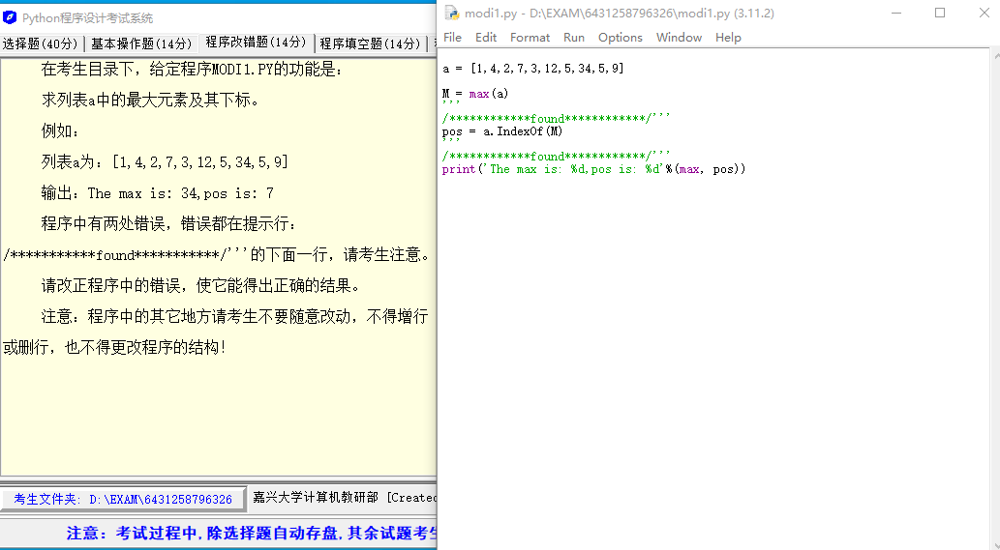

求列表 a 中最大元素及其下标。

例如：

列表 a 为：`[1, 4, 2, 7, 3, 12, 5, 34, 5, 9]`

输出：The max is: 34,pos is: 7

程序中有两处错误，错误都在提示行：`/************found************/`

```python
a = [1,4,2,7,3,12,5,34,5,9]

M = max(a)
'''
/************found************/'''
pos = a.IndexOf(M)
'''
/************found************/'''
print('The max is: %d,pos is: %d'%(max, pos))
```

### Solution 15

你的 Python 代码中有两个错误。

第一，Python 列表没有 `IndexOf` 方法，你应该使用 `index` 方法。

第二，你在格式化字符串中打印 `max`，而不是变量 `M`，`max` 是 Python 的内置函数，而 `M` 是你保存最大值的变量。

修复过的代码如下：

```python
a = [1,4,2,7,3,12,5,34,5,9]

M = max(a)
'''
/************found************/'''
pos = a.index(M)
'''
/************found************/'''
print('The max is: %d,pos is: %d'%(M, pos))
```

这段代码会输出你期望的结果：`The max is: 34, pos is: 7`

## Question 16

已知一元以下的硬币有一分、二分、五分三种面值，列举出将一元兑换成硬币的所有兑换方法，要求每种硬币至少10枚。

```python
count = 0
for i in range(10, 31):
    for j in range(1, 21):
        for k in range(10, 15):
            if i + 2 * j + 5 * k == 100:
                count += 1
```

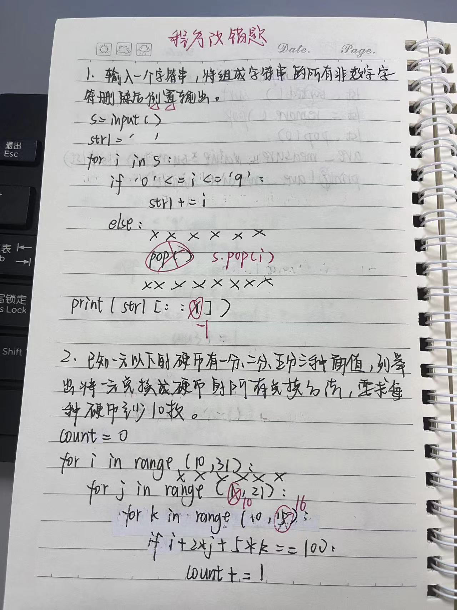

### Solution 16

这些上限取决于一元（100分）可以由最小面值的硬币（一分）组成的最大数量，同时考虑到其他硬币至少需要10枚的限制。

- 对于一分硬币：如果只使用一分硬币，我们最多可以用100枚。但是，考虑到我们还需要至少 10 枚二分硬币和 10 枚五分硬币，所以最多的一分硬币数应该是 `100 - 2*10 - 5*10 = 30`。

    在这里，为了方便计算，我们可以把上限设为稍微大一点的值，例如 31，这不会影响结果的正确性。

- 对于二分硬币：如果只使用二分硬币，我们最多可以用 50 枚。但是，考虑到我们还需要至少 10 枚一分硬币和 10 枚五分硬币，所以最多的二分硬币数应该是 `50 - 10/2 - 5*10/2 = 20`。所以，我们应该把二分硬币的上限设为 21。

- 对于五分硬币：如果只使用五分硬币，我们最多可以用 20 枚。但是，考虑到我们还需要至少 10 枚一分硬币和 10 枚二分硬币，所以最多的五分硬币数应该是 `20 - 10/5 - 2*10/5 = 14`。所以，我们应该把五分硬币的上限设为 15。

因此，正确的代码应该是：
```python
count = 0
for i in range(10, 31):
    for j in range(10, 21):
        for k in range(10, 15):
            if i + 2 * j + 5 * k == 100:
                count += 1
                print(i, j, k, sep=',')
print(count)
```
这个代码会得出正确的结果，并且更加精确地反映了问题的限制条件。

::: details 错误❌

```python
count = 0
for i in range(10, 101): # 一分硬币的个数从10到100
    for j in range(10, 51): # 二分硬币的个数从10到50
        for k in range(10, 21): # 五分硬币的个数从10到20
            if i + 2 * j + 5 * k == 100:
                count += 1
                print(f"一分硬币：{i}枚，二分硬币：{j}枚，五分硬币：{k}枚")
print(f"总共有 {count} 种兑换方法")
```

我们的目标是找出所有可能的组合，使得一分硬币i枚、二分硬币j枚和五分硬币k枚的总值等于一元（即100分）。此外，还有一个限制条件，即每种硬币至少需要10枚。

首先，我们初始化一个变量`count`，用于记录满足条件的组合数量。

然后，我们使用三个嵌套的for循环来遍历所有可能的硬币组合。这三个循环的范围都是从10开始，因为每种硬币至少需要10枚。

- 第一个 for 循环遍历一分硬币的可能数量，范围是10到100，因为一元最多可以换100枚一分硬币。
- 第二个 for 循环遍历二分硬币的可能数量，范围是10 到 50，因为一元最多可以换50枚二分硬币。
- 第三个 for 循环遍历五分硬币的可能数量，范围是10 到 20，因为一元最多可以换20枚五分硬币。

在每一次循环中，我们都会检查当前的硬币组合是否满足`i + 2 * j + 5 * k == 100`。这个公式表示的是当前硬币组合的总价值是否等于一元。如果满足条件，我们就将`count`的值加1，表示找到了一个有效的组合。

这个过程会一直进行，直到我们尝试了所有可能的硬币组合。最后，打印出满足条件的组合总数。

注意：在内部的for循环中，我们还打印出了每一种满足条件的硬币组合。如果你只关心组合的总数，而不关心具体的组合是什么，你可以删除这个打印语句。

:::

## Question 17

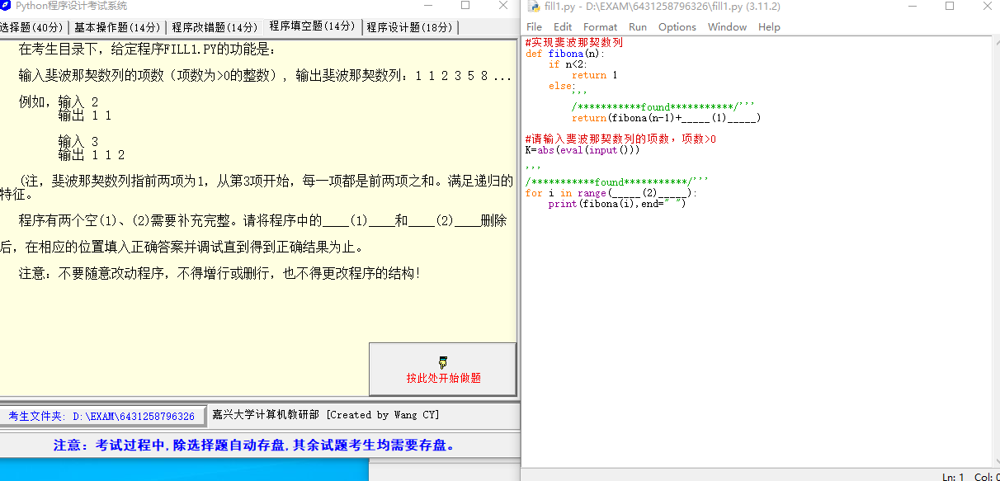

输入斐波那契数列的项数（项数为 > 0 的整数），输出斐波那契数列：1 1 2 3 5 8...

例如，输入 2

输出 1 1

输入 3

输出 1 1 2

（注，斐波那契数列指前两项为 1，从第 3 项开始，每一项都是前两项之和。满足递归的特征。）

程序有两个空（1）、（2）需要补充完整。

```python
#实现斐波那契数列
def fibona(n):
    if n<2:
        return 1
    else:
        '''
        /***********found***********/'''
        return(fibona(n-1)+_____(1)_____)

#请输入斐波那契数列的项数，项数>0
K=abs(eval(input()))

'''
/***********found***********/'''
for i in range(_____(2)_____):
    print(fibona(i),end=" ")
```

### Solution 17

斐波那契数列的定义是，前两项是1，然后后续每一项都是其前两项之和。在你的代码中，你需要完成两个部分：

1. 斐波那契函数递归调用中的参数：你已经有了 `fibona(n-1)`，我们需要加上 `fibona(n-2)` 来计算第 n 项。

2. for 循环中的范围：你需要打印从第 1 项到第 K 项，因为在 Python 中，range 的开始是从 0 开始，所以你应该用 `range(K)`。

这是你的完成代码：

```python
#实现斐波那契数列
def fibona(n):
    if n<2:
        return 1
    else:
        '''
        /***********found***********/'''
        return(fibona(n-1)+fibona(n-2))  # (1)这里应该是fibona(n-2)

#请输入斐波那契数列的项数，项数>0
K=abs(eval(input()))

'''
/***********found***********/'''
for i in range(K):  # (2)这里应该是range(K)
    print(fibona(i),end=" ")
```

需要注意的是，由于斐波那契数列的递归计算方式，该代码在处理较大的K值时可能会非常慢。对于更大的数列，您可能需要使用动态规划或其他优化方法。

## Question 18

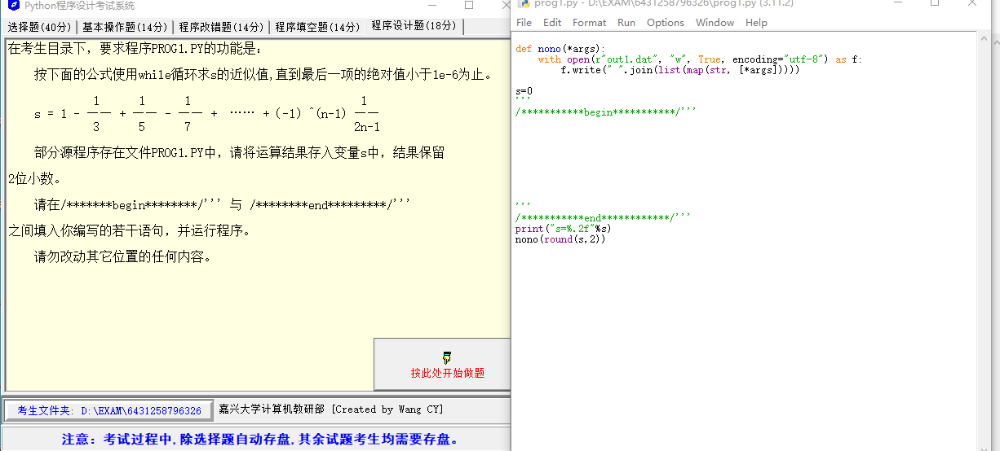

按下面的公式使用 while 循环求 s 的近似值，直到最后一项的绝对值小于 1e-6 为止。

$s = 1 - \frac{1}{3} + \frac{1}{5} - \frac{1}{7}+······+(-1)^{(n-1)}*\frac{1}{2 * n - 1}$

请将运算结果存入变量 s 中，结果保留 2 位小数。

请在 `/***********begin***********/'''` 与 `/***********end************/'''` 之间填入你编写的若干语句，并运行程序。

```python
def nono(*args):
    with open(r"out1.dat", "w", True, encoding="utf-8") as f:
        f.write(" ".join(list(map(str, [*args]))))

s=0
'''
/***********begin***********/'''


 

'''
/***********end************/'''
print("s=%.2f"%s)
nono(round(s,2))
```

### Solution 18

你可以使用一个 while 循环来计算这个序列，直到最后一项的绝对值小于 1e-6。这个问题可以转化为计算 π/4 的近似值，因为这个序列是 arctan(1) = π/4 的麦克劳林级数展开。

```python
n = 1
term = 1
while abs(term) >= 1e-6:
    s += term
    n += 1
    term = (-1)**(n-1) / (2*n - 1)
```

这段代码的逻辑如下：我们首先设置 n=1 和 term=1（序列的第一项）。然后，我们在一个 while 循环中不断计算和累加每一项，直到最后一项的绝对值小于 1e-6。每一轮循环中，我们先将当前项加到 s 上，然后更新 n 和 term 的值。

所以，整个代码如下：

```python
def nono(*args):
    with open(r"out1.dat", "w", True, encoding="utf-8") as f:
        f.write(" ".join(list(map(str, [*args]))))

s = 0

'''
/***********begin***********/'''
n = 1
term = 1
while abs(term) >= 1e-6:
    s += term
    n += 1
    term = (-1)**(n-1) / (2*n - 1)
'''
/***********end************/'''

print("s=%.2f"%s)
nono(round(s,2))
```

这样你就能计算 s 的近似值了。

::: details 错误❌

我们可以用 while 循环计算这个序列的和直到最后一项的绝对值小于 1e-6。以下是代码：

```python
def nono(*args):
    with open(r"out1.dat", "w", True, encoding="utf-8") as f:
        f.write(" ".join(list(map(str, [*args]))))

s = 0

'''
/***********begin***********/'''
n = 0
term = 1
while abs(term) > 1e-6:
    term = ((-1) ** n) / (2 * n + 1)
    s += term
    n += 1
'''
/***********end************/'''
print("s=%.2f"%s)
nono(round(s,2))
```

```python
# 定义一个函数，用于写入数据到 out1.dat 文件中。
# 参数可以是任意个，并且将所有参数转为字符串形式，以空格分隔。
def nono(*args):
    # 使用 "with" 语句，可以自动关闭打开的文件，避免忘记关闭文件造成的问题。
    # "w" 模式表示写入，如果文件存在则清空原有内容；如果文件不存在，则创建新文件。
    # "True" 表示立即刷新文件缓冲区，即立即写入硬盘。
    # "utf-8" 表示使用 UTF-8 编码。
    with open(r"out1.dat", "w", True, encoding="utf-8") as f:
        f.write(" ".join(list(map(str, [*args])))) # map函数将每个参数转为字符串，然后用join函数将所有字符串以空格分隔。

# 初始化变量s为0
s = 0
# 初始化变量n为0，用于计算当前是第几项
n = 0
# 初始化 term 为 1，表示当前项的值
term = 1

'''
/***********begin***********/
'''
# 开始一个 while 循环，只要 term 的绝对值大于 1e-6，就继续循环
while abs(term) > 1e-6:
    # 计算当前项的值，(-1) ** n 表示计算 -1 的 n 次方，即实现正负交替
    # 2 * n + 1 是分母的计算公式
    term = ((-1) ** n) / (2 * n + 1)
    
    # 将当前项的值加到 s 上，累积计算和
    s += term
    
    # n 加 1，准备计算下一项
    n += 1
'''
/***********end*************/
'''
# 用 "%.2f" 格式化 s 的值，保留两位小数，然后打印
print("s=%.2f"%s)

# 调用 nono 函数，将 s 的值（四舍五入到两位小数）写入文件
nono(round(s,2))
```

此段代码开始于设置一个初始的 s 值为 0，n 为 0，然后 term 为 1。然后进入一个 while 循环，如果 term 的绝对值大于 1e-6，循环就会继续。在每次循环中，都会计算新的 term 值并将其加入到 s 中，并将 n 加 1。这个过程会一直持续，直到 term 的绝对值小于 1e-6，此时循环结束。最后，打印 s 的值并调用 nono 函数将结果写入文件。

在 Python 代码中，我们可以根据题目给出的公式进行实现。公式是一个无穷级数求和，项数规则如下：

$s = 1 - \frac{1}{3} + \frac{1}{5} - \frac{1}{7}+······+(-1)^{(n-1)}*\frac{1}{2 * n - 1}$

具体到 Python 代码，我们可以通过如下方式实现：

1. 定义一个变量 `s` 来存储序列的和，初始值为 0。

2. 定义一个变量 `n` 用于计数，表示当前计算到第几项，初始值为 0。

3. 定义一个变量 `term` 来存储当前项的值，初始值为 1。

4. 然后进入 `while` 循环，只有当 `term` 的绝对值大于 1e-6 时才会继续执行。

5. 在 `while` 循环中，根据公式计算当前项的值：`term = ((-1) ** n) / (2 * n + 1)`。 这里 `(-1) ** n` 是为了实现正负号的交替，`(2 * n + 1)` 是用来计算分母。

6. 然后将 `term` 加到 `s` 上，`s += term`，这就完成了一次求和。

7. 计数器 `n` 增加 1，`n += 1`，用于计算下一项。

8. 这个过程会一直重复，直到 `term` 的绝对值小于 1e-6，此时循环结束。

9. 最后，打印 `s` 的值并将其四舍五入到小数点后两位，然后调用 `nono` 函数将结果写入文件。

这样，就实现了题目的公式和要求。

:::

::: tip 为什么(-1)**(n-1)？

在给定的公式中，我们可以看到每一项的符号是交替的，即：第一项是正数，第二项是负数，第三项是正数，依此类推。这种交替的模式可以用 $(-1)^{(n-1)}$ 来表示。 

当 n 为奇数时，$(n-1)$ 就是偶数，$(-1)^{(n-1)}$ 就是 1 ，即这一项的符号为正。而当 n 为偶数时，$(n-1)$ 就是奇数，$(-1)^{(n-1)}$ 就是 -1，即这一项的符号为负。这样就可以很好地模拟这个序列中项的符号交替的特性了。

:::

::: tip 不-1不行吗？

你的问题是非常合理的。实际上，我们确实可以直接使用 `(-1)**n`，但是这将导致序列的起始项从负开始，而不是从正开始，即：第一项是负数，第二项是正数，第三项是负数，依此类推。这与给定的公式不符。

在你的公式中，第一项（n=1）应该是正的。因此我们使用 `(-1)**(n-1)` 而不是 `(-1)**n`。 这样做，使得当 n=1 时，我们得到的是 `(-1)**0`，即 1，符号为正，和公式中第一项的符号相符。后续的项按照奇偶交替，也与公式相符。

如果我们直接使用 `(-1)**n`，那么当 n=1 时，我们将得到 -1，这与原始公式中第一项的正号不符。因此，在这个特定的场景中，我们需要使用 `(-1)**(n-1)`。

:::


## Python 文件操作教程

Python 的内置函数 `open()` 可以打开一个文件，然后我们可以读取或写入这个文件。我们也可以使用 `with` 关键字自动关闭文件。下面的教程会详细介绍这些操作。

### 1. 使用 `f = open()` 读取文件

这是一个基本的文件打开方式，你可以选择以什么模式打开文件，例如读取模式（`'r'`）或者写入模式（`'w'`）。

读取文件的例子：

```python
f = open('example.txt', 'r') # 'r' 表示读取模式
content = f.read() # 读取文件内容
print(content) # 输出文件内容
f.close() # 记得关闭文件
```

### 2. 使用 `f = open()` 写入文件

```python
f = open('example.txt', 'w') # 'w' 表示写入模式
f.write('Hello, World!') # 写入内容到文件
f.close() # 关闭文件
```

**注意**：使用写入模式 `'w'` 打开一个已经存在的文件会清空原来的内容，然后写入新的内容。如果你想在不清空原来内容的情况下写入内容，可以使用追加模式 `'a'`。

### 3. 使用 `with open()` 读取文件

`with` 关键字可以创建一个上下文环境，当你完成文件操作后，它会自动关闭文件，这样你就不用担心忘记关闭文件了。

```python
with open('example.txt', 'r') as f:
    content = f.read()
    print(content)
```

### 4. 使用 `with open()` 写入文件

```python
with open('example.txt', 'w') as f:
    f.write('Hello, World!')
```

### 5. 其他常见的文件操作

除了上面的 `read()` 和 `write()` 方法，还有一些其他的文件操作方法。

- `readline()`：读取文件的一行
- `readlines()`：读取文件的所有行，返回一个包含每行内容的列表
- `writelines()`：将一个字符串列表写入到文件中

例如：

```python
with open('example.txt', 'r') as f:
    line = f.readline()
    print(line)
```

```python
with open('example.txt', 'r') as f:
    lines = f.readlines()
    print(lines)
```

```python
with open('example.txt', 'w') as f:
    lines = ['Hello, World!', 'Welcome to Python.']
    f.writelines(lines)
```

---

```python
# 第一步：创建并写入文件
with open('example.txt', 'w') as f:
    f.write('Hello, World!')

# 第二步：读取并打印文件内容
with open('example.txt', 'r') as f:
    content = f.read()
    print("Initial content of the file: \n" + content)

# 第三步：追加新的内容
with open('example.txt', 'a') as f:
    f.write('\nWelcome to Python.')

# 第四步：再次读取并打印文件内容
with open('example.txt', 'r') as f:
    content = f.read()
    print("Final content of the file: \n" + content)
```

### 6. 文件的编码

Python的 `open()` 函数有一个 `encoding` 参数，它定义了读写文件时所使用的字符编码。如果你不指定编码，Python将使用平台默认的编码。在很多情况下，这可能会导致一些问题，尤其是当你处理包含非ASCII字符的文本时。 

以下是使用指定的编码打开文件的示例：

```python
with open('example.txt', 'r', encoding='utf-8') as f:
    content = f.read()
    print(content)
```

在这个例子中，我们使用了 `'utf-8'` 编码来读取文件。UTF-8是一种非常常见的编码，它可以编码任何 Unicode 字符。当处理包含多种语言的文本（比如英语、中文、阿拉伯语等）时，UTF-8是一个很好的选择。

注意，你在写入文件时也需要指定相同的编码。例如：

```python
with open('example.txt', 'w', encoding='utf-8') as f:
    f.write('Hello, 世界!')
```

如果你尝试用不同的编码来读取或写入文件，可能会导致 `UnicodeDecodeError` 错误，因此确保你总是使用正确的编码非常重要。

---

以下是一个示例，其中我们使用不同的编码方式读取和写入一个文件：

1. **使用UTF-8编码写入文件**

    这里我们将一段包含英文和中文的文本写入一个文件中。

    ```python
    text = "Hello, 世界!"

    # 使用 utf-8 编码写入文件
    with open("example.txt", "w", encoding="utf-8") as f:
        f.write(text)
    ```

2. **使用 UTF-8 编码读取文件**

    然后我们使用同样的UTF-8编码读取刚才写入的文件。

    ```python
    with open("example.txt", "r", encoding="utf-8") as f:
        print(f.read())  # 输出：Hello, 世界!
    ```

3. **尝试使用错误的编码读取文件**

    如果我们尝试使用错误的编码读取文件，例如使用 Latin-1编码，就会出现 `UnicodeDecodeError`错误。

    ```python
    try:
        with open("example.txt", "r", encoding="latin-1") as f:
            print(f.read())  
    except UnicodeDecodeError as e:
        print(e)  # 输出：'latin-1' codec can't decode byte 0xe4 in position 7: ordinal not in range(256)
    ```

    上述错误是因为 Latin-1编码不能正确解码 UTF-8 编码的中文字符。


::: details 公众号：AI悦创【二维码】


:::

::: info AI悦创·编程一对一

AI悦创·推出辅导班啦，包括「Python 语言辅导班、C++ 辅导班、java 辅导班、算法/数据结构辅导班、少儿编程、pygame 游戏开发、Web、Linux」，全部都是一对一教学：一对一辅导 + 一对一答疑 + 布置作业 + 项目实践等。当然，还有线下线上摄影课程、Photoshop、Premiere 一对一教学、QQ、微信在线，随时响应！微信：Jiabcdefh

C++ 信息奥赛题解，长期更新！长期招收一对一中小学信息奥赛集训，莆田、厦门地区有机会线下上门，其他地区线上。微信：Jiabcdefh

方法一：[QQ](http://wpa.qq.com/msgrd?v=3&uin=1432803776&site=qq&menu=yes)

方法二：微信：Jiabcdefh

:::


