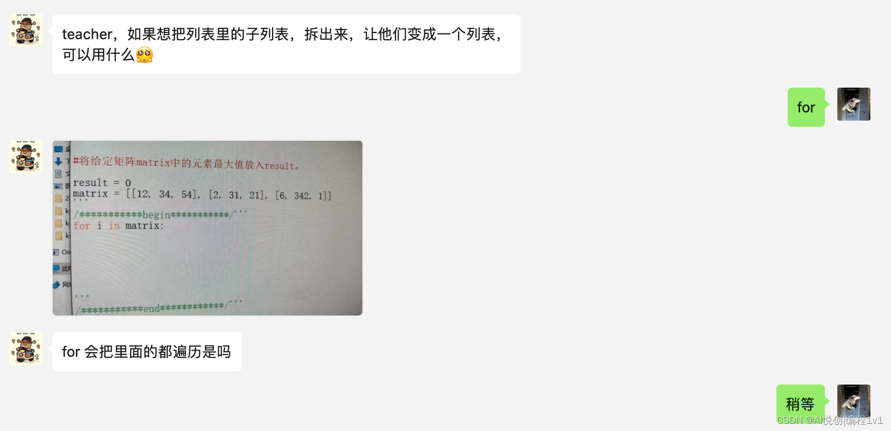

## 1. 提问🙋

teacher，如果想把列表里的子列表，拆出来，让他们变成一个列表，可以用什么[可怜]


## 解答
如果你有一个列表包含子列表，你可以使用 Python 的 `extend()` 函数或列表推导式来实现。下面是两种方法的例子：

1. 使用 `extend()` 函数。这个方法会遍历所有子列表，并将每个子列表的元素添加到新列表中：

```python
lst = [[1, 2, 3], [4, 5, 6], [7, 8, 9]]
new_lst = []
for sublist in lst:
    new_lst.extend(sublist)
print(new_lst)
```

2. 使用列表推导式。这是一个更简洁的方式，可以一行代码完成：

```python
lst = [[1, 2, 3], [4, 5, 6], [7, 8, 9]]
new_lst = [item for sublist in lst for item in sublist]
print(new_lst)
```

这两种方法都会将一个包含子列表的列表转换为一个新的列表，新列表包含原始列表中所有子列表的元素。

这里需要注意的是，以上两种方法只能处理二维列表（列表的列表），如果你的列表中还包含更深层次的子列表，那么你可能需要使用递归的方式来处理。


::: details 公众号：AI悦创【二维码】


:::

::: info AI悦创·编程一对一

AI悦创·推出辅导班啦，包括「Python 语言辅导班、C++ 辅导班、java 辅导班、算法/数据结构辅导班、少儿编程、pygame 游戏开发、Web、Linux」，全部都是一对一教学：一对一辅导 + 一对一答疑 + 布置作业 + 项目实践等。当然，还有线下线上摄影课程、Photoshop、Premiere 一对一教学、QQ、微信在线，随时响应！微信：Jiabcdefh

C++ 信息奥赛题解，长期更新！长期招收一对一中小学信息奥赛集训，莆田、厦门地区有机会线下上门，其他地区线上。微信：Jiabcdefh

方法一：[QQ](http://wpa.qq.com/msgrd?v=3&uin=1432803776&site=qq&menu=yes)

方法二：微信：Jiabcdefh

:::


