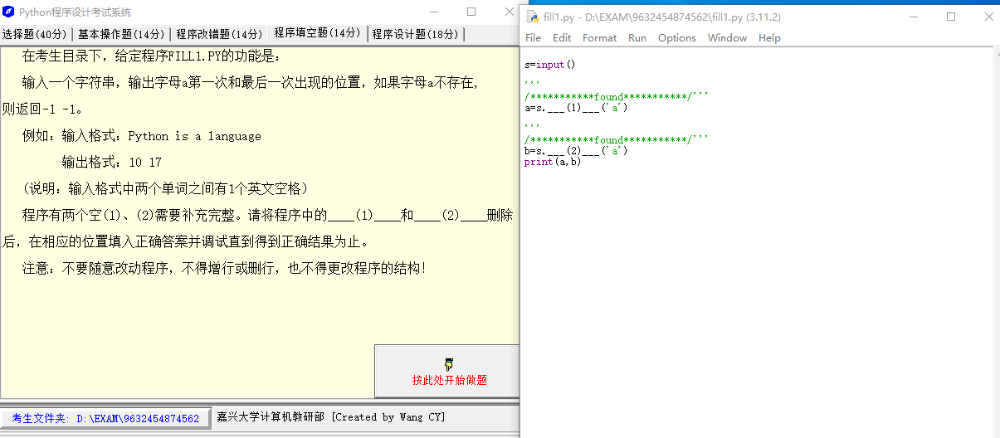
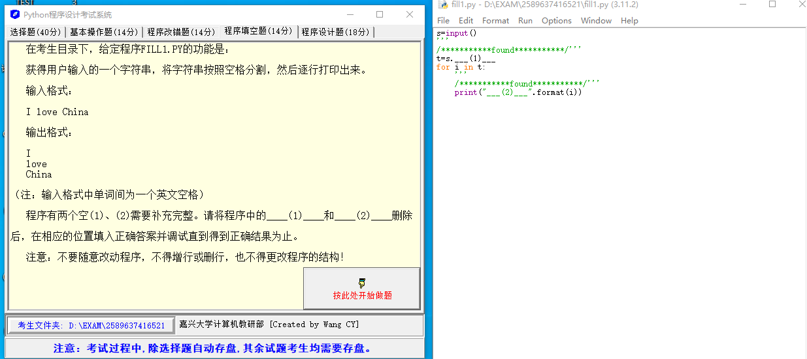
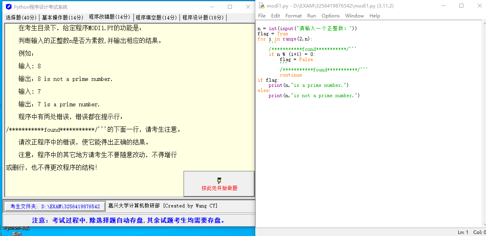

## Question 1



输入一个字符串，输出字母 a 第一次和最后一次出现的位置，如果字母 a 不存在，则返回 -1 -1.

例如：

输入格式：`Python is language`

输出格式：`10 17`

（说明：输入格式中两个单词之间有 1 个英文空格）

程序中有两个空（1）、（2）需要补充完整。

```python
s=input()

'''
/***********found***********/'''
a=s.___(1)___('a')

'''
/***********found***********/'''
b=s.___(2)___('a')
print(a,b)
```

### Solution 1

根据你的需求，我们要找出字符串中字母 'a' 首次和最后一次出现的位置。在 Python 中，我们可以使用 `find()` 和 `rfind()` 方法来实现这个功能。`find()` 方法返回字符串中第一次出现子字符串的索引，如果没有找到则返回 -1。`rfind()` 方法返回字符串中最后一次出现子字符串的索引，如果没有找到则返回 -1。所以，你的代码应该填充如下：

```python
s=input()

'''
/***********found***********/'''
a=s.find('a')

'''
/***********found***********/'''
b=s.rfind('a')
print(a,b)
```

在这段代码中，`find('a')` 方法会返回 'a' 在字符串 s 中第一次出现的位置，而 `rfind('a')` 方法会返回 'a' 在字符串 s 中最后一次出现的位置。

## Question 2



获得用户输入的一个字符串，将字符串按照空格分割，然后逐行打印出来。

输入格式：

I love China

输出格式：

I

love

China

（注：输入格式中单词间为一个英文空格）

```python
s=input()
'''
/***********found***********/'''
t=s.___(1)___
for i in t:
    '''
    /***********found***********/'''
    print("___(2)___".format(i))
```

### Solution 2

这是一个非常简单的 Python 程序，它获取用户输入的字符串，然后用空格分割，最后逐行打印出每个单词。这个程序中缺少的部分在以下代码中已被填充。

```python
s=input()
'''
/***********found***********/'''
t=s.split()
for i in t:
    '''
    /***********found***********/'''
    print("{}".format(i))
```

对应到你的原始代码，(1)处应该填入`split`方法，这是一个Python的字符串方法，用于将字符串按照某个分隔符（默认为空格）进行分割，返回一个包含分割后的所有子字符串的列表。

(2)处应该填入`{}`，这是Python中字符串格式化的占位符，用于替换为后面`format()`方法中的参数。在这里，它将被替换为当前循环中的单词`i`。

## Question 3



判断输入的正整数 n 是否为素数，并输出相应的结果。

例如：

输入：8

输出：8 is not a prime number.

输入：7

输出：7 is a prime number.

程序中有两处错误，错误都在提示行。

```python
n = int(input("请输入一个正整数："))
flag = True
for i in range(2,n):
    '''
    /***********found***********/'''
    if n % (i+1) = 0:
        flag = False
        '''
        /***********found***********/'''
        continue
if flag:
    print(n,"is a prime number.")
else:
    print(n,"is not a prime number.")
```

### 什么是素数？

素数是一个大于1的自然数，除了1和它自身外，不能被其他自然数整除。换句话说，素数只有两个正因数：1和自身。例如，前几个素数包括2，3，5，7，11，13，17，19，23等。

如果一个数既不是素数也不是1，我们就称它为合数。合数至少有三个正因数。

注意，1既不是素数也不是合数。在历史上，1曾被视为素数，但现在已经不再这样了。这样定义是为了使一些数学定理表述起来更加方便，例如唯一因子分解定理。

### Solution 3

第一处错误在于 if 语句后面应该使用双等号 "==" 来比较，而不是单等号 "="。第二处错误在于在找到一个因数后应该立即跳出循环，而不是继续循环。这样可以提高程序的效率。这是更正后的代码：

```python
n = int(input("请输入一个正整数："))
flag = True
for i in range(2, n):
    '''
    /***********found***********/'''
    if n % i == 0:
        flag = False
        '''
        /***********found***********/'''
        continue
if flag:
    print(n, "is a prime number.")
else:
    print(n, "is not a prime number.")
```
然而，这个代码仍有优化空间。实际上，我们只需要检查到 sqrt(n) 就可以了，因为一个大于 sqrt(n) 的因数必定和一个小于 sqrt(n) 的因数相配。这样可以极大地减少所需的计算量。并且，在判断是否为素数时，我们通常从 2 开始判断，而不是从 3 开始（即 i+1）。这是最终的改进代码：

```python
import math

n = int(input("请输入一个正整数："))
flag = True
for i in range(2, int(math.sqrt(n)) + 1):
    if n % i == 0:
        flag = False
        break
if flag:
    print(n,"is a prime number.")
else:
    print(n,"is not a prime number.")
```


::: details 公众号：AI悦创【二维码】


:::

::: info AI悦创·编程一对一

AI悦创·推出辅导班啦，包括「Python 语言辅导班、C++ 辅导班、java 辅导班、算法/数据结构辅导班、少儿编程、pygame 游戏开发、Web、Linux」，全部都是一对一教学：一对一辅导 + 一对一答疑 + 布置作业 + 项目实践等。当然，还有线下线上摄影课程、Photoshop、Premiere 一对一教学、QQ、微信在线，随时响应！微信：Jiabcdefh

C++ 信息奥赛题解，长期更新！长期招收一对一中小学信息奥赛集训，莆田、厦门地区有机会线下上门，其他地区线上。微信：Jiabcdefh

方法一：[QQ](http://wpa.qq.com/msgrd?v=3&uin=1432803776&site=qq&menu=yes)

方法二：微信：Jiabcdefh

:::


