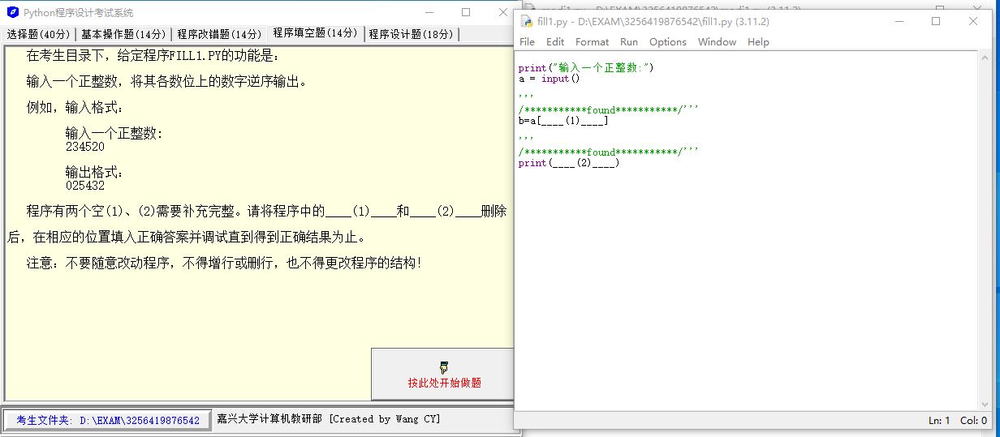
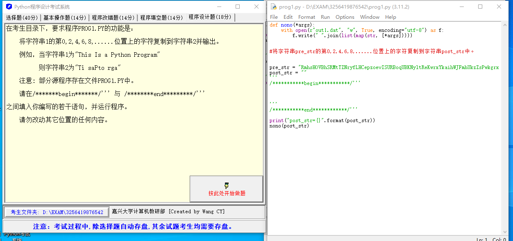
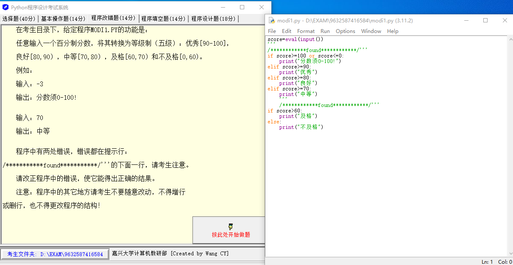

## Question 1



输入一个正整数，将其各数位上的数字逆序输出。

例如，输入的格式：

输入一个正整数：

234520

输出格式：

025432

程序有两个空（1）、（2）需要补充完整。

```python
print("输入一个正整数:")
a = input()

'''
/***********found***********/'''
b=a[____(1)____]

'''
/***********found***********/'''
print(____(2)____)  
```

### Solution 1

在 Python 中，可以通过切片来实现字符串的反转。这里的代码中，应该在`(1)`的位置填入`::-1`，来反转字符串`a`，即`b = a[::-1]`。然后，`(2)`处应该打印变量`b`，即`print(b)`。填充后的代码如下：

```python
print("输入一个正整数:")
a = input()

'''
/***********found***********/'''
b=a[::-1]

'''
/***********found***********/'''
print(b)
```

此代码将首先读取用户的输入，然后反转这个输入，最后打印反转后的结果。

## Question 2



将字符串 1 的第0, 2, 4, 6, 8,......位置上的字符复制到字符串 2 并输出。

例如，当字符串 1 为“This Is a Python Program”

则字符串 2 为“Ti saPto rga"

```python
def nono(*args):
    with open(r"out1.dat", "w", True, encoding="utf-8") as f:
        f.write(" ".join(list(map(str, [*args]))))
		

#将字符串pre_str的第0,2,4,6,8,......位置上的字符复制到字符串post_str中。


pre_str = "RmhsHOVBhSRMtTZNryfLHCepzoevISURBoqUBKNyltReKwrxYkaihWJFmhUkzZsPwkgrxAkjlvbZpdEnDQthsInXzDKfohHIcNLF"
post_str = ""
'''
/***********begin***********/'''


'''
/***********end************/'''

print("post_str={}".format(post_str))
nono(post_str)
```

### Solution 2

在这段代码中，我们需要获取原始字符串 `pre_str` 的偶数位置（索引从 0 开始）上的字符，并将其复制到 `post_str` 字符串中。我们可以通过 Python 的切片操作来实现这个功能，代码如下：

```python
pre_str = "RmhsHOVBhSRMtTZNryfLHCepzoevISURBoqUBKNyltReKwrxYkaihWJFmhUkzZsPwkgrxAkjlvbZpdEnDQthsInXzDKfohHIcNLF"
post_str = ""

'''
/***********begin***********/
'''

# 使用切片操作获取偶数索引的字符
post_str = pre_str[::2]

'''
/***********end************/
'''

print("post_str={}".format(post_str))
nono(post_str)
```

切片操作`pre_str[::2]`的含义是从`pre_str`中选取从开始到结束的字符，步长为2，所以它只会选取偶数位置的字符（因为索引从0开始，所以0、2、4、6...等都是偶数索引）。

这种方式非常方便，无需遍历原始字符串或创建新的循环，就可以直接获取所有的偶数位置字符。

## Question 3



任意输入一个百分制分数，将其转换为等级制（五级）：优秀[90-100]，良好[80, 90)，中等[70, 80)，及格[60, 70)和不及格[0, 60)。

例如：

输入：-3

输出：分数须 0-100!

输入：70

输出：中等

```python
score=eval(input())
'''
/************found************/'''
if score>=100 or score<=0:
    print("分数须0-100!")
elif score>=90:
    print("优秀")
elif score>=80:
    print("良好")
elif score>=70:
    print("中等")
    '''
    /************found************/'''
if score>60:
    print("及格")
else:
    print("不及格") 
```

### Solution 3

它需要用户输入一个分数，然后将其转换为五级评分：优秀、良好、中等、及格、不及格。程序代码已经大致完成，但有一些错误，特别是在处理输入范围和转换到各个等级的条件上。下面是修复这些问题后的代码：

```python
score=eval(input())
'''
/************found************/'''
if score>100 or score<0:
    print("分数须0-100!")
elif score>=90:
    print("优秀")
elif score>=80:
    print("良好")
elif score>=70:
    print("中等")
elif score>=60:
    print("及格")
else:
    print("不及格")
'''
/************found************/'''
```

在这段修复的代码中，首先检查输入的分数是否在0到100的范围内。如果不在，则输出错误信息。然后，使用elif语句按照降序检查分数范围，以确保将分数正确地转换为五级评分。


::: details 公众号：AI悦创【二维码】


:::

::: info AI悦创·编程一对一

AI悦创·推出辅导班啦，包括「Python 语言辅导班、C++ 辅导班、java 辅导班、算法/数据结构辅导班、少儿编程、pygame 游戏开发、Web、Linux」，全部都是一对一教学：一对一辅导 + 一对一答疑 + 布置作业 + 项目实践等。当然，还有线下线上摄影课程、Photoshop、Premiere 一对一教学、QQ、微信在线，随时响应！微信：Jiabcdefh

C++ 信息奥赛题解，长期更新！长期招收一对一中小学信息奥赛集训，莆田、厦门地区有机会线下上门，其他地区线上。微信：Jiabcdefh

方法一：[QQ](http://wpa.qq.com/msgrd?v=3&uin=1432803776&site=qq&menu=yes)

方法二：微信：Jiabcdefh

:::


