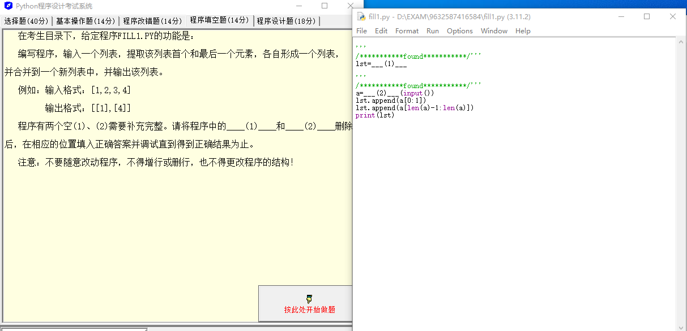
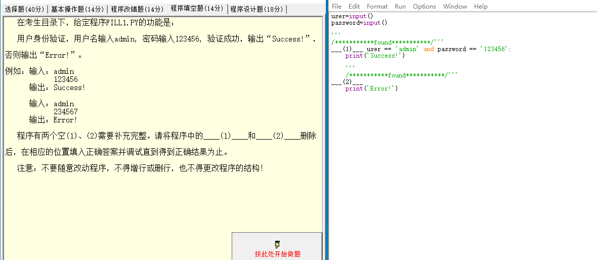
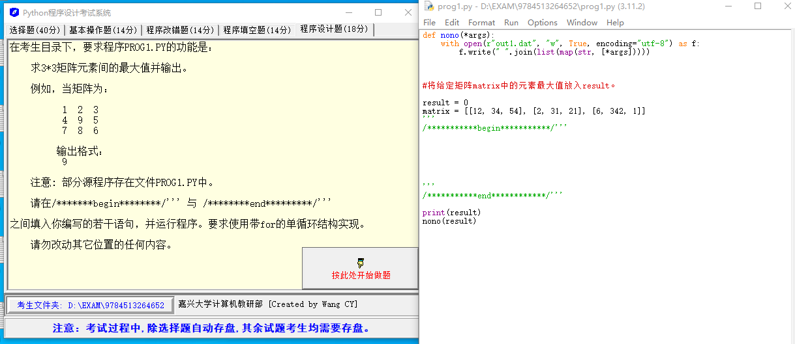

## Question 1



编写程序，输入一个列表，提取该列表首个和最后一个元素，各自形成一个列表，并合并到一个新列表中，并输出该列表。

例如：

输入格式：[1, 2, 3, 4]

输入格式：[[1], [4]]

程序有两个空（1）、（2）需要补充完整。

```python
'''
/***********found***********/'''
lst=___(1)___

'''
/***********found***********/'''
a=___(2)___(input())
lst.append(a[0:1])
lst.append(a[len(a)-1:len(a)])
print(lst)
```

### Solution 1

你需要在（1）的位置输入一个空的列表，并在（2）的位置输入`list`，这样就可以将输入转换成一个列表。因此，你应该编写以下代码：

```python
'''
/***********found***********/'''
lst=[]

'''
/***********found***********/'''
a=list(input())
lst.append(a[0:1])
lst.append(a[len(a)-1:len(a)])
print(lst)
```

但是，这段代码实际上不能正确地完成你想要的任务，因为`list(input())`会把输入字符串的每个字符都分开，包括中括号和逗号。如果你想让用户输入一个列表，你应该使用`eval()`函数来执行这个输入字符串。以下是一个修改过的、可以正确执行你想要任务的代码：

```python
'''
/***********found***********/'''
lst=[]

'''
/***********found***********/'''
a=eval(input())
lst.append([a[0]])
lst.append([a[-1]])
print(lst)
```

这段代码将接受一个列表作为输入，提取列表的第一个和最后一个元素，然后将这两个元素分别放入各自的列表中，并将这两个列表添加到`lst`列表中。最后，它会打印出`lst`列表。

## Question 2



用户身份验证，用户输入 admin，密码输入 123456，验证成功，输出“Success！”，否则输出“Error！”。

**例如：**

输入：admin

​           123456

输出：Success!

输入：admin

​           234567

输出：Error!

```python
user=input()
password=input()

'''
/***********found***********/'''
___(1)___ user == 'admin' and password == '123456':
    print('Success!')

    '''
    /***********found***********/'''
___(2)___
    print('Error!')
```

### Solution 2

你需要在你的 Python 代码的占位符里填写 `if` 和 `else`。Python 中，`if` 用于判断条件，如果条件满足，执行冒号后面的代码块；`else` 用于表示如果 `if` 的条件不满足，执行冒号后面的代码块。这是一种非常基本的条件控制语句。

你的填充代码应该如下：

```python
user=input()
password=input()

'''
/***********found***********/'''
if user == 'admin' and password == '123456':
    print('Success!')

    '''
    /***********found***********/'''
else:
    print('Error!')
```
这段代码首先接收用户的输入，然后检查用户是否输入了'admin'作为用户名和'123456'作为密码。如果都正确，将打印'Success！'；否则，将打印'Error！'。

## Question 3



求 3 * 3 矩阵元素间的最大值并输出。

例如，当矩阵为：

1 2 3

4 9 5

7 8 6

输出格式：9

```python
def nono(*args):
    with open(r"out1.dat", "w", True, encoding="utf-8") as f:
        f.write(" ".join(list(map(str, [*args]))))


#将给定矩阵matrix中的元素最大值放入result。	
	
result = 0
matrix = [[12, 34, 54], [2, 31, 21], [6, 342, 1]]
'''
/***********begin***********/'''


'''
/***********end************/'''

print(result)
nono(result)
```

### Solution 3

你需要在标记为 begin 和 end 之间的代码块里编写找出矩阵中元素的最大值的代码。这可以通过遍历矩阵中的所有元素并更新当前找到的最大值来实现。以下是完成此任务的代码：

```python
def nono(*args):
    with open(r"out1.dat", "w", True, encoding="utf-8") as f:
        f.write(" ".join(list(map(str, [*args]))))


#将给定矩阵matrix中的元素最大值放入result。   

result = 0
matrix = [[12, 34, 54], [2, 31, 21], [6, 342, 1]]

'''
/***********begin***********/'''
# 1 .遍历矩阵
for row in matrix:
    for num in row:
        # 如果当前编号大于当前结果，则更新结果
        if num > result:
            result = num
'''/***********end************/
'''

print(result)
nono(result)
```
这段代码将遍历矩阵中的每一行，然后遍历行中的每个元素。如果元素的值大于当前的result，那么就更新result的值。执行完遍历之后，result 就会保存矩阵中的最大值。


### 1. Python 1e-6代表什么？

在 Python 中，`1e-6` 是一种浮点数表示方法，它是科学计数法的一种表达方式。

`1e-6` 表示的是 $1 \times 10^{-6}$，也就是 $0.000001$。

在科学计数法中，`e` 或 `E` 代表“乘以 10 的指数”，比如 `5e3` 就等于 $5 \times 10^{3} = 5000$。

所以，`1e-6` 在 Python 中就是表示 $0.000001$。


::: details 公众号：AI悦创【二维码】


:::

::: info AI悦创·编程一对一

AI悦创·推出辅导班啦，包括「Python 语言辅导班、C++ 辅导班、java 辅导班、算法/数据结构辅导班、少儿编程、pygame 游戏开发、Web、Linux」，全部都是一对一教学：一对一辅导 + 一对一答疑 + 布置作业 + 项目实践等。当然，还有线下线上摄影课程、Photoshop、Premiere 一对一教学、QQ、微信在线，随时响应！微信：Jiabcdefh

C++ 信息奥赛题解，长期更新！长期招收一对一中小学信息奥赛集训，莆田、厦门地区有机会线下上门，其他地区线上。微信：Jiabcdefh

方法一：[QQ](http://wpa.qq.com/msgrd?v=3&uin=1432803776&site=qq&menu=yes)

方法二：微信：Jiabcdefh

:::


