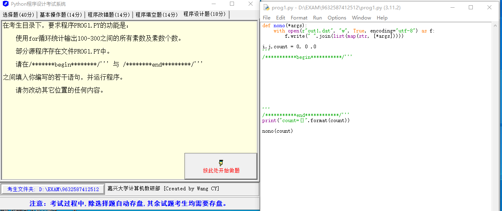
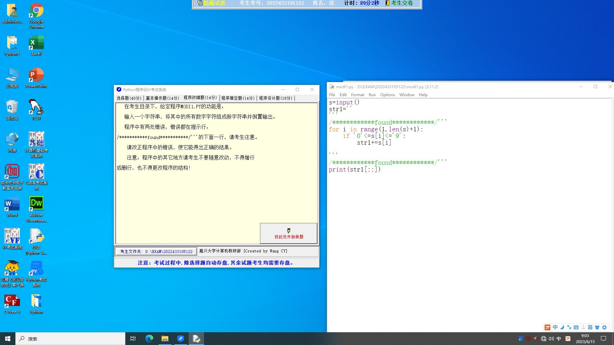
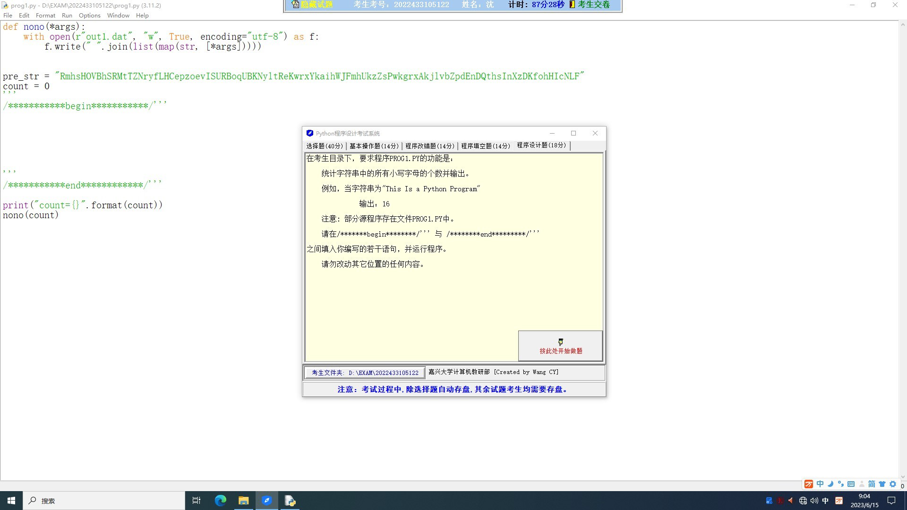

## Question 1



使用 for 循环统计输出 100～300 之间的所有素数及素数个数。

```python
def nono(*args):
    with open(r"out1.dat", "w", True, encoding="utf-8") as f:
        f.write(" ".join(list(map(str, [*args]))))

i,j,count = 0, 0 ,0	
'''
/***********begin***********/'''


'''
/***********end************/'''
print("count={}".format(count))

nono(count)
```

### Solution 1

以下是完成你的任务的代码。这段代码将找到100到300之间的所有素数，并统计它们的数量。

::: code-tabs

@tab 1

```python
def nono(*args):
    with open(r"out1.dat", "w", True, encoding="utf-8") as f:
        f.write(" ".join(list(map(str, [*args]))))


'''
/***********begin***********/
'''


def is_prime(n):
    if n <= 1:
        return False
    if n <= 3:
        return True
    if n % 2 == 0 or n % 3 == 0:
        return False
    i = 5
    while i * i <= n:
        if n % i == 0 or n % (i + 2) == 0:
            return False
        i += 6
    return True


i, j, count = 0, 0, 0

for num in range(100, 301):
    if is_prime(num):
        print(num)
        count += 1
'''
/***********end************/
'''
print("count={}".format(count))

nono(count)
```

@tab 详细注释

```python
# 定义了一个名为nono的函数，可以接收任意数量的参数（通过 *args 定义）。
def nono(*args):
    # 使用“with”关键字打开文件。这是一个非常好的做法，因为当文件操作完成后，它将自动关闭文件。
    # 这个函数将打开一个名为"out1.dat"的文件进行写操作（"w"），并且立即将数据刷新到磁盘（True），
    # 并以 "utf-8" 编码来处理文本。
    with open(r"out1.dat", "w", True, encoding="utf-8") as f:
        # 使用" ".join()将参数列表中的所有元素转化为字符串并用空格连接，然后写入文件。
        f.write(" ".join(list(map(str, [*args]))))


'''
/***********begin***********/
'''

# 定义了一个名为is_prime的函数，它接收一个参数n，并检查它是否是一个质数。
def is_prime(n):
    if n <= 1:
        # 如果 n 小于等于1，它就不是质数，返回False。
        return False
    if n <= 3:
        # 如果 n 小于等于3，它就是质数，返回True。
        return True
    if n % 2 == 0 or n % 3 == 0:
        # 如果 n 能被2或3整除，那么它就不是质数，返回False。
        return False
    i = 5
    while i * i <= n:
        # 如果 n 能被 i 或者 i+2 整除，那么 n 就不是质数，返回False。
        if n % i == 0 or n % (i + 2) == 0:
            return False
        # 在循环中，每次 i 都增加6。这是基于质数只能是6x-1或6x+1的形式的一个优化。
        i += 6
    # 如果所有的测试都被通过了，那么 n 就是质数，返回True。
    return True

# 初始化变量i，j和count为0。
i, j, count = 0, 0, 0

# 通过在 100-300 的范围内遍历每个数，来查找质数。
for num in range(100, 301):
    # 使用定义的 is_prime 函数检查当前的 num 是否是质数。
    if is_prime(num):
        # 如果 num 是质数，打印出这个数。
        print(num)
        # 质数计数器count加1。
        count += 1

'''
/***********end************/
'''

# 打印质数的数量。
print("count={}".format(count))

# 使用先前定义的函数 nono 将质数数量写入文件。
nono(count)
```

@tab 另一个版本

```python
def nono(*args):
    with open(r"out1.dat", "w", True, encoding="utf-8") as f:
        f.write(" ".join(list(map(str, [*args]))))

def is_prime(n):
    if n == 1 or n == 0:
        return False
    for i in range(2, int(n**0.5)+1):
        if n % i == 0:
            return False
    return True

count = 0
prime_numbers = []
for num in range(100, 301):
    if is_prime(num):
        count += 1
        prime_numbers.append(num)

print("Prime numbers between 100 and 300 are: ", prime_numbers)
print("count={}".format(count))

nono(count)
```

@tab 详细注释

```python
# 定义一个函数将参数写入文件
def nono(*args):
    # 打开文件，"w"表示以写模式打开，"True"表示立即将数据写入磁盘而不是缓冲，"utf-8"表示以utf-8编码写入
    with open(r"out1.dat", "w", True, encoding="utf-8") as f:
        # 将参数转换为字符串，然后使用空格连接它们，并写入文件
        f.write(" ".join(list(map(str, [*args]))))

# 定义一个函数判断给定的数是否为素数
def is_prime(n):
    # 0和1不是素数
    if n == 1 or n == 0:
        return False
    # 从2到n的平方根（包含）遍历每个数
    for i in range(2, int(n**0.5)+1):
        # 如果n可以被i整除，那么n不是素数
        if n % i == 0:
            return False
    # 如果n不能被任何小于其平方根的数整除，那么n是素数
    return True

# 初始化计数器
count = 0
# 初始化素数列表
prime_numbers = []
# 遍历从100到300（包含）的每个数
for num in range(100, 301):
    # 如果num是素数
    if is_prime(num):
        # 计数器增加1
        count += 1
        # 将素数添加到列表
        prime_numbers.append(num)

# 打印100到300之间的素数
print("Prime numbers between 100 and 300 are: ", prime_numbers)
# 打印素数的个数
print("count={}".format(count))

# 将素数的个数写入文件
nono(count)
```


:::

在这段代码中，我们定义了一个帮助函数 `is_prime(n)` 来检查一个数字是否是素数。然后，我们在100到300的范围内遍历每一个数，如果该数是素数，我们就打印它并增加计数器 `count`。最后，我们将素数的总数写入文件 "out1.dat" 并打印出来。

## Question 2



输入一个字符串，将其中所有数字字符组成新字符串并倒置输出。

```python
s = input()
str1 = ''
# found
for i in range(1, len(s) + 1):
    if '0' <= s[i] <= '9':
        str1 += s[i]

# found
print(str1[::])
```

### Solution 2

这段代码试图从给定的字符串中抽取数字，然后将这些数字以原顺序组合为新的字符串。然而，代码有几个错误：

1. Python的索引是从0开始的，而不是从1开始。因此，你需要将`for`循环的范围从`range(1, len(s) + 1)`改为`range(0, len(s))`。

2. 代码中的`print(str1[::])`只会打印出原顺序的字符串，而不是倒置的字符串。要倒置字符串，需要使用`[::-1]`。

以下是改正后的代码：

```python
s = input()
str1 = ''
# found
for i in range(0, len(s)):
    if '0' <= s[i] <= '9':
        str1 += s[i]

# found and reverse
print(str1[::-1])
```

这段代码会做以下几件事情：

1. 从用户那接收一个字符串。
2. 遍历字符串中的每一个字符，检查字符是否是一个数字。
3. 如果字符是数字，就将它添加到字符串`str1`。
4. 在收集完所有数字之后，倒置字符串`str1`并打印出来。

## Question 3



统计字符串中所有小写字母的个数并输出。

例如，当字符串为“This Is a Python Program“

输出：16

```python
pre_str = "RmhSHOVBhSRVtTZNIYFLHCePZOevISURBoqUBKNyItReKwrxYkaihWJFmhUKZZsPWgrxAkjIvbZDdEnDQthsInXZDKFOhHICNLF"
count = 0

'''
/***********begin***********/
'''


'''
/***********end***********/
'''
print("count={}".format(count))
```

### Solution 3

这个问题可以通过Python内建函数`islower()`解决，`islower()`会检查字符串中的所有字符是否都是小写。如果是，就返回`True`，否则返回`False`。

在这个例子中，我们将使用`for`循环遍历字符串中的每一个字符，如果这个字符是小写，就把计数器加一。

这是完成任务的代码：

```python
pre_str = "RmhSHOVBhSRVtTZNIYFLHCePZOevISURBoqUBKNyItReKwrxYkaihWJFmhUKZZsPWgrxAkjIvbZDdEnDQthsInXZDKFOhHICNLF"
count = 0

'''
/***********begin***********/
'''
for char in pre_str:
    if char.islower():
        count += 1
'''
/***********end***********/
'''
print("count={}".format(count))
```

这段代码将输出字符串`pre_str`中小写字母的个数。


::: details 公众号：AI悦创【二维码】


:::

::: info AI悦创·编程一对一

AI悦创·推出辅导班啦，包括「Python 语言辅导班、C++ 辅导班、java 辅导班、算法/数据结构辅导班、少儿编程、pygame 游戏开发、Web、Linux」，全部都是一对一教学：一对一辅导 + 一对一答疑 + 布置作业 + 项目实践等。当然，还有线下线上摄影课程、Photoshop、Premiere 一对一教学、QQ、微信在线，随时响应！微信：Jiabcdefh

C++ 信息奥赛题解，长期更新！长期招收一对一中小学信息奥赛集训，莆田、厦门地区有机会线下上门，其他地区线上。微信：Jiabcdefh

方法一：[QQ](http://wpa.qq.com/msgrd?v=3&uin=1432803776&site=qq&menu=yes)

方法二：微信：Jiabcdefh

:::


