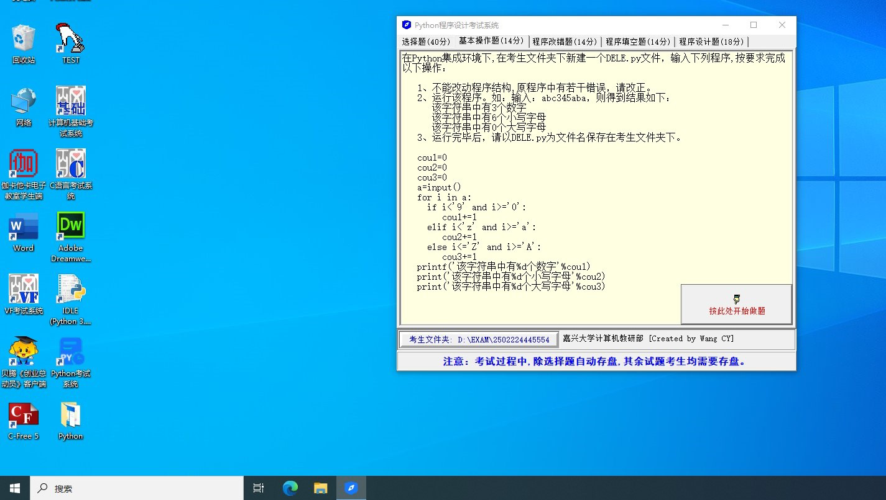
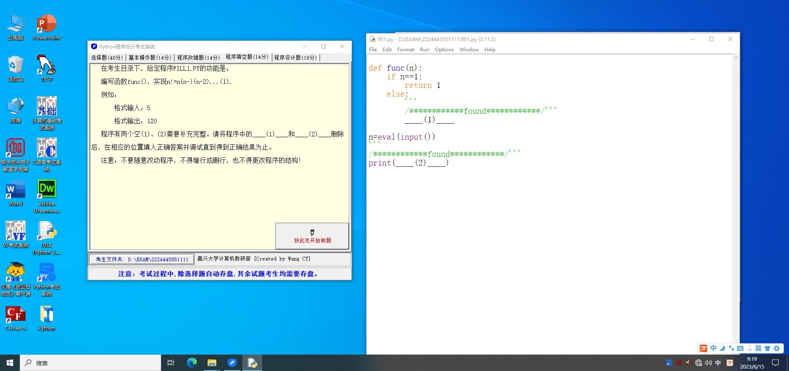
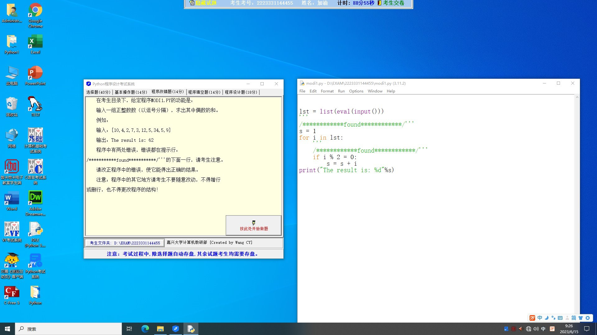

## Question 1



1. 不能改动程序结构，原程序中有若干错误，请改正。

2. 运行该程序。如，输入：abc345aba，则得到结果如下：

    该字符串中有 3 个数字

    该字符串中有 6 个小写字母

    该字符串中有 0 个大写字母

```python
cou1 = 0
cou2 = 0
cou3 = 0
a = input()
for i in a:
    if i < '9' and i >= '0':
        cou1 += 1
    elif i < 'z' and i >= 'a':
        cou2 += 1
    else: i <= 'Z' and i >= 'A':
        cou3 += 1
printf("该字符串中有%d个数字"%cou1)
print("该字符串中有%d个小写字母"%cou2)
print("该字符串中有%d个大写字母"%cou3)
```

### Solution 1

这个 Python 程序的错误主要在以下几个地方：

1. 你在判断字符是否为数字、小写字母或大写字母时，没有考虑到等于 `'9'`、`'z'` 或 `'Z'` 的情况。所以，你需要使用小于等于（`<=`）而不是小于（<）。

2. 对于大写字母的判断，你写成了 `else: i <= 'Z' and i >= 'A':` ，这是错误的。`else` 后面不需要接条件表达式，如果你想在 `else` 不满足的情况下再判断一次，应使用`elif`。

3. 你使用了 `printf` 这个函数，但在 Python 中并没有这个函数。你应该使用 `print`。

改正后的程序如下：

```python
cou1 = 0
cou2 = 0
cou3 = 0
a = input()
for i in a:
    if i <= '9' and i >= '0':
        cou1 += 1
    elif i <= 'z' and i >= 'a':
        cou2 += 1
    elif i <= 'Z' and i >= 'A':
        cou3 += 1
print("该字符串中有%d个数字"%cou1)
print("该字符串中有%d个小写字母"%cou2)
print("该字符串中有%d个大写字母"%cou3)
```

这个程序会对输入的字符串进行遍历，对每个字符判断其是否是数字，小写字母或大写字母，然后将对应的计数加一，并在最后输出每个类别的总数。

## Question 2



编写函数 `func()`，实现 `n! = n(n-)(n-2)...(1)`

例如：

格式输入：5

格式输出：120

程序有两个空（1）、（2）需要补充完整。

```python
def func(n):
    if n == 1:
        return 1
    else:
        ___(1)___

n = eval(input())
print(___(2)___)
```

### Solution 2

在你的 Python 函数中，你需要实现阶乘的功能，这可以通过递归来实现。在第一个空（1）你需要调用函数本身，计算 n 和 n-1 的阶乘。在第二个空（2）你需要打印出 func(n) 的结果。所以完整的代码应该是：

```python
def func(n):
    if n == 1:
        return 1
    else:
        return n * func(n-1)

n = eval(input())
print(func(n))
```

这段代码首先检查`n`是否为1，如果是则返回1，否则返回`n`乘以`n-1`的阶乘。然后通过用户输入来获取`n`的值，最后打印出`n!`的结果。

## Question 3



输入一组正整数（以逗号分隔），求出其中偶数的和。

例如：

输入：[10, 4, 2, 7, 3, 12, 5, 34, 5, 9]

输出：The result is：62

程序中有两处错误，错误都在提示行。

```python
lst = list(eval(input()))

s = 1
for i in lst:
    if i % 2 = 0:
        s = s + i
print("The result is: %d" %s)
```

### Solution 3

1. `s = 1`，这一行的初值应该是0，因为你在这里要求偶数的和，如果初值设为1，结果将会多出1。

2. 在判断语句中 `if i % 2 = 0:` 应该使用两个等号 `==`，因为在 Python 中，`=` 是赋值操作符，`==` 是等于判断操作符。

修复这两个错误后，你的代码应该看起来像这样：

```python
lst = list(eval(input()))

s = 0
for i in lst:
    if i % 2 == 0:
        s = s + i
print("The result is: %d" %s)
```
在这个修复的版本中，我们首先获取用户的输入并将其转换为列表。然后，我们初始化变量`s`为0，用来存储偶数的和。接着，我们遍历列表中的每个元素，如果该元素是偶数，我们就将其加到`s`上。最后，我们输出偶数的总和。


::: details 公众号：AI悦创【二维码】


:::

::: info AI悦创·编程一对一

AI悦创·推出辅导班啦，包括「Python 语言辅导班、C++ 辅导班、java 辅导班、算法/数据结构辅导班、少儿编程、pygame 游戏开发、Web、Linux」，全部都是一对一教学：一对一辅导 + 一对一答疑 + 布置作业 + 项目实践等。当然，还有线下线上摄影课程、Photoshop、Premiere 一对一教学、QQ、微信在线，随时响应！微信：Jiabcdefh

C++ 信息奥赛题解，长期更新！长期招收一对一中小学信息奥赛集训，莆田、厦门地区有机会线下上门，其他地区线上。微信：Jiabcdefh

方法一：[QQ](http://wpa.qq.com/msgrd?v=3&uin=1432803776&site=qq&menu=yes)

方法二：微信：Jiabcdefh

:::


