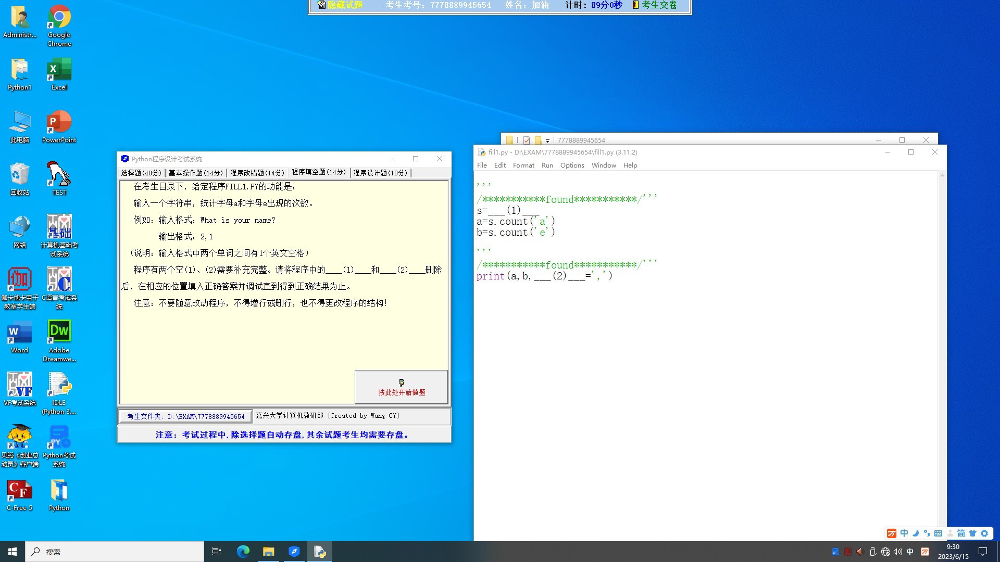
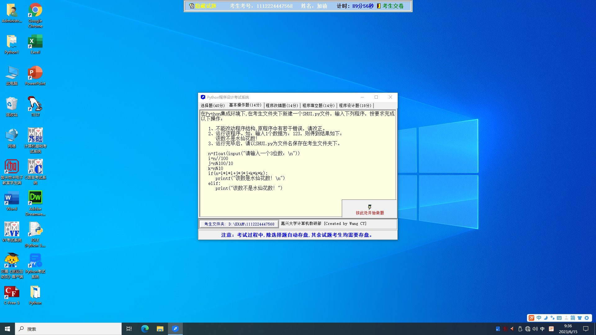
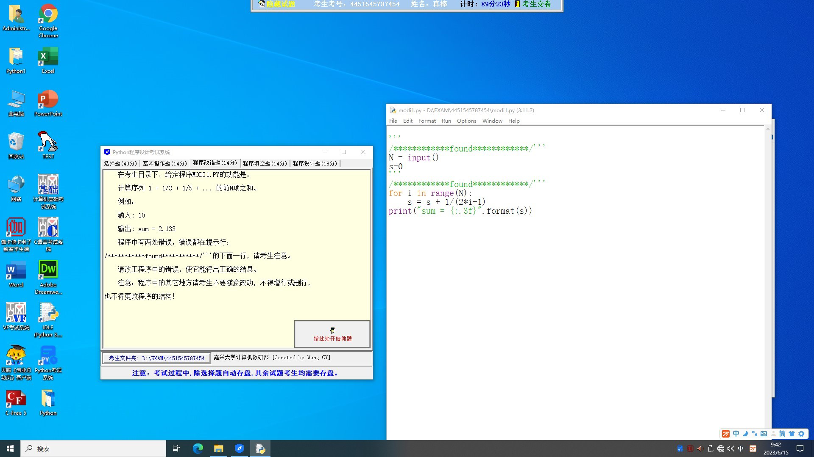

## Question 1



输入一个字符串，统计字母 a 和 字母 e 出现的次数。

例如：输入格式：What is your name？

输出格式：2,1

(说明：输入格式中两个单词之间有 1 个英文空格)

程序中有两个空（1）、（2）需要补充完整。

```python
s = ___(1)___
a = s.count('a')
b = s.count('e')
print(a, b, ___(2)___=",")
```

### Solution 1

代码如下：

```python
s = input().lower()
a = s.count('a')
b = s.count('e')
print(a, b, sep=",")
```
解释：

在空（1）处，我们使用 `input()` 函数获取用户的输入。`lower()` 函数是用来将输入的字符串全部转为小写，因为 Python 是区分大小写的，如果用户输入的是大写的"A"或"E"，我们也需要计算它们。所以将所有输入转为小写可以简化任务。

在空（2）处，我们使用 `sep` 参数来指定 `print` 函数中的不同项目之间应使用什么字符进行分割。在这个例子中，我们想要用逗号（"`,`"）来分隔 `a` 和 `b` 的值，因此我们将 `sep` 设置为 "`,`"。

## Question 2



1. 运行该程序。如：输入 1 个数据为：123，则得到结果如下：该数不是水仙花数！

```python
n = float(input("请输入一个 3 位数：\n"))
i = n // 100
j = n % 100 / 10
k = n % 10
if (n = i * i * i + j * j * j + k * k * k):
    printf("该数是水仙花数！\n")
elif:
    print("该数不是水仙花数！")
```

### Solution 2

首先，`printf` 不是 Python 中的函数，你可能想使用的是 `print`。其次，`elif`后面需要有条件，但在你的代码中没有。最后，你应该使用`==`比较操作符而不是`=`赋值操作符。你可以修改代码如下：

```python
n = int(input("请输入一个 3 位数：\n"))
i = n // 100
j = n % 100 // 10
k = n % 10
if (n == i * i * i + j * j * j + k * k * k):
    print("该数是水仙花数！\n")
else:
    print("该数不是水仙花数！")
```
以上代码已经可以运行，如果你输入的数字是一个水仙花数（例如153），它将返回"该数是水仙花数！"；否则，它将返回"该数不是水仙花数！"。

## Question 3



计算序列 1 + 1/3 + 1/5 + ......的前 N 项之和。

例如：

输入：10

输出：sum = 2.133

```python
N = input()
s = 0

for i in range(N):
    s = s + 1 / (2 * i - 1)
print("sum = {:.3f}".format(s))
```

### Solution 3

首先，需要修改一下你的代码，因为在你的代码中，初始i的值是0，这会导致序列的第一项变为"`1/(2*0 - 1)`"，这在数学上是未定义的。序列应该从"`1/(2*1 - 1)`"，即"`1/1`"开始。所以，我会将循环的范围从 "1" 到 "N+1"。另外，Python 中输入的需要转换为整型。代码修改如下：

```python
N = int(input())
s = 0

for i in range(1, N+1):
    s = s + 1 / (2 * i - 1)
print("sum = {:.3f}".format(s))
```

这样，如果你输入的 N 是10，那么代码会计算序列的前 10 项之和，并以小数点后 3 位的精度打印结果。


::: details 公众号：AI悦创【二维码】


:::

::: info AI悦创·编程一对一

AI悦创·推出辅导班啦，包括「Python 语言辅导班、C++ 辅导班、java 辅导班、算法/数据结构辅导班、少儿编程、pygame 游戏开发、Web、Linux」，全部都是一对一教学：一对一辅导 + 一对一答疑 + 布置作业 + 项目实践等。当然，还有线下线上摄影课程、Photoshop、Premiere 一对一教学、QQ、微信在线，随时响应！微信：Jiabcdefh

C++ 信息奥赛题解，长期更新！长期招收一对一中小学信息奥赛集训，莆田、厦门地区有机会线下上门，其他地区线上。微信：Jiabcdefh

方法一：[QQ](http://wpa.qq.com/msgrd?v=3&uin=1432803776&site=qq&menu=yes)

方法二：微信：Jiabcdefh

:::


