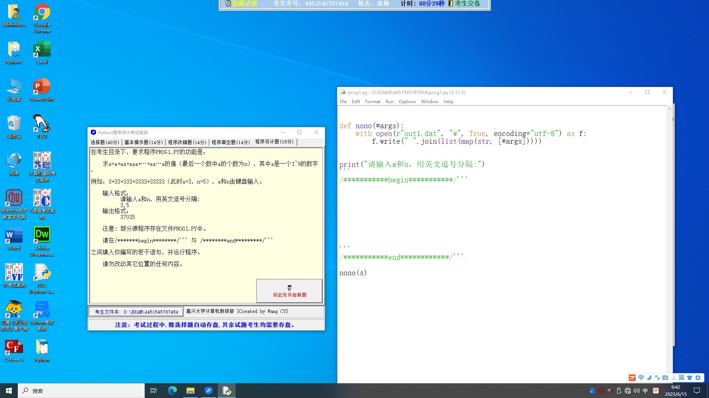
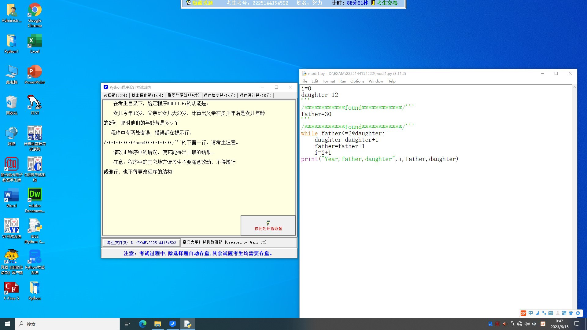

## Question 1



求 s = a + aa + aaa + ···+aa···a 的值（最后一个数中 a 的个数为 n），其中 a 是一个 1～9 的数字，例如：3+33+333+3333+33333（此时 a = 3，n = 5），a 和 n 由键盘输入。

输入格式：

请输入 a 和 n，用英文逗号分隔：

3,5

输出格式：37035

```python
print("请输入 a 和 n，用英文逗号分隔：")
```

### Solution 1

::: code-tabs

@tab 1

```python
print("请输入 a 和 n，用英文逗号分隔：")
a, n = map(int, input().strip().split(','))

s = 0
temp = 0
for i in range(n):
    temp = temp * 10 + a
    s += temp

print(s)
```

@tab 详细注释

```python
# 提示用户输入 a 和 n 的值，以英文逗号分隔
print("请输入 a 和 n，用英文逗号分隔：")

# 使用 input().strip().split(',') 从输入字符串获取 a 和 n 的值
# 使用 map 函数将字符串转化为整型
a, n = map(int, input().strip().split(','))

# 初始化求和变量 s 为 0
s = 0

# 初始化临时变量 temp 为 0，用于生成序列中的每一项
temp = 0

# 使用一个循环来生成并累加序列中的每一项
for i in range(n):
    # 将上一项乘以 10 再加上 a，生成新的一项
    # 例如，如果 a 是 3，首先生成 3，然后生成 33，然后生成 333，以此类推
    temp = temp * 10 + a
    
    # 将新生成的一项累加到求和变量 s 上
    s += temp

# 打印出总和 s
print(s)
```


:::

这个程序首先提示用户输入 a 和 n 的值。然后，使用了一个循环来计算每一项，并将它们累加到总和 s 中。

在循环中，我们通过 `temp = temp * 10 + a` 来生成每一项。例如，当 a = 3 时，首先生成 3，然后生成 33，再生成 333，以此类推。这正是我们需要的每一项。

最后，我们打印出总和 s，这就是我们需要的答案。

## Question 2



女儿今年 12 岁，父亲比女儿大 30 岁，计算出父亲在多少年后是女儿年龄的 2 倍，那时他们的年龄各是多少？

```python
i = 0
daughter = 12
father = 30

while father <= 2 * daughter:
    daughter = daughter + 1
    father = father + 1
    i = i + 1
print("Year, father,daughter", i, father, daughter)
```

### Solution 2

上面的 Python 代码基本上是正确的，只是有一个小错误。应该在 `father` 是 `2 * daughter` 时停止循环，而不是在 `father` 小于或等于 `2 * daughter` 时继续循环。这就是为什么你的循环在满足条件的年龄后还进行了一次。另外，父亲的初始年龄应该是女儿的年龄加30。下面是修正后的代码：

```python
i = 0
daughter = 12
father = daughter + 30

while father != 2 * daughter:
    daughter = daughter + 1
    father = father + 1
    i = i + 1
print("Year, father, daughter:", i, father, daughter)
```

这段代码将会找出在几年后父亲的年龄是女儿的两倍，以及那时他们各自的年龄。

### 思路

首先，题目提供了以下的信息：
1. 女儿当前年龄是 12 岁。
2. 父亲比女儿大 30 岁，所以父亲的当前年龄是 42 岁。

我们需要找出在多少年后，父亲的年龄是女儿年龄的 2 倍。这意味着我们需要找出满足以下条件的最小年份 `i`：

`父亲的年龄 = 2 * 女儿的年龄`

因为时间是线性的，每过一年，父亲和女儿的年龄都会增加一岁。所以我们可以通过不断增加 `i`（年份）、父亲的年龄和女儿的年龄来找出满足上述条件的 `i`。

在 Python 代码中，我们首先设置 `i = 0`（年份）、`daughter = 12`（女儿的年龄）和 `father = daughter + 30`（父亲的年龄）。然后，我们开始一个 `while` 循环，循环条件是 `father` 不等于 `2 * daughter`（父亲的年龄不是女儿年龄的两倍）。在循环内，我们每次都让 `i`、`daughter` 和 `father` 各增加 1。当 `father` 等于 `2 * daughter` 时，我们退出循环，并打印出 `i`、`father` 和 `daughter`。

这样，我们就找出了在几年后父亲的年龄是女儿的两倍，以及那时他们各自的年龄。


::: details 公众号：AI悦创【二维码】


:::

::: info AI悦创·编程一对一

AI悦创·推出辅导班啦，包括「Python 语言辅导班、C++ 辅导班、java 辅导班、算法/数据结构辅导班、少儿编程、pygame 游戏开发、Web、Linux」，全部都是一对一教学：一对一辅导 + 一对一答疑 + 布置作业 + 项目实践等。当然，还有线下线上摄影课程、Photoshop、Premiere 一对一教学、QQ、微信在线，随时响应！微信：Jiabcdefh

C++ 信息奥赛题解，长期更新！长期招收一对一中小学信息奥赛集训，莆田、厦门地区有机会线下上门，其他地区线上。微信：Jiabcdefh

方法一：[QQ](http://wpa.qq.com/msgrd?v=3&uin=1432803776&site=qq&menu=yes)

方法二：微信：Jiabcdefh

:::


