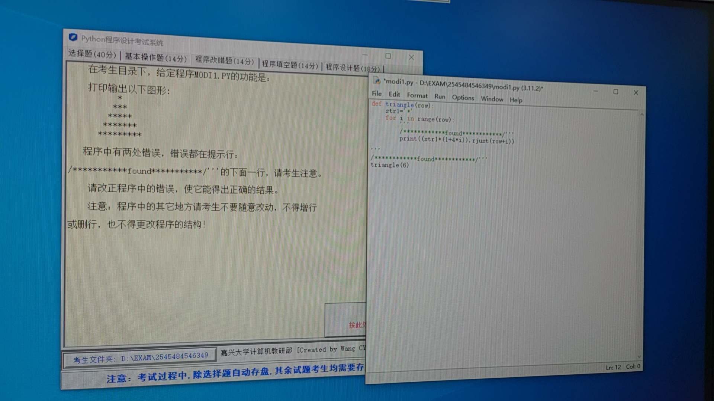
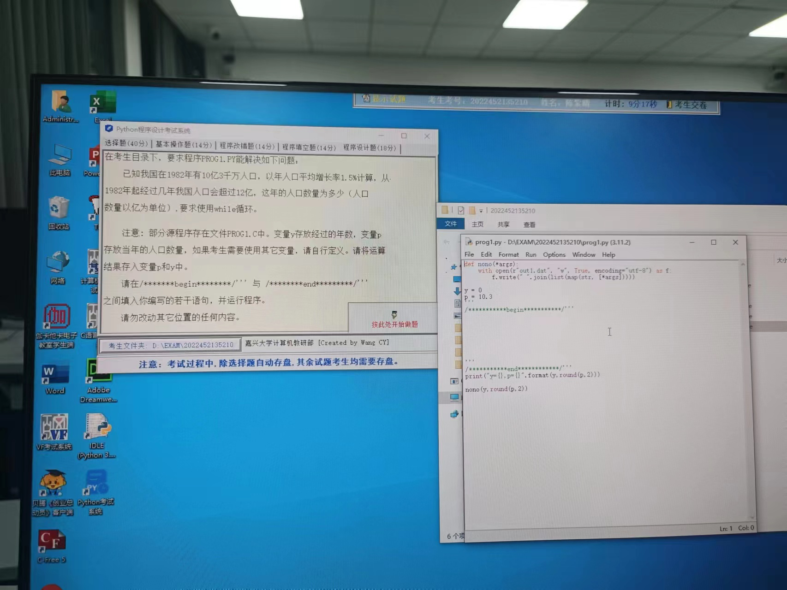
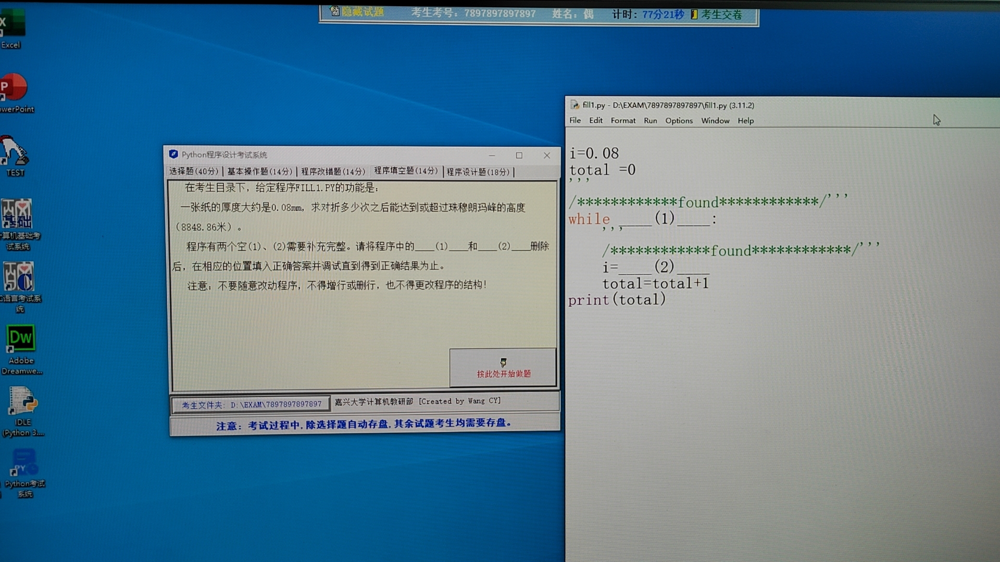

## Question 1



打印输出以下图形：

```python
    *
   ***
  *****
 *******
*********
```

程序中有两处错误。

```python
def triangle(row):
    str1 = "*"
    for i in range(row):
        print((str1 * (1 + 4 * i)).rjust(row + i))


triangle(6)
```

### Solution 1

代码中有两个主要问题。首先，根据提供的星号图形，每行的星号数是按照`2*i + 1`的方式增加的，其中`i`是行号（从0开始）。但在您的代码中，您使用了`1 + 4 * i`，这不会产生预期的输出。其次，`.rjust(row + i)`的部分不会产生预期的结果，因为它应该是`.center(2*row-1)`。

以下是修改后的代码：

```python
def triangle(row):
    str1 = "*"
    for i in range(row):
        print((str1 * (2*i + 1)).center(2*row-1))

triangle(5)
```

上述代码将会打印出需要的图形。

### 思考

这是所需要的图形：

```
    *
   ***
  *****
 *******
*********
```

这个图形是一个五行的等腰三角形。每一行都有一定数量的星号，这些星号的数量从顶部的1个逐渐增加到底部的9个。每一行的星号数比上一行多两个。这个规律可以用公式`2*i + 1`来表示，其中`i`表示行号（从0开始）。例如，在第0行（顶部），有`2*0 + 1 = 1`个星号，在第4行（底部），有`2*4 + 1 = 9`个星号。

同时，每一行的星号都应该在中心位置。这需要在每行的开始部分添加一定数量的空格。在Python中，我们可以使用`.center(width)`方法来做到这一点。这个方法会使得字符串在指定宽度的字段中居中对齐。在这个例子中，最宽的行是最底部的行，它的宽度是`2*row-1`（在这个例子中是`2*5-1=9`）。

下面是代码及其注释：

```python
def triangle(row):
    # 定义一个字符串str1，包含一个星号
    str1 = "*"
    # 对于每一行，我们进行一次循环
    for i in range(row):
        # 对于每一行，我们打印一个字符串
        # 这个字符串由一定数量的星号组成，数量由2*i + 1确定，然后将这些星号居中对齐
        # 最宽的一行的宽度为2*row-1，所以我们将字符串居中到这个宽度
        print((str1 * (2*i + 1)).center(2*row-1))

# 调用这个函数，生成一个5行的等腰三角形
triangle(5)
```

## Question 2



已知我国在 1982年有10亿3千万人口，以年人口平均增长率 1.5% 计算，从 1982 年起经过几年我国人口会超过 12 亿，这年人口数量为多少（人口数量以亿为单位），要求使用 while 循环。

变量 y 存放经过的年数，变量 p 存放当年的人口数量。

```python
y = 0
p = 10.3


print("y={}, p={}".format(y, round(p, 2)))
```

### Solution 2

这是一个适合使用 while 循环来解决的问题。我们的目标是找到年份 y，使得人口 p 超过12亿。代码如下：

```python
y = 0
p = 10.3

while p <= 12:
    p = p * (1 + 0.015)
    y += 1

print("y={}, p={}".format(y, round(p, 2)))
```

在这段代码中，我们首先设置了初始年份 y 为 0 年，初始人口 p 为 10.3 亿。然后，我们开始一个 while 循环，在循环内部，我们更新每年的人口数量，并增加年份。

循环将在人口 p 大于 12 亿时结束。我们每年增加 1.5% 的人口数量，并把年份增加 1。

最后，我们打印出需要的年份 y 以及对应的人口数量 p（保留两位小数）。

### 思考

我们首先来看这个 Python 代码的功能。这段代码的目的是模拟我国人口的增长，并计算出在人口达到或超过12亿时经过的年数以及这一年的人口数量。该代码的主要组成部分是一个 while 循环，该循环会在人口达到或超过12亿时停止。

**解题思路：**

1. 首先设定初始年份为 0 年（`y=0`），初始人口为 10.3 亿（p=10.3）。
2. 然后进行一个 while 循环。循环的条件是：只要人口数还没有达到12亿，就继续执行循环。循环的内容是计算下一年的人口数，并增加年份。
3. 每年的人口增长都是按照年人口增长率 `1.5%` 来计算的，计算公式为：`新的人口 = 旧的人口 * (1 + 年人口增长率)`。
4. 每执行一次循环，年份就会加 1。
5. 当人口数达到或超过 12 亿时，循环停止。
6. 最后，我们打印出经过的年份和这一年的人口数。

这是上述代码及详细注释：

```python
# 初始年份为 0 年
y = 0
# 初始人口为 10.3 亿
p = 10.3

# 如果当前人口小于或等于 12 亿，那么执行循环体
while p <= 12:
    # 每年的人口数量为上一年人口数量的 101.5%，这是按照年增长率 1.5% 计算得出
    p = p * (1 + 0.015)
    # 每循环一次，年份就加 1
    y += 1

# 打印出需要的年份 y，以及对应的人口数量 p（保留两位小数）
print("y={}, p={}".format(y, round(p, 2)))
```

通过运行上述代码，我们可以得到从 1982 年开始，需要经过多少年我国人口会超过 12 亿，以及那一年的人口数量。

## Question 3



一张纸的厚度大约是 0.08 mm，求对折多少次之后能达到或超过珠穆朗玛峰的高度（8848.86米）。

程序有两个空（1）、（2）需要补充完整。

```python
i = 0.08
total = 0

while ___(1)___:
    i = ___(2)___
    total = total + 1
print(total)
```

### Solution 3

在这个问题中，每次对折纸张都会使其厚度加倍。因此，在程序中，我们需要在 while 循环中检查纸张的当前厚度是否已经达到或超过珠穆朗玛峰的高度（8848.86 米，或 8848860 毫米）。每次迭代中，我们需要将纸张的厚度乘以2。所以，应该这样来填充空（1）、（2）：

```python
i = 0.08
total = 0

while i < 8848860:
    i = i * 2
    total = total + 1
print(total)
```
这样的程序会输出需要对折的次数，以使纸张的厚度达到或超过珠穆朗玛峰的高度。

### 详细注释

```python
# 首先，我们将纸的初始厚度设置为0.08毫米
i = 0.08 

# 然后，我们设置一个计数器total，这个计数器将会跟踪我们对纸进行折叠的次数
total = 0 

# while循环将会一直运行，直到纸的厚度(i)达到或超过珠穆朗玛峰的高度(8848860毫米)
while i < 8848860:

    # 在每一次循环中，我们将纸的厚度乘以2。因为每一次折叠都会使纸的厚度加倍
    i = i * 2 

    # 然后，我们将计数器total加1，表示我们对纸进行了一次折叠
    total = total + 1 

# 在循环结束后，我们打印出total的值。这个值表示了我们需要折叠多少次纸，才能使其厚度达到或超过珠穆朗玛峰的高度
print(total)
```

理解这个题目的关键是理解折叠纸张是如何影响其厚度的。每一次对纸进行折叠，都相当于将纸的厚度翻倍。所以，在这个问题中，我们需要计算折叠多少次后，纸的厚度能达到珠穆朗玛峰的高度。这就是为什么我们会在每次循环中将纸的厚度乘以2，并且用一个计数器来跟踪我们进行了多少次折叠。

### 疑惑解答

::: tip 对折为什么是2倍不是2的平方？

每次对折纸张，你的纸张的厚度都将增加一倍。这是因为你在把原来的纸张厚度（厚度为 i）叠加在一起，从而得到新的厚度（厚度为 `2*i`）。这是一个线性的叠加，而不是指数的叠加。

例如，如果你有一张纸，它的厚度是 `0.08mm` 。当你对它进行一次对折后，新的厚度就会变成 `0.08mm * 2 = 0.16mm` 。再次对折，厚度就变为 `0.16mm * 2 = 0.32mm` ，以此类推。

如果每次对折都使厚度变为原来的平方（即 $ i = i^2$），那么厚度的增长会变得非常快。例如，如果你从 `0.08mm` 开始，第一次对折后厚度将变为 `0.0064mm` ，远小于原始的厚度。然后，这个值将变为 $0.0064mm^2 = 0.000041mm$ ，这是一个迅速减小的数列。在这种情况下，你永远也不可能通过对折纸张来达到珠穆朗玛峰的高度。

:::


::: details 公众号：AI悦创【二维码】


:::

::: info AI悦创·编程一对一

AI悦创·推出辅导班啦，包括「Python 语言辅导班、C++ 辅导班、java 辅导班、算法/数据结构辅导班、少儿编程、pygame 游戏开发、Web、Linux」，全部都是一对一教学：一对一辅导 + 一对一答疑 + 布置作业 + 项目实践等。当然，还有线下线上摄影课程、Photoshop、Premiere 一对一教学、QQ、微信在线，随时响应！微信：Jiabcdefh

C++ 信息奥赛题解，长期更新！长期招收一对一中小学信息奥赛集训，莆田、厦门地区有机会线下上门，其他地区线上。微信：Jiabcdefh

方法一：[QQ](http://wpa.qq.com/msgrd?v=3&uin=1432803776&site=qq&menu=yes)

方法二：微信：Jiabcdefh

:::


