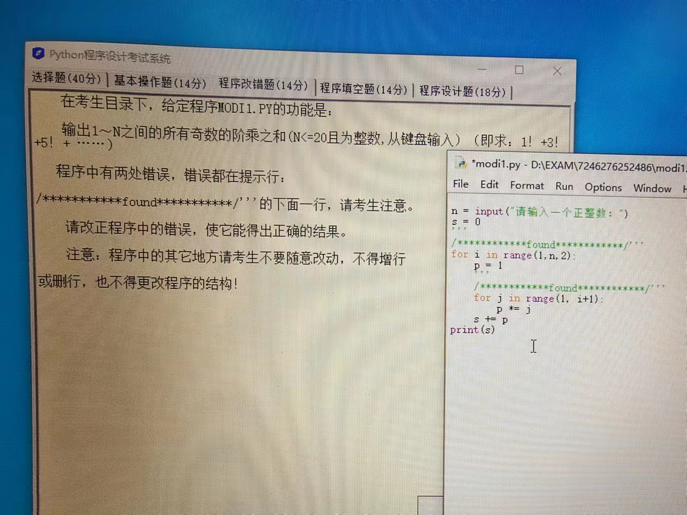
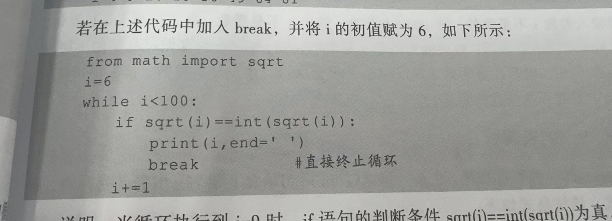
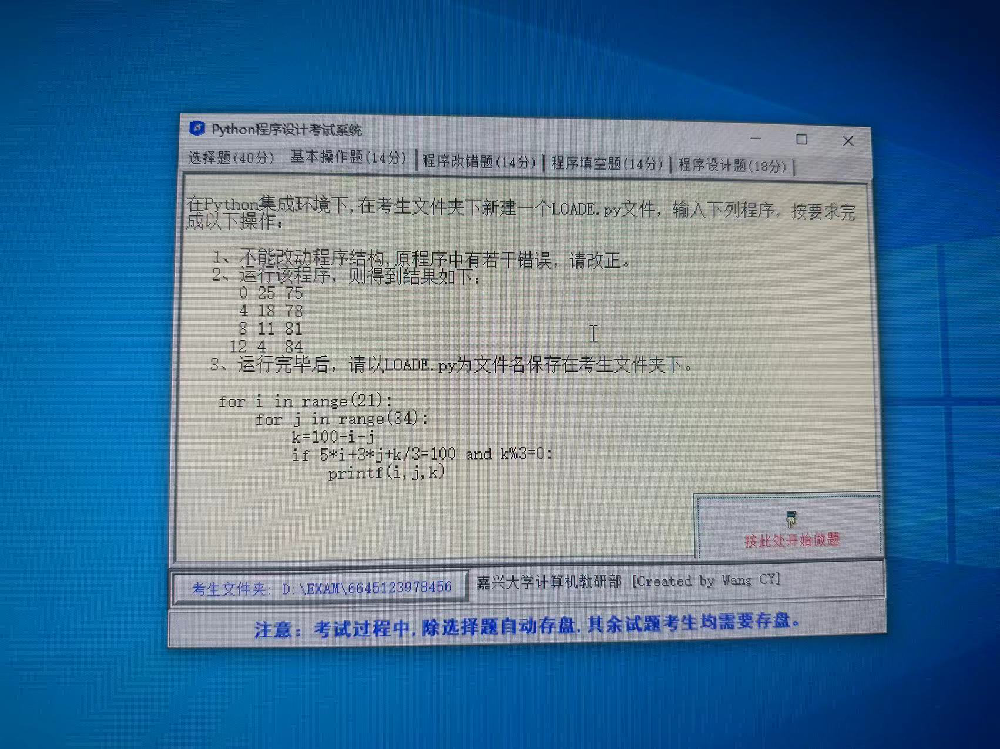

## Question 1



输出1～N 之间的所有奇数的阶乘之和（N <= 20 且为整数，从键盘输入）（即求：1! + 3! + 5! + ······）

程序中有两处错误。

```python
n = input("请输入一个正整数:")
s = 0

for i in range(1, n, 2):
    p = 1
    for j in range(1, i + 1):
        p *= j
    s += p
print(s)
```

### Solution 1

程序中的两个错误如下：

1. `input`函数的返回值是字符串类型，而在此处我们需要一个整数来作为循环的上界。因此，我们需要使用 `int()` 函数将 `input()` 的结果转化为整数。

2. 在 Python 的 `range()` 函数中，上界是不包含的，所以在主循环中，需要将上界设为 `n+1`，以包含输入的数字（如果输入的数字是奇数）。

修正后的程序应为：

::: code-tabs

@tab 1

```python
n = int(input("请输入一个正整数:"))
s = 0

for i in range(1, n + 1, 2):
    p = 1
    for j in range(1, i + 1):
        p *= j
    s += p
print(s)
```

@tab 详细注释

```python
# 使用input函数从键盘接收用户输入，input返回的是字符串类型
# 使用int函数将字符串转换为整数
n = int(input("请输入一个正整数:"))

# 初始化变量s用于存储阶乘之和
s = 0

# 使用range函数生成从1到n的所有奇数（包含n如果n是奇数）
# range的三个参数分别为起始值，结束值，步长
# 该循环用于遍历所有奇数
for i in range(1, n + 1, 2):

    # 初始化变量p用于存储单个奇数的阶乘
    p = 1
    
    # 使用range函数生成从1到i的所有整数（包含i）
    # 该循环用于计算i的阶乘
    for j in range(1, i + 1):
        
        # 在每次循环中，将p与j相乘，然后将结果赋值给p
        p *= j
    
    # 将i的阶乘加到阶乘之和s上
    s += p

# 打印阶乘之和
print(s)
```

:::

此程序首先接收用户输入的正整数`n`，然后遍历所有在1到`n`之间的奇数（包含`n`如果`n`是奇数），并计算每一个奇数的阶乘，然后将所有的阶乘加起来。

## Question 2



```python
from math import sqrt

i = 6
while i < 100:
    if sqrt(i) == int(sqrt(i)):
        print(i, end=" ")
        break
    i += 1
```

### Solution 2

这段代码是一个Python脚本，它的主要作用是找出从 6 开始的第一个完全平方数。代码的详细注释如下：

```python
# 从math模块导入sqrt函数，用于计算平方根
from math import sqrt

# 初始化一个变量i，其初始值为6
i = 6

# 创建一个while循环，条件为当i小于100时继续循环
while i < 100:
    # 如果i的平方根的整数部分等于它的平方根（即i是完全平方数）
    if sqrt(i) == int(sqrt(i)):
        # 打印出这个完全平方数，end=" "表示打印后不换行，而是空格
        print(i, end=" ")
        # 找到完全平方数后，退出循环
        break
    # 如果i不是完全平方数，那么i加1，继续下一次循环
    i += 1
```

简单来说，这段代码会从6开始逐一检查每个数是否为完全平方数，一旦找到第一个完全平方数，它就会打印出该数，然后退出循环。

## Question 3



1. 不能改动程序结构，原程序中有若干错误，请改正。

2. 运行该程序，则得到结果如下：

```python
0 25 75
4 18 78
8 11 81
12 4 84
```

```python
for i in range(21):
    for j in range(34):
        k = 100-i-j
        if 5 * i + 3 * j + k / 3 = 100 and k % 3 = 0:
            printf(i, j, k)
```

### Solution 3

原程序中的错误主要有以下几点：

1. 在 Python 中，打印是通过 `print()` 函数完成的，不是 `printf()`。
2. 在 Python 中，赋值符号为 `=`，而相等比较符号为 `==`。
3. 在 Python 中，为了确保 k 为整数，你需要用 `//` 做除法，否则 `/` 可能会返回浮点数。

改正后的程序如下：

```python
for i in range(21):
    for j in range(34):
        k = 100-i-j
        if 5 * i + 3 * j + k // 3 == 100 and k % 3 == 0:
            print(i, j, k)
```

这个程序试图通过暴力搜索找到所有可能的解决方案，即找到所有的i, j 和 k，满足以下条件： 
- `5 * i + 3 * j + k / 3 = 100`
- k是3的倍数
- `i + j + k = 100`
其中 i, j, k 都是非负整数，并且 i 的取值范围是 0-20，j的取值范围是 0-33。

### 详细注释

```python
# 对于i在0-20的范围内进行循环
for i in range(21):
    # 对于j在0-33的范围内进行循环
    for j in range(34):
        # 计算k的值，使得i+j+k总和为100
        k = 100-i-j

        # 判断是否满足以下两个条件
        # 1) 5个i，3个j，以及每三个k所需的总金额为100
        # 2) k必须能被3整除，即k是3的倍数
        # 这里的 "//" 操作符表示整除，返回除法的整数部分，确保k为整数
        if 5 * i + 3 * j + k // 3 == 100 and k % 3 == 0:
            # 如果满足上述条件，则打印i, j, k的值
            print(i, j, k)
```


::: details 公众号：AI悦创【二维码】


:::

::: info AI悦创·编程一对一

AI悦创·推出辅导班啦，包括「Python 语言辅导班、C++ 辅导班、java 辅导班、算法/数据结构辅导班、少儿编程、pygame 游戏开发、Web、Linux」，全部都是一对一教学：一对一辅导 + 一对一答疑 + 布置作业 + 项目实践等。当然，还有线下线上摄影课程、Photoshop、Premiere 一对一教学、QQ、微信在线，随时响应！微信：Jiabcdefh

C++ 信息奥赛题解，长期更新！长期招收一对一中小学信息奥赛集训，莆田、厦门地区有机会线下上门，其他地区线上。微信：Jiabcdefh

方法一：[QQ](http://wpa.qq.com/msgrd?v=3&uin=1432803776&site=qq&menu=yes)

方法二：微信：Jiabcdefh

:::


