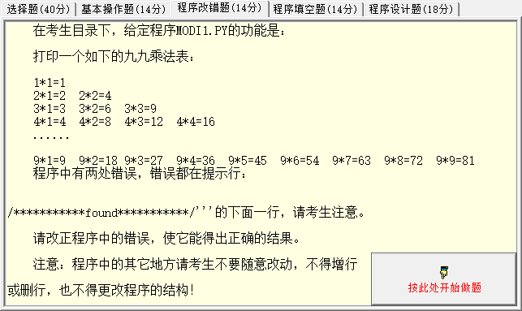
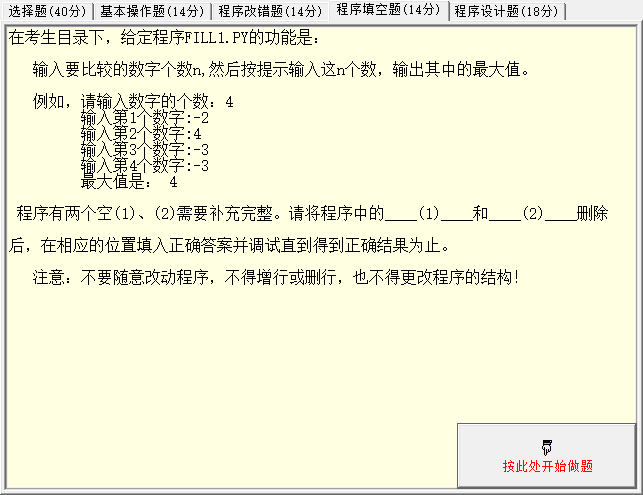
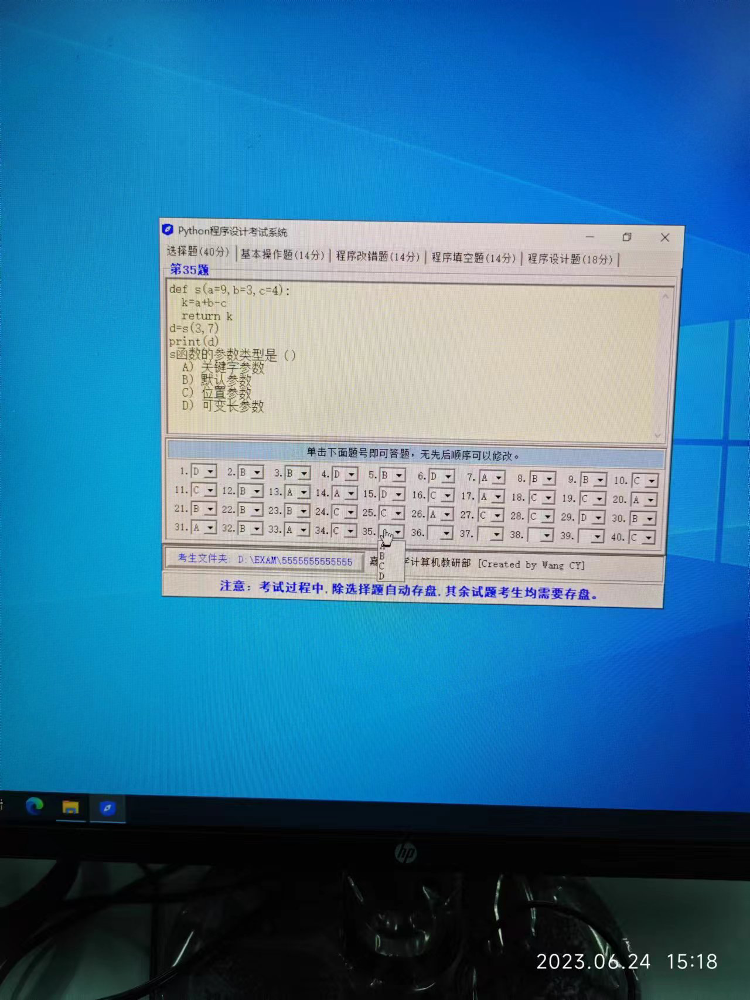
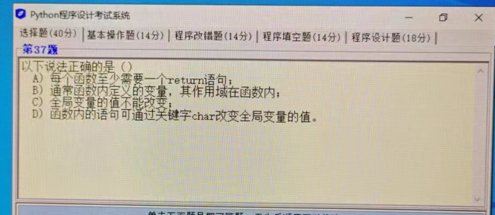

## Question 1



打印一个如下的九九乘法表：

```python
1*1=1
2*1=2    2*2=4
3*1=3    3*2=6    3*3=9
4*1=4    4*2=8    4*3=12    4*4=16
......
9*1=9    9*2=18   9*3=27    9*4=36    9*5=45    9*6=54    9*7=63    9*8=92    9*9=81
```

程序中有两处错误。

```python
for i in range(1, 10):
    for j in range(1, i):
        print("%d*%d=%d" % (i, j, i*j), end="\t")
    print(end="")
```

### Solution 1

这个程序有两个主要的错误：

1. `range(1, i)` 会导致 `j` 的取值从 1 到 `i-1`，这意味着每一行的最后一个乘法运算被忽略了。这个应该改为 `range(1, i+1)`，以便 `j` 可以等于 `i`。

2. `print(end="")` 的意思是打印一个空字符串，然后结束这一行。这会导致每一行的乘法表不会显示在新的一行。应该改为 `print()`，这样就会打印一个换行符，使得每一行的乘法表显示在新的一行。

修改后的程序如下：

```python
for i in range(1, 10):
    for j in range(1, i+1):
        print("%d*%d=%d" % (i, j, i*j), end="\t")
    print()
```

这个程序现在会生成正确的九九乘法表。

**详细注释：**

```python
# 遍历从1到9的数字，包括1和9。这些数字将被用作乘法表的第一个乘数
for i in range(1, 10):
    # 对于每一个i，遍历从1到i的数字，包括1和i。这些数字将被用作乘法表的第二个乘数
    for j in range(1, i+1):
        # 打印出乘法表的每一项。"%d*%d=%d" % (i, j, i*j) 将生成像 "2*2=4" 这样的字符串。
        # 使用 "\t" 作为结束字符，可以在每一项之后添加一个制表符，使输出更整齐
        print("%d*%d=%d" % (i, j, i*j), end="\t")
    # 当一行的所有项都打印完毕后，打印一个换行符，使得每一行的乘法表显示在新的一行
    print()
```


## Question 2

以下哪个字符串方法可以将字符串中的大写字符转换为小写，同时将小写字符转换为大写?

选项:

A. lower()
B. upper()
C. title()
D. swapcase()

在 Python 中，你可以使用 `swapcase()` 这个内置的字符串方法来实现这个功能。这个方法会返回一个新的字符串，其中原始字符串中的所有大写字符都被转换为小写，所有小写字符都被转换为大写。

这是一个例子：

```python
s = "Hello World!"
print(s.swapcase())  # 输出: hELLO wORLD!
```

在这个例子中，所有原始字符串 "Hello World!" 中的大写字符（H 和 W）都被转换为小写（h 和 w），而所有的小写字符（`e, l, l, o, o, r, l, d`）都被转换为大写（`E, L, L, O, O, R, L, D`）。

## Question 3



输入要比较的数字个数 n，然后按提示输入这 n 个数，输出其中的最大值。

例如，

请输入数字的个数：4

输入第 1 个数字：-2

输入第 2 个数字：4

输入第 3 个数字：-3

输入第 3 个数字：-3

最大值是：4

程序有两个空（1）、（2）需要补充完整。

```python
n = int(input("请输入数字的个数:"))
ma = eval(input("请输入第 1 个数字:"))
for i ___(1)___:
    x = eval(input("输入第{}个数字:".format(i + 2)))
    if x > ma:
        ___(2)___:
print("最大值是:", ma)
```


### Solution 3

你需要在空（1）中写入循环范围，从 1 到 `n-1`，因为已经输入了一个数。在空（2）中，你需要更新变量 ma，使其等于新的最大值。所以，完整的程序是：

```python
n = int(input("请输入数字的个数:"))
ma = eval(input("请输入第 1 个数字:"))
for i in range(1, n):
    x = eval(input("输入第{}个数字:".format(i + 1)))
    if x > ma:
        ma = x
print("最大值是:", ma)
```

注意，我将输入提示中的`"输入第{}个数字:".format(i + 2)` 修改为 `"输入第{}个数字:".format(i + 1)`，因为你在循环中的 i 值从 1 开始，加 1 就能得到正确的数字编号。

**详细注释：**

```python
# 首先，使用内置的 int() 函数和 input() 函数获取用户输入的数字数量。
n = int(input("请输入数字的个数:"))

# 然后，使用 eval() 函数和 input() 函数获取用户输入的第一个数字，并将其作为目前的最大值。
ma = eval(input("请输入第 1 个数字:"))

# 使用 for 循环从1到n-1（因为我们已经获取了一个数字）。这个循环将对用户输入的其余数字进行迭代。
for i in range(1, n):
    
    # 在每次循环中，我们使用 eval() 和 input() 函数获取用户输入的下一个数字。
    x = eval(input("输入第{}个数字:".format(i + 1)))
    
    # 我们使用 if 语句检查当前数字是否大于目前的最大值。
    if x > ma:
        
        # 如果当前数字大于最大值，我们更新最大值。
        ma = x

# 最后，我们打印出最大值。
print("最大值是:", ma)
```

## Question 4

```python
str1 = "{:.2%}"
print(str1.format(2.71828))
```

这段代码使用了字符串的格式化功能。让我来逐步解释它的含义：

1. `str1 = "{:.2%}"`：这一行代码创建了一个名为 `str1` 的字符串变量，并将其设置为 "{:.2%}"。这是一个格式化字符串，其中 `{:.2%}` 是一个占位符，用于指定将要插入的值的位置和格式。

2. `print(str1.format(2.71828))`：这一行代码使用 `str1` 的 `format` 方法将值 `2.71828` 插入到 `str1` 中的占位符位置，并打印结果。在这里，`.format(2.71828)` 表示将 `2.71828` 插入到 `str1` 中的占位符位置。

运行这段代码的输出结果将是：
```
271.83%
```

解释输出结果：
- `{:.2%}` 中的 `:` 表示格式化的开始。
- `.` 表示精度控制符的开始。
- `2` 表示保留两位小数。
- `%` 表示百分比符号。

因此，`2.71828` 会被格式化为百分比形式，并且保留两位小数，输出结果为 `271.83%`。

## Question 5



```python
def s(a=9, b=3, c=4):
    k = a + b - c
    return k

d = s(3, 7)
print(d)
```

s 函数的参数类型是（）

A、关键字参数

B、默认参数

C、位置参数

D、可变长参数

函数 s 的参数是 B、默认参数。

这是因为函数 s 在定义时，参数 a、b、c 都被赋予了默认值（`a=9, b=3, c=4`）。

当我们在调用函数时如果不提供这些参数，那么就会使用这些默认值。

例如，在例子中，我们只提供了 a 和 b 的值（`s(3, 7)`），而没有提供 c 的值，所以 c 使用了其默认值 4 。

## Question 6



以下说法正确的是（）

A、每个函数至少需要一个 return 语句；

B、通常函数内定义的变量，其作用域在函数内；

C、全局变量的值不能改变；

D、函数内的语句可通过关键字 char 改变全局变量的值。

---

A、每个函数至少需要一个 return 语句；

这个说法不正确。函数并不一定需要 return 语句。没有 return 语句的函数会执行到函数体末尾然后结束，并返回特定的默认值。例如在 Python 中，一个没有 return 的函数会返回 None。

B、通常函数内定义的变量，其作用域在函数内；

这个说法是正确的。函数内定义的变量，也被称为局部变量，其作用域仅限于该函数内部。也就是说，函数之外无法访问该变量。

C、全局变量的值不能改变；

这个说法不正确。全局变量的值可以在程序的任何地方进行改变。

D、函数内的语句可通过关键字 char 改变全局变量的值。

这个说法不正确。char 是 C 和 C++ 等语言中的字符型变量类型，它并不是用于改变全局变量的关键字。在许多语言中，如 Python，你可以使用 global 关键字来在函数内部改变全局变量的值；在 JavaScript 中，你可以直接引用并改变全局变量。

综上，只有选项B是正确的。

::: details 公众号：AI悦创【二维码】


:::

::: info AI悦创·编程一对一

AI悦创·推出辅导班啦，包括「Python 语言辅导班、C++ 辅导班、java 辅导班、算法/数据结构辅导班、少儿编程、pygame 游戏开发、Web、Linux」，全部都是一对一教学：一对一辅导 + 一对一答疑 + 布置作业 + 项目实践等。当然，还有线下线上摄影课程、Photoshop、Premiere 一对一教学、QQ、微信在线，随时响应！微信：Jiabcdefh

C++ 信息奥赛题解，长期更新！长期招收一对一中小学信息奥赛集训，莆田、厦门地区有机会线下上门，其他地区线上。微信：Jiabcdefh

方法一：[QQ](http://wpa.qq.com/msgrd?v=3&uin=1432803776&site=qq&menu=yes)

方法二：微信：Jiabcdefh

:::


