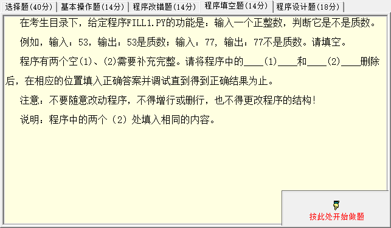
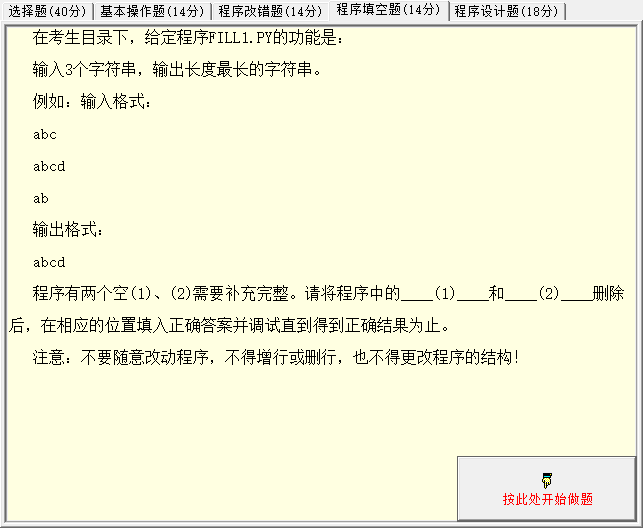
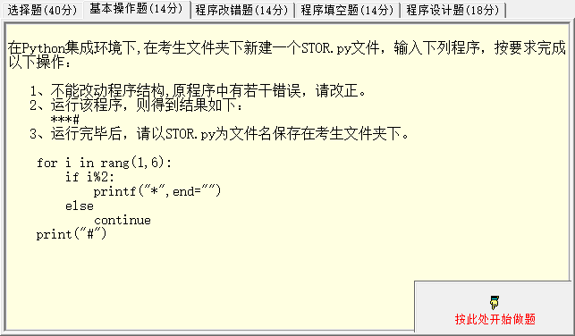

## Question 1



输入一个正整数，判断它是不是质数。

例如，输入：53，输出：53 是质数；

输入：77，输出：77 不是质数。请填空。

程序有两个空（1）、（2）需要补充完整。

```python
print("请输入一个正整数 n>=2:")
int1 = int(input())
flag = True
for i in range(2, int1):
    if int1 __(1)__ i == 0:
        flag = False
        __(2)__
if flag and int1 > 1:
    print(f"{int1}是质数")
else:
    print(f"{int1}不是质数")
```

### Solution 1

为了判断一个数是否为质数，我们需要检查是否有任何小于该数的正整数可以整除它。如果找到这样的数，那么这个数就不是质数。

所以，你需要在空（1）中填入 `%`，这是 Python 中的取余操作符，用来测试 `int1` 是否可以被 `i` 整除。如果 `int1` 取余 `i` 的结果为0，那么 `int1` 可以被 `i` 整除。

对于空（2），我们已经发现 `int1` 可以被小于它的某个数整除，所以我们知道 `int1` 不是质数，无需检查更多的数。这时，我们需要用 `break` 语句来退出循环。

以下是完成后的代码：

```python
print("请输入一个正整数 n>=2:")
int1 = int(input())
flag = True
for i in range(2, int1):
    if int1 % i == 0:
        flag = False
        break
if flag and int1 > 1:
    print(f"{int1}是质数")
else:
    print(f"{int1}不是质数")
```

此代码将提示用户输入一个正整数，然后检查这个数是否是质数，最后输出结果。

## Question 2



输入 3 个字符串，输出长度最长的字符串。

例如：输入格式：

abc

abcd

ab

输出格式：

abcd

程序有两个空（1）、（2）需要补充完整。

```python
s1, s2, s3 = input(), input(), input()
s = max(s1, s2, s3, key=__(1)__)

__(2)__(s)
```

### Solution 2

这是一个 Python 代码片段，需要找到最长的字符串。你可以在`(1)`处使用`len`作为键来比较输入的字符串长度。在`(2)`处，你需要将结果打印出来，因此可以使用 `print` 函数。以下是完整的代码：

```python
s1, s2, s3 = input(), input(), input()
s = max(s1, s2, s3, key=len)

print(s)
```

这段代码首先接收三个字符串作为输入，然后使用`max`函数，参数`key=len`告诉`max`函数使用字符串长度作为比较的依据。最后，使用`print`函数打印最长的字符串。

## Question 3



运行该程序，则得到结果如下：`***#`

```python
for i in rang(1, 6):
    if i % 2:
        printf("*", end="")
    else
        continue
print("#")
```

### Solution 3

看起来你的 Python 代码有几个错误。这是改正后的版本：

```python
for i in range(1, 6):
    if i % 2:
        print("*", end="")
    else:
        continue
print("#")
```

一共有三个错误：

1. `rang` 应改为 `range`。
2. `printf` 应改为 `print`。
3. `else` 后面缺少冒号 `:`。

经过修改的代码会在 1 到 5 的范围内，对每一个奇数打印一个 `*`，然后最后打印 `#`。所以，输出应该是：

```
**#
```

总共有三个字符：两个星号 (`*`) 和一个井号 (`#`)。


::: details 公众号：AI悦创【二维码】


:::

::: info AI悦创·编程一对一

AI悦创·推出辅导班啦，包括「Python 语言辅导班、C++ 辅导班、java 辅导班、算法/数据结构辅导班、少儿编程、pygame 游戏开发、Web、Linux」，全部都是一对一教学：一对一辅导 + 一对一答疑 + 布置作业 + 项目实践等。当然，还有线下线上摄影课程、Photoshop、Premiere 一对一教学、QQ、微信在线，随时响应！微信：Jiabcdefh

C++ 信息奥赛题解，长期更新！长期招收一对一中小学信息奥赛集训，莆田、厦门地区有机会线下上门，其他地区线上。微信：Jiabcdefh

方法一：[QQ](http://wpa.qq.com/msgrd?v=3&uin=1432803776&site=qq&menu=yes)

方法二：微信：Jiabcdefh

:::


