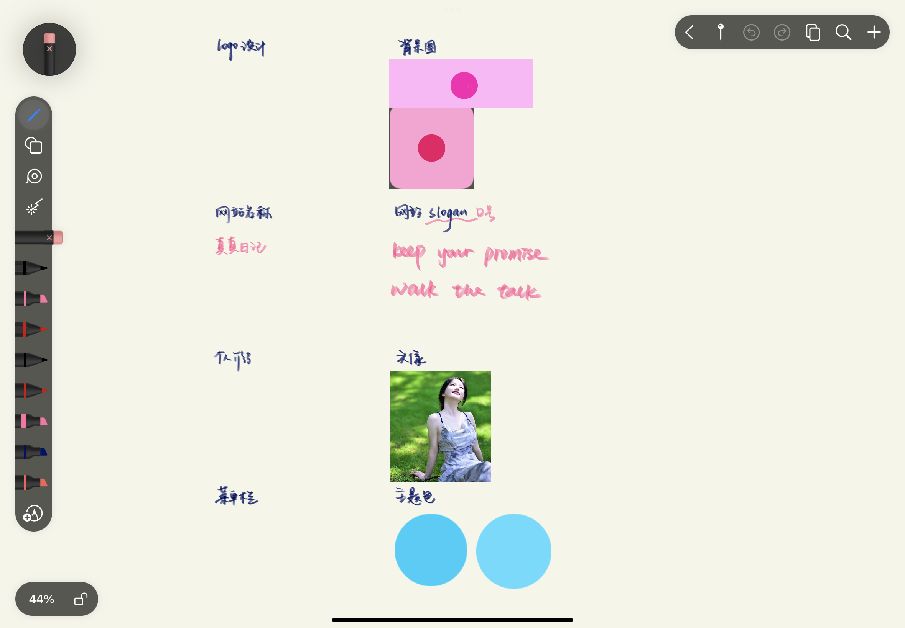
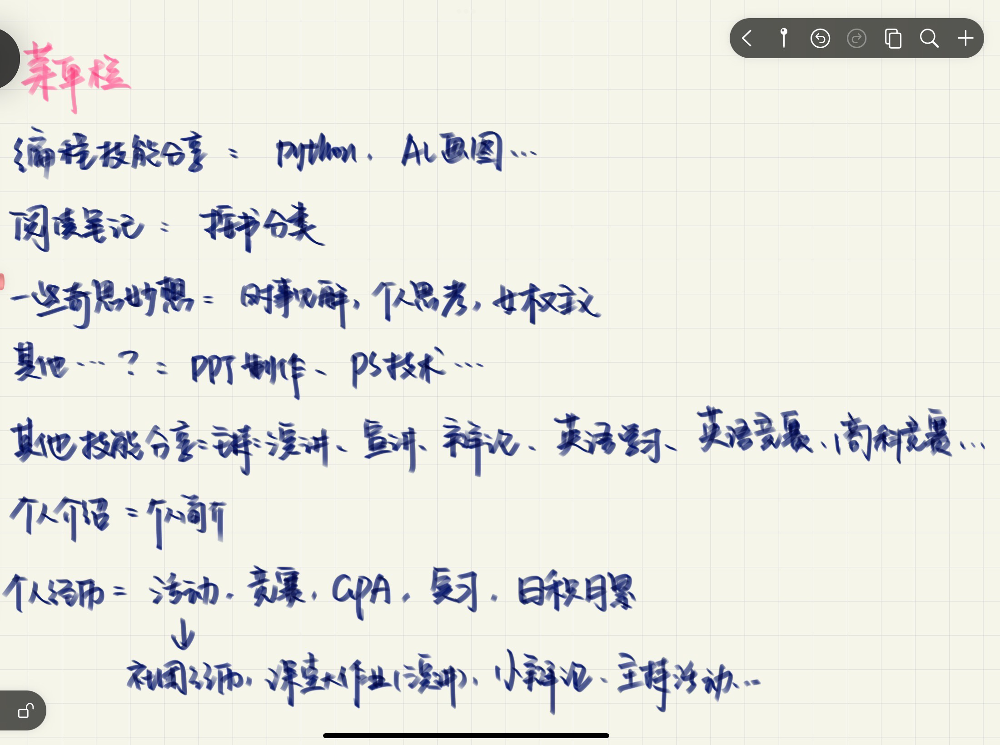
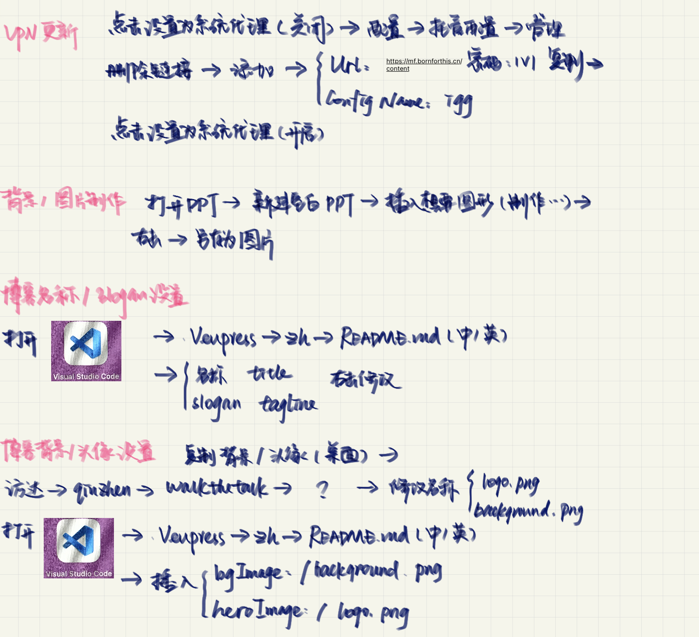
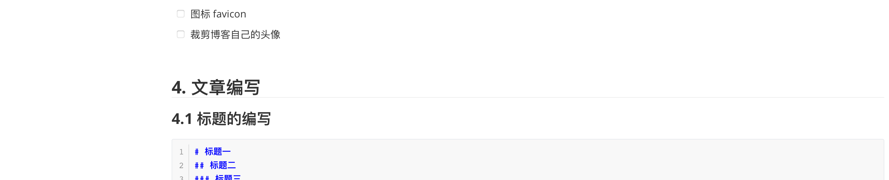

## 1. HomeWork

### 1.1 作业1

- Date：2023年07月18日 16:29
- Details：
    - [x] 域名「阿里云」购买「注：课上拖课完成了」
    - [x] logo 设计
    - [x] banner 背景图
    - [x] 网站名称「2023-07-28 07:58:06」
    - [x] 网站 slogan
    - [x] 个人介绍「中英文」
    - [x] 头像
    - [x] 菜单栏「2023-07-28 07:58:06」

- 完成情况：
    - 域名未及时完成，域名模版没有处理好；
    - 网站名称未想好；
- 建议：提前分配时间完成，完成的越好，未来的成品越好。「2023-07-25 07:00」

::: tip 寄语 1

当你能把你想要的，所希望追求的，能完整的描述下来，表面你对于未来的路线是清晰。本时间充足，🙅不要让自己陷入困境。——2023-07-25 08:36:45

:::

::: details submit hw



:::

### 1.2 作业2

- Date：2023-07-25 08:37:10 
- Deatils：
    - [x] 网站名称（中英文）
    - [ ] 整理笔记📒（包括但不限于：博客名称、slogan、背景、图片制作、VPN 更新等笔记、本地启动）
    - [x] 菜单栏
    - [ ] 社交平台汇总（平台个人主页链接）
    - [ ] 如果背景和 logo 是准备纯色填充，个人建议注意颜色搭配问题；「Option」
- 完成时间：2023-07-28 07:58:06

::: tabs

@tab 网站名称


@tab 菜单栏



@tab 笔记



:::


### 1.3 作业3

- [ ] 整理笔记，写好笔记。笔记是见证成长～
- [ ] 裁剪博客自己的头像；

### 1.4 作业4

- [ ] 图标 favicon
- [ ] 裁剪博客自己的头像


## 4. 文章编写

### 4.1 标题的编写

```markdown
# 标题一
## 标题二
### 标题三
#### 标题四
##### 标题五
###### 标题六
```

### 4.2 图片



### 4.3 代码

数字按键 1 左边的那个按键，按三次，并输入编程语言的类型。然后 Enter。

```markdown
```python
```

08:21:02 [vite] hmr update /@fs/Users/aiyuechuang/WebSite/bornforthis.cn/docs/.vuepress/.temp/pages/1v1/47-qiuzhen/Blog/18-web-log.html.js
08:21:02 [vite] hmr update /@fs/Users/aiyuechuang/WebSite/bornforthis.cn/docs/.vuepress/.temp/pages/1v1/47-qiuzhen/Blog/18-web-log.html.vue
info page 1v1/47-qiuzhen/Blog/18-web-log.md is modified
08:21:25 [vite] hmr update /@fs/Users/aiyuechuang/WebSite/bornforthis.cn/docs/.vuepress/.temp/pages/1v1/47-qiuzhen/Blog/18-web-log.html.js
08:21:25 [vite] hmr update /@fs/Users/aiyuechuang/WebSite/bornforthis.cn/docs/.vuepress/.temp/pages/1v1/47-qiuzhen/Blog/18-web-log.html.vue
info page 1v1/47-qiuzhen/Blog/18-web-log.md is modified
08:21:57 [vite] hmr update /@fs/Users/aiyuechuang/WebSite/bornforthis.cn/docs/.vuepress/.temp/pages/1v1/47-qiuzhen/Blog/18-web-log.html.js
08:21:57 [vite] hmr update /@fs/Users/aiyuechuang/WebSite/bornforthis.cn/docs/.vuepress/.temp/pages/1v1/47-qiuzhen/Blog/18-web-log.html.vue

```
08:21:02 [vite] hmr update /@fs/Users/aiyuechuang/WebSite/bornforthis.cn/docs/.vuepress/.temp/pages/1v1/47-qiuzhen/Blog/18-web-log.html.js
08:21:02 [vite] hmr update /@fs/Users/aiyuechuang/WebSite/bornforthis.cn/docs/.vuepress/.temp/pages/1v1/47-qiuzhen/Blog/18-web-log.html.vue
info page 1v1/47-qiuzhen/Blog/18-web-log.md is modified
08:21:25 [vite] hmr update /@fs/Users/aiyuechuang/WebSite/bornforthis.cn/docs/.vuepress/.temp/pages/1v1/47-qiuzhen/Blog/18-web-log.html.js
08:21:25 [vite] hmr update /@fs/Users/aiyuechuang/WebSite/bornforthis.cn/docs/.vuepress/.temp/pages/1v1/47-qiuzhen/Blog/18-web-log.html.vue
info page 1v1/47-qiuzhen/Blog/18-web-log.md is modified
08:21:57 [vite] hmr update /@fs/Users/aiyuechuang/WebSite/bornforthis.cn/docs/.vuepress/.temp/pages/1v1/47-qiuzhen/Blog/18-web-log.html.js
08:21:57 [vite] hmr update /@fs/Users/aiyuechuang/WebSite/bornforthis.cn/docs/.vuepress/.temp/pages/1v1/47-qiuzhen/Blog/18-web-log.html.vue
```

### 4.4 任务列表

- [x] xxx
- [ ] xxx

```markdown
- [x] xxxx
- [] xxxxx
```

### 4.5 无序列表

- 11
- 111
- 1111
- 11111

```markdown
- 1
- 11
- 111
```

### 4.6 有序列表

1. 我我我
2. 我我我
3. 我我我
4. 我我1我
5. 我我我我w我我

```markdown
1. xsxsxs
2. e3e3erd3d
```

### 4.7 选项卡

```markdown
::: tabs

@tab qiuzhen good nice

Hello,Python is so Good.

@tab TFBOY

Life is short,You need Python.

:::
```

::: tabs#aiyc

@tab qiuzhen good nice#look

Hello,Python is so Good.

@tab TFBOY#TFBOY

Life is short,You need Python.

:::

::: tabs#aiyc

@tab qiuzhen#look

Hello,Python is so Good.

@tab TFBOY#TFBOY

Life is short,You need Python.

:::

### 4.8 代码块分组

````markdown
::: code-tabs

@tab code1
```python
print("Hello Python")
```

@tab code2
```python
print("Hello Python11111")
```
:::
````

::: code-tabs

@tab code1
```python
print("Hello Python")
```

@tab code2
```python
print("Hello Python11111")
```
:::

### 4.9 Chart

::: chart 一个线状图案例

```json
{
  "type": "line",
  "data": {
    "labels": ["一月", "二月", "三月", "四月", "五月", "六月", "七月"],
    "datasets": [
      {
        "label": "我的第一个数据集",
        "data": [65, 59, 80, 81, 56, 55, 40],
        "fill": false,
        "borderColor": "rgb(75, 192, 192)",
        "tension": 0.1
      }
    ]
  }
}
```

:::

::: chart 一个玫瑰图案例

```json
{
  "type": "polarArea",
  "data": {
    "labels": ["红色", "绿色", "黄色", "灰色", "蓝色"],
    "datasets": [
      {
        "label": "我的第一个数据集",
        "data": [11, 16, 7, 3, 14],
        "backgroundColor": [
          "rgb(255, 99, 132)",
          "rgb(75, 192, 192)",
          "rgb(255, 205, 86)",
          "rgb(201, 203, 207)",
          "rgb(54, 162, 235)"
        ]
      }
    ]
  }
}
```

:::

::: center

$\large \frac{x^2}{x + y}$

:::

### 4.10 Card

````markdown
```text
title: Mr.Hope
desc: Where there is light, there is hope
logo: https://mister-hope.com/logo.svg
link: https://mister-hope.com
color: rgba(253, 230, 138, 0.15)
```

```text:json
{
  "title": "Mr.Hope",
  "desc": "Where there is light, there is hope",
  "logo": "https://mister-hope.com/logo.svg",
  "link": "https://mister-hope.com",
  "color": "rgba(253, 230, 138, 0.15)"
}
```

````


```text
title: Mr.Hope
desc: Where there is light, there is hope
logo: /aiyc.svg
link: https://mister-hope.com
color: rgba(253, 230, 138, 0.15)
```

```text
{
  "title": "Mr.Hope",
  "desc": "Where there is light, there is hope",
  "logo": "https://mister-hope.com/logo.svg",
  "link": "https://mister-hope.com",
  "color": "rgba(253, 230, 138, 0.15)"
}
```


<BiliBili bvid="BV18N411h7oV" />

<PDF url="/pdf/keyboard-shortcuts-macos.pdf" />

```markdown
<BiliBili bvid="BV18N411h7oV" />

<PDF url="/pdf/keyboard-shortcuts-macos.pdf" />
```

---

````markdown
::: info

信息容器。

:::

::: note

注释容器。

:::

::: tip

提示容器

:::

::: warning

警告容器

:::

::: caution

危险容器

:::

::: details

详情容器

:::

::: info 自定义标题

一个有 `代码` 和 [链接](#演示) 的信息容器。

```js
const a = 1;
```

:::

::: note 自定义标题

一个有 `代码` 和 [链接](#演示) 的注释容器。

```js
const a = 1;
```

:::

::: tip 自定义标题

一个有 `代码` 和 [链接](#演示) 的提示容器。

```js
const a = 1;
```

:::

::: warning 自定义标题

一个有 `代码` 和 [链接](#演示) 的警告容器。

```js
const a = 1;
```

:::

::: caution 自定义标题

一个有 `代码` 和 [链接](#演示) 的危险容器。

```js
const a = 1;
```

:::

::: details 自定义标题

一个有 `代码` 和 [链接](#演示) 的详情容器。

```js
const a = 1;
```

:::

::: info 自定义信息
:::

::: note 自定义注释
:::

::: tip 自定义提示
:::

::: warning 自定义警告
:::

::: caution 自定义危险
:::
````

::: info 温馨提示🔔

信息容器。我是你的学姐的 qiuzhen 为将会给你带来不一样的学习体验～

:::

::: note

注释容器。

:::

::: tip 我是你的提示

提示容器村上春树采石场

:::

### 4.11 自定义对齐

::: left

左对齐的内容

:::

::: center

居中的内容

:::


::: right

右对齐的内容

:::

::: justify

两端对齐的内容

:::

```markdown
::: left

左对齐的内容

:::

::: center

居中的内容

:::

::: right

右对齐的内容

:::

::: justify

两端对齐的内容

:::
```

### 4.12 插入连接

```markdown
[显示的名称](https://bornforthis.cn/)
```

[显示的名称](https://bornforthis.cn/)

::: details 详细信息🔎

```markdown
chsichishcishcihsichsichj
```


:::


::: details 公众号：AI悦创【二维码】


:::

::: info AI悦创·编程一对一

AI悦创·推出辅导班啦，包括「Python 语言辅导班、C++ 辅导班、java 辅导班、算法/数据结构辅导班、少儿编程、pygame 游戏开发、Web、Linux」，全部都是一对一教学：一对一辅导 + 一对一答疑 + 布置作业 + 项目实践等。当然，还有线下线上摄影课程、Photoshop、Premiere 一对一教学、QQ、微信在线，随时响应！微信：Jiabcdefh

C++ 信息奥赛题解，长期更新！长期招收一对一中小学信息奥赛集训，莆田、厦门地区有机会线下上门，其他地区线上。微信：Jiabcdefh

方法一：[QQ](http://wpa.qq.com/msgrd?v=3&uin=1432803776&site=qq&menu=yes)

方法二：微信：Jiabcdefh

:::


