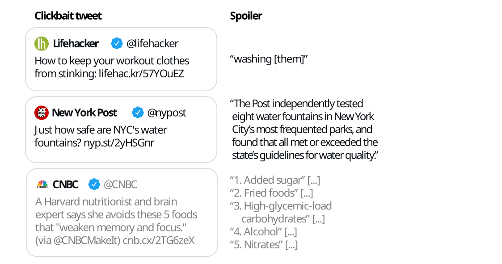
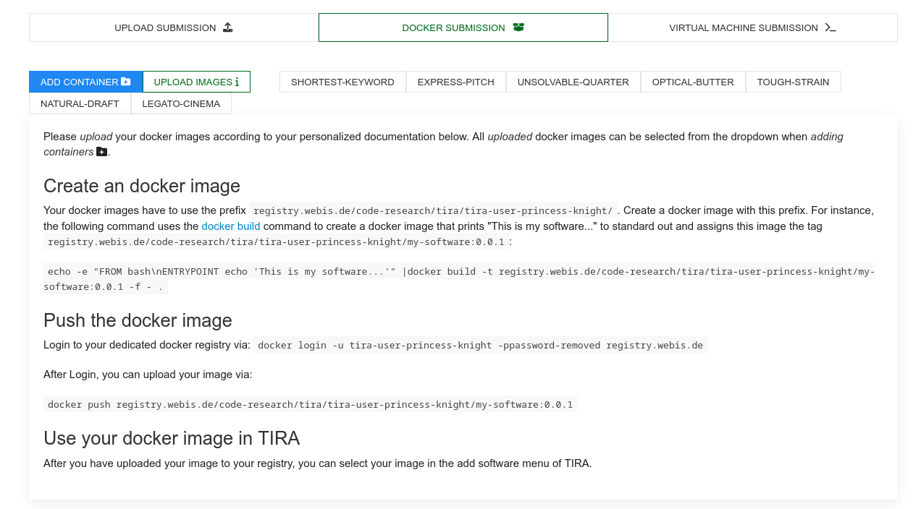
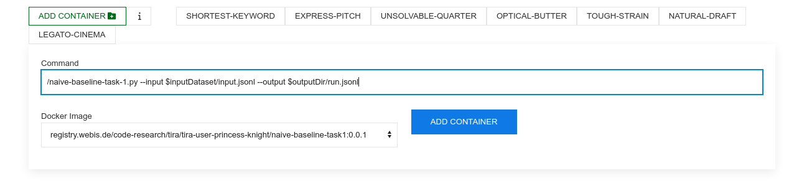
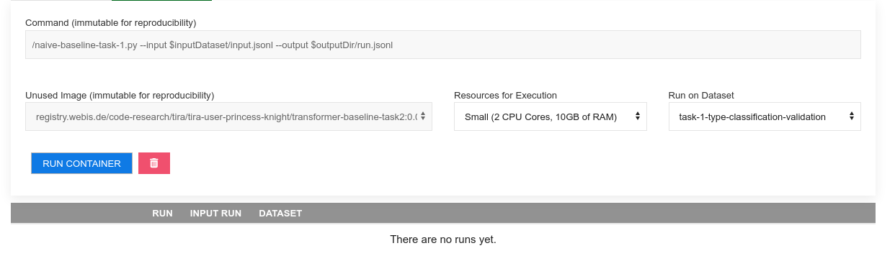
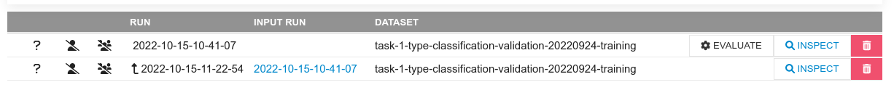

## Synopsis

> 概要

Clickbait posts link to web pages and advertise their content by arousing curiosity instead of providing informative summaries. Clickbait spoiling aims at generating short texts that satisfy the curiosity induced by a clickbait post. We invite you to participate in the Clickbait Challenge 2023 featuring two subtasks.

> 点击诱饵帖子通过引起好奇心而不是提供信息摘要来链接到网页并宣传其内容。点击诱饵破坏旨在生成满足点击诱饵帖子引发的好奇心的短文本。我们邀请您参加2023年的点击诱饵挑战，其中包括两个子任务。

- Communication: [ Mailing list, Organizers] [Twitter]

    > 通讯方式：[邮件列表，组织者] [Twitter]

REGISTRATION CLOSED

> 注册已关闭。

## Task

The following figure illustrates some example inputs and the expected output for clickbait spoiling:

> 下图展示了一些示例输入以及点击诱饵破坏的预期输出：




- Task 1 on Spoiler Type Classification: [The input](https://pan.webis.de/semeval23/pan23-web/clickbait-challenge.html#data) is the clickbait post and the linked document. The task is to classify the spoiler type that the clickbait post warrants (either "phrase", "passage", "multi"). For each input, an output like `{"uuid": "<UUID>", "spoilerType": "<SPOILER-TYPE>"}` has to be generated where `<SPOILER-TYPE>` is either `phrase`, `passage`, or `multi`.

    > 任务1：关于剧透类型分类：输入是点击诱饵帖子和链接的文档。任务是对点击诱饵帖子所引起的剧透类型进行分类（可以是"phrase"、"passage"或"multi"）。对于每个输入，需要生成类似于`{"uuid": "<UUID>", "spoilerType": "<SPOILER-TYPE>"}` 的输出，其中 `<SPOILER-TYPE>` 可以是"phrase"、"passage"或"multi"之一。

- Task 2 on Spoiler Generation: [The input](https://pan.webis.de/semeval23/pan23-web/clickbait-challenge.html#data) is the clickbait post and the linked document (and, optional, the spoiler type if your approach uses this field). The task is to generate the spoiler for the clickbait post. For each input, an output like `{"uuid": "<UUID>", "spoiler": "<SPOILER>"}` has to be generated where `<SPOILER>` is the spoiler for the clickbait post.

    > 任务2：关于剧透生成：[输入](https://pan.webis.de/semeval23/pan23-web/clickbait-challenge.html#data)是点击诱饵帖子和链接的文档（可选，如果您的方法使用此字段，则包括剧透类型）。任务是为点击诱饵帖子生成剧透。对于每个输入，需要生成类似于`{"uuid": "<UUID>", "spoiler": "<SPOILER>"}`的输出，其中`<SPOILER>`是点击诱饵帖子的剧透内容。

## Important Dates

- October 1, 2022: Submission System Opens
- December 1, 2022: Early bird software submission phase (optional)
- January 24, 2023: Submission deadline (extended, was initially January 10).
- February 28, 2023: Participant paper submission (Please use the [paper template](https://github.com/pan-webis-de/pan-code/raw/master/semeval23/latex/semeval23-task5-paper-template.zip) or the [overleaf template](https://www.overleaf.com/latex/templates/semeval23-clickbait-spoiling-system-paper-template/qtqtzwcwddgr) for your submission)
- March 31, 2023: Peer review notification
- April 14, 2023: Camera-ready participant papers submission
- July, 13-14 2023: SemEval Workshop (co-located with ACL-2023 in Toronto, Canada)

> 2022年10月1日：提交系统开放
> 2022年12月1日：早鸟软件提交阶段（可选）
> 2023年1月24日：提交截止日期（延期，最初是1月10日）
> 2023年2月28日：参与者论文提交（请使用论文模板或Overleaf模板进行提交）
> 2023年3月31日：同行评审通知
> 2023年4月14日：最终版本参与者论文提交
> 2023年7月13-14日：SemEval研讨会（与ACL-2023在加拿大多伦多举行）

The timezone of all deadlines is [Anywhere on Earth](https://en.wikipedia.org/wiki/Anywhere_on_Earth).

> 所有截止日期的时区为“地球上的任何地方”（Anywhere on Earth）。

## Data [[download](https://zenodo.org/record/6362726#.YsbdSTVBzrk)]

The dataset contains the clickbait posts and manually cleaned versions of the linked documents, and extracted spoilers for each clickbait post (the dataset was constructed and published in the [corresponding paper](https://webis.de/publications.html?q=clickbait#hagen_2022a)). Additionally, the spoilers are categorized into three types: short phrase spoilers, longer passage spoilers, and multiple non-consecutive pieces of text.

> 该数据集包含点击诱饵帖子和链接文档的手动清理版本，以及每个点击诱饵帖子的提取剧透内容（该数据集是在[相关论文](https://webis.de/publications.html?q=clickbait#hagen_2022a)中构建和发布的）。此外，剧透内容被分为三种类型：短语剧透、较长段落剧透和多个非连续文本片段。

The training and validation data is [available for download on zenodo](https://zenodo.org/record/6362726#.YsbdSTVBzrk). This dataset contains contains 3,200 posts for training (the file training.jsonl) and 800 posts for validation (the file validation.jsonl). After training and validation, systems are [evaluated on 1,000 test posts](https://pan.webis.de/semeval23/pan23-web/clickbait-challenge.html#evaluation).

> 训练和验证数据可以在[zenodo](https://zenodo.org/record/6362726#.YsbdSTVBzrk)上下载。该数据集包含3,200个用于训练的帖子（文件名为training.jsonl）和800个用于验证的帖子（文件名为validation.jsonl）。在训练和验证之后，系统将在[1,000个测试帖子](https://pan.webis.de/semeval23/pan23-web/clickbait-challenge.html#evaluation)上进行评估。

### Input Format

The data comes in JSON Lines format (.jsonl) where each line contains a clickbait post and the manually cleaned version of the linked document. For each line, the goal is to classify the spoiler type needed (task 1), and/or to generate the spoiler (task 2).

> 数据以JSON Lines格式（.jsonl）提供，每行包含一个点击诱饵帖子和链接文档的手动清理版本。对于每一行，目标是对所需的剧透类型进行分类（任务1），和/或生成剧透内容（任务2）。

For each entry in the training and validation dataset, the following fields are available:

> 对于训练和验证数据集中的每个条目，可以使用以下字段:

- `uuid`: The uuid of the dataset entry.
- `postText`: The text of the clickbait post which is to be spoiled.
- `targetParagraphs`: The main content of the linked web page to classify the spoiler type (task 1) and to generate the spoiler (task 2). Consists of the paragraphs of manually extracted main content.
- `targetTitle`: The title of the linked web page to classify the spoiler type (task 1) and to generate the spoiler (task 2).
- `targetUrl`: The URL of the linked web page.
- `humanSpoiler`: The human generated spoiler (abstractive) for the clickbait post from the linked web page. This field is only available in the training and validation dataset (not during test).
- `spoiler`: The human extracted spoiler for the clickbait post from the linked web page. This field is only available in the training and validation dataset (not during test).
- `spoilerPositions`: The position of the human extracted spoiler for the clickbait post from the linked web page. This field is only available in the training and validation dataset (not during test).
- `tags`: The spoiler type (might be "phrase", "passage", or "multi") that is to be classified in task 1 (spoiler type classification). For task 1, this field is only available in the training and validation dataset (not during test). For task 2, this field is always available and can be used.
- Some fields contain additional metainformation about the entry but are unused: `postId`, `postPlatform`, `targetDescription`, `targetKeywords`, `targetMedia`.

The following is a simplified entry in the dataset (line breaks added for readability):

```json
{
  "uuid": "0af11f6b-c889-4520-9372-66ba25cb7657",
  "postText": ["Wes Welker Wanted Dinner With Tom Brady, But Patriots QB Had Better Idea"],
  "targetParagraphs": [
    "It’ll be just like old times this weekend for Tom Brady and Wes Welker.",
    "Welker revealed Friday morning on a Miami radio station that he contacted Brady because he’ll be in town for Sunday’s game between the New England Patriots and Miami Dolphins at Gillette Stadium. It seemed like a perfect opportunity for the two to catch up.",
    "But Brady’s definition of \"catching up\" involves far more than just a meal. In fact, it involves some literal \"catching\" as the Patriots quarterback looks to stay sharp during his four-game Deflategate suspension.",
    "\"I hit him up to do dinner Saturday night. He’s like, ‘I’m going to be flying in from Ann Arbor later (after the Michigan-Colorado football game), but how about that morning we go throw?’ \" Welker said on WQAM, per The Boston Globe. \"And I’m just sitting there, I’m like, ‘I was just thinking about dinner, but yeah, sure. I’ll get over there early and we can throw a little bit.’ \"",
    "Welker was one of Brady’s favorite targets for six seasons from 2007 to 2012. It’s understandable him and Brady want to meet with both being in the same area. But Brady typically is all business during football season. Welker probably should have known what he was getting into when reaching out to his buddy.",
    "\"That’s the only thing we really have planned,\" Welker said of his upcoming workout with Brady. \"It’s just funny. I’m sitting there trying to have dinner. ‘Hey, get your ass up here and let’s go throw.’ I’m like, ‘Aw jeez, man.’ He’s going to have me running like 2-minute drills in his backyard or something.\"",
    "Maybe Brady will put a good word in for Welker down in Foxboro if the former Patriots wide receiver impresses him enough."
  ],
  "targetTitle": "Wes Welker Wanted Dinner With Tom Brady, But Patriots QB Had A Better Idea",
  "targetUrl": "http://nesn.com/2016/09/wes-welker-wanted-dinner-with-tom-brady-but-patriots-qb-had-better-idea/",
  "spoiler": ["how about that morning we go throw?"],
  "spoilerPositions": [[[3, 151], [3, 186]]],
  "tags": ["passage"]
}
```

### Output Format [[validator](https://github.com/pan-webis-de/pan-code/tree/master/semeval23)]

The output format for task 1 and task 2 is identical but other fields are mandatory. Please submit your results in [JSON Lines format](https://jsonlines.org/) producing one output line for each input instance.

Each line should have the following format: `{"uuid": "<UUID>", "spoilerType": "<SPOILER-TYPE>", "spoiler": "<SPOILER>"}`

where:

- `<UUID>`is the uuid of the input instance.
- `<SPOILER-TYPE>` is the spoiler type (might be "phrase", "passage", or "multi") to be predicted in task 1. This field is mandatory for task 1 but optional for task 2 (to indicate that your system used some type of spoiler type classification during the spoiler generation).
- `<SPOILER>` is the generated spoiler to be produced in task 2. This field is mandatory for task 2.

We provide code and example outputs that you can validate your submissions in [this github repository](https://github.com/pan-webis-de/pan-code/tree/master/semeval23).

## Baselines [[Github](https://github.com/pan-webis-de/pan-code/tree/master/semeval23/baselines), [Dockerhub](https://hub.docker.com/r/webis/pan-clickbait-spoiling-baselines)]

We provide some naive and some fine-tuned baselines that are available at [the corresponding git repository](https://github.com/pan-webis-de/pan-code/tree/master/semeval23/baselines). All baselines are [available on Dockerhub](https://hub.docker.com/r/webis/pan-clickbait-spoiling-baselines) to simplify participation.

## Evaluation [[code](https://github.com/pan-webis-de/pan-code/tree/master/semeval23)]

The description of the evaluation and the results are available in the [overview paper](https://webis.de/publications.html?q=clickbait#froebe_2023d).

## Results [[task 1](https://www.tira.io/task-overview/clickbait-spoiling/task-1-type-classification-20221115-test), [task 2](https://www.tira.io/task-overview/clickbait-spoiling/task-2-spoiler-generation-20221115-test)]

The leaderboard in TIRA is available for [task 1](https://www.tira.io/task-overview/clickbait-spoiling/task-1-type-classification-20221115-test) and [task 2](https://www.tira.io/task-overview/clickbait-spoiling/task-2-spoiler-generation-20221115-test) and the commands to reproduce software submissions on your system with Docker. More detailed descriptions of the results are available in the [overview paper](https://webis.de/publications.html?q=clickbait#froebe_2023d).

## Submission

We will accept run file submissions and software submissions via [TIRA](https://tira.io/). Run file submissions will be uploaded to TIRA in the format specified above. For software submissions, you upload docker images to TIRA that will be executed on the test data within the TIRA platform (using a single file as input to produce a single file as output in the format specified above). We recommend software submissions to improve the reproducibility and reusability. Please run your software on the datasets "task-1-type-classification" (for task 1) respectively "task-2-spoiler-generation" (for task 2) in TIRA to produce submissions (you can use the datasets "task-1-type-classification-validation" respectively "task-2-spoiler-generation-validation" to validate your approaches).

## TIRA Quickstart

Participants may upload docker images that are executed within TIRA so that the runs can be reproduced or the software may be applied to different data (of same format) in the future. You can find the access credentials for your dedicated container registry to upload your images under "Docker Submission":



Please follow the instructions there to upload your image. For instance, you can upload [the naive baseline](https://pan.webis.de/semeval23/pan23-web/clickbait-challenge.html#baselines) for task 1 by first tagging the image accordingly, i.e., `docker tag webis/pan-clickbait-spoiling-baselines:task1-naive-0.0.1 registry.webis.de/code-research/tira/YOUR-USER-NAME/YOUR-SOFTWARE-NAME:0.0.1`, then logging in to your dedicated registry, i.e., `docker login -u YOUR-USER-NAME -pTOKEN-PROVIDED-BY-TIRA registry.webis.de` and finally uploading the image by running `docker push registry.webis.de/code-research/tira/YOUR-USER-NAME/YOUR-SOFTWARE-NAME:0.0.1`.

Your software is expected to accept two arguments:

- An input directory (named `$inputDataset` in TIRA). This input directory contains a input.jsonl file that contains the input data.
- An output directory (named `$outputDir` in TIRA). Your software should create its output in `$outputDir/run.jsonl`.


After you have uploaded your image, you can add new softwares that use this image. Each combination of a command and a docker image is a software in TIRA (that can not be changed in retrospect to ensure reproducibility). Add a software by selecting your image and specifying the command that should be executed inside the image (should use the two arguments, for instance, the command for the naive baseline uploaded above is `/naive-baseline-task-1.py --input $inputDataset/input.jsonl --output $outputDir/run.jsonl`):



After adding the docker software, a new tab for this software appears. You can run your software by specifying the compute resources (that your software has available during its execution) and the dataset (the input to the software). Please run your software on the datasets "task-1-type-classification" (for task 1) respectively "task-2-spoiler-generation" (for task 2) in TIRA to produce submissions (you can use the datasets "task-1-type-classification-validation" respectively "task-2-spoiler-generation-validation" to validate your approaches). You can run your software multiple times in parallel so executing your software on different resource specifications enables evaluations on the scalability of the software: 



Once the run of your software completes, you can see the run and its evaluation:




## Related Work / Resources / Invited Talks

- Additional Resources and related work is available in [the forum](https://www.tira.io/t/clickbait-spoiling-additional-resources/883/4)
- We have a call for participation that also contains an overview of such resources. The [slides are available online](https://pan.webis.de/semeval23/pan23-figures/semeval23-clickbait-spoiling-call-for-participation-for-teaching-frame.pdf). We held this presentation at the TU Dresden (18.10.2022, [recording is available](https://www.youtube.com/watch?v=vetw5MJ4U-M)), TH Köln (21.10.2022), Uni Regensburg (26.10.2022), and Uni Leipzig (07.11.2022).


```text
Task 1 on Spoiler Type Classification: The input is the clickbait post and the linked document. The task is to classify the spoiler type that the clickbait post warrants (either "phrase", "passage", "multi"). For each input, an output like {"uuid": "<UUID>", "spoilerType": "<SPOILER-TYPE>"} has to be generated where <SPOILER-TYPE> is either phrase, passage, or multi.
Task 2 on Spoiler Generation: The input is the clickbait post and the linked document (and, optional, the spoiler type if your approach uses this field). The task is to generate the spoiler for the clickbait post. For each input, an output like {"uuid": "<UUID>", "spoiler": "<SPOILER>"} has to be generated where <SPOILER> is the spoiler for the clickbait post.

Data [download]
The dataset contains the clickbait posts and manually cleaned versions of the linked documents, and extracted spoilers for each clickbait post (the dataset was constructed and published in the corresponding paper). Additionally, the spoilers are categorized into three types: short phrase spoilers, longer passage spoilers, and multiple non-consecutive pieces of text.

The training and validation data is available for download on zenodo. This dataset contains contains 3,200 posts for training (the file training.jsonl) and 800 posts for validation (the file validation.jsonl). After training and validation, systems are evaluated on 1,000 test posts.

Input Format
The data comes in JSON Lines format (.jsonl) where each line contains a clickbait post and the manually cleaned version of the linked document. For each line, the goal is to classify the spoiler type needed (task 1), and/or to generate the spoiler (task 2).

For each entry in the training and validation dataset, the following fields are available:

uuid: The uuid of the dataset entry.
postText: The text of the clickbait post which is to be spoiled.
targetParagraphs: The main content of the linked web page to classify the spoiler type (task 1) and to generate the spoiler (task 2). Consists of the paragraphs of manually extracted main content.
targetTitle: The title of the linked web page to classify the spoiler type (task 1) and to generate the spoiler (task 2).
targetUrl: The URL of the linked web page.
humanSpoiler: The human generated spoiler (abstractive) for the clickbait post from the linked web page. This field is only available in the training and validation dataset (not during test).
spoiler: The human extracted spoiler for the clickbait post from the linked web page. This field is only available in the training and validation dataset (not during test).
spoilerPositions: The position of the human extracted spoiler for the clickbait post from the linked web page. This field is only available in the training and validation dataset (not during test).
tags: The spoiler type (might be "phrase", "passage", or "multi") that is to be classified in task 1 (spoiler type classification). For task 1, this field is only available in the training and validation dataset (not during test). For task 2, this field is always available and can be used.
Some fields contain additional metainformation about the entry but are unused: postId, postPlatform, targetDescription, targetKeywords, targetMedia.
The following is a simplified entry in the dataset (line breaks added for readability):

{
  "uuid": "0af11f6b-c889-4520-9372-66ba25cb7657",
  "postText": ["Wes Welker Wanted Dinner With Tom Brady, But Patriots QB Had Better Idea"],
  "targetParagraphs": [
    "It’ll be just like old times this weekend for Tom Brady and Wes Welker.",
    "Welker revealed Friday morning on a Miami radio station that he contacted Brady because he’ll be in town for Sunday’s game between the New England Patriots and Miami Dolphins at Gillette Stadium. It seemed like a perfect opportunity for the two to catch up.",
    "But Brady’s definition of \"catching up\" involves far more than just a meal. In fact, it involves some literal \"catching\" as the Patriots quarterback looks to stay sharp during his four-game Deflategate suspension.",
    "\"I hit him up to do dinner Saturday night. He’s like, ‘I’m going to be flying in from Ann Arbor later (after the Michigan-Colorado football game), but how about that morning we go throw?’ \" Welker said on WQAM, per The Boston Globe. \"And I’m just sitting there, I’m like, ‘I was just thinking about dinner, but yeah, sure. I’ll get over there early and we can throw a little bit.’ \"",
    "Welker was one of Brady’s favorite targets for six seasons from 2007 to 2012. It’s understandable him and Brady want to meet with both being in the same area. But Brady typically is all business during football season. Welker probably should have known what he was getting into when reaching out to his buddy.",
    "\"That’s the only thing we really have planned,\" Welker said of his upcoming workout with Brady. \"It’s just funny. I’m sitting there trying to have dinner. ‘Hey, get your ass up here and let’s go throw.’ I’m like, ‘Aw jeez, man.’ He’s going to have me running like 2-minute drills in his backyard or something.\"",
    "Maybe Brady will put a good word in for Welker down in Foxboro if the former Patriots wide receiver impresses him enough."
  ],
  "targetTitle": "Wes Welker Wanted Dinner With Tom Brady, But Patriots QB Had A Better Idea",
  "targetUrl": "http://nesn.com/2016/09/wes-welker-wanted-dinner-with-tom-brady-but-patriots-qb-had-better-idea/",
  "spoiler": ["how about that morning we go throw?"],
  "spoilerPositions": [[[3, 151], [3, 186]]],
  "tags": ["passage"]
}
Output Format [validator]
The output format for task 1 and task 2 is identical but other fields are mandatory. Please submit your results in JSON Lines format producing one output line for each input instance.

Each line should have the following format: {"uuid": "<UUID>", "spoilerType": "<SPOILER-TYPE>", "spoiler": "<SPOILER>"}

where:

<UUID>is the uuid of the input instance.
<SPOILER-TYPE> is the spoiler type (might be "phrase", "passage", or "multi") to be predicted in task 1. This field is mandatory for task 1 but optional for task 2 (to indicate that your system used some type of spoiler type classification during the spoiler generation).
<SPOILER> is the generated spoiler to be produced in task 2. This field is mandatory for task 2.
We provide code and example outputs that you can validate your submissions in this github repository.
```


```python
我接下来会发题目和我写的代码给你，帮我修改代码以符合题目的全部要求，我自己会执行你给我的代码。
题目：
Task 1 on Spoiler Type Classification: The input is the clickbait post and the linked document. The task is to classify the spoiler type that the clickbait post warrants (either "phrase", "passage", "multi"). For each input, an output like {"uuid": "<UUID>", "spoilerType": "<SPOILER-TYPE>"} has to be generated where <SPOILER-TYPE> is either phrase, passage, or multi.
Task 2 on Spoiler Generation: The input is the clickbait post and the linked document (and, optional, the spoiler type if your approach uses this field). The task is to generate the spoiler for the clickbait post. For each input, an output like {"uuid": "<UUID>", "spoiler": "<SPOILER>"} has to be generated where <SPOILER> is the spoiler for the clickbait post.

Data [download]
The dataset contains the clickbait posts and manually cleaned versions of the linked documents, and extracted spoilers for each clickbait post (the dataset was constructed and published in the corresponding paper). Additionally, the spoilers are categorized into three types: short phrase spoilers, longer passage spoilers, and multiple non-consecutive pieces of text.

The training and validation data is available for download on zenodo. This dataset contains contains 3,200 posts for training (the file training.jsonl) and 800 posts for validation (the file validation.jsonl). After training and validation, systems are evaluated on 1,000 test posts.

Input Format
The data comes in JSON Lines format (.jsonl) where each line contains a clickbait post and the manually cleaned version of the linked document. For each line, the goal is to classify the spoiler type needed (task 1), and/or to generate the spoiler (task 2).

For each entry in the training and validation dataset, the following fields are available:

uuid: The uuid of the dataset entry.
postText: The text of the clickbait post which is to be spoiled.
targetParagraphs: The main content of the linked web page to classify the spoiler type (task 1) and to generate the spoiler (task 2). Consists of the paragraphs of manually extracted main content.
targetTitle: The title of the linked web page to classify the spoiler type (task 1) and to generate the spoiler (task 2).
targetUrl: The URL of the linked web page.
humanSpoiler: The human generated spoiler (abstractive) for the clickbait post from the linked web page. This field is only available in the training and validation dataset (not during test).
spoiler: The human extracted spoiler for the clickbait post from the linked web page. This field is only available in the training and validation dataset (not during test).
spoilerPositions: The position of the human extracted spoiler for the clickbait post from the linked web page. This field is only available in the training and validation dataset (not during test).
tags: The spoiler type (might be "phrase", "passage", or "multi") that is to be classified in task 1 (spoiler type classification). For task 1, this field is only available in the training and validation dataset (not during test). For task 2, this field is always available and can be used.
Some fields contain additional metainformation about the entry but are unused: postId, postPlatform, targetDescription, targetKeywords, targetMedia.
The following is a simplified entry in the dataset (line breaks added for readability):

{
  "uuid": "0af11f6b-c889-4520-9372-66ba25cb7657",
  "postText": ["Wes Welker Wanted Dinner With Tom Brady, But Patriots QB Had Better Idea"],
  "targetParagraphs": [
    "It’ll be just like old times this weekend for Tom Brady and Wes Welker.",
    "Welker revealed Friday morning on a Miami radio station that he contacted Brady because he’ll be in town for Sunday’s game between the New England Patriots and Miami Dolphins at Gillette Stadium. It seemed like a perfect opportunity for the two to catch up.",
    "But Brady’s definition of \"catching up\" involves far more than just a meal. In fact, it involves some literal \"catching\" as the Patriots quarterback looks to stay sharp during his four-game Deflategate suspension.",
    "\"I hit him up to do dinner Saturday night. He’s like, ‘I’m going to be flying in from Ann Arbor later (after the Michigan-Colorado football game), but how about that morning we go throw?’ \" Welker said on WQAM, per The Boston Globe. \"And I’m just sitting there, I’m like, ‘I was just thinking about dinner, but yeah, sure. I’ll get over there early and we can throw a little bit.’ \"",
    "Welker was one of Brady’s favorite targets for six seasons from 2007 to 2012. It’s understandable him and Brady want to meet with both being in the same area. But Brady typically is all business during football season. Welker probably should have known what he was getting into when reaching out to his buddy.",
    "\"That’s the only thing we really have planned,\" Welker said of his upcoming workout with Brady. \"It’s just funny. I’m sitting there trying to have dinner. ‘Hey, get your ass up here and let’s go throw.’ I’m like, ‘Aw jeez, man.’ He’s going to have me running like 2-minute drills in his backyard or something.\"",
    "Maybe Brady will put a good word in for Welker down in Foxboro if the former Patriots wide receiver impresses him enough."
  ],
  "targetTitle": "Wes Welker Wanted Dinner With Tom Brady, But Patriots QB Had A Better Idea",
  "targetUrl": "http://nesn.com/2016/09/wes-welker-wanted-dinner-with-tom-brady-but-patriots-qb-had-better-idea/",
  "spoiler": ["how about that morning we go throw?"],
  "spoilerPositions": [[[3, 151], [3, 186]]],
  "tags": ["passage"]
}
Output Format [validator]
The output format for task 1 and task 2 is identical but other fields are mandatory. Please submit your results in JSON Lines format producing one output line for each input instance.

Each line should have the following format: {"uuid": "<UUID>", "spoilerType": "<SPOILER-TYPE>", "spoiler": "<SPOILER>"}

where:

<UUID>is the uuid of the input instance.
<SPOILER-TYPE> is the spoiler type (might be "phrase", "passage", or "multi") to be predicted in task 1. This field is mandatory for task 1 but optional for task 2 (to indicate that your system used some type of spoiler type classification during the spoiler generation).
<SPOILER> is the generated spoiler to be produced in task 2. This field is mandatory for task 2.
We provide code and example outputs that you can validate your submissions in this github repository.
我现在所拥有的数据文件为：validation.jsonl、train.jsonl，两个文件的结构格式如下：
{"uuid": "0af11f6b-c889-4520-9372-66ba25cb7657", "postId": "532quh", "postText": ["Wes Welker Wanted Dinner With Tom Brady, But Patriots QB Had Better Idea"], "postPlatform": "reddit", "targetParagraphs": ["It’ll be just like old times this weekend for Tom Brady and Wes Welker.", "Welker revealed Friday morning on a Miami radio station that he contacted Brady because he’ll be in town for Sunday’s game between the New England Patriots and Miami Dolphins at Gillette Stadium. It seemed like a perfect opportunity for the two to catch up.", "But Brady’s definition of \"catching up\" involves far more than just a meal. In fact, it involves some literal \"catching\" as the Patriots quarterback looks to stay sharp during his four-game Deflategate suspension.", "\"I hit him up to do dinner Saturday night. He’s like, ‘I’m going to be flying in from Ann Arbor later (after the Michigan-Colorado football game), but how about that morning we go throw?’ \" Welker said on WQAM, per The Boston Globe. \"And I’m just sitting there, I’m like, ‘I was just thinking about dinner, but yeah, sure. I’ll get over there early and we can throw a little bit.’ \"", "Welker was one of Brady’s favorite targets for six seasons from 2007 to 2012. It’s understandable him and Brady want to meet with both being in the same area. But Brady typically is all business during football season. Welker probably should have known what he was getting into when reaching out to his buddy.", "\"That’s the only thing we really have planned,\" Welker said of his upcoming workout with Brady. \"It’s just funny. I’m sitting there trying to have dinner. ‘Hey, get your ass up here and let’s go throw.’ I’m like, ‘Aw jeez, man.’ He’s going to have me running like 2-minute drills in his backyard or something.\"", "Maybe Brady will put a good word in for Welker down in Foxboro if the former Patriots wide receiver impresses him enough."], "targetTitle": "Wes Welker Wanted Dinner With Tom Brady, But Patriots QB Had A Better Idea", "targetDescription": "It'll be just like old times this weekend for Tom Brady and Wes Welker. Welker revealed Friday morning on a Miami radio station that he contacted Brady because he'll be in town for Sunday's game between the New England Patriots and Miami Dolphins at Gillette Stadium.", "targetKeywords": "new england patriots, ricky doyle, top stories,", "targetMedia": ["http://pixel.wp.com/b.gif?v=noscript", "http://b.scorecardresearch.com/p?c1=2&c2=6783782&cv=2.0&cj=1", "http://s.wordpress.com/wp-includes/images/rss.png?m=1354137473h", "https://nesncom.files.wordpress.com/2017/03/paul-worrilow.jpg?w=400", "http://ssl-nesn-com-255369.c-col.com", "http://nesncom.files.wordpress.com/2015/07/yardbarker-fox-sidebar-logo.gif?w=300&h=33", "http://pixel.quantserve.com/pixel/p-0eFueme2jAuMI.gif", "https://s0.wp.com/wp-content/themes/vip/plugins/lazy-load/images/1x1.trans.gif", "https://nesncom.files.wordpress.com/2017/03/brandon-marshall.jpg?w=400", "https://nesncom.files.wordpress.com/2017/03/liverpool-vs-arsenal-2017-live-blog-premier-league-week-27.jpg?w=400", "https://nesncom.files.wordpress.com/2017/03/usatsi_9913527.jpg?w=400", "https://nesncom.files.wordpress.com/2017/03/david-price4.jpg?w=400", "https://nesncom.files.wordpress.com/2017/03/usatsi_9914527.jpg?w=400", "https://nesncom.files.wordpress.com/2017/03/eric-decker.jpg?w=400", "http://nesncom.files.wordpress.com/2015/06/transparent.gif?w=1&h=1", "https://nesncom.files.wordpress.com/2015/09/tom-brady-wes-welker.jpg", "https://nesncom.files.wordpress.com/2017/03/john-ross1.jpg?w=400", "https://d5nxst8fruw4z.cloudfront.net/atrk.gif?account=RPMTh1aUXR00Ug"], "targetUrl": "http://nesn.com/2016/09/wes-welker-wanted-dinner-with-tom-brady-but-patriots-qb-had-better-idea/", "provenance": {"source": "anonymized", "humanSpoiler": "They Threw A Football", "spoilerPublisher": "savedyouaclick"}, "spoiler": ["how about that morning we go throw?"], "spoilerPositions": [[[3, 151], [3, 186]]], "tags": ["passage"]}
大部分数据省略，让你知道这个数据结构是什么样的。
我的代码：
import json
import numpy as np
import pandas as pd
from sklearn.feature_extraction.text import CountVectorizer
from sklearn.naive_bayes import MultinomialNB
from nltk.tokenize import word_tokenize
from nltk.lm import MLE
from nltk.lm.preprocessing import padded_everygram_pipeline


# Define a function to read in the jsonl file
def read_jsonl(input_path):
    data = []
    with open(input_path, 'r', encoding='utf-8') as f:
        for line in f:
            data.append(json.loads(line.rstrip('\n|\r')))
    return data


# Read the train and validation data
train_data = read_jsonl('train.jsonl')
validation_data = read_jsonl('validation.jsonl')

# Convert the data to pandas dataframes
train_df = pd.DataFrame(train_data)
validation_df = pd.DataFrame(validation_data)


# Task 1: Predicting spoiler tags
def train_model_task1(train_df):
    vectorizer = CountVectorizer()
    X_train = vectorizer.fit_transform(train_df['targetParagraphs'].apply(' '.join))
    y_train = train_df['tags']
    model = MultinomialNB()
    model.fit(X_train, y_train)
    return model, vectorizer

def predict_tags_task1(model, vectorizer, text):
    X_test = vectorizer.transform([text])
    predicted_tags = model.predict(X_test)
    return predicted_tags[0]


# Training the model for task 1
model_task1, vectorizer_task1 = train_model_task1(train_df)

# Print a prediction for task1
print(predict_tags_task1(model_task1, vectorizer_task1, ' '.join(validation_df['targetParagraphs'].iloc[0])))


# Task 2: Generating spoilers
def train_model_task2(texts):
    tokenized_text = [list(map(str.lower, word_tokenize(sent))) for sent in texts]
    train_data, padded_sents = padded_everygram_pipeline(3, tokenized_text)
    model = MLE(3) 
    model.fit(train_data, padded_sents)
    return model

def generate_spoiler_task2(model, text, n_words=10):
    tokenized_text = list(map(str.lower, word_tokenize(text)))
    starting_seq = tokenized_text[:2]
    spoiler = model.generate(n_words, text=starting_seq)
    return ' '.join(spoiler)


# Training the model for task 2
texts_task2 = train_df['targetParagraphs'].apply(' '.join).tolist()
model_task2 = train_model_task2(texts_task2)

# Print a generated spoiler for task2
print(generate_spoiler_task2(model_task2, texts_task2[0]))

```


```python
我接下来会发题目，给我直接实现代码，不要任何省略。你也不用解释，除非我让你解释。我自己会执行你给我的代码。
题目：
Task 1 on Spoiler Type Classification: The input is the clickbait post and the linked document. The task is to classify the spoiler type that the clickbait post warrants (either "phrase", "passage", "multi"). For each input, an output like {"uuid": "<UUID>", "spoilerType": "<SPOILER-TYPE>"} has to be generated where <SPOILER-TYPE> is either phrase, passage, or multi.
Task 2 on Spoiler Generation: The input is the clickbait post and the linked document (and, optional, the spoiler type if your approach uses this field). The task is to generate the spoiler for the clickbait post. For each input, an output like {"uuid": "<UUID>", "spoiler": "<SPOILER>"} has to be generated where <SPOILER> is the spoiler for the clickbait post.

Data [download]
The dataset contains the clickbait posts and manually cleaned versions of the linked documents, and extracted spoilers for each clickbait post (the dataset was constructed and published in the corresponding paper). Additionally, the spoilers are categorized into three types: short phrase spoilers, longer passage spoilers, and multiple non-consecutive pieces of text.

The training and validation data is available for download on zenodo. This dataset contains contains 3,200 posts for training (the file training.jsonl) and 800 posts for validation (the file validation.jsonl). After training and validation, systems are evaluated on 1,000 test posts.

Input Format
The data comes in JSON Lines format (.jsonl) where each line contains a clickbait post and the manually cleaned version of the linked document. For each line, the goal is to classify the spoiler type needed (task 1), and/or to generate the spoiler (task 2).

For each entry in the training and validation dataset, the following fields are available:

uuid: The uuid of the dataset entry.
postText: The text of the clickbait post which is to be spoiled.
targetParagraphs: The main content of the linked web page to classify the spoiler type (task 1) and to generate the spoiler (task 2). Consists of the paragraphs of manually extracted main content.
targetTitle: The title of the linked web page to classify the spoiler type (task 1) and to generate the spoiler (task 2).
targetUrl: The URL of the linked web page.
humanSpoiler: The human generated spoiler (abstractive) for the clickbait post from the linked web page. This field is only available in the training and validation dataset (not during test).
spoiler: The human extracted spoiler for the clickbait post from the linked web page. This field is only available in the training and validation dataset (not during test).
spoilerPositions: The position of the human extracted spoiler for the clickbait post from the linked web page. This field is only available in the training and validation dataset (not during test).
tags: The spoiler type (might be "phrase", "passage", or "multi") that is to be classified in task 1 (spoiler type classification). For task 1, this field is only available in the training and validation dataset (not during test). For task 2, this field is always available and can be used.
Some fields contain additional metainformation about the entry but are unused: postId, postPlatform, targetDescription, targetKeywords, targetMedia.
The following is a simplified entry in the dataset (line breaks added for readability):

{
  "uuid": "0af11f6b-c889-4520-9372-66ba25cb7657",
  "postText": ["Wes Welker Wanted Dinner With Tom Brady, But Patriots QB Had Better Idea"],
  "targetParagraphs": [
    "It’ll be just like old times this weekend for Tom Brady and Wes Welker.",
    "Welker revealed Friday morning on a Miami radio station that he contacted Brady because he’ll be in town for Sunday’s game between the New England Patriots and Miami Dolphins at Gillette Stadium. It seemed like a perfect opportunity for the two to catch up.",
    "But Brady’s definition of \"catching up\" involves far more than just a meal. In fact, it involves some literal \"catching\" as the Patriots quarterback looks to stay sharp during his four-game Deflategate suspension.",
    "\"I hit him up to do dinner Saturday night. He’s like, ‘I’m going to be flying in from Ann Arbor later (after the Michigan-Colorado football game), but how about that morning we go throw?’ \" Welker said on WQAM, per The Boston Globe. \"And I’m just sitting there, I’m like, ‘I was just thinking about dinner, but yeah, sure. I’ll get over there early and we can throw a little bit.’ \"",
    "Welker was one of Brady’s favorite targets for six seasons from 2007 to 2012. It’s understandable him and Brady want to meet with both being in the same area. But Brady typically is all business during football season. Welker probably should have known what he was getting into when reaching out to his buddy.",
    "\"That’s the only thing we really have planned,\" Welker said of his upcoming workout with Brady. \"It’s just funny. I’m sitting there trying to have dinner. ‘Hey, get your ass up here and let’s go throw.’ I’m like, ‘Aw jeez, man.’ He’s going to have me running like 2-minute drills in his backyard or something.\"",
    "Maybe Brady will put a good word in for Welker down in Foxboro if the former Patriots wide receiver impresses him enough."
  ],
  "targetTitle": "Wes Welker Wanted Dinner With Tom Brady, But Patriots QB Had A Better Idea",
  "targetUrl": "http://nesn.com/2016/09/wes-welker-wanted-dinner-with-tom-brady-but-patriots-qb-had-better-idea/",
  "spoiler": ["how about that morning we go throw?"],
  "spoilerPositions": [[[3, 151], [3, 186]]],
  "tags": ["passage"]
}
Output Format [validator]
The output format for task 1 and task 2 is identical but other fields are mandatory. Please submit your results in JSON Lines format producing one output line for each input instance.

Each line should have the following format: {"uuid": "<UUID>", "spoilerType": "<SPOILER-TYPE>", "spoiler": "<SPOILER>"}

where:

<UUID>is the uuid of the input instance.
<SPOILER-TYPE> is the spoiler type (might be "phrase", "passage", or "multi") to be predicted in task 1. This field is mandatory for task 1 but optional for task 2 (to indicate that your system used some type of spoiler type classification during the spoiler generation).
<SPOILER> is the generated spoiler to be produced in task 2. This field is mandatory for task 2.
We provide code and example outputs that you can validate your submissions in this github repository.
我现在所拥有的数据文件为：validation.jsonl、train.jsonl，两个文件的结构格式如下：
{"uuid": "0af11f6b-c889-4520-9372-66ba25cb7657", "postId": "532quh", "postText": ["Wes Welker Wanted Dinner With Tom Brady, But Patriots QB Had Better Idea"], "postPlatform": "reddit", "targetParagraphs": ["It’ll be just like old times this weekend for Tom Brady and Wes Welker.", "Welker revealed Friday morning on a Miami radio station that he contacted Brady because he’ll be in town for Sunday’s game between the New England Patriots and Miami Dolphins at Gillette Stadium. It seemed like a perfect opportunity for the two to catch up.", "But Brady’s definition of \"catching up\" involves far more than just a meal. In fact, it involves some literal \"catching\" as the Patriots quarterback looks to stay sharp during his four-game Deflategate suspension.", "\"I hit him up to do dinner Saturday night. He’s like, ‘I’m going to be flying in from Ann Arbor later (after the Michigan-Colorado football game), but how about that morning we go throw?’ \" Welker said on WQAM, per The Boston Globe. \"And I’m just sitting there, I’m like, ‘I was just thinking about dinner, but yeah, sure. I’ll get over there early and we can throw a little bit.’ \"", "Welker was one of Brady’s favorite targets for six seasons from 2007 to 2012. It’s understandable him and Brady want to meet with both being in the same area. But Brady typically is all business during football season. Welker probably should have known what he was getting into when reaching out to his buddy.", "\"That’s the only thing we really have planned,\" Welker said of his upcoming workout with Brady. \"It’s just funny. I’m sitting there trying to have dinner. ‘Hey, get your ass up here and let’s go throw.’ I’m like, ‘Aw jeez, man.’ He’s going to have me running like 2-minute drills in his backyard or something.\"", "Maybe Brady will put a good word in for Welker down in Foxboro if the former Patriots wide receiver impresses him enough."], "targetTitle": "Wes Welker Wanted Dinner With Tom Brady, But Patriots QB Had A Better Idea", "targetDescription": "It'll be just like old times this weekend for Tom Brady and Wes Welker. Welker revealed Friday morning on a Miami radio station that he contacted Brady because he'll be in town for Sunday's game between the New England Patriots and Miami Dolphins at Gillette Stadium.", "targetKeywords": "new england patriots, ricky doyle, top stories,", "targetMedia": ["http://pixel.wp.com/b.gif?v=noscript", "http://b.scorecardresearch.com/p?c1=2&c2=6783782&cv=2.0&cj=1", "http://s.wordpress.com/wp-includes/images/rss.png?m=1354137473h", "https://nesncom.files.wordpress.com/2017/03/paul-worrilow.jpg?w=400", "http://ssl-nesn-com-255369.c-col.com", "http://nesncom.files.wordpress.com/2015/07/yardbarker-fox-sidebar-logo.gif?w=300&h=33", "http://pixel.quantserve.com/pixel/p-0eFueme2jAuMI.gif", "https://s0.wp.com/wp-content/themes/vip/plugins/lazy-load/images/1x1.trans.gif", "https://nesncom.files.wordpress.com/2017/03/brandon-marshall.jpg?w=400", "https://nesncom.files.wordpress.com/2017/03/liverpool-vs-arsenal-2017-live-blog-premier-league-week-27.jpg?w=400", "https://nesncom.files.wordpress.com/2017/03/usatsi_9913527.jpg?w=400", "https://nesncom.files.wordpress.com/2017/03/david-price4.jpg?w=400", "https://nesncom.files.wordpress.com/2017/03/usatsi_9914527.jpg?w=400", "https://nesncom.files.wordpress.com/2017/03/eric-decker.jpg?w=400", "http://nesncom.files.wordpress.com/2015/06/transparent.gif?w=1&h=1", "https://nesncom.files.wordpress.com/2015/09/tom-brady-wes-welker.jpg", "https://nesncom.files.wordpress.com/2017/03/john-ross1.jpg?w=400", "https://d5nxst8fruw4z.cloudfront.net/atrk.gif?account=RPMTh1aUXR00Ug"], "targetUrl": "http://nesn.com/2016/09/wes-welker-wanted-dinner-with-tom-brady-but-patriots-qb-had-better-idea/", "provenance": {"source": "anonymized", "humanSpoiler": "They Threw A Football", "spoilerPublisher": "savedyouaclick"}, "spoiler": ["how about that morning we go throw?"], "spoilerPositions": [[[3, 151], [3, 186]]], "tags": ["passage"]}
大部分数据省略，让你知道这个数据结构是什么样的。

```


```
我接下来会发题目和我的代码，帮我看看是否符合题目全部任务。
题目：
Task 1 on Spoiler Type Classification: The input is the clickbait post and the linked document. The task is to classify the spoiler type that the clickbait post warrants (either "phrase", "passage", "multi"). For each input, an output like {"uuid": "<UUID>", "spoilerType": "<SPOILER-TYPE>"} has to be generated where <SPOILER-TYPE> is either phrase, passage, or multi.
Task 2 on Spoiler Generation: The input is the clickbait post and the linked document (and, optional, the spoiler type if your approach uses this field). The task is to generate the spoiler for the clickbait post. For each input, an output like {"uuid": "<UUID>", "spoiler": "<SPOILER>"} has to be generated where <SPOILER> is the spoiler for the clickbait post.

Data [download]
The dataset contains the clickbait posts and manually cleaned versions of the linked documents, and extracted spoilers for each clickbait post (the dataset was constructed and published in the corresponding paper). Additionally, the spoilers are categorized into three types: short phrase spoilers, longer passage spoilers, and multiple non-consecutive pieces of text.

The training and validation data is available for download on zenodo. This dataset contains contains 3,200 posts for training (the file training.jsonl) and 800 posts for validation (the file validation.jsonl). After training and validation, systems are evaluated on 1,000 test posts.

Input Format
The data comes in JSON Lines format (.jsonl) where each line contains a clickbait post and the manually cleaned version of the linked document. For each line, the goal is to classify the spoiler type needed (task 1), and/or to generate the spoiler (task 2).

For each entry in the training and validation dataset, the following fields are available:

uuid: The uuid of the dataset entry.
postText: The text of the clickbait post which is to be spoiled.
targetParagraphs: The main content of the linked web page to classify the spoiler type (task 1) and to generate the spoiler (task 2). Consists of the paragraphs of manually extracted main content.
targetTitle: The title of the linked web page to classify the spoiler type (task 1) and to generate the spoiler (task 2).
targetUrl: The URL of the linked web page.
humanSpoiler: The human generated spoiler (abstractive) for the clickbait post from the linked web page. This field is only available in the training and validation dataset (not during test).
spoiler: The human extracted spoiler for the clickbait post from the linked web page. This field is only available in the training and validation dataset (not during test).
spoilerPositions: The position of the human extracted spoiler for the clickbait post from the linked web page. This field is only available in the training and validation dataset (not during test).
tags: The spoiler type (might be "phrase", "passage", or "multi") that is to be classified in task 1 (spoiler type classification). For task 1, this field is only available in the training and validation dataset (not during test). For task 2, this field is always available and can be used.
Some fields contain additional metainformation about the entry but are unused: postId, postPlatform, targetDescription, targetKeywords, targetMedia.
The following is a simplified entry in the dataset (line breaks added for readability):

{
  "uuid": "0af11f6b-c889-4520-9372-66ba25cb7657",
  "postText": ["Wes Welker Wanted Dinner With Tom Brady, But Patriots QB Had Better Idea"],
  "targetParagraphs": [
    "It’ll be just like old times this weekend for Tom Brady and Wes Welker.",
    "Welker revealed Friday morning on a Miami radio station that he contacted Brady because he’ll be in town for Sunday’s game between the New England Patriots and Miami Dolphins at Gillette Stadium. It seemed like a perfect opportunity for the two to catch up.",
    "But Brady’s definition of \"catching up\" involves far more than just a meal. In fact, it involves some literal \"catching\" as the Patriots quarterback looks to stay sharp during his four-game Deflategate suspension.",
    "\"I hit him up to do dinner Saturday night. He’s like, ‘I’m going to be flying in from Ann Arbor later (after the Michigan-Colorado football game), but how about that morning we go throw?’ \" Welker said on WQAM, per The Boston Globe. \"And I’m just sitting there, I’m like, ‘I was just thinking about dinner, but yeah, sure. I’ll get over there early and we can throw a little bit.’ \"",
    "Welker was one of Brady’s favorite targets for six seasons from 2007 to 2012. It’s understandable him and Brady want to meet with both being in the same area. But Brady typically is all business during football season. Welker probably should have known what he was getting into when reaching out to his buddy.",
    "\"That’s the only thing we really have planned,\" Welker said of his upcoming workout with Brady. \"It’s just funny. I’m sitting there trying to have dinner. ‘Hey, get your ass up here and let’s go throw.’ I’m like, ‘Aw jeez, man.’ He’s going to have me running like 2-minute drills in his backyard or something.\"",
    "Maybe Brady will put a good word in for Welker down in Foxboro if the former Patriots wide receiver impresses him enough."
  ],
  "targetTitle": "Wes Welker Wanted Dinner With Tom Brady, But Patriots QB Had A Better Idea",
  "targetUrl": "http://nesn.com/2016/09/wes-welker-wanted-dinner-with-tom-brady-but-patriots-qb-had-better-idea/",
  "spoiler": ["how about that morning we go throw?"],
  "spoilerPositions": [[[3, 151], [3, 186]]],
  "tags": ["passage"]
}
Output Format [validator]
The output format for task 1 and task 2 is identical but other fields are mandatory. Please submit your results in JSON Lines format producing one output line for each input instance.

Each line should have the following format: {"uuid": "<UUID>", "spoilerType": "<SPOILER-TYPE>", "spoiler": "<SPOILER>"}

where:

<UUID>is the uuid of the input instance.
<SPOILER-TYPE> is the spoiler type (might be "phrase", "passage", or "multi") to be predicted in task 1. This field is mandatory for task 1 but optional for task 2 (to indicate that your system used some type of spoiler type classification during the spoiler generation).
<SPOILER> is the generated spoiler to be produced in task 2. This field is mandatory for task 2.
We provide code and example outputs that you can validate your submissions in this github repository.
我现在所拥有的数据文件为：validation.jsonl、train.jsonl，两个文件的结构格式如下：
{"uuid": "0af11f6b-c889-4520-9372-66ba25cb7657", "postId": "532quh", "postText": ["Wes Welker Wanted Dinner With Tom Brady, But Patriots QB Had Better Idea"], "postPlatform": "reddit", "targetParagraphs": ["It’ll be just like old times this weekend for Tom Brady and Wes Welker.", "Welker revealed Friday morning on a Miami radio station that he contacted Brady because he’ll be in town for Sunday’s game between the New England Patriots and Miami Dolphins at Gillette Stadium. It seemed like a perfect opportunity for the two to catch up.", "But Brady’s definition of \"catching up\" involves far more than just a meal. In fact, it involves some literal \"catching\" as the Patriots quarterback looks to stay sharp during his four-game Deflategate suspension.", "\"I hit him up to do dinner Saturday night. He’s like, ‘I’m going to be flying in from Ann Arbor later (after the Michigan-Colorado football game), but how about that morning we go throw?’ \" Welker said on WQAM, per The Boston Globe. \"And I’m just sitting there, I’m like, ‘I was just thinking about dinner, but yeah, sure. I’ll get over there early and we can throw a little bit.’ \"", "Welker was one of Brady’s favorite targets for six seasons from 2007 to 2012. It’s understandable him and Brady want to meet with both being in the same area. But Brady typically is all business during football season. Welker probably should have known what he was getting into when reaching out to his buddy.", "\"That’s the only thing we really have planned,\" Welker said of his upcoming workout with Brady. \"It’s just funny. I’m sitting there trying to have dinner. ‘Hey, get your ass up here and let’s go throw.’ I’m like, ‘Aw jeez, man.’ He’s going to have me running like 2-minute drills in his backyard or something.\"", "Maybe Brady will put a good word in for Welker down in Foxboro if the former Patriots wide receiver impresses him enough."], "targetTitle": "Wes Welker Wanted Dinner With Tom Brady, But Patriots QB Had A Better Idea", "targetDescription": "It'll be just like old times this weekend for Tom Brady and Wes Welker. Welker revealed Friday morning on a Miami radio station that he contacted Brady because he'll be in town for Sunday's game between the New England Patriots and Miami Dolphins at Gillette Stadium.", "targetKeywords": "new england patriots, ricky doyle, top stories,", "targetMedia": ["http://pixel.wp.com/b.gif?v=noscript", "http://b.scorecardresearch.com/p?c1=2&c2=6783782&cv=2.0&cj=1", "http://s.wordpress.com/wp-includes/images/rss.png?m=1354137473h", "https://nesncom.files.wordpress.com/2017/03/paul-worrilow.jpg?w=400", "http://ssl-nesn-com-255369.c-col.com", "http://nesncom.files.wordpress.com/2015/07/yardbarker-fox-sidebar-logo.gif?w=300&h=33", "http://pixel.quantserve.com/pixel/p-0eFueme2jAuMI.gif", "https://s0.wp.com/wp-content/themes/vip/plugins/lazy-load/images/1x1.trans.gif", "https://nesncom.files.wordpress.com/2017/03/brandon-marshall.jpg?w=400", "https://nesncom.files.wordpress.com/2017/03/liverpool-vs-arsenal-2017-live-blog-premier-league-week-27.jpg?w=400", "https://nesncom.files.wordpress.com/2017/03/usatsi_9913527.jpg?w=400", "https://nesncom.files.wordpress.com/2017/03/david-price4.jpg?w=400", "https://nesncom.files.wordpress.com/2017/03/usatsi_9914527.jpg?w=400", "https://nesncom.files.wordpress.com/2017/03/eric-decker.jpg?w=400", "http://nesncom.files.wordpress.com/2015/06/transparent.gif?w=1&h=1", "https://nesncom.files.wordpress.com/2015/09/tom-brady-wes-welker.jpg", "https://nesncom.files.wordpress.com/2017/03/john-ross1.jpg?w=400", "https://d5nxst8fruw4z.cloudfront.net/atrk.gif?account=RPMTh1aUXR00Ug"], "targetUrl": "http://nesn.com/2016/09/wes-welker-wanted-dinner-with-tom-brady-but-patriots-qb-had-better-idea/", "provenance": {"source": "anonymized", "humanSpoiler": "They Threw A Football", "spoilerPublisher": "savedyouaclick"}, "spoiler": ["how about that morning we go throw?"], "spoilerPositions": [[[3, 151], [3, 186]]], "tags": ["passage"]}
大部分数据省略，让你知道这个数据结构是什么样的。
我的代码如下：
import json
import torch
from torch.utils.data import Dataset, DataLoader
from transformers import BertForSequenceClassification, BertTokenizer, BertForMaskedLM, AdamW


class SpoilerDataset(Dataset):
    def __init__(self, file, tokenizer, max_length):
        self.tokenizer = tokenizer
        self.max_length = max_length
        self.posts = []
        self.labels = []
        self.spoilers = []
        with open(file, 'r', encoding='utf-8') as f:
            for line in f:
                data = json.loads(line)
                self.posts.append(data['postText'][0] + " [SEP] " + " ".join(data['targetParagraphs']))
                if 'tags' in data:
                    if data['tags'][0] == 'phrase':
                        self.labels.append(0)
                    elif data['tags'][0] == 'passage':
                        self.labels.append(1)
                    else:
                        self.labels.append(2)
                if 'spoiler' in data:
                    self.spoilers.append(data['spoiler'][0])

    def __len__(self):
        return len(self.posts)

    def __getitem__(self, idx):
        encodings = self.tokenizer(self.posts[idx], truncation=True, padding='max_length', max_length=self.max_length,
                                   return_tensors='pt')
        item = {key: torch.squeeze(val) for key, val in encodings.items()}
        if self.labels:
            item['labels'] = self.labels[idx]
        if self.spoilers:
            item['spoilers'] = self.spoilers[idx]
        return item


def train(model, dataloader, optimizer, device):
    model.train()
    total_loss = 0
    for batch in dataloader:
        inputs = {key: val.to(device) for key, val in batch.items() if key != 'spoilers'}
        outputs = model(**inputs)
        loss = outputs.loss
        loss.backward()
        optimizer.step()
        optimizer.zero_grad()
        total_loss += loss.item()
    return total_loss / len(dataloader)


def evaluate(model, dataloader, device):
    model.eval()
    total_loss = 0
    with torch.no_grad():
        for batch in dataloader:
            inputs = {key: val.to(device) for key, val in batch.items() if key != 'spoilers'}
            outputs = model(**inputs)
            loss = outputs.loss
            total_loss += loss.item()
    return total_loss / len(dataloader)


device = torch.device('cuda') if torch.cuda.is_available() else torch.device('cpu')
tokenizer = BertTokenizer.from_pretrained('bert-base-uncased')
train_dataset = SpoilerDataset('data/train.jsonl', tokenizer, 512)
val_dataset = SpoilerDataset('data/validation.jsonl', tokenizer, 512)
train_dataloader = DataLoader(train_dataset, batch_size=8, shuffle=True)
val_dataloader = DataLoader(val_dataset, batch_size=8, shuffle=False)
model = BertForSequenceClassification.from_pretrained('bert-base-uncased', num_labels=3).to(device)
optimizer = AdamW(model.parameters(), lr=1e-5)

for epoch in range(3):
    train_loss = train(model, train_dataloader, optimizer, device)
    val_loss = evaluate(model, val_dataloader, device)
    print(f'Epoch: {epoch + 1}, Train loss: {train_loss}, Val loss: {val_loss}')

model.save_pretrained('./model')
```


::: details 公众号：AI悦创【二维码】


:::

::: info AI悦创·编程一对一

AI悦创·推出辅导班啦，包括「Python 语言辅导班、C++ 辅导班、java 辅导班、算法/数据结构辅导班、少儿编程、pygame 游戏开发、Web、Linux」，全部都是一对一教学：一对一辅导 + 一对一答疑 + 布置作业 + 项目实践等。当然，还有线下线上摄影课程、Photoshop、Premiere 一对一教学、QQ、微信在线，随时响应！微信：Jiabcdefh

C++ 信息奥赛题解，长期更新！长期招收一对一中小学信息奥赛集训，莆田、厦门地区有机会线下上门，其他地区线上。微信：Jiabcdefh

方法一：[QQ](http://wpa.qq.com/msgrd?v=3&uin=1432803776&site=qq&menu=yes)

方法二：微信：Jiabcdefh

:::


