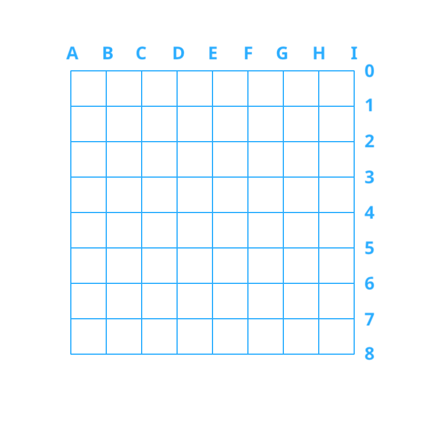
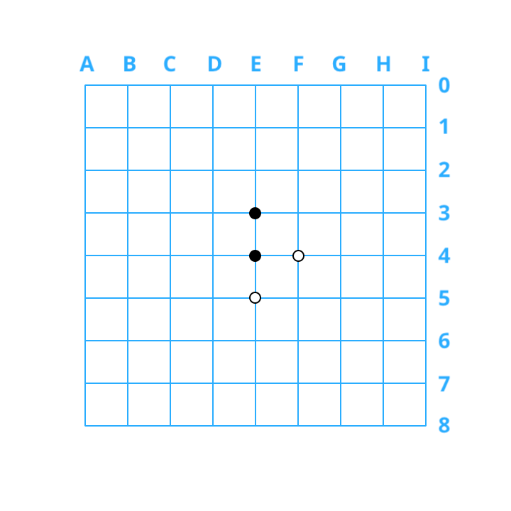
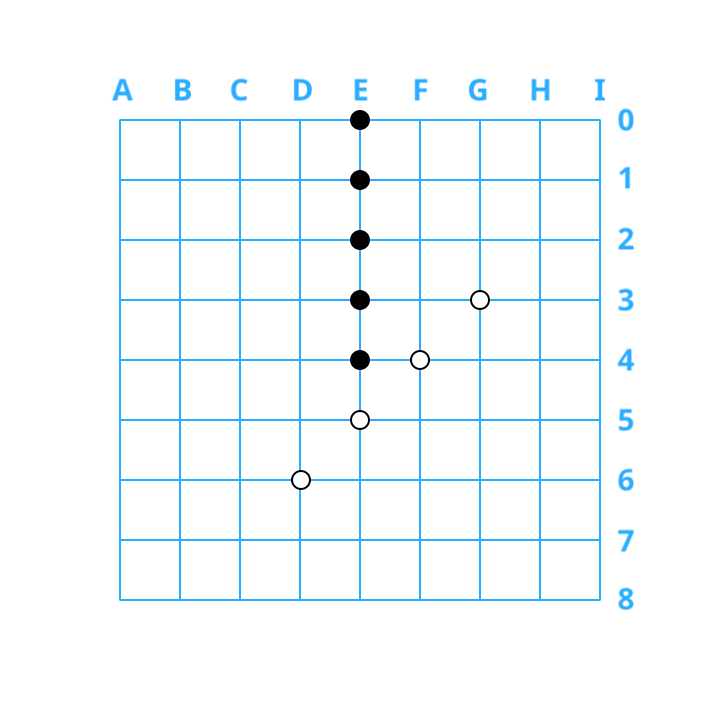
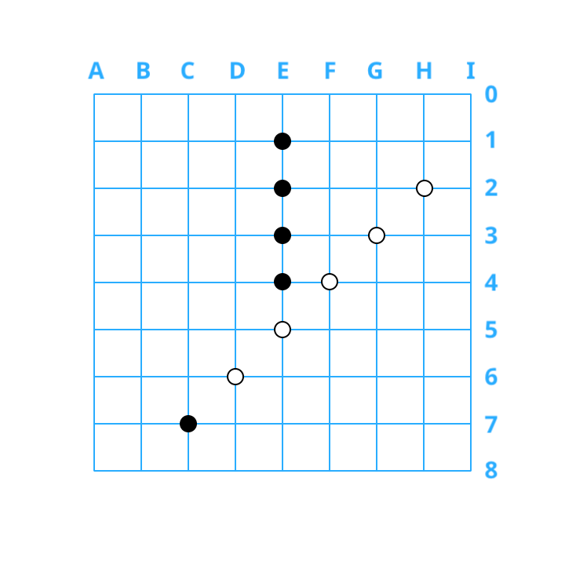
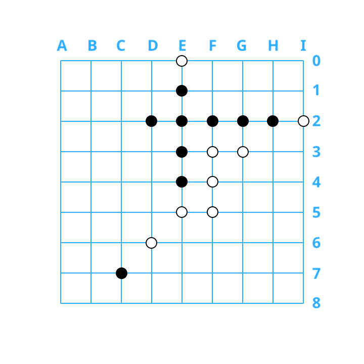
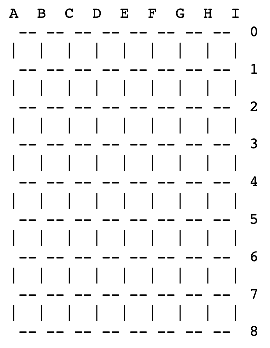
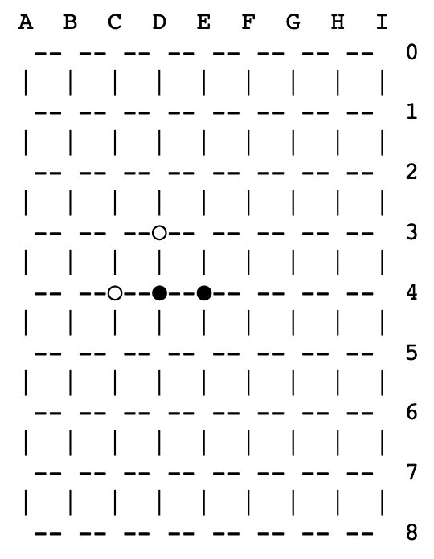
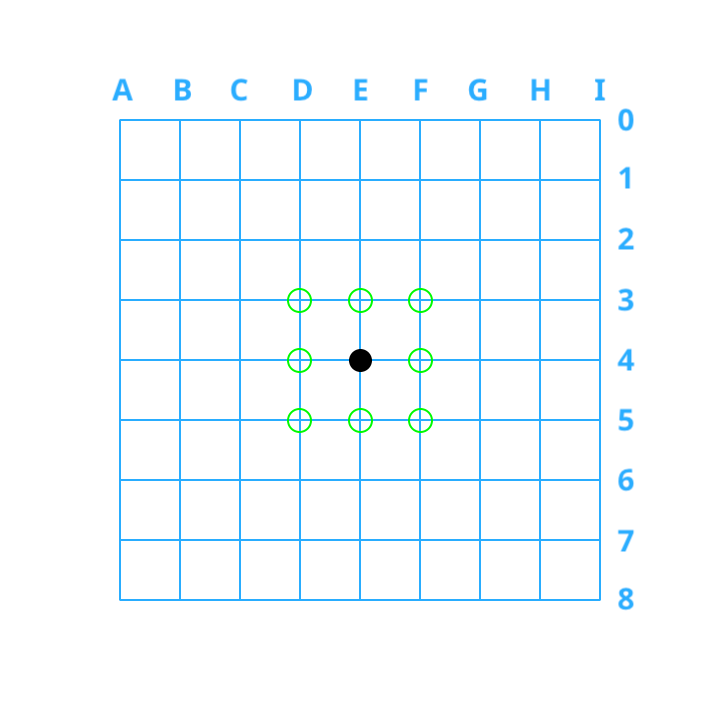
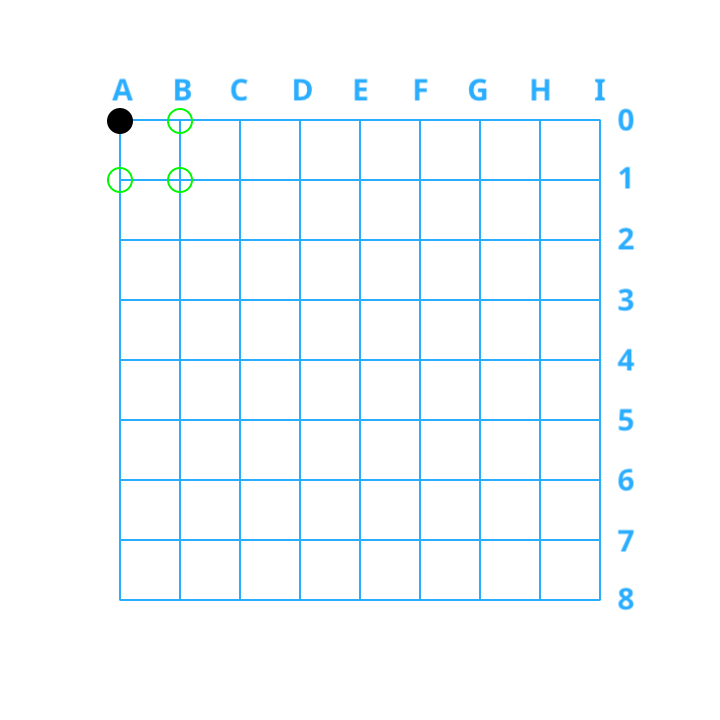
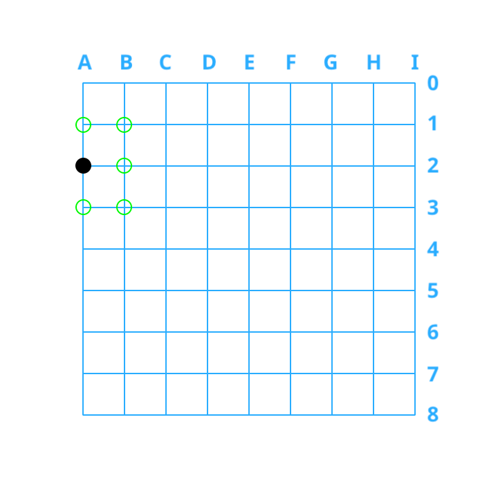

::: center

## FIT9136 Algorithms and Programming Foundations in Python 

### Assignment 1

Last Updated: 23 July 2023

:::

## 1. Key Information

> 1. 关键信息

| Purpose<br />目的                     | This assignment will develop your skills in designing, constructing, and documenting a small Python program according to specific programming standards. This assessment is related to (part of) the following learning outcome (LO):<br />● **LO1:** Apply best practice Python programming constructs for solving computational problems<br />这项作业将根据特定的编程标准培养你设计、构建和编写小型Python程序的技能。此评估与以下学习成果(LO)相关(部分):<br />●**LO1:**应用最佳实践Python编程结构来解决计算问题 |
| ------------------------------------- | ------------------------------------------------------------ |
| **Your task**                         | **This assignment is an Individual task where you will write Python code for a simple application whereby you will be developing a simple board game as per the specification.**<br />这个作业是一个单独的任务，你将为一个简单的应用程序编写Python代码，你将根据规范开发一个简单的棋盘游戏。 |
| **Value**                             | **25%** of your total marks for the unit.<br />占你该单元总分数的25%。 |
| **Due Date**                          | **Friday, 25 August 2023, 4:30 PM (AEST)**                   |
| **Submission**                        | ●  Via Moodle Assignment Submission. <br />●  FIT GitLab check-ins will be used to assess the history ofdevelopment <br />●  Turnitin will be used for similarity checking of all submissions.<br />●通过Moodle提交作业。<br />●FIT GitLab签到将用于评估开发历史<br />●Turnitin将用于所有提交的相似性检查。 |
| **Assessment Criteria**<br />评估标准 | This assessment includes a compulsory interview with your tutor following the submission date. At the interview you will be asked to explain your code/design/testing, modify your code, and discuss your design decisions and alternatives. Marks will not be awarded for any section of code/design/functionality that you cannot explain satisfactorily. Failure to attend the interview will result in your assessment not being marked. You will be provided with the timing of the interviews at a later date.<br />此评估包括在提交日期之后与导师的强制性面试。在面试中，你会被要求解释你的代码/设计/测试，修改你的代码，讨论你的设计决策和替代方案。对于你不能令人满意地解释的代码/设计/功能部分，将不予得分。未能参加面试将导致你的评估不被评分。面试时间将在稍后通知您。<br />The following aspects will be assessed:<br />1. Program functionality in accordance to the requirements <br />2. Code Architecture and Adherence to Python coding standards <br />3. The comprehensiveness of documented code and test strategy<br />以下方面将被评估:<br />1。符合要求的程序功能<br />2。代码架构和遵从Python编码标准<br />文档化代码和测试策略的全面性 |
| **Late Penalties**                    | ●  10% deduction per calendar day or part thereof for up to one week <br />●  Submissions more than 7 calendar days after the due date will receive a mark of zero (0) and no assessment feedback will be provided.<br />●一周内每日历日或其中一天扣除10% <br />●截止日期后超过7个日历日的提交将获得零分(0)，并且不会提供评估反馈。 |
| **Support Resources**<br />支持资源   | See Moodle Assessment page and Section 8 in this document<br />请参阅本文档的Moodle评估页面和第8节 |
| **Feedback**<br />反馈                | Feedback will be provided on student work via<br />●  general cohort performance <br />●  specific student feedback ten working days post submission<br />对学生作业的反馈将通过以下方式提供:<br />●总体队列表现<br />●提交后10个工作日的特定学生反馈 |

## 2. Context Information

For this assignment, you will be required to create a Python program that simulates the board game [Gomoku](https://www.wikihow.com/Play-Gomoku). *Gomoku*, also referred to as *Five in a Row*, is a popular board game originating from East Asia. Two players strategically play on a square grid. The objective for both players is to be the first one to create a continuous line of five stones either horizontally, vertically or diagonally. The players alternate turns to place stones on vacant intersections of the grid, where they need to create their line of five stones while stopping the opponent from achieving the same.

> 这个任务中，你需要创建一个Python程序来模拟棋盘游戏[Gomoku](https://www.wikihow.com/Play-Gomoku)。*Gomoku*，也被称为*五子棋*，是源自东亚的一款流行棋盘游戏。两名玩家在一个方形网格上进行战略性对局。双方玩家的目标都是要首先在水平、垂直或对角线上形成一个连续的五颗棋子排列。玩家轮流在网格的空交叉点上放置棋子，他们需要在自己的五颗棋子排列的同时阻止对手达到相同的目标。

### 2.1. The Game Board

> 2.1. 游戏棋盘

This game involves a rectangle board with different board settings. An example 9 * 9 board is shown below :

> 这个游戏涉及一个带有不同棋盘设置的矩形棋盘。下面是一个示例，显示了一个 9 * 9 的棋盘：



We will use the same coordinate system as indicated in the above example:

> 我们将使用上面示例中指示的相同坐标系统：

1. Rows increase from the top to the bottom and numerical indices are used (e.g., for a 9 * 9 board, the top row is row 0 and the bottom row is row 8);

    > 行从顶部增加到底部，并且使用数字索引（例如，对于一个 9 * 9 的棋盘，顶部行是第 0 行，底部行是第 8 行）；

2. Columns increase from left to right and uppercase letters are used as indices(e.g., for a 9 * 9 board, the leftmost column is column A and the rightmost column is column I).

    > 列从左到右递增，大写字母被用作索引（例如，对于一个 9 * 9 的棋盘，最左边的列是 A 列，最右边的列是 I 列）。

Please note that, stones are placed at the intersections (e.g., 0A, 0B, 1A, 1B).

> 请注意，棋子被放置在交叉点上（例如，0A、0B、1A、1B）。

### 2.2. Taking Turns

> 2.2. 轮流进行

Players take turns dropping a coloured stone (i.e., black/white) onto one of the intersections as shown below:

> 玩家轮流将一颗彩色石子（即黑色/白色）放在如下所示的交叉点上：




By convention, the player using the **black** stones begins the game by placing one of their pieces on the board. Here, the same convention is followed.

> 按照惯例，使用**黑色**棋子的玩家会在游戏开始时将其中一枚棋子放在棋盘上。在这里，同样遵循了这一惯例。

### 2.3. Ending a Game

> 2.3. 结束一场游戏

Players take turns to place stones on the board until either:

> 玩家轮流把石头放在棋盘上，直到任意一方

- One player has an unbroken line of five stones of their colour. The line can be either horizontal, vertical or diagonal.

    > 一名棋手有一条不间断的五块与自己颜色相同的石头。这条线可以是水平的、垂直的或对角线。

- The board is completely filled (i.e. all spots have been occupied) and both players are unable to make a continuous line of five stones. In this case, the game ends in a draw.

    > 棋盘被完全填满了(即所有的位置都被占用了)，两个玩家都无法组成一个连续的五子线。在这种情况下，比赛以平局结束。

Some examples of winning states:

> 一些获胜州的例子:

::: tabs

@tab 1

玩家1(黑色)在E列，第0行-第4行(即，这些位置上的所有石头都是黑色的)垂直获胜。



@tab 2

玩家2(白棋)在第2行H列、第3行G列、第4行F列、第5行E列和第6行D列中对角线获胜(即，这些位置上的所有棋子都是白棋)。



@tab 3

玩家1(黑色)在第2行，D-H列(即，这些点上的所有石头都是黑色的)中水平获胜。



:::

### 2.4. Your Task

You will eventually construct a program that simulates the players playing this game but it will be broken into small stages to help you develop your program.

> 你最终会构建一个模拟玩家进行这个游戏的程序，但它将被分解成小阶段，以帮助你开发程序。

### 2.5. Video Description

This video gives a good description of the game: Link to [video](https://www.youtube.com/watch?v=-KD743yNDHc).

## 3. Implementation Instructions

> 3. 实施说明

Your implementation **must include a text interface with all necessary functionalities** as detailed below. Your program will be evaluated based on its ease of use and clarity, including the provision of clear information and error messages for the player.

> 你的实现**必须包括一个具备以下所有必要功能的文本界面**。你的程序将根据其易用性和清晰度进行评估，包括为玩家提供清晰的信息和错误消息。

The objective of your implemented *Gomoku* game is to allow 1) a player to play against a simple computer player; and 2) a player to play against another player. Victory is attained by the first player who achieves an unbroken line of five stones of their colour. The task at hand requires the creation of functions to facilitate the entire gameplay process. It is imperative to carefully review the following comprehensive regulations and prerequisites for each function and aim to execute them.

> 你所实现的**五子棋**游戏的目标是：
>
> 1）允许玩家与简单的电脑玩家对战；
>
> 2）允许玩家与另一个玩家对战。
>
> 获胜的条件是首先拥有一条连续的五颗同色棋子的玩家。当前任务要求创建多个函数，以促进整个游戏过程。务必仔细审查以下详尽的规则和每个函数的先决条件，并力求执行它们。

**To ensure that your code can be properly evaluated by the teaching team:**

> 为了确保您的代码能够被教学团队正确评估：

1. **Please ensure that your implemented functions use the same names and function signatures (i.e. number and type of input arguments and the type of the return value) as required,**

    > 请确保您实现的函数使用与所需相同的名称和函数签名（即输入参数的数量和类型以及返回值的类型）。

2. **Please ensure that your code is properly formatted, such as proper variable naming conventions, consistent indentations, proper line length, etc.,**

    > 请确保您的代码格式正确，例如适当的变量命名规范，一致的缩进，适当的行长度等。

3. **Please ensure that you provide clear and coherent comments on your code to aid with the graders’ interpretation of your code,**

    > 请确保你对你的代码提供清晰和连贯的注释，以帮助评分者对你的代码的解释。

4. **For more details regarding formatting and commenting, see the [PEP 8 Style Guideline](https://peps.python.org/pep-0008/)**.

    > 有关格式化和注释的更多详细信息，请参阅PEP 8风格指南。

### 3.1. Game menu function

> 3.1. 游戏菜单功能

The **`game_menu()`** function is responsible for displaying the game menu at the start of the game, as well as during the game process to provide instructional suggestions. The menu should at least include the following five options:

> game_menu() 函数负责在游戏开始时显示游戏菜单，以及在游戏过程中提供指导建议。菜单至少应该包括以下五个选项:

1. Start a Game

    > 开始游戏

2. Print the Board

    > 打印电路板

3. Place a Stone

    > 放一块石头

4. Reset the Game

    > 重置游戏

5. Exit

    > 退出

### 3.2. Creating the Board

> 3.2. 创建游戏棋盘

The purpose of this function is to create a data structure which will be used to keep track of the states of the boards. 

Your task here is to write the **`create_board(size)`** function, where **`size`** is the size of the board (e.g. to create a 9 by 9 board, we call **`create_board(9)`**). 

You should carefully decide the data structure to be used as well as the values to be stored to represent the unoccupied intersections of the grid.

> 这个函数的目的是创建一个数据结构，用于跟踪棋盘的状态。
>
> 您在这里的任务是编写 **`create_board(size)`** 函数，其中 **`size`** 是棋盘的大小（例如，要创建一个 9x9 的棋盘，我们调用 **`create_board(9)`**）。
>
> 您应该仔细决定要使用的数据结构，以及用于表示网格中未占用交叉点的值。

This function returns the data structure which will be used to keep track of the occupancy status of the intersections on the board. The occupancy status of the intersections for the newly created board should all be unoccupied.

> 这个函数返回一个数据结构，用于跟踪棋盘上交叉点的占用状态。新创建的棋盘上交叉点的占用状态应该全部是未占用的。

### 3.3. Is the target position occupied?

> 3.3. 目标位置是否被占用？

The purpose of this function is to examine whether a specific position on the board is occupied by a stone. Your task is to write a function **`is_occupied(board, x, y)`** where **`board`** is the current state of the board, **`x`** is the row index and **`y`** is the column index.

> 这个函数的目的是检查棋盘上特定位置是否被棋子占据。你的任务是编写一个函数 **`is_occupied(board, x, y)`**，其中 **`board`** 是当前棋盘的状态，**`x`** 是行索引，**`y`** 是列索引。

Here, you can assume that **`x`** and **`y`** are both valid numeric indices (i.e., both **`x`** and **`y`** are greater than or equal to 0 and smaller than the size of the board).

> 在这里，你可以假设 **`x`** 和 **`y`** 都是有效的数值索引（即，**`x`** 和 **`y`** 都大于或等于 0，且小于棋盘的尺寸）。

This function returns a boolean value of either **`True`** or **`False`**.

> 这个函数返回一个布尔值，可以是 **`True`**（真）或 **`False`**（假）。

### 3.4. Placing a Stone at a Specific Intersection

> 3.4. 在特定交叉点放置一颗棋子

Now we want to replicate placing a stone on the board. Your task is to write a function **`place_on_board(board, stone, position)`** which:

> 现在我们想要复制将一块石头放在棋盘上的操作。你的任务是编写一个函数**`place_on_board(board, stone, position)`**，该函数需要：

- Takes the following parameters:

    > 接受以下参数：

    - A board

        > 一个棋盘

    - A stone value (either "●" or "○")

        > 一个石头的价值（可以是 "●" 或 "○"）。

    - A position (a tuple of **strings** (a, b) where a is the row index, e.g., “0”, and b is the column index, e.g., “A”)

        > 一个位置（由字符串元组（a，b）组成，其中a是行索引，例如，“0”，b是列索引，例如，“A”）

- If the move is successfully performed, return a boolean value of **True**

    > 如果移动成功执行，则返回一个布尔值 True。

- If the move is impossible (e.g., invalid or occupied position), return a boolean value of  **False**

    > 如果移动是不可能的（例如，无效或被占据的位置），则返回一个布尔值 **False**。

You will need to invoke functions implemented in previous steps.

> 你需要调用之前步骤中实现的函数。

### 3.5. Printing the Board

> 3.5. 打印棋盘

In order for players to know the states of the current boards, there needs to be a way to visualise the board. Your task here is to write a function **print_board(board)**:

> 为了让玩家了解当前棋盘的状态，需要一种将棋盘可视化的方法。你在这里的任务是编写一个函数 **print_board(board)**：

- The parameter **board** can be the ones created and manipulated in previous steps

    > 参数板可以是在之前步骤中创建和操作过的那些。

- “**`--`**” and “**`|`**” should be used to represent the grid of the board.

    > “**`--`**” 和 “**`|`**” 应该用来表示棋盘的网格。

- Apart from the board, the indices of the board need to be presented to enhance user friendliness as indicated in the examples below

    > 除了棋盘本身，棋盘上的指标也需要呈现出来，以增强用户友好性，如下面的示例所示。

- This function does not return any value.

    > 该函数不返回任何值。

- Examples:

    ```python
    An empty 9 * 9 board printed by this function
    A  B  C  D  E  F  G  H  I
     -- -- -- -- -- -- -- --   0
    |  |  |  |  |  |  |  |  |
     -- -- -- -- -- -- -- --   1
    |  |  |  |  |  |  |  |  |
     -- -- -- -- -- -- -- --   2
    |  |  |  |  |  |  |  |  |
     -- -- -- -- -- -- -- --   3
    |  |  |  |  |  |  |  |  |
     -- -- -- -- -- -- -- --   4
    |  |  |  |  |  |  |  |  |
     -- -- -- -- -- -- -- --   5
    |  |  |  |  |  |  |  |  |
     -- -- -- -- -- -- -- --   6
    |  |  |  |  |  |  |  |  |
     -- -- -- -- -- -- -- --   7
    |  |  |  |  |  |  |  |  |
     -- -- -- -- -- -- -- --   8
    ```



```python
A 9 * 9 board with both players placing two stones printed by this function
A  B  C  D  E  F  G  H  I
 -- -- -- -- -- -- -- --   0
|  |  |  |  |  |  |  |  |
 -- -- -- -- -- -- -- --   1
|  |  |  |  |  |  |  |  |
 -- -- -- -- -- -- -- --   2
|  |  |  |  |  |  |  |  |
 -- -- --○-- -- -- -- --   3
|  |  |  |  |  |  |  |  |
 -- --○--●--●-- -- -- --   4
|  |  |  |  |  |  |  |  |
 -- -- -- -- -- -- -- --   5
|  |  |  |  |  |  |  |  |
 -- -- -- -- -- -- -- --   6
|  |  |  |  |  |  |  |  |
 -- -- -- -- -- -- -- --   7
|  |  |  |  |  |  |  |  |
 -- -- -- -- -- -- -- --   8
```





### 3.6. Check Available Moves

> 3.6. 检查可行动作

The purpose of this function is to find out whether there are available moves on the board. Your task is to write a function **`check_available_moves(board)`** where **`board`** is the current state of the board. 

> 这个函数的目的是找出棋盘上是否有可用的移动。你的任务是编写一个名为**`check_available_moves(board)`**的函数，其中**`board`**是当前棋盘的状态。

This function returns the available moves as a list of tuples where each tuple represents a position on the board, e.g., **`[(“0”, “A”), (“3”, “D”)]`**. If the board is full, return an empty list.

> 该函数将可用移动作为元组列表返回，其中每个元组表示棋盘上的一个位置，例如，**`[("0", "A"), ("3", "D")]`**。如果棋盘已满，请返回一个空列表。

You will need to invoke functions implemented in previous steps.

> 你需要调用在之前步骤中实现的函数。

### 3.7. Check for the Winner

> 3.7. 检查获胜者

The purpose of this function is to identify the winner of the game. A winning condition is achieved when one of the players successfully forms a continuous line of five stones in their colour, either horizontally, vertically or diagonally. Your task is to write a function **`check_for_winner(board)`** :

> 该函数的目的是识别游戏的获胜者。当玩家之一成功地在水平、垂直或对角线上以其颜色成功形成连续的五颗棋子时，就实现了获胜条件。您的任务是编写一个名为 **`check_for_winner(board)`** 的函数：

- The parameter **`board`** can be the ones created and manipulated in previous steps

    > 参数 **`board`** 可以是在前面步骤中创建和操作的那些参数。

- If a continuous line of five stones in the same colour has been achieved, return the corresponding stone

    > 如果连续排列着五颗相同颜色的石子，就返回相应的石子。

- If the board is full but none of the players achieves a continuous line of five stones, return a string value of “**`Draw`**”

    > 如果棋盘已满但没有任何玩家成功连成五颗棋子，返回一个字符串值“**`Draw`**”。

- If none of the players achieve the winning condition and there are still available moves on the board, return **`None`**

    > 如果没有任何玩家达到获胜条件，并且棋盘上仍有可用的移动，返回 **`None`**。

- You will need to invoke functions implemented in previous steps.

    > 你需要调用在前面步骤中实现的函数。

### 3.8. Random Computer Player

> 3.8. 随机计算机玩家

The purpose of this function is to implement a computer opponent. The computer opponent will counter the player by randomly selecting one of the available moves around the player’s previous move. For example:

> 这个函数的目的是实现一个电脑对手。电脑对手将会通过在玩家先前的移动周围随机选择一个可用的移动来对抗玩家。例如：




When the player places the stone at (“4”, “E”), the green spots surrounding the player stone suggest the moves the computer player can choose from. **From these green spots, the computer player can only choose one of the spots that are unoccupied.**

> 当玩家将石子放置在("4", "E")位置时，围绕玩家石子的绿色区域提示了电脑玩家可以选择的移动方式。从这些绿色区域中，电脑玩家只能选择其中一个尚未被占据的位置。




When the player places the stone at (“0”, “A”), the green spots surrounding the player stone suggest the available moves for the computer player to choose from. Note that, same as previously mentioned, the computer player can only choose one of the green spots that are unoccupied.

> 当玩家将石子放置在（“0”，“A”）位置时，围绕玩家石子的绿色点表示计算机玩家可以选择的可用移动位置。需要注意的是，与前面提到的情况相同，计算机玩家只能选择那些未被占据的绿色点之一。




When the player places the stone at (“2”, “A”), the computer player can only choose one of unoccupied spots from the green spots surrounding the player stone as shown in the figure.

> 当玩家将棋子放置在("2", "A")位置时，计算机玩家只能在图中所示的绿色区域周围的未占据位置中选择一个。

The available moves for the computer player are based on both the player’s previous move and the availability of that move’s surrounding positions. Your task here is to implement the function **`random_computer_player(board,player_move)`**:

> 计算机玩家的可用移动是基于玩家先前的移动和该移动周围位置的可用性。你在这里的任务是实现函数 **`random_computer_player(board,player_move)`**：

- The **`player_move`** isinthesamepositionformat,e.g., **`(“0”, “B”)`**

    > **`player_move`** 的格式与当前位置相同，例如，**`(“0”，“B”)**。

- Seeing the position of the player’s previous move as the centroid, the function needs to find all the available **`valid`** positions within a 3 * 3 square and randomly select one of these positions

    > 以玩家先前移动的位置作为中心点，该函数需要在一个 3*3 的正方形范围内找到所有可用的**`有效`**位置，并随机选择其中一个位置。

- If all positions within the 3 * 3 square are invalid, the function should randomly select from one of the available positions on the board

    > 如果3 * 3方格内的所有位置都无效，则函数应随机从棋盘上的可用位置中选择一个。

- When randomly selecting the moves, you need to ensure all identified positions have the same likelihood of being selected

    > 在随机选择移动时，您需要确保所有已识别的位置具有相同被选中的可能性。

- This function should return a tuple of **`strings`** which represents the next played position for the computer player, e.g., **`(“1”, “D”)`**

    > 该函数应返回一个由**`字符串`**组成的元组，表示计算机玩家的下一个下棋位置，例如，**`(“1”，“D”)`**。

You will need to invoke functions implemented in previous steps.

> 你需要调用在之前步骤中实现的函数。

### 3.9. Play Game

The purpose of this function is to manage all aspects of the game play. You should invoke all functions implemented in previous steps here. Your task is to implement the function **`play_game()`**:

> 这个函数的目的是管理游戏玩法的各个方面。你应该在这里调用之前步骤中实现的所有函数。你的任务是实现函数 **`play_game()`**：

- This function accepts zero parameters.

    > 该函数不接受任何参数。

- When the function is invoked, it should display a menu to display all possible options for the user

    > 当函数被调用时，应该显示一个菜单，展示所有可能的选项供用户选择。

- Once the user selects an option, the program should execute the relevant function(s) or display additional prompts/ask for additional inputs as needed

    > 用户一旦选择了一个选项，程序应当执行相关的函数，或根据需要显示额外的提示/要求额外的输入。

- **The user should be able to return to the main menu at any time**

    > 用户应该能够随时返回主菜单。

- When the user input option “1”, the function should:

    > 当用户输入选项“1”时，函数应该：

    - Ask for a board size value from the user, the program should at least support size values of 9, 13 and 15.

        > 向用户询问棋盘大小值，程序至少应支持9、13和15这些大小值。

    - Then, ask for a mode from the user, the mode should be either **Player vs. Player** or **Player vs. Computer**

        > 然后，向用户询问一个模式，该模式应为**玩家对玩家**或**玩家对计算机**中的一个。

    - Create a board based on the user specified size

        > 创建一个基于用户指定尺寸的板。

- When the user input option “2”, the function should visualise the current state of the board to the user

    > 当用户输入选项“2”时，该函数应该向用户展示棋盘的当前状态。

- When the user input option “3”, the function should:

    > 当用户输入选项“3”时，该函数应该：

    - Ask the user to place a stone at a position, the expected input format for the position should be “**`[row_index] [column_index]`**”(e.g., “**`2 F`**”)

        > 请用户在一个位置放置石头，预期的位置输入格式应为“**`[行索引] [列索引]`**”（例如，“**`2 F`**”）。

    - The user should open the game with the black stone (i.e., "●"). You may need to keep track of the turns to determine the colour of stones to be placed next.

        > 用户应该用黑色的棋子（即"●"）开局。您可能需要跟踪轮次来确定接下来要放置的棋子颜色。

    - Whenever the user successfully places a stone on the board, you should check if any of the players has achieved one of the winning conditions

        > 每当用户成功地在棋盘上放置一个棋子时，你应该检查任何一位玩家是否达到了胜利的条件之一。

    - For **Player vs. Player** mode, only one stone from the corresponding player will be placed on the board

        > 对于**玩家对战玩家**模式，只有相应玩家的一颗石子会被放置在棋盘上。

    - For **Player vs. Computer** mode, after playing and checking the player’s move, the computer player should play the move as described in section 3.8 and conduct similar checking of the winning conditions

        > 对于**玩家对战电脑**模式，在游戏中并检查玩家的动作之后，电脑玩家应按照3.8节所描述的进行操作，并进行类似的胜利条件检查。

    - If an ending condition is achieved (i.e., either one of the players win, or no more move is available), the game needs to automatically print the result (either print the stone value of the winner or inform the player of a draw game). Subsequently, both the board and the mode need to be reset

        > 如果达到结束条件（即，玩家之一获胜或者没有更多的移动可用），游戏需要自动打印结果（要么打印赢家的石头值，要么通知玩家这是平局）。随后，棋盘和模式都需要重置。

- When the user input option “4”, the function should reset the game (i.e., reset the board and the selected mode)

    > 当用户输入选项“4”时，函数应该重置游戏（即，重置棋盘和所选模式）。

- When the user input option “5”, the function should exit the program. **This is the only situation when the program terminates. The program should continue to run infinitely unless the user selects this option.**

    > 当用户输入选项“5”时，函数应该退出程序。**只有在这种情况下程序会终止。除非用户选择此选项，程序应无限地继续运行。**

For this function, you will need to validate the inputs from the users and provide meaningful instructional messages. You will need to ensure a clear logic for the implemented function.

> 对于这个函数，您需要验证用户输入并提供有意义的指示信息。您需要确保所实现的函数具有清晰的逻辑。


::: details 公众号：AI悦创【二维码】


:::

::: info AI悦创·编程一对一

AI悦创·推出辅导班啦，包括「Python 语言辅导班、C++ 辅导班、java 辅导班、算法/数据结构辅导班、少儿编程、pygame 游戏开发、Web、Linux」，全部都是一对一教学：一对一辅导 + 一对一答疑 + 布置作业 + 项目实践等。当然，还有线下线上摄影课程、Photoshop、Premiere 一对一教学、QQ、微信在线，随时响应！微信：Jiabcdefh

C++ 信息奥赛题解，长期更新！长期招收一对一中小学信息奥赛集训，莆田、厦门地区有机会线下上门，其他地区线上。微信：Jiabcdefh

方法一：[QQ](http://wpa.qq.com/msgrd?v=3&uin=1432803776&site=qq&menu=yes)

方法二：微信：Jiabcdefh

:::


