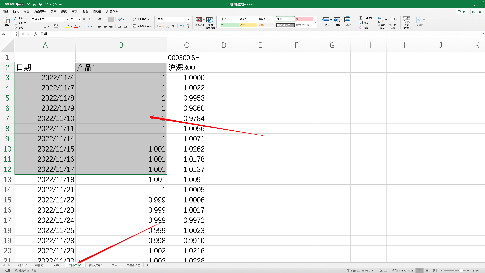
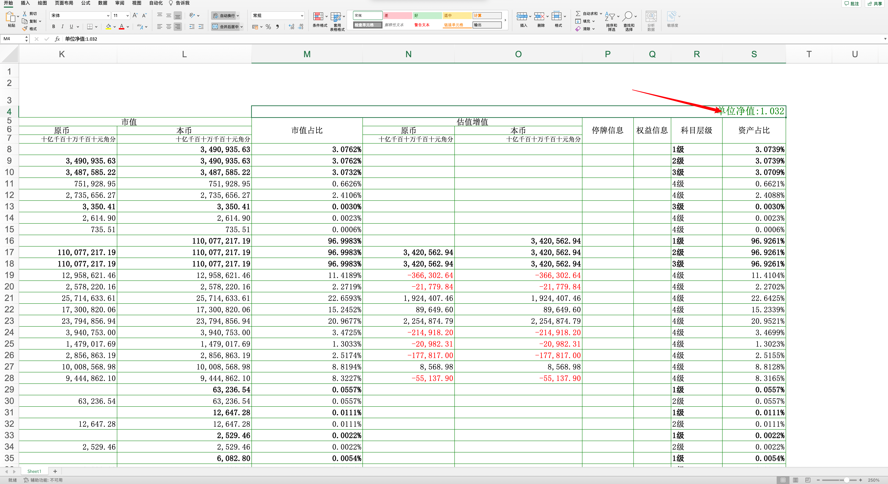
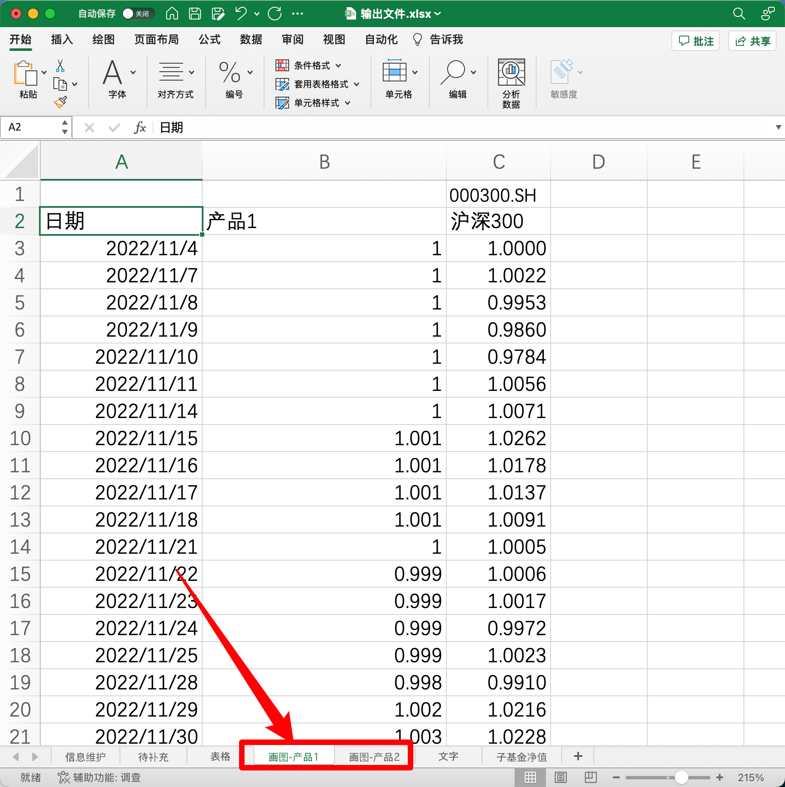
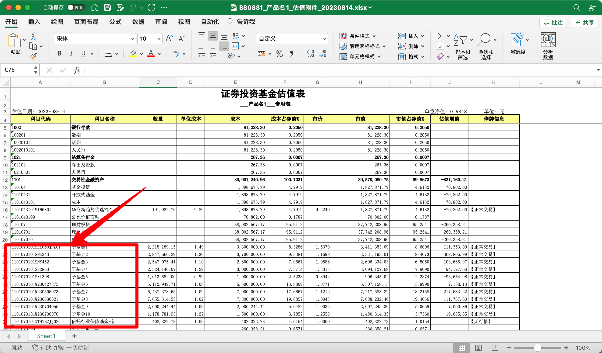
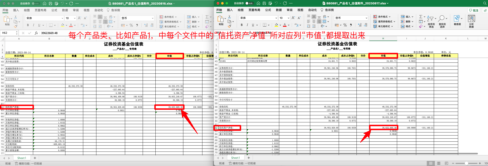
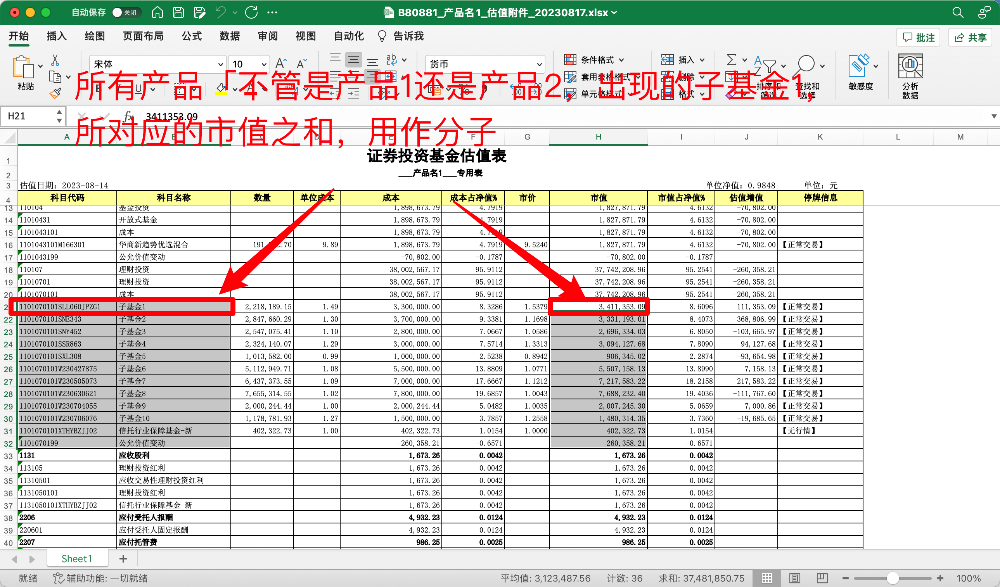
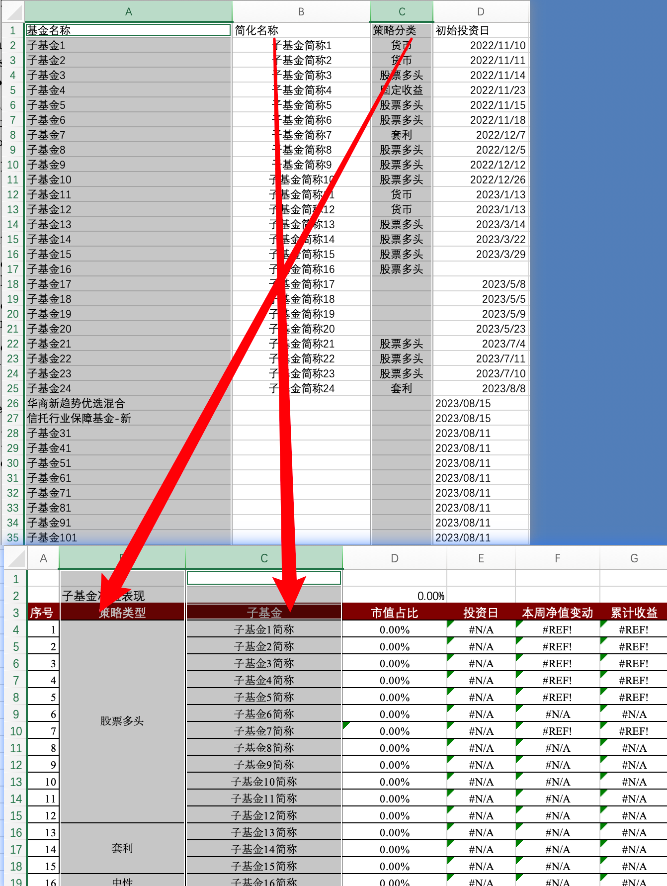

你好，我是悦创。

先上截图：

::: tabs

@tab 1


@tab 2


@tab 3


@tab 4


@tab 5


@tab 6


@tab 7


:::

基于这样的需求，我收到了两次不同的自动化需求文档和操作数据，接下来我将系统整理需求并实施。

## 1. 需求整理📄

### 1.1 需求点 1

共有两个产品，从估值表中导出数据到输出文件 excel 中。

1） 提取产品的日期和净值分别到“画图-产品1”和“画图-产品2”中。

- 数据：日期是文件名的后 8 个数字，净值在估值表的这个位置「图-1」。

- 输出：
    - 保存到新的 Excel 中，表名「sheet name」分别为：“`画图-产品1`”和“`画图-产品2`”「图-2」
    - 表中的数据有：日期、产品净值。
        - 日期：日期
        - 产品净值：产品1 or 产品2......

:::: tabs

@tab 画图-产品1

| 日期      | 产品1 |
| --------- | ----- |
| 2022/11/4 | 1     |
| 2022/11/7 | 1     |
| 2022/11/8 | 1     |
| 2022/11/9 | 1     |

@tab 画图-产品2

| 日期      | 产品2  |
| --------- | ------ |
| 2023/3/29 | 1      |
| 2023/3/30 | 1.0007 |
| 2023/3/31 | 1.0019 |
| 2023/4/3  | 1.0021 |
| 2023/4/4  | 1.0074 |

@tab 效果图片



@tab 图-1



@tab 图-2



::::

### 1.2 需求点 2

1） 检查两个产品的子基金名称是否在“信息维护”中出现过，如果没出现过就把子基金名字输出到“待补充” or 直接追加在“信息维护”中。~~DN 会手动把待补充的子基金填到“信息维护页”，手动维护子基金简称和策略分类这两列。~~ 其他的，默认数据为：None or 空字符串。

- 提取逻辑：通过第一列的科目代码长度大于 16 的，获取到所对应的基金名称。

- 还需要读取产品文件名称中的日期，到信息维护中的**初始投资日**

::: tabs

@tab 产品中对应的基金名称



@tab 追加到输出文件.xlsx


:::

### 1.3 需求点 3

::: tabs

@tab 数据点 1

比如，产品1 所有信托资产净值，全部提取到了，相加在一起，用作后面的：分母。

提取每个 产品2估值表中的”资产净值“所对应的“市值的本币”



```python
import pandas as pd
from main4 import generate_path

paths = generate_path(".")

# df[df["科目代码"] == "资产净值"]["市值.1"].iloc[0]
# df[df["科目代码"] == "信托资产净值:"]["市值"].iloc[0]
# df = pd.read_excel("/Users/aiyuechuang/Coder/Pycharm/StudentCoder/auto_office/sample/产品2/原始估值表/B80881_产品名1_估值附件_20230816.xlsx", skiprows=3)
# df = pd.read_excel("/Users/aiyuechuang/Coder/Pycharm/StudentCoder/auto_office/sample/产品1/原始估值表/3W0110产品2估值表20230810.xls", skiprows=4)

cp1 = []
cp2 = []
for path in paths:
    if "产品1" in path:
        df = pd.read_excel(path, skiprows=4)
        value = df[df["科目代码"] == "资产净值"]["市值.1"].iloc[0]
        cp2.append(value)
    else:
        df = pd.read_excel(path, skiprows=3)
        value = df[df["科目代码"] == "信托资产净值:"]["市值"].iloc[0]
        cp1.append(value)
print(cp1, cp2)
```


@tab 数据点 2



@tab 数据点 3



:::


## 2. 代码实现💻

### 2.1 库的对比

在办公自动化处理 Excel 方面，主流可用的库的优缺点。

- **openpyxl**
    - 优点：专为 `.xlsx` 格式设计，功能丰富，适用于多数场景；
    - 缺点：不支持 `.xls` 格式；
- **xlrd**
    - 优点：是读取旧版 `.xls` 格式首选库；
    - 缺点：从 2.0.0 版本开始，`xlrd` 仅支持 `.xls` 格式，并放弃了对 `.xlsx` 格式的支持；
- **xlwt**
    - 优点：用于写入 `.xls` 格式的文件；
    - 缺点：不支持 `.xlsx` 格式；
- **XlsxWriter**
    - 优点：专为写入 `.xlsx` 格式文件设计，提供了很多高级功能，比如：图表创建；
    - 缺点：不能读取 Excel 文件，也不支持 `.xls` 格式；
- **pandas**
    - 优点：它是一个数据分析库，可以结合  `openpyxl`、`xlrd` 和 `XlsxWriter` 来读取和写入 Excel 文件。对于数据处理和转换，`pandas` 非常强大；
    - 缺点：为数据分析设计，对于一些专门的 Excel 功能可能不是那么直观；

为了最大化地处理 Excel 的新旧版本，你可以这样做：

- 使用 `xlrd` 来读取 `.xls` 格式的文件。再使用 `xlwt` 来写入 `.xls` 格式文件；
- 使用 `openpyxl` 来读取和写入 `.xlsx` 格式的文件；
- 如果需要更高级的写入功能，考虑使用 `XlsxWriter`；
- 对于数据处理和转换，考虑使用 `pandas`。

这样，你可以涵盖 Excel 文件的大多数情况。

### 2.2 pandas 在 Excel 领域的特点

pandas 可以同时支持新版本（`.xlsx`、`.xlsm`）和旧版（`.xls`）的 Excel 文件格式，但 pandas 做到这一点是通过在后台使用其他库，如： `openpyxl` 和 `xlrd`。

具体地说：

1. **读取 Excel 文件**
    - 当读取 `.xlsx` 文件时，`pandas` 默认使用 `openpyxl` 作为引擎。
    - 当读取 `.xls` 文件时，`pandas` 使用 `xlrd` 作为引擎。
2. **写入 Excel 文件**
    - 当写入 `.xlsx` 文件时，`pandas` 可以使用 `openpyxl` 或 `XlsxWriter` 作为引擎。
    - 当写入 `.xls` 文件时，`pandas` 使用 `xlwt` 作为引擎。

所以，我们完全可以通过 pandas 来统一操作我们 Excel 文件读取或写入不同格式的 Excel 文件，而不必担心底层实现的细节。

只需要确保我们已经安装了必要的库（如： `openpyxl`、`xlrd`、`xlwt` 和/或 `XlsxWriter`）。

例如，使用 `pandas` 读取 `.xlsx` 和 `.xls` 文件：

```python
import pandas as pd

# 读取 .xlsx 文件
df_xlsx = pd.read_excel("path_to_file.xlsx", engine="openpyxl")

# 读取 .xls 文件
df_xls = pd.read_excel("path_to_file.xls", engine="xlrd")
```

基本的写入 `.xlsx` 和 `.xls` 文件：

```python
# 写入 .xlsx 文件
df.to_excel("path_to_output.xlsx", engine="openpyxl")

# 写入 .xls 文件
df.to_excel("path_to_output.xls", engine="xlwt")
```

总之，确实，`pandas` 提供了一个统一的接口来处理新旧版本的 Excel 文件，只是需要确保你有适当的底层库来支持这些操作。

### 2.3 需求点1「思路」

- 实现思路：
    - 读取 sample 文件夹下所 Excel 并生成相对路径；
    - 编写新旧版本 Excel 数据；
    - 提取对应需要的数据；
    - 实现追加数据；
    - 不同的净值分开
        - 产品1——>画图-产品1
        - 产品2——>画图-产品2；
    - 优化追加策略「已经存在的不追加，依据：比较日期」；

#### 2.3.1 导入所需库

```python
import os
from pprint import pprint
import re, xlrd
import pandas as pd, openpyxl
```


## 3. Bug🙋

- [ ] Excel 使用选中删除，会产生删除“不干净”，添加函数会在 Excel 空白后面追加数据；
- [ ] Excel 表格是否可以使用 Python 合并
- [ ] 


::: details 公众号：AI悦创【二维码】


:::

::: info AI悦创·编程一对一

AI悦创·推出辅导班啦，包括「Python 语言辅导班、C++ 辅导班、java 辅导班、算法/数据结构辅导班、少儿编程、pygame 游戏开发、Web、Linux」，全部都是一对一教学：一对一辅导 + 一对一答疑 + 布置作业 + 项目实践等。当然，还有线下线上摄影课程、Photoshop、Premiere 一对一教学、QQ、微信在线，随时响应！微信：Jiabcdefh

C++ 信息奥赛题解，长期更新！长期招收一对一中小学信息奥赛集训，莆田、厦门地区有机会线下上门，其他地区线上。微信：Jiabcdefh

方法一：[QQ](http://wpa.qq.com/msgrd?v=3&uin=1432803776&site=qq&menu=yes)

方法二：微信：Jiabcdefh

:::


